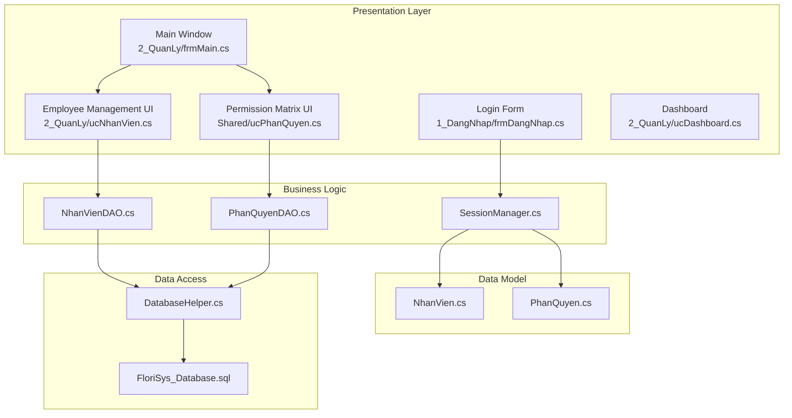
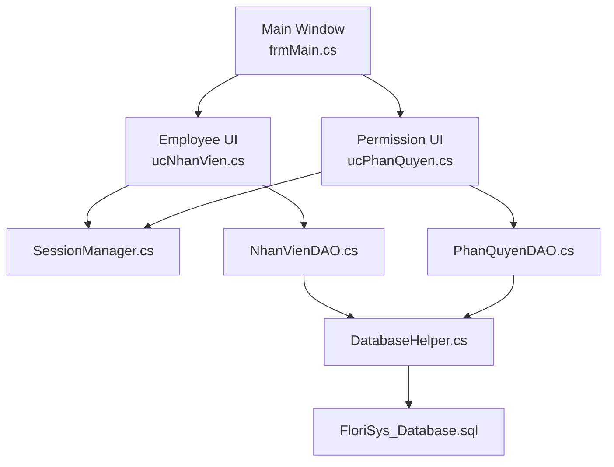
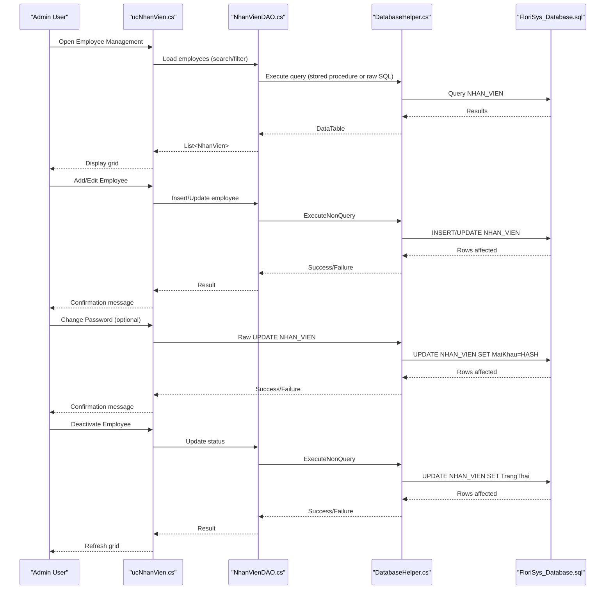
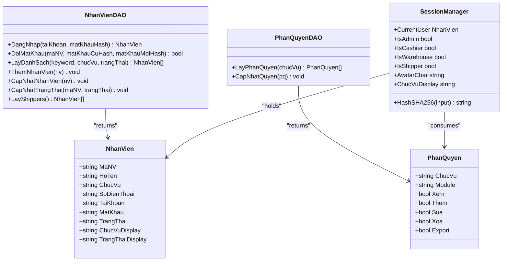
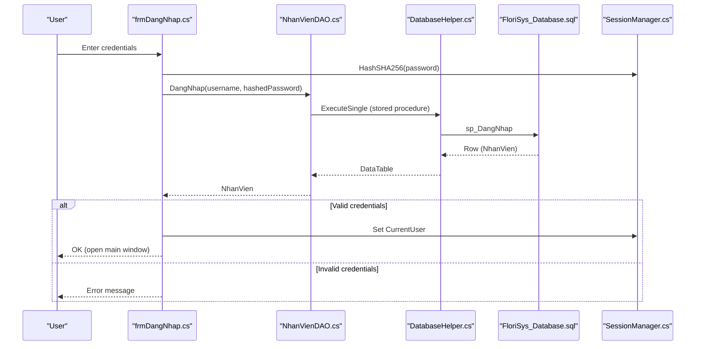
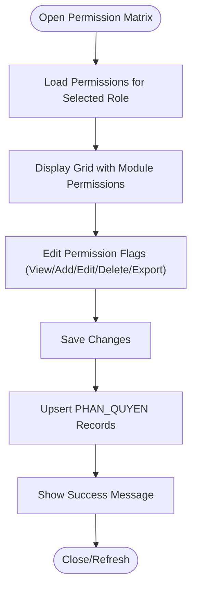
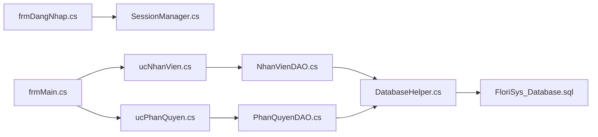

# Administration Module

<cite>
**Referenced Files in This Document**
- [Program.cs](file://Program.cs)
- [frmDangNhap.cs](file://1_DangNhap/frmDangNhap.cs)
- [frmMain.cs](file://2_QuanLy/frmMain.cs)
- [ucNhanVien.cs](file://2_QuanLy/ucNhanVien.cs)
- [ucPhanQuyen.cs](file://Shared/ucPhanQuyen.cs)
- [ucDashboard.cs](file://2_QuanLy/ucDashboard.cs)
- [NhanVien.cs](file://Models/NhanVien.cs)
- [PhanQuyen.cs](file://Models/PhanQuyen.cs)
- [NhanVienDAO.cs](file://DataAccess/NhanVienDAO.cs)
- [PhanQuyenDAO.cs](file://DataAccess/PhanQuyenDAO.cs)
- [DatabaseHelper.cs](file://DataAccess/DatabaseHelper.cs)
- [SessionManager.cs](file://Services/SessionManager.cs)
- [FloriSys_Database.sql](file://FloriSys_Database.sql)
- [fix_sp.sql](file://fix_sp.sql)
- [fix_sp2.sql](file://fix_sp2.sql)
</cite>

## Table of Contents
1. [Introduction](#introduction)
2. [Project Structure](#project-structure)
3. [Core Components](#core-components)
4. [Architecture Overview](#architecture-overview)
5. [Detailed Component Analysis](#detailed-component-analysis)
6. [Dependency Analysis](#dependency-analysis)
7. [Performance Considerations](#performance-considerations)
8. [Troubleshooting Guide](#troubleshooting-guide)
9. [Conclusion](#conclusion)
10. [Appendices](#appendices)

## Introduction
This document provides comprehensive administration documentation for the FloriSys Administration Module. It covers employee management operations, role assignments, permission configurations, and the end-to-end user administration workflow from onboarding to offboarding. It also explains the role-based access control (RBAC) system, permission matrix management, security policy enforcement, and administrative procedures for user provisioning, access revocation, and audit trail maintenance. Guidance for system administration, user training programs, and best practices is included to support efficient and secure operations.

## Project Structure
The Administration Module spans several layers:
- Presentation Layer: Login form, main window, dashboards, and administrative user controls.
- Business Logic Layer: Data Access Objects (DAOs) and service utilities.
- Data Model Layer: Strongly typed models for employees and permissions.
- Data Access Layer: Centralized database helper and stored procedures.
- Security Layer: Session management and hashing utilities.

**Diagram sources**
- [Program.cs:12-22](file://Program.cs#L12-L22)
- [frmDangNhap.cs:22-60](file://1_DangNhap/frmDangNhap.cs#L22-L60)
- [frmMain.cs:21-137](file://2_QuanLy/frmMain.cs#L21-L137)
- [ucNhanVien.cs:31-173](file://2_QuanLy/ucNhanVien.cs#L31-L173)
- [ucPhanQuyen.cs:63-102](file://Shared/ucPhanQuyen.cs#L63-L102)
- [ucDashboard.cs:18-94](file://2_QuanLy/ucDashboard.cs#L18-L94)
- [NhanVienDAO.cs:31-96](file://DataAccess/NhanVienDAO.cs#L31-L96)
- [PhanQuyenDAO.cs:9-31](file://DataAccess/PhanQuyenDAO.cs#L9-L31)
- [SessionManager.cs:7-61](file://Services/SessionManager.cs#L7-L61)
- [DatabaseHelper.cs:99-210](file://DataAccess/DatabaseHelper.cs#L99-L210)
- [FloriSys_Database.sql:22-177](file://FloriSys_Database.sql#L22-L177)

**Section sources**
- [Program.cs:12-22](file://Program.cs#L12-L22)
- [FloriSys_Database.sql:22-177](file://FloriSys_Database.sql#L22-L177)

## Core Components
- Employee Management UI: Adds, updates, and deactivates employees; manages profiles and passwords.
- Permission Matrix UI: Manages role-based permissions per module.
- Session Manager: Stores current user context, exposes role checks, and hashes passwords.
- DAOs: Encapsulate CRUD operations for employees and permissions.
- Database Helper: Provides generic database operations and connection management.
- Database Schema: Defines tables, constraints, triggers, and stored procedures supporting RBAC and workflows.

**Section sources**
- [ucNhanVien.cs:31-173](file://2_QuanLy/ucNhanVien.cs#L31-L173)
- [ucPhanQuyen.cs:63-102](file://Shared/ucPhanQuyen.cs#L63-L102)
- [SessionManager.cs:7-61](file://Services/SessionManager.cs#L7-L61)
- [NhanVienDAO.cs:31-96](file://DataAccess/NhanVienDAO.cs#L31-L96)
- [PhanQuyenDAO.cs:9-31](file://DataAccess/PhanQuyenDAO.cs#L9-L31)
- [DatabaseHelper.cs:99-210](file://DataAccess/DatabaseHelper.cs#L99-L210)
- [FloriSys_Database.sql:22-177](file://FloriSys_Database.sql#L22-L177)

## Architecture Overview
The Administration Module follows a layered architecture:
- UI layer handles user interactions for employee and permission management.
- Service layer centralizes session and hashing logic.
- Data access layer abstracts database operations and stored procedure calls.
- Data model layer defines strongly typed entities for domain objects.

**Diagram sources**
- [ucNhanVien.cs:31-173](file://2_QuanLy/ucNhanVien.cs#L31-L173)
- [ucPhanQuyen.cs:63-102](file://Shared/ucPhanQuyen.cs#L63-L102)
- [frmMain.cs:93-98](file://2_QuanLy/frmMain.cs#L93-L98)
- [SessionManager.cs:7-61](file://Services/SessionManager.cs#L7-L61)
- [NhanVienDAO.cs:31-96](file://DataAccess/NhanVienDAO.cs#L31-L96)
- [PhanQuyenDAO.cs:9-31](file://DataAccess/PhanQuyenDAO.cs#L9-L31)
- [DatabaseHelper.cs:99-210](file://DataAccess/DatabaseHelper.cs#L99-L210)
- [FloriSys_Database.sql:22-177](file://FloriSys_Database.sql#L22-L177)

## Detailed Component Analysis

### Employee Management Workflow
This workflow covers onboarding, profile updates, password changes, and offboarding.

**Diagram sources**
- [ucNhanVien.cs:31-173](file://2_QuanLy/ucNhanVien.cs#L31-L173)
- [NhanVienDAO.cs:31-96](file://DataAccess/NhanVienDAO.cs#L31-L96)
- [DatabaseHelper.cs:144-172](file://DataAccess/DatabaseHelper.cs#L144-L172)
- [FloriSys_Database.sql:253-280](file://FloriSys_Database.sql#L253-L280)

**Section sources**
- [ucNhanVien.cs:31-173](file://2_QuanLy/ucNhanVien.cs#L31-L173)
- [NhanVienDAO.cs:31-96](file://DataAccess/NhanVienDAO.cs#L31-L96)
- [DatabaseHelper.cs:144-172](file://DataAccess/DatabaseHelper.cs#L144-L172)
- [FloriSys_Database.sql:253-280](file://FloriSys_Database.sql#L253-L280)

### Role-Based Access Control (RBAC) and Permission Matrix
The RBAC system is defined by roles and permission matrices per module. Administrators manage permissions centrally via the Permission Matrix UI.

**Diagram sources**
- [NhanVien.cs:5-39](file://Models/NhanVien.cs#L5-L39)
- [PhanQuyen.cs:3-14](file://Models/PhanQuyen.cs#L3-L14)
- [NhanVienDAO.cs:11-96](file://DataAccess/NhanVienDAO.cs#L11-L96)
- [PhanQuyenDAO.cs:9-31](file://DataAccess/PhanQuyenDAO.cs#L9-L31)
- [SessionManager.cs:7-61](file://Services/SessionManager.cs#L7-L61)

**Section sources**
- [ucPhanQuyen.cs:63-102](file://Shared/ucPhanQuyen.cs#L63-L102)
- [PhanQuyenDAO.cs:9-31](file://DataAccess/PhanQuyenDAO.cs#L9-L31)
- [FloriSys_Database.sql:167-177](file://FloriSys_Database.sql#L167-L177)

### Login and Session Management
The login process authenticates users against the database and initializes the session.

**Diagram sources**
- [frmDangNhap.cs:22-60](file://1_DangNhap/frmDangNhap.cs#L22-L60)
- [NhanVienDAO.cs:11-18](file://DataAccess/NhanVienDAO.cs#L11-L18)
- [DatabaseHelper.cs:37-52](file://DataAccess/DatabaseHelper.cs#L37-L52)
- [FloriSys_Database.sql:253-262](file://FloriSys_Database.sql#L253-L262)
- [SessionManager.cs:7-61](file://Services/SessionManager.cs#L7-L61)

**Section sources**
- [frmDangNhap.cs:22-60](file://1_DangNhap/frmDangNhap.cs#L22-L60)
- [NhanVienDAO.cs:11-18](file://DataAccess/NhanVienDAO.cs#L11-L18)
- [DatabaseHelper.cs:37-52](file://DataAccess/DatabaseHelper.cs#L37-L52)
- [FloriSys_Database.sql:253-262](file://FloriSys_Database.sql#L253-L262)
- [SessionManager.cs:7-61](file://Services/SessionManager.cs#L7-L61)

### Permission Matrix Management
Administrators update role permissions per module and persist changes to the database.

**Diagram sources**
- [ucPhanQuyen.cs:63-102](file://Shared/ucPhanQuyen.cs#L63-L102)
- [PhanQuyenDAO.cs:9-31](file://DataAccess/PhanQuyenDAO.cs#L9-L31)
- [FloriSys_Database.sql:167-177](file://FloriSys_Database.sql#L167-L177)

**Section sources**
- [ucPhanQuyen.cs:63-102](file://Shared/ucPhanQuyen.cs#L63-L102)
- [PhanQuyenDAO.cs:9-31](file://DataAccess/PhanQuyenDAO.cs#L9-L31)
- [FloriSys_Database.sql:167-177](file://FloriSys_Database.sql#L167-L177)

### Organizational Chart and Department Structures
- The database schema defines roles (Admin, Cashier, Warehouse, Shipper) and employee records with status (Active/Inactive).
- The system does not define separate departments or hierarchical reporting relationships in the provided schema. Organizational charts and reporting lines are not implemented in the current codebase.

**Section sources**
- [FloriSys_Database.sql:22-31](file://FloriSys_Database.sql#L22-L31)
- [NhanVien.cs:15-37](file://Models/NhanVien.cs#L15-L37)

### Administrative Procedures
- User Provisioning: Create employee records with generated IDs, default password, and initial role assignment.
- Access Revocation: Deactivate employees by updating status to inactive.
- Audit Trail Maintenance: The schema does not include explicit audit tables or triggers for administrative actions. Consider adding audit logs for sensitive operations.

**Section sources**
- [ucNhanVien.cs:121-173](file://2_QuanLy/ucNhanVien.cs#L121-L173)
- [NhanVienDAO.cs:82-90](file://DataAccess/NhanVienDAO.cs#L82-L90)
- [FloriSys_Database.sql:22-31](file://FloriSys_Database.sql#L22-L31)

### Security Policy Enforcement
- Password hashing: SHA-256 hashing is applied before storing or verifying passwords.
- Login validation: Authentication checks credentials and active status.
- Role checks: Session manager exposes role flags for UI and business logic decisions.

**Section sources**
- [SessionManager.cs:31-41](file://Services/SessionManager.cs#L31-L41)
- [frmDangNhap.cs:35-53](file://1_DangNhap/frmDangNhap.cs#L35-L53)
- [NhanVienDAO.cs:11-18](file://DataAccess/NhanVienDAO.cs#L11-L18)
- [FloriSys_Database.sql:253-262](file://FloriSys_Database.sql#L253-L262)

### User Training Programs and Best Practices
- Training topics: Employee onboarding/offboarding, password policies, role assignment, permission matrix management, and security awareness.
- Best practices: Enforce strong passwords, regularly review permissions, maintain audit logs, and limit Admin access.

[No sources needed since this section provides general guidance]

## Dependency Analysis
The following diagram shows key dependencies among components involved in administration.

**Diagram sources**
- [frmDangNhap.cs:22-60](file://1_DangNhap/frmDangNhap.cs#L22-L60)
- [SessionManager.cs:7-61](file://Services/SessionManager.cs#L7-L61)
- [frmMain.cs:93-98](file://2_QuanLy/frmMain.cs#L93-L98)
- [ucNhanVien.cs:31-173](file://2_QuanLy/ucNhanVien.cs#L31-L173)
- [ucPhanQuyen.cs:63-102](file://Shared/ucPhanQuyen.cs#L63-L102)
- [NhanVienDAO.cs:31-96](file://DataAccess/NhanVienDAO.cs#L31-L96)
- [PhanQuyenDAO.cs:9-31](file://DataAccess/PhanQuyenDAO.cs#L9-L31)
- [DatabaseHelper.cs:99-210](file://DataAccess/DatabaseHelper.cs#L99-L210)
- [FloriSys_Database.sql:22-177](file://FloriSys_Database.sql#L22-L177)

**Section sources**
- [Program.cs:12-22](file://Program.cs#L12-L22)
- [frmMain.cs:21-137](file://2_QuanLy/frmMain.cs#L21-L137)
- [ucNhanVien.cs:31-173](file://2_QuanLy/ucNhanVien.cs#L31-L173)
- [ucPhanQuyen.cs:63-102](file://Shared/ucPhanQuyen.cs#L63-L102)
- [NhanVienDAO.cs:31-96](file://DataAccess/NhanVienDAO.cs#L31-L96)
- [PhanQuyenDAO.cs:9-31](file://DataAccess/PhanQuyenDAO.cs#L9-L31)
- [DatabaseHelper.cs:99-210](file://DataAccess/DatabaseHelper.cs#L99-L210)
- [FloriSys_Database.sql:22-177](file://FloriSys_Database.sql#L22-L177)

## Performance Considerations
- Use stored procedures for frequently executed operations to reduce parsing overhead.
- Apply appropriate indexes on frequently filtered columns (e.g., TaiKhoan, MaNV).
- Batch updates for permission changes to minimize round trips.
- Consider pagination for large employee lists to improve UI responsiveness.

[No sources needed since this section provides general guidance]

## Troubleshooting Guide
Common issues and resolutions:
- Login failures: Verify username/password and account status; ensure hashing is applied before authentication.
- Permission updates not saving: Confirm grid editing completes and upsert logic executes successfully.
- Employee status not changing: Check DAO update method and database constraints.
- Connection errors: Validate connection string and database availability.

**Section sources**
- [frmDangNhap.cs:35-59](file://1_DangNhap/frmDangNhap.cs#L35-L59)
- [ucPhanQuyen.cs:86-102](file://Shared/ucPhanQuyen.cs#L86-L102)
- [NhanVienDAO.cs:82-90](file://DataAccess/NhanVienDAO.cs#L82-L90)
- [DatabaseHelper.cs:99-102](file://DataAccess/DatabaseHelper.cs#L99-L102)

## Conclusion
The FloriSys Administration Module provides robust capabilities for employee management and role-based permissions. The UI components integrate seamlessly with DAOs and the database schema to support end-to-end administrative workflows. Enhancements such as audit logging, organizational hierarchy modeling, and department structures would further strengthen the system’s governance and operational efficiency.

[No sources needed since this section summarizes without analyzing specific files]

## Appendices

### Appendix A: Stored Procedures and Triggers Reference
- Authentication and password change procedures.
- Inventory and order lifecycle procedures.
- Utility procedures for ID generation and reporting.

**Section sources**
- [FloriSys_Database.sql:253-280](file://FloriSys_Database.sql#L253-L280)
- [FloriSys_Database.sql:282-358](file://FloriSys_Database.sql#L282-L358)
- [FloriSys_Database.sql:360-411](file://FloriSys_Database.sql#L360-L411)
- [FloriSys_Database.sql:413-449](file://FloriSys_Database.sql#L413-L449)
- [FloriSys_Database.sql:451-461](file://FloriSys_Database.sql#L451-L461)
- [FloriSys_Database.sql:463-531](file://FloriSys_Database.sql#L463-L531)
- [FloriSys_Database.sql:533-547](file://FloriSys_Database.sql#L533-L547)
- [FloriSys_Database.sql:549-563](file://FloriSys_Database.sql#L549-L563)
- [fix_sp.sql:2-35](file://fix_sp.sql#L2-L35)
- [fix_sp2.sql:2-35](file://fix_sp2.sql#L2-L35)

### Appendix B: Database Schema Highlights
- Employee table with role and status constraints.
- Permission matrix table with composite primary key.
- Triggers for inventory and order totals.
- Sample data and initial permissions.

**Section sources**
- [FloriSys_Database.sql:22-31](file://FloriSys_Database.sql#L22-L31)
- [FloriSys_Database.sql:167-177](file://FloriSys_Database.sql#L167-L177)
- [FloriSys_Database.sql:209-247](file://FloriSys_Database.sql#L209-L247)
- [FloriSys_Database.sql:569-670](file://FloriSys_Database.sql#L569-L670)