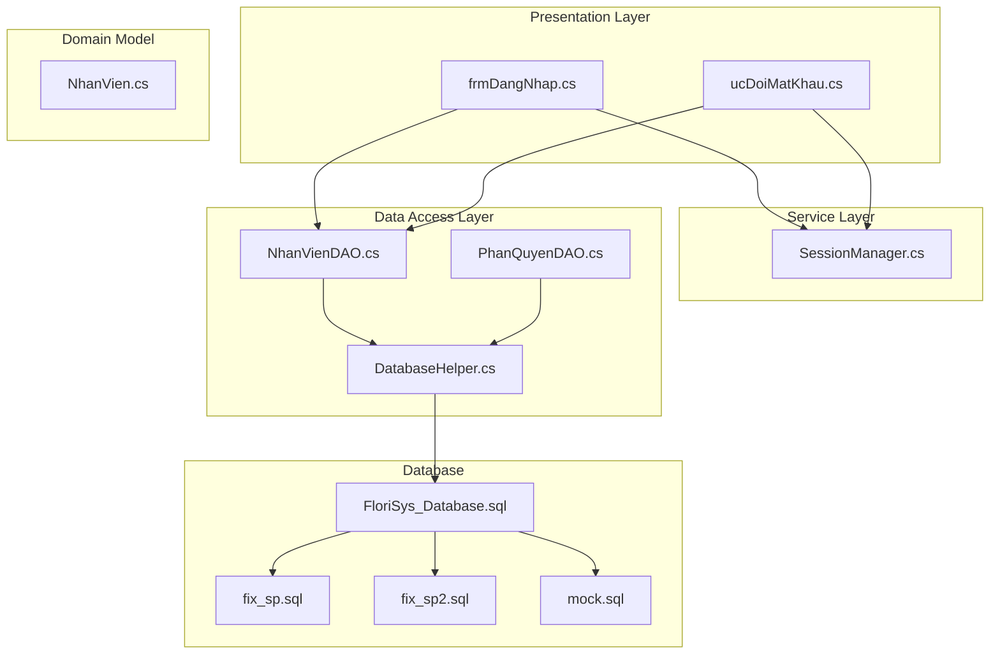
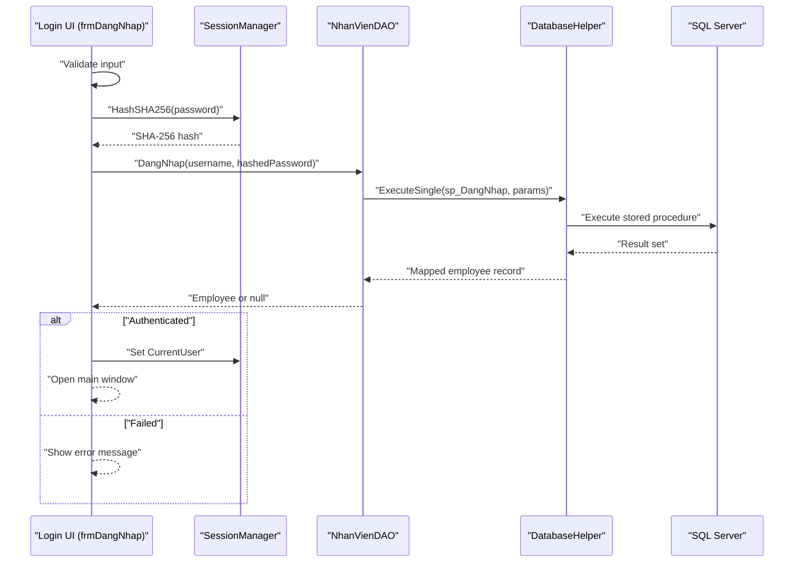
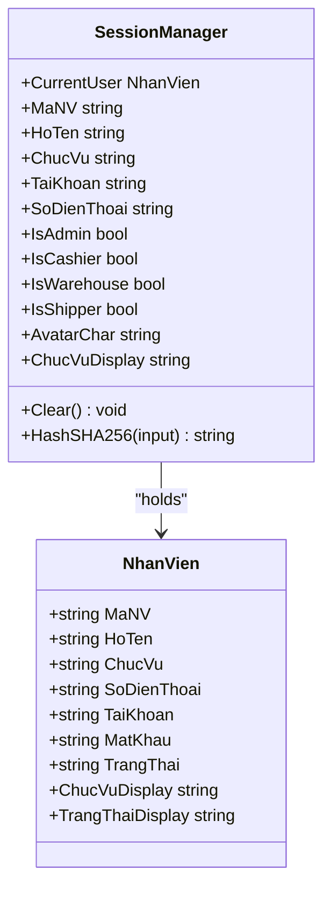
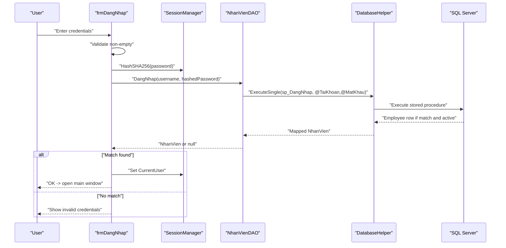
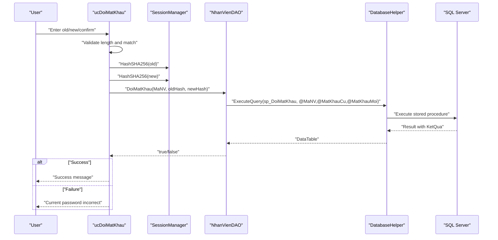
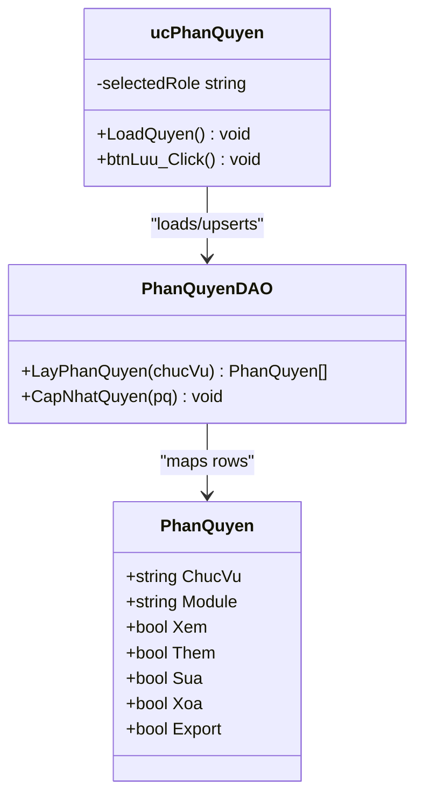
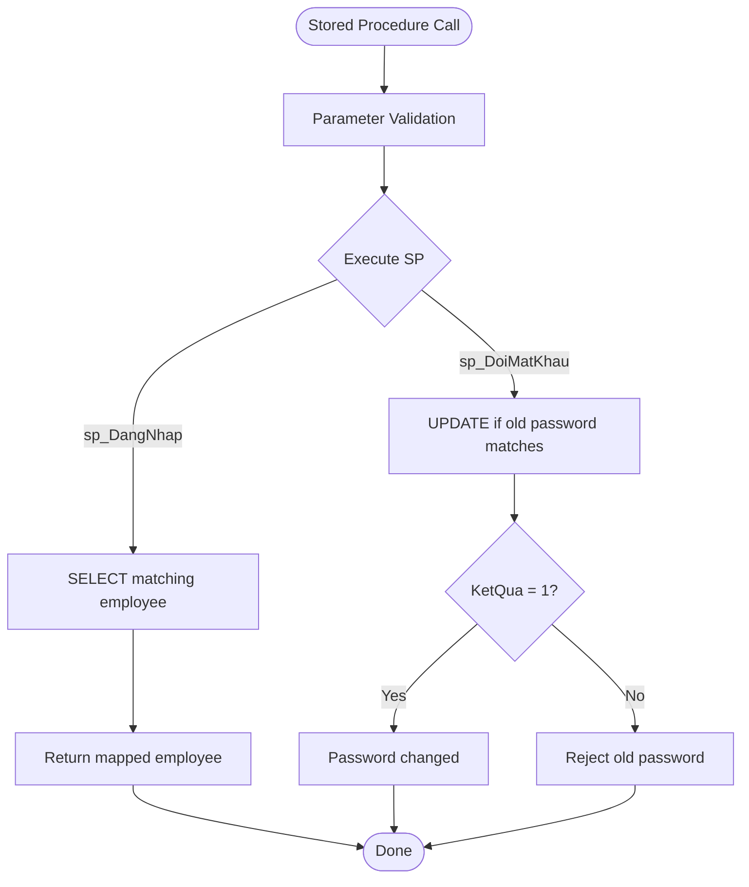
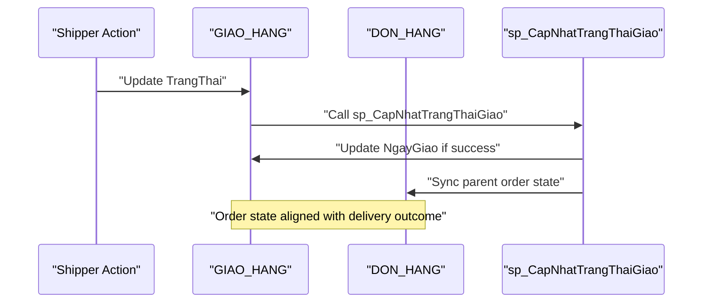
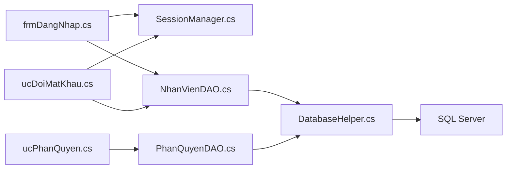

# Authentication & Security

<cite>
**Referenced Files in This Document**
- [Program.cs](file://Program.cs)
- [frmDangNhap.cs](file://1_DangNhap/frmDangNhap.cs)
- [ucDoiMatKhau.cs](file://1_DangNhap/ucDoiMatKhau.cs)
- [SessionManager.cs](file://Services/SessionManager.cs)
- [NhanVienDAO.cs](file://DataAccess/NhanVienDAO.cs)
- [DatabaseHelper.cs](file://DataAccess/DatabaseHelper.cs)
- [NhanVien.cs](file://Models/NhanVien.cs)
- [PhanQuyenDAO.cs](file://DataAccess/PhanQuyenDAO.cs)
- [ucPhanQuyen.cs](file://Shared/ucPhanQuyen.cs)
- [FloriSys_Database.sql](file://FloriSys_Database.sql)
- [fix_sp.sql](file://fix_sp.sql)
- [fix_sp2.sql](file://fix_sp2.sql)
- [mock.sql](file://mock.sql)
</cite>

## Table of Contents
1. [Introduction](#introduction)
2. [Project Structure](#project-structure)
3. [Core Components](#core-components)
4. [Architecture Overview](#architecture-overview)
5. [Detailed Component Analysis](#detailed-component-analysis)
6. [Dependency Analysis](#dependency-analysis)
7. [Performance Considerations](#performance-considerations)
8. [Troubleshooting Guide](#troubleshooting-guide)
9. [Conclusion](#conclusion)
10. [Appendices](#appendices)

## Introduction
This document provides comprehensive authentication and security documentation for FloriSys. It covers the multi-role authentication system (Admin, Cashier, Warehouse, Shipper), role-based access control (RBAC), password hashing using SHA-256, session management via SessionManager, secure login procedures, user registration, password change, and database-level protections. It also documents the permission matrix, access control patterns, and audit trail capabilities, along with best practices, password policy enforcement, and troubleshooting guidance.

## Project Structure
The authentication and security logic spans several layers:
- Presentation layer: Login form and password change control
- Service layer: Session management and cryptographic hashing
- Data Access layer: DAOs and database helpers
- Domain model: Employee entity
- RBAC: Permission matrix and role-based controls
- Database: Stored procedures, constraints, and triggers

**Diagram sources**
- [Program.cs:17-21](file://Program.cs#L17-L21)
- [frmDangNhap.cs:22-60](file://1_DangNhap/frmDangNhap.cs#L22-L60)
- [ucDoiMatKhau.cs:16-62](file://1_DangNhap/ucDoiMatKhau.cs#L16-L62)
- [SessionManager.cs:7-61](file://Services/SessionManager.cs#L7-L61)
- [NhanVienDAO.cs:9-99](file://DataAccess/NhanVienDAO.cs#L9-L99)
- [PhanQuyenDAO.cs:7-34](file://DataAccess/PhanQuyenDAO.cs#L7-L34)
- [DatabaseHelper.cs:10-212](file://DataAccess/DatabaseHelper.cs#L10-L212)
- [NhanVien.cs:5-40](file://Models/NhanVien.cs#L5-L40)
- [FloriSys_Database.sql:22-30](file://FloriSys_Database.sql#L22-L30)
- [fix_sp.sql:2-35](file://fix_sp.sql#L2-L35)
- [fix_sp2.sql:2-34](file://fix_sp2.sql#L2-L34)
- [mock.sql:1-62](file://mock.sql#L1-L62)

**Section sources**
- [Program.cs:17-21](file://Program.cs#L17-L21)
- [FloriSys_Database.sql:22-30](file://FloriSys_Database.sql#L22-L30)

## Core Components
- Multi-role authentication: Admin, Cashier, Warehouse, Shipper
- Password hashing: SHA-256 with UTF-8 encoding
- Session management: Static session holder with role checks
- Secure login: Parameterized stored procedure invocation
- Password change: Validation and parameterized update
- RBAC: Permission matrix per role and module
- Database-level protections: Constraints, stored procedures, parameterized queries

**Section sources**
- [SessionManager.cs:21-24](file://Services/SessionManager.cs#L21-L24)
- [SessionManager.cs:31-41](file://Services/SessionManager.cs#L31-L41)
- [NhanVienDAO.cs:11-18](file://DataAccess/NhanVienDAO.cs#L11-L18)
- [ucDoiMatKhau.cs:28-38](file://1_DangNhap/ucDoiMatKhau.cs#L28-L38)
- [PhanQuyenDAO.cs:9-13](file://DataAccess/PhanQuyenDAO.cs#L9-L13)
- [ucPhanQuyen.cs:63-84](file://Shared/ucPhanQuyen.cs#L63-L84)

## Architecture Overview
The authentication and security architecture follows a layered approach:
- UI triggers login/password change events
- Service layer hashes passwords and manages session state
- DAO layer executes parameterized stored procedures
- Database enforces constraints and encapsulates business logic in stored procedures

**Diagram sources**
- [frmDangNhap.cs:22-60](file://1_DangNhap/frmDangNhap.cs#L22-L60)
- [SessionManager.cs:31-41](file://Services/SessionManager.cs#L31-L41)
- [NhanVienDAO.cs:11-18](file://DataAccess/NhanVienDAO.cs#L11-L18)
- [DatabaseHelper.cs:37-42](file://DataAccess/DatabaseHelper.cs#L37-L42)
- [FloriSys_Database.sql:253-262](file://FloriSys_Database.sql#L253-L262)

## Detailed Component Analysis

### Session Management and Role Checks
SessionManager centralizes current user state and role-based access checks. It exposes computed properties for role membership and provides a SHA-256 hashing utility used by the login and password change flows.

**Diagram sources**
- [SessionManager.cs:7-61](file://Services/SessionManager.cs#L7-L61)
- [NhanVien.cs:5-40](file://Models/NhanVien.cs#L5-L40)

**Section sources**
- [SessionManager.cs:12-29](file://Services/SessionManager.cs#L12-L29)
- [SessionManager.cs:21-24](file://Services/SessionManager.cs#L21-L24)
- [SessionManager.cs:31-41](file://Services/SessionManager.cs#L31-L41)

### Login Flow and Secure Authentication
The login flow validates input, hashes the password, invokes a parameterized stored procedure, and sets the session upon success.

**Diagram sources**
- [frmDangNhap.cs:22-60](file://1_DangNhap/frmDangNhap.cs#L22-L60)
- [NhanVienDAO.cs:11-18](file://DataAccess/NhanVienDAO.cs#L11-L18)
- [DatabaseHelper.cs:37-42](file://DataAccess/DatabaseHelper.cs#L37-L42)
- [FloriSys_Database.sql:253-262](file://FloriSys_Database.sql#L253-L262)

**Section sources**
- [frmDangNhap.cs:22-60](file://1_DangNhap/frmDangNhap.cs#L22-L60)
- [NhanVienDAO.cs:11-18](file://DataAccess/NhanVienDAO.cs#L11-L18)
- [FloriSys_Database.sql:253-262](file://FloriSys_Database.sql#L253-L262)

### Password Change Workflow
Password change validates length and confirmation, hashes old and new passwords, and updates via a parameterized stored procedure.

**Diagram sources**
- [ucDoiMatKhau.cs:16-62](file://1_DangNhap/ucDoiMatKhau.cs#L16-L62)
- [SessionManager.cs:31-41](file://Services/SessionManager.cs#L31-L41)
- [NhanVienDAO.cs:20-29](file://DataAccess/NhanVienDAO.cs#L20-L29)
- [DatabaseHelper.cs:104-122](file://DataAccess/DatabaseHelper.cs#L104-L122)
- [FloriSys_Database.sql:265-279](file://FloriSys_Database.sql#L265-L279)

**Section sources**
- [ucDoiMatKhau.cs:16-62](file://1_DangNhap/ucDoiMatKhau.cs#L16-L62)
- [NhanVienDAO.cs:20-29](file://DataAccess/NhanVienDAO.cs#L20-L29)
- [FloriSys_Database.sql:265-279](file://FloriSys_Database.sql#L265-L279)

### Role-Based Access Control (RBAC)
RBAC is enforced through role checks in SessionManager and a permission matrix stored in PHAN_QUYEN. The UI component ucPhanQuyen loads permissions per role and allows updates.

**Diagram sources**
- [PhanQuyenDAO.cs:7-34](file://DataAccess/PhanQuyenDAO.cs#L7-L34)
- [ucPhanQuyen.cs:10-105](file://Shared/ucPhanQuyen.cs#L10-L105)
- [FloriSys_Database.sql:167-176](file://FloriSys_Database.sql#L167-L176)

**Section sources**
- [SessionManager.cs:21-24](file://Services/SessionManager.cs#L21-L24)
- [PhanQuyenDAO.cs:9-13](file://DataAccess/PhanQuyenDAO.cs#L9-L13)
- [ucPhanQuyen.cs:63-84](file://Shared/ucPhanQuyen.cs#L63-L84)
- [FloriSys_Database.sql:167-176](file://FloriSys_Database.sql#L167-L176)

### Database-Level Security and Stored Procedures
- NHAN_VIEN enforces role and status constraints and stores SHA-256 hashes
- Stored procedures sp_DangNhap and sp_DoiMatKhau encapsulate authentication and password change logic
- Parameterized queries prevent SQL injection
- Triggers automatically maintain inventory on stock entries

**Diagram sources**
- [FloriSys_Database.sql:253-279](file://FloriSys_Database.sql#L253-L279)
- [DatabaseHelper.cs:104-122](file://DataAccess/DatabaseHelper.cs#L104-L122)
- [NhanVienDAO.cs:11-29](file://DataAccess/NhanVienDAO.cs#L11-L29)

**Section sources**
- [FloriSys_Database.sql:22-30](file://FloriSys_Database.sql#L22-L30)
- [FloriSys_Database.sql:253-279](file://FloriSys_Database.sql#L253-L279)
- [DatabaseHelper.cs:104-122](file://DataAccess/DatabaseHelper.cs#L104-L122)
- [NhanVienDAO.cs:11-29](file://DataAccess/NhanVienDAO.cs#L11-L29)

### Audit Trail and Operational Controls
- GIAO_HANG and DON_HANG synchronization ensures order state reflects delivery actions
- Stored procedure fixes align operational states consistently
- Triggers maintain inventory accuracy post-stock entry

**Diagram sources**
- [fix_sp.sql:2-35](file://fix_sp.sql#L2-L35)
- [fix_sp2.sql:2-34](file://fix_sp2.sql#L2-L34)
- [FloriSys_Database.sql:236-247](file://FloriSys_Database.sql#L236-L247)

**Section sources**
- [fix_sp.sql:2-35](file://fix_sp.sql#L2-L35)
- [fix_sp2.sql:2-34](file://fix_sp2.sql#L2-L34)
- [FloriSys_Database.sql:236-247](file://FloriSys_Database.sql#L236-L247)

## Dependency Analysis
Authentication and security depend on:
- UI forms invoking service and DAO methods
- DAO relying on DatabaseHelper for parameterized execution
- Database enforcing constraints and encapsulating logic in stored procedures
- RBAC DAO mapping permissions to UI controls

**Diagram sources**
- [frmDangNhap.cs:22-60](file://1_DangNhap/frmDangNhap.cs#L22-L60)
- [ucDoiMatKhau.cs:16-62](file://1_DangNhap/ucDoiMatKhau.cs#L16-L62)
- [SessionManager.cs:31-41](file://Services/SessionManager.cs#L31-L41)
- [NhanVienDAO.cs:11-29](file://DataAccess/NhanVienDAO.cs#L11-L29)
- [ucPhanQuyen.cs:63-102](file://Shared/ucPhanQuyen.cs#L63-L102)
- [PhanQuyenDAO.cs:9-31](file://DataAccess/PhanQuyenDAO.cs#L9-L31)
- [DatabaseHelper.cs:104-187](file://DataAccess/DatabaseHelper.cs#L104-L187)

**Section sources**
- [NhanVienDAO.cs:11-29](file://DataAccess/NhanVienDAO.cs#L11-L29)
- [PhanQuyenDAO.cs:9-31](file://DataAccess/PhanQuyenDAO.cs#L9-L31)
- [DatabaseHelper.cs:104-187](file://DataAccess/DatabaseHelper.cs#L104-L187)

## Performance Considerations
- SHA-256 hashing is lightweight and fast; negligible overhead for login/change operations
- Parameterized stored procedures and queries avoid recompilation overhead and reduce CPU usage
- Using single-row retrieval for login minimizes result set size
- Keep UI responsive by performing hashing and database calls off the UI thread (current code appears synchronous; consider async patterns for scalability)

## Troubleshooting Guide
Common issues and resolutions:
- Login fails with invalid credentials
  - Verify username and password are non-empty
  - Confirm account is active (status check in stored procedure)
  - Ensure password is hashed before login
- Password change rejected
  - Confirm old password hash matches stored hash
  - Enforce minimum length and confirmation match
- Database connection errors
  - Check connection string configuration
  - Verify stored procedures exist and are up-to-date
- Permission denied
  - Review PHAN_QUYEN mapping for the role and module
  - Ensure ucPhanQuyen updates persisted after changes

**Section sources**
- [frmDangNhap.cs:27-59](file://1_DangNhap/frmDangNhap.cs#L27-L59)
- [ucDoiMatKhau.cs:22-61](file://1_DangNhap/ucDoiMatKhau.cs#L22-L61)
- [NhanVienDAO.cs:11-18](file://DataAccess/NhanVienDAO.cs#L11-L18)
- [PhanQuyenDAO.cs:9-13](file://DataAccess/PhanQuyenDAO.cs#L9-L13)

## Conclusion
FloriSys implements a robust, layered authentication and security model:
- Strong client-side hashing with SHA-256
- Parameterized stored procedures and DAOs preventing SQL injection
- Role-based access control with a configurable permission matrix
- Database constraints ensuring data integrity
- Operational safeguards via stored procedure fixes and triggers

## Appendices

### Password Policy Enforcement
- Minimum password length: 6 characters
- Confirmation match required during change
- SHA-256 hashing applied consistently for storage and verification

**Section sources**
- [ucDoiMatKhau.cs:28-38](file://1_DangNhap/ucDoiMatKhau.cs#L28-L38)
- [SessionManager.cs:31-41](file://Services/SessionManager.cs#L31-L41)

### Permission Matrix Reference
- Roles: Admin, Cashier, Warehouse, Shipper
- Modules: Inventory, Orders, Delivery, HR, Reports
- Permissions: View, Add, Edit, Delete, Export

**Section sources**
- [ucPhanQuyen.cs:63-84](file://Shared/ucPhanQuyen.cs#L63-L84)
- [FloriSys_Database.sql:167-176](file://FloriSys_Database.sql#L167-L176)

### Stored Procedures and Triggers
- sp_DangNhap: Login validation with active status
- sp_DoiMatKhau: Conditional password update
- sp_CapNhatTrangThaiGiao: Delivery state synchronization
- Trigger: Automatic inventory adjustment on stock entry

**Section sources**
- [FloriSys_Database.sql:253-279](file://FloriSys_Database.sql#L253-L279)
- [fix_sp.sql:2-35](file://fix_sp.sql#L2-L35)
- [fix_sp2.sql:2-34](file://fix_sp2.sql#L2-L34)
- [FloriSys_Database.sql:236-247](file://FloriSys_Database.sql#L236-L247)