# Business Models

<cite>
**Referenced Files in This Document**
- [NhanVien.cs](file://Models/NhanVien.cs)
- [SanPham.cs](file://Models/SanPham.cs)
- [KhachHang.cs](file://Models/KhachHang.cs)
- [DonHang.cs](file://Models/DonHang.cs)
- [GiaoHang.cs](file://Models/GiaoHang.cs)
- [PhieuNhapKho.cs](file://Models/PhieuNhapKho.cs)
- [PhanHoi.cs](file://Models/PhanHoi.cs)
- [PhanQuyen.cs](file://Models/PhanQuyen.cs)
- [HangHu.cs](file://Models/HangHu.cs)
- [TraHang.cs](file://Models/TraHang.cs)
- [BaoCaoModels.cs](file://Models/BaoCaoModels.cs)
- [FloriSys_Database.sql](file://FloriSys_Database.sql)
- [DatabaseHelper.cs](file://DataAccess/DatabaseHelper.cs)
- [NhanVienDAO.cs](file://DataAccess/NhanVienDAO.cs)
- [SanPhamDAO.cs](file://DataAccess/SanPhamDAO.cs)
- [DonHangDAO.cs](file://DataAccess/DonHangDAO.cs)
</cite>

## Table of Contents
1. [Introduction](#introduction)
2. [Project Structure](#project-structure)
3. [Core Components](#core-components)
4. [Architecture Overview](#architecture-overview)
5. [Detailed Component Analysis](#detailed-component-analysis)
6. [Dependency Analysis](#dependency-analysis)
7. [Performance Considerations](#performance-considerations)
8. [Troubleshooting Guide](#troubleshooting-guide)
9. [Conclusion](#conclusion)
10. [Appendices](#appendices)

## Introduction
This document describes the business models used by FloriSys, a flower shop management system. It covers core business entities (Employees, Products, Customers, Orders, Deliveries, Purchase Orders, Feedback, Permissions, Damaged Goods, Returns, and Reporting Models), their properties, data types, validations, computed display properties, navigation relationships, and how they integrate with stored procedures and UI components. It also explains data transformation patterns via reflection-based mapping and outlines usage scenarios across modules such as Sales, Warehouse, Shipping, and Reporting.

## Project Structure
The business models are defined under the Models folder as simple classes. Data access is handled by DAO classes that call stored procedures and raw SQL, returning strongly typed model instances. The database schema and constraints are defined in the SQL script. The mapping layer uses a generic reflection-based helper to convert database results into model objects.

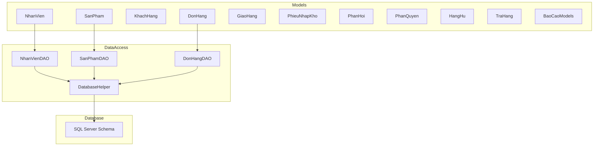

**Diagram sources**
- [DatabaseHelper.cs:10-212](file://DataAccess/DatabaseHelper.cs#L10-L212)
- [NhanVienDAO.cs:9-99](file://DataAccess/NhanVienDAO.cs#L9-L99)
- [SanPhamDAO.cs:9-96](file://DataAccess/SanPhamDAO.cs#L9-L96)
- [DonHangDAO.cs:9-114](file://DataAccess/DonHangDAO.cs#L9-L114)
- [FloriSys_Database.sql:1-706](file://FloriSys_Database.sql#L1-L706)

**Section sources**
- [DatabaseHelper.cs:10-212](file://DataAccess/DatabaseHelper.cs#L10-L212)
- [FloriSys_Database.sql:1-706](file://FloriSys_Database.sql#L1-L706)

## Core Components
This section summarizes each business model’s purpose, key properties, computed display fields, and relationships.

- Employees (NhanVien)
  - Purpose: Represents staff members with roles and account credentials.
  - Key properties: Identifier, name, role, phone, account, password hash, status.
  - Display properties: Role and status translated for UI.
  - Validation: Role and status constrained by database checks; password stored hashed.
  - Relationships: Creates orders; can be assigned as delivery personnel.

- Products (SanPham)
  - Purpose: Catalog of flowers and accessories with pricing and inventory thresholds.
  - Key properties: Identifier, name, category, selling price, purchase price, stock quantity, minimum stock threshold, status.
  - Display properties: Status translation; computed “condition” for low-stock reporting.
  - Validation: Prices and quantities non-negative; thresholds enforced; status constrained.

- Customers (KhachHang)
  - Purpose: Client base with contact details and creation date.
  - Key properties: Identifier, name, phone, address, email, registration date.
  - Additional: Aggregated order count for reporting dashboards.

- Orders (DonHang) and Order Items (ChiTietDonHang)
  - Purpose: Sales records and per-item line items.
  - Key properties: Order identifier, creation date, customer and cashier identifiers, delivery method, status, total amount, note.
  - Join fields: Customer and cashier names for UI convenience.
  - Navigation: One-to-many with order items.
  - Display properties: Status and delivery method translations.
  - Validation: Delivery method and status constrained; triggers compute totals and update stock.

- Deliveries (GiaoHang) and Shipper Statistics (ThongKeShipper)
  - Purpose: Delivery assignments and performance metrics.
  - Key properties: Delivery identifier, order identifier, shipper identifier, delivery date, status, delivery note.
  - Join fields: Customer info, shipper name, order total and note.
  - Display properties: Status translation.
  - Relationships: One-to-one with orders; optional many-to-one with employees.

- Purchase Orders (PhieuNhapKho) and Purchase Items (ChiTietNhapKho)
  - Purpose: Inventory receipts and per-item entries.
  - Key properties: Receipt identifier, date, staff identifier, note; aggregated counts and totals.
  - Navigation: One-to-many with receipt items.
  - Relationships: Receipt items link to products.

- Feedback (PhanHoi)
  - Purpose: Customer feedback linked to orders.
  - Key properties: Identifier, order identifier, content, timestamp, processing status, resolution result.
  - Join field: Customer name.
  - Display properties: Processing status translation.

- Permissions (PhanQuyen)
  - Purpose: Role-based module permissions (view, add, edit, delete, export).
  - Key properties: Role, module, flags for actions.

- Damaged Goods (HangHu)
  - Purpose: Records of damaged items with reasons and notes.
  - Key properties: Identifier, product identifier, name, quantity, reason, date, note.

- Returns (TraHang) and Return Items (ChiTietTraHang)
  - Purpose: Return requests and per-item outcomes.
  - Key properties: Return identifier, order identifier, reason, refund method, note, date; navigation to items.
  - Display properties: Refund method translation.

- Reporting Models (BaoCaoModels)
  - Purpose: DTOs for dashboard and report views.
  - Examples: Revenue summaries, top-selling products, employee performance, dashboard KPIs, daily revenue charts, pending dispatch orders.

**Section sources**
- [NhanVien.cs:5-39](file://Models/NhanVien.cs#L5-L39)
- [SanPham.cs:5-42](file://Models/SanPham.cs#L5-L42)
- [KhachHang.cs:5-18](file://Models/KhachHang.cs#L5-L18)
- [DonHang.cs:6-63](file://Models/DonHang.cs#L6-L63)
- [GiaoHang.cs:5-47](file://Models/GiaoHang.cs#L5-L47)
- [PhieuNhapKho.cs:6-33](file://Models/PhieuNhapKho.cs#L6-L33)
- [PhanHoi.cs:5-32](file://Models/PhanHoi.cs#L5-L32)
- [PhanQuyen.cs:3-14](file://Models/PhanQuyen.cs#L3-L14)
- [HangHu.cs:5-16](file://Models/HangHu.cs#L5-L16)
- [TraHang.cs:6-42](file://Models/TraHang.cs#L6-L42)
- [BaoCaoModels.cs:8-131](file://Models/BaoCaoModels.cs#L8-L131)

## Architecture Overview
The system follows a layered pattern:
- UI Layer: WinForms user controls for each module (Sales, Warehouse, Shipping, Reporting).
- Business Logic Layer: Models define domain structures and computed properties for display.
- Data Access Layer: DAO classes encapsulate CRUD and reporting queries, invoking stored procedures and raw SQL.
- Persistence Layer: SQL Server schema with constraints, triggers, and stored procedures enforcing business rules.

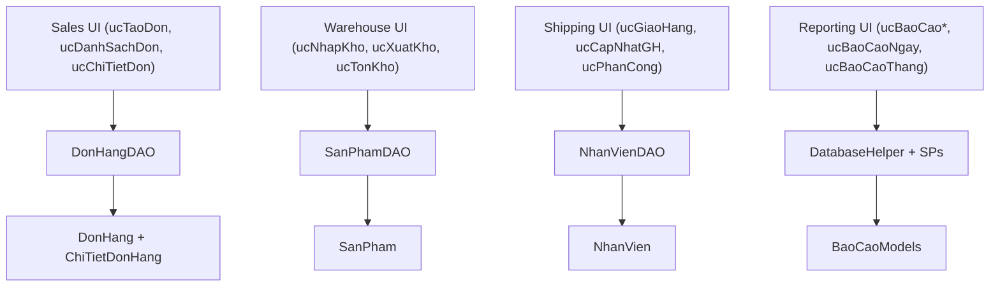

**Diagram sources**
- [DonHangDAO.cs:9-114](file://DataAccess/DonHangDAO.cs#L9-L114)
- [SanPhamDAO.cs:9-96](file://DataAccess/SanPhamDAO.cs#L9-L96)
- [NhanVienDAO.cs:9-99](file://DataAccess/NhanVienDAO.cs#L9-L99)
- [DatabaseHelper.cs:10-212](file://DataAccess/DatabaseHelper.cs#L10-L212)
- [DonHang.cs:6-63](file://Models/DonHang.cs#L6-L63)
- [SanPham.cs:5-42](file://Models/SanPham.cs#L5-L42)
- [NhanVien.cs:5-39](file://Models/NhanVien.cs#L5-L39)
- [BaoCaoModels.cs:8-131](file://Models/BaoCaoModels.cs#L8-L131)

## Detailed Component Analysis

### Employees (NhanVien)
- Purpose: Store staff identity, role, contact, credentials, and employment status.
- Data types and constraints:
  - Role: Enum-like values enforced by database check constraint.
  - Status: Enum-like values enforced by database check constraint.
  - Password: Stored as hashed value.
- Computed display: Role and status localized for UI.
- Usage: Created by HR/Admin; referenced by orders and deliveries; filtered by status for active users.

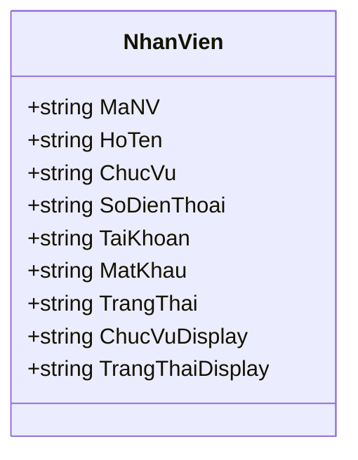

**Diagram sources**
- [NhanVien.cs:5-39](file://Models/NhanVien.cs#L5-L39)
- [FloriSys_Database.sql:22-30](file://FloriSys_Database.sql#L22-L30)

**Section sources**
- [NhanVien.cs:5-39](file://Models/NhanVien.cs#L5-L39)
- [NhanVienDAO.cs:9-99](file://DataAccess/NhanVienDAO.cs#L9-L99)
- [FloriSys_Database.sql:22-30](file://FloriSys_Database.sql#L22-L30)

### Products (SanPham)
- Purpose: Product catalog with pricing and inventory thresholds.
- Data types and constraints:
  - Prices and quantities non-negative; thresholds enforced; status constrained.
- Computed display: Status and condition (“low stock” categories).
- Usage: Queried for sales, warehouse alerts, and reports.

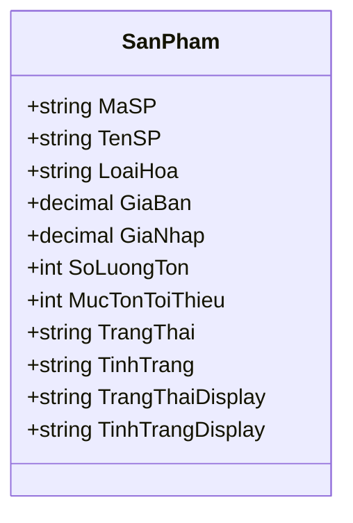

**Diagram sources**
- [SanPham.cs:5-42](file://Models/SanPham.cs#L5-L42)
- [FloriSys_Database.sql:49-58](file://FloriSys_Database.sql#L49-L58)

**Section sources**
- [SanPham.cs:5-42](file://Models/SanPham.cs#L5-L42)
- [SanPhamDAO.cs:9-96](file://DataAccess/SanPhamDAO.cs#L9-L96)
- [FloriSys_Database.sql:49-58](file://FloriSys_Database.sql#L49-L58)

### Customers (KhachHang)
- Purpose: Client profile and engagement metrics.
- Data types and constraints:
  - Unique phone and account-like identifiers; creation date defaults to current time.
- Usage: Joined with orders for delivery and reporting.

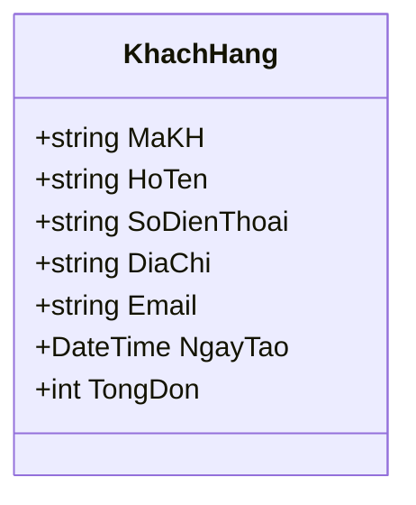

**Diagram sources**
- [KhachHang.cs:5-18](file://Models/KhachHang.cs#L5-L18)
- [FloriSys_Database.sql:36-43](file://FloriSys_Database.sql#L36-L43)

**Section sources**
- [KhachHang.cs:5-18](file://Models/KhachHang.cs#L5-L18)
- [FloriSys_Database.sql:36-43](file://FloriSys_Database.sql#L36-L43)

### Orders (DonHang) and Order Items (ChiTietDonHang)
- Purpose: Sales lifecycle tracking and line items.
- Data types and constraints:
  - Delivery method and status constrained; triggers compute totals and adjust stock.
- Relationships: One-to-many with order items; navigational list in order model.
- Display properties: Status and delivery method translations.

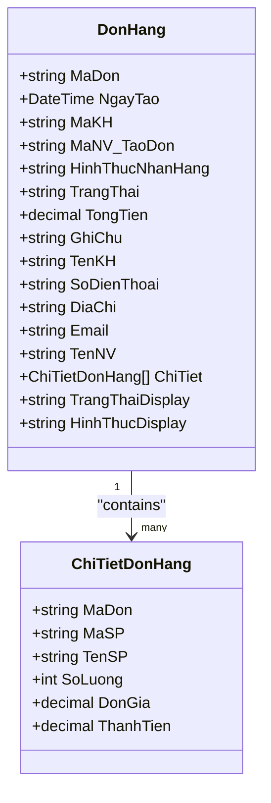

**Diagram sources**
- [DonHang.cs:6-63](file://Models/DonHang.cs#L6-L63)
- [FloriSys_Database.sql:64-87](file://FloriSys_Database.sql#L64-L87)

**Section sources**
- [DonHang.cs:6-63](file://Models/DonHang.cs#L6-L63)
- [DonHangDAO.cs:9-114](file://DataAccess/DonHangDAO.cs#L9-L114)
- [FloriSys_Database.sql:64-87](file://FloriSys_Database.sql#L64-L87)

### Deliveries (GiaoHang) and Shipper Stats (ThongKeShipper)
- Purpose: Delivery assignment and performance metrics.
- Data types and constraints:
  - Status constrained; optional shipper assignment; delivery date recorded.
- Relationships: One-to-one with orders; optional many-to-one with employees.
- Display properties: Status translation.

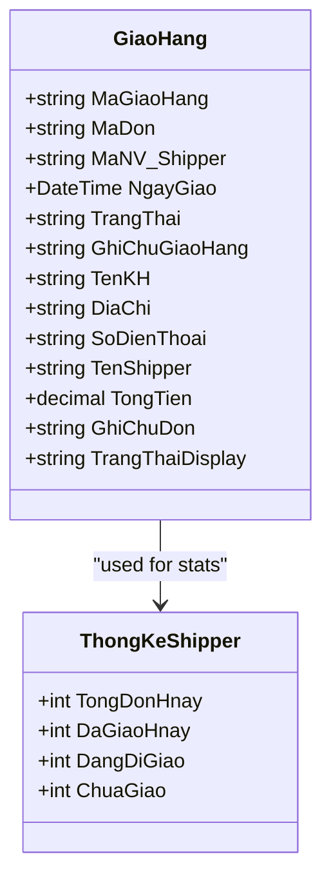

**Diagram sources**
- [GiaoHang.cs:5-47](file://Models/GiaoHang.cs#L5-L47)
- [FloriSys_Database.sql:93-101](file://FloriSys_Database.sql#L93-L101)

**Section sources**
- [GiaoHang.cs:5-47](file://Models/GiaoHang.cs#L5-L47)
- [NhanVienDAO.cs:92-96](file://DataAccess/NhanVienDAO.cs#L92-L96)
- [FloriSys_Database.sql:93-101](file://FloriSys_Database.sql#L93-L101)

### Purchase Orders (PhieuNhapKho) and Purchase Items (ChiTietNhapKho)
- Purpose: Inventory receipts and per-item entries.
- Relationships: One-to-many with receipt items; triggers update stock after insertion.

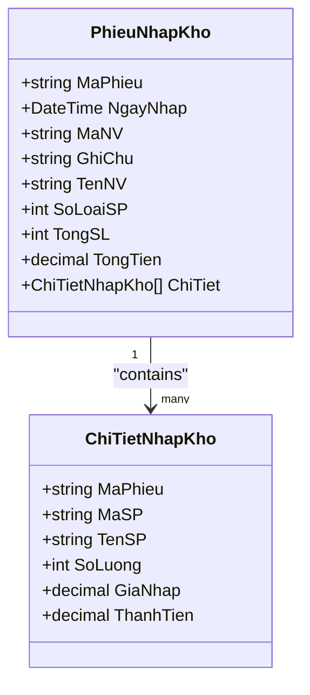

**Diagram sources**
- [PhieuNhapKho.cs:6-33](file://Models/PhieuNhapKho.cs#L6-L33)
- [FloriSys_Database.sql:107-124](file://FloriSys_Database.sql#L107-L124)

**Section sources**
- [PhieuNhapKho.cs:6-33](file://Models/PhieuNhapKho.cs#L6-L33)
- [SanPhamDAO.cs:90-96](file://DataAccess/SanPhamDAO.cs#L90-L96)
- [FloriSys_Database.sql:107-124](file://FloriSys_Database.sql#L107-L124)

### Feedback (PhanHoi)
- Purpose: Customer feedback linked to orders.
- Display properties: Processing status translation.

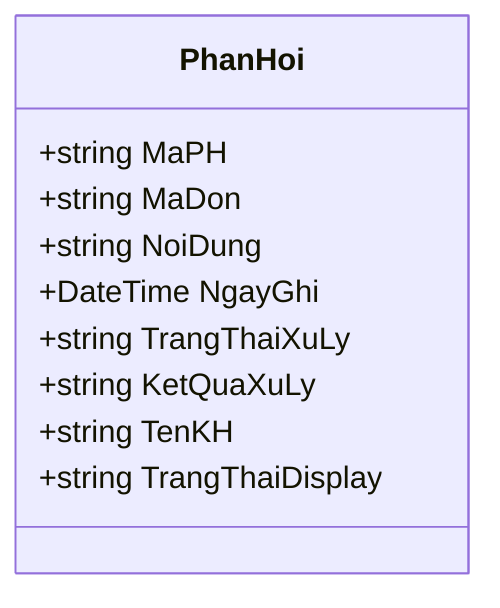

**Diagram sources**
- [PhanHoi.cs:5-32](file://Models/PhanHoi.cs#L5-L32)
- [FloriSys_Database.sql:130-138](file://FloriSys_Database.sql#L130-L138)

**Section sources**
- [PhanHoi.cs:5-32](file://Models/PhanHoi.cs#L5-L32)
- [FloriSys_Database.sql:130-138](file://FloriSys_Database.sql#L130-L138)

### Permissions (PhanQuyen)
- Purpose: Role-based access control per module.

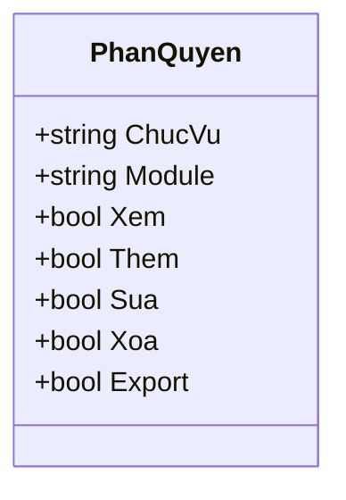

**Diagram sources**
- [PhanQuyen.cs:3-14](file://Models/PhanQuyen.cs#L3-L14)
- [FloriSys_Database.sql:167-176](file://FloriSys_Database.sql#L167-L176)

**Section sources**
- [PhanQuyen.cs:3-14](file://Models/PhanQuyen.cs#L3-L14)
- [FloriSys_Database.sql:167-176](file://FloriSys_Database.sql#L167-L176)

### Damaged Goods (HangHu)
- Purpose: Record of damaged items with reason and notes.

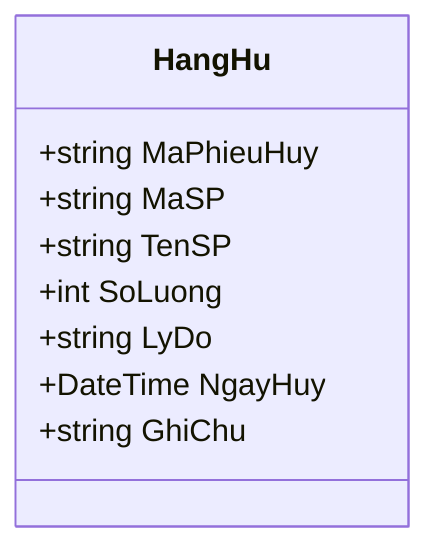

**Diagram sources**
- [HangHu.cs:5-16](file://Models/HangHu.cs#L5-L16)
- [FloriSys_Database.sql:154-161](file://FloriSys_Database.sql#L154-L161)

**Section sources**
- [HangHu.cs:5-16](file://Models/HangHu.cs#L5-L16)
- [FloriSys_Database.sql:154-161](file://FloriSys_Database.sql#L154-L161)

### Returns (TraHang) and Return Items (ChiTietTraHang)
- Purpose: Return requests and per-item outcomes; refund method display.

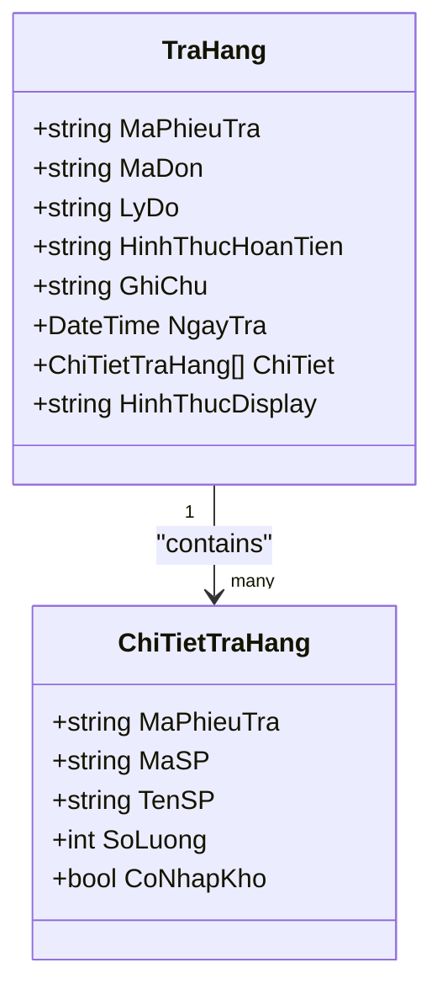

**Diagram sources**
- [TraHang.cs:6-42](file://Models/TraHang.cs#L6-L42)
- [FloriSys_Database.sql:182-202](file://FloriSys_Database.sql#L182-L202)

**Section sources**
- [TraHang.cs:6-42](file://Models/TraHang.cs#L6-L42)
- [FloriSys_Database.sql:182-202](file://FloriSys_Database.sql#L182-L202)

### Reporting Models (BaoCaoModels)
- Purpose: DTOs for dashboards and reports (revenue, top products, employee performance, dashboard KPIs, daily charts, pending dispatches).

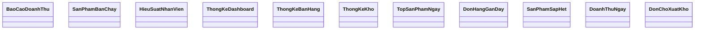

**Diagram sources**
- [BaoCaoModels.cs:8-131](file://Models/BaoCaoModels.cs#L8-L131)

**Section sources**
- [BaoCaoModels.cs:8-131](file://Models/BaoCaoModels.cs#L8-L131)
- [DonHangDAO.cs:100-111](file://DataAccess/DonHangDAO.cs#L100-L111)

## Dependency Analysis
- Mapping layer: Generic reflection-based mapping converts database rows to models, handling nullable types and type conversions.
- Stored procedures: Centralized business logic for creation, updates, and calculations (totals, stock adjustments, code generation).
- Triggers: Enforce referential integrity and derived computations (line item totals, order totals, stock updates).
- UI integration: DAOs expose typed lists and single objects mapped from SP/raw SQL results.

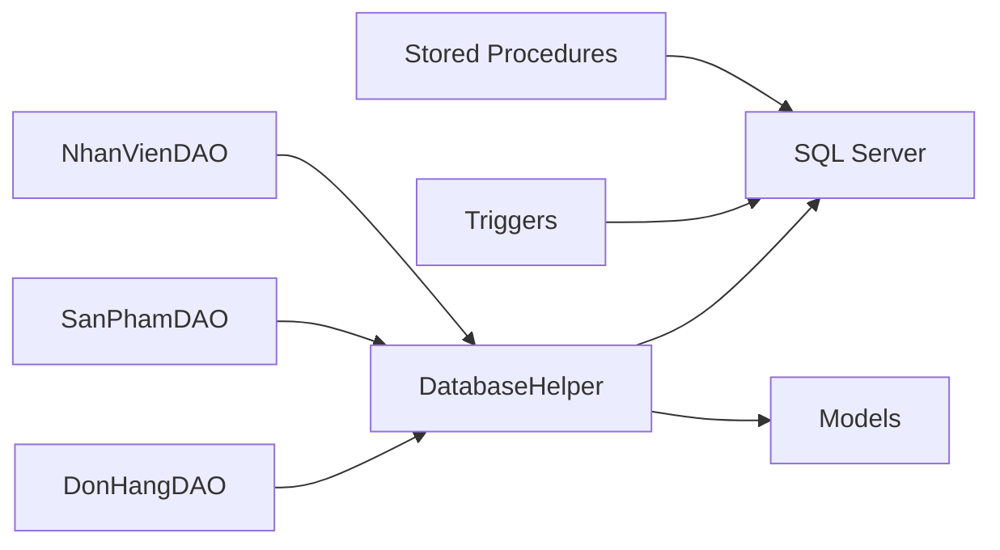

**Diagram sources**
- [DatabaseHelper.cs:10-212](file://DataAccess/DatabaseHelper.cs#L10-L212)
- [FloriSys_Database.sql:206-251](file://FloriSys_Database.sql#L206-L251)

**Section sources**
- [DatabaseHelper.cs:10-212](file://DataAccess/DatabaseHelper.cs#L10-L212)
- [FloriSys_Database.sql:206-251](file://FloriSys_Database.sql#L206-L251)

## Performance Considerations
- Use indexed columns for joins and filters (customer, product, order identifiers).
- Prefer stored procedures for complex updates to leverage server-side triggers and constraints.
- Minimize round trips by batching operations where appropriate.
- Use projection queries (select only needed columns) to reduce payload sizes.

## Troubleshooting Guide
- Login failures: Verify hashed passwords match stored values and active status.
- Insufficient stock errors: Ensure product stock meets order quantities before transitioning order status.
- Return processing: Confirm refund method and whether returned items are restocked.
- Code generation: Use the built-in generator to maintain consistent identifiers.

**Section sources**
- [NhanVienDAO.cs:11-29](file://DataAccess/NhanVienDAO.cs#L11-L29)
- [DonHangDAO.cs:80-98](file://DataAccess/DonHangDAO.cs#L80-L98)
- [DatabaseHelper.cs:189-209](file://DataAccess/DatabaseHelper.cs#L189-L209)

## Conclusion
FloriSys models encapsulate core business entities with clear relationships, computed display properties, and strong database constraints. The DAO layer and stored procedures centralize business logic, while reflection-based mapping ensures robust data transformation. These models integrate seamlessly with UI modules to support Sales, Warehouse, Shipping, and Reporting workflows.

## Appendices

### Entity Relationship Diagram
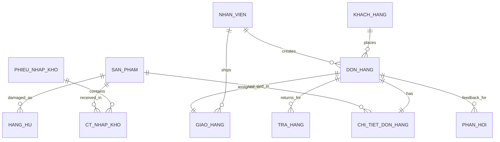

**Diagram sources**
- [FloriSys_Database.sql:22-202](file://FloriSys_Database.sql#L22-L202)

### Data Transformation Flow (Order Creation)
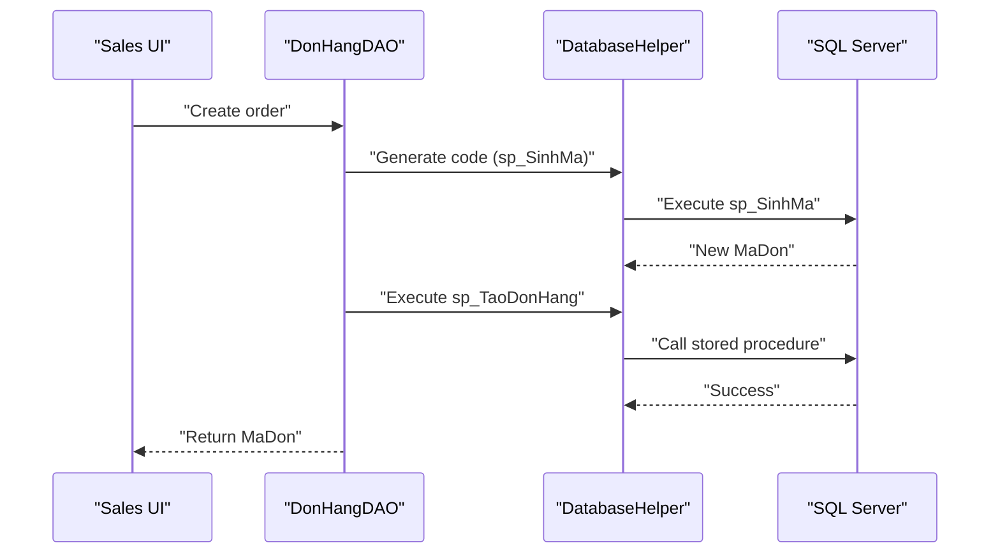

**Diagram sources**
- [DonHangDAO.cs:66-78](file://DataAccess/DonHangDAO.cs#L66-L78)
- [DatabaseHelper.cs:189-209](file://DataAccess/DatabaseHelper.cs#L189-L209)
- [FloriSys_Database.sql:282-294](file://FloriSys_Database.sql#L282-L294)

### Validation Flow (Order Item Addition)
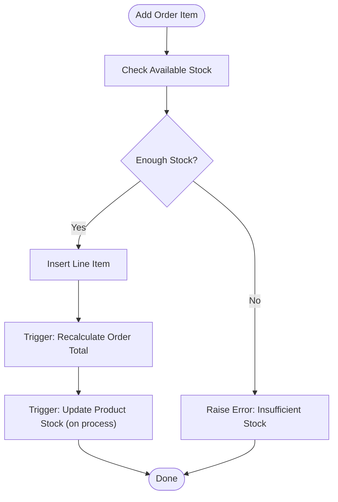

**Diagram sources**
- [FloriSys_Database.sql:304-314](file://FloriSys_Database.sql#L304-L314)
- [FloriSys_Database.sql:222-234](file://FloriSys_Database.sql#L222-L234)
- [FloriSys_Database.sql:236-247](file://FloriSys_Database.sql#L236-L247)