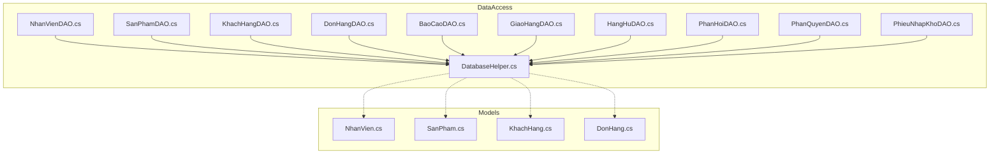
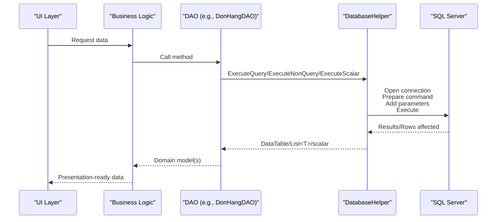
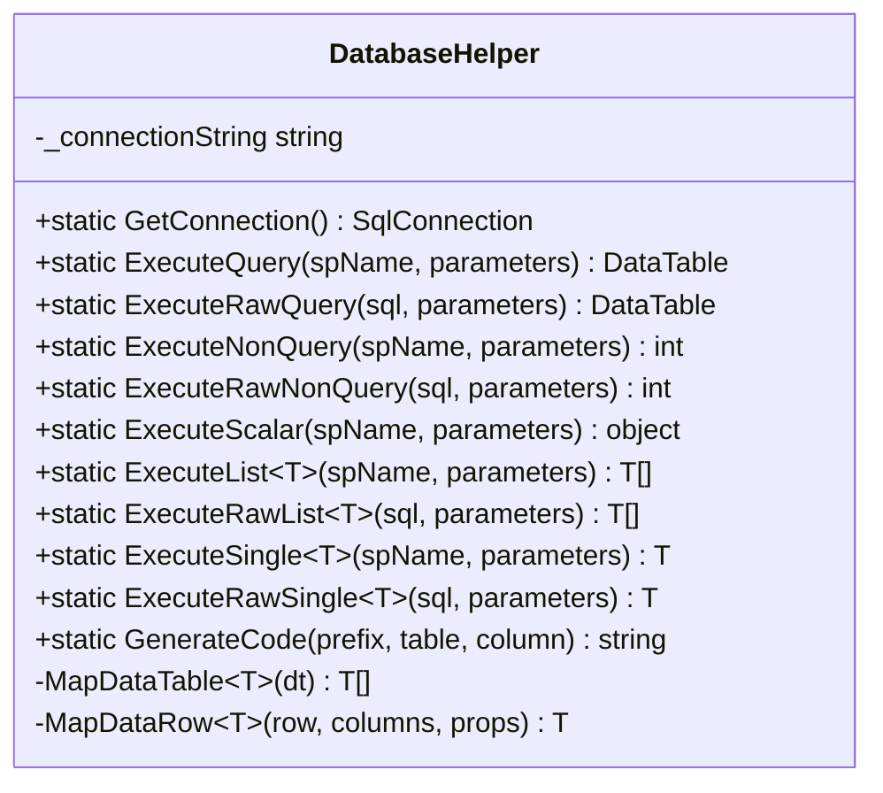
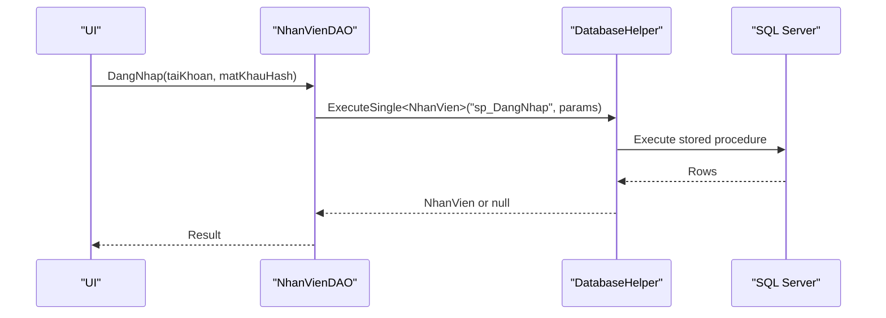
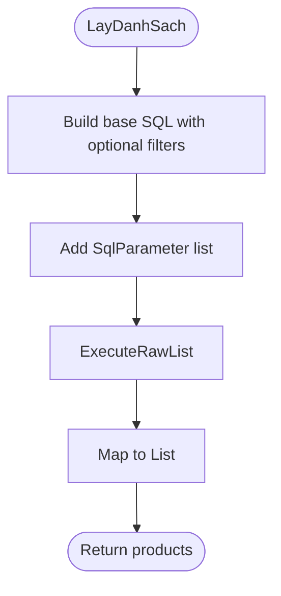
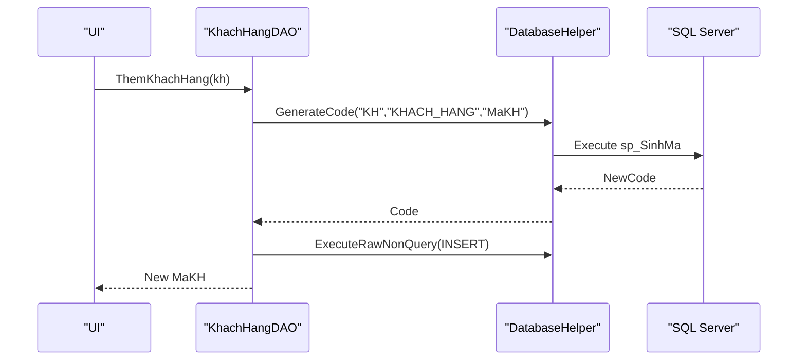
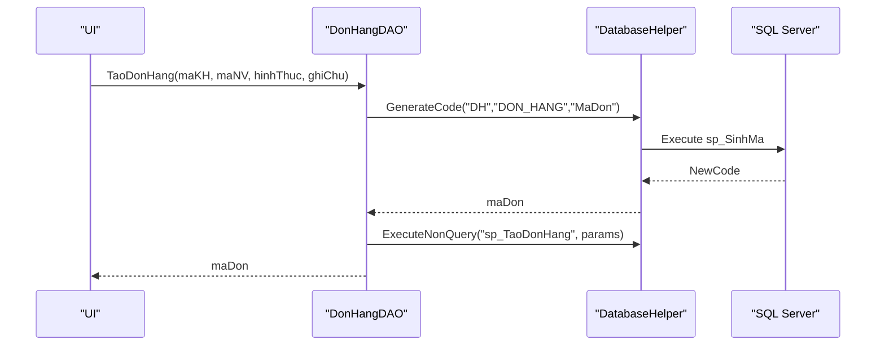
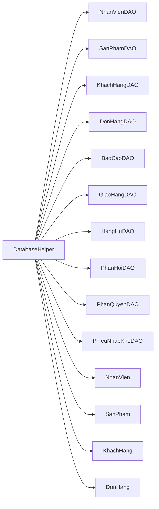

# Data Access Layer

<cite>
**Referenced Files in This Document**
- [DatabaseHelper.cs](file://DataAccess/DatabaseHelper.cs)
- [NhanVienDAO.cs](file://DataAccess/NhanVienDAO.cs)
- [SanPhamDAO.cs](file://DataAccess/SanPhamDAO.cs)
- [KhachHangDAO.cs](file://DataAccess/KhachHangDAO.cs)
- [DonHangDAO.cs](file://DataAccess/DonHangDAO.cs)
- [BaoCaoDAO.cs](file://DataAccess/BaoCaoDAO.cs)
- [GiaoHangDAO.cs](file://DataAccess/GiaoHangDAO.cs)
- [HangHuDAO.cs](file://DataAccess/HangHuDAO.cs)
- [PhanHoiDAO.cs](file://DataAccess/PhanHoiDAO.cs)
- [PhanQuyenDAO.cs](file://DataAccess/PhanQuyenDAO.cs)
- [PhieuNhapKhoDAO.cs](file://DataAccess/PhieuNhapKhoDAO.cs)
- [NhanVien.cs](file://Models/NhanVien.cs)
- [SanPham.cs](file://Models/SanPham.cs)
- [KhachHang.cs](file://Models/KhachHang.cs)
- [DonHang.cs](file://Models/DonHang.cs)
</cite>

## Table of Contents
1. [Introduction](#introduction)
2. [Project Structure](#project-structure)
3. [Core Components](#core-components)
4. [Architecture Overview](#architecture-overview)
5. [Detailed Component Analysis](#detailed-component-analysis)
6. [Dependency Analysis](#dependency-analysis)
7. [Performance Considerations](#performance-considerations)
8. [Troubleshooting Guide](#troubleshooting-guide)
9. [Conclusion](#conclusion)
10. [Appendices](#appendices)

## Introduction
This document describes the data access layer for FloriSys, focusing on the generic DatabaseHelper class and its reflection-based mapping capabilities, connection management, and query execution utilities. It also documents the DAO classes for core entities (NhanVien, SanPham, KhachHang, DonHang) and supporting modules (BaoCao, GiaoHang, HangHu, PhanHoi, PhanQuyen, PhieuNhapKho). The guide explains how the Repository pattern is applied conceptually, data persistence strategies, business logic encapsulation, connection pooling considerations, transaction management, error handling, and SQL injection prevention via parameterized queries and stored procedures. Finally, it provides extension guidelines for adding new entities and maintaining data consistency.

## Project Structure
The data access layer is organized under the DataAccess folder with one central helper class and multiple DAO classes. Models define entity structures mapped from database results. The helper centralizes connection creation, command execution, and reflection-based mapping.

**Diagram sources**
- [DatabaseHelper.cs](file://DataAccess/DatabaseHelper.cs)
- [NhanVienDAO.cs](file://DataAccess/NhanVienDAO.cs)
- [SanPhamDAO.cs](file://DataAccess/SanPhamDAO.cs)
- [KhachHangDAO.cs](file://DataAccess/KhachHangDAO.cs)
- [DonHangDAO.cs](file://DataAccess/DonHangDAO.cs)
- [BaoCaoDAO.cs](file://DataAccess/BaoCaoDAO.cs)
- [GiaoHangDAO.cs](file://DataAccess/GiaoHangDAO.cs)
- [HangHuDAO.cs](file://DataAccess/HangHuDAO.cs)
- [PhanHoiDAO.cs](file://DataAccess/PhanHoiDAO.cs)
- [PhanQuyenDAO.cs](file://DataAccess/PhanQuyenDAO.cs)
- [PhieuNhapKhoDAO.cs](file://DataAccess/PhieuNhapKhoDAO.cs)
- [NhanVien.cs](file://Models/NhanVien.cs)
- [SanPham.cs](file://Models/SanPham.cs)
- [KhachHang.cs](file://Models/KhachHang.cs)
- [DonHang.cs](file://Models/DonHang.cs)

**Section sources**
- [DatabaseHelper.cs](file://DataAccess/DatabaseHelper.cs)
- [NhanVienDAO.cs](file://DataAccess/NhanVienDAO.cs)
- [SanPhamDAO.cs](file://DataAccess/SanPhamDAO.cs)
- [KhachHangDAO.cs](file://DataAccess/KhachHangDAO.cs)
- [DonHangDAO.cs](file://DataAccess/DonHangDAO.cs)
- [BaoCaoDAO.cs](file://DataAccess/BaoCaoDAO.cs)
- [GiaoHangDAO.cs](file://DataAccess/GiaoHangDAO.cs)
- [HangHuDAO.cs](file://DataAccess/HangHuDAO.cs)
- [PhanHoiDAO.cs](file://DataAccess/PhanHoiDAO.cs)
- [PhanQuyenDAO.cs](file://DataAccess/PhanQuyenDAO.cs)
- [PhieuNhapKhoDAO.cs](file://DataAccess/PhieuNhapKhoDAO.cs)
- [NhanVien.cs](file://Models/NhanVien.cs)
- [SanPham.cs](file://Models/SanPham.cs)
- [KhachHang.cs](file://Models/KhachHang.cs)
- [DonHang.cs](file://Models/DonHang.cs)

## Core Components
- DatabaseHelper: Centralizes connection management, command execution, and reflection-based mapping. Provides generic helpers for mapping DataTable rows to strongly-typed objects, and convenience methods for stored procedures and raw SQL.
- DAO classes: Encapsulate CRUD and query logic per domain entity, leveraging DatabaseHelper for execution and mapping.

Key responsibilities:
- Connection management: Static connection string resolution and SqlConnection creation.
- Query execution: Stored procedure and raw SQL support with parameter arrays.
- Reflection-based mapping: Automatic mapping of DataTable to List<T> and single T instances.
- Utility helpers: Code generation via stored procedure and scalar execution.

**Section sources**
- [DatabaseHelper.cs](file://DataAccess/DatabaseHelper.cs)

## Architecture Overview
The data access layer follows a layered pattern:
- Presentation/UI invokes service/business logic.
- Business logic calls DAOs.
- DAOs call DatabaseHelper for execution and mapping.
- DatabaseHelper executes commands against SQL Server and maps results to models.

**Diagram sources**
- [DonHangDAO.cs](file://DataAccess/DonHangDAO.cs)
- [DatabaseHelper.cs](file://DataAccess/DatabaseHelper.cs)

## Detailed Component Analysis

### DatabaseHelper
Responsibilities:
- Connection management: Resolves connection string from configuration or defaults; creates SqlConnection instances.
- Command execution: Supports stored procedures and raw SQL with parameter arrays; returns DataTable, scalar values, or row counts.
- Reflection-based mapping: Converts DataTable rows to strongly typed objects, handling type conversions and nullables.
- Utilities: Generates entity codes via stored procedure and executes non-query commands.

Implementation highlights:
- Generic mapping helpers for lists and single objects.
- Parameterized queries to prevent SQL injection.
- No explicit transaction management; each operation opens/closes connections.

**Diagram sources**
- [DatabaseHelper.cs](file://DataAccess/DatabaseHelper.cs)

**Section sources**
- [DatabaseHelper.cs](file://DataAccess/DatabaseHelper.cs)

### NhanVienDAO
Responsibilities:
- Authentication and password change via stored procedures.
- Listing employees with optional filters (keyword, position, status).
- CRUD operations for employee records.
- Retrieving active shippers.

Implementation notes:
- Uses stored procedures for login/password change.
- Uses raw SQL for flexible filtering and updates.
- Returns strongly typed models via DatabaseHelper mapping.

**Diagram sources**
- [NhanVienDAO.cs](file://DataAccess/NhanVienDAO.cs)
- [DatabaseHelper.cs](file://DataAccess/DatabaseHelper.cs)

**Section sources**
- [NhanVienDAO.cs](file://DataAccess/NhanVienDAO.cs)
- [NhanVien.cs](file://Models/NhanVien.cs)

### SanPhamDAO
Responsibilities:
- Product listing with filters (keyword, category, status).
- Products available for sale with optional keyword filter.
- CRUD operations for products.
- Inventory threshold warnings via stored procedure.

**Diagram sources**
- [SanPhamDAO.cs](file://DataAccess/SanPhamDAO.cs)
- [DatabaseHelper.cs](file://DataAccess/DatabaseHelper.cs)

**Section sources**
- [SanPhamDAO.cs](file://DataAccess/SanPhamDAO.cs)
- [SanPham.cs](file://Models/SanPham.cs)

### KhachHangDAO
Responsibilities:
- Customer listing with keyword filter.
- Lookup by phone number.
- Creation with auto-generated ID via helper utility.
- Updates and deletion with referential integrity check.

Error handling:
- Throws an exception when attempting to delete a customer with existing orders.

**Diagram sources**
- [KhachHangDAO.cs](file://DataAccess/KhachHangDAO.cs)
- [DatabaseHelper.cs](file://DataAccess/DatabaseHelper.cs)

**Section sources**
- [KhachHangDAO.cs](file://DataAccess/KhachHangDAO.cs)
- [KhachHang.cs](file://Models/KhachHang.cs)

### DonHangDAO
Responsibilities:
- Order listing with filters (keyword, status, staff, date).
- Order detail retrieval.
- Single order info with join data.
- Order creation via stored procedure with auto-generated ID.
- Adding order items and updating order status.
- Orders pending dispatch reporting.

**Diagram sources**
- [DonHangDAO.cs](file://DataAccess/DonHangDAO.cs)
- [DatabaseHelper.cs](file://DataAccess/DatabaseHelper.cs)

**Section sources**
- [DonHangDAO.cs](file://DataAccess/DonHangDAO.cs)
- [DonHang.cs](file://Models/DonHang.cs)

### BaoCaoDAO
Responsibilities:
- Revenue reports (daily/monthly).
- Best-selling products.
- Employee efficiency metrics.
- Inventory alerts and dashboard statistics.
- Recent orders and warehouse metrics.

Implementation:
- Mix of stored procedures and raw SQL depending on report complexity.

**Section sources**
- [BaoCaoDAO.cs](file://DataAccess/BaoCaoDAO.cs)

### GiaoHangDAO
Responsibilities:
- Delivery listing with optional status filter.
- Pending deliveries for assignment.
- Deliveries assigned to a shipper.
- Delivery creation with auto-generated ID.
- Shipper assignment and status updates.
- Shipper performance metrics.

**Section sources**
- [GiaoHangDAO.cs](file://DataAccess/GiaoHangDAO.cs)

### HangHuDAO
Responsibilities:
- Record defective inventory with auto-generated ID.
- Retrieve defect history with optional monthly filters.

**Section sources**
- [HangHuDAO.cs](file://DataAccess/HangHuDAO.cs)

### PhanHoiDAO
Responsibilities:
- Feedback listing with optional order filter.
- Recording feedback with auto-generated ID.
- Updating feedback processing status and outcome.

**Section sources**
- [PhanHoiDAO.cs](file://DataAccess/PhanHoiDAO.cs)

### PhanQuyenDAO
Responsibilities:
- Retrieve role permissions.
- Upsert permission entries.

**Section sources**
- [PhanQuyenDAO.cs](file://DataAccess/PhanQuyenDAO.cs)

### PhieuNhapKhoDAO
Responsibilities:
- Purchase receipt listing with filters.
- Receipt detail retrieval.
- Creating purchase receipts with auto-generated ID.
- Adding receipt items.

**Section sources**
- [PhieuNhapKhoDAO.cs](file://DataAccess/PhieuNhapKhoDAO.cs)

## Dependency Analysis
- DAOs depend on DatabaseHelper for all data operations.
- DatabaseHelper depends on System.Data.SqlClient and System.Reflection for mapping.
- Models are simple POCOs used by mapping logic; they do not depend on DAOs.
- There are no circular dependencies among DAOs.

**Diagram sources**
- [DatabaseHelper.cs](file://DataAccess/DatabaseHelper.cs)
- [NhanVienDAO.cs](file://DataAccess/NhanVienDAO.cs)
- [SanPhamDAO.cs](file://DataAccess/SanPhamDAO.cs)
- [KhachHangDAO.cs](file://DataAccess/KhachHangDAO.cs)
- [DonHangDAO.cs](file://DataAccess/DonHangDAO.cs)
- [BaoCaoDAO.cs](file://DataAccess/BaoCaoDAO.cs)
- [GiaoHangDAO.cs](file://DataAccess/GiaoHangDAO.cs)
- [HangHuDAO.cs](file://DataAccess/HangHuDAO.cs)
- [PhanHoiDAO.cs](file://DataAccess/PhanHoiDAO.cs)
- [PhanQuyenDAO.cs](file://DataAccess/PhanQuyenDAO.cs)
- [PhieuNhapKhoDAO.cs](file://DataAccess/PhieuNhapKhoDAO.cs)
- [NhanVien.cs](file://Models/NhanVien.cs)
- [SanPham.cs](file://Models/SanPham.cs)
- [KhachHang.cs](file://Models/KhachHang.cs)
- [DonHang.cs](file://Models/DonHang.cs)

**Section sources**
- [DatabaseHelper.cs](file://DataAccess/DatabaseHelper.cs)
- [NhanVienDAO.cs](file://DataAccess/NhanVienDAO.cs)
- [SanPhamDAO.cs](file://DataAccess/SanPhamDAO.cs)
- [KhachHangDAO.cs](file://DataAccess/KhachHangDAO.cs)
- [DonHangDAO.cs](file://DataAccess/DonHangDAO.cs)
- [BaoCaoDAO.cs](file://DataAccess/BaoCaoDAO.cs)
- [GiaoHangDAO.cs](file://DataAccess/GiaoHangDAO.cs)
- [HangHuDAO.cs](file://DataAccess/HangHuDAO.cs)
- [PhanHoiDAO.cs](file://DataAccess/PhanHoiDAO.cs)
- [PhanQuyenDAO.cs](file://DataAccess/PhanQuyenDAO.cs)
- [PhieuNhapKhoDAO.cs](file://DataAccess/PhieuNhapKhoDAO.cs)
- [NhanVien.cs](file://Models/NhanVien.cs)
- [SanPham.cs](file://Models/SanPham.cs)
- [KhachHang.cs](file://Models/KhachHang.cs)
- [DonHang.cs](file://Models/DonHang.cs)

## Performance Considerations
- Connection lifecycle: Each operation opens and closes a SqlConnection. Consider implementing connection pooling at the application level and reusing connections within a unit of work if latency becomes a concern.
- Reflection mapping: Reflection-based mapping is convenient but can be slower than compiled mapping. For high-throughput scenarios, consider compiled expression trees or a micro-ORM.
- Parameterized queries: All DAO methods use SqlParameter arrays, preventing SQL injection and enabling plan reuse.
- Batch operations: For bulk inserts/updates, batch operations or SqlBulkCopy could reduce round trips.
- Indexing and stored procedures: Use appropriate indexes and precompiled stored procedures for frequently executed queries.

[No sources needed since this section provides general guidance]

## Troubleshooting Guide
Common issues and resolutions:
- Connection string errors: Verify the connection string in configuration or rely on the default fallback. Ensure SQL Server is reachable and credentials are valid.
- Mapping exceptions: Ensure model property names match column names returned by queries; reflection mapping ignores missing columns and DBNull values.
- Deletion constraints: Deleting customers with existing orders throws an exception; handle this in the UI or business logic to inform users.
- Parameter mismatches: Confirm parameter names and types match stored procedure signatures.
- Transaction isolation: The helper does not manage transactions; wrap multiple related operations in a single transaction at the business/service layer if consistency is required.

**Section sources**
- [KhachHangDAO.cs](file://DataAccess/KhachHangDAO.cs)
- [DatabaseHelper.cs](file://DataAccess/DatabaseHelper.cs)

## Conclusion
FloriSys employs a clean separation of concerns with a central DatabaseHelper managing connections and reflection-based mapping, while DAO classes encapsulate domain-specific queries and commands. The design leverages stored procedures and parameterized SQL for security and maintainability. Extending the layer involves adding new DAOs, models, and stored procedures, following the established patterns for mapping, parameterization, and error handling.

[No sources needed since this section summarizes without analyzing specific files]

## Appendices

### Repository Pattern Notes
While there is no dedicated interface named IRepository, the DAO pattern serves a similar role:
- Each DAO encapsulates persistence logic for a single entity.
- Methods are grouped by use cases (listing, CRUD, reporting).
- Centralized mapping and execution via DatabaseHelper.

Guidelines for future abstraction:
- Define interfaces per entity to enable mocking and testability.
- Introduce a generic repository with common operations (Find, Add, Update, Remove) and allow DAOs to override specialized methods.

[No sources needed since this section provides general guidance]

### Guidelines for Extending the Data Access Layer
Steps to add a new entity:
1. Create a model class with properties matching the target table.
2. Add a new DAO class with methods for listing, CRUD, and specialized queries.
3. Implement stored procedures or raw SQL within the DAO methods.
4. Use DatabaseHelper for execution and mapping; leverage GenerateCode for IDs when needed.
5. Validate inputs in business logic before invoking DAO methods.
6. Add tests to verify mapping correctness and parameter binding.

Best practices:
- Keep DAO methods focused and single-purpose.
- Use parameterized queries and stored procedures to prevent SQL injection.
- Centralize common logic (e.g., ID generation) in DatabaseHelper.
- Maintain consistent naming conventions for parameters and stored procedures.

[No sources needed since this section provides general guidance]