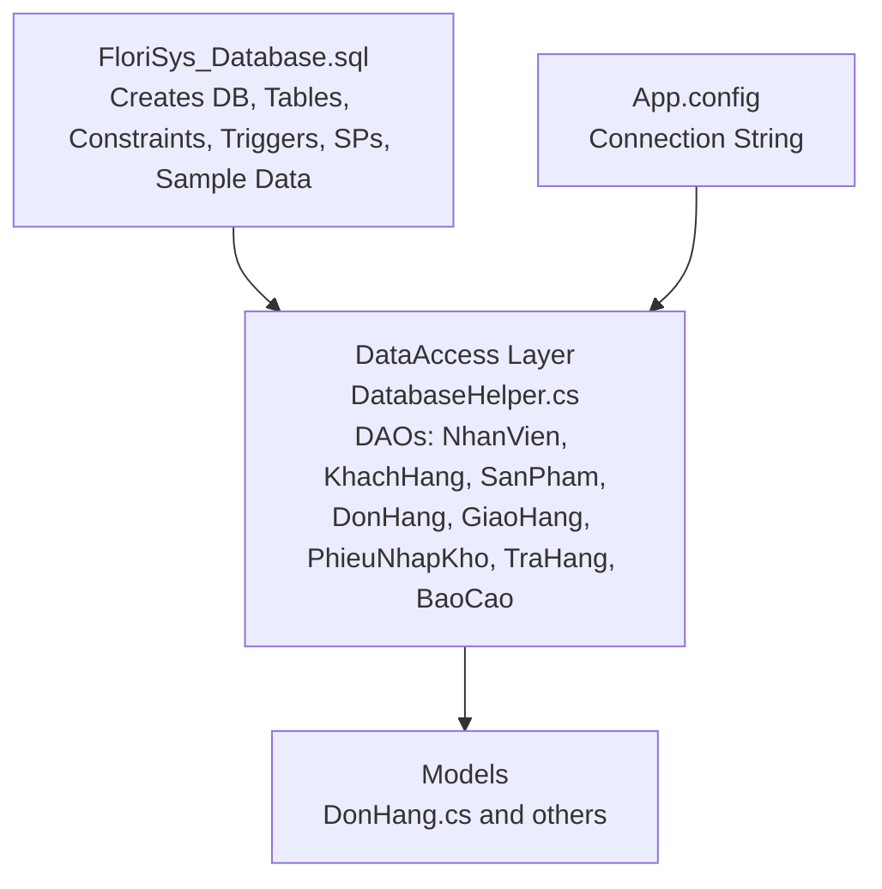
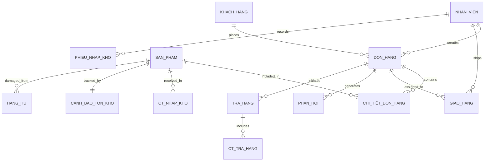
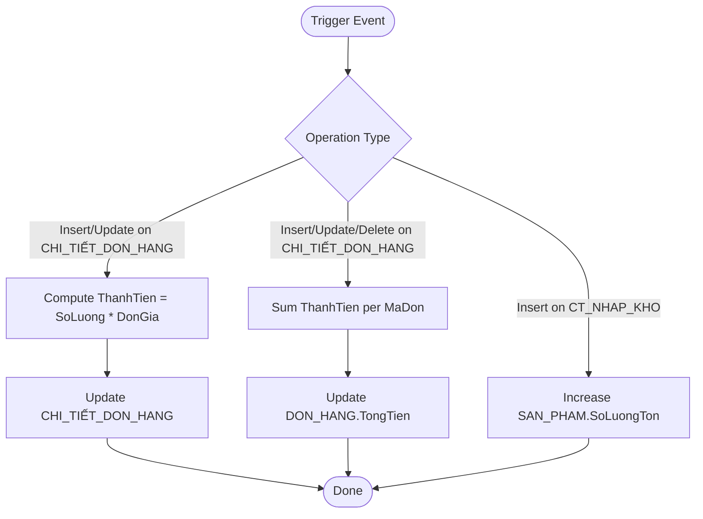
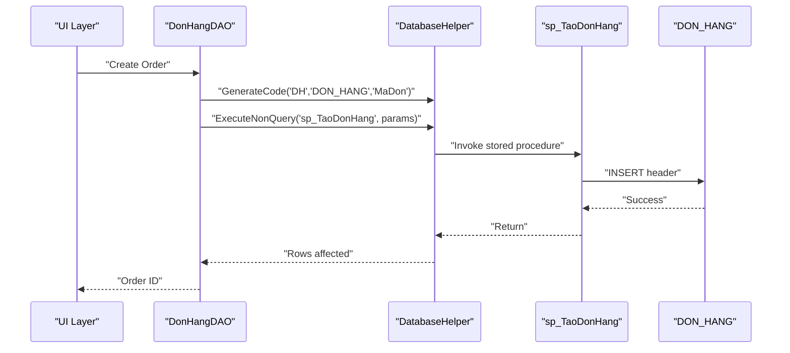
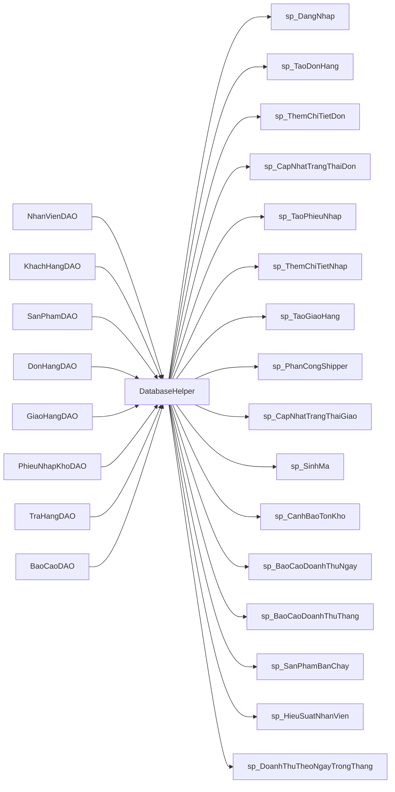

# Database Design

<cite>
**Referenced Files in This Document**
- [FloriSys_Database.sql](file://FloriSys_Database.sql)
- [fix_sp.sql](file://fix_sp.sql)
- [fix_sp2.sql](file://fix_sp2.sql)
- [mock.sql](file://mock.sql)
- [App.config](file://App.config)
- [DatabaseHelper.cs](file://DataAccess/DatabaseHelper.cs)
- [NhanVienDAO.cs](file://DataAccess/NhanVienDAO.cs)
- [KhachHangDAO.cs](file://DataAccess/KhachHangDAO.cs)
- [SanPhamDAO.cs](file://DataAccess/SanPhamDAO.cs)
- [DonHangDAO.cs](file://DataAccess/DonHangDAO.cs)
- [GiaoHangDAO.cs](file://DataAccess/GiaoHangDAO.cs)
- [PhieuNhapKhoDAO.cs](file://DataAccess/PhieuNhapKhoDAO.cs)
- [TraHangDAO.cs](file://DataAccess/TraHangDAO.cs)
- [BaoCaoDAO.cs](file://DataAccess/BaoCaoDAO.cs)
- [DonHang.cs](file://Models/DonHang.cs)
</cite>

## Table of Contents
1. [Introduction](#introduction)
2. [Project Structure](#project-structure)
3. [Core Components](#core-components)
4. [Architecture Overview](#architecture-overview)
5. [Detailed Component Analysis](#detailed-component-analysis)
6. [Dependency Analysis](#dependency-analysis)
7. [Performance Considerations](#performance-considerations)
8. [Troubleshooting Guide](#troubleshooting-guide)
9. [Conclusion](#conclusion)
10. [Appendices](#appendices)

## Introduction
This document presents a comprehensive database design for FloriSys, a flower shop management system. It defines the normalized relational schema, entity-relationship model, constraints, triggers, stored procedures, indexing strategies, performance considerations, and operational procedures for data generation, migration, backup/recovery, and security. The design supports end-to-end workflows across sales, inventory, shipping, returns, and reporting.

## Project Structure
The database is defined and deployed via a single SQL script that creates tables, constraints, triggers, and stored procedures, followed by sample data insertion. The application’s data access layer uses a generic helper to execute stored procedures and raw SQL, mapping results to strongly-typed models.

**Diagram sources**
- [FloriSys_Database.sql:1-706](file://FloriSys_Database.sql#L1-L706)
- [App.config:1-9](file://App.config#L1-L9)
- [DatabaseHelper.cs:1-212](file://DataAccess/DatabaseHelper.cs#L1-L212)
- [NhanVienDAO.cs:1-99](file://DataAccess/NhanVienDAO.cs#L1-L99)
- [KhachHangDAO.cs:1-75](file://DataAccess/KhachHangDAO.cs#L1-L75)
- [SanPhamDAO.cs:1-96](file://DataAccess/SanPhamDAO.cs#L1-L96)
- [DonHangDAO.cs:1-114](file://DataAccess/DonHangDAO.cs#L1-L114)
- [GiaoHangDAO.cs:1-96](file://DataAccess/GiaoHangDAO.cs#L1-L96)
- [PhieuNhapKhoDAO.cs:1-77](file://DataAccess/PhieuNhapKhoDAO.cs#L1-L77)
- [TraHangDAO.cs:1-51](file://DataAccess/TraHangDAO.cs#L1-L51)
- [BaoCaoDAO.cs:1-167](file://DataAccess/BaoCaoDAO.cs#L1-L167)
- [DonHang.cs:1-63](file://Models/DonHang.cs#L1-L63)

**Section sources**
- [FloriSys_Database.sql:1-706](file://FloriSys_Database.sql#L1-L706)
- [App.config:1-9](file://App.config#L1-L9)

## Core Components
This section documents the core business entities and their schemas, including primary keys, foreign keys, constraints, and data validation rules.

- NHAN_VIEN (Employees)
  - Fields: MaNV (PK), HoTen, ChucVu (CHECK), SoDienThoai, TaiKhoan (UNIQUE), MatKhau, TrangThai (CHECK)
  - Purpose: Stores employee records with role-based access control and status tracking
  - Constraints: Role and status enums, unique account, non-empty name and phone

- KHACH_HANG (Customers)
  - Fields: MaKH (PK), HoTen, SoDienThoai (UNIQUE), DiaChi, Email, NgayTao (DEFAULT)
  - Purpose: Customer profile and contact information
  - Constraints: Unique phone, default creation date

- SAN_PHAM (Products)
  - Fields: MaSP (PK), TenSP, LoaiHoa, GiaBan (CHECK), GiaNhap (CHECK), SoLuongTon (CHECK, DEFAULT), MucTonToiThieu (DEFAULT), TrangThai (CHECK)
  - Purpose: Product catalog with pricing, stock levels, and status
  - Constraints: Non-negative prices and quantities, default minimum threshold, status enum

- DON_HANG (Orders)
  - Fields: MaDon (PK), NgayTao (DEFAULT), MaKH (FK), MaNV_TaoDon (FK), HinhThucNhanHang (CHECK), TrangThai (CHECK, DEFAULT), TongTien (DEFAULT), GhiChu
  - Purpose: Order header with customer and cashier references
  - Constraints: Delivery method and status enums, default totals

- CHI_TIẾT_DON_HANG (Order Details)
  - Fields: MaDon (FK, PK), MaSP (FK, PK), SoLuong (CHECK), DonGia (CHECK), ThanhTien (DEFAULT)
  - Purpose: Line items per order
  - Constraints: Positive quantity and price, computed total via trigger

- GIAO_HANG (Deliveries)
  - Fields: MaGiaoHang (PK), MaDon (FK), MaNV_Shipper (FK), NgayGiao, TrangThai (CHECK, DEFAULT), GhiChuGiaoHang
  - Purpose: Shipping assignments and tracking
  - Constraints: Status enum, optional shipper assignment

- PHIEU_NHAP_KHO (Warehouse Receipts)
  - Fields: MaPhieu (PK), NgayNhap (DEFAULT), MaNV (FK), GhiChu
  - Purpose: Receipt header for incoming inventory
  - Constraints: Non-empty receipt number, default date

- CT_NHAP_KHO (Receipt Details)
  - Fields: MaPhieu (FK, PK), MaSP (FK, PK), SoLuong (CHECK), GiaNhap (CHECK)
  - Purpose: Line items for receipts
  - Constraints: Positive quantity and cost

- PHAN_HOI (Feedback)
  - Fields: MaPH (PK), MaDon (FK), NoiDung, NgayGhi (DEFAULT), TrangThaiXuLy (CHECK, DEFAULT), KetQuaXuLy
  - Purpose: Customer feedback and resolution tracking
  - Constraints: Status enum, default processing state

- CANH_BAO_TON_KHO (Stock Alert)
  - Fields: MaSP (PK, FK), MucToiThieu (DEFAULT), NgayCapNhat (DEFAULT)
  - Purpose: Minimum threshold tracking per product
  - Constraints: Threshold and update date

- HANG_HU (Damage/Scrap Log)
  - Fields: MaPhieuHuy (PK), MaSP (FK), SoLuong (CHECK), LyDo, NgayHuy (DEFAULT), GhiChu
  - Purpose: Records of damaged goods removal
  - Constraints: Positive quantity, non-negative current stock

- PHAN_QUYEN (Permissions)
  - Fields: ChucVu, Module, Xem, Them, Sua, Xoa, Export (PK: ChucVu, Module)
  - Purpose: Role-based module permissions
  - Constraints: Bit flags per action

- TRA_HANG (Returns)
  - Fields: MaPhieuTra (PK), MaDon (FK), LyDo, HinhThucHoanTien (CHECK, DEFAULT), GhiChu, NgayTra (DEFAULT)
  - Purpose: Return requests and refund methods
  - Constraints: Refund type enum, default date

- CT_TRA_HANG (Return Details)
  - Fields: MaPhieuTra (FK, PK), MaSP (FK, PK), SoLuong (CHECK), CoNhapKho (DEFAULT)
  - Purpose: Items returned and optional re-stocking
  - Constraints: Positive quantity

**Section sources**
- [FloriSys_Database.sql:22-191](file://FloriSys_Database.sql#L22-L191)

## Architecture Overview
The database enforces referential integrity through explicit foreign keys and uses triggers to maintain derived data (totals, stock levels). Stored procedures encapsulate business logic and transactional boundaries. The application’s data access layer abstracts SQL execution and result mapping.

**Diagram sources**
- [FloriSys_Database.sql:22-191](file://FloriSys_Database.sql#L22-L191)

## Detailed Component Analysis

### Entity-Relationship Model and Normalization
- First Normal Form (1NF): Atomic domains for all attributes; composite keys used for junction tables.
- Second Normal Form (2NF): All non-key attributes are fully functionally dependent on the primary keys.
- Third Normal Form (3NF): No transitive dependencies among non-key attributes.
- Additional normalization:
  - Separate stock alert table to avoid repeated thresholds.
  - Dedicated return and damage tables to track history and actions independently.

Constraints and referential integrity:
- Foreign keys enforce parent-child relationships.
- CHECK constraints validate enumerations and numeric bounds.
- Triggers maintain derived data (totals, stock levels).

**Section sources**
- [FloriSys_Database.sql:22-191](file://FloriSys_Database.sql#L22-L191)

### Triggers
- Auto-compute ThanhTien on CHI_TIẾT_DON_HANG insert/update.
- Auto-update DON_HANG.TongTien based on CHI_TIẾT_DON_HANG changes.
- Auto-increment SAN_PHAM.SoLuongTon on CT_NHAP_KHO insert.

**Diagram sources**
- [FloriSys_Database.sql:210-247](file://FloriSys_Database.sql#L210-L247)

**Section sources**
- [FloriSys_Database.sql:210-247](file://FloriSys_Database.sql#L210-L247)

### Stored Procedures Library
Purpose, parameters, and behavior summaries:
- Authentication and account
  - sp_DangNhap: Login lookup by credentials and active status
  - sp_DoiMatKhau: Change password with verification
- Order lifecycle
  - sp_TaoDonHang: Create order header
  - sp_ThemChiTietDon: Add order item with stock availability check
  - sp_CapNhatTrangThaiDon: Transition order state; adjust stock on processing and restore on return
- Warehouse
  - sp_TaoPhieuNhap: Create receipt header
  - sp_ThemChiTietNhap: Add receipt item; stock auto-adjusted by trigger
  - sp_GhiNhanHangHu: Record scrap with stock reduction and validation
- Shipping
  - sp_TaoGiaoHang: Create delivery record
  - sp_PhanCongShipper: Assign shipper and set status
  - sp_CapNhatTrangThaiGiao: Update delivery status and synchronize DON_HANG (with fixes applied)
- Returns
  - TRA_HANG and CT_TRA_HANG: Return request and items; optional re-stocking
- Reporting
  - sp_BaoCaoDoanhThuNgay, sp_BaoCaoDoanhThuThang: Revenue metrics
  - sp_SanPhamBanChay: Best-selling products
  - sp_HieuSuatNhanVien: Cashier performance
  - sp_CanhBaoTonKho: Stock alerts
  - sp_DoanhThuTheoNgayTrongThang: Monthly daily revenue
  - sp_SinhMa: Generic code generation

Note on sp_CapNhatTrangThaiGiao:
- Two variants exist in the repository. The later variant ensures DON_HANG.TrangThai remains consistent with available states.

**Section sources**
- [FloriSys_Database.sql:253-563](file://FloriSys_Database.sql#L253-L563)
- [fix_sp.sql:2-35](file://fix_sp.sql#L2-L35)
- [fix_sp2.sql:2-34](file://fix_sp2.sql#L2-L34)

### Application Data Access Integration
- DatabaseHelper.cs
  - Provides generic helpers to execute stored procedures and raw SQL, map results to models, and manage connections.
  - Uses connection string from App.config.
- DAOs
  - Each DAO wraps DAO-specific queries and calls appropriate stored procedures.
  - Examples:
    - NhanVienDAO: Login, change password, list/filter employees
    - KhachHangDAO: Customer CRUD and validation
    - SanPhamDAO: Product list, updates, stock alerts
    - DonHangDAO: Order CRUD, detail retrieval, pending dispatch list
    - GiaoHangDAO: Delivery list, assignment, status update
    - PhieuNhapKhoDAO: Receipt list, detail retrieval, creation
    - TraHangDAO: Return creation and item details
    - BaoCaoDAO: Reports and dashboards

**Diagram sources**
- [DonHangDAO.cs:66-78](file://DataAccess/DonHangDAO.cs#L66-L78)
- [DatabaseHelper.cs:189-210](file://DataAccess/DatabaseHelper.cs#L189-L210)
- [FloriSys_Database.sql:282-294](file://FloriSys_Database.sql#L282-L294)

**Section sources**
- [DatabaseHelper.cs:1-212](file://DataAccess/DatabaseHelper.cs#L1-L212)
- [NhanVienDAO.cs:1-99](file://DataAccess/NhanVienDAO.cs#L1-L99)
- [KhachHangDAO.cs:1-75](file://DataAccess/KhachHangDAO.cs#L1-L75)
- [SanPhamDAO.cs:1-96](file://DataAccess/SanPhamDAO.cs#L1-L96)
- [DonHangDAO.cs:1-114](file://DataAccess/DonHangDAO.cs#L1-L114)
- [GiaoHangDAO.cs:1-96](file://DataAccess/GiaoHangDAO.cs#L1-L96)
- [PhieuNhapKhoDAO.cs:1-77](file://DataAccess/PhieuNhapKhoDAO.cs#L1-L77)
- [TraHangDAO.cs:1-51](file://DataAccess/TraHangDAO.cs#L1-L51)
- [BaoCaoDAO.cs:1-167](file://DataAccess/BaoCaoDAO.cs#L1-L167)

### Indexing Strategies and Performance Considerations
- Current state
  - No explicit indexes are defined in the schema script.
- Recommended indexes (conceptual)
  - Orders: IX_DON_HANG_MaKH, IX_DON_HANG_MaNV_TaoDon, IX_DON_HANG_NgayTao, IX_DON_HANG_TrangThai
  - Order details: IX_CHI_TIẾT_DON_HANG_MaDon, IX_CHI_TIẾT_DON_HANG_MaSP
  - Products: IX_SAN_PHAM_TrangThai, IX_SAN_PHAM_MucTonToiThieu
  - Deliveries: IX_GIAO_HANG_MaDon, IX_GIAO_HANG_MaNV_Shipper, IX_GIAO_HANG_NgayGiao, IX_GIAO_HANG_TrangThai
  - Receipts: IX_PHIEU_NHAP_KHO_MaNV, IX_PHIEU_NHAP_KHO_NgayNhap
  - Receipt details: IX_CT_NHAP_KHO_MaPhieu, IX_CT_NHAP_KHO_MaSP
  - Returns: IX_TRA_HANG_MaDon, IX_CT_TRA_HANG_MaPhieuTra
  - Feedback: IX_PHAN_HOI_MaDon
- Query optimization patterns
  - Use filtered indexes on frequently queried status columns.
  - Covering indexes for report queries to avoid key lookups.
  - Parameterized stored procedures to leverage plan reuse.
  - Minimize SELECT *; select only required columns for reports.
- Triggers impact
  - Triggers ensure data integrity but may add overhead on DML; consider batching inserts for bulk operations.

[No sources needed since this section provides general guidance]

### Sample Data Scenarios and Migration
- Sample data
  - Employees, customers, products, orders, order details, deliveries, receipts, receipt details, feedback, permissions, and returns are inserted in the schema script.
- Data generation
  - A script generates synthetic orders and deliveries over a date range for testing.
- Migration procedure
  - Backup existing database (single-user mode recommended).
  - Drop and recreate database using the schema script.
  - Restore sample data and permissions.
  - Validate triggers and stored procedures after deployment.
  - Run the mock data generator to populate test volumes.

**Section sources**
- [FloriSys_Database.sql:569-670](file://FloriSys_Database.sql#L569-L670)
- [mock.sql:1-62](file://mock.sql#L1-L62)

### Backup and Recovery Strategies
- Full backups: Scheduled weekly full backups with differential backups daily.
- Transaction log backups: Frequent transaction log backups for point-in-time recovery.
- Test restores: Regularly test restore procedures on isolated environments.
- Single-user mode: Use during schema changes to prevent concurrent access.
- Disaster recovery: Maintain offsite copies of backups; automate alerts on backup failures.

[No sources needed since this section provides general guidance]

### Data Security Measures and Access Control
- Connection security
  - Integrated Security enabled; TrustServerCertificate set for development.
- Principle of least privilege
  - Application connects with a dedicated database user; grant only required permissions.
- Audit logging
  - Implement SQL Server audit or extended events to track sensitive DML operations.
  - Consider application-level logging for authentication and administrative actions.
- Password hashing
  - Passwords are stored as SHA-256 hashes; ensure secure hashing and future-proofing (e.g., bcrypt/scrypt) if required.

**Section sources**
- [App.config:3-4](file://App.config#L3-L4)
- [FloriSys_Database.sql:28](file://FloriSys_Database.sql#L28)

## Dependency Analysis
The DAO layer depends on DatabaseHelper for SQL execution and on stored procedures for business logic. Stored procedures depend on tables and triggers for data integrity.

**Diagram sources**
- [DatabaseHelper.cs:189-210](file://DataAccess/DatabaseHelper.cs#L189-L210)
- [DonHangDAO.cs:69-97](file://DataAccess/DonHangDAO.cs#L69-L97)
- [GiaoHangDAO.cs:57-82](file://DataAccess/GiaoHangDAO.cs#L57-L82)
- [PhieuNhapKhoDAO.cs:56-73](file://DataAccess/PhieuNhapKhoDAO.cs#L56-L73)
- [TraHangDAO.cs:11-47](file://DataAccess/TraHangDAO.cs#L11-L47)
- [BaoCaoDAO.cs:13-43](file://DataAccess/BaoCaoDAO.cs#L13-L43)
- [FloriSys_Database.sql:253-563](file://FloriSys_Database.sql#L253-L563)

**Section sources**
- [DatabaseHelper.cs:1-212](file://DataAccess/DatabaseHelper.cs#L1-L212)
- [DonHangDAO.cs:1-114](file://DataAccess/DonHangDAO.cs#L1-L114)
- [GiaoHangDAO.cs:1-96](file://DataAccess/GiaoHangDAO.cs#L1-L96)
- [PhieuNhapKhoDAO.cs:1-77](file://DataAccess/PhieuNhapKhoDAO.cs#L1-L77)
- [TraHangDAO.cs:1-51](file://DataAccess/TraHangDAO.cs#L1-L51)
- [BaoCaoDAO.cs:1-167](file://DataAccess/BaoCaoDAO.cs#L1-L167)

## Performance Considerations
- Use filtered and covering indexes on heavily queried columns.
- Batch DML operations to reduce trigger overhead.
- Monitor long-running queries and consider statistics updates.
- Store procedures with deterministic plans improve performance predictability.

[No sources needed since this section provides general guidance]

## Troubleshooting Guide
- Login failures
  - Verify credentials match hashed passwords and employee status is active.
- Order creation errors
  - Ensure customer and cashier exist; check product existence and sufficient stock.
- Stock discrepancies
  - Review triggers and recent receipt entries; confirm no concurrent modifications.
- Delivery status synchronization
  - Confirm sp_CapNhatTrangThaiGiao is executed with correct parameters; verify DON_HANG state mapping.
- Report inconsistencies
  - Validate date filters and excluded statuses (e.g., canceled or returned orders).

**Section sources**
- [NhanVienDAO.cs:11-29](file://DataAccess/NhanVienDAO.cs#L11-L29)
- [DonHangDAO.cs:80-98](file://DataAccess/DonHangDAO.cs#L80-L98)
- [GiaoHangDAO.cs:75-83](file://DataAccess/GiaoHangDAO.cs#L75-L83)
- [BaoCaoDAO.cs:11-44](file://DataAccess/BaoCaoDAO.cs#L11-L44)

## Conclusion
The FloriSys database design provides a normalized, integrity-enforced schema supporting the full lifecycle of sales, inventory, shipping, returns, and reporting. Triggers and stored procedures encapsulate business rules, while the DAO layer offers clean abstractions for application logic. With proper indexing, monitoring, and security controls, the design supports reliable day-to-day operations and future enhancements.

## Appendices

### Appendix A: Complete Stored Procedure Catalog
- Authentication
  - sp_DangNhap
  - sp_DoiMatKhau
- Orders
  - sp_TaoDonHang
  - sp_ThemChiTietDon
  - sp_CapNhatTrangThaiDon
- Warehouse
  - sp_TaoPhieuNhap
  - sp_ThemChiTietNhap
  - sp_GhiNhanHangHu
- Shipping
  - sp_TaoGiaoHang
  - sp_PhanCongShipper
  - sp_CapNhatTrangThaiGiao
- Returns
  - TRA_HANG and CT_TRA_HANG
- Reporting
  - sp_BaoCaoDoanhThuNgay
  - sp_BaoCaoDoanhThuThang
  - sp_SanPhamBanChay
  - sp_HieuSuatNhanVien
  - sp_CanhBaoTonKho
  - sp_DoanhThuTheoNgayTrongThang
  - sp_SinhMa

**Section sources**
- [FloriSys_Database.sql:253-563](file://FloriSys_Database.sql#L253-L563)
- [fix_sp.sql:2-35](file://fix_sp.sql#L2-L35)
- [fix_sp2.sql:2-34](file://fix_sp2.sql#L2-L34)

### Appendix B: Data Access Patterns
- Generic mapping helpers support strongly-typed models.
- DAOs centralize SQL and SP invocation, parameter binding, and result mapping.
- Example model mapping for orders and details.

**Section sources**
- [DatabaseHelper.cs:19-89](file://DataAccess/DatabaseHelper.cs#L19-L89)
- [DonHang.cs:6-62](file://Models/DonHang.cs#L6-L62)