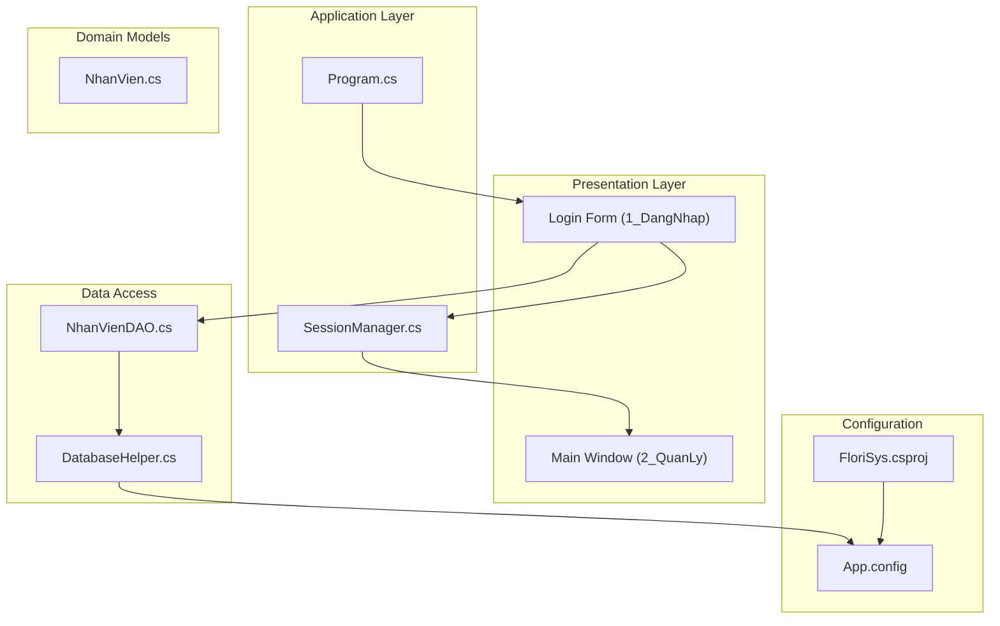
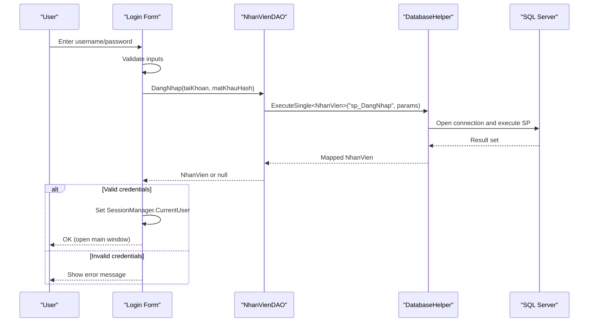
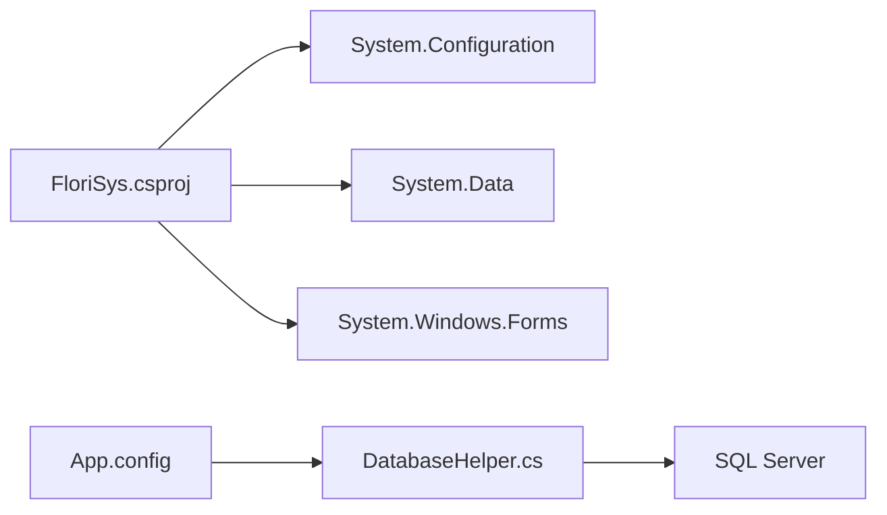

# Getting Started

<cite>
**Referenced Files in This Document**
- [FloriSys_Database.sql](file://FloriSys_Database.sql)
- [App.config](file://App.config)
- [Program.cs](file://Program.cs)
- [DatabaseHelper.cs](file://DataAccess/DatabaseHelper.cs)
- [frmDangNhap.cs](file://1_DangNhap/frmDangNhap.cs)
- [NhanVienDAO.cs](file://DataAccess/NhanVienDAO.cs)
- [SessionManager.cs](file://Services/SessionManager.cs)
- [NhanVien.cs](file://Models/NhanVien.cs)
- [fix_sp.sql](file://fix_sp.sql)
- [fix_sp2.sql](file://fix_sp2.sql)
- [FloriSys.csproj](file://FloriSys.csproj)
- [README.md](file://README.md)
- [Giao_dien.html](file://Giao_dien.html)
</cite>

## Table of Contents
1. [Introduction](#introduction)
2. [Project Structure](#project-structure)
3. [Core Components](#core-components)
4. [Architecture Overview](#architecture-overview)
5. [Detailed Component Analysis](#detailed-component-analysis)
6. [Dependency Analysis](#dependency-analysis)
7. [Performance Considerations](#performance-considerations)
8. [Troubleshooting Guide](#troubleshooting-guide)
9. [Conclusion](#conclusion)
10. [Appendices](#appendices)

## Introduction
This guide helps you install and run FloriSys, a Windows Forms inventory and order management system for a flower shop. It covers prerequisites, database setup, connection configuration, first-time launch, default admin credentials, and initial checks. It also includes troubleshooting tips for common setup issues.

## Project Structure
FloriSys is a WinForms application targeting .NET Framework 4.7.2. The solution includes:
- Login and main UI under 1_DangNhap and 2_QuanLy
- Feature modules for Sales, Warehouse, Delivery, Reports, and Catalogs
- Data access layer (DataAccess) and models (Models)
- Session management (Services)
- Shared UI components (Shared)
- Configuration via App.config and project metadata

**Diagram sources**
- [Program.cs:1-25](file://Program.cs#L1-L25)
- [DatabaseHelper.cs:1-212](file://DataAccess/DatabaseHelper.cs#L1-L212)
- [NhanVienDAO.cs:1-99](file://DataAccess/NhanVienDAO.cs#L1-L99)
- [SessionManager.cs:1-62](file://Services/SessionManager.cs#L1-L62)
- [NhanVien.cs:1-40](file://Models/NhanVien.cs#L1-L40)
- [App.config:1-9](file://App.config#L1-L9)
- [FloriSys.csproj:1-388](file://FloriSys.csproj#L1-L388)

**Section sources**
- [FloriSys.csproj:1-388](file://FloriSys.csproj#L1-L388)
- [README.md:1-1](file://README.md#L1-L1)

## Core Components
- Database: SQL Server 2022 with a dedicated database named FloriSys. The schema and stored procedures are provided in the database script.
- Connection: The app reads the connection string from App.config and uses a helper to open connections and execute stored procedures.
- Authentication: Login invokes a stored procedure to validate credentials and loads the current user into session.
- Startup: The application launches the login form; on success, it opens the main window.

Key configuration and runtime elements:
- Target framework and references are defined in the project file.
- Connection string defaults to integrated security and trust server certificate.
- Login form validates input, hashes the password, and calls the employee DAO to authenticate.

**Section sources**
- [FloriSys_Database.sql:1-706](file://FloriSys_Database.sql#L1-L706)
- [App.config:1-9](file://App.config#L1-L9)
- [DatabaseHelper.cs:91-122](file://DataAccess/DatabaseHelper.cs#L91-L122)
- [frmDangNhap.cs:22-60](file://1_DangNhap/frmDangNhap.cs#L22-L60)
- [NhanVienDAO.cs:11-18](file://DataAccess/NhanVienDAO.cs#L11-L18)
- [SessionManager.cs:31-41](file://Services/SessionManager.cs#L31-L41)
- [Program.cs:17-22](file://Program.cs#L17-L22)

## Architecture Overview
The system follows a layered architecture:
- Presentation: WinForms forms handle user interactions.
- Application: Session manager stores current user context.
- Data Access: Generic helpers execute stored procedures and map results to models.
- Domain Models: Strongly typed entities represent business objects.
- Configuration: App.config holds connection string and runtime settings.

**Diagram sources**
- [frmDangNhap.cs:22-60](file://1_DangNhap/frmDangNhap.cs#L22-L60)
- [NhanVienDAO.cs:11-18](file://DataAccess/NhanVienDAO.cs#L11-L18)
- [DatabaseHelper.cs:104-122](file://DataAccess/DatabaseHelper.cs#L104-L122)
- [SessionManager.cs:12-24](file://Services/SessionManager.cs#L12-L24)

## Detailed Component Analysis

### Installation and Setup Prerequisites
- Operating system: Windows with SQL Server installed.
- .NET Framework: Version 4.7.2 is required by the project.
- SQL Server: The database script targets SQL Server 2022.

Verification steps:
- Confirm the project’s target framework matches your development environment.
- Ensure SQL Server is reachable and supports SQL Server authentication if needed.

**Section sources**
- [FloriSys.csproj:11](file://FloriSys.csproj#L11)
- [FloriSys_Database.sql:3](file://FloriSys_Database.sql#L3)

### Database Deployment
Follow these steps to deploy the database:
1. Open SQL Server Management Studio (SSMS) or equivalent.
2. Connect to your SQL Server instance.
3. Run the database creation script to drop and recreate the database, create tables, triggers, stored procedures, and seed data.
4. Verify the database and schema were created successfully.

Notes:
- The script creates the database named FloriSys and seeds sample employees, products, customers, orders, and permissions.
- A stored procedure for generating auto-incremented codes is included.

**Section sources**
- [FloriSys_Database.sql:6-16](file://FloriSys_Database.sql#L6-L16)
- [FloriSys_Database.sql:20-177](file://FloriSys_Database.sql#L20-L177)
- [FloriSys_Database.sql:549-563](file://FloriSys_Database.sql#L549-L563)

### Connection String Configuration
By default, the application expects:
- Database: FloriSys
- Integrated Security: True
- TrustServerCertificate: True

If you need to change the server or authentication mode:
- Edit the connection string in App.config.
- Ensure the SQL Server instance name matches your environment.

**Section sources**
- [App.config:3-5](file://App.config#L3-L5)
- [DatabaseHelper.cs:91-97](file://DataAccess/DatabaseHelper.cs#L91-L97)

### First-Time Launch
1. Build the solution in your IDE targeting .NET Framework 4.7.2.
2. Run the application.
3. The login form appears automatically.

Login with the default admin account:
- Username: admin
- Password: 123456

On successful login, the main dashboard opens.

**Section sources**
- [Program.cs:17-22](file://Program.cs#L17-L22)
- [frmDangNhap.cs:22-60](file://1_DangNhap/frmDangNhap.cs#L22-L60)
- [FloriSys_Database.sql:569-575](file://FloriSys_Database.sql#L569-L575)

### Default Administrator Account and Initial Users
The database script seeds several users. The default admin account is:
- Username: admin
- Password: 123456
- Role: Admin

Other roles seeded include Cashier, Warehouse, and Shipper. Their default passwords are also 123456.

**Section sources**
- [FloriSys_Database.sql:569-575](file://FloriSys_Database.sql#L569-L575)

### Initial User Configuration
- Change default passwords immediately after first login.
- Use the “Change Password” screen to update credentials securely.
- The system hashes passwords using SHA-256 before storing.

**Section sources**
- [SessionManager.cs:31-41](file://Services/SessionManager.cs#L31-L41)
- [NhanVienDAO.cs:20-29](file://DataAccess/NhanVienDAO.cs#L20-L29)

### Basic System Verification
After logging in:
- Verify navigation menus for your role.
- Check dashboards and module availability.
- Confirm reports and catalogs load without errors.

Screenshots (descriptive):
- Login interface: Enter username and password, click login.
- Dashboard: Overview cards for orders, revenue, delivery, and low stock alerts.
- Order list: Filter and view orders by status and date.
- Inventory: View stock levels and low-stock warnings.
- Delivery: Assign and update delivery statuses.

Note: The HTML file provides a visual walkthrough of screens and roles.

**Section sources**
- [Giao_dien.html:227-239](file://Giao_dien.html#L227-L239)
- [Giao_dien.html:262-320](file://Giao_dien.html#L262-L320)
- [Giao_dien.html:322-368](file://Giao_dien.html#L322-L368)
- [Giao_dien.html:559-593](file://Giao_dien.html#L559-L593)
- [Giao_dien.html:704-736](file://Giao_dien.html#L704-L736)

### Stored Procedure Updates (if applicable)
There are two scripts altering the delivery status update stored procedure. Apply the appropriate fix depending on your environment:
- Use the first fix script to update the stored procedure definition.
- Alternatively, use the second fix script if it aligns with your intended behavior.

**Section sources**
- [fix_sp.sql:1-36](file://fix_sp.sql#L1-L36)
- [fix_sp2.sql:1-35](file://fix_sp2.sql#L1-L35)

## Dependency Analysis
The application depends on:
- .NET Framework 4.7.2
- System.Configuration for connection strings
- System.Data.SqlClient for database connectivity
- Windows Forms for UI

**Diagram sources**
- [FloriSys.csproj:39-49](file://FloriSys.csproj#L39-L49)
- [App.config:3-5](file://App.config#L3-L5)
- [DatabaseHelper.cs:1-20](file://DataAccess/DatabaseHelper.cs#L1-L20)

**Section sources**
- [FloriSys.csproj:39-49](file://FloriSys.csproj#L39-L49)
- [App.config:3-5](file://App.config#L3-L5)

## Performance Considerations
- Use stored procedures for data operations to minimize round trips and leverage server-side processing.
- Keep connection strings secure and avoid unnecessary reconnections.
- Monitor queries related to order totals and inventory updates, especially during bulk operations.

## Troubleshooting Guide

Common issues and resolutions:
- Cannot connect to database
  - Verify the database exists and SQL Server is running.
  - Confirm the connection string in App.config matches your server and database name.
  - If using SQL authentication, adjust the connection string accordingly.
  - Ensure TrustServerCertificate is configured as needed for local development.

- Login fails or “Cannot connect to database”
  - Ensure the login form runs without exceptions.
  - Confirm the stored procedure for login exists and is valid.
  - Check that the hashed password matches the stored hash.

- Permission errors
  - Ensure the login account is active and has the correct role.
  - Review role-based permissions in the database seed data.

- Delivery status update anomalies
  - Apply the appropriate stored procedure fix script if your environment requires it.

**Section sources**
- [App.config:3-5](file://App.config#L3-L5)
- [DatabaseHelper.cs:91-122](file://DataAccess/DatabaseHelper.cs#L91-L122)
- [frmDangNhap.cs:55-59](file://1_DangNhap/frmDangNhap.cs#L55-L59)
- [NhanVienDAO.cs:11-18](file://DataAccess/NhanVienDAO.cs#L11-L18)
- [fix_sp.sql:1-36](file://fix_sp.sql#L1-L36)
- [fix_sp2.sql:1-35](file://fix_sp2.sql#L1-L35)

## Conclusion
You now have the essential steps to install, configure, and launch FloriSys. Deploy the database, confirm the connection string, log in with the default admin credentials, and verify core modules. Address any connectivity or permission issues using the troubleshooting guidance.

## Appendices

### Quick Checklist
- Install SQL Server 2022 and .NET Framework 4.7.2.
- Run the database script to create the FloriSys database.
- Verify App.config connection string.
- Build and run the application.
- Log in with admin/admin123.
- Change default passwords.
- Explore dashboards and modules.

### Screenshots (Descriptive)
- Login Screen: Enter username and password, click login.
- Dashboard: Cards for orders, revenue, delivery, and low stock.
- Order List: Filter by status/date, export to Excel.
- Inventory: Search and manage stock levels.
- Delivery: Assign and update delivery statuses.

**Section sources**
- [Giao_dien.html:227-239](file://Giao_dien.html#L227-L239)
- [Giao_dien.html:262-320](file://Giao_dien.html#L262-L320)
- [Giao_dien.html:322-368](file://Giao_dien.html#L322-L368)
- [Giao_dien.html:559-593](file://Giao_dien.html#L559-L593)
- [Giao_dien.html:704-736](file://Giao_dien.html#L704-L736)