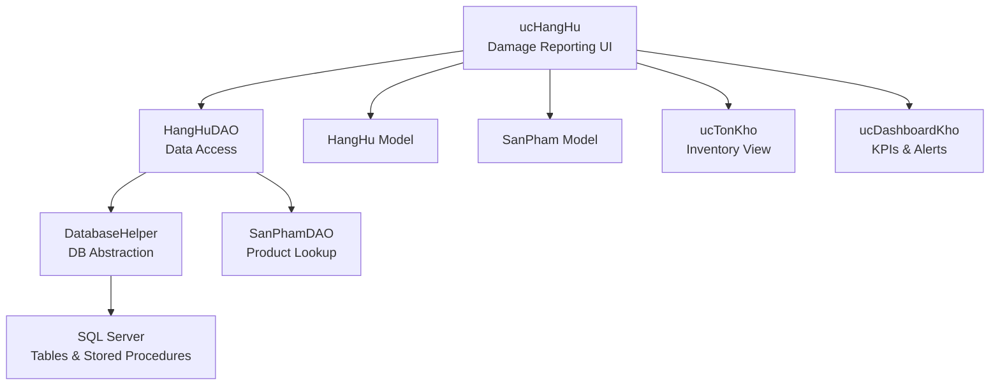
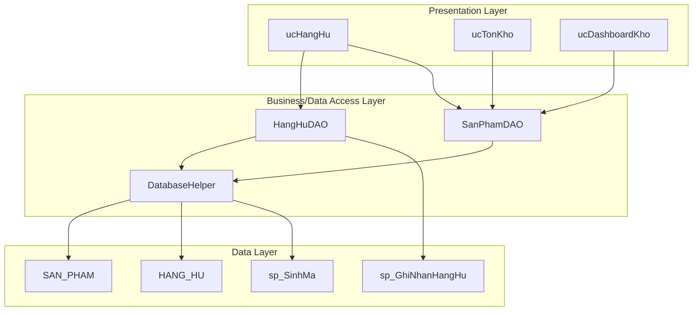
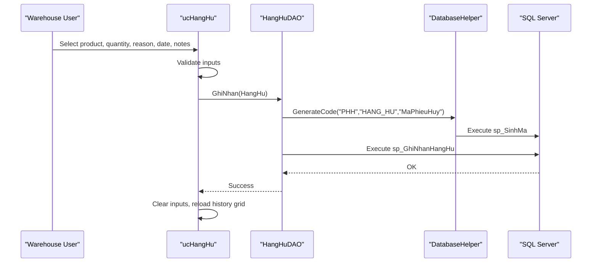
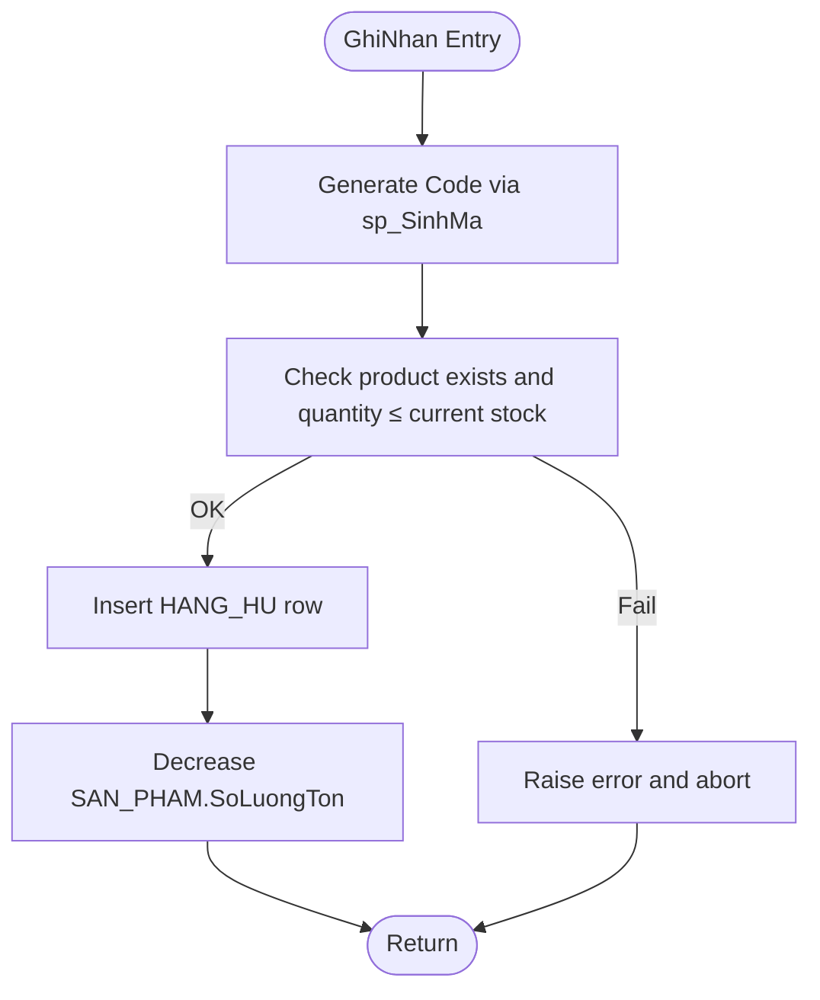
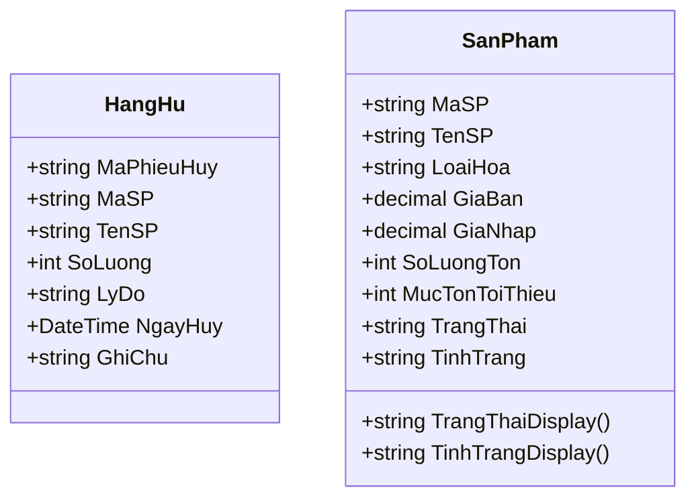
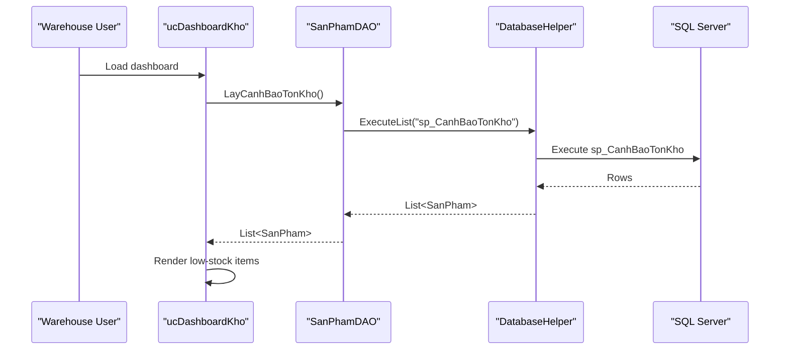
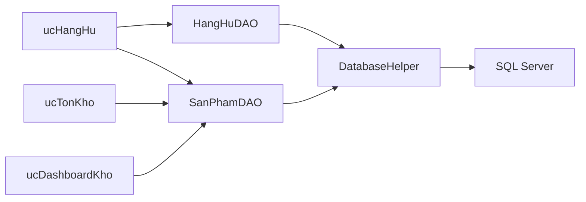

# Damage Reporting & Inventory Adjustments

<cite>
**Referenced Files in This Document**
- [ucHangHu.Designer.cs](file://4_KhoHang/ucHangHu.Designer.cs)
- [ucHangHu.cs](file://4_KhoHang/ucHangHu.cs)
- [HangHuDAO.cs](file://DataAccess/HangHuDAO.cs)
- [HangHu.cs](file://Models/HangHu.cs)
- [SanPhamDAO.cs](file://DataAccess/SanPhamDAO.cs)
- [SanPham.cs](file://Models/SanPham.cs)
- [DatabaseHelper.cs](file://DataAccess/DatabaseHelper.cs)
- [FloriSys_Database.sql](file://FloriSys_Database.sql)
- [ucTonKho.Designer.cs](file://4_KhoHang/ucTonKho.Designer.cs)
- [ucTonKho.cs](file://4_KhoHang/ucTonKho.cs)
- [ucDashboardKho.Designer.cs](file://4_KhoHang/ucDashboardKho.Designer.cs)
- [ucDashboardKho.cs](file://4_KhoHang/ucDashboardKho.cs)
- [mock.sql](file://mock.sql)
</cite>

## Table of Contents
1. [Introduction](#introduction)
2. [Project Structure](#project-structure)
3. [Core Components](#core-components)
4. [Architecture Overview](#architecture-overview)
5. [Detailed Component Analysis](#detailed-component-analysis)
6. [Dependency Analysis](#dependency-analysis)
7. [Performance Considerations](#performance-considerations)
8. [Troubleshooting Guide](#troubleshooting-guide)
9. [Conclusion](#conclusion)
10. [Appendices](#appendices)

## Introduction
This document describes the Damage Reporting & Inventory Adjustments system within the Inventory Management Module. It covers the end-to-end workflow for identifying damaged goods, documenting incidents, adjusting inventory, tracking shrinkage, and integrating with broader warehouse operations. It also outlines operational guidelines for handling damaged inventory, disposal/write-off processes, cause analysis, supplier liability and warranty claims, and preventive measures grounded in storage conditions and quality assurance protocols.

## Project Structure
The system centers around a dedicated user control for damage reporting, backed by a data access layer and a domain model, with integration points into product inventory and dashboard views.

**Diagram sources**
- [ucHangHu.cs:11-114](file://4_KhoHang/ucHangHu.cs#L11-L114)
- [HangHuDAO.cs:9-40](file://DataAccess/HangHuDAO.cs#L9-L40)
- [DatabaseHelper.cs:10-212](file://DataAccess/DatabaseHelper.cs#L10-L212)
- [SanPhamDAO.cs:9-96](file://DataAccess/SanPhamDAO.cs#L9-L96)
- [HangHu.cs:5-16](file://Models/HangHu.cs#L5-L16)
- [SanPham.cs:5-42](file://Models/SanPham.cs#L5-L42)
- [ucTonKho.cs:9-57](file://4_KhoHang/ucTonKho.cs#L9-L57)
- [ucDashboardKho.cs:10-107](file://4_KhoHang/ucDashboardKho.cs#L10-L107)

**Section sources**
- [ucHangHu.Designer.cs:18-352](file://4_KhoHang/ucHangHu.Designer.cs#L18-L352)
- [ucHangHu.cs:11-114](file://4_KhoHang/ucHangHu.cs#L11-L114)
- [HangHuDAO.cs:9-40](file://DataAccess/HangHuDAO.cs#L9-L40)
- [DatabaseHelper.cs:10-212](file://DataAccess/DatabaseHelper.cs#L10-L212)
- [SanPhamDAO.cs:9-96](file://DataAccess/SanPhamDAO.cs#L9-L96)
- [HangHu.cs:5-16](file://Models/HangHu.cs#L5-L16)
- [SanPham.cs:5-42](file://Models/SanPham.cs#L5-L42)
- [ucTonKho.Designer.cs:8-42](file://4_KhoHang/ucTonKho.Designer.cs#L8-L42)
- [ucTonKho.cs:9-57](file://4_KhoHang/ucTonKho.cs#L9-L57)
- [ucDashboardKho.Designer.cs:18-356](file://4_KhoHang/ucDashboardKho.Designer.cs#L18-L356)
- [ucDashboardKho.cs:10-107](file://4_KhoHang/ucDashboardKho.cs#L10-L107)

## Core Components
- Damage Reporting UI (ucHangHu): Provides controls to select a product, quantity, reason, date, and notes; saves entries via DAO; displays monthly history and computed loss summary.
- Data Access (HangHuDAO): Generates unique document codes, persists damage records, and queries monthly history.
- Domain Models (HangHu, SanPham): Define shape of damage records and product inventory data.
- Database Layer (SQL Server): Stores products, damage records, and exposes stored procedures for damage reporting and inventory adjustments.
- Inventory Views (ucTonKho, ucDashboardKho): Support visibility into current stock levels and low-stock warnings.

**Section sources**
- [ucHangHu.cs:17-111](file://4_KhoHang/ucHangHu.cs#L17-L111)
- [HangHuDAO.cs:11-37](file://DataAccess/HangHuDAO.cs#L11-L37)
- [HangHu.cs:5-16](file://Models/HangHu.cs#L5-L16)
- [SanPham.cs:5-42](file://Models/SanPham.cs#L5-L42)
- [ucTonKho.cs:13-36](file://4_KhoHang/ucTonKho.cs#L13-L36)
- [ucDashboardKho.cs:50-60](file://4_KhoHang/ucDashboardKho.cs#L50-L60)

## Architecture Overview
The system follows a layered architecture:
- Presentation layer: Windows Forms user controls for damage reporting, inventory viewing, and dashboards.
- Business/data access layer: DAO classes encapsulate database interactions and mapping.
- Data layer: SQL Server tables and stored procedures manage persistence and business logic.

**Diagram sources**
- [ucHangHu.cs:11-114](file://4_KhoHang/ucHangHu.cs#L11-L114)
- [ucTonKho.cs:13-36](file://4_KhoHang/ucTonKho.cs#L13-L36)
- [ucDashboardKho.cs:50-60](file://4_KhoHang/ucDashboardKho.cs#L50-L60)
- [HangHuDAO.cs:11-37](file://DataAccess/HangHuDAO.cs#L11-L37)
- [SanPhamDAO.cs:11-33](file://DataAccess/SanPhamDAO.cs#L11-L33)
- [DatabaseHelper.cs:189-209](file://DataAccess/DatabaseHelper.cs#L189-L209)
- [FloriSys_Database.sql:154-161](file://FloriSys_Database.sql#L154-L161)
- [FloriSys_Database.sql:385-411](file://FloriSys_Database.sql#L385-L411)
- [FloriSys_Database.sql:549-563](file://FloriSys_Database.sql#L549-L563)

## Detailed Component Analysis

### Damage Reporting UI (ucHangHu)
Responsibilities:
- Populate product dropdown from product catalog.
- Allow selection of reason, quantity, date, and free-text notes.
- Persist damage record via DAO and refresh history grid.
- Compute and display monthly total loss.

**Diagram sources**
- [ucHangHu.cs:82-111](file://4_KhoHang/ucHangHu.cs#L82-L111)
- [HangHuDAO.cs:11-22](file://DataAccess/HangHuDAO.cs#L11-L22)
- [DatabaseHelper.cs:189-209](file://DataAccess/DatabaseHelper.cs#L189-L209)
- [FloriSys_Database.sql:385-411](file://FloriSys_Database.sql#L385-L411)
- [FloriSys_Database.sql:549-563](file://FloriSys_Database.sql#L549-L563)

**Section sources**
- [ucHangHu.Designer.cs:18-352](file://4_KhoHang/ucHangHu.Designer.cs#L18-L352)
- [ucHangHu.cs:17-111](file://4_KhoHang/ucHangHu.cs#L17-L111)
- [HangHuDAO.cs:11-22](file://DataAccess/HangHuDAO.cs#L11-L22)

### Data Access Layer (HangHuDAO)
Responsibilities:
- Generate unique damage report ID using a generic code generator.
- Insert damage record and update product inventory accordingly.
- Retrieve monthly damage history for reporting.

**Diagram sources**
- [HangHuDAO.cs:11-22](file://DataAccess/HangHuDAO.cs#L11-L22)
- [FloriSys_Database.sql:385-411](file://FloriSys_Database.sql#L385-L411)
- [FloriSys_Database.sql:549-563](file://FloriSys_Database.sql#L549-L563)

**Section sources**
- [HangHuDAO.cs:11-37](file://DataAccess/HangHuDAO.cs#L11-L37)
- [DatabaseHelper.cs:189-209](file://DataAccess/DatabaseHelper.cs#L189-L209)
- [FloriSys_Database.sql:385-411](file://FloriSys_Database.sql#L385-L411)

### Domain Models
- HangHu: Encapsulates a single damage event with identifiers, product reference, quantity, reason, timestamp, and notes.
- SanPham: Encapsulates product inventory with pricing, quantities, thresholds, and status.

**Diagram sources**
- [HangHu.cs:5-16](file://Models/HangHu.cs#L5-L16)
- [SanPham.cs:5-42](file://Models/SanPham.cs#L5-L42)

**Section sources**
- [HangHu.cs:5-16](file://Models/HangHu.cs#L5-L16)
- [SanPham.cs:5-42](file://Models/SanPham.cs#L5-L42)

### Inventory Visibility and Alerts
- ucTonKho: Displays current stock levels with filtering/search capabilities.
- ucDashboardKho: Shows low-stock alerts and KPIs, supporting proactive damage prevention.

**Diagram sources**
- [ucDashboardKho.cs:50-60](file://4_KhoHang/ucDashboardKho.cs#L50-L60)
- [SanPhamDAO.cs:90-93](file://DataAccess/SanPhamDAO.cs#L90-L93)
- [DatabaseHelper.cs:19-23](file://DataAccess/DatabaseHelper.cs#L19-L23)
- [FloriSys_Database.sql:533-547](file://FloriSys_Database.sql#L533-L547)

**Section sources**
- [ucTonKho.Designer.cs:8-42](file://4_KhoHang/ucTonKho.Designer.cs#L8-L42)
- [ucTonKho.cs:13-36](file://4_KhoHang/ucTonKho.cs#L13-L36)
- [ucDashboardKho.Designer.cs:18-356](file://4_KhoHang/ucDashboardKho.Designer.cs#L18-L356)
- [ucDashboardKho.cs:50-60](file://4_KhoHang/ucDashboardKho.cs#L50-L60)
- [SanPhamDAO.cs:90-93](file://DataAccess/SanPhamDAO.cs#L90-L93)
- [FloriSys_Database.sql:533-547](file://FloriSys_Database.sql#L533-L547)

## Dependency Analysis
- ucHangHu depends on HangHuDAO for persistence and SanPhamDAO for product lookup.
- HangHuDAO depends on DatabaseHelper for generic DB operations and on stored procedures for business logic.
- ucTonKho and ucDashboardKho depend on SanPhamDAO for inventory and alert data.

**Diagram sources**
- [ucHangHu.cs:11-114](file://4_KhoHang/ucHangHu.cs#L11-L114)
- [HangHuDAO.cs:9-40](file://DataAccess/HangHuDAO.cs#L9-L40)
- [SanPhamDAO.cs:9-96](file://DataAccess/SanPhamDAO.cs#L9-L96)
- [DatabaseHelper.cs:10-212](file://DataAccess/DatabaseHelper.cs#L10-L212)
- [ucTonKho.cs:13-36](file://4_KhoHang/ucTonKho.cs#L13-L36)
- [ucDashboardKho.cs:50-60](file://4_KhoHang/ucDashboardKho.cs#L50-L60)

**Section sources**
- [ucHangHu.cs:11-114](file://4_KhoHang/ucHangHu.cs#L11-L114)
- [HangHuDAO.cs:9-40](file://DataAccess/HangHuDAO.cs#L9-L40)
- [SanPhamDAO.cs:9-96](file://DataAccess/SanPhamDAO.cs#L9-L96)
- [DatabaseHelper.cs:10-212](file://DataAccess/DatabaseHelper.cs#L10-L212)
- [ucTonKho.cs:13-36](file://4_KhoHang/ucTonKho.cs#L13-L36)
- [ucDashboardKho.cs:50-60](file://4_KhoHang/ucDashboardKho.cs#L50-L60)

## Performance Considerations
- Stored procedure logic validates inventory prior to updates, preventing inconsistent states and reducing retries.
- Generic mapping helpers minimize reflection overhead by caching property info and reusing mapped lists.
- Grid rendering is optimized with fixed column headers and auto-size modes suitable for typical datasets.

[No sources needed since this section provides general guidance]

## Troubleshooting Guide
Common issues and resolutions:
- Product not found or insufficient stock during damage reporting:
  - The stored procedure checks product existence and available quantity before inserting a damage record. Verify product code and current stock level.
- Duplicate or invalid document code generation:
  - Ensure the generic code generator is invoked correctly and that prefixes and table/column names match expectations.
- UI not refreshing after save:
  - Confirm the save handler clears inputs and reloads the history grid.

**Section sources**
- [FloriSys_Database.sql:395-410](file://FloriSys_Database.sql#L395-L410)
- [DatabaseHelper.cs:189-209](file://DataAccess/DatabaseHelper.cs#L189-L209)
- [ucHangHu.cs:82-111](file://4_KhoHang/ucHangHu.cs#L82-L111)

## Conclusion
The Damage Reporting & Inventory Adjustments system provides a robust, database-backed workflow for recording and acting upon damaged inventory. It integrates tightly with product inventory and reporting views, enabling warehouse staff to quickly document incidents, adjust stock levels, and monitor shrinkage. The design supports operational excellence through clear UI, reliable persistence, and visibility into low-stock conditions that can help prevent future losses.

[No sources needed since this section summarizes without analyzing specific files]

## Appendices

### Operational Guidelines for Damaged Inventory
- Identification and documentation:
  - Use the Damage Reporting UI to select the affected product, enter quantity, choose a reason, set the date, and add notes.
- Inventory adjustment:
  - The system automatically reduces stock upon successful damage reporting.
- Disposal and write-off:
  - After confirming the physical removal of damaged goods, ensure the system reflects the adjusted stock. For financial write-offs, coordinate with accounting using the documented damage records.
- Shrinkage tracking and loss calculation:
  - Monthly totals are computed from the damage history grid. Use this to estimate shrinkage trends and costs.
- Quality control integration:
  - Link reasons to quality control categories (e.g., transport damage, expiry) to support corrective actions.
- Supplier liability and warranty:
  - Attach supplier return references and warranty claim numbers to the damage record notes. Coordinate with procurement for credit notes or replacements.
- Preventive measures:
  - Monitor low-stock alerts and storage conditions to reduce spoilage. Implement rotation policies and environmental controls aligned with product types.
- Vendor performance evaluation:
  - Aggregate damage rates per supplier and product category to inform vendor scorecards and contract negotiations.

[No sources needed since this section provides general guidance]

### Database Schema and Stored Procedures (Damage Reporting)
- Tables involved:
  - SAN_PHAM: Product inventory and thresholds.
  - HANG_HU: Damage reporting history.
- Key stored procedures:
  - sp_GhiNhanHangHu: Validates and inserts damage records while updating stock.
  - sp_SinhMa: Generates unique document codes.

**Section sources**
- [FloriSys_Database.sql:49-58](file://FloriSys_Database.sql#L49-L58)
- [FloriSys_Database.sql:154-161](file://FloriSys_Database.sql#L154-L161)
- [FloriSys_Database.sql:385-411](file://FloriSys_Database.sql#L385-L411)
- [FloriSys_Database.sql:549-563](file://FloriSys_Database.sql#L549-L563)

### Sample Data Generation
- The mock script demonstrates automated order and delivery creation for testing scenarios, indirectly validating end-to-end flows including inventory adjustments.

**Section sources**
- [mock.sql:1-62](file://mock.sql#L1-L62)