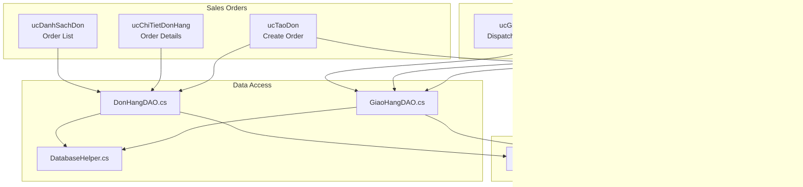
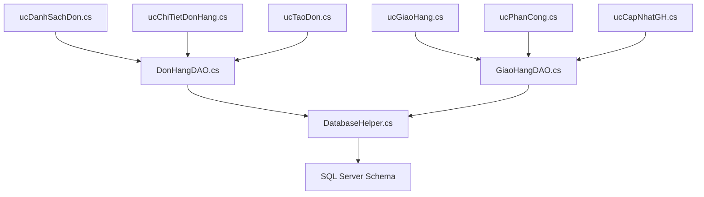
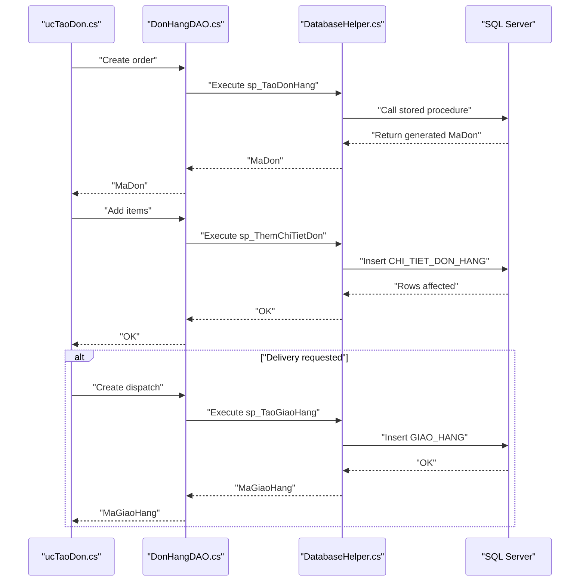
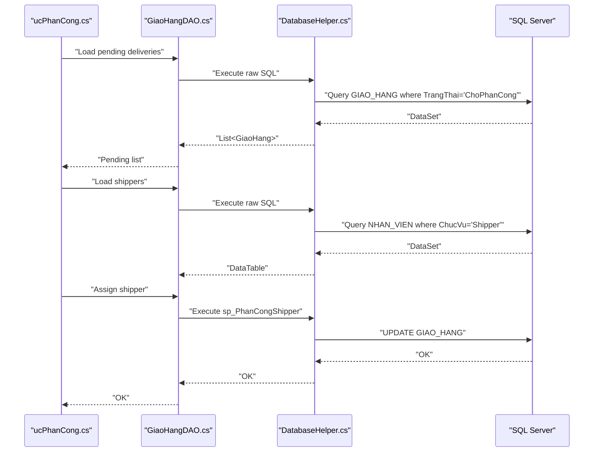
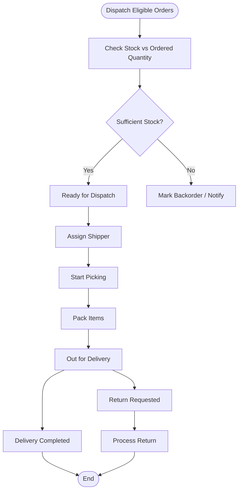
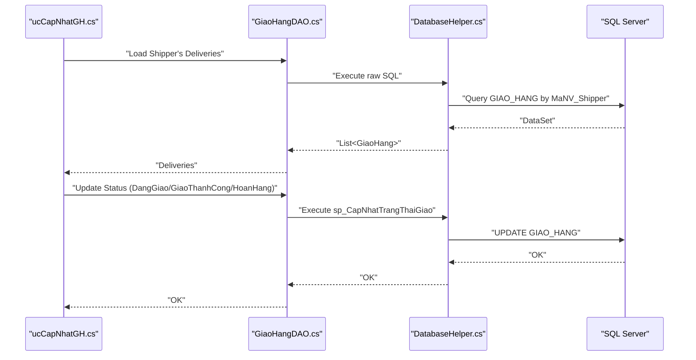
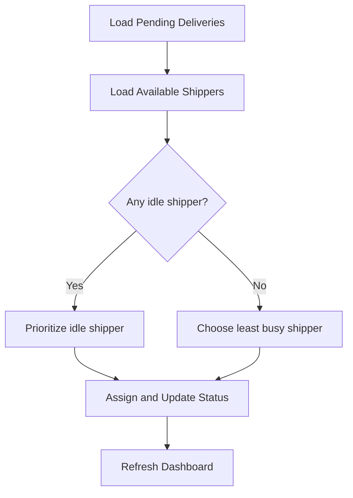
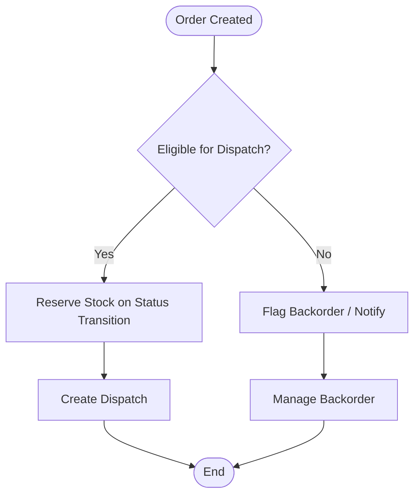
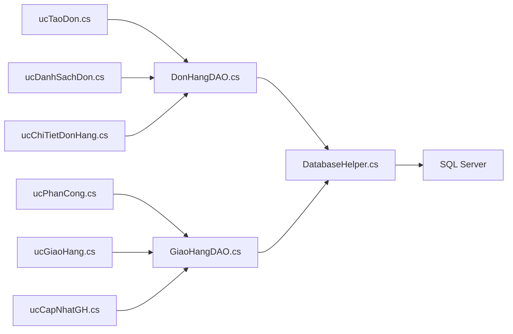
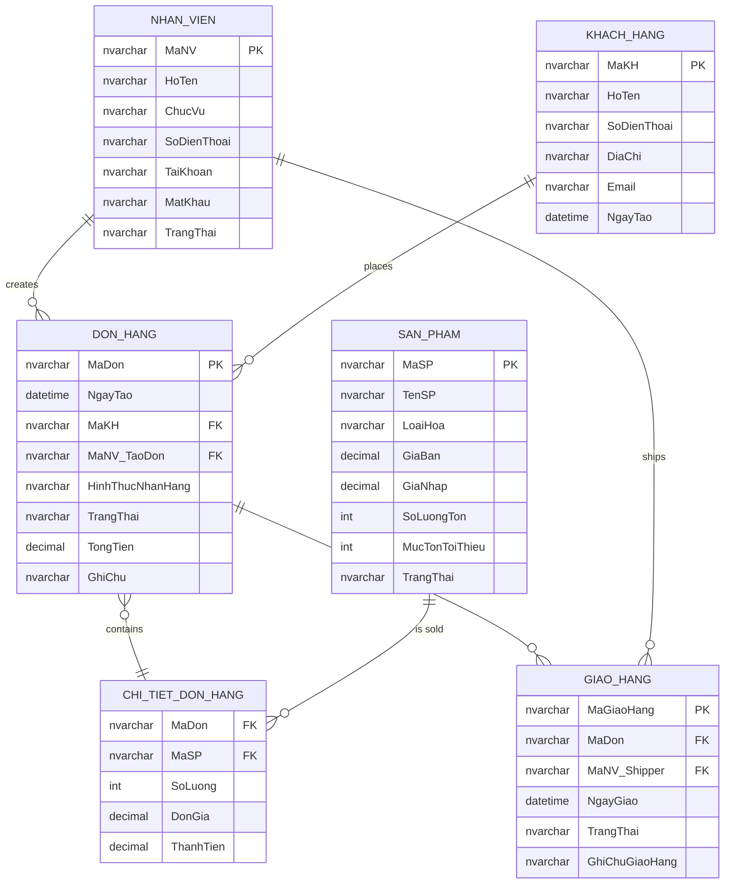

# Dispatch & Order Fulfillment

<cite>
**Referenced Files in This Document**
- [DonHang.cs](file://Models/DonHang.cs)
- [DonHangDAO.cs](file://DataAccess/DonHangDAO.cs)
- [GiaoHang.cs](file://Models/GiaoHang.cs)
- [GiaoHangDAO.cs](file://DataAccess/GiaoHangDAO.cs)
- [ucDanhSachDon.cs](file://3_BanHang/ucDanhSachDon.cs)
- [ucChiTietDonHang.cs](file://3_BanHang/ucChiTietDonHang.cs)
- [ucTaoDon.cs](file://3_BanHang/ucTaoDon.cs)
- [ucGiaoHang.cs](file://5_GiaoHang/ucGiaoHang.cs)
- [ucCapNhatGH.cs](file://5_GiaoHang/ucCapNhatGH.cs)
- [ucPhanCong.cs](file://5_GiaoHang/ucPhanCong.cs)
- [DatabaseHelper.cs](file://DataAccess/DatabaseHelper.cs)
- [FloriSys_Database.sql](file://FloriSys_Database.sql)
- [fix_sp.sql](file://fix_sp.sql)
- [SanPham.cs](file://Models/SanPham.cs)
</cite>

## Table of Contents
1. [Introduction](#introduction)
2. [Project Structure](#project-structure)
3. [Core Components](#core-components)
4. [Architecture Overview](#architecture-overview)
5. [Detailed Component Analysis](#detailed-component-analysis)
6. [Dependency Analysis](#dependency-analysis)
7. [Performance Considerations](#performance-considerations)
8. [Troubleshooting Guide](#troubleshooting-guide)
9. [Conclusion](#conclusion)
10. [Appendices](#appendices)

## Introduction
This document describes the Dispatch & Order Fulfillment system within the Inventory Management Module. It explains the end-to-end order fulfillment workflow from sales order creation to warehouse dispatch and delivery, including dispatch assignment, picking, packing, and shipment coordination. It also documents operational procedures for order batching, priority handling, fulfillment optimization, inventory allocation, stock reservation, backorders, partial shipments, order modifications, customer service requests, dispatch documentation, shipping label generation, integration with shipping providers, exception handling, damaged item reporting, and return processing.

## Project Structure
The Dispatch & Fulfillment domain spans three main areas:
- Sales Orders: Creation, viewing, and status updates for orders.
- Dispatch Management: Dispatch creation, assignment to shipping staff, and status updates.
- Warehouse Operations: Inventory availability checks and stock adjustments aligned with order processing.

**Diagram sources**
- [ucDanhSachDon.cs:1-114](file://3_BanHang/ucDanhSachDon.cs#L1-L114)
- [ucChiTietDonHang.cs:1-132](file://3_BanHang/ucChiTietDonHang.cs#L1-L132)
- [ucTaoDon.cs:1-162](file://3_BanHang/ucTaoDon.cs#L1-L162)
- [ucGiaoHang.cs:1-139](file://5_GiaoHang/ucGiaoHang.cs#L1-L139)
- [ucPhanCong.cs:1-215](file://5_GiaoHang/ucPhanCong.cs#L1-L215)
- [ucCapNhatGH.cs:1-184](file://5_GiaoHang/ucCapNhatGH.cs#L1-L184)
- [DonHangDAO.cs:1-114](file://DataAccess/DonHangDAO.cs#L1-L114)
- [GiaoHangDAO.cs:1-96](file://DataAccess/GiaoHangDAO.cs#L1-L96)
- [DatabaseHelper.cs:1-212](file://DataAccess/DatabaseHelper.cs#L1-L212)
- [DonHang.cs:1-63](file://Models/DonHang.cs#L1-L63)
- [GiaoHang.cs:1-47](file://Models/GiaoHang.cs#L1-L47)
- [SanPham.cs:1-42](file://Models/SanPham.cs#L1-L42)

**Section sources**
- [DonHangDAO.cs:11-111](file://DataAccess/DonHangDAO.cs#L11-L111)
- [GiaoHangDAO.cs:10-93](file://DataAccess/GiaoHangDAO.cs#L10-L93)
- [ucTaoDon.cs:102-140](file://3_BanHang/ucTaoDon.cs#L102-L140)
- [ucPhanCong.cs:49-83](file://5_GiaoHang/ucPhanCong.cs#L49-L83)
- [ucCapNhatGH.cs:31-92](file://5_GiaoHang/ucCapNhatGH.cs#L31-L92)

## Core Components
- Sales Order Model and DAO
  - DonHang model encapsulates order metadata, customer info, and order items.
  - DonHangDAO provides queries for order lists, details, creation, item addition, and status updates.
- Dispatch Model and DAO
  - GiaoHang model captures delivery assignments, shipper, and delivery status.
  - GiaoHangDAO manages dispatch list retrieval, creation, shipper assignment, and status updates.
- UI Components
  - Order list/detail screens for visibility and status updates.
  - Order creation screen for new sales orders and optional dispatch creation.
  - Dispatch dashboard, shipper assignment, and daily update screens for delivery staff.

**Section sources**
- [DonHang.cs:6-62](file://Models/DonHang.cs#L6-L62)
- [DonHangDAO.cs:11-111](file://DataAccess/DonHangDAO.cs#L11-L111)
- [GiaoHang.cs:5-46](file://Models/GiaoHang.cs#L5-L46)
- [GiaoHangDAO.cs:10-93](file://DataAccess/GiaoHangDAO.cs#L10-L93)
- [ucDanhSachDon.cs:19-45](file://3_BanHang/ucDanhSachDon.cs#L19-L45)
- [ucChiTietDonHang.cs:33-56](file://3_BanHang/ucChiTietDonHang.cs#L33-L56)
- [ucTaoDon.cs:102-140](file://3_BanHang/ucTaoDon.cs#L102-L140)
- [ucGiaoHang.cs:25-65](file://5_GiaoHang/ucGiaoHang.cs#L25-L65)
- [ucPhanCong.cs:49-83](file://5_GiaoHang/ucPhanCong.cs#L49-L83)
- [ucCapNhatGH.cs:31-92](file://5_GiaoHang/ucCapNhatGH.cs#L31-L92)

## Architecture Overview
The system follows a layered architecture:
- Presentation Layer: WinForms UserControls for order management and dispatch.
- Business Logic Layer: DAOs encapsulate data operations and orchestrate workflows.
- Data Access Layer: DatabaseHelper abstracts SQL execution and mapping.
- Database: Relational schema with stored procedures for CRUD and state transitions.

**Diagram sources**
- [ucDanhSachDon.cs:1-114](file://3_BanHang/ucDanhSachDon.cs#L1-L114)
- [ucChiTietDonHang.cs:1-132](file://3_BanHang/ucChiTietDonHang.cs#L1-L132)
- [ucTaoDon.cs:1-162](file://3_BanHang/ucTaoDon.cs#L1-L162)
- [ucGiaoHang.cs:1-139](file://5_GiaoHang/ucGiaoHang.cs#L1-L139)
- [ucPhanCong.cs:1-215](file://5_GiaoHang/ucPhanCong.cs#L1-L215)
- [ucCapNhatGH.cs:1-184](file://5_GiaoHang/ucCapNhatGH.cs#L1-L184)
- [DonHangDAO.cs:1-114](file://DataAccess/DonHangDAO.cs#L1-L114)
- [GiaoHangDAO.cs:1-96](file://DataAccess/GiaoHangDAO.cs#L1-L96)
- [DatabaseHelper.cs:1-212](file://DataAccess/DatabaseHelper.cs#L1-L212)
- [FloriSys_Database.sql:62-101](file://FloriSys_Database.sql#L62-L101)

## Detailed Component Analysis

### Sales Order Processing
- Order Creation
  - The order creation screen collects customer info, items, and form of pickup/delivery.
  - On confirmation, a new order is created and items are added to the order details.
  - If delivery is requested, a dispatch record is created automatically.
- Order Listing and Filtering
  - The order list supports filtering by status and keyword search, displaying customer and totals.
- Order Details and Timeline
  - The order detail screen shows items, totals, and a placeholder timeline for status history.

**Diagram sources**
- [ucTaoDon.cs:102-140](file://3_BanHang/ucTaoDon.cs#L102-L140)
- [DonHangDAO.cs:66-89](file://DataAccess/DonHangDAO.cs#L66-L89)
- [DonHangDAO.cs:53-64](file://DataAccess/DonHangDAO.cs#L53-L64)
- [DonHangDAO.cs:44-51](file://DataAccess/DonHangDAO.cs#L44-L51)
- [FloriSys_Database.sql:413-423](file://FloriSys_Database.sql#L413-L423)

**Section sources**
- [ucTaoDon.cs:102-140](file://3_BanHang/ucTaoDon.cs#L102-L140)
- [DonHangDAO.cs:66-89](file://DataAccess/DonHangDAO.cs#L66-L89)
- [DonHangDAO.cs:44-51](file://DataAccess/DonHangDAO.cs#L44-L51)
- [ucDanhSachDon.cs:19-45](file://3_BanHang/ucDanhSachDon.cs#L19-L45)
- [ucChiTietDonHang.cs:33-56](file://3_BanHang/ucChiTietDonHang.cs#L33-L56)

### Dispatch Interface and Assignment
- Dispatch Dashboard
  - Displays all delivery records with status badges and summary statistics.
- Shipper Assignment
  - Lists pending deliveries and available shipping staff, prioritizing idle staff.
  - Confirms assignment and updates the delivery record with shipper and status.

**Diagram sources**
- [ucPhanCong.cs:49-83](file://5_GiaoHang/ucPhanCong.cs#L49-L83)
- [ucPhanCong.cs:100-147](file://5_GiaoHang/ucPhanCong.cs#L100-L147)
- [ucPhanCong.cs:174-212](file://5_GiaoHang/ucPhanCong.cs#L174-L212)
- [GiaoHangDAO.cs:30-52](file://DataAccess/GiaoHangDAO.cs#L30-L52)
- [GiaoHangDAO.cs:66-73](file://DataAccess/GiaoHangDAO.cs#L66-L73)
- [FloriSys_Database.sql:425-434](file://FloriSys_Database.sql#L425-L434)

**Section sources**
- [ucGiaoHang.cs:25-65](file://5_GiaoHang/ucGiaoHang.cs#L25-L65)
- [ucPhanCong.cs:49-83](file://5_GiaoHang/ucPhanCong.cs#L49-L83)
- [ucPhanCong.cs:100-147](file://5_GiaoHang/ucPhanCong.cs#L100-L147)
- [ucPhanCong.cs:174-212](file://5_GiaoHang/ucPhanCong.cs#L174-L212)
- [GiaoHangDAO.cs:30-52](file://DataAccess/GiaoHangDAO.cs#L30-L52)
- [GiaoHangDAO.cs:66-73](file://DataAccess/GiaoHangDAO.cs#L66-L73)

### Picking and Packing Operations
- Order Availability and Dispatch Eligibility
  - Pending dispatches are filtered by order status and product availability.
  - The system distinguishes between sufficient and insufficient stock per line item.
- Picking and Packing
  - While the UI does not expose explicit “picking” or “packing” buttons, the presence of a dispatch record indicates readiness for delivery.
  - The “Update Delivery Status” screen allows staff to mark a delivery as started, completed, or returned.

[No sources needed since this diagram shows conceptual workflow, not actual code structure]

**Section sources**
- [DonHangDAO.cs:100-111](file://DataAccess/DonHangDAO.cs#L100-L111)
- [ucCapNhatGH.cs:94-176](file://5_GiaoHang/ucCapNhatGH.cs#L94-L176)

### Customer Order Tracking and Shipment Coordination
- Real-time Visibility
  - Dispatch dashboard shows current statuses and counts for KPIs.
  - Shipper-specific views enable route planning and performance monitoring.
- Shipment Updates
  - Staff confirm delivery completion, rescheduling, or return requests directly from the update screen.

**Diagram sources**
- [ucCapNhatGH.cs:31-92](file://5_GiaoHang/ucCapNhatGH.cs#L31-L92)
- [ucCapNhatGH.cs:94-176](file://5_GiaoHang/ucCapNhatGH.cs#L94-L176)
- [GiaoHangDAO.cs:42-52](file://DataAccess/GiaoHangDAO.cs#L42-L52)
- [GiaoHangDAO.cs:75-83](file://DataAccess/GiaoHangDAO.cs#L75-L83)
- [fix_sp.sql:1-35](file://fix_sp.sql#L1-L35)

**Section sources**
- [ucGiaoHang.cs:67-92](file://5_GiaoHang/ucGiaoHang.cs#L67-L92)
- [ucCapNhatGH.cs:31-92](file://5_GiaoHang/ucCapNhatGH.cs#L31-L92)
- [ucCapNhatGH.cs:94-176](file://5_GiaoHang/ucCapNhatGH.cs#L94-L176)
- [GiaoHangDAO.cs:42-52](file://DataAccess/GiaoHangDAO.cs#L42-L52)
- [GiaoHangDAO.cs:75-83](file://DataAccess/GiaoHangDAO.cs#L75-L83)
- [fix_sp.sql:1-35](file://fix_sp.sql#L1-L35)

### Operational Procedures: Batching, Priority, and Optimization
- Batch Selection
  - Dispatch assignment prioritizes idle shipping staff and orders marked as ready.
- Priority Handling
  - The UI highlights idle staff and encourages assigning to them for optimal throughput.
- Optimization
  - Daily statistics help supervisors monitor workload and adjust assignments.

**Diagram sources**
- [ucPhanCong.cs:100-147](file://5_GiaoHang/ucPhanCong.cs#L100-L147)
- [ucPhanCong.cs:149-172](file://5_GiaoHang/ucPhanCong.cs#L149-L172)
- [ucGiaoHang.cs:67-92](file://5_GiaoHang/ucGiaoHang.cs#L67-L92)

**Section sources**
- [ucPhanCong.cs:100-147](file://5_GiaoHang/ucPhanCong.cs#L100-L147)
- [ucPhanCong.cs:149-172](file://5_GiaoHang/ucPhanCong.cs#L149-L172)
- [ucGiaoHang.cs:67-92](file://5_GiaoHang/ucGiaoHang.cs#L67-L92)

### Inventory Allocation, Stock Reservation, and Backorders
- Inventory Allocation
  - Dispatch eligibility checks compare ordered quantities against current stock levels.
- Stock Reservation
  - The system reduces stock upon order status transitions handled by stored procedures.
- Backorders
  - Orders with insufficient stock are flagged and can be managed separately after dispatch creation.

**Diagram sources**
- [DonHangDAO.cs:100-111](file://DataAccess/DonHangDAO.cs#L100-L111)
- [fix_sp.sql:1-35](file://fix_sp.sql#L1-L35)

**Section sources**
- [DonHangDAO.cs:100-111](file://DataAccess/DonHangDAO.cs#L100-L111)
- [fix_sp.sql:1-35](file://fix_sp.sql#L1-L35)

### Partial Shipments, Modifications, and Customer Service Requests
- Partial Shipments
  - The system supports multiple items per order; dispatch creation occurs per order. Partial fulfillment can be modeled by dispatching subsets of items after splitting orders or by marking partial statuses at the delivery stage.
- Order Modifications
  - The order detail screen allows updating order status, which cascades to dispatch and delivery states.
- Customer Service Requests
  - Returned items can be recorded via the delivery update screen, initiating return processing.

**Section sources**
- [ucChiTietDonHang.cs:101-115](file://3_BanHang/ucChiTietDonHang.cs#L101-L115)
- [ucCapNhatGH.cs:136-155](file://5_GiaoHang/ucCapNhatGH.cs#L136-L155)

### Dispatch Documentation, Shipping Labels, and Provider Integration
- Dispatch Documentation
  - Dispatch records capture order ID, shipper, and notes for auditability.
- Shipping Labels
  - The system does not implement label generation in the provided code; integration would require adding a label generation module and printing workflow.
- Provider Integration
  - The schema supports external provider fields; integration would involve extending the dispatch model and DAO to persist provider identifiers and shipping rates.

**Section sources**
- [GiaoHang.cs:7-21](file://Models/GiaoHang.cs#L7-L21)
- [GiaoHangDAO.cs:54-64](file://DataAccess/GiaoHangDAO.cs#L54-L64)

### Exceptions, Damaged Items, and Returns
- Exceptions
  - Delivery exceptions (e.g., customer not home) are handled via “reschedule” status updates.
- Damaged Items
  - Returned items are recorded through the delivery update screen, enabling return processing.
- Return Processing
  - Return records and details are supported by the schema; the UI components for returns are separate from dispatch but integrate with the order context.

**Section sources**
- [ucCapNhatGH.cs:115-155](file://5_GiaoHang/ucCapNhatGH.cs#L115-L155)
- [FloriSys_Database.sql:180-200](file://FloriSys_Database.sql#L180-L200)

## Dependency Analysis
The following diagram shows key dependencies among components involved in dispatch and fulfillment.

**Diagram sources**
- [ucTaoDon.cs:1-162](file://3_BanHang/ucTaoDon.cs#L1-L162)
- [ucDanhSachDon.cs:1-114](file://3_BanHang/ucDanhSachDon.cs#L1-L114)
- [ucChiTietDonHang.cs:1-132](file://3_BanHang/ucChiTietDonHang.cs#L1-L132)
- [ucPhanCong.cs:1-215](file://5_GiaoHang/ucPhanCong.cs#L1-L215)
- [ucGiaoHang.cs:1-139](file://5_GiaoHang/ucGiaoHang.cs#L1-L139)
- [ucCapNhatGH.cs:1-184](file://5_GiaoHang/ucCapNhatGH.cs#L1-L184)
- [DonHangDAO.cs:1-114](file://DataAccess/DonHangDAO.cs#L1-L114)
- [GiaoHangDAO.cs:1-96](file://DataAccess/GiaoHangDAO.cs#L1-L96)
- [DatabaseHelper.cs:1-212](file://DataAccess/DatabaseHelper.cs#L1-L212)

**Section sources**
- [DonHangDAO.cs:11-111](file://DataAccess/DonHangDAO.cs#L11-L111)
- [GiaoHangDAO.cs:10-93](file://DataAccess/GiaoHangDAO.cs#L10-L93)
- [DatabaseHelper.cs:16-52](file://DataAccess/DatabaseHelper.cs#L16-L52)

## Performance Considerations
- Use parameterized queries and stored procedures to avoid SQL injection and improve caching.
- Batch UI refreshes; avoid frequent full reloads of large grids.
- Indexes on frequently filtered columns (order status, shipper ID, date) to speed up queries.
- Asynchronous loading for large datasets to keep the UI responsive.

[No sources needed since this section provides general guidance]

## Troubleshooting Guide
- Order Not Showing in Dispatch
  - Verify the order’s status and that dispatch records were created for delivery orders.
- Cannot Assign Shipper
  - Ensure pending deliveries exist and shipping staff are available and active.
- Status Update Fails
  - Confirm the stored procedure executed successfully and that the order/dispatch IDs are correct.
- Stock Discrepancies
  - Review the stored procedure that updates order status and triggers stock adjustments.

**Section sources**
- [ucPhanCong.cs:49-83](file://5_GiaoHang/ucPhanCong.cs#L49-L83)
- [ucCapNhatGH.cs:94-176](file://5_GiaoHang/ucCapNhatGH.cs#L94-L176)
- [fix_sp.sql:1-35](file://fix_sp.sql#L1-L35)

## Conclusion
The Dispatch & Order Fulfillment system integrates sales order management with dispatch assignment and delivery updates. It provides clear pathways for order creation, availability checks, dispatch creation, shipper assignment, and delivery status updates. Operational procedures support batching, priority handling, and optimization. Inventory allocation and backorder management are supported by schema and stored procedures. Areas for enhancement include explicit picking/packing UI, shipping label generation, and return processing screens.

## Appendices

### Data Model Overview

**Diagram sources**
- [FloriSys_Database.sql:22-101](file://FloriSys_Database.sql#L22-L101)