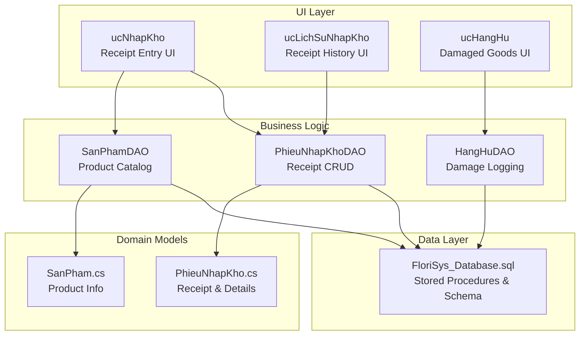
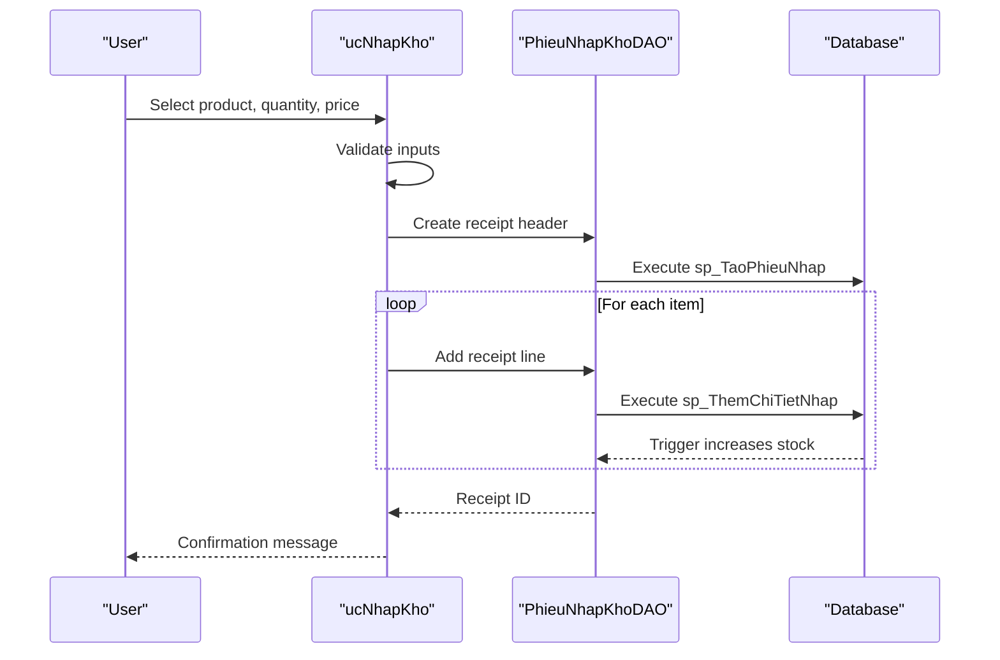
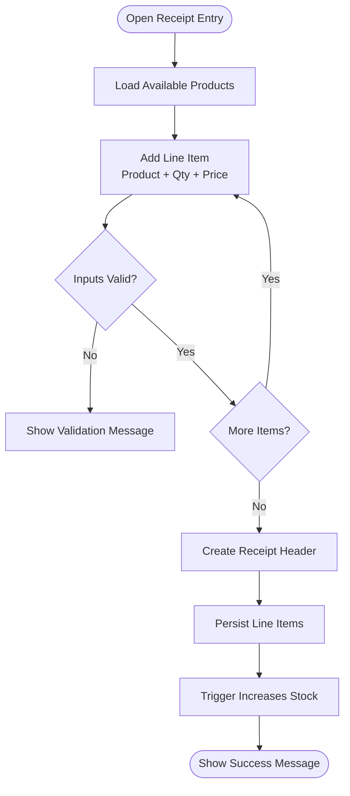
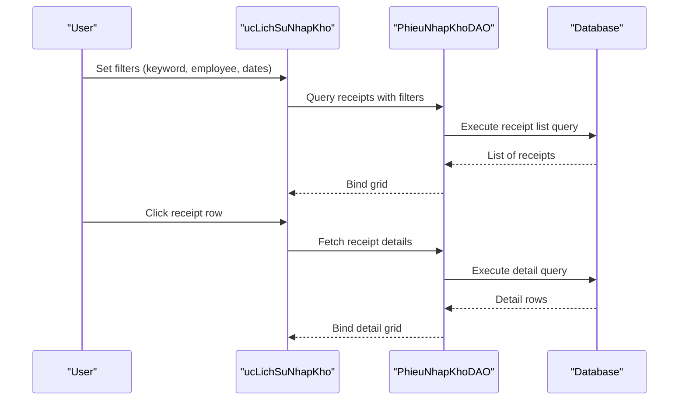
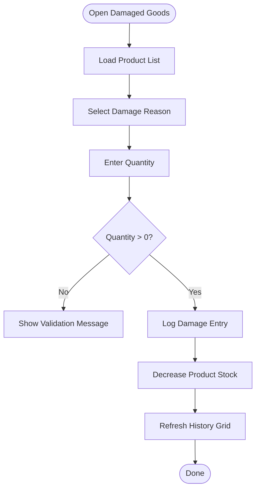
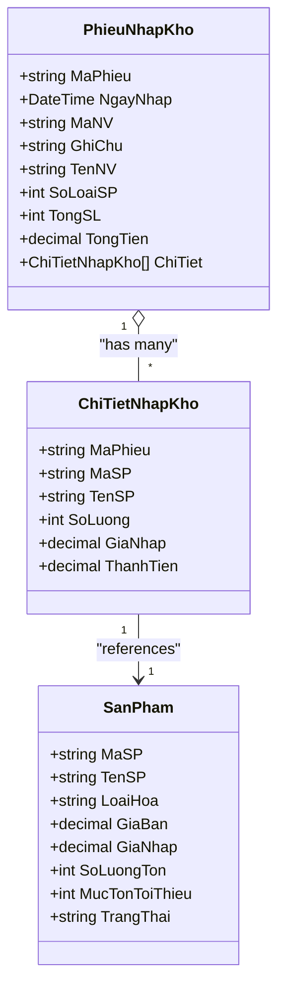
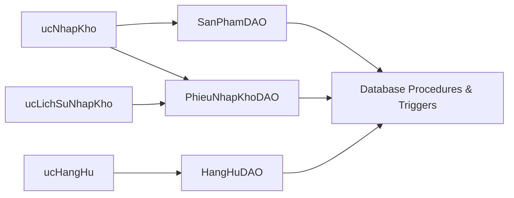

# Goods Receipt & Purchase Orders

<cite>
**Referenced Files in This Document**
- [ucNhapKho.cs](file://4_KhoHang\ucNhapKho.cs)
- [ucNhapKho.Designer.cs](file://4_KhoHang\ucNhapKho.Designer.cs)
- [ucLichSuNhapKho.cs](file://4_KhoHang\ucLichSuNhapKho.cs)
- [ucHangHu.cs](file://4_KhoHang\ucHangHu.cs)
- [PhieuNhapKhoDAO.cs](file://DataAccess\PhieuNhapKhoDAO.cs)
- [SanPhamDAO.cs](file://DataAccess\SanPhamDAO.cs)
- [HangHuDAO.cs](file://DataAccess\HangHuDAO.cs)
- [PhieuNhapKho.cs](file://Models\PhieuNhapKho.cs)
- [SanPham.cs](file://Models\SanPham.cs)
- [FloriSys_Database.sql](file://FloriSys_Database.sql)
</cite>

## Table of Contents
1. [Introduction](#introduction)
2. [Project Structure](#project-structure)
3. [Core Components](#core-components)
4. [Architecture Overview](#architecture-overview)
5. [Detailed Component Analysis](#detailed-component-analysis)
6. [Dependency Analysis](#dependency-analysis)
7. [Performance Considerations](#performance-considerations)
8. [Troubleshooting Guide](#troubleshooting-guide)
9. [Conclusion](#conclusion)
10. [Appendices](#appendices)

## Introduction
This document describes the Goods Receipt and Purchase Orders system within the Inventory Management Module. It covers the end-to-end workflow from creating purchase receipts to updating inventory, tracking receipt history, and managing damaged goods. It also outlines operational procedures for handling discrepancies, returns, and maintaining documentation. The system integrates with product catalogs, employee records, and reporting capabilities to support accurate inventory valuation and audit trails.

## Project Structure
The Goods Receipt module is implemented as a Windows Forms user control with supporting data access and model classes. The primary UI component allows users to select products, enter quantities and purchase prices, and save a receipt. Supporting controls provide receipt history and damaged goods logging.

**Diagram sources**
- [ucNhapKho.cs:11-65](file://4_KhoHang\ucNhapKho.cs#L11-L65)
- [ucLichSuNhapKho.cs:9-95](file://4_KhoHang\ucLichSuNhapKho.cs#L9-L95)
- [ucHangHu.cs:9-114](file://4_KhoHang\ucHangHu.cs#L9-L114)
- [PhieuNhapKhoDAO.cs:8-77](file://DataAccess\PhieuNhapKhoDAO.cs#L8-L77)
- [SanPhamDAO.cs:9-96](file://DataAccess\SanPhamDAO.cs#L9-L96)
- [HangHuDAO.cs:9-40](file://DataAccess\HangHuDAO.cs#L9-L40)
- [PhieuNhapKho.cs:6-33](file://Models\PhieuNhapKho.cs#L6-L33)
- [SanPham.cs:5-42](file://Models\SanPham.cs#L5-L42)
- [FloriSys_Database.sql:105-125](file://FloriSys_Database.sql#L105-L125)

**Section sources**
- [ucNhapKho.cs:11-65](file://4_KhoHang\ucNhapKho.cs#L11-L65)
- [ucLichSuNhapKho.cs:9-95](file://4_KhoHang\ucLichSuNhapKho.cs#L9-L95)
- [ucHangHu.cs:9-114](file://4_KhoHang\ucHangHu.cs#L9-L114)
- [PhieuNhapKhoDAO.cs:8-77](file://DataAccess\PhieuNhapKhoDAO.cs#L8-L77)
- [SanPhamDAO.cs:9-96](file://DataAccess\SanPhamDAO.cs#L9-L96)
- [HangHuDAO.cs:9-40](file://DataAccess\HangHuDAO.cs#L9-L40)
- [PhieuNhapKho.cs:6-33](file://Models\PhieuNhapKho.cs#L6-L33)
- [SanPham.cs:5-42](file://Models\SanPham.cs#L5-L42)
- [FloriSys_Database.sql:105-125](file://FloriSys_Database.sql#L105-L125)

## Core Components
- Receipt Entry UI (ucNhapKho): Allows selecting products, entering quantities and purchase prices, previewing items, and saving a receipt. It validates inputs and delegates persistence to the data access layer.
- Receipt History UI (ucLichSuNhapKho): Filters and displays receipt lists, and shows detailed line items per receipt.
- Damaged Goods UI (ucHangHu): Logs damaged items with reasons and notes, and updates inventory accordingly.
- Data Access Layer:
  - PhieuNhapKhoDAO: Creates receipts, adds receipt lines, and queries receipt lists and details.
  - SanPhamDAO: Loads product catalog for selection and updates product attributes.
  - HangHuDAO: Generates damage entries and retrieves monthly damage history.
- Domain Models:
  - PhieuNhapKho and ChiTietNhapKho: Represent receipt headers and line items.
  - SanPham: Product information used in selection and valuation.

**Section sources**
- [ucNhapKho.cs:11-65](file://4_KhoHang\ucNhapKho.cs#L11-L65)
- [ucLichSuNhapKho.cs:9-95](file://4_KhoHang\ucLichSuNhapKho.cs#L9-L95)
- [ucHangHu.cs:9-114](file://4_KhoHang\ucHangHu.cs#L9-L114)
- [PhieuNhapKhoDAO.cs:8-77](file://DataAccess\PhieuNhapKhoDAO.cs#L8-L77)
- [SanPhamDAO.cs:9-96](file://DataAccess\SanPhamDAO.cs#L9-L96)
- [HangHuDAO.cs:9-40](file://DataAccess\HangHuDAO.cs#L9-L40)
- [PhieuNhapKho.cs:6-33](file://Models\PhieuNhapKho.cs#L6-L33)
- [SanPham.cs:5-42](file://Models\SanPham.cs#L5-L42)

## Architecture Overview
The Goods Receipt system follows a layered architecture:
- UI layer: Windows Forms user controls handle input and display.
- Business logic: DAO classes encapsulate data operations and orchestrate transactions.
- Data layer: Stored procedures and triggers manage receipt creation, inventory updates, and damage logging.

**Diagram sources**
- [ucNhapKho.cs:45-57](file://4_KhoHang\ucNhapKho.cs#L45-L57)
- [PhieuNhapKhoDAO.cs:53-74](file://DataAccess\PhieuNhapKhoDAO.cs#L53-L74)
- [FloriSys_Database.sql:360-383](file://FloriSys_Database.sql#L360-L383)
- [FloriSys_Database.sql:236-246](file://FloriSys_Database.sql#L236-L246)

## Detailed Component Analysis

### Receipt Entry Workflow (ucNhapKho)
- Product Selection: Loads active products for selection.
- Line Item Entry: Adds rows with product, quantity, and purchase price.
- Validation: Ensures a product is selected, quantity > 0, and price > 0.
- Save Receipt: Generates a receipt ID via DAO, persists header and lines, and clears the form.

**Diagram sources**
- [ucNhapKho.cs:28-57](file://4_KhoHang\ucNhapKho.cs#L28-L57)
- [ucNhapKho.Designer.cs:38-101](file://4_KhoHang\ucNhapKho.Designer.cs#L38-L101)
- [PhieuNhapKhoDAO.cs:53-74](file://DataAccess\PhieuNhapKhoDAO.cs#L53-L74)
- [FloriSys_Database.sql:236-246](file://FloriSys_Database.sql#L236-L246)

**Section sources**
- [ucNhapKho.cs:28-57](file://4_KhoHang\ucNhapKho.cs#L28-L57)
- [ucNhapKho.Designer.cs:38-101](file://4_KhoHang\ucNhapKho.Designer.cs#L38-L101)
- [PhieuNhapKhoDAO.cs:53-74](file://DataAccess\PhieuNhapKhoDAO.cs#L53-L74)

### Receipt History and Details (ucLichSuNhapKho)
- Filtering: Supports keyword search, employee filter, and date range.
- Listing: Displays receipt summary with counts and totals.
- Detail View: Shows line items including product, quantity, purchase price, and extended amount.

**Diagram sources**
- [ucLichSuNhapKho.cs:36-92](file://4_KhoHang\ucLichSuNhapKho.cs#L36-L92)
- [PhieuNhapKhoDAO.cs:10-51](file://DataAccess\PhieuNhapKhoDAO.cs#L10-L51)

**Section sources**
- [ucLichSuNhapKho.cs:36-92](file://4_KhoHang\ucLichSuNhapKho.cs#L36-L92)
- [PhieuNhapKhoDAO.cs:10-51](file://DataAccess\PhieuNhapKhoDAO.cs#L10-L51)

### Damaged Goods Logging (ucHangHu)
- Reason Selection: Provides predefined reasons for damage.
- Product Selection: Loads all products for selection.
- Logging: Validates quantity, generates a damage entry ID, and decrements inventory.

**Diagram sources**
- [ucHangHu.cs:30-111](file://4_KhoHang\ucHangHu.cs#L30-L111)
- [HangHuDAO.cs:11-22](file://DataAccess\HangHuDAO.cs#L11-L22)
- [FloriSys_Database.sql:385-411](file://FloriSys_Database.sql#L385-L411)

**Section sources**
- [ucHangHu.cs:30-111](file://4_KhoHang\ucHangHu.cs#L30-L111)
- [HangHuDAO.cs:11-22](file://DataAccess\HangHuDAO.cs#L11-L22)

### Data Model Overview

**Diagram sources**
- [PhieuNhapKho.cs:6-33](file://Models\PhieuNhapKho.cs#L6-L33)
- [SanPham.cs:5-42](file://Models\SanPham.cs#L5-L42)

**Section sources**
- [PhieuNhapKho.cs:6-33](file://Models\PhieuNhapKho.cs#L6-L33)
- [SanPham.cs:5-42](file://Models\SanPham.cs#L5-L42)

## Dependency Analysis
- ucNhapKho depends on SanPhamDAO for product selection and PhieuNhapKhoDAO for saving receipts.
- ucLichSuNhapKho depends on PhieuNhapKhoDAO for listing and detail retrieval.
- ucHangHu depends on HangHuDAO and SanPhamDAO for product selection and damage logging.
- DAOs rely on stored procedures and triggers defined in the database schema.

**Diagram sources**
- [ucNhapKho.cs:5-7](file://4_KhoHang\ucNhapKho.cs#L5-L7)
- [ucLichSuNhapKho.cs:4-5](file://4_KhoHang\ucLichSuNhapKho.cs#L4-L5)
- [ucHangHu.cs:4-5](file://4_KhoHang\ucHangHu.cs#L4-L5)
- [PhieuNhapKhoDAO.cs:8-77](file://DataAccess\PhieuNhapKhoDAO.cs#L8-L77)
- [SanPhamDAO.cs:9-96](file://DataAccess\SanPhamDAO.cs#L9-L96)
- [HangHuDAO.cs:9-40](file://DataAccess\HangHuDAO.cs#L9-L40)
- [FloriSys_Database.sql:360-383](file://FloriSys_Database.sql#L360-L383)

**Section sources**
- [ucNhapKho.cs:5-7](file://4_KhoHang\ucNhapKho.cs#L5-L7)
- [ucLichSuNhapKho.cs:4-5](file://4_KhoHang\ucLichSuNhapKho.cs#L4-L5)
- [ucHangHu.cs:4-5](file://4_KhoHang\ucHangHu.cs#L4-L5)
- [PhieuNhapKhoDAO.cs:8-77](file://DataAccess\PhieuNhapKhoDAO.cs#L8-L77)
- [SanPhamDAO.cs:9-96](file://DataAccess\SanPhamDAO.cs#L9-L96)
- [HangHuDAO.cs:9-40](file://DataAccess\HangHuDAO.cs#L9-L40)
- [FloriSys_Database.sql:360-383](file://FloriSys_Database.sql#L360-L383)

## Performance Considerations
- Receipt creation batches line items and uses stored procedures to minimize round trips.
- Inventory updates occur via triggers after line insertion, ensuring atomicity and consistency.
- Filtering and sorting in history views rely on indexed columns and date ranges to keep queries responsive.

## Troubleshooting Guide
- Validation errors: Ensure a product is selected, quantity > 0, and price > 0 before saving a receipt.
- Duplicate or invalid product selection: Verify product availability and status.
- Receipt not saved: Confirm successful execution of header and line insertion procedures.
- Inventory discrepancies: Review receipt details and damage logs; confirm trigger-based stock updates.
- Date filtering issues: Use proper date range selection in history view.

**Section sources**
- [ucNhapKho.cs:41-43](file://4_KhoHang\ucNhapKho.cs#L41-L43)
- [ucNhapKho.cs:47-56](file://4_KhoHang\ucNhapKho.cs#L47-L56)
- [ucLichSuNhapKho.cs:61-64](file://4_KhoHang\ucLichSuNhapKho.cs#L61-L64)
- [ucHangHu.cs:84-88](file://4_KhoHang\ucHangHu.cs#L84-L88)
- [ucHangHu.cs:107-111](file://4_KhoHang\ucHangHu.cs#L107-L111)

## Conclusion
The Goods Receipt and Purchase Orders system provides a streamlined workflow for recording incoming inventory, tracking receipt history, and managing damaged goods. Its design leverages stored procedures and triggers to maintain data integrity and supports efficient auditing through detailed receipts and damage logs.

## Appendices

### Operational Guidelines
- Receipt Entry
  - Select a product from the active catalog.
  - Enter quantity and purchase price; validate inputs before adding lines.
  - Save the receipt to finalize and update inventory.
- Quality Inspection
  - For damaged or expired items, log them immediately using the damaged goods interface.
  - Provide a reason and note for traceability.
- Supplier Returns
  - Adjust receipt entries and inventory accordingly; document return reasons and approvals.
- Inventory Valuation
  - Use purchase price per unit for valuation; totals reflect quantity × price per receipt line.
- Batch Tracking and Expiry
  - Extend the receipt line model to include batch and expiry fields for future implementation.
- Serial Number Tracking
  - Integrate serial number fields in product and receipt line models for traceability.
- Approval Workflows
  - Implement role-based approvals by extending the receipt header with status and approver fields.
- Supplier Performance Evaluation
  - Track supplier-related metrics via receipt history and feedback; integrate with supplier management if available.
- Purchase Order History and Documentation
  - Maintain receipt records and associated notes as purchase order documentation for audits.

### Database Schema Highlights
- Receipt Headers and Lines: PHIEU_NHAP_KHO and CT_NHAP_KHO.
- Inventory Updates: Trigger increments SAN_PHAM.SoLuongTon upon receipt line insert.
- Stored Procedures: sp_TaoPhieuNhap, sp_ThemChiTietNhap, sp_GhiNhanHangHu.

**Section sources**
- [FloriSys_Database.sql:105-125](file://FloriSys_Database.sql#L105-L125)
- [FloriSys_Database.sql:236-246](file://FloriSys_Database.sql#L236-L246)
- [FloriSys_Database.sql:360-383](file://FloriSys_Database.sql#L360-L383)
- [FloriSys_Database.sql:385-411](file://FloriSys_Database.sql#L385-L411)