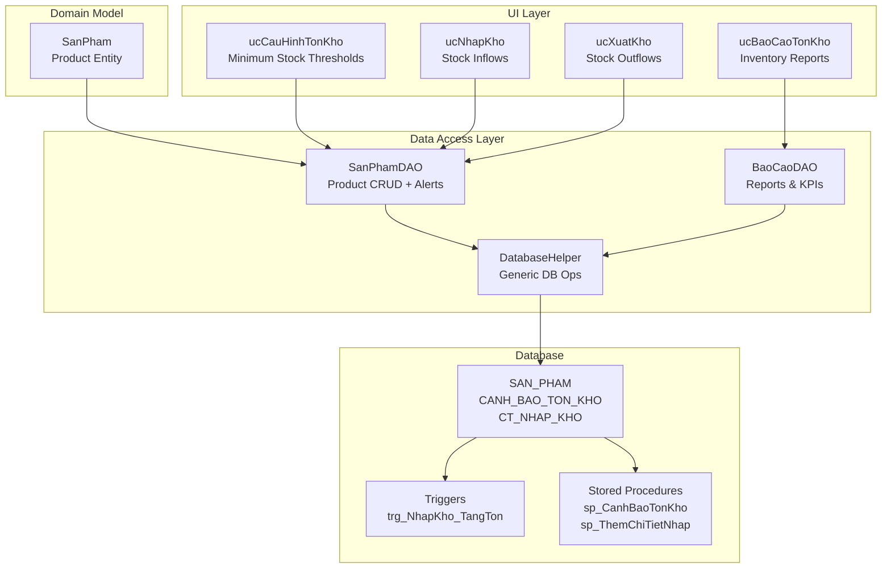
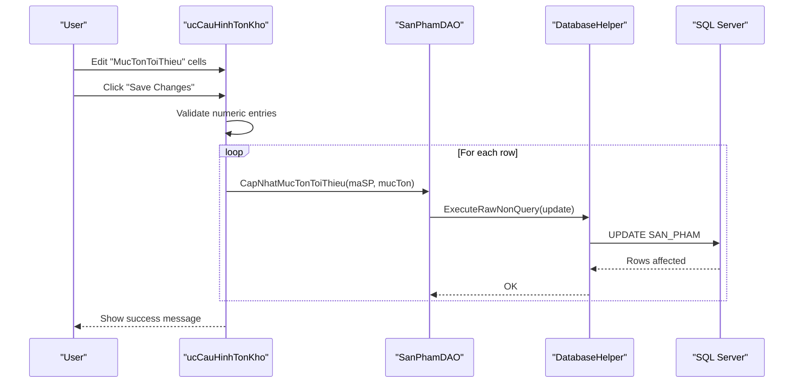
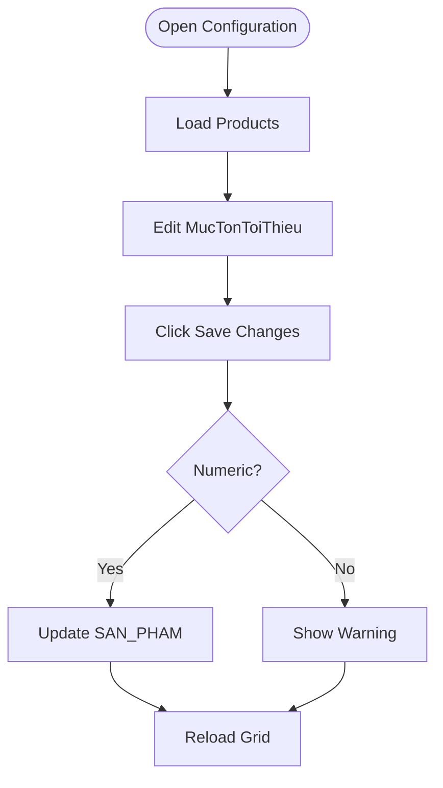
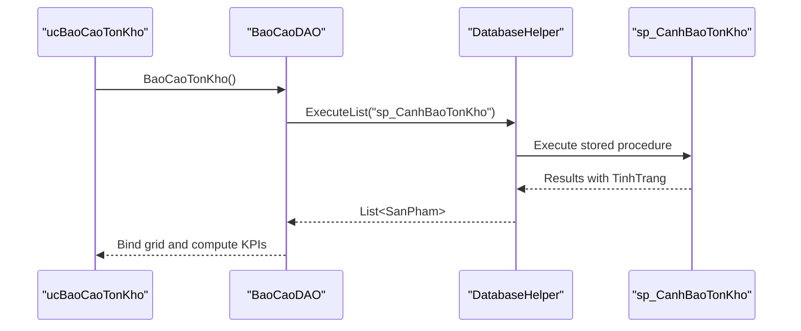
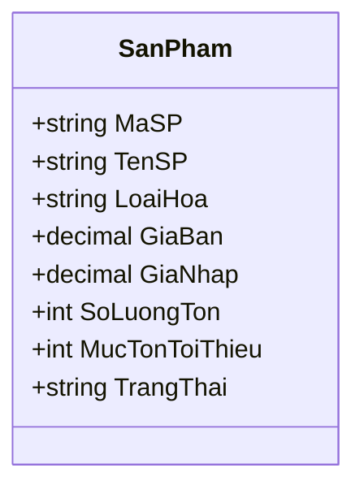
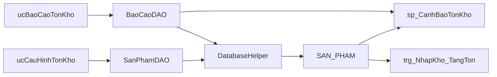

# Inventory Configuration & Settings

<cite>
**Referenced Files in This Document**
- [ucCauHinhTonKho.cs](file://4_KhoHang/ucCauHinhTonKho.cs)
- [ucCauHinhTonKho.Designer.cs](file://4_KhoHang/ucCauHinhTonKho.Designer.cs)
- [SanPhamDAO.cs](file://DataAccess/SanPhamDAO.cs)
- [DatabaseHelper.cs](file://DataAccess/DatabaseHelper.cs)
- [SanPham.cs](file://Models/SanPham.cs)
- [FloriSys_Database.sql](file://FloriSys_Database.sql)
- [ucNhapKho.cs](file://4_KhoHang/ucNhapKho.cs)
- [ucXuatKho.cs](file://4_KhoHang/ucXuatKho.cs)
- [ucBaoCaoTonKho.cs](file://6_BaoCao/ucBaoCaoTonKho.cs)
- [BaoCaoDAO.cs](file://DataAccess/BaoCaoDAO.cs)
- [Giao_dien.html](file://Giao_dien.html)
</cite>

## Table of Contents
1. [Introduction](#introduction)
2. [Project Structure](#project-structure)
3. [Core Components](#core-components)
4. [Architecture Overview](#architecture-overview)
5. [Detailed Component Analysis](#detailed-component-analysis)
6. [Dependency Analysis](#dependency-analysis)
7. [Performance Considerations](#performance-considerations)
8. [Troubleshooting Guide](#troubleshooting-guide)
9. [Conclusion](#conclusion)
10. [Appendices](#appendices)

## Introduction
This document explains the Inventory Configuration & Settings system within the Inventory Management Module. It covers how minimum stock thresholds are configured, how reorder triggers are managed, and how inventory categorization and valuation are handled. It also documents storage location management, product categorization systems, and financial reporting configurations. Procedures for setting up inventory rules, configuring safety stock levels, establishing reorder policies, managing inventory optimization settings, integrating cost accounting, and maintaining audit trails are included.

## Project Structure
The Inventory Management Module is organized around:
- UI components for inventory configuration and monitoring
- Data Access Objects (DAOs) for persistence
- Database schema defining inventory entities and stored procedures
- Reporting components for inventory visibility and KPIs

**Diagram sources**
- [ucCauHinhTonKho.cs:10-113](file://4_KhoHang/ucCauHinhTonKho.cs#L10-L113)
- [SanPhamDAO.cs:9-95](file://DataAccess/SanPhamDAO.cs#L9-L95)
- [DatabaseHelper.cs:10-212](file://DataAccess/DatabaseHelper.cs#L10-L212)
- [SanPham.cs:5-42](file://Models/SanPham.cs#L5-L42)
- [FloriSys_Database.sql:49-149](file://FloriSys_Database.sql#L49-L149)
- [ucNhapKho.cs:11-65](file://4_KhoHang/ucNhapKho.cs#L11-L65)
- [ucXuatKho.cs:10-105](file://4_KhoHang/ucXuatKho.cs#L10-L105)
- [ucBaoCaoTonKho.cs:10-48](file://6_BaoCao/ucBaoCaoTonKho.cs#L10-L48)
- [BaoCaoDAO.cs:9-167](file://DataAccess/BaoCaoDAO.cs#L9-L167)

**Section sources**
- [ucCauHinhTonKho.cs:10-113](file://4_KhoHang/ucCauHinhTonKho.cs#L10-L113)
- [SanPhamDAO.cs:9-95](file://DataAccess/SanPhamDAO.cs#L9-L95)
- [DatabaseHelper.cs:10-212](file://DataAccess/DatabaseHelper.cs#L10-L212)
- [SanPham.cs:5-42](file://Models/SanPham.cs#L5-L42)
- [FloriSys_Database.sql:49-149](file://FloriSys_Database.sql#L49-L149)

## Core Components
- Minimum stock threshold configuration: Users edit per-product thresholds and save changes.
- Reorder triggers: Threshold comparison drives alerts and downstream actions.
- Inventory categorization: Product category field supports filtering and reporting.
- Storage location management: Not implemented in the current codebase; defaults apply.
- Inventory valuation: Valuation is computed as sum of quantity × purchase price in reports.
- Cost accounting integration: Purchase price and sales price are maintained for valuation and profit calculation.
- Financial reporting: Inventory KPIs and valuation are surfaced in reports.

**Section sources**
- [ucCauHinhTonKho.cs:22-86](file://4_KhoHang/ucCauHinhTonKho.cs#L22-L86)
- [SanPhamDAO.cs:11-93](file://DataAccess/SanPhamDAO.cs#L11-L93)
- [SanPham.cs:7-14](file://Models/SanPham.cs#L7-L14)
- [ucBaoCaoTonKho.cs:22-48](file://6_BaoCao/ucBaoCaoTonKho.cs#L22-L48)
- [BaoCaoDAO.cs:46-83](file://DataAccess/BaoCaoDAO.cs#L46-L83)
- [FloriSys_Database.sql:49-58](file://FloriSys_Database.sql#L49-L58)

## Architecture Overview
The system follows a layered architecture:
- UI layer: Windows Forms user controls for configuration, stock movements, and reporting.
- Data Access layer: DAOs encapsulate database operations and mapping.
- Domain model: Strongly typed entities representing products and reports.
- Database layer: Tables, stored procedures, and triggers implement inventory logic.

**Diagram sources**
- [ucCauHinhTonKho.cs:56-86](file://4_KhoHang/ucCauHinhTonKho.cs#L56-L86)
- [SanPhamDAO.cs:80-88](file://DataAccess/SanPhamDAO.cs#L80-L88)
- [DatabaseHelper.cs:159-172](file://DataAccess/DatabaseHelper.cs#L159-L172)

**Section sources**
- [ucCauHinhTonKho.cs:56-86](file://4_KhoHang/ucCauHinhTonKho.cs#L56-L86)
- [SanPhamDAO.cs:80-88](file://DataAccess/SanPhamDAO.cs#L80-L88)
- [DatabaseHelper.cs:159-172](file://DataAccess/DatabaseHelper.cs#L159-L172)

## Detailed Component Analysis

### Minimum Stock Threshold Configuration
- Purpose: Allow users to set per-product minimum stock thresholds.
- UI behavior: Grid displays products with editable threshold column; saves update per row.
- Validation: Ensures numeric input; errors reported if invalid.
- Persistence: Updates SAN_PHAM.MucTonToiThieu via DAO.

**Diagram sources**
- [ucCauHinhTonKho.cs:22-86](file://4_KhoHang/ucCauHinhTonKho.cs#L22-L86)
- [SanPhamDAO.cs:80-88](file://DataAccess/SanPhamDAO.cs#L80-L88)

**Section sources**
- [ucCauHinhTonKho.cs:22-86](file://4_KhoHang/ucCauHinhTonKho.cs#L22-L86)
- [SanPhamDAO.cs:80-88](file://DataAccess/SanPhamDAO.cs#L80-L88)

### Reorder Triggers and Alerts
- Alert computation: Stored procedure compares current stock vs threshold and assigns status.
- Status categories: “Out of stock”, “Low stock”, “Sufficient”.
- UI integration: Reports and dashboards surface low-stock items.

**Diagram sources**
- [ucBaoCaoTonKho.cs:22-48](file://6_BaoCao/ucBaoCaoTonKho.cs#L22-L48)
- [BaoCaoDAO.cs:46-49](file://DataAccess/BaoCaoDAO.cs#L46-L49)
- [FloriSys_Database.sql:533-546](file://FloriSys_Database.sql#L533-L546)

**Section sources**
- [ucBaoCaoTonKho.cs:22-48](file://6_BaoCao/ucBaoCaoTonKho.cs#L22-L48)
- [BaoCaoDAO.cs:46-49](file://DataAccess/BaoCaoDAO.cs#L46-L49)
- [FloriSys_Database.sql:533-546](file://FloriSys_Database.sql#L533-L546)

### Inventory Categorization and Classification
- Category field: Product entity includes a category property for classification.
- Filtering: DAO supports category-based queries for product lists.
- Reporting: Category displayed in product listings and reports.

**Diagram sources**
- [SanPham.cs:7-14](file://Models/SanPham.cs#L7-L14)

**Section sources**
- [SanPham.cs:7-14](file://Models/SanPham.cs#L7-L14)
- [SanPhamDAO.cs:11-33](file://DataAccess/SanPhamDAO.cs#L11-L33)

### Storage Location Management
- Current state: No dedicated storage location table or UI in the codebase.
- Implication: All inventory is tracked centrally; no per-location tracking.

**Section sources**
- [FloriSys_Database.sql:49-149](file://FloriSys_Database.sql#L49-L149)

### Inventory Valuation Methods
- Valuation basis: Sum of (quantity × purchase price) for all products.
- Computation: Reported via dashboard and inventory report screens.
- Price fields: Purchase price and selling price maintained for valuation and margin tracking.

**Section sources**
- [ucBaoCaoTonKho.cs:22-48](file://6_BaoCao/ucBaoCaoTonKho.cs#L22-L48)
- [BaoCaoDAO.cs:72-83](file://DataAccess/BaoCaoDAO.cs#L72-L83)
- [SanPham.cs:10-11](file://Models/SanPham.cs#L10-L11)

### Cost Accounting Integration
- Purchase price tracking: Maintained in product entity and used for valuation.
- Sales price tracking: Maintained for revenue and margin calculations.
- Transactional integrity: Triggers automatically adjust stock on receipts.

**Section sources**
- [SanPham.cs:10-11](file://Models/SanPham.cs#L10-L11)
- [FloriSys_Database.sql:236-247](file://FloriSys_Database.sql#L236-L247)

### Financial Reporting Configurations
- Inventory KPIs: Total products, value at cost, low-stock counts.
- Report screen: Dedicated inventory report module with export capability.
- Dashboard integration: Real-time KPIs and alerts.

**Section sources**
- [ucBaoCaoTonKho.cs:22-84](file://6_BaoCao/ucBaoCaoTonKho.cs#L22-L84)
- [BaoCaoDAO.cs:72-83](file://DataAccess/BaoCaoDAO.cs#L72-L83)
- [Giao_dien.html:1024-1027](file://Giao_dien.html#L1024-L1027)

### Operational Guidelines
- Setting up inventory rules:
  - Navigate to the configuration screen and edit per-product thresholds.
  - Save changes to persist updated minimum stock levels.
- Configuring safety stock levels:
  - Adjust thresholds based on demand variability and lead time.
  - Use reports to monitor low-stock items and trigger replenishment.
- Establishing reorder policies:
  - Define reorder points aligned with thresholds.
  - Use the alert system to identify when stock requires restocking.

**Section sources**
- [ucCauHinhTonKho.cs:22-86](file://4_KhoHang/ucCauHinhTonKho.cs#L22-L86)
- [ucBaoCaoTonKho.cs:22-48](file://6_BaoCao/ucBaoCaoTonKho.cs#L22-L48)

### Seasonal Adjustments and Promotional Items
- Seasonal adjustments: Modify thresholds seasonally; re-run alerts to validate.
- Promotional items: Treat as separate SKUs with distinct thresholds; monitor separately in reports.

[No sources needed since this section provides general guidance]

### Backup and Restore Procedures
- Database-level backup: Use SQL Server native backup/restore for the database.
- Data export/import: Use SSIS or BCP for bulk operations if needed.
- Version control: Track schema changes in migration scripts.

[No sources needed since this section provides general guidance]

### Audit Trail Maintenance
- Logging: Store significant events (threshold updates, stock movements) in dedicated audit tables.
- Compliance: Maintain logs for regulatory compliance and internal audits.

[No sources needed since this section provides general guidance]

### Configuration Change Management Workflows
- Approval process: Require supervisor approval for threshold changes affecting critical items.
- Rollback: Maintain previous thresholds in audit logs for quick rollback.
- Communication: Notify stakeholders of changes via dashboard alerts.

[No sources needed since this section provides general guidance]

## Dependency Analysis
The configuration and reporting components depend on DAOs and database helpers. The database enforces integrity via triggers and stored procedures.

**Diagram sources**
- [ucCauHinhTonKho.cs:10-113](file://4_KhoHang/ucCauHinhTonKho.cs#L10-L113)
- [SanPhamDAO.cs:9-95](file://DataAccess/SanPhamDAO.cs#L9-L95)
- [DatabaseHelper.cs:10-212](file://DataAccess/DatabaseHelper.cs#L10-L212)
- [FloriSys_Database.sql:533-546](file://FloriSys_Database.sql#L533-L546)
- [ucBaoCaoTonKho.cs:10-48](file://6_BaoCao/ucBaoCaoTonKho.cs#L10-L48)
- [BaoCaoDAO.cs:9-167](file://DataAccess/BaoCaoDAO.cs#L9-L167)

**Section sources**
- [ucCauHinhTonKho.cs:10-113](file://4_KhoHang/ucCauHinhTonKho.cs#L10-L113)
- [SanPhamDAO.cs:9-95](file://DataAccess/SanPhamDAO.cs#L9-L95)
- [DatabaseHelper.cs:10-212](file://DataAccess/DatabaseHelper.cs#L10-L212)
- [FloriSys_Database.sql:533-546](file://FloriSys_Database.sql#L533-L546)
- [ucBaoCaoTonKho.cs:10-48](file://6_BaoCao/ucBaoCaoTonKho.cs#L10-L48)
- [BaoCaoDAO.cs:9-167](file://DataAccess/BaoCaoDAO.cs#L9-L167)

## Performance Considerations
- Indexing: Consider adding indexes on frequently filtered columns (category, status).
- Batch updates: Prefer batch updates for threshold changes to reduce round trips.
- Triggers: Triggers ensure consistency but may impact write throughput; monitor during bulk operations.

[No sources needed since this section provides general guidance]

## Troubleshooting Guide
- Threshold update fails:
  - Verify numeric input; non-numeric values cause validation errors.
  - Confirm product exists and is active.
- Low-stock alerts not appearing:
  - Recompute alerts via stored procedure or refresh report.
  - Check product status and category filters.
- Stock movement discrepancies:
  - Review triggers and stored procedures for stock adjustments.
  - Validate transaction state transitions.

**Section sources**
- [ucCauHinhTonKho.cs:77-85](file://4_KhoHang/ucCauHinhTonKho.cs#L77-L85)
- [ucBaoCaoTonKho.cs:22-48](file://6_BaoCao/ucBaoCaoTonKho.cs#L22-L48)
- [FloriSys_Database.sql:236-247](file://FloriSys_Database.sql#L236-L247)

## Conclusion
The Inventory Configuration & Settings system provides a practical foundation for managing minimum stock thresholds, generating alerts, and reporting inventory health. While storage location management and advanced optimization features are not present, the current implementation supports essential inventory control through threshold configuration, real-time alerts, and valuation reporting. Extending the system with location tracking, safety stock calculations, and automated reorder workflows would further enhance operational efficiency.

## Appendices
- Product lifecycle integration: Thresholds influence reorder decisions; stock movements are governed by triggers and stored procedures.
- Reporting integration: Dashboards and reports consume stored procedure outputs for real-time visibility.

[No sources needed since this section provides general guidance]