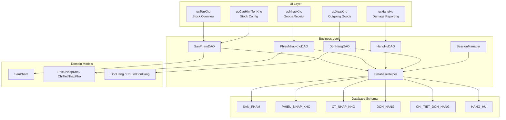
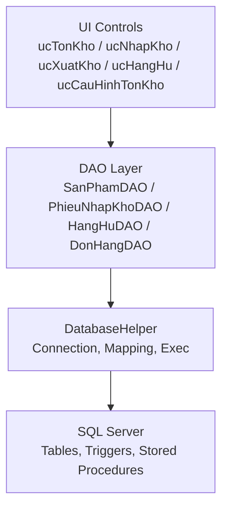
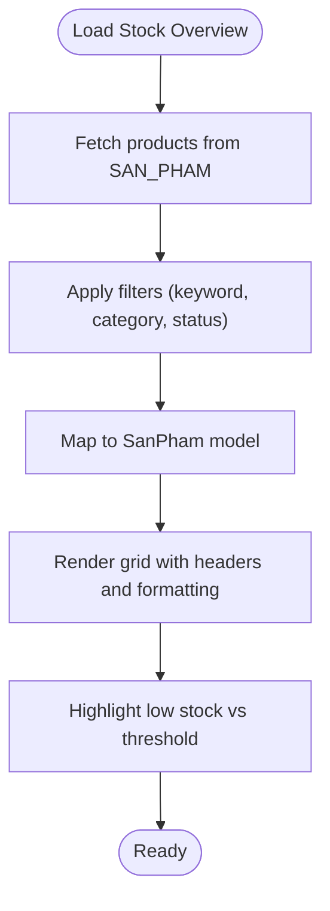
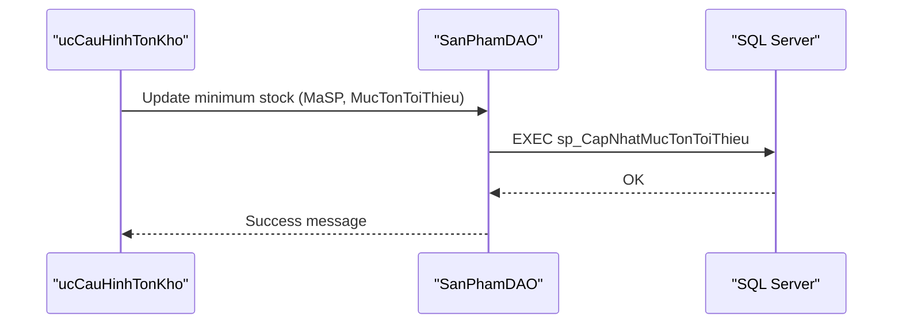
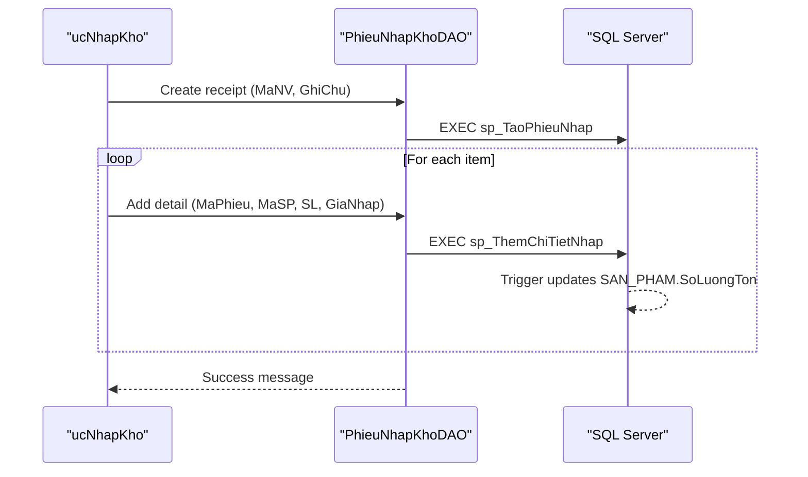
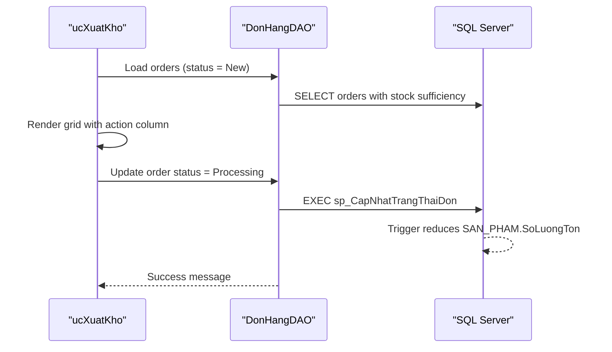
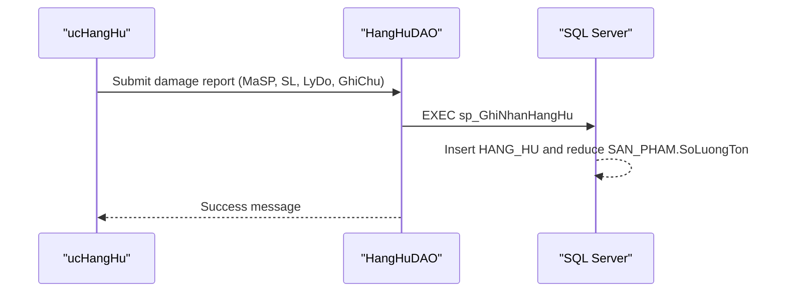
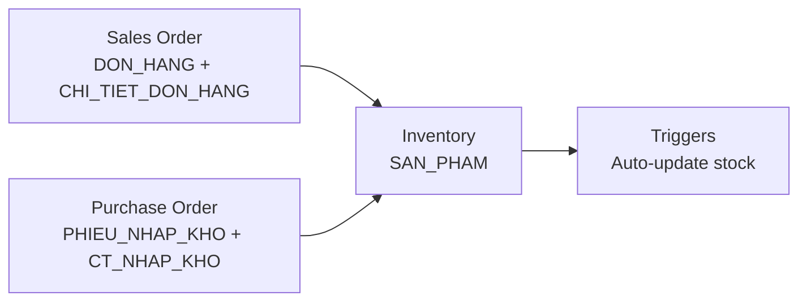
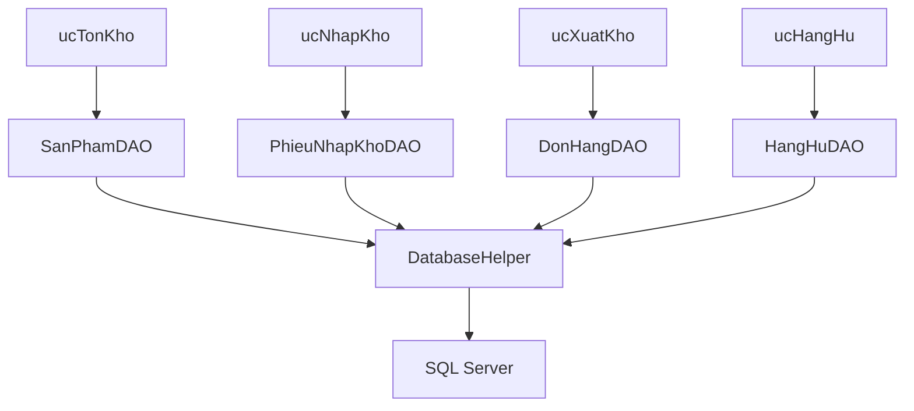
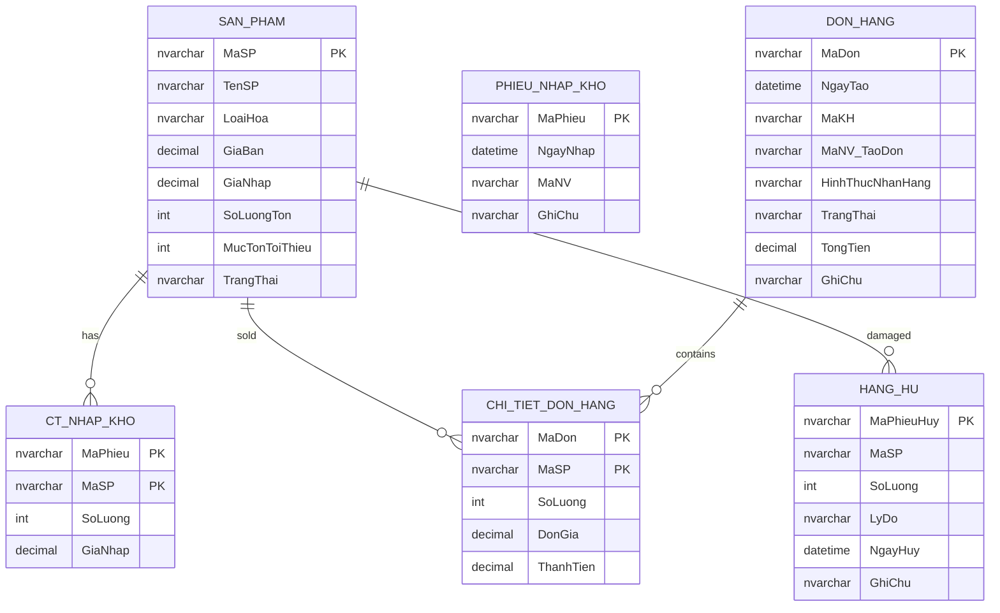

# Inventory Management Module

<cite>
**Referenced Files in This Document**
- [ucTonKho.cs](file://4_KhoHang\ucTonKho.cs)
- [ucNhapKho.cs](file://4_KhoHang\ucNhapKho.cs)
- [ucXuatKho.cs](file://4_KhoHang\ucXuatKho.cs)
- [ucHangHu.cs](file://4_KhoHang\ucHangHu.cs)
- [ucCauHinhTonKho.cs](file://4_KhoHang\ucCauHinhTonKho.cs)
- [SanPhamDAO.cs](file://DataAccess\SanPhamDAO.cs)
- [PhieuNhapKhoDAO.cs](file://DataAccess\PhieuNhapKhoDAO.cs)
- [HangHuDAO.cs](file://DataAccess\HangHuDAO.cs)
- [DonHangDAO.cs](file://DataAccess\DonHangDAO.cs)
- [DatabaseHelper.cs](file://DataAccess\DatabaseHelper.cs)
- [SanPham.cs](file://Models\SanPham.cs)
- [PhieuNhapKho.cs](file://Models\PhieuNhapKho.cs)
- [DonHang.cs](file://Models\DonHang.cs)
- [FloriSys_Database.sql](file://FloriSys_Database.sql)
- [SessionManager.cs](file://Services\SessionManager.cs)
</cite>

## Table of Contents
1. [Introduction](#introduction)
2. [Project Structure](#project-structure)
3. [Core Components](#core-components)
4. [Architecture Overview](#architecture-overview)
5. [Detailed Component Analysis](#detailed-component-analysis)
6. [Dependency Analysis](#dependency-analysis)
7. [Performance Considerations](#performance-considerations)
8. [Troubleshooting Guide](#troubleshooting-guide)
9. [Conclusion](#conclusion)
10. [Appendices](#appendices)

## Introduction
This document provides comprehensive documentation for the FloriSys Inventory Management Module. It explains real-time inventory tracking, stock level monitoring, and automated low-stock alert mechanisms. It documents the complete inventory workflow, including goods receipt, outgoing goods processing, damage reporting, and inventory adjustments. It also covers integrations with sales orders, purchase orders, and supplier management, along with warehouse operations, categorization, and storage location management. Configuration of minimum stock levels, reorder points, and inventory valuation methods are included, alongside operational guidelines for inventory counting, cycle counting, and physical inventory procedures. Finally, it addresses inventory optimization strategies, shrinkage management, and cost accounting integration.

## Project Structure
The Inventory module is organized under the 4_KhoHang folder and integrates with the DataAccess and Models layers. The UI components expose CRUD and workflow actions for inventory operations, while the data access layer encapsulates database interactions and stored procedure calls. The database schema defines core entities and constraints for inventory, sales, and reporting.

**Diagram sources**
- [ucTonKho.cs:1-57](file://4_KhoHang\ucTonKho.cs#L1-L57)
- [ucNhapKho.cs:1-65](file://4_KhoHang\ucNhapKho.cs#L1-L65)
- [ucXuatKho.cs:1-105](file://4_KhoHang\ucXuatKho.cs#L1-L105)
- [ucHangHu.cs:1-114](file://4_KhoHang\ucHangHu.cs#L1-L114)
- [ucCauHinhTonKho.cs:1-113](file://4_KhoHang\ucCauHinhTonKho.cs#L1-L113)
- [SanPhamDAO.cs:1-96](file://DataAccess\SanPhamDAO.cs#L1-L96)
- [PhieuNhapKhoDAO.cs:1-77](file://DataAccess\PhieuNhapKhoDAO.cs#L1-L77)
- [HangHuDAO.cs:1-40](file://DataAccess\HangHuDAO.cs#L1-L40)
- [DonHangDAO.cs:1-114](file://DataAccess\DonHangDAO.cs#L1-L114)
- [DatabaseHelper.cs:1-212](file://DataAccess\DatabaseHelper.cs#L1-L212)
- [SanPham.cs:1-42](file://Models\SanPham.cs#L1-L42)
- [PhieuNhapKho.cs:1-33](file://Models\PhieuNhapKho.cs#L1-L33)
- [DonHang.cs:1-63](file://Models\DonHang.cs#L1-L63)
- [FloriSys_Database.sql:1-706](file://FloriSys_Database.sql#L1-L706)
- [SessionManager.cs:1-62](file://Services\SessionManager.cs#L1-L62)

**Section sources**
- [ucTonKho.cs:1-57](file://4_KhoHang\ucTonKho.cs#L1-L57)
- [ucNhapKho.cs:1-65](file://4_KhoHang\ucNhapKho.cs#L1-L65)
- [ucXuatKho.cs:1-105](file://4_KhoHang\ucXuatKho.cs#L1-L105)
- [ucHangHu.cs:1-114](file://4_KhoHang\ucHangHu.cs#L1-L114)
- [ucCauHinhTonKho.cs:1-113](file://4_KhoHang\ucCauHinhTonKho.cs#L1-L113)
- [SanPhamDAO.cs:1-96](file://DataAccess\SanPhamDAO.cs#L1-L96)
- [PhieuNhapKhoDAO.cs:1-77](file://DataAccess\PhieuNhapKhoDAO.cs#L1-L77)
- [HangHuDAO.cs:1-40](file://DataAccess\HangHuDAO.cs#L1-L40)
- [DonHangDAO.cs:1-114](file://DataAccess\DonHangDAO.cs#L1-L114)
- [DatabaseHelper.cs:1-212](file://DataAccess\DatabaseHelper.cs#L1-L212)
- [SanPham.cs:1-42](file://Models\SanPham.cs#L1-L42)
- [PhieuNhapKho.cs:1-33](file://Models\PhieuNhapKho.cs#L1-L33)
- [DonHang.cs:1-63](file://Models\DonHang.cs#L1-L63)
- [FloriSys_Database.sql:1-706](file://FloriSys_Database.sql#L1-L706)
- [SessionManager.cs:1-62](file://Services\SessionManager.cs#L1-L62)

## Core Components
- Stock Overview (ucTonKho): Displays current stock levels, product categories, and thresholds. Supports filtering and search.
- Goods Receipt (ucNhapKho): Manages purchase order receipts, batch creation, and inventory increases via purchase invoices.
- Outgoing Goods (ucXuatKho): Handles sales order fulfillment, stock deduction, and status updates.
- Damage Reporting (ucHangHu): Records damaged items, reasons, and updates stock accordingly.
- Stock Configuration (ucCauHinhTonKho): Allows setting and updating minimum stock thresholds per product with visual alerts.

These components integrate with DAOs and models to enforce business rules and maintain data consistency.

**Section sources**
- [ucTonKho.cs:13-36](file://4_KhoHang\ucTonKho.cs#L13-L36)
- [ucNhapKho.cs:23-57](file://4_KhoHang\ucNhapKho.cs#L23-L57)
- [ucXuatKho.cs:22-97](file://4_KhoHang\ucXuatKho.cs#L22-L97)
- [ucHangHu.cs:82-111](file://4_KhoHang\ucHangHu.cs#L82-L111)
- [ucCauHinhTonKho.cs:56-86](file://4_KhoHang\ucCauHinhTonKho.cs#L56-L86)

## Architecture Overview
The module follows a layered architecture:
- UI Layer: Windows Forms user controls for inventory operations.
- Business Logic Layer: DAO classes encapsulate data access and call stored procedures.
- Domain Models: Strongly typed models representing entities and DTOs.
- Database Layer: SQL Server schema with triggers and stored procedures enforcing business rules.

**Diagram sources**
- [ucTonKho.cs:1-57](file://4_KhoHang\ucTonKho.cs#L1-L57)
- [ucNhapKho.cs:1-65](file://4_KhoHang\ucNhapKho.cs#L1-L65)
- [ucXuatKho.cs:1-105](file://4_KhoHang\ucXuatKho.cs#L1-L105)
- [ucHangHu.cs:1-114](file://4_KhoHang\ucHangHu.cs#L1-L114)
- [ucCauHinhTonKho.cs:1-113](file://4_KhoHang\ucCauHinhTonKho.cs#L1-L113)
- [SanPhamDAO.cs:1-96](file://DataAccess\SanPhamDAO.cs#L1-L96)
- [PhieuNhapKhoDAO.cs:1-77](file://DataAccess\PhieuNhapKhoDAO.cs#L1-L77)
- [HangHuDAO.cs:1-40](file://DataAccess\HangHuDAO.cs#L1-L40)
- [DonHangDAO.cs:1-114](file://DataAccess\DonHangDAO.cs#L1-L114)
- [DatabaseHelper.cs:1-212](file://DataAccess\DatabaseHelper.cs#L1-L212)
- [FloriSys_Database.sql:206-411](file://FloriSys_Database.sql#L206-L411)

## Detailed Component Analysis

### Real-Time Inventory Tracking and Stock Monitoring
- Real-time stock levels are maintained in SAN_PHAM.SoLuongTon.
- Stock overview displays product name, category, current stock, minimum threshold, selling price, and purchase price.
- Low-stock conditions are visually highlighted based on comparison between actual stock and configured minimum threshold.

**Diagram sources**
- [ucTonKho.cs:13-36](file://4_KhoHang\ucTonKho.cs#L13-L36)
- [SanPhamDAO.cs:11-33](file://DataAccess\SanPhamDAO.cs#L11-L33)
- [SanPham.cs:1-42](file://Models\SanPham.cs#L1-L42)

**Section sources**
- [ucTonKho.cs:13-36](file://4_KhoHang\ucTonKho.cs#L13-L36)
- [SanPhamDAO.cs:11-33](file://DataAccess\SanPhamDAO.cs#L11-L33)
- [SanPham.cs:1-42](file://Models\SanPham.cs#L1-L42)

### Automated Low-Stock Alerts
- Minimum thresholds are configurable per product via ucCauHinhTonKho.
- Visual indicators change color when stock equals zero or falls below threshold.
- A dedicated stored procedure generates stock warning records for reporting.

**Diagram sources**
- [ucCauHinhTonKho.cs:56-86](file://4_KhoHang\ucCauHinhTonKho.cs#L56-L86)
- [SanPhamDAO.cs:80-88](file://DataAccess\SanPhamDAO.cs#L80-L88)
- [FloriSys_Database.sql:533-547](file://FloriSys_Database.sql#L533-L547)

**Section sources**
- [ucCauHinhTonKho.cs:56-86](file://4_KhoHang\ucCauHinhTonKho.cs#L56-L86)
- [SanPhamDAO.cs:80-88](file://DataAccess\SanPhamDAO.cs#L80-L88)
- [FloriSys_Database.sql:533-547](file://FloriSys_Database.sql#L533-L547)

### Goods Receipt Workflow (Purchase Orders)
- Create a goods receipt entry with staff ID and optional note.
- Add line items with product, quantity, and purchase price.
- Persist header and details via stored procedures; triggers automatically increase stock.

**Diagram sources**
- [ucNhapKho.cs:45-57](file://4_KhoHang\ucNhapKho.cs#L45-L57)
- [PhieuNhapKhoDAO.cs:53-74](file://DataAccess\PhieuNhapKhoDAO.cs#L53-L74)
- [FloriSys_Database.sql:360-383](file://FloriSys_Database.sql#L360-L383)
- [FloriSys_Database.sql:236-247](file://FloriSys_Database.sql#L236-L247)

**Section sources**
- [ucNhapKho.cs:45-57](file://4_KhoHang\ucNhapKho.cs#L45-L57)
- [PhieuNhapKhoDAO.cs:53-74](file://DataAccess\PhieuNhapKhoDAO.cs#L53-L74)
- [FloriSys_Database.sql:236-247](file://FloriSys_Database.sql#L236-L247)

### Outgoing Goods Processing (Sales Orders)
- Review sales orders ready for dispatch with stock sufficiency check.
- Approve dispatch to update stock and order status.
- Status transitions trigger stock deductions in the database.

**Diagram sources**
- [ucXuatKho.cs:62-97](file://4_KhoHang\ucXuatKho.cs#L62-L97)
- [DonHangDAO.cs:100-111](file://DataAccess\DonHangDAO.cs#L100-L111)
- [FloriSys_Database.sql:317-358](file://FloriSys_Database.sql#L317-L358)
- [FloriSys_Database.sql:236-247](file://FloriSys_Database.sql#L236-L247)

**Section sources**
- [ucXuatKho.cs:62-97](file://4_KhoHang\ucXuatKho.cs#L62-L97)
- [DonHangDAO.cs:100-111](file://DataAccess\DonHangDAO.cs#L100-L111)
- [FloriSys_Database.sql:317-358](file://FloriSys_Database.sql#L317-L358)

### Damage Reporting and Inventory Adjustments
- Record damaged items with reason and notes.
- Validation ensures sufficient stock; updates both damage log and stock.

**Diagram sources**
- [ucHangHu.cs:82-111](file://4_KhoHang\ucHangHu.cs#L82-L111)
- [HangHuDAO.cs:11-22](file://DataAccess\HangHuDAO.cs#L11-L22)
- [FloriSys_Database.sql:385-411](file://FloriSys_Database.sql#L385-L411)

**Section sources**
- [ucHangHu.cs:82-111](file://4_KhoHang\ucHangHu.cs#L82-L111)
- [HangHuDAO.cs:11-22](file://DataAccess\HangHuDAO.cs#L11-L22)
- [FloriSys_Database.sql:385-411](file://FloriSys_Database.sql#L385-L411)

### Integration with Sales Orders, Purchase Orders, and Supplier Management
- Sales orders: Creation and fulfillment are handled by DonHangDAO and related stored procedures. Stock is validated and reduced upon status change.
- Purchase orders: Receipts are managed by PhieuNhapKhoDAO and CT_NHAP_KHO, with automatic stock increases via triggers.
- Supplier management: The schema does not define a dedicated SUPPLIER table; purchases are recorded against products and employees.

**Diagram sources**
- [DonHangDAO.cs:66-98](file://DataAccess\DonHangDAO.cs#L66-L98)
- [PhieuNhapKhoDAO.cs:10-51](file://DataAccess\PhieuNhapKhoDAO.cs#L10-L51)
- [FloriSys_Database.sql:62-125](file://FloriSys_Database.sql#L62-L125)
- [FloriSys_Database.sql:236-247](file://FloriSys_Database.sql#L236-L247)

**Section sources**
- [DonHangDAO.cs:66-98](file://DataAccess\DonHangDAO.cs#L66-L98)
- [PhieuNhapKhoDAO.cs:10-51](file://DataAccess\PhieuNhapKhoDAO.cs#L10-L51)
- [FloriSys_Database.sql:62-125](file://FloriSys_Database.sql#L62-L125)

### Warehouse Operations Procedures
- Goods receipt: Create receipt header, add line items, persist details.
- Dispatch: Review pending orders, confirm dispatch, update stock and status.
- Damage handling: Log damages with reason and notes, adjust stock accordingly.

**Section sources**
- [ucNhapKho.cs:45-57](file://4_KhoHang\ucNhapKho.cs#L45-L57)
- [ucXuatKho.cs:62-97](file://4_KhoHang\ucXuatKho.cs#L62-L97)
- [ucHangHu.cs:82-111](file://4_KhoHang\ucHangHu.cs#L82-L111)

### Inventory Categorization and Storage Location Management
- Product categorization: Products include a category field (LoaiHoa) enabling classification.
- Storage locations: The schema does not define a dedicated STORAGE_LOCATION entity; location management is not implemented.

**Section sources**
- [SanPham.cs](file://Models\SanPham.cs#L9)
- [FloriSys_Database.sql:49-58](file://FloriSys_Database.sql#L49-L58)

### Configuration of Minimum Stock Levels, Reorder Points, and Valuation Methods
- Minimum stock levels: Configurable per product via ucCauHinhTonKho; visual alerts highlight low stock.
- Reorder points: Derived from minimum thresholds; no separate reorder point table exists.
- Valuation methods: Unit cost (GiaNhap) is tracked; valuation logic is not explicitly implemented in the schema.

**Section sources**
- [ucCauHinhTonKho.cs:56-86](file://4_KhoHang\ucCauHinhTonKho.cs#L56-L86)
- [SanPhamDAO.cs:80-88](file://DataAccess\SanPhamDAO.cs#L80-L88)
- [SanPham.cs:10-13](file://Models\SanPham.cs#L10-L13)
- [FloriSys_Database.sql:49-58](file://FloriSys_Database.sql#L49-L58)

### Operational Guidelines for Inventory Counting, Cycle Counting, and Physical Inventory
- Cycle counting: Use ucTonKho to identify low-stock items and discrepancies; reconcile counts against system records.
- Physical inventory: Periodically compare system stock (SAN_PHAM.SoLuongTon) with physical counts; adjust via damage entries or manual corrections if supported by future extensions.

**Section sources**
- [ucTonKho.cs:13-36](file://4_KhoHang\ucTonKho.cs#L13-L36)
- [FloriSys_Database.sql:49-58](file://FloriSys_Database.sql#L49-L58)

### Inventory Optimization Strategies and Shrinkage Management
- Optimization: Monitor low-stock alerts and historical damage reports to optimize ordering and reduce waste.
- Shrinkage: Track damages via HANG_HU; analyze monthly totals to assess shrinkage trends.

**Section sources**
- [ucHangHu.cs:45-81](file://4_KhoHang\ucHangHu.cs#L45-L81)
- [HangHuDAO.cs:24-37](file://DataAccess\HangHuDAO.cs#L24-L37)
- [FloriSys_Database.sql:154-161](file://FloriSys_Database.sql#L154-L161)

### Cost Accounting Integration
- Cost tracking: Unit purchase cost (GiaNhap) is captured during receipts.
- Financial reporting: Revenue and order totals are computed; valuation and COGS are not explicitly modeled in the schema.

**Section sources**
- [PhieuNhapKho.cs:23-31](file://Models\PhieuNhapKho.cs#L23-L31)
- [DonHang.cs:13-15](file://Models\DonHang.cs#L13-L15)
- [FloriSys_Database.sql:105-125](file://FloriSys_Database.sql#L105-L125)

## Dependency Analysis
The UI components depend on DAOs, which encapsulate stored procedure calls and data mapping. The DAOs rely on DatabaseHelper for connection management and result mapping. The database enforces business rules via triggers and stored procedures.

**Diagram sources**
- [ucTonKho.cs:1-57](file://4_KhoHang\ucTonKho.cs#L1-L57)
- [ucNhapKho.cs:1-65](file://4_KhoHang\ucNhapKho.cs#L1-L65)
- [ucXuatKho.cs:1-105](file://4_KhoHang\ucXuatKho.cs#L1-L105)
- [ucHangHu.cs:1-114](file://4_KhoHang\ucHangHu.cs#L1-L114)
- [SanPhamDAO.cs:1-96](file://DataAccess\SanPhamDAO.cs#L1-L96)
- [PhieuNhapKhoDAO.cs:1-77](file://DataAccess\PhieuNhapKhoDAO.cs#L1-L77)
- [DonHangDAO.cs:1-114](file://DataAccess\DonHangDAO.cs#L1-L114)
- [HangHuDAO.cs:1-40](file://DataAccess\HangHuDAO.cs#L1-L40)
- [DatabaseHelper.cs:1-212](file://DataAccess\DatabaseHelper.cs#L1-L212)
- [FloriSys_Database.sql:206-411](file://FloriSys_Database.sql#L206-L411)

**Section sources**
- [DatabaseHelper.cs:1-212](file://DataAccess\DatabaseHelper.cs#L1-L212)
- [FloriSys_Database.sql:206-411](file://FloriSys_Database.sql#L206-L411)

## Performance Considerations
- Triggers: Automatic stock updates reduce application-level complexity but may impact write throughput; monitor trigger performance during bulk receipts.
- Stored procedures: Centralized business logic minimizes client-side errors and improves consistency.
- Data mapping: Reflection-based mapping in DatabaseHelper is convenient but can be optimized for high-volume scenarios.

[No sources needed since this section provides general guidance]

## Troubleshooting Guide
- Goods receipt errors: Verify product existence and sufficient stock before adding items; ensure unit cost and quantities are positive.
- Dispatch failures: Confirm stock sufficiency; insufficient stock prevents status transition.
- Damage reporting errors: Ensure stock availability; excessive quantities are rejected by stored procedures.
- Low-stock configuration: Validate numeric input; non-integers cause warnings.

**Section sources**
- [ucNhapKho.cs:41-43](file://4_KhoHang\ucNhapKho.cs#L41-L43)
- [ucXuatKho.cs:71-75](file://4_KhoHang\ucXuatKho.cs#L71-L75)
- [ucHangHu.cs:84-88](file://4_KhoHang\ucHangHu.cs#L84-L88)
- [ucCauHinhTonKho.cs:66-74](file://4_KhoHang\ucCauHinhTonKho.cs#L66-L74)

## Conclusion
The FloriSys Inventory Management Module provides robust capabilities for real-time stock tracking, automated low-stock alerts, goods receipt, outgoing goods processing, and damage reporting. Integrations with sales and purchase workflows are enforced through stored procedures and triggers, ensuring accurate stock updates. While categorization is supported and storage locations are not defined, the module offers strong foundations for inventory optimization, shrinkage management, and cost tracking. Future enhancements could include dedicated supplier and location entities, explicit valuation logic, and advanced reporting features.

[No sources needed since this section summarizes without analyzing specific files]

## Appendices

### Database Schema Overview

**Diagram sources**
- [FloriSys_Database.sql:49-203](file://FloriSys_Database.sql#L49-L203)