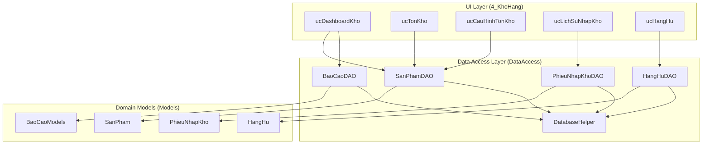
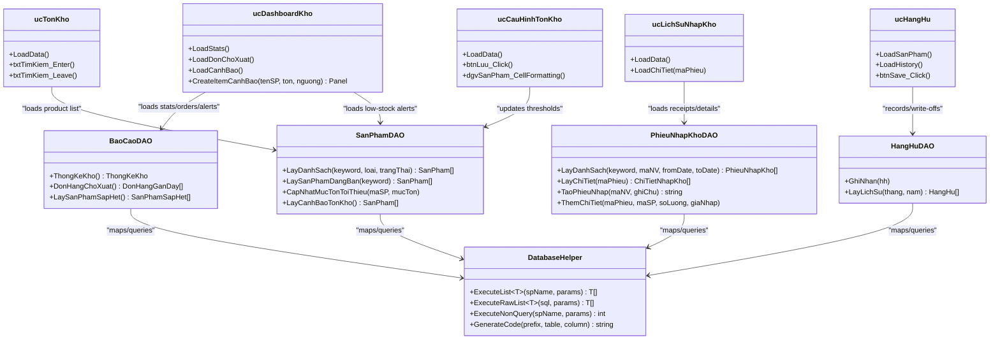
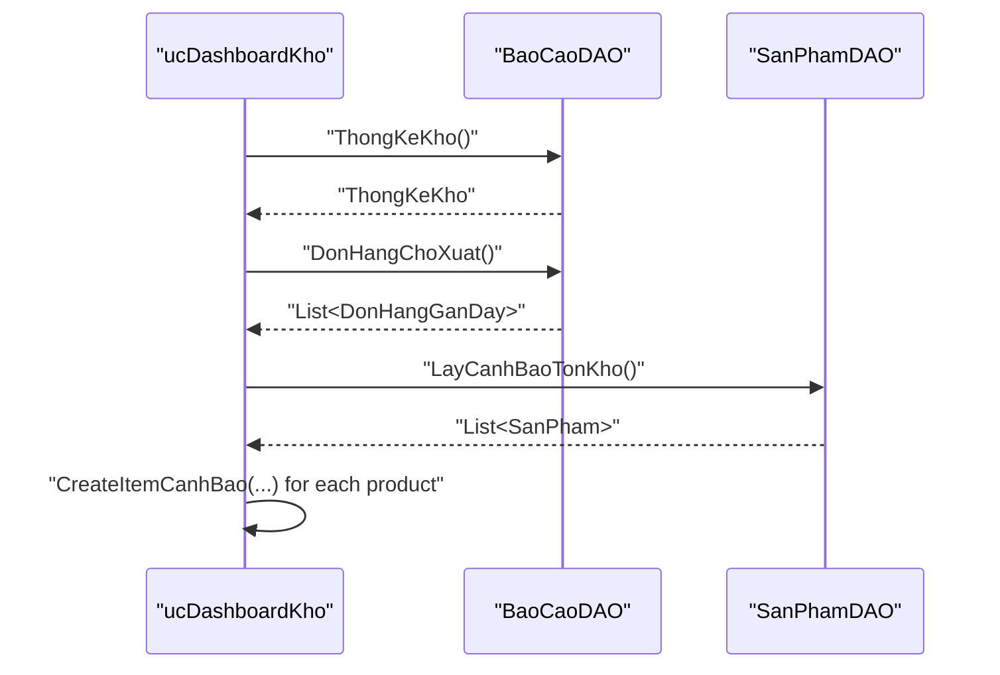
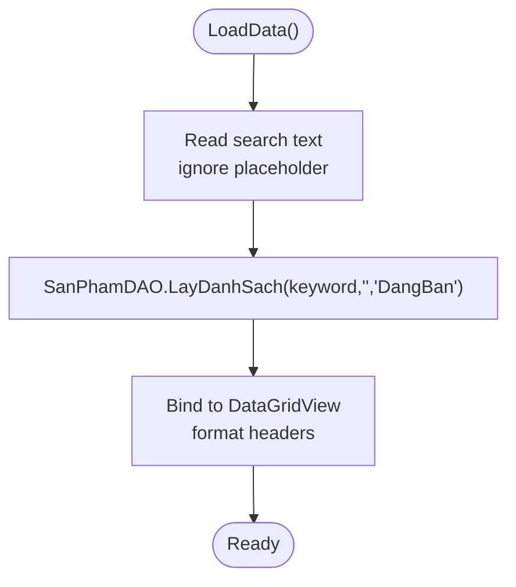
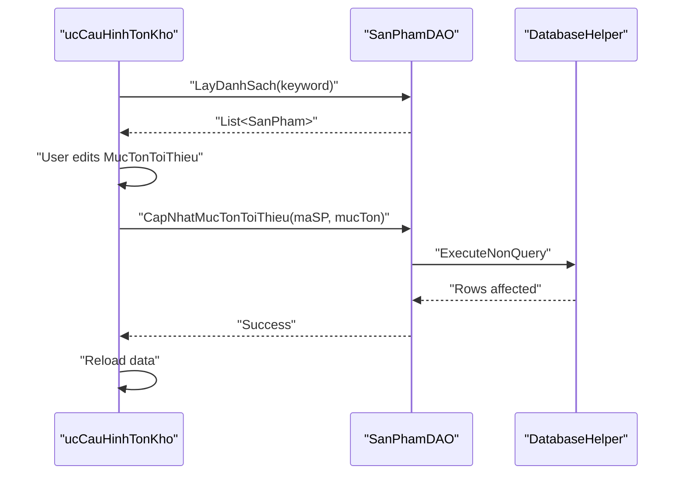
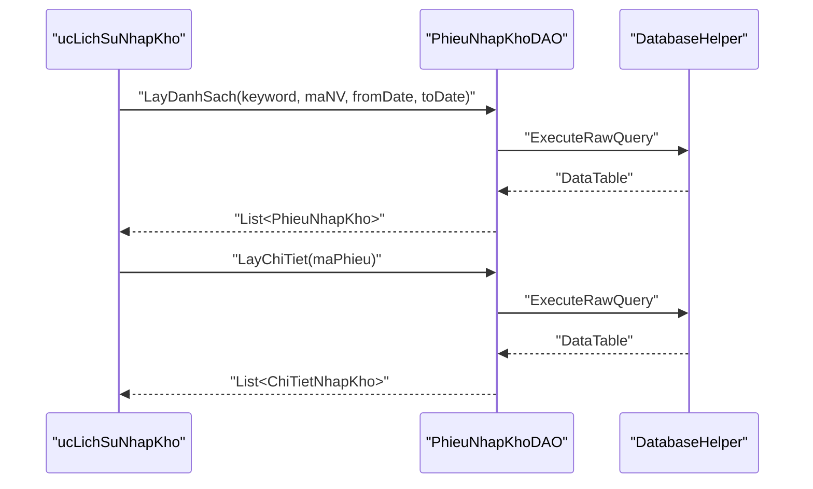
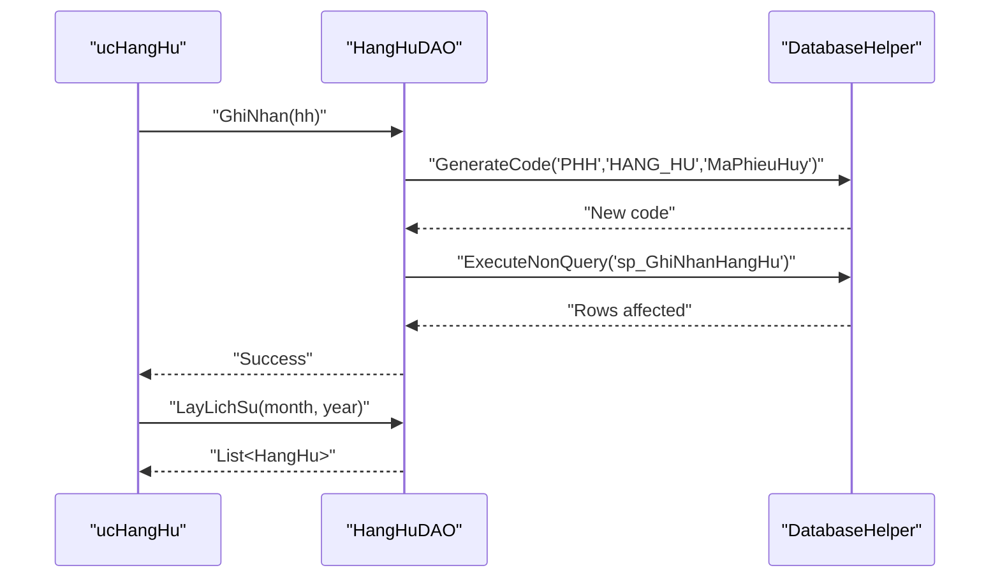
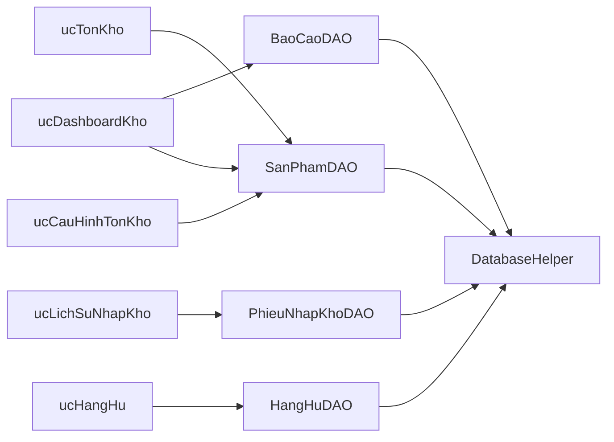

# Stock Tracking & Monitoring

<cite>
**Referenced Files in This Document**
- [ucDashboardKho.cs](file://4_KhoHang/ucDashboardKho.cs)
- [ucTonKho.cs](file://4_KhoHang/ucTonKho.cs)
- [ucCauHinhTonKho.cs](file://4_KhoHang/ucCauHinhTonKho.cs)
- [ucLichSuNhapKho.cs](file://4_KhoHang/ucLichSuNhapKho.cs)
- [ucHangHu.cs](file://4_KhoHang/ucHangHu.cs)
- [SanPhamDAO.cs](file://DataAccess/SanPhamDAO.cs)
- [BaoCaoDAO.cs](file://DataAccess/BaoCaoDAO.cs)
- [PhieuNhapKhoDAO.cs](file://DataAccess/PhieuNhapKhoDAO.cs)
- [HangHuDAO.cs](file://DataAccess/HangHuDAO.cs)
- [DatabaseHelper.cs](file://DataAccess/DatabaseHelper.cs)
- [SanPham.cs](file://Models/SanPham.cs)
- [BaoCaoModels.cs](file://Models/BaoCaoModels.cs)
- [PhieuNhapKho.cs](file://Models/PhieuNhapKho.cs)
- [HangHu.cs](file://Models/HangHu.cs)
</cite>

## Table of Contents
1. [Introduction](#introduction)
2. [Project Structure](#project-structure)
3. [Core Components](#core-components)
4. [Architecture Overview](#architecture-overview)
5. [Detailed Component Analysis](#detailed-component-analysis)
6. [Dependency Analysis](#dependency-analysis)
7. [Performance Considerations](#performance-considerations)
8. [Troubleshooting Guide](#troubleshooting-guide)
9. [Conclusion](#conclusion)
10. [Appendices](#appendices)

## Introduction
This document explains the Stock Tracking & Monitoring system within the Inventory Management Module. It covers real-time inventory monitoring, stock level tracking, automated low-stock alert mechanisms, the stock dashboard, product availability indicators, and inventory status visualization. It also documents integration with product catalog data, stock quantity calculations, inventory valuation methods, operational procedures for monitoring stock movements, turnover rate tracking, slow-moving or obsolete inventory identification, discrepancy detection, variance analysis, inventory accuracy maintenance, and guidelines for setting up stock alerts, configuring notification thresholds, and optimizing stock levels.

## Project Structure
The Inventory Management Module is organized around user controls (UserControl) under the 4_KhoHang folder, backed by a data access layer (DataAccess) and strongly-typed models (Models). The dashboard aggregates key metrics, while dedicated views manage stock lists, threshold configuration, incoming stock history, and damaged goods reporting.

**Diagram sources**
- [ucDashboardKho.cs:17-60](file://4_KhoHang/ucDashboardKho.cs#L17-L60)
- [ucTonKho.cs:13-36](file://4_KhoHang/ucTonKho.cs#L13-L36)
- [ucCauHinhTonKho.cs:22-49](file://4_KhoHang/ucCauHinhTonKho.cs#L22-L49)
- [ucLichSuNhapKho.cs:36-59](file://4_KhoHang/ucLichSuNhapKho.cs#L36-L59)
- [ucHangHu.cs:45-58](file://4_KhoHang/ucHangHu.cs#L45-L58)
- [SanPhamDAO.cs:11-93](file://DataAccess/SanPhamDAO.cs#L11-L93)
- [BaoCaoDAO.cs:100-108](file://DataAccess/BaoCaoDAO.cs#L100-L108)
- [PhieuNhapKhoDAO.cs:10-51](file://DataAccess/PhieuNhapKhoDAO.cs#L10-L51)
- [HangHuDAO.cs:11-37](file://DataAccess/HangHuDAO.cs#L11-L37)
- [DatabaseHelper.cs:19-52](file://DataAccess/DatabaseHelper.cs#L19-L52)
- [SanPham.cs:5-42](file://Models/SanPham.cs#L5-L42)
- [BaoCaoModels.cs:68-74](file://Models/BaoCaoModels.cs#L68-L74)
- [PhieuNhapKho.cs:6-31](file://Models/PhieuNhapKho.cs#L6-L31)
- [HangHu.cs:5-16](file://Models/HangHu.cs#L5-L16)

**Section sources**
- [ucDashboardKho.cs:10-60](file://4_KhoHang/ucDashboardKho.cs#L10-L60)
- [ucTonKho.cs:9-36](file://4_KhoHang/ucTonKho.cs#L9-L36)
- [ucCauHinhTonKho.cs:10-49](file://4_KhoHang/ucCauHinhTonKho.cs#L10-L49)
- [ucLichSuNhapKho.cs:9-59](file://4_KhoHang/ucLichSuNhapKho.cs#L9-L59)
- [ucHangHu.cs:9-58](file://4_KhoHang/ucHangHu.cs#L9-L58)

## Core Components
- Stock Dashboard (ucDashboardKho): Aggregates warehouse statistics, displays pending orders, and shows low-stock warnings with visual progress bars.
- Stock List (ucTonKho): Lists products with current stock, minimum thresholds, pricing, and filters by name.
- Threshold Configuration (ucCauHinhTonKho): Allows editing per-product minimum stock thresholds and color-coded visibility of stock status.
- Incoming Stock History (ucLichSuNhapKho): Filters and displays purchase receipt records with itemized details.
- Damaged Goods Reporting (ucHangHu): Records and summarizes items written off due to spoilage, damage, or expiration.

**Section sources**
- [ucDashboardKho.cs:17-104](file://4_KhoHang/ucDashboardKho.cs#L17-L104)
- [ucTonKho.cs:13-55](file://4_KhoHang/ucTonKho.cs#L13-L55)
- [ucCauHinhTonKho.cs:22-111](file://4_KhoHang/ucCauHinhTonKho.cs#L22-L111)
- [ucLichSuNhapKho.cs:36-92](file://4_KhoHang/ucLichSuNhapKho.cs#L36-L92)
- [ucHangHu.cs:45-111](file://4_KhoHang/ucHangHu.cs#L45-L111)

## Architecture Overview
The system follows a layered architecture:
- UI Layer: Windows Forms UserControls render dashboards and forms.
- Data Access Layer: DAO classes encapsulate database operations and map results to models.
- Domain Models: Strongly typed models represent entities and reports.
- Data Access Helper: Centralized helpers handle connection, command execution, and reflection-based mapping.

**Diagram sources**
- [ucDashboardKho.cs:17-104](file://4_KhoHang/ucDashboardKho.cs#L17-L104)
- [ucTonKho.cs:13-55](file://4_KhoHang/ucTonKho.cs#L13-L55)
- [ucCauHinhTonKho.cs:22-111](file://4_KhoHang/ucCauHinhTonKho.cs#L22-L111)
- [ucLichSuNhapKho.cs:36-92](file://4_KhoHang/ucLichSuNhapKho.cs#L36-L92)
- [ucHangHu.cs:45-111](file://4_KhoHang/ucHangHu.cs#L45-L111)
- [SanPhamDAO.cs:11-93](file://DataAccess/SanPhamDAO.cs#L11-L93)
- [BaoCaoDAO.cs:100-138](file://DataAccess/BaoCaoDAO.cs#L100-L138)
- [PhieuNhapKhoDAO.cs:10-74](file://DataAccess/PhieuNhapKhoDAO.cs#L10-L74)
- [HangHuDAO.cs:11-37](file://DataAccess/HangHuDAO.cs#L11-L37)
- [DatabaseHelper.cs:19-52](file://DataAccess/DatabaseHelper.cs#L19-L52)

## Detailed Component Analysis

### Stock Dashboard (ucDashboardKho)
- Loads warehouse statistics (pending orders, low-stock count, recent shipments, monthly receipts).
- Displays recent orders awaiting shipment with customer and date info.
- Generates low-stock alert panels with product name, current stock, and minimum threshold, including a visual progress bar indicating proximity to zero or threshold.

**Diagram sources**
- [ucDashboardKho.cs:17-60](file://4_KhoHang/ucDashboardKho.cs#L17-L60)
- [BaoCaoDAO.cs:100-138](file://DataAccess/BaoCaoDAO.cs#L100-L138)
- [SanPhamDAO.cs:90-93](file://DataAccess/SanPhamDAO.cs#L90-L93)

**Section sources**
- [ucDashboardKho.cs:17-104](file://4_KhoHang/ucDashboardKho.cs#L17-L104)
- [BaoCaoModels.cs:68-74](file://Models/BaoCaoModels.cs#L68-L74)
- [BaoCaoModels.cs:89-96](file://Models/BaoCaoModels.cs#L89-L96)

### Stock List (ucTonKho)
- Loads active products for sale with columns for product ID, name, category, stock, minimum threshold, selling price, and cost price.
- Supports filtering by product name via a search box with placeholder handling.

**Diagram sources**
- [ucTonKho.cs:13-36](file://4_KhoHang/ucTonKho.cs#L13-L36)
- [SanPhamDAO.cs:11-33](file://DataAccess/SanPhamDAO.cs#L11-L33)

**Section sources**
- [ucTonKho.cs:13-55](file://4_KhoHang/ucTonKho.cs#L13-L55)
- [SanPham.cs:7-14](file://Models/SanPham.cs#L7-L14)

### Threshold Configuration (ucCauHinhTonKho)
- Displays product list with editable minimum stock thresholds.
- Applies color-coded cell formatting based on current stock vs. threshold (red for zero, orange for below threshold, green for sufficient).
- Saves edited thresholds to the database and reloads the grid.

**Diagram sources**
- [ucCauHinhTonKho.cs:22-86](file://4_KhoHang/ucCauHinhTonKho.cs#L22-L86)
- [SanPhamDAO.cs:20-33](file://DataAccess/SanPhamDAO.cs#L20-L33)
- [SanPhamDAO.cs:80-88](file://DataAccess/SanPhamDAO.cs#L80-L88)
- [DatabaseHelper.cs:144-157](file://DataAccess/DatabaseHelper.cs#L144-L157)

**Section sources**
- [ucCauHinhTonKho.cs:22-111](file://4_KhoHang/ucCauHinhTonKho.cs#L22-L111)
- [SanPhamDAO.cs:80-88](file://DataAccess/SanPhamDAO.cs#L80-L88)

### Incoming Stock History (ucLichSuNhapKho)
- Filters purchase receipts by keyword, staff member, and date range.
- Shows receipt summary and expands to itemized details on selection.
- Formats currency and date columns for readability.

**Diagram sources**
- [ucLichSuNhapKho.cs:36-92](file://4_KhoHang/ucLichSuNhapKho.cs#L36-L92)
- [PhieuNhapKhoDAO.cs:10-51](file://DataAccess/PhieuNhapKhoDAO.cs#L10-L51)
- [DatabaseHelper.cs:124-142](file://DataAccess/DatabaseHelper.cs#L124-L142)
- [PhieuNhapKho.cs:6-31](file://Models/PhieuNhapKho.cs#L6-L31)

**Section sources**
- [ucLichSuNhapKho.cs:16-92](file://4_KhoHang/ucLichSuNhapKho.cs#L16-L92)
- [PhieuNhapKhoDAO.cs:10-51](file://DataAccess/PhieuNhapKhoDAO.cs#L10-L51)

### Damaged Goods Reporting (ucHangHu)
- Provides a dropdown of products and month/year filter for historical write-offs.
- Allows recording new write-offs with reason and note, auto-generating a write-off code.
- Updates the grid and computes total lost units.

**Diagram sources**
- [ucHangHu.cs:82-111](file://4_KhoHang/ucHangHu.cs#L82-L111)
- [HangHuDAO.cs:11-37](file://DataAccess/HangHuDAO.cs#L11-L37)
- [HangHu.cs:5-16](file://Models/HangHu.cs#L5-L16)
- [DatabaseHelper.cs:189-209](file://DataAccess/DatabaseHelper.cs#L189-L209)

**Section sources**
- [ucHangHu.cs:17-111](file://4_KhoHang/ucHangHu.cs#L17-L111)
- [HangHuDAO.cs:11-37](file://DataAccess/HangHuDAO.cs#L11-L37)
- [HangHu.cs:5-16](file://Models/HangHu.cs#L5-L16)

## Dependency Analysis
- DAOs depend on DatabaseHelper for SQL execution and mapping.
- UI components orchestrate multiple DAO calls to assemble views.
- Models encapsulate domain data and computed display properties.
- Stored procedures and raw SQL queries are used for reporting and threshold checks.

**Diagram sources**
- [ucDashboardKho.cs:17-60](file://4_KhoHang/ucDashboardKho.cs#L17-L60)
- [ucTonKho.cs:13-36](file://4_KhoHang/ucTonKho.cs#L13-L36)
- [ucCauHinhTonKho.cs:22-86](file://4_KhoHang/ucCauHinhTonKho.cs#L22-L86)
- [ucLichSuNhapKho.cs:36-92](file://4_KhoHang/ucLichSuNhapKho.cs#L36-L92)
- [ucHangHu.cs:45-111](file://4_KhoHang/ucHangHu.cs#L45-L111)
- [SanPhamDAO.cs:11-93](file://DataAccess/SanPhamDAO.cs#L11-L93)
- [BaoCaoDAO.cs:100-138](file://DataAccess/BaoCaoDAO.cs#L100-L138)
- [PhieuNhapKhoDAO.cs:10-74](file://DataAccess/PhieuNhapKhoDAO.cs#L10-L74)
- [HangHuDAO.cs:11-37](file://DataAccess/HangHuDAO.cs#L11-L37)
- [DatabaseHelper.cs:19-52](file://DataAccess/DatabaseHelper.cs#L19-L52)

**Section sources**
- [SanPhamDAO.cs:11-93](file://DataAccess/SanPhamDAO.cs#L11-L93)
- [BaoCaoDAO.cs:100-138](file://DataAccess/BaoCaoDAO.cs#L100-L138)
- [PhieuNhapKhoDAO.cs:10-74](file://DataAccess/PhieuNhapKhoDAO.cs#L10-L74)
- [HangHuDAO.cs:11-37](file://DataAccess/HangHuDAO.cs#L11-L37)
- [DatabaseHelper.cs:19-52](file://DataAccess/DatabaseHelper.cs#L19-L52)

## Performance Considerations
- Prefer indexed columns in filters (product name, dates, staff ID) to reduce query cost.
- Batch updates for threshold configuration to minimize round-trips.
- Use pagination or virtual mode for large grids to avoid memory pressure.
- Cache frequently accessed product lists where appropriate.
- Avoid heavy reflection mapping for high-frequency operations; leverage precompiled queries or stored procedures.

## Troubleshooting Guide
- Low-stock alerts not appearing:
  - Verify stored procedure execution for threshold checks and that product statuses are updated accordingly.
  - Confirm the alert panel creation logic receives non-empty product lists.
- Threshold updates failing:
  - Ensure numeric input validation and that DAO update method executes without exceptions.
  - Check database permissions for UPDATE operations.
- Purchase receipt details missing:
  - Validate foreign keys and that detail queries join on receipt ID.
  - Confirm date range boundaries and parameter binding.
- Write-off entries not recorded:
  - Verify code generation stored procedure and that the write-off procedure executes successfully.

**Section sources**
- [ucDashboardKho.cs:50-60](file://4_KhoHang/ucDashboardKho.cs#L50-L60)
- [ucCauHinhTonKho.cs:56-86](file://4_KhoHang/ucCauHinhTonKho.cs#L56-L86)
- [ucLichSuNhapKho.cs:66-92](file://4_KhoHang/ucLichSuNhapKho.cs#L66-L92)
- [ucHangHu.cs:82-111](file://4_KhoHang/ucHangHu.cs#L82-L111)
- [SanPhamDAO.cs:80-88](file://DataAccess/SanPhamDAO.cs#L80-L88)
- [PhieuNhapKhoDAO.cs:44-51](file://DataAccess/PhieuNhapKhoDAO.cs#L44-L51)
- [HangHuDAO.cs:11-22](file://DataAccess/HangHuDAO.cs#L11-L22)

## Conclusion
The Stock Tracking & Monitoring module provides a practical toolkit for warehouse oversight: real-time dashboards, configurable thresholds, incoming stock tracking, and write-off logging. By leveraging DAOs and stored procedures, it ensures reliable data retrieval and updates. Operational procedures and alert mechanisms support proactive inventory management, while built-in reporting aids in variance analysis and accuracy maintenance.

## Appendices

### Real-Time Monitoring and Alerts
- Automated low-stock alerts are generated by querying products whose current stock meets or falls below configured thresholds.
- Dashboard panels visually indicate urgency with color and progress bars.

**Section sources**
- [ucDashboardKho.cs:50-104](file://4_KhoHang/ucDashboardKho.cs#L50-L104)
- [SanPhamDAO.cs:90-93](file://DataAccess/SanPhamDAO.cs#L90-L93)

### Stock Level Tracking and Product Catalog Integration
- Stock levels and thresholds are integrated with the product catalog, enabling filtered listings and status-based formatting.
- Minimum thresholds are editable per product and persisted to the database.

**Section sources**
- [ucTonKho.cs:13-36](file://4_KhoHang/ucTonKho.cs#L13-L36)
- [ucCauHinhTonKho.cs:22-86](file://4_KhoHang/ucCauHinhTonKho.cs#L22-L86)
- [SanPham.cs:12-14](file://Models/SanPham.cs#L12-L14)

### Inventory Valuation Methods
- Inventory valuation can be derived from unit cost and current stock quantities exposed by product records.
- Incoming stock history supports cost aggregation for receipts.

**Section sources**
- [ucTonKho.cs:13-36](file://4_KhoHang/ucTonKho.cs#L13-L36)
- [ucLichSuNhapKho.cs:36-92](file://4_KhoHang/ucLichSuNhapKho.cs#L36-L92)
- [PhieuNhapKho.cs:23-31](file://Models/PhieuNhapKho.cs#L23-L31)

### Operational Procedures
- Monitoring stock movements:
  - Use incoming stock history to reconcile receipts against purchase orders.
  - Cross-check outgoing movement via order fulfillment status.
- Tracking inventory turnover:
  - Combine sales volume (from reports) with average inventory (current stock) to compute turnover ratios.
- Identifying slow-moving or obsolete inventory:
  - Filter products by sales velocity and shelf life criteria; flag items below minimum thresholds for review.

**Section sources**
- [ucLichSuNhapKho.cs:36-92](file://4_KhoHang/ucLichSuNhapKho.cs#L36-L92)
- [BaoCaoDAO.cs:28-35](file://DataAccess/BaoCaoDAO.cs#L28-L35)

### Discrepancy Detection and Variance Analysis
- Compare physical counts with system records; investigate differences promptly.
- Use variance analysis to identify trends and root causes (e.g., theft, damage, misclassification).
- Maintain regular audits and reconcile discrepancies to the write-off process.

**Section sources**
- [ucHangHu.cs:45-111](file://4_KhoHang/ucHangHu.cs#L45-L111)
- [HangHuDAO.cs:24-37](file://DataAccess/HangHuDAO.cs#L24-L37)

### Inventory Accuracy Maintenance
- Keep product master data accurate (categories, pricing).
- Regular reconciliation of receipts, sales, and write-offs.
- Enforce threshold reviews and periodic stocktakes.

**Section sources**
- [ucCauHinhTonKho.cs:22-86](file://4_KhoHang/ucCauHinhTonKho.cs#L22-L86)
- [ucHangHu.cs:45-111](file://4_KhoHang/ucHangHu.cs#L45-L111)

### Setting Up Stock Alerts and Notification Thresholds
- Configure per-product minimum stock thresholds via the threshold configuration view.
- Use dashboard alerts to monitor near-zero or below-threshold items.
- Establish team protocols for reordering when thresholds are triggered.

**Section sources**
- [ucCauHinhTonKho.cs:22-86](file://4_KhoHang/ucCauHinhTonKho.cs#L22-L86)
- [ucDashboardKho.cs:50-60](file://4_KhoHang/ucDashboardKho.cs#L50-L60)

### Stock Level Optimization Strategies
- Align reorder points with lead times and demand variability.
- Apply ABC analysis to categorize inventory by value and turnover.
- Implement cycle counting to maintain accuracy and reduce annual audit burden.

[No sources needed since this section provides general guidance]