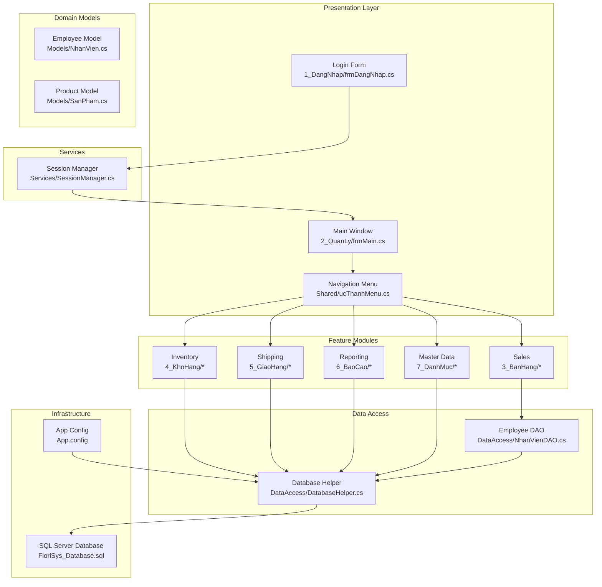
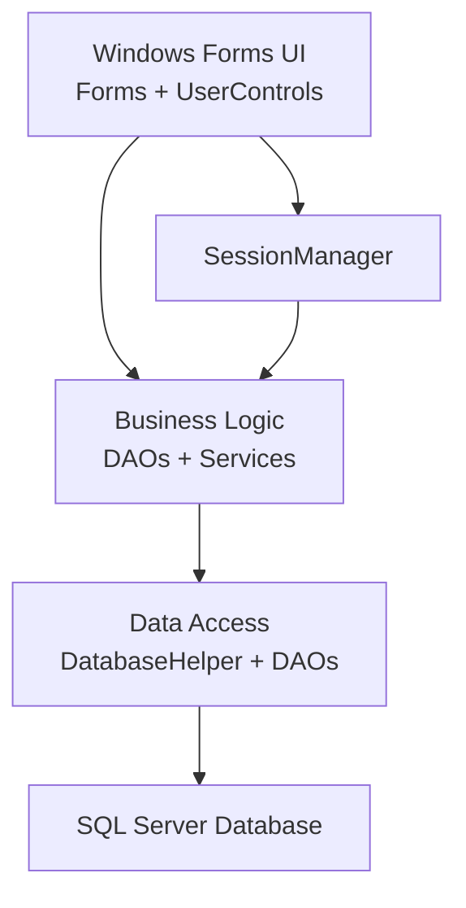
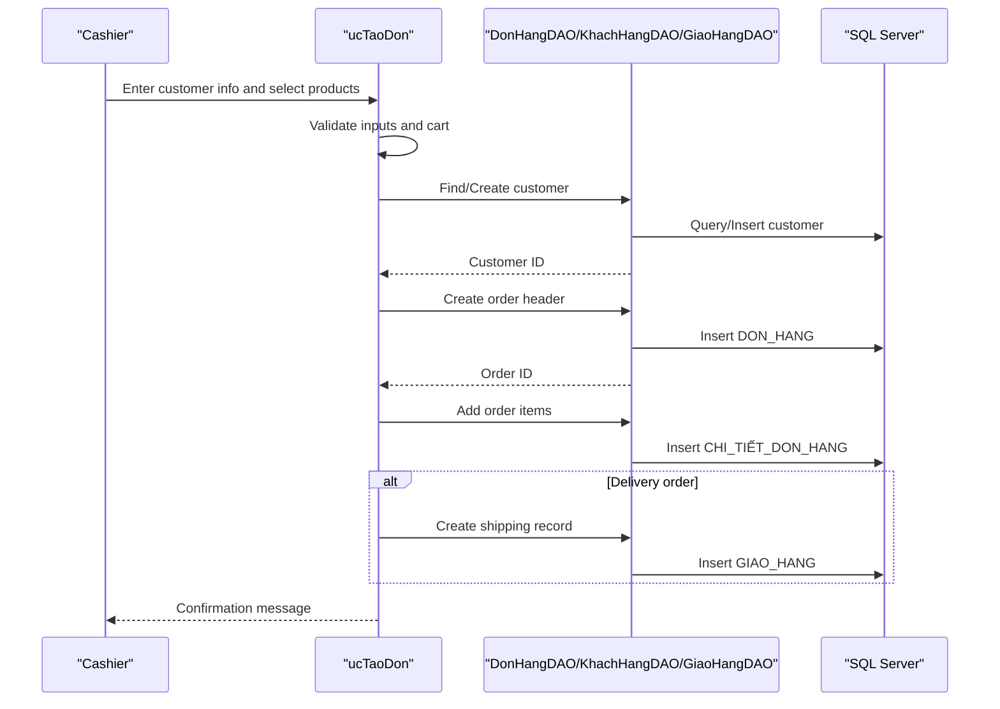
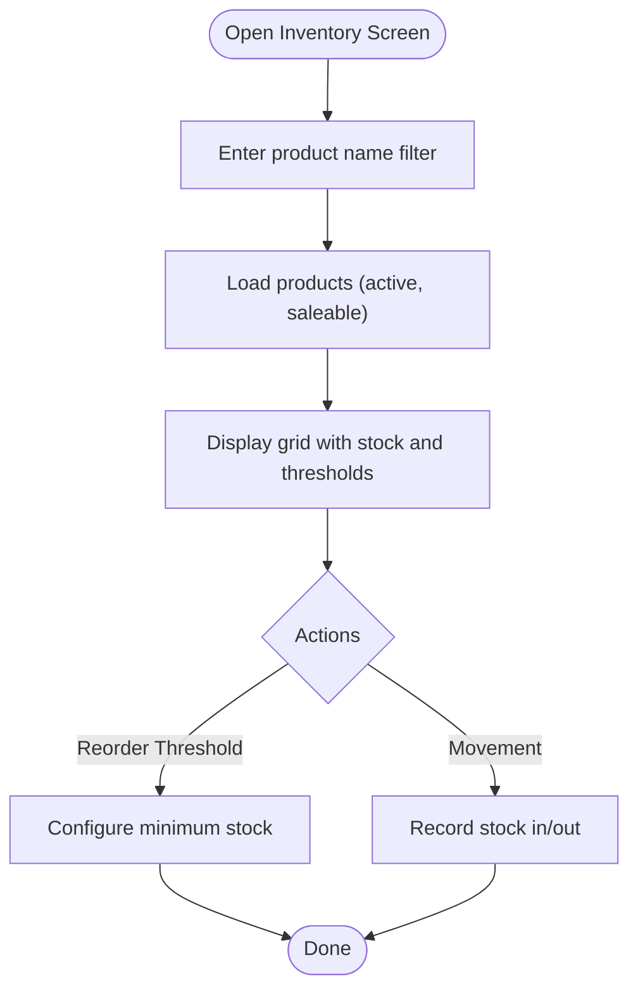
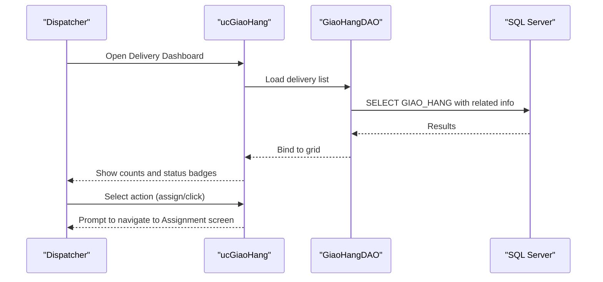
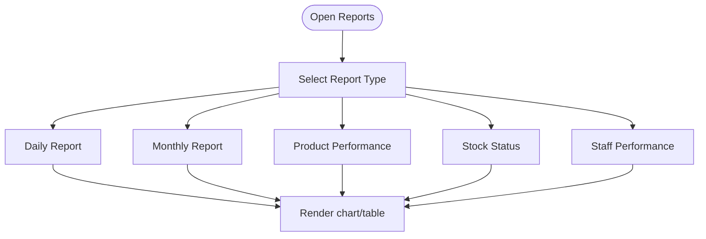
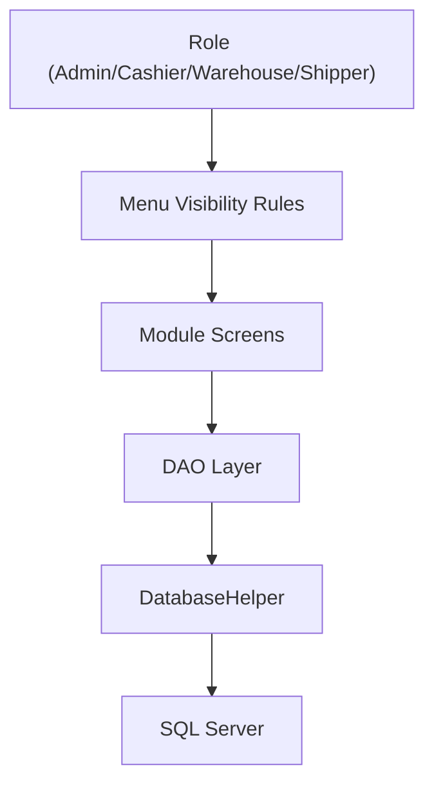
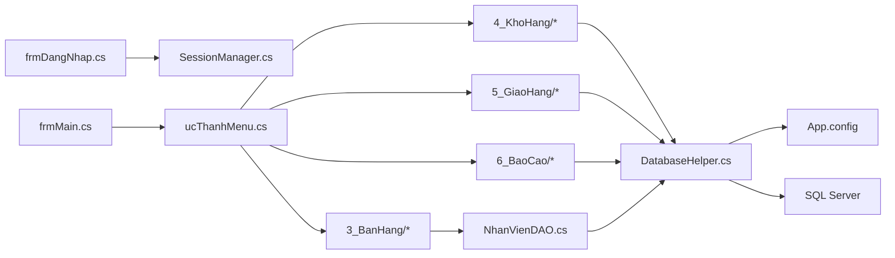

# Project Overview

<cite>
**Referenced Files in This Document**
- [Program.cs](file://Program.cs)
- [FloriSys.csproj](file://FloriSys.csproj)
- [App.config](file://App.config)
- [FloriSys_Database.sql](file://FloriSys_Database.sql)
- [1_DangNhap/frmDangNhap.cs](file://1_DangNhap/frmDangNhap.cs)
- [2_QuanLy/frmMain.cs](file://2_QuanLy/frmMain.cs)
- [Shared/ucThanhMenu.cs](file://Shared/ucThanhMenu.cs)
- [Services/SessionManager.cs](file://Services/SessionManager.cs)
- [DataAccess/DatabaseHelper.cs](file://DataAccess/DatabaseHelper.cs)
- [DataAccess/NhanVienDAO.cs](file://DataAccess/NhanVienDAO.cs)
- [Models/NhanVien.cs](file://Models/NhanVien.cs)
- [Models/SanPham.cs](file://Models/SanPham.cs)
- [3_BanHang/ucTaoDon.cs](file://3_BanHang/ucTaoDon.cs)
- [4_KhoHang/ucTonKho.cs](file://4_KhoHang/ucTonKho.cs)
- [5_GiaoHang/ucGiaoHang.cs](file://5_GiaoHang/ucGiaoHang.cs)
- [6_BaoCao/ucBaoCao.cs](file://6_BaoCao/ucBaoCao.cs)
</cite>

## Table of Contents
1. [Introduction](#introduction)
2. [Project Structure](#project-structure)
3. [Core Components](#core-components)
4. [Architecture Overview](#architecture-overview)
5. [Detailed Component Analysis](#detailed-component-analysis)
6. [Dependency Analysis](#dependency-analysis)
7. [Performance Considerations](#performance-considerations)
8. [Troubleshooting Guide](#troubleshooting-guide)
9. [Conclusion](#conclusion)

## Introduction
FloriSys is a comprehensive desktop application designed to streamline daily operations for flower shops. It centralizes key business processes across sales, inventory, shipping, and reporting, enabling owners, managers, staff, and delivery personnel to work efficiently within a unified system. The platform emphasizes practical workflows such as order creation, stock monitoring, shipping assignments, and performance insights, all while maintaining strong data integrity and role-based access control.

The system’s value proposition lies in reducing manual overhead, minimizing errors, and providing real-time visibility into sales, stock levels, and delivery statuses. By automating repetitive tasks and enforcing consistent procedures, FloriSys helps flower shop teams focus on customer satisfaction and business growth.

## Project Structure
FloriSys follows a modular, layered architecture organized by functional domains:
- Authentication and session management
- Main application shell and navigation
- Feature modules: Sales, Inventory, Shipping, Reporting, and Master Data
- Data access layer with generic helpers and DAOs
- Shared UI components and permissions
- Domain models representing business entities

**Diagram sources**
- [Program.cs:11-22](file://Program.cs#L11-L22)
- [1_DangNhap/frmDangNhap.cs:22-60](file://1_DangNhap/frmDangNhap.cs#L22-L60)
- [2_QuanLy/frmMain.cs:34-122](file://2_QuanLy/frmMain.cs#L34-L122)
- [Shared/ucThanhMenu.cs:75-145](file://Shared/ucThanhMenu.cs#L75-L145)
- [Services/SessionManager.cs:14-29](file://Services/SessionManager.cs#L14-L29)
- [DataAccess/NhanVienDAO.cs:11-29](file://DataAccess/NhanVienDAO.cs#L11-L29)
- [DataAccess/DatabaseHelper.cs:99-209](file://DataAccess/DatabaseHelper.cs#L99-L209)
- [Models/NhanVien.cs:7-13](file://Models/NhanVien.cs#L7-L13)
- [Models/SanPham.cs:7-14](file://Models/SanPham.cs#L7-L14)
- [App.config:3-8](file://App.config#L3-L8)
- [FloriSys_Database.sql:22-200](file://FloriSys_Database.sql#L22-L200)

**Section sources**
- [FloriSys.csproj:53-291](file://FloriSys.csproj#L53-L291)
- [Program.cs:11-22](file://Program.cs#L11-L22)
- [App.config:3-8](file://App.config#L3-L8)

## Core Components
- Authentication and Session Management
  - Login form validates credentials against stored hashes and initializes the current user session.
  - Session manager exposes role-aware properties and utilities for downstream UI and business logic.
- Navigation and Role-Based Access
  - Central menu routes to module screens and enforces visibility rules per role.
- Data Access and ORM Utilities
  - Generic database helper supports stored procedures and raw SQL with automatic mapping to domain models.
- Business Entities
  - Employee and Product models encapsulate domain attributes and computed display values.

Typical workflows:
- Sales: Create orders, manage cart, auto-generate shipping records for delivery orders.
- Inventory: Track stock levels, configure reorder thresholds, record stock movements.
- Shipping: View delivery KPIs, assign couriers, update delivery status.
- Reporting: Switch between daily, monthly, product, employee, and stock reports.

**Section sources**
- [1_DangNhap/frmDangNhap.cs:22-60](file://1_DangNhap/frmDangNhap.cs#L22-L60)
- [Services/SessionManager.cs:14-29](file://Services/SessionManager.cs#L14-L29)
- [Shared/ucThanhMenu.cs:102-145](file://Shared/ucThanhMenu.cs#L102-L145)
- [DataAccess/DatabaseHelper.cs:16-89](file://DataAccess/DatabaseHelper.cs#L16-L89)
- [Models/NhanVien.cs:7-13](file://Models/NhanVien.cs#L7-L13)
- [Models/SanPham.cs:7-14](file://Models/SanPham.cs#L7-L14)

## Architecture Overview
FloriSys employs a classic three-tier architecture:
- Presentation tier: Windows Forms forms and user controls for each module.
- Business logic tier: DAOs and service utilities orchestrating operations.
- Data tier: SQL Server database with stored procedures and views supporting CRUD and analytics.

Technology stack and runtime:
- .NET Framework 4.7.2
- Windows Forms for UI
- SQL Server for persistence
- System.Data.SqlClient for data connectivity

**Diagram sources**
- [FloriSys.csproj:36-51](file://FloriSys.csproj#L36-L51)
- [App.config:3-8](file://App.config#L3-L8)
- [DataAccess/DatabaseHelper.cs:99-209](file://DataAccess/DatabaseHelper.cs#L99-L209)

**Section sources**
- [FloriSys.csproj:11-15](file://FloriSys.csproj#L11-L15)
- [App.config:3-8](file://App.config#L3-L8)

## Detailed Component Analysis

### Sales Management Workflow
This module enables cashiers to create orders, manage items, and optionally trigger shipping records for delivery orders.

**Diagram sources**
- [3_BanHang/ucTaoDon.cs:102-152](file://3_BanHang/ucTaoDon.cs#L102-L152)
- [DataAccess/DatabaseHelper.cs:144-172](file://DataAccess/DatabaseHelper.cs#L144-L172)
- [FloriSys_Database.sql:64-101](file://FloriSys_Database.sql#L64-L101)

**Section sources**
- [3_BanHang/ucTaoDon.cs:102-152](file://3_BanHang/ucTaoDon.cs#L102-L152)

### Inventory Control Workflow
This module allows warehouse staff to monitor stock levels, search products, and maintain reorder thresholds.

**Diagram sources**
- [4_KhoHang/ucTonKho.cs:13-36](file://4_KhoHang/ucTonKho.cs#L13-L36)
- [FloriSys_Database.sql:49-58](file://FloriSys_Database.sql#L49-L58)

**Section sources**
- [4_KhoHang/ucTonKho.cs:13-36](file://4_KhoHang/ucTonKho.cs#L13-L36)

### Shipping Coordination Workflow
This module displays delivery KPIs and lists pending deliveries, guiding dispatchers to assign couriers.

**Diagram sources**
- [5_GiaoHang/ucGiaoHang.cs:25-92](file://5_GiaoHang/ucGiaoHang.cs#L25-L92)
- [DataAccess/DatabaseHelper.cs:104-122](file://DataAccess/DatabaseHelper.cs#L104-L122)
- [FloriSys_Database.sql:93-101](file://FloriSys_Database.sql#L93-L101)

**Section sources**
- [5_GiaoHang/ucGiaoHang.cs:25-92](file://5_GiaoHang/ucGiaoHang.cs#L25-L92)

### Reporting Capabilities
The reporting module aggregates sales and operational metrics across multiple dimensions.

**Diagram sources**
- [6_BaoCao/ucBaoCao.cs:14-56](file://6_BaoCao/ucBaoCao.cs#L14-L56)

**Section sources**
- [6_BaoCao/ucBaoCao.cs:14-56](file://6_BaoCao/ucBaoCao.cs#L14-L56)

### Conceptual Overview
The system’s modular design ensures clear separation of concerns:
- Role-based navigation tailors available actions to user roles.
- DAOs encapsulate data operations and leverage a shared database helper.
- Domain models provide consistent entity representation across layers.

[No sources needed since this diagram shows conceptual workflow, not actual code structure]

## Dependency Analysis
High-level dependencies:
- Presentation depends on services and shared components for navigation and session state.
- Feature modules depend on DAOs for data operations.
- DAOs depend on the database helper for connectivity and mapping.
- The database helper reads connection strings from configuration.

**Diagram sources**
- [1_DangNhap/frmDangNhap.cs:22-60](file://1_DangNhap/frmDangNhap.cs#L22-L60)
- [2_QuanLy/frmMain.cs:34-122](file://2_QuanLy/frmMain.cs#L34-L122)
- [Shared/ucThanhMenu.cs:75-145](file://Shared/ucThanhMenu.cs#L75-L145)
- [DataAccess/NhanVienDAO.cs:11-29](file://DataAccess/NhanVienDAO.cs#L11-L29)
- [DataAccess/DatabaseHelper.cs:99-209](file://DataAccess/DatabaseHelper.cs#L99-L209)
- [App.config:3-8](file://App.config#L3-L8)
- [FloriSys_Database.sql:22-200](file://FloriSys_Database.sql#L22-L200)

**Section sources**
- [FloriSys.csproj:53-291](file://FloriSys.csproj#L53-L291)
- [App.config:3-8](file://App.config#L3-L8)

## Performance Considerations
- Prefer stored procedures for complex queries to reduce round trips and leverage server-side execution plans.
- Use paging or filtering in grids to limit payload sizes for large datasets.
- Minimize reflection-based mapping for hot paths; consider compiled expressions or lightweight mappers if scaling.
- Batch operations for inventory updates and reporting generation to reduce transaction overhead.
- Index frequently queried columns (customer phone, product code, order date) in the database.

[No sources needed since this section provides general guidance]

## Troubleshooting Guide
Common issues and resolutions:
- Login failures
  - Verify credentials and account status. Ensure the database connection string is correct and the server is reachable.
  - Confirm that passwords are hashed before validation.
- Database connectivity errors
  - Check the connection string and network access to the SQL Server instance.
  - Ensure the database exists and the service account has appropriate permissions.
- Role-based menu visibility
  - Confirm the logged-in user’s role is correctly loaded and that permission rules are applied.
- Data loading problems
  - Validate stored procedure names and parameter bindings in DAOs.
  - Review mapping logic for model properties and data types.

**Section sources**
- [1_DangNhap/frmDangNhap.cs:22-60](file://1_DangNhap/frmDangNhap.cs#L22-L60)
- [App.config:3-8](file://App.config#L3-L8)
- [DataAccess/DatabaseHelper.cs:99-209](file://DataAccess/DatabaseHelper.cs#L99-L209)
- [Shared/ucThanhMenu.cs:102-145](file://Shared/ucThanhMenu.cs#L102-L145)

## Conclusion
FloriSys delivers a practical, role-driven solution tailored to the needs of flower shop operations. Its modular architecture, robust data access layer, and clear UI affordability enable efficient order processing, accurate inventory tracking, streamlined shipping coordination, and insightful reporting. By adhering to the outlined architecture and best practices, teams can maintain a reliable system that scales with business demands.