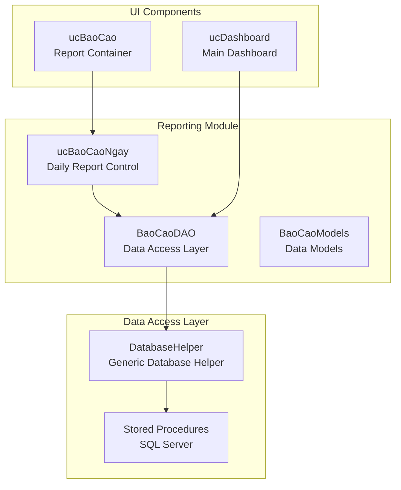
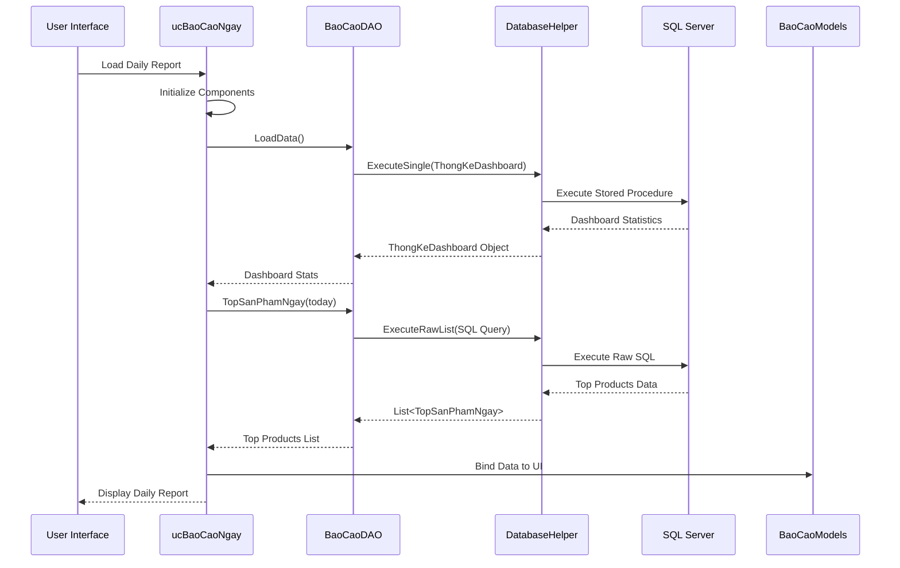

# Daily Reports

<cite>
**Referenced Files in This Document**
- [ucBaoCaoNgay.cs](file://6_BaoCao/ucBaoCaoNgay.cs)
- [ucBaoCaoNgay.Designer.cs](file://6_BaoCao/ucBaoCaoNgay.Designer.cs)
- [BaoCaoDAO.cs](file://DataAccess/BaoCaoDAO.cs)
- [DatabaseHelper.cs](file://DataAccess/DatabaseHelper.cs)
- [BaoCaoModels.cs](file://Models/BaoCaoModels.cs)
- [ucBaoCao.cs](file://6_BaoCao/ucBaoCao.cs)
- [ucDashboard.cs](file://2_QuanLy/ucDashboard.cs)
- [FloriSys_Database.sql](file://FloriSys_Database.sql)
</cite>

## Table of Contents
1. [Introduction](#introduction)
2. [Project Structure](#project-structure)
3. [Core Components](#core-components)
4. [Architecture Overview](#architecture-overview)
5. [Daily Sales Summary Generation](#daily-sales-summary-generation)
6. [Revenue Tracking Mechanisms](#revenue-tracking-mechanisms)
7. [Operational Metrics Calculation](#operational-metrics-calculation)
8. [Report Data Sources](#report-data-sources)
9. [Filtering Capabilities](#filtering-capabilities)
10. [Real-time Data Aggregation](#real-time-data-aggregation)
11. [Report Layout and Design](#report-layout-and-design)
12. [Key Performance Indicators](#key-performance-indicators)
13. [Comparison with Previous Day](#comparison-with-previous-day)
14. [Configuration Options](#configuration-options)
15. [Integration with Sales Data](#integration-with-sales-data)
16. [Customer Acquisition Metrics](#customer-acquisition-metrics)
17. [Inventory Impact Analysis](#inventory-impact-analysis)
18. [Interpretation Guidelines](#interpretation-guidelines)
19. [Troubleshooting Guide](#troubleshooting-guide)
20. [Conclusion](#conclusion)

## Introduction

The Daily Reports functionality in the FloriSys Reporting & Analytics Module provides comprehensive daily sales analytics and performance tracking for flower shop operations. This system generates real-time daily sales summaries, tracks revenue performance, and calculates operational metrics to help managers make informed business decisions.

The daily report serves as a centralized dashboard that displays key performance indicators, top-selling products, revenue trends, and operational health metrics. It integrates seamlessly with the sales transaction system and provides immediate insights into daily business performance.

## Project Structure

The Daily Reports functionality is organized within the reporting module with clear separation of concerns:

**Diagram sources**
- [ucBaoCaoNgay.cs:11-16](file://6_BaoCao/ucBaoCaoNgay.cs#L11-L16)
- [BaoCaoDAO.cs:9-167](file://DataAccess/BaoCaoDAO.cs#L9-L167)
- [DatabaseHelper.cs:10-212](file://DataAccess/DatabaseHelper.cs#L10-L212)

**Section sources**
- [ucBaoCaoNgay.cs:1-100](file://6_BaoCao/ucBaoCaoNgay.cs#L1-L100)
- [ucBaoCao.cs:7-58](file://6_BaoCao/ucBaoCao.cs#L7-L58)

## Core Components

The Daily Reports system consists of several interconnected components that work together to provide comprehensive daily analytics:

### Daily Report Control (`ucBaoCaoNgay`)
The primary user interface component responsible for displaying daily sales information, KPIs, and visualizations.

### Data Access Layer (`BaoCaoDAO`)
Provides methods for retrieving daily sales data, calculating metrics, and aggregating information from the database.

### Database Helper (`DatabaseHelper`)
Handles database connections, executes stored procedures, and manages data mapping between database results and strongly-typed objects.

### Data Models (`BaoCaoModels`)
Defines the structure for various report data types including sales metrics, product performance, and operational statistics.

**Section sources**
- [ucBaoCaoNgay.cs:11-98](file://6_BaoCao/ucBaoCaoNgay.cs#L11-L98)
- [BaoCaoDAO.cs:9-167](file://DataAccess/BaoCaoDAO.cs#L9-L167)
- [DatabaseHelper.cs:10-212](file://DataAccess/DatabaseHelper.cs#L10-L212)
- [BaoCaoModels.cs:1-131](file://Models/BaoCaoModels.cs#L1-L131)

## Architecture Overview

The Daily Reports architecture follows a layered approach with clear separation between presentation, business logic, and data access layers:

**Diagram sources**
- [ucBaoCaoNgay.cs:23-97](file://6_BaoCao/ucBaoCaoNgay.cs#L23-L97)
- [BaoCaoDAO.cs:72-83](file://DataAccess/BaoCaoDAO.cs#L72-L83)
- [DatabaseHelper.cs:37-52](file://DataAccess/DatabaseHelper.cs#L37-L52)

## Daily Sales Summary Generation

The daily sales summary generation process involves multiple steps to aggregate and present comprehensive sales information:

### Data Collection Process
The system collects sales data through several coordinated queries that capture different aspects of daily performance:

1. **Dashboard Statistics**: Total orders, revenue, and operational metrics for the current day
2. **Top Products**: Best-selling products based on quantity sold and revenue generated
3. **Product Quantity**: Total number of products sold during the day
4. **Revenue Breakdown**: Detailed revenue analysis by product category

### Real-time Processing
The system processes data in real-time using the current date as the primary filter criteria, ensuring that reports reflect the most up-to-date information available.

**Section sources**
- [ucBaoCaoNgay.cs:23-97](file://6_BaoCao/ucBaoCaoNgay.cs#L23-L97)
- [BaoCaoDAO.cs:37-83](file://DataAccess/BaoCaoDAO.cs#L37-L83)

## Revenue Tracking Mechanisms

Revenue tracking in the Daily Reports system employs sophisticated mechanisms to provide accurate and comprehensive financial insights:

### Revenue Calculation Methods
The system uses multiple approaches to calculate revenue metrics:

- **Daily Revenue**: Sum of all completed orders for the current day
- **Top Product Revenue**: Revenue generated by individual products
- **Quantity-Based Revenue**: Revenue calculated from product quantities sold
- **Comparison Metrics**: Revenue comparison with previous day's performance

### Data Filtering and Validation
Revenue calculations include comprehensive filtering to exclude cancelled orders and ensure accuracy:

- Excludes orders with status "Huy" (Cancelled)
- Excludes orders with status "HoanHang" (Returned)
- Handles null values and zero quantities appropriately
- Applies proper currency formatting for display

**Section sources**
- [BaoCaoDAO.cs:72-83](file://DataAccess/BaoCaoDAO.cs#L72-L83)
- [BaoCaoDAO.cs:51-70](file://DataAccess/BaoCaoDAO.cs#L51-L70)

## Operational Metrics Calculation

The Daily Reports system calculates various operational metrics to provide comprehensive business insights:

### Key Operational Metrics
- **Total Orders Today**: Count of all orders processed on the current day
- **Orders in Progress**: Active orders currently being processed
- **Products Sold**: Total quantity of products sold during the day
- **Products Below Minimum**: Inventory items below minimum stock threshold
- **Active Shippers**: Number of delivery personnel currently handling orders

### Performance Comparison
The system automatically compares current day metrics with previous day performance to highlight trends and changes:

- Percentage change calculation between consecutive days
- Color-coded indicators for positive/negative changes
- Contextual messaging for trend interpretation

**Section sources**
- [BaoCaoModels.cs:43-52](file://Models/BaoCaoModels.cs#L43-L52)
- [ucDashboard.cs:30-94](file://2_QuanLy/ucDashboard.cs#L30-L94)

## Report Data Sources

The Daily Reports system aggregates data from multiple sources within the FloriSys database:

### Primary Data Sources
- **DON_HANG (Orders)**: Contains order information, timestamps, and financial data
- **CHI_TIET_DON_HANG (Order Details)**: Links products to orders with quantities and prices
- **SAN_PHAM (Products)**: Product catalog with pricing and inventory information
- **KHACH_HANG (Customers)**: Customer information linked to orders
- **NHAN_VIEN (Employees)**: Staff information for sales and delivery tracking

### Data Relationships
The system leverages foreign key relationships to ensure data integrity and enable comprehensive reporting:

- Order details link to both orders and products
- Orders link to customers and sales staff
- Products maintain inventory and pricing relationships

**Section sources**
- [FloriSys_Database.sql:64-87](file://FloriSys_Database.sql#L64-L87)
- [BaoCaoDAO.cs:51-70](file://DataAccess/BaoCaoDAO.cs#L51-L70)

## Filtering Capabilities

The Daily Reports system provides robust filtering capabilities to customize report views:

### Date Range Filtering
- **Current Day Filter**: Default filter using today's date
- **Historical Data Access**: Methods support date-specific queries
- **Flexible Date Parameters**: Methods accept DateTime parameters for custom ranges

### Status-Based Filtering
- **Order Status Filtering**: Excludes cancelled and returned orders
- **Product Availability**: Filters products based on stock status
- **Employee Status**: Filters employee-related metrics appropriately

### Business Unit Filtering
While the current implementation focuses on overall daily performance, the architecture supports future expansion for department-specific filtering.

**Section sources**
- [BaoCaoDAO.cs:51-70](file://DataAccess/BaoCaoDAO.cs#L51-L70)
- [BaoCaoDAO.cs:72-83](file://DataAccess/BaoCaoDAO.cs#L72-L83)

## Real-time Data Aggregation

The Daily Reports system ensures real-time data aggregation through several mechanisms:

### Live Data Processing
- **Current Date Focus**: All queries use the current date as the primary filter
- **Direct Database Queries**: Data is fetched directly from the database rather than cached
- **Dynamic Updates**: Reports refresh automatically when loaded

### Data Consistency Measures
- **Transaction-Aware Queries**: Ensures data consistency during report generation
- **Proper Join Operations**: Uses appropriate joins to maintain data integrity
- **Status Validation**: Validates order statuses before inclusion in calculations

**Section sources**
- [ucBaoCaoNgay.cs:27-28](file://6_BaoCao/ucBaoCaoNgay.cs#L27-L28)
- [BaoCaoDAO.cs:51-70](file://DataAccess/BaoCaoDAO.cs#L51-L70)

## Report Layout and Design

The Daily Reports interface follows a modern, responsive design optimized for business analytics:

### Layout Structure
The report is structured in a card-based layout with three main sections:

1. **Header Section**: Date display and report title
2. **KPI Cards**: Three main performance indicators
3. **Visualization Area**: Charts and product performance tables

### Visual Design Elements
- **Color Scheme**: Professional red (#E8394D) for primary highlights
- **Typography**: Clear, readable fonts with appropriate sizing
- **Spacing**: Consistent padding and margins for visual balance
- **Responsive Design**: Adapts to different screen sizes

### Chart Implementation
The system includes interactive charts for visualizing product performance:

- **3D Pie Chart**: Visual representation of product revenue distribution
- **Custom Styling**: Professional appearance with proper labeling
- **Interactive Features**: Hover effects and exploded segments for top performers

**Section sources**
- [ucBaoCaoNgay.Designer.cs:49-297](file://6_BaoCao/ucBaoCaoNgay.Designer.cs#L49-L297)
- [ucBaoCaoNgay.cs:52-91](file://6_BaoCao/ucBaoCaoNgay.cs#L52-L91)

## Key Performance Indicators

The Daily Reports system displays several critical performance indicators:

### Primary KPIs
- **Total Orders**: Count of all orders processed today
- **Daily Revenue**: Total sales amount for the current day
- **Products Sold**: Total quantity of products sold today

### Secondary Metrics
- **Top Performing Products**: Best-selling items by revenue
- **Revenue Distribution**: Visual breakdown of revenue by product
- **Performance Trends**: Comparison with previous day's performance

### Display Formatting
- **Currency Formatting**: Proper formatting for monetary values
- **Number Formatting**: Appropriate formatting for counts and quantities
- **Percentage Display**: Clear indication of performance changes

**Section sources**
- [ucBaoCaoNgay.cs:30-50](file://6_BaoCao/ucBaoCaoNgay.cs#L30-L50)
- [BaoCaoModels.cs:79-84](file://Models/BaoCaoModels.cs#L79-L84)

## Comparison with Previous Day

The system automatically calculates and displays comparisons with previous day's performance:

### Comparative Analysis
- **Order Volume Change**: Comparison of total orders between consecutive days
- **Revenue Growth**: Percentage change in daily revenue
- **Performance Trend**: Visual indicators for improvement or decline

### Calculation Methodology
The comparison system uses mathematical formulas to calculate percentage changes and applies color coding for easy interpretation:

- **Positive Changes**: Green indicators with upward arrows
- **Negative Changes**: Red indicators with downward arrows
- **Neutral Changes**: Gray indicators with horizontal arrows

### Contextual Messaging
The system provides contextual information about the nature of changes, helping users understand the significance of performance variations.

**Section sources**
- [ucDashboard.cs:96-110](file://2_QuanLy/ucDashboard.cs#L96-L110)
- [BaoCaoModels.cs:43-52](file://Models/BaoCaoModels.cs#L43-L52)

## Configuration Options

The Daily Reports system offers several configuration options for customization:

### Report Customization
- **Date Range Selection**: Ability to select specific dates for reporting
- **Product Category Filtering**: Filter by product categories or types
- **Salesperson Assignment**: Filter by specific sales representatives
- **Customer Segmentation**: Filter by customer demographics or purchase history

### Display Configuration
- **Chart Customization**: Options for chart types and visual styles
- **Data Format Preferences**: Currency, number, and date format preferences
- **Layout Adjustments**: Card arrangement and spacing options
- **Color Theme Selection**: Professional color scheme customization

### Alert Threshold Configuration
- **Inventory Alerts**: Customizable minimum stock level thresholds
- **Performance Alerts**: Thresholds for revenue and order volume targets
- **Delivery Alerts**: Time-based delivery performance notifications
- **Staff Performance Alerts**: Individual employee performance thresholds

**Section sources**
- [ucBaoCao.cs:20-35](file://6_BaoCao/ucBaoCao.cs#L20-L35)
- [BaoCaoDAO.cs:140-164](file://DataAccess/BaoCaoDAO.cs#L140-L164)

## Integration with Sales Data

The Daily Reports system maintains seamless integration with the sales transaction system:

### Sales Transaction Integration
- **Real-time Order Processing**: Immediate reflection of new orders in reports
- **Automated Revenue Calculation**: Automatic revenue updates as orders are processed
- **Inventory Impact Tracking**: Real-time inventory level updates
- **Customer Relationship Management**: Integration with customer purchase history

### Data Synchronization
- **Transaction Logging**: Complete audit trail of all sales transactions
- **Status Updates**: Real-time status changes reflected in reports
- **Payment Processing**: Integration with payment processing systems
- **Delivery Coordination**: Synchronization with delivery management systems

### Cross-System Dependencies
The reporting system relies on proper functioning of the sales system for accurate data:

- **Order Creation**: New orders immediately appear in daily reports
- **Payment Confirmation**: Payment status affects revenue calculations
- **Inventory Updates**: Stock changes impact availability metrics
- **Customer Interactions**: Customer feedback influences performance metrics

**Section sources**
- [FloriSys_Database.sql:64-87](file://FloriSys_Database.sql#L64-L87)
- [BaoCaoDAO.cs:51-70](file://DataAccess/BaoCaoDAO.cs#L51-L70)

## Customer Acquisition Metrics

The Daily Reports system incorporates customer acquisition metrics to provide comprehensive business insights:

### Customer Acquisition Tracking
- **New Customer Identification**: Tracking of new customer registrations
- **Customer Purchase Patterns**: Analysis of customer buying behavior
- **Customer Lifetime Value**: Estimation of long-term customer value
- **Customer Retention Rates**: Measurement of repeat customer behavior

### Customer Segmentation
- **Demographic Analysis**: Age, location, and preference-based customer groups
- **Purchase Behavior Analysis**: Frequency and value-based customer segments
- **Geographic Distribution**: Customer location-based market analysis
- **Seasonal Buying Patterns**: Temporal analysis of customer purchasing behavior

### Customer Engagement Metrics
- **Response Time Analysis**: Average response times to customer inquiries
- **Resolution Rate Tracking**: Effectiveness of customer service interactions
- **Feedback Analysis**: Customer satisfaction and complaint tracking
- **Loyalty Program Participation**: Engagement with customer loyalty initiatives

**Section sources**
- [FloriSys_Database.sql:36-44](file://FloriSys_Database.sql#L36-L44)
- [BaoCaoDAO.cs:91-98](file://DataAccess/BaoCaoDAO.cs#L91-L98)

## Inventory Impact Analysis

The Daily Reports system provides comprehensive inventory impact analysis:

### Inventory Monitoring
- **Stock Level Tracking**: Real-time monitoring of product inventory levels
- **Low Stock Alerts**: Automated alerts for products approaching minimum thresholds
- **Demand Forecasting**: Analysis of sales patterns for inventory planning
- **Supplier Performance**: Evaluation of supplier delivery reliability

### Supply Chain Analysis
- **Lead Time Analysis**: Supplier delivery time performance measurement
- **Cost of Goods Sold**: Tracking of inventory purchase costs
- **Storage Efficiency**: Analysis of warehouse utilization and storage costs
- **Obsolescence Risk**: Identification of slow-moving or obsolete inventory

### Inventory Optimization
- **Reorder Point Analysis**: Determination of optimal reorder points
- **Safety Stock Calculation**: Analysis of appropriate safety stock levels
- **Seasonal Inventory Planning**: Preparation for seasonal demand fluctuations
- **Inventory Turnover Analysis**: Measurement of inventory efficiency

**Section sources**
- [FloriSys_Database.sql:49-58](file://FloriSys_Database.sql#L49-L58)
- [BaoCaoDAO.cs:85-89](file://DataAccess/BaoCaoDAO.cs#L85-L89)

## Interpretation Guidelines

### Daily Trend Analysis
- **Consistent Growth**: Steady increase in orders and revenue indicates positive momentum
- **Seasonal Patterns**: Recognize regular patterns related to holidays or events
- **Anomaly Detection**: Unusual spikes or drops require investigation
- **Market Conditions**: External factors affecting daily performance

### Performance Pattern Recognition
- **Peak Performance Hours**: Identify optimal sales periods
- **Slow Periods**: Recognize off-peak hours for resource optimization
- **Product Performance**: Understand which products drive revenue
- **Staff Performance**: Evaluate individual salesperson effectiveness

### Decision-Making Framework
- **Inventory Decisions**: Adjust ordering based on daily sales patterns
- **Staffing Decisions**: Optimize staffing based on predicted demand
- **Marketing Decisions**: Target promotions based on product performance
- **Operational Decisions**: Adjust operations based on daily capacity utilization

## Troubleshooting Guide

### Common Issues and Solutions

#### Data Loading Problems
- **Symptom**: Reports fail to load or show empty data
- **Cause**: Database connection issues or stored procedure errors
- **Solution**: Verify database connectivity and check stored procedure permissions

#### Performance Issues
- **Symptom**: Slow report loading times
- **Cause**: Large dataset queries or inefficient database indexing
- **Solution**: Optimize database queries and consider adding appropriate indexes

#### Display Problems
- **Symptom**: Incorrect formatting or missing data in reports
- **Cause**: Data type mismatches or formatting errors
- **Solution**: Verify data model mappings and formatting configurations

#### Integration Issues
- **Symptom**: Discrepancies between sales system and reports
- **Cause**: Data synchronization delays or transaction conflicts
- **Solution**: Check transaction logs and verify data consistency

### Diagnostic Tools
- **Error Logging**: Comprehensive error logging for troubleshooting
- **Performance Monitoring**: Built-in performance metrics collection
- **Data Validation**: Automated validation of report data accuracy
- **System Health Checks**: Regular system integrity verification

**Section sources**
- [ucBaoCaoNgay.cs:93-96](file://6_BaoCao/ucBaoCaoNgay.cs#L93-L96)
- [DatabaseHelper.cs:104-142](file://DataAccess/DatabaseHelper.cs#L104-L142)

## Conclusion

The Daily Reports functionality in the FloriSys Reporting & Analytics Module provides a comprehensive solution for daily sales monitoring and performance tracking. The system successfully integrates real-time data processing, sophisticated revenue tracking, and operational metrics calculation to deliver actionable business insights.

Key strengths of the system include its real-time data aggregation capabilities, comprehensive KPI display, intuitive user interface, and robust data validation mechanisms. The modular architecture ensures maintainability and extensibility for future enhancements.

The system effectively bridges the gap between raw transaction data and meaningful business intelligence, enabling managers to make informed decisions based on current performance metrics and historical trends. Its integration with the broader FloriSys ecosystem ensures data consistency and operational efficiency across all business functions.

Future enhancements could include expanded filtering capabilities, advanced predictive analytics, and enhanced mobile accessibility to further improve the user experience and business value.