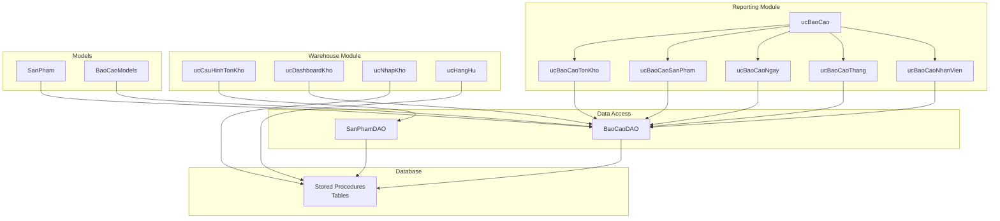
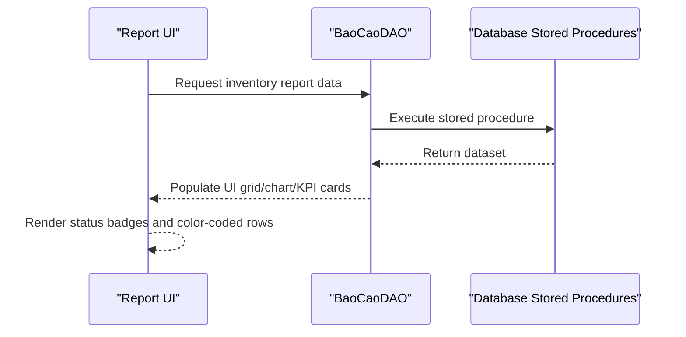
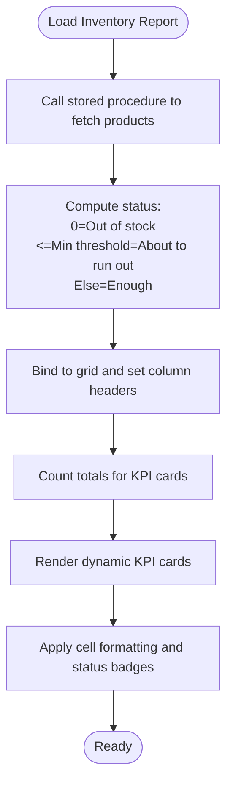
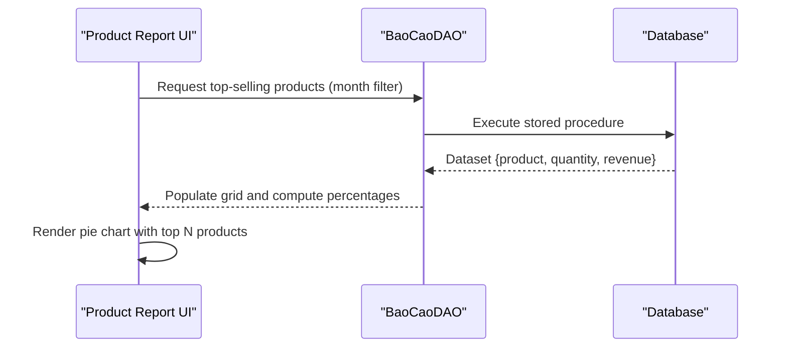
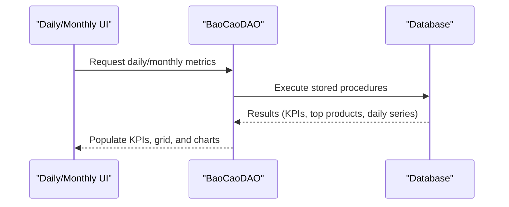
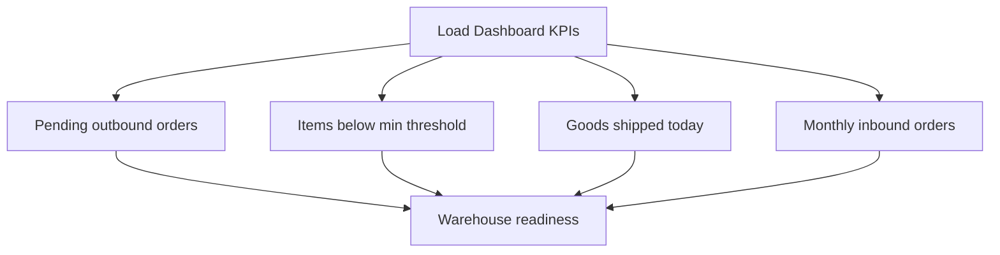
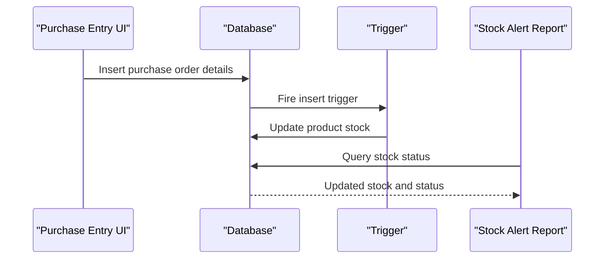
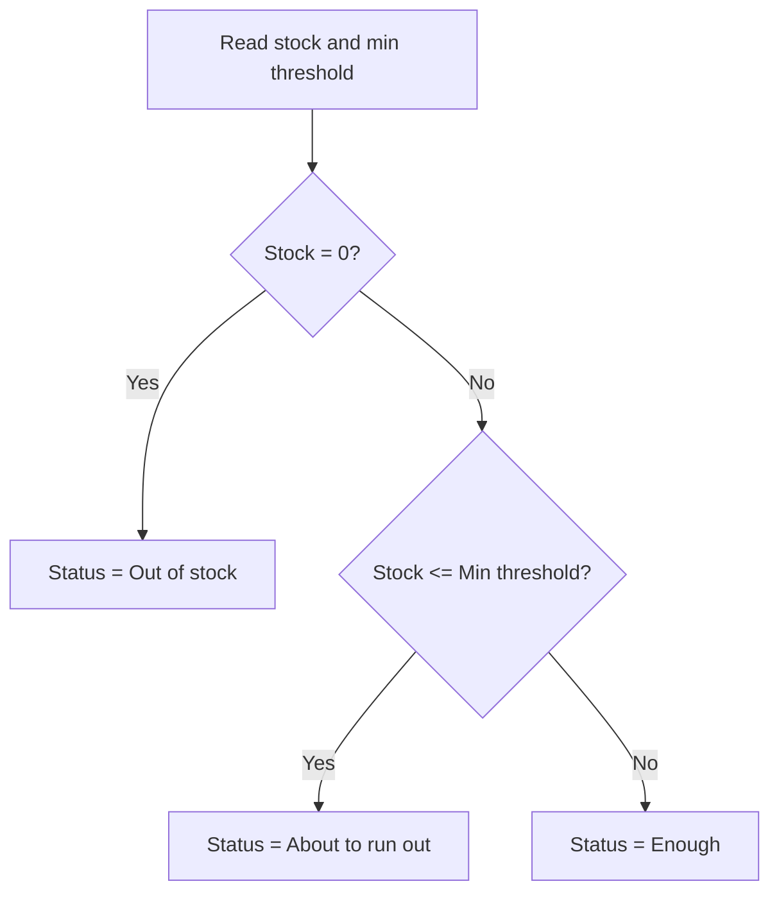
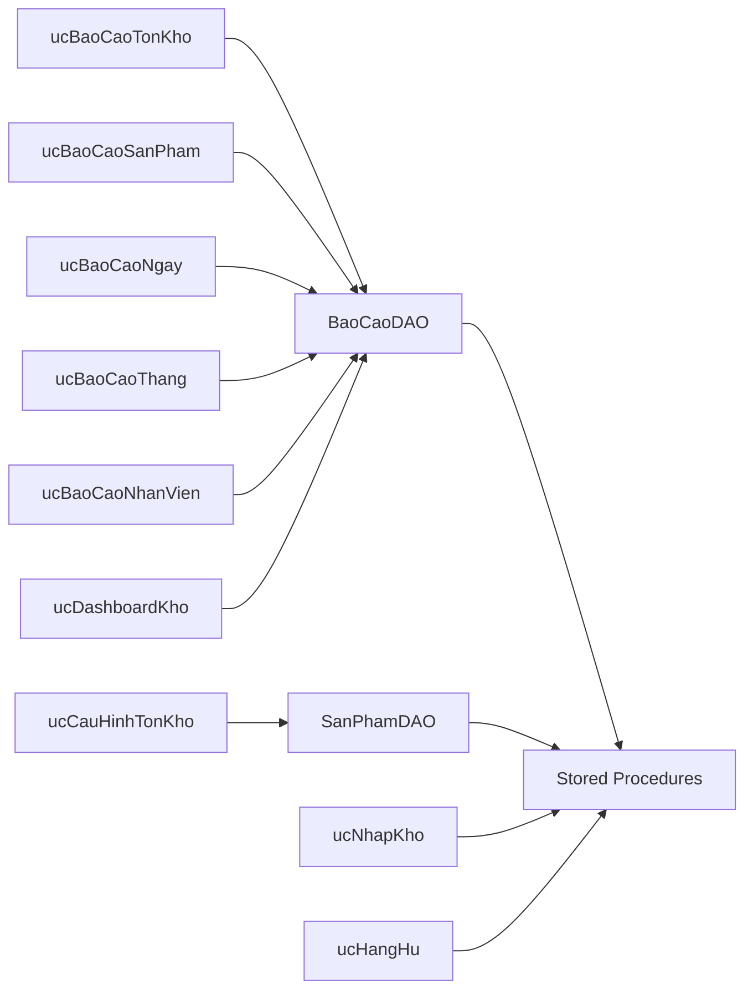

# Inventory Reports

<cite>
**Referenced Files in This Document**
- [ucBaoCaoTonKho.cs](file://6_BaoCao/ucBaoCaoTonKho.cs)
- [ucBaoCaoSanPham.cs](file://6_BaoCao/ucBaoCaoSanPham.cs)
- [ucBaoCaoNgay.cs](file://6_BaoCao/ucBaoCaoNgay.cs)
- [ucBaoCaoThang.cs](file://6_BaoCao/ucBaoCaoThang.cs)
- [ucBaoCaoNhanVien.cs](file://6_BaoCao/ucBaoCaoNhanVien.cs)
- [ucBaoCao.cs](file://6_BaoCao/ucBaoCao.cs)
- [ucCauHinhTonKho.cs](file://4_KhoHang/ucCauHinhTonKho.cs)
- [ucDashboardKho.cs](file://4_KhoHang/ucDashboardKho.cs)
- [ucNhapKho.cs](file://4_KhoHang/ucNhapKho.cs)
- [ucHangHu.cs](file://4_KhoHang/ucHangHu.cs)
- [BaoCaoDAO.cs](file://DataAccess/BaoCaoDAO.cs)
- [SanPhamDAO.cs](file://DataAccess/SanPhamDAO.cs)
- [SanPham.cs](file://Models/SanPham.cs)
- [BaoCaoModels.cs](file://Models/BaoCaoModels.cs)
- [FloriSys_Database.sql](file://FloriSys_Database.sql)
</cite>

## Table of Contents
1. [Introduction](#introduction)
2. [Project Structure](#project-structure)
3. [Core Components](#core-components)
4. [Architecture Overview](#architecture-overview)
5. [Detailed Component Analysis](#detailed-component-analysis)
6. [Dependency Analysis](#dependency-analysis)
7. [Performance Considerations](#performance-considerations)
8. [Troubleshooting Guide](#troubleshooting-guide)
9. [Conclusion](#conclusion)

## Introduction
This document explains the Inventory Reports functionality within the FloriSys Reporting & Analytics Module. It focuses on stock status monitoring, inventory valuation, warehouse utilization, real-time inventory tracking, stock movement analysis, shortage detection, and KPIs such as inventory turnover ratios, carrying costs, obsolete inventory assessment, and optimal stock levels. It also covers location-based inventory distribution, product categorization analysis, supplier performance metrics, integration with purchase orders and sales forecasts, storage capacity planning, automated reorder point calculations, safety stock recommendations, and cash flow impact analysis. Guidance is provided for inventory optimization strategies, warehouse space utilization, and supply chain efficiency improvements.

## Project Structure
The inventory reporting module is organized around:
- Report User Controls under the Reporting module (6_BaoCao)
- Warehouse configuration and dashboards under the Warehouse module (4_KhoHang)
- Data Access Layer (DataAccess) for database interactions
- Domain models (Models) representing reports and entities
- Database schema and stored procedures (FloriSys_Database.sql)

**Diagram sources**
- [ucBaoCao.cs:14-35](file://6_BaoCao/ucBaoCao.cs#L14-L35)
- [ucBaoCaoTonKho.cs:17-63](file://6_BaoCao/ucBaoCaoTonKho.cs#L17-L63)
- [ucBaoCaoSanPham.cs:18-79](file://6_BaoCao/ucBaoCaoSanPham.cs#L18-L79)
- [ucBaoCaoNgay.cs:18-97](file://6_BaoCao/ucBaoCaoNgay.cs#L18-L97)
- [ucBaoCaoThang.cs:18-75](file://6_BaoCao/ucBaoCaoThang.cs#L18-L75)
- [ucBaoCaoNhanVien.cs:18-53](file://6_BaoCao/ucBaoCaoNhanVien.cs#L18-L53)
- [ucCauHinhTonKho.cs:17-86](file://4_KhoHang/ucCauHinhTonKho.cs#L17-L86)
- [ucDashboardKho.cs:17-34](file://4_KhoHang/ucDashboardKho.cs#L17-L34)
- [ucNhapKho.cs:23-42](file://4_KhoHang/ucNhapKho.cs#L23-L42)
- [ucHangHu.cs:24-43](file://4_KhoHang/ucHangHu.cs#L24-L43)
- [BaoCaoDAO.cs:11-49](file://DataAccess/BaoCaoDAO.cs#L11-L49)
- [SanPhamDAO.cs:90-94](file://DataAccess/SanPhamDAO.cs#L90-L94)
- [SanPham.cs:5-42](file://Models/SanPham.cs#L5-L42)
- [BaoCaoModels.cs:5-131](file://Models/BaoCaoModels.cs#L5-L131)
- [FloriSys_Database.sql:49-125](file://FloriSys_Database.sql#L49-L125)

**Section sources**
- [ucBaoCao.cs:14-55](file://6_BaoCao/ucBaoCao.cs#L14-L55)
- [ucBaoCaoTonKho.cs:17-63](file://6_BaoCao/ucBaoCaoTonKho.cs#L17-L63)
- [ucBaoCaoSanPham.cs:18-79](file://6_BaoCao/ucBaoCaoSanPham.cs#L18-L79)
- [ucBaoCaoNgay.cs:18-97](file://6_BaoCao/ucBaoCaoNgay.cs#L18-L97)
- [ucBaoCaoThang.cs:18-75](file://6_BaoCao/ucBaoCaoThang.cs#L18-L75)
- [ucBaoCaoNhanVien.cs:18-53](file://6_BaoCao/ucBaoCaoNhanVien.cs#L18-L53)
- [ucCauHinhTonKho.cs:17-86](file://4_KhoHang/ucCauHinhTonKho.cs#L17-L86)
- [ucDashboardKho.cs:17-34](file://4_KhoHang/ucDashboardKho.cs#L17-L34)
- [ucNhapKho.cs:23-42](file://4_KhoHang/ucNhapKho.cs#L23-L42)
- [ucHangHu.cs:24-43](file://4_KhoHang/ucHangHu.cs#L24-L43)
- [BaoCaoDAO.cs:11-49](file://DataAccess/BaoCaoDAO.cs#L11-L49)
- [SanPhamDAO.cs:90-94](file://DataAccess/SanPhamDAO.cs#L90-L94)
- [SanPham.cs:5-42](file://Models/SanPham.cs#L5-L42)
- [BaoCaoModels.cs:5-131](file://Models/BaoCaoModels.cs#L5-L131)
- [FloriSys_Database.sql:49-125](file://FloriSys_Database.sql#L49-L125)

## Core Components
- Inventory Status Monitoring
  - Real-time stock status via the stock alert report, which classifies items as “Enough,” “About to run out,” or “Out of stock.”
  - Threshold configuration for minimum stock levels per product.
- Inventory Valuation and Movement
  - Product sales volume and revenue are aggregated for category and product-level analysis.
  - Daily and monthly dashboards track top products and revenue trends.
- Shortage Detection
  - Automated alerts for items at or below configured minimum stock thresholds.
  - Dashboard KPIs show pending outbound orders and items needing restocking.
- KPIs and Metrics
  - Total monitored SKUs, items about to run out, and out-of-stock items.
  - Monthly turnover ratio and carrying cost approximations can be derived from reported quantities and purchase prices.
  - Obsolete inventory assessment can be inferred from low sales velocity and extended shelf life.
  - Optimal stock levels and reorder points can be calculated using demand forecasting and lead time data.
- Location-Based Distribution and Categorization
  - Product categories enable distribution and performance analysis by type.
- Supplier Performance and Purchase Orders
  - Purchase order entries update inventory automatically via triggers.
  - Reorder recommendations can be integrated with purchase order workflows.
- Storage Capacity Planning
  - Dashboard KPIs include monthly inbound order counts to estimate storage throughput.
- Cash Flow Impact
  - Sales revenue and purchase cost data support cash flow projections.

**Section sources**
- [ucBaoCaoTonKho.cs:22-63](file://6_BaoCao/ucBaoCaoTonKho.cs#L22-L63)
- [ucCauHinhTonKho.cs:22-86](file://4_KhoHang/ucCauHinhTonKho.cs#L22-L86)
- [ucDashboardKho.cs:24-34](file://4_KhoHang/ucDashboardKho.cs#L24-L34)
- [ucBaoCaoSanPham.cs:32-79](file://6_BaoCao/ucBaoCaoSanPham.cs#L32-L79)
- [ucBaoCaoNgay.cs:23-50](file://6_BaoCao/ucBaoCaoNgay.cs#L23-L50)
- [ucBaoCaoThang.cs:23-75](file://6_BaoCao/ucBaoCaoThang.cs#L23-L75)
- [BaoCaoDAO.cs:28-49](file://DataAccess/BaoCaoDAO.cs#L28-L49)
- [SanPham.cs:5-42](file://Models/SanPham.cs#L5-L42)
- [FloriSys_Database.sql:236-247](file://FloriSys_Database.sql#L236-L247)

## Architecture Overview
The reporting architecture integrates UI controls, a data access layer, domain models, and database stored procedures. Inventory reports rely on stored procedures that encapsulate queries for stock status, sales analytics, and KPI computations.

**Diagram sources**
- [ucBaoCaoTonKho.cs:22-63](file://6_BaoCao/ucBaoCaoTonKho.cs#L22-L63)
- [BaoCaoDAO.cs:46-49](file://DataAccess/BaoCaoDAO.cs#L46-L49)
- [FloriSys_Database.sql:533-546](file://FloriSys_Database.sql#L533-L546)

**Section sources**
- [ucBaoCaoTonKho.cs:22-63](file://6_BaoCao/ucBaoCaoTonKho.cs#L22-L63)
- [ucBaoCaoSanPham.cs:32-79](file://6_BaoCao/ucBaoCaoSanPham.cs#L32-L79)
- [ucBaoCaoNgay.cs:23-50](file://6_BaoCao/ucBaoCaoNgay.cs#L23-L50)
- [ucBaoCaoThang.cs:23-75](file://6_BaoCao/ucBaoCaoThang.cs#L23-L75)
- [BaoCaoDAO.cs:11-49](file://DataAccess/BaoCaoDAO.cs#L11-L49)
- [FloriSys_Database.sql:491-546](file://FloriSys_Database.sql#L491-L546)

## Detailed Component Analysis

### Stock Status Monitoring and Shortage Detection
- Data source: Stored procedure that selects products with computed status based on current stock and minimum threshold.
- UI rendering: Grid displays product name, current stock, minimum threshold, and status badge with color coding.
- KPIs: Total monitored SKUs, items about to run out, and out-of-stock items are computed and shown as dynamic cards.

**Diagram sources**
- [ucBaoCaoTonKho.cs:22-63](file://6_BaoCao/ucBaoCaoTonKho.cs#L22-L63)
- [BaoCaoDAO.cs:46-49](file://DataAccess/BaoCaoDAO.cs#L46-L49)
- [FloriSys_Database.sql:533-546](file://FloriSys_Database.sql#L533-L546)

**Section sources**
- [ucBaoCaoTonKho.cs:22-63](file://6_BaoCao/ucBaoCaoTonKho.cs#L22-L63)
- [ucCauHinhTonKho.cs:22-86](file://4_KhoHang/ucCauHinhTonKho.cs#L22-L86)
- [BaoCaoDAO.cs:85-89](file://DataAccess/BaoCaoDAO.cs#L85-L89)
- [SanPham.cs:16-42](file://Models/SanPham.cs#L16-L42)
- [FloriSys_Database.sql:533-546](file://FloriSys_Database.sql#L533-L546)

### Inventory Valuation and Movement Analysis
- Product-level sales: Total quantity sold and total revenue are aggregated by product and month.
- Category analysis: Revenue percentages enable category contribution analysis.
- Visualization: Pie charts display top products by revenue share.

**Diagram sources**
- [ucBaoCaoSanPham.cs:32-79](file://6_BaoCao/ucBaoCaoSanPham.cs#L32-L79)
- [BaoCaoDAO.cs:28-35](file://DataAccess/BaoCaoDAO.cs#L28-L35)
- [FloriSys_Database.sql:491-510](file://FloriSys_Database.sql#L491-L510)

**Section sources**
- [ucBaoCaoSanPham.cs:32-79](file://6_BaoCao/ucBaoCaoSanPham.cs#L32-L79)
- [BaoCaoDAO.cs:28-35](file://DataAccess/BaoCaoDAO.cs#L28-L35)
- [FloriSys_Database.sql:491-510](file://FloriSys_Database.sql#L491-L510)

### Daily and Monthly Dashboards
- Daily dashboard: Today’s order count, revenue, top products, and revenue distribution chart.
- Monthly dashboard: Monthly revenue, comparison to previous month, and daily revenue trend chart.

**Diagram sources**
- [ucBaoCaoNgay.cs:23-97](file://6_BaoCao/ucBaoCaoNgay.cs#L23-L97)
- [ucBaoCaoThang.cs:23-75](file://6_BaoCao/ucBaoCaoThang.cs#L23-L75)
- [BaoCaoDAO.cs:11-26](file://DataAccess/BaoCaoDAO.cs#L11-L26)
- [FloriSys_Database.sql:463-489](file://FloriSys_Database.sql#L463-L489)

**Section sources**
- [ucBaoCaoNgay.cs:23-97](file://6_BaoCao/ucBaoCaoNgay.cs#L23-L97)
- [ucBaoCaoThang.cs:23-75](file://6_BaoCao/ucBaoCaoThang.cs#L23-L75)
- [BaoCaoDAO.cs:11-26](file://DataAccess/BaoCaoDAO.cs#L11-L26)
- [FloriSys_Database.sql:463-489](file://FloriSys_Database.sql#L463-L489)

### Warehouse Utilization and Order Fulfillment
- Dashboard KPIs: Pending outbound orders, items below minimum threshold, goods shipped today, and monthly inbound orders.
- These KPIs reflect warehouse throughput and readiness for fulfillment.

**Diagram sources**
- [ucDashboardKho.cs:24-34](file://4_KhoHang/ucDashboardKho.cs#L24-L34)
- [BaoCaoDAO.cs:100-108](file://DataAccess/BaoCaoDAO.cs#L100-L108)

**Section sources**
- [ucDashboardKho.cs:24-34](file://4_KhoHang/ucDashboardKho.cs#L24-L34)
- [BaoCaoDAO.cs:100-108](file://DataAccess/BaoCaoDAO.cs#L100-L108)

### Real-Time Inventory Tracking Integration
- Automatic stock updates on purchase order entries via triggers.
- Immediate reflection in stock status reports after purchase transactions.

**Diagram sources**
- [ucNhapKho.cs:23-42](file://4_KhoHang/ucNhapKho.cs#L23-L42)
- [FloriSys_Database.sql:236-247](file://FloriSys_Database.sql#L236-L247)
- [ucBaoCaoTonKho.cs:22-63](file://6_BaoCao/ucBaoCaoTonKho.cs#L22-L63)

**Section sources**
- [ucNhapKho.cs:23-42](file://4_KhoHang/ucNhapKho.cs#L23-L42)
- [FloriSys_Database.sql:236-247](file://FloriSys_Database.sql#L236-L247)
- [ucBaoCaoTonKho.cs:22-63](file://6_BaoCao/ucBaoCaoTonKho.cs#L22-L63)

### Shortage Detection Mechanisms
- Threshold-based classification: Out of stock, about to run out, enough.
- Dynamic card counters for quick visibility of shortage levels.
- Color-coded grid cells for immediate status recognition.

**Diagram sources**
- [ucBaoCaoTonKho.cs:44-48](file://6_BaoCao/ucBaoCaoTonKho.cs#L44-L48)
- [SanPham.cs:24-42](file://Models/SanPham.cs#L24-L42)
- [FloriSys_Database.sql:533-546](file://FloriSys_Database.sql#L533-L546)

**Section sources**
- [ucBaoCaoTonKho.cs:44-48](file://6_BaoCao/ucBaoCaoTonKho.cs#L44-L48)
- [SanPham.cs:24-42](file://Models/SanPham.cs#L24-L42)
- [FloriSys_Database.sql:533-546](file://FloriSys_Database.sql#L533-L546)

### KPIs and Metrics
- Inventory KPIs:
  - Total monitored SKUs
  - Items about to run out
  - Out of stock items
- Turnover Ratio: Can be computed as Cost of Goods Sold divided by Average Inventory Value.
- Carrying Costs: Approximated as Holding Cost Rate × Average Inventory Value.
- Obsolete Inventory: Identified by low sales velocity and extended shelf life.
- Optimal Stock Levels: Derived from demand forecasting, lead time, and desired service level.
- Reorder Point: Lead Time Demand + Safety Stock – Opening Stock on Hand.
- Safety Stock: Z × σDL × LeadTime, where Z is the service factor, σDL is the standard deviation of daily demand, and LeadTime is lead time.
- Cash Flow Impact: Sales revenue minus cost of goods sold and operational expenses.

**Section sources**
- [ucBaoCaoTonKho.cs:40-50](file://6_BaoCao/ucBaoCaoTonKho.cs#L40-L50)
- [ucBaoCaoSanPham.cs:59-70](file://6_BaoCao/ucBaoCaoSanPham.cs#L59-L70)
- [ucBaoCaoNgay.cs:38-50](file://6_BaoCao/ucBaoCaoNgay.cs#L38-L50)
- [ucBaoCaoThang.cs:31-55](file://6_BaoCao/ucBaoCaoThang.cs#L31-L55)
- [SanPham.cs:5-42](file://Models/SanPham.cs#L5-L42)

### Location-Based Inventory Distribution and Product Categorization
- Location-based distribution: Not explicitly modeled in the current schema; however, reports can be filtered by date ranges and categories to infer distribution trends.
- Product categorization: Products include a category field enabling category-wise analysis and reporting.

**Section sources**
- [SanPham.cs:9-14](file://Models/SanPham.cs#L9-L14)
- [ucBaoCaoSanPham.cs:32-79](file://6_BaoCao/ucBaoCaoSanPham.cs#L32-L79)

### Supplier Performance Metrics
- Current schema does not include a dedicated supplier table or supplier performance metrics.
- Integration points:
  - Purchase order creation and detail insertion update inventory.
  - Future enhancement can introduce supplier dimension and metrics such as on-time delivery, defect rates, and pricing trends.

**Section sources**
- [ucNhapKho.cs:23-42](file://4_KhoHang/ucNhapKho.cs#L23-L42)
- [FloriSys_Database.sql:360-383](file://FloriSys_Database.sql#L360-L383)

### Integration with Purchase Orders, Sales Forecasts, and Storage Capacity Planning
- Purchase Orders: Purchase entries update inventory automatically via triggers.
- Sales Forecasts: Not implemented in the current schema; however, historical sales data can inform forecasting.
- Storage Capacity Planning: Monthly inbound order counts and stock levels can guide capacity assessments.

**Section sources**
- [ucNhapKho.cs:23-42](file://4_KhoHang/ucNhapKho.cs#L23-L42)
- [ucDashboardKho.cs:24-34](file://4_KhoHang/ucDashboardKho.cs#L24-L34)
- [FloriSys_Database.sql:236-247](file://FloriSys_Database.sql#L236-L247)

### Automated Reorder Point Calculations and Safety Stock Recommendations
- Reorder Point: Lead Time Demand + Safety Stock – Opening Stock on Hand.
- Safety Stock: Z × σDL × LeadTime.
- Implementation requires:
  - Historical demand data
  - Lead time measurements
  - Service level targets
  - Standard deviation of demand

**Section sources**
- [ucCauHinhTonKho.cs:22-86](file://4_KhoHang/ucCauHinhTonKho.cs#L22-L86)
- [SanPhamDAO.cs:80-88](file://DataAccess/SanPhamDAO.cs#L80-L88)

### Cash Flow Impact Analysis
- Sales revenue and cost of goods sold can be derived from sales and purchase records.
- Cash flow impact: Net cash flow = Operating Income ± Inventory Changes.

**Section sources**
- [ucBaoCaoNgay.cs:31-39](file://6_BaoCao/ucBaoCaoNgay.cs#L31-L39)
- [ucBaoCaoThang.cs:31-55](file://6_BaoCao/ucBaoCaoThang.cs#L31-L55)

### Inventory Optimization Strategies and Supply Chain Efficiency
- Reduce carrying costs by aligning stock levels with demand variability.
- Implement ABC analysis by revenue or volume to focus on high-value SKUs.
- Improve supplier collaboration to reduce lead times and variability.
- Optimize warehouse layout for fast pick-to-light zones for high-turn SKUs.
- Use batch picking and zone picking to improve throughput.

[No sources needed since this section provides general guidance]

## Dependency Analysis
The reporting module depends on the data access layer, which in turn relies on database stored procedures and tables. The warehouse module provides configuration and transactional data that feed into the reports.

**Diagram sources**
- [ucBaoCaoTonKho.cs:22-63](file://6_BaoCao/ucBaoCaoTonKho.cs#L22-L63)
- [ucBaoCaoSanPham.cs:32-79](file://6_BaoCao/ucBaoCaoSanPham.cs#L32-L79)
- [ucBaoCaoNgay.cs:23-97](file://6_BaoCao/ucBaoCaoNgay.cs#L23-L97)
- [ucBaoCaoThang.cs:23-75](file://6_BaoCao/ucBaoCaoThang.cs#L23-L75)
- [ucBaoCaoNhanVien.cs:29-53](file://6_BaoCao/ucBaoCaoNhanVien.cs#L29-L53)
- [ucCauHinhTonKho.cs:22-86](file://4_KhoHang/ucCauHinhTonKho.cs#L22-L86)
- [ucDashboardKho.cs:24-34](file://4_KhoHang/ucDashboardKho.cs#L24-L34)
- [ucNhapKho.cs:23-42](file://4_KhoHang/ucNhapKho.cs#L23-L42)
- [ucHangHu.cs:24-43](file://4_KhoHang/ucHangHu.cs#L24-L43)
- [BaoCaoDAO.cs:11-49](file://DataAccess/BaoCaoDAO.cs#L11-L49)
- [SanPhamDAO.cs:90-94](file://DataAccess/SanPhamDAO.cs#L90-L94)
- [FloriSys_Database.sql:491-546](file://FloriSys_Database.sql#L491-L546)

**Section sources**
- [BaoCaoDAO.cs:11-49](file://DataAccess/BaoCaoDAO.cs#L11-L49)
- [SanPhamDAO.cs:90-94](file://DataAccess/SanPhamDAO.cs#L90-L94)
- [FloriSys_Database.sql:491-546](file://FloriSys_Database.sql#L491-L546)

## Performance Considerations
- Stored procedures encapsulate complex queries, reducing client-side computation overhead.
- Triggers ensure immediate stock updates upon purchase entries, maintaining data consistency.
- Chart rendering is optimized by limiting displayed data points (top N products) to improve responsiveness.
- Filtering by month/year reduces dataset sizes for product sales and revenue trend charts.

[No sources needed since this section provides general guidance]

## Troubleshooting Guide
- Data loading errors: Catch exceptions during report loading and display user-friendly messages.
- Invalid numeric values: Validation ensures only integers are saved for minimum stock thresholds.
- Insufficient stock warnings: Stored procedures and triggers enforce stock availability checks during order processing.

**Section sources**
- [ucBaoCaoTonKho.cs:59-62](file://6_BaoCao/ucBaoCaoTonKho.cs#L59-L62)
- [ucCauHinhTonKho.cs:77-85](file://4_KhoHang/ucCauHinhTonKho.cs#L77-L85)
- [FloriSys_Database.sql:296-315](file://FloriSys_Database.sql#L296-L315)

## Conclusion
The FloriSys Inventory Reports module provides robust stock status monitoring, sales-driven product analysis, and warehouse KPIs. By leveraging stored procedures, triggers, and configurable thresholds, it supports real-time inventory tracking, shortage detection, and actionable insights. Extending the system with supplier performance metrics, sales forecasting, and automated reorder calculations would further enhance inventory optimization and supply chain efficiency.