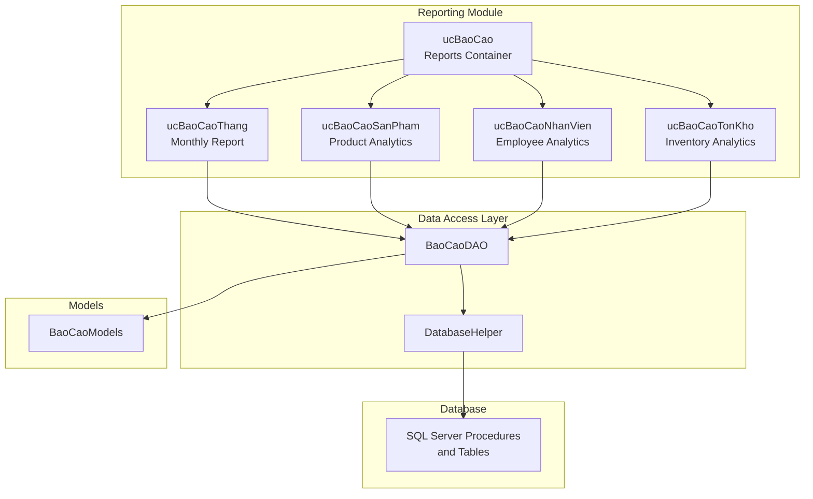
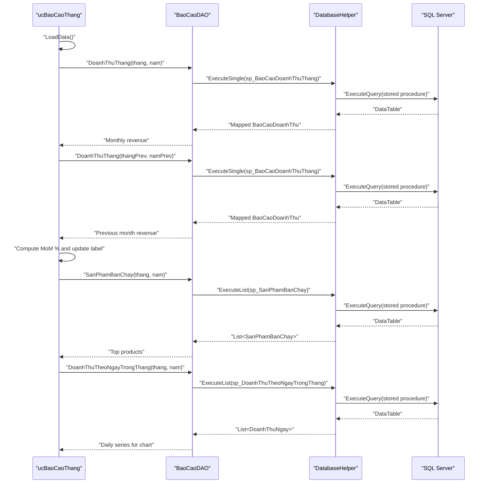
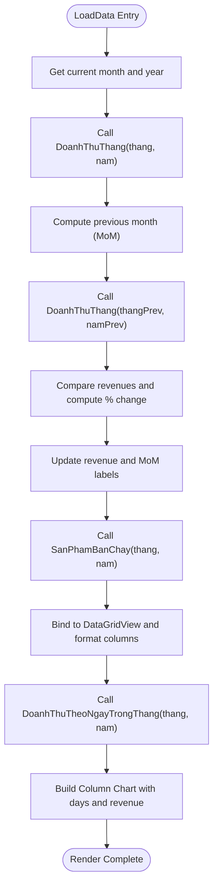
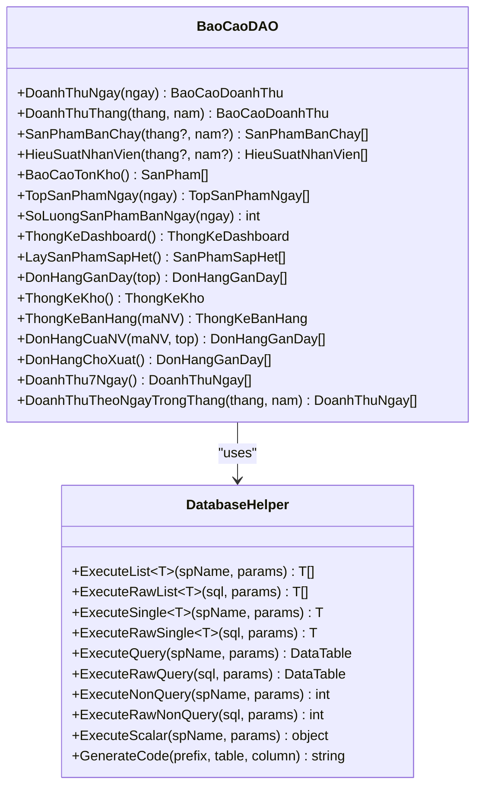
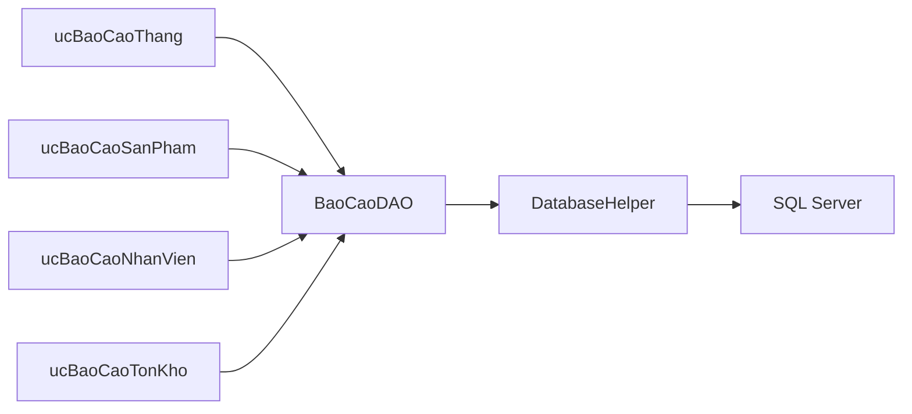

# Monthly Analytics

<cite>
**Referenced Files in This Document**
- [ucBaoCaoThang.cs](file://6_BaoCao/ucBaoCaoThang.cs)
- [ucBaoCaoThang.Designer.cs](file://6_BaoCao/ucBaoCaoThang.Designer.cs)
- [ucBaoCao.cs](file://6_BaoCao/ucBaoCao.cs)
- [ucBaoCao.Designer.cs](file://6_BaoCao/ucBaoCao.Designer.cs)
- [BaoCaoDAO.cs](file://DataAccess/BaoCaoDAO.cs)
- [DatabaseHelper.cs](file://DataAccess/DatabaseHelper.cs)
- [BaoCaoModels.cs](file://Models/BaoCaoModels.cs)
- [ucBaoCaoSanPham.cs](file://6_BaoCao/ucBaoCaoSanPham.cs)
- [ucBaoCaoNhanVien.cs](file://6_BaoCao/ucBaoCaoNhanVien.cs)
- [ucBaoCaoTonKho.cs](file://6_BaoCao/ucBaoCaoTonKho.cs)
- [FloriSys_Database.sql](file://FloriSys_Database.sql)
</cite>

## Table of Contents
1. [Introduction](#introduction)
2. [Project Structure](#project-structure)
3. [Core Components](#core-components)
4. [Architecture Overview](#architecture-overview)
5. [Detailed Component Analysis](#detailed-component-analysis)
6. [Dependency Analysis](#dependency-analysis)
7. [Performance Considerations](#performance-considerations)
8. [Troubleshooting Guide](#troubleshooting-guide)
9. [Conclusion](#conclusion)
10. [Appendices](#appendices)

## Introduction
This document explains the Monthly Analytics functionality within the FloriSys Reporting & Analytics Module. It focuses on how monthly performance is computed, how trends are identified, and how comparative analyses are performed. The module aggregates daily sales records into monthly summaries, supports month-over-month comparisons, and provides visualizations for revenue trends and top-performing products. It also outlines how to extend the system for year-over-year tracking, customizable timeframes, departmental and category analytics, and how to leverage the existing infrastructure for forecasting and strategic planning.

## Project Structure
The Monthly Analytics feature resides under the Reporting module and integrates with the data access layer and shared models. The primary entry point is the Monthly Report user control, orchestrated by the main Reports container.

**Diagram sources**
- [ucBaoCao.cs:14-35](file://6_BaoCao/ucBaoCao.cs#L14-L35)
- [ucBaoCaoThang.cs:18-75](file://6_BaoCao/ucBaoCaoThang.cs#L18-L75)
- [ucBaoCaoSanPham.cs:18-79](file://6_BaoCao/ucBaoCaoSanPham.cs#L18-L79)
- [ucBaoCaoNhanVien.cs:18-53](file://6_BaoCao/ucBaoCaoNhanVien.cs#L18-L53)
- [ucBaoCaoTonKho.cs:17-63](file://6_BaoCao/ucBaoCaoTonKho.cs#L17-L63)
- [BaoCaoDAO.cs:11-164](file://DataAccess/BaoCaoDAO.cs#L11-L164)
- [DatabaseHelper.cs:104-142](file://DataAccess/DatabaseHelper.cs#L104-L142)
- [BaoCaoModels.cs:8-116](file://Models/BaoCaoModels.cs#L8-L116)
- [FloriSys_Database.sql:477-701](file://FloriSys_Database.sql#L477-L701)

**Section sources**
- [ucBaoCao.cs:14-35](file://6_BaoCao/ucBaoCao.cs#L14-L35)
- [ucBaoCao.Designer.cs:18-118](file://6_BaoCao/ucBaoCao.Designer.cs#L18-L118)
- [ucBaoCaoThang.cs:18-75](file://6_BaoCao/ucBaoCaoThang.cs#L18-L75)
- [BaoCaoDAO.cs:11-164](file://DataAccess/BaoCaoDAO.cs#L11-L164)
- [DatabaseHelper.cs:104-142](file://DataAccess/DatabaseHelper.cs#L104-L142)
- [BaoCaoModels.cs:8-116](file://Models/BaoCaoModels.cs#L8-L116)
- [FloriSys_Database.sql:477-701](file://FloriSys_Database.sql#L477-L701)

## Core Components
- Monthly Report Control: Loads current month, computes revenue and month-over-month change, lists top products, and renders a daily revenue column chart.
- Data Access Layer: Provides typed queries via stored procedures and raw SQL, mapping results to strongly-typed models.
- Models: Define DTOs for reports, including monthly revenue, top products, employee performance, inventory status, and daily revenue series.
- Reports Container: Hosts navigation among daily, monthly, product, inventory, and employee analytics.

Key responsibilities:
- Aggregate daily sales into monthly totals and daily series.
- Compute month-over-month growth percentage.
- Render interactive charts and pivot-like grids.
- Support filtering by month and year for product and employee analytics.

**Section sources**
- [ucBaoCaoThang.cs:23-75](file://6_BaoCao/ucBaoCaoThang.cs#L23-L75)
- [BaoCaoDAO.cs:11-164](file://DataAccess/BaoCaoDAO.cs#L11-L164)
- [BaoCaoModels.cs:8-116](file://Models/BaoCaoModels.cs#L8-L116)
- [ucBaoCao.cs:20-35](file://6_BaoCao/ucBaoCao.cs#L20-L35)

## Architecture Overview
The Monthly Analytics pipeline follows a layered pattern:
- Presentation: Windows Forms user controls render UI and bind data.
- Application/Data Access: DAO methods call stored procedures or raw SQL and map results to models.
- Infrastructure: DatabaseHelper encapsulates connection and command execution.
- Database: Stored procedures compute aggregated metrics; tables define domain entities.

**Diagram sources**
- [ucBaoCaoThang.cs:23-75](file://6_BaoCao/ucBaoCaoThang.cs#L23-L75)
- [BaoCaoDAO.cs:11-164](file://DataAccess/BaoCaoDAO.cs#L11-L164)
- [DatabaseHelper.cs:104-142](file://DataAccess/DatabaseHelper.cs#L104-L142)
- [FloriSys_Database.sql:477-701](file://FloriSys_Database.sql#L477-L701)

## Detailed Component Analysis

### Monthly Report Control (ucBaoCaoThang)
Responsibilities:
- Display current month header.
- Fetch and display monthly revenue and month-over-month change.
- Populate top products grid with quantity sold and revenue.
- Render a daily revenue column chart for the selected month.

Processing logic highlights:
- Month selection defaults to current month/year.
- Month-over-month comparison computes percentage change against previous month’s total revenue.
- Daily revenue series is fetched via a stored procedure returning a day-of-month series with revenue and order counts.
- Chart styling and axis labels are configured programmatically.

**Diagram sources**
- [ucBaoCaoThang.cs:23-75](file://6_BaoCao/ucBaoCaoThang.cs#L23-L75)
- [BaoCaoDAO.cs:19-26](file://DataAccess/BaoCaoDAO.cs#L19-L26)
- [BaoCaoDAO.cs:157-164](file://DataAccess/BaoCaoDAO.cs#L157-L164)

**Section sources**
- [ucBaoCaoThang.cs:18-75](file://6_BaoCao/ucBaoCaoThang.cs#L18-L75)
- [ucBaoCaoThang.Designer.cs:18-234](file://6_BaoCao/ucBaoCaoThang.Designer.cs#L18-L234)

### Data Access Layer (BaoCaoDAO and DatabaseHelper)
- BaoCaoDAO exposes typed methods for:
  - Monthly revenue summary.
  - Top products for a given month/year or overall.
  - Employee performance metrics.
  - Daily revenue series for a month.
- DatabaseHelper provides generic mapping helpers to convert stored procedure or raw SQL results into strongly-typed lists or single objects.

**Diagram sources**
- [BaoCaoDAO.cs:11-164](file://DataAccess/BaoCaoDAO.cs#L11-L164)
- [DatabaseHelper.cs:19-52](file://DataAccess/DatabaseHelper.cs#L19-L52)
- [DatabaseHelper.cs:104-142](file://DataAccess/DatabaseHelper.cs#L104-L142)

**Section sources**
- [BaoCaoDAO.cs:11-164](file://DataAccess/BaoCaoDAO.cs#L11-L164)
- [DatabaseHelper.cs:19-52](file://DataAccess/DatabaseHelper.cs#L19-L52)
- [DatabaseHelper.cs:104-142](file://DataAccess/DatabaseHelper.cs#L104-L142)

### Models (BaoCaoModels)
Core DTOs used across reports:
- Monthly revenue summary: total orders, total revenue, completed revenue.
- Top products: product ID, name, category, total quantity sold, total revenue.
- Employee performance: employee ID, name, position, number of orders created, total revenue, number of canceled orders.
- Daily revenue series: date, day-of-month, revenue, number of orders.
- Inventory status: product name, current stock, minimum threshold, status indicator.

These models support consistent data binding in grids and charts.

**Section sources**
- [BaoCaoModels.cs:8-116](file://Models/BaoCaoModels.cs#L8-L116)

### Product Analytics (ucBaoCaoSanPham)
Extends monthly capability by allowing filtering by month and year, computing revenue percentages per product, and rendering a pie chart of top contributors.

Highlights:
- Populates month and year dropdowns with current period context.
- Calculates total revenue across top products and sets percentage column.
- Builds a 3D pie chart of top 5 products by revenue.

**Section sources**
- [ucBaoCaoSanPham.cs:18-79](file://6_BaoCao/ucBaoCaoSanPham.cs#L18-L79)
- [ucBaoCaoSanPham.cs:81-124](file://6_BaoCao/ucBaoCaoSanPham.cs#L81-L124)

### Employee Analytics (ucBaoCaoNhanVien)
Provides monthly employee performance comparison via bar charts, showing total revenue and scaled order counts for top performers.

Highlights:
- Filters by month and year.
- Renders dual-series bar chart for revenue and order volume.
- Limits displayed employees for readability.

**Section sources**
- [ucBaoCaoNhanVien.cs:18-53](file://6_BaoCao/ucBaoCaoNhanVien.cs#L18-L53)
- [ucBaoCaoNhanVien.cs:55-114](file://6_BaoCao/ucBaoCaoNhanVien.cs#L55-L114)

### Inventory Analytics (ucBaoCaoTonKho)
Displays inventory status with KPI cards for total SKUs monitored, nearing depletion, and out-of-stock items, plus color-coded status indicators.

Highlights:
- Uses DAO method to fetch low-stock SKUs.
- Dynamically creates KPI panels and applies cell formatting.

**Section sources**
- [ucBaoCaoTonKho.cs:22-63](file://6_BaoCao/ucBaoCaoTonKho.cs#L22-L63)
- [ucBaoCaoTonKho.cs:65-101](file://6_BaoCao/ucBaoCaoTonKho.cs#L65-L101)
- [ucBaoCaoTonKho.cs:128-150](file://6_BaoCao/ucBaoCaoTonKho.cs#L128-L150)

## Dependency Analysis
- ucBaoCaoThang depends on BaoCaoDAO for monthly revenue, top products, and daily series.
- BaoCaoDAO depends on DatabaseHelper for executing stored procedures and mapping results.
- DatabaseHelper encapsulates connection and command execution, enabling reuse across DAO methods.
- ucBaoCaoSanPham and ucBaoCaoNhanVien reuse BaoCaoDAO for product and employee analytics.
- ucBaoCaoTonKho uses BaoCaoDAO for low-stock SKUs and builds KPI cards.

**Diagram sources**
- [ucBaoCaoThang.cs:32-58](file://6_BaoCao/ucBaoCaoThang.cs#L32-L58)
- [BaoCaoDAO.cs:11-164](file://DataAccess/BaoCaoDAO.cs#L11-L164)
- [DatabaseHelper.cs:104-142](file://DataAccess/DatabaseHelper.cs#L104-L142)

**Section sources**
- [ucBaoCaoThang.cs:32-58](file://6_BaoCao/ucBaoCaoThang.cs#L32-L58)
- [BaoCaoDAO.cs:11-164](file://DataAccess/BaoCaoDAO.cs#L11-L164)
- [DatabaseHelper.cs:104-142](file://DataAccess/DatabaseHelper.cs#L104-L142)

## Performance Considerations
- Stored procedures compute aggregations server-side, minimizing payload sizes and leveraging indexes.
- Generic mapping helpers reduce boilerplate and avoid manual row iteration overhead.
- Chart rendering uses pre-aggregated series; consider virtualizing large datasets if extending to multi-year views.
- Filtering by month/year in stored procedures ensures efficient scans.

[No sources needed since this section provides general guidance]

## Troubleshooting Guide
Common issues and resolutions:
- Empty or placeholder chart: When no sales exist for a month, the control draws a placeholder series. Verify month selection and data availability.
- Null previous month revenue: If the previous month has no data, the UI displays a neutral message and gray color. Ensure historical data exists.
- Exception during load: The controls wrap load logic in try-catch blocks and show user-friendly messages. Check database connectivity and stored procedure permissions.

**Section sources**
- [ucBaoCaoThang.cs:71-75](file://6_BaoCao/ucBaoCaoThang.cs#L71-L75)
- [ucBaoCaoSanPham.cs:75-79](file://6_BaoCao/ucBaoCaoSanPham.cs#L75-L79)
- [ucBaoCaoNhanVien.cs:49-53](file://6_BaoCao/ucBaoCaoNhanVien.cs#L49-L53)
- [ucBaoCaoTonKho.cs:59-63](file://6_BaoCao/ucBaoCaoTonKho.cs#L59-L63)

## Conclusion
The Monthly Analytics module provides a robust foundation for monthly performance monitoring, including revenue summaries, month-over-month comparisons, and visual trend analysis. Its modular design enables extension to year-over-year tracking, customizable filters, and deeper segmentation by department and category. The existing DAO and model abstractions facilitate adding advanced analytics such as forecasting and scenario planning.

[No sources needed since this section summarizes without analyzing specific files]

## Appendices

### Report Generation Workflow
- Select report type (Monthly) and load default daily report on startup.
- Monthly report loads current month, computes revenue and MoM change, binds top products, and renders daily revenue chart.

**Section sources**
- [ucBaoCao.cs:14-18](file://6_BaoCao/ucBaoCao.cs#L14-L18)
- [ucBaoCaoThang.cs:18-75](file://6_BaoCao/ucBaoCaoThang.cs#L18-L75)

### KPI Calculations
- Revenue growth (MoM): Percentage difference between current and previous month’s total revenue.
- Top products: Aggregated by quantity sold and revenue; percentage column computed across top products.
- Employee performance: Revenue and order volume; scaled for visibility in bar charts.
- Inventory KPIs: Total SKUs monitored, nearing depletion, and out-of-stock counts.

**Section sources**
- [ucBaoCaoThang.cs:44-55](file://6_BaoCao/ucBaoCaoThang.cs#L44-L55)
- [ucBaoCaoSanPham.cs:60-69](file://6_BaoCao/ucBaoCaoSanPham.cs#L60-L69)
- [ucBaoCaoNhanVien.cs:107-109](file://6_BaoCao/ucBaoCaoNhanVien.cs#L107-L109)
- [ucBaoCaoTonKho.cs:40-50](file://6_BaoCao/ucBaoCaoTonKho.cs#L40-L50)

### Data Aggregation and Trend Identification
- Daily aggregation: Stored procedure generates a full calendar-day series for the month, ensuring consistent x-axis labels.
- Trend identification: Column chart visualizes daily revenue; MoM percentage highlights directional changes.
- Comparative analysis: Monthly totals compared to prior month; product and employee analytics enable peer comparisons.

**Section sources**
- [BaoCaoDAO.cs:157-164](file://DataAccess/BaoCaoDAO.cs#L157-L164)
- [FloriSys_Database.sql:676-701](file://FloriSys_Database.sql#L676-L701)
- [ucBaoCaoThang.cs:68-125](file://6_BaoCao/ucBaoCaoThang.cs#L68-L125)

### Year-over-Year Tracking
- Extend monthly report by adding year selection and fetching revenue for the same month in the previous year.
- Compute YoY growth similarly to MoM but using prior year’s totals.

Implementation notes:
- Modify month selection logic to include year dropdown.
- Update DAO calls to pass year parameters.
- Adjust chart to overlay or compare two monthly series.

[No sources needed since this section provides general guidance]

### Customizable Time Periods and Category Analytics
- Time periods: Use existing month/year dropdowns in product and employee analytics; extend to arbitrary ranges by adding date range pickers and updating DAO methods to accept start/end dates.
- Category analytics: Add category filter in product analytics; adjust stored procedure to include category grouping and filtering.

[No sources needed since this section provides general guidance]

### Visualization Components and Pivot Table Functionality
- Charts: Column chart for daily revenue, pie chart for top products, bar charts for employee performance.
- Pivot-like grids: Top products grid with calculated percentage column; inventory grid with status formatting.
- Interactivity: Buttons switch between report types; filtering triggers re-rendering.

**Section sources**
- [ucBaoCaoThang.Designer.cs:18-234](file://6_BaoCao/ucBaoCaoThang.Designer.cs#L18-L234)
- [ucBaoCaoSanPham.cs:49-69](file://6_BaoCao/ucBaoCaoSanPham.cs#L49-L69)
- [ucBaoCaoNhanVien.cs:93-99](file://6_BaoCao/ucBaoCaoNhanVien.cs#L93-L99)
- [ucBaoCaoTonKho.cs:128-150](file://6_BaoCao/ucBaoCaoTonKho.cs#L128-L150)

### Seasonal Patterns and Forecasting Methodologies
- Seasonal patterns: Analyze monthly series across multiple years to identify recurring peaks and troughs.
- Forecasting: Use moving averages or linear regression on monthly totals; incorporate external factors (promotions, holidays) as needed.
- Strategic planning: Align inventory procurement and staffing plans with forecasted demand trends.

[No sources needed since this section provides general guidance]