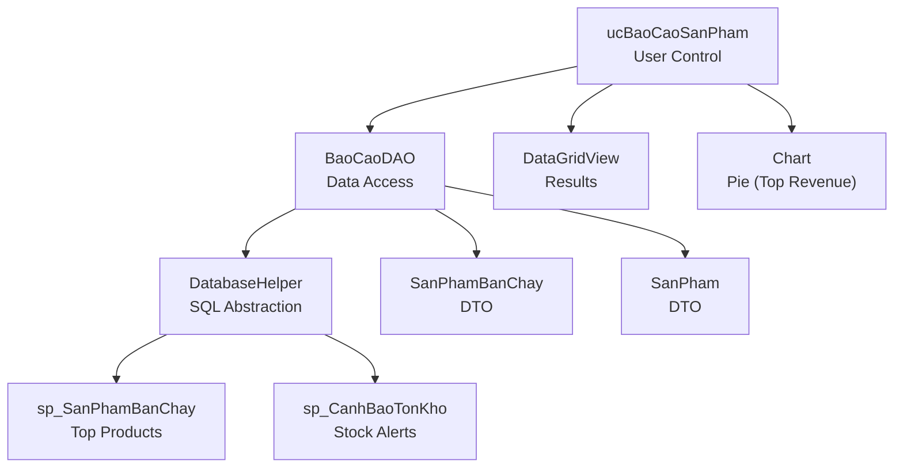
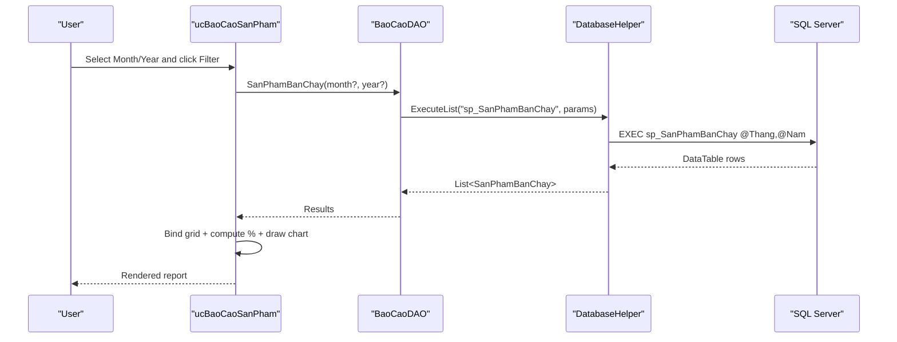
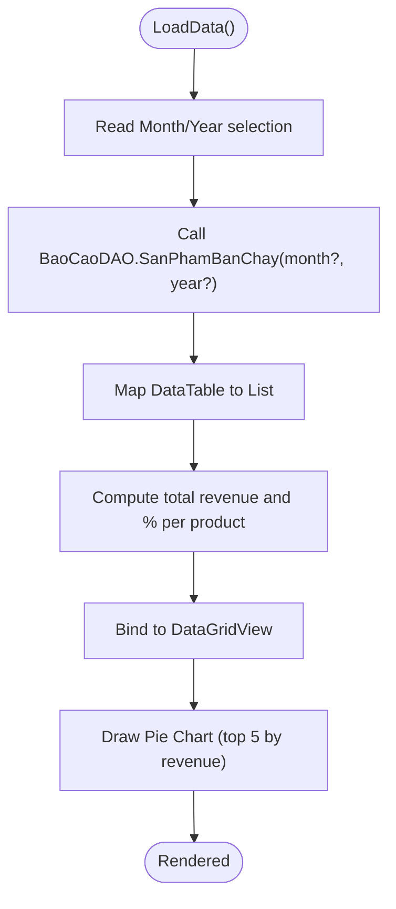
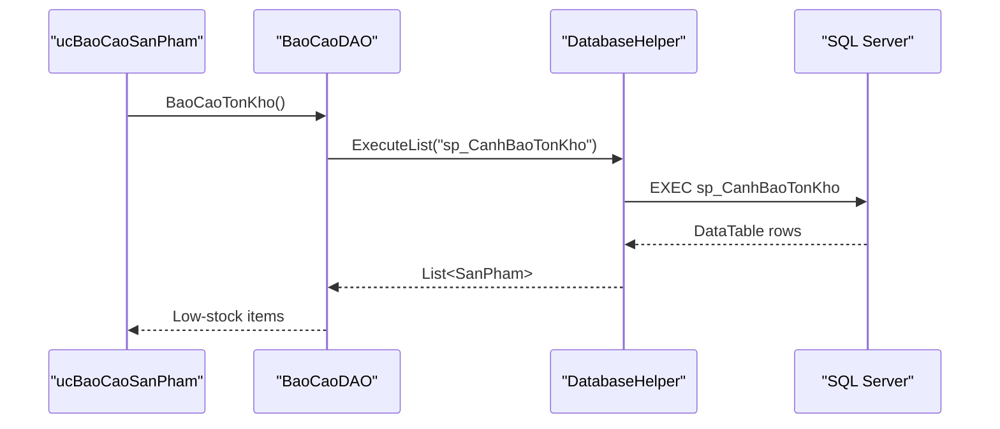
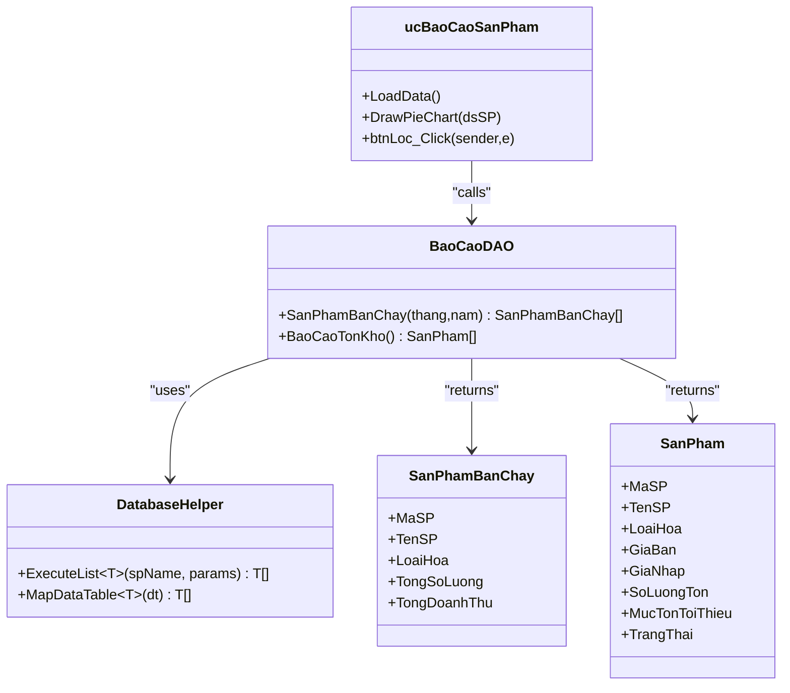
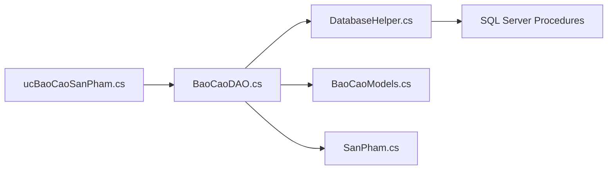

# Product Performance Reports

<cite>
**Referenced Files in This Document**
- [ucBaoCaoSanPham.cs](file://6_BaoCao\ucBaoCaoSanPham.cs)
- [ucBaoCaoSanPham.Designer.cs](file://6_BaoCao\ucBaoCaoSanPham.Designer.cs)
- [BaoCaoDAO.cs](file://DataAccess\BaoCaoDAO.cs)
- [SanPhamDAO.cs](file://DataAccess\SanPhamDAO.cs)
- [DatabaseHelper.cs](file://DataAccess\DatabaseHelper.cs)
- [BaoCaoModels.cs](file://Models\BaoCaoModels.cs)
- [SanPham.cs](file://Models\SanPham.cs)
- [FloriSys_Database.sql](file://FloriSys_Database.sql)
</cite>

## Table of Contents
1. [Introduction](#introduction)
2. [Project Structure](#project-structure)
3. [Core Components](#core-components)
4. [Architecture Overview](#architecture-overview)
5. [Detailed Component Analysis](#detailed-component-analysis)
6. [Dependency Analysis](#dependency-analysis)
7. [Performance Considerations](#performance-considerations)
8. [Troubleshooting Guide](#troubleshooting-guide)
9. [Conclusion](#conclusion)
10. [Appendices](#appendices)

## Introduction
This document explains the Product Performance Reports functionality within the FloriSys Reporting & Analytics Module. It focuses on how top-selling products are identified, how charts visualize contribution, and how the system integrates sales data with product catalogs. It also outlines the available KPIs (top-selling products, revenue contribution, slow-moving inventory) and highlights areas for future enhancements such as sales velocity, inventory turnover, profit margins, supplier performance, seasonal trends, filtering, and supply chain optimization.

## Project Structure
The Product Performance Reports feature is implemented as a Windows Forms user control that queries the database via a DAO layer and displays results in a grid with an optional pie chart. The data originates from stored procedures that aggregate sales transactions.

**Diagram sources**
- [ucBaoCaoSanPham.cs:18-124](file://6_BaoCao\ucBaoCaoSanPham.cs#L18-L124)
- [BaoCaoDAO.cs:28-49](file://DataAccess\BaoCaoDAO.cs#L28-L49)
- [DatabaseHelper.cs:19-52](file://DataAccess\DatabaseHelper.cs#L19-L52)
- [BaoCaoModels.cs:18-25](file://Models\BaoCaoModels.cs#L18-L25)
- [SanPham.cs:5-42](file://Models\SanPham.cs#L5-L42)
- [FloriSys_Database.sql:491-546](file://FloriSys_Database.sql#L491-L546)

**Section sources**
- [ucBaoCaoSanPham.cs:18-124](file://6_BaoCao\ucBaoCaoSanPham.cs#L18-L124)
- [BaoCaoDAO.cs:28-49](file://DataAccess\BaoCaoDAO.cs#L28-L49)
- [DatabaseHelper.cs:19-52](file://DataAccess\DatabaseHelper.cs#L19-L52)
- [BaoCaoModels.cs:18-25](file://Models\BaoCaoModels.cs#L18-L25)
- [SanPham.cs:5-42](file://Models\SanPham.cs#L5-L42)
- [FloriSys_Database.sql:491-546](file://FloriSys_Database.sql#L491-L546)

## Core Components
- Product Ranking Report: Displays top products by quantity sold within a selected month/year, with revenue contribution percentage.
- Data Access Layer: Provides strongly-typed queries for product rankings and stock alerts.
- UI Rendering: Binds data to a grid and draws a pie chart for top contributors.
- Models: Strongly typed DTOs for report data and product information.

Key capabilities present:
- Top-selling products by quantity (stored procedure aggregates sales).
- Revenue contribution percentage per product.
- Pie chart visualization of top contributors.
- Filtering by month and year.

Planned enhancements (not currently implemented):
- Sales velocity (units sold per time unit).
- Inventory turnover (COGS/average inventory).
- Profit margin calculation (revenue - cost).
- Supplier performance metrics.
- Seasonal trend analysis.
- Filtering by category, price range, and performance quartiles.
- Reorder point and supplier lead time integration.

**Section sources**
- [ucBaoCaoSanPham.cs:32-79](file://6_BaoCao\ucBaoCaoSanPham.cs#L32-L79)
- [BaoCaoDAO.cs:28-49](file://DataAccess\BaoCaoDAO.cs#L28-L49)
- [BaoCaoModels.cs:18-25](file://Models\BaoCaoModels.cs#L18-L25)

## Architecture Overview
The report follows a layered architecture:
- Presentation: Windows Forms user control renders filters, grid, and chart.
- Business Logic: DAO methods encapsulate query logic and parameterization.
- Data Access: Generic helpers map SQL results to strongly typed models.
- Database: Stored procedures aggregate sales and inventory data.

**Diagram sources**
- [ucBaoCaoSanPham.cs:32-79](file://6_BaoCao\ucBaoCaoSanPham.cs#L32-L79)
- [BaoCaoDAO.cs:28-35](file://DataAccess\BaoCaoDAO.cs#L28-L35)
- [DatabaseHelper.cs:19-23](file://DataAccess\DatabaseHelper.cs#L19-L23)
- [FloriSys_Database.sql:491-509](file://FloriSys_Database.sql#L491-L509)

## Detailed Component Analysis

### Product Ranking Report (Top-Selling Products)
- Purpose: Rank products by quantity sold within a given month/year.
- Data Source: Stored procedure aggregates sales from order details joined with orders and products.
- Output: Product ID, name, category, total quantity sold, and total revenue.
- UI Behavior: Grid shows results; a percentage column reflects each product’s revenue share; a pie chart highlights top contributors.

**Diagram sources**
- [ucBaoCaoSanPham.cs:32-79](file://6_BaoCao\ucBaoCaoSanPham.cs#L32-L79)
- [BaoCaoDAO.cs:28-35](file://DataAccess\BaoCaoDAO.cs#L28-L35)
- [DatabaseHelper.cs:19-23](file://DataAccess\DatabaseHelper.cs#L19-L23)
- [BaoCaoModels.cs:18-25](file://Models\BaoCaoModels.cs#L18-L25)
- [FloriSys_Database.sql:491-509](file://FloriSys_Database.sql#L491-L509)

**Section sources**
- [ucBaoCaoSanPham.cs:32-79](file://6_BaoCao\ucBaoCaoSanPham.cs#L32-L79)
- [BaoCaoDAO.cs:28-35](file://DataAccess\BaoCaoDAO.cs#L28-L35)
- [BaoCaoModels.cs:18-25](file://Models\BaoCaoModels.cs#L18-L25)
- [FloriSys_Database.sql:491-509](file://FloriSys_Database.sql#L491-L509)

### Inventory Alert Integration
- Purpose: Identify low-stock and out-of-stock items to complement product performance insights.
- Data Source: Stored procedure evaluates current stock against minimum thresholds.
- Output: Product, category, current stock, minimum threshold, and stock status.

**Diagram sources**
- [BaoCaoDAO.cs:46-49](file://DataAccess\BaoCaoDAO.cs#L46-L49)
- [DatabaseHelper.cs:19-23](file://DataAccess\DatabaseHelper.cs#L19-L23)
- [FloriSys_Database.sql:533-546](file://FloriSys_Database.sql#L533-L546)
- [SanPham.cs:5-42](file://Models\SanPham.cs#L5-L42)

**Section sources**
- [BaoCaoDAO.cs:46-49](file://DataAccess\BaoCaoDAO.cs#L46-L49)
- [DatabaseHelper.cs:19-23](file://DataAccess\DatabaseHelper.cs#L19-L23)
- [FloriSys_Database.sql:533-546](file://FloriSys_Database.sql#L533-L546)
- [SanPham.cs:5-42](file://Models\SanPham.cs#L5-L42)

### UI Controls and Rendering
- Filters: Month and year dropdowns with default selections.
- Grid: Displays product ranking with localized headers and formatted currency.
- Chart: Pie chart showing top contributors by revenue; dynamically created and anchored to the panel.

**Diagram sources**
- [ucBaoCaoSanPham.cs:18-124](file://6_BaoCao\ucBaoCaoSanPham.cs#L18-L124)
- [BaoCaoDAO.cs:28-49](file://DataAccess\BaoCaoDAO.cs#L28-L49)
- [DatabaseHelper.cs:19-89](file://DataAccess\DatabaseHelper.cs#L19-L89)
- [BaoCaoModels.cs:18-25](file://Models\BaoCaoModels.cs#L18-L25)
- [SanPham.cs:5-42](file://Models\SanPham.cs#L5-L42)

**Section sources**
- [ucBaoCaoSanPham.cs:18-124](file://6_BaoCao\ucBaoCaoSanPham.cs#L18-L124)
- [ucBaoCaoSanPham.Designer.cs:18-174](file://6_BaoCao\ucBaoCaoSanPham.Designer.cs#L18-L174)
- [BaoCaoDAO.cs:28-49](file://DataAccess\BaoCaoDAO.cs#L28-L49)
- [DatabaseHelper.cs:19-89](file://DataAccess\DatabaseHelper.cs#L19-L89)
- [BaoCaoModels.cs:18-25](file://Models\BaoCaoModels.cs#L18-L25)
- [SanPham.cs:5-42](file://Models\SanPham.cs#L5-L42)

## Dependency Analysis
- ucBaoCaoSanPham depends on BaoCaoDAO for retrieving product ranking and stock alert data.
- BaoCaoDAO depends on DatabaseHelper for executing stored procedures and mapping results.
- Stored procedures in the database define the aggregation logic for product sales and stock status.

**Diagram sources**
- [ucBaoCaoSanPham.cs:18-124](file://6_BaoCao\ucBaoCaoSanPham.cs#L18-L124)
- [BaoCaoDAO.cs:28-49](file://DataAccess\BaoCaoDAO.cs#L28-L49)
- [DatabaseHelper.cs:19-89](file://DataAccess\DatabaseHelper.cs#L19-L89)
- [BaoCaoModels.cs:18-25](file://Models\BaoCaoModels.cs#L18-L25)
- [SanPham.cs:5-42](file://Models\SanPham.cs#L5-L42)
- [FloriSys_Database.sql:491-546](file://FloriSys_Database.sql#L491-L546)

**Section sources**
- [ucBaoCaoSanPham.cs:18-124](file://6_BaoCao\ucBaoCaoSanPham.cs#L18-L124)
- [BaoCaoDAO.cs:28-49](file://DataAccess\BaoCaoDAO.cs#L28-L49)
- [DatabaseHelper.cs:19-89](file://DataAccess\DatabaseHelper.cs#L19-L89)
- [FloriSys_Database.sql:491-546](file://FloriSys_Database.sql#L491-L546)

## Performance Considerations
- Aggregation in stored procedures reduces client-side computation and network traffic.
- Parameterized queries prevent SQL injection and enable plan reuse.
- Consider adding indexes on order date and product ID to optimize joins and filtering.
- For large datasets, pagination or server-side sorting may improve responsiveness.

[No sources needed since this section provides general guidance]

## Troubleshooting Guide
- Empty or missing chart: Ensure the dataset contains positive revenue values and the chart is recreated on filter changes.
- Incorrect percentages: Verify total revenue calculation and division by zero handling.
- Stock alert discrepancies: Confirm stored procedure logic and product status filtering.

**Section sources**
- [ucBaoCaoSanPham.cs:75-79](file://6_BaoCao\ucBaoCaoSanPham.cs#L75-L79)
- [ucBaoCaoSanPham.cs:60-69](file://6_BaoCao\ucBaoCaoSanPham.cs#L60-L69)
- [FloriSys_Database.sql:533-546](file://FloriSys_Database.sql#L533-L546)

## Conclusion
The Product Performance Reports module currently delivers a focused view of top-selling products by quantity and revenue contribution, with integrated stock alerts. It provides a solid foundation for deeper analytics such as sales velocity, inventory turnover, profit margins, supplier performance, seasonal trends, and advanced filtering. Extending the stored procedures and UI controls will enable comprehensive product performance insights and support supply chain decision-making.

[No sources needed since this section summarizes without analyzing specific files]

## Appendices

### KPIs and Metrics Overview
- Top-selling products by quantity sold (implemented).
- Revenue contribution percentage (implemented).
- Slow-moving inventory (implemented via stock alerts).
- Planned: Sales velocity, inventory turnover, profit margins, supplier performance, seasonal trends, filtering, reorder point, supplier lead time.

[No sources needed since this section provides general guidance]