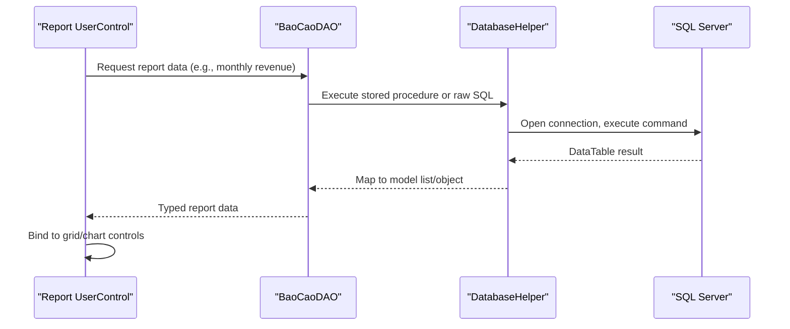
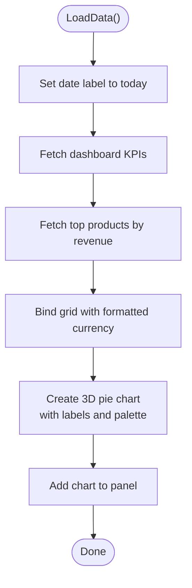
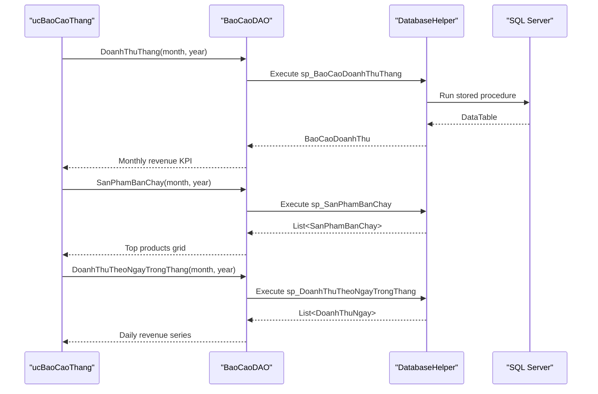
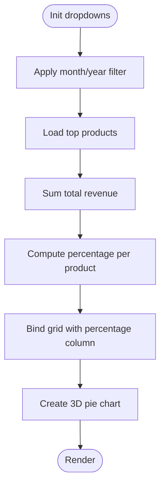
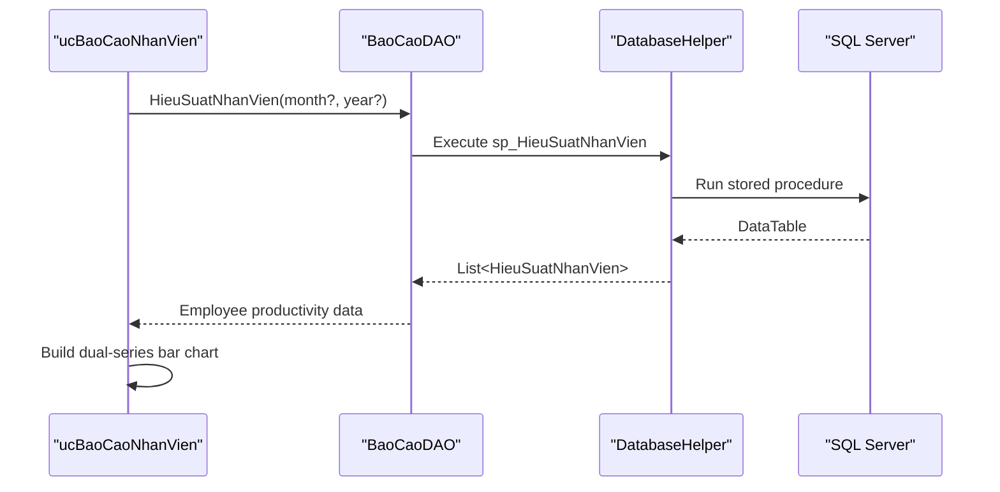
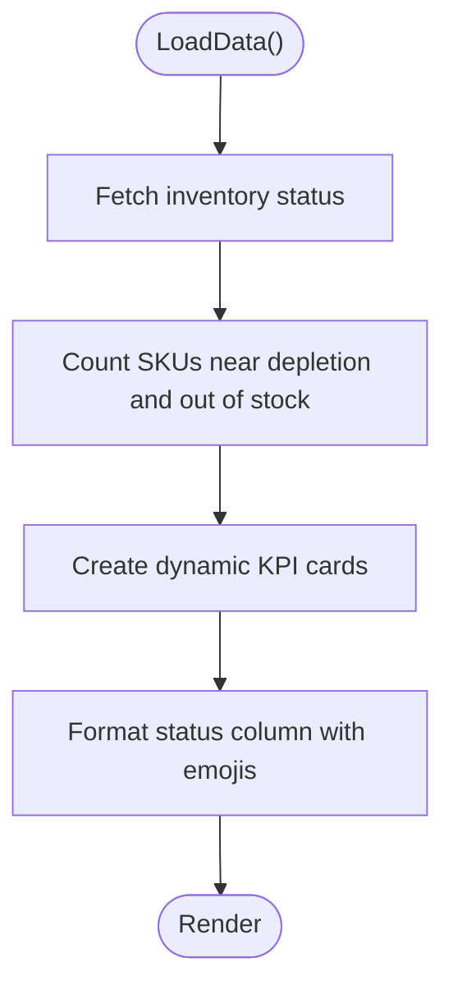
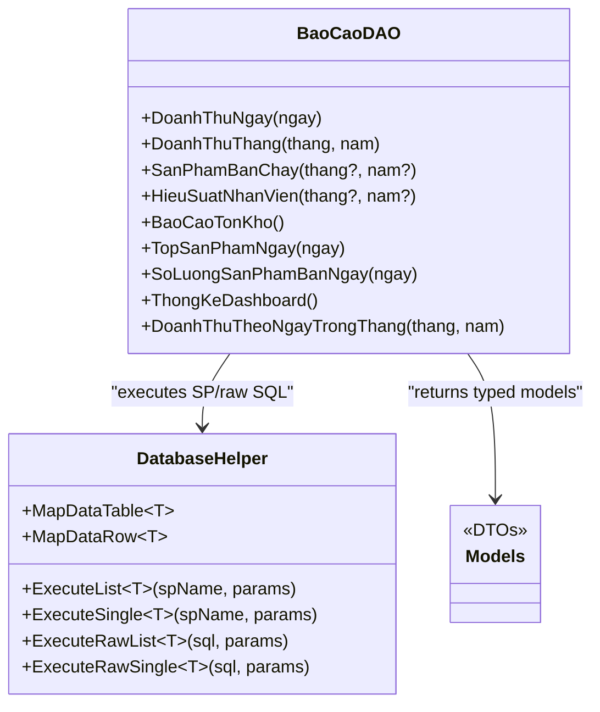
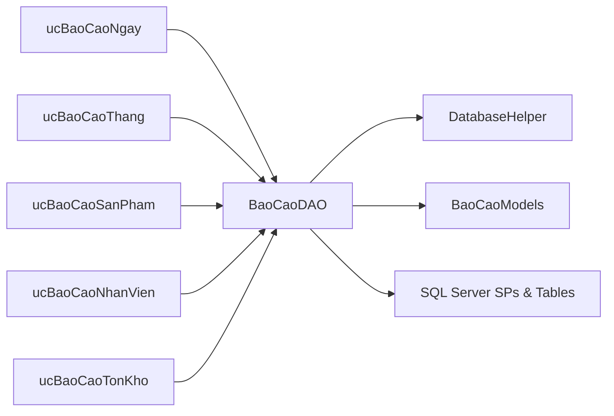
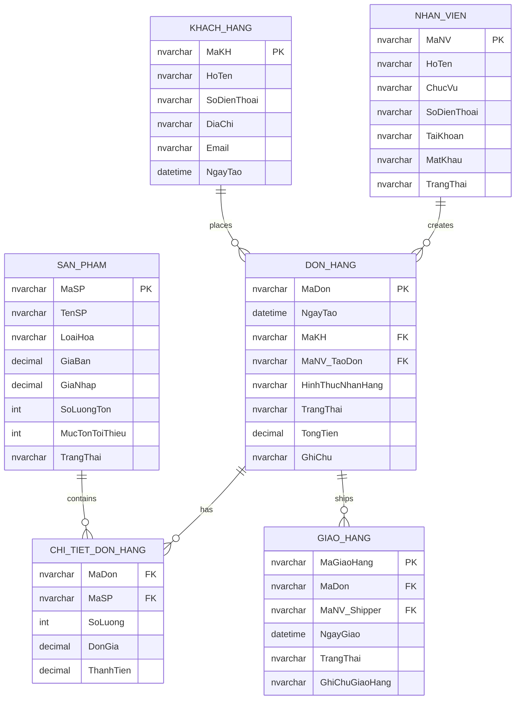

# Reporting & Analytics Module

<cite>
**Referenced Files in This Document**
- [ucBaoCao.cs](file://6_BaoCao/ucBaoCao.cs)
- [ucBaoCaoNgay.cs](file://6_BaoCao/ucBaoCaoNgay.cs)
- [ucBaoCaoThang.cs](file://6_BaoCao/ucBaoCaoThang.cs)
- [ucBaoCaoNhanVien.cs](file://6_BaoCao/ucBaoCaoNhanVien.cs)
- [ucBaoCaoSanPham.cs](file://6_BaoCao/ucBaoCaoSanPham.cs)
- [ucBaoCaoTonKho.cs](file://6_BaoCao/ucBaoCaoTonKho.cs)
- [BaoCaoDAO.cs](file://DataAccess/BaoCaoDAO.cs)
- [DatabaseHelper.cs](file://DataAccess/DatabaseHelper.cs)
- [BaoCaoModels.cs](file://Models/BaoCaoModels.cs)
- [FloriSys_Database.sql](file://FloriSys_Database.sql)
</cite>

## Table of Contents
1. [Introduction](#introduction)
2. [Project Structure](#project-structure)
3. [Core Components](#core-components)
4. [Architecture Overview](#architecture-overview)
5. [Detailed Component Analysis](#detailed-component-analysis)
6. [Dependency Analysis](#dependency-analysis)
7. [Performance Considerations](#performance-considerations)
8. [Troubleshooting Guide](#troubleshooting-guide)
9. [Conclusion](#conclusion)
10. [Appendices](#appendices)

## Introduction
This document describes the Reporting & Analytics Module of FloriSys, focusing on the complete reporting ecosystem. It covers daily sales summaries, monthly performance analysis, product performance tracking, employee productivity metrics, and inventory status reports. It also documents the report generation engine, data aggregation processes, visualization capabilities, integration with business data sources, and dashboard-style presentation. Guidance is included for interpreting KPIs, extracting business insights, and supporting decision-making.

## Project Structure
The reporting module is organized as a set of UserControls under the 6_BaoCao folder, each responsible for a specific report type. A central navigation UserControl orchestrates switching between reports. Data access is handled via a DAO layer that invokes SQL Server stored procedures and raw queries, mapped to strongly-typed models. Charts are rendered using Windows Forms.DataVisualization.

```mermaid
graph TB
subgraph "Reporting UI Layer"
UCRoot["ucBaoCao<br/>Navigation"]
UCDaily["ucBaoCaoNgay<br/>Daily Sales Summary"]
UCMonthly["ucBaoCaoThang<br/>Monthly Performance"]
UCProduct["ucBaoCaoSanPham<br/>Product Performance"]
UCStaff["ucBaoCaoNhanVien<br/>Employee Productivity"]
UCKPI["ucBaoCaoTonKho<br/>Inventory Status"]
end
subgraph "Data Access Layer"
DAO["BaoCaoDAO<br/>Stored Procedures & Queries"]
DBH["DatabaseHelper<br/>ADO.NET + Mapping"]
DB["SQL Server<br/>Stored Procedures + Tables"]
end
subgraph "Models"
Models["BaoCaoModels<br/>DTOs for Reports"]
end
UCRoot --> UCDaily
UCRoot --> UCMonthly
UCRoot --> UCProduct
UCRoot --> UCStaff
UCRoot --> UCKPI
UCDaily --> DAO
UCMonthly --> DAO
UCProduct --> DAO
UCStaff --> DAO
UCKPI --> DAO
DAO --> DBH
DBH --> DB
DAO --> Models
```

**Diagram sources**
- [ucBaoCao.cs:14-55](file://6_BaoCao/ucBaoCao.cs#L14-L55)
- [ucBaoCaoNgay.cs:18-97](file://6_BaoCao/ucBaoCaoNgay.cs#L18-L97)
- [ucBaoCaoThang.cs:23-75](file://6_BaoCao/ucBaoCaoThang.cs#L23-L75)
- [ucBaoCaoSanPham.cs:32-79](file://6_BaoCao/ucBaoCaoSanPham.cs#L32-L79)
- [ucBaoCaoNhanVien.cs:29-53](file://6_BaoCao/ucBaoCaoNhanVien.cs#L29-L53)
- [ucBaoCaoTonKho.cs:22-63](file://6_BaoCao/ucBaoCaoTonKho.cs#L22-L63)
- [BaoCaoDAO.cs:11-164](file://DataAccess/BaoCaoDAO.cs#L11-L164)
- [DatabaseHelper.cs:19-52](file://DataAccess/DatabaseHelper.cs#L19-L52)
- [BaoCaoModels.cs:8-131](file://Models/BaoCaoModels.cs#L8-L131)
- [FloriSys_Database.sql:463-701](file://FloriSys_Database.sql#L463-L701)

**Section sources**
- [ucBaoCao.cs:14-55](file://6_BaoCao/ucBaoCao.cs#L14-L55)
- [BaoCaoDAO.cs:11-164](file://DataAccess/BaoCaoDAO.cs#L11-L164)
- [DatabaseHelper.cs:19-52](file://DataAccess/DatabaseHelper.cs#L19-L52)
- [BaoCaoModels.cs:8-131](file://Models/BaoCaoModels.cs#L8-L131)
- [FloriSys_Database.sql:463-701](file://FloriSys_Database.sql#L463-L701)

## Core Components
- Navigation and container: ucBaoCao manages report switching and highlights the active report tab.
- Daily Sales Summary: ucBaoCaoNgay loads KPIs (orders and revenue for today), quantity of products sold, top products by revenue, and renders a 3D pie chart.
- Monthly Performance: ucBaoCaoThang computes monthly revenue, month-over-month change, top products, and a daily revenue column chart for the selected month.
- Product Performance: ucBaoCaoSanPham lists top products, adds a calculated percentage column, and displays a 3D pie chart of top contributors.
- Employee Productivity: ucBaoCaoNhanVien filters by month/year, shows orders and revenue per cashier, and renders a dual-series bar chart.
- Inventory Status: ucBaoCaoTonKho shows stock levels, minimum thresholds, status indicators, and dynamic KPI cards for “About to Deplete” and “Out of Stock.”

Key data access patterns:
- Stored procedures encapsulate report logic (daily/monthly totals, top performers, inventory warnings).
- Raw SQL is used for dashboard-wide aggregations and ad-hoc queries.
- DatabaseHelper provides generic mapping from DataTable to typed lists/objects.

**Section sources**
- [ucBaoCao.cs:14-55](file://6_BaoCao/ucBaoCao.cs#L14-L55)
- [ucBaoCaoNgay.cs:23-97](file://6_BaoCao/ucBaoCaoNgay.cs#L23-L97)
- [ucBaoCaoThang.cs:23-75](file://6_BaoCao/ucBaoCaoThang.cs#L23-L75)
- [ucBaoCaoSanPham.cs:32-79](file://6_BaoCao/ucBaoCaoSanPham.cs#L32-L79)
- [ucBaoCaoNhanVien.cs:29-53](file://6_BaoCao/ucBaoCaoNhanVien.cs#L29-L53)
- [ucBaoCaoTonKho.cs:22-63](file://6_BaoCao/ucBaoCaoTonKho.cs#L22-L63)
- [BaoCaoDAO.cs:11-164](file://DataAccess/BaoCaoDAO.cs#L11-L164)
- [DatabaseHelper.cs:19-52](file://DataAccess/DatabaseHelper.cs#L19-L52)

## Architecture Overview
The reporting architecture follows a layered pattern:
- Presentation: WinForms UserControls render report UI and charts.
- Business Logic: DAO methods select appropriate stored procedures or raw SQL based on report needs.
- Data Access: DatabaseHelper executes commands and maps results to models.
- Data Sources: SQL Server tables and stored procedures provide aggregated and computed metrics.



**Diagram sources**
- [ucBaoCaoNgay.cs:31-36](file://6_BaoCao/ucBaoCaoNgay.cs#L31-L36)
- [ucBaoCaoThang.cs:32-36](file://6_BaoCao/ucBaoCaoThang.cs#L32-L36)
- [ucBaoCaoSanPham.cs:39-47](file://6_BaoCao/ucBaoCaoSanPham.cs#L39-L47)
- [ucBaoCaoNhanVien.cs:35-44](file://6_BaoCao/ucBaoCaoNhanVien.cs#L35-L44)
- [ucBaoCaoTonKho.cs:26-37](file://6_BaoCao/ucBaoCaoTonKho.cs#L26-L37)
- [BaoCaoDAO.cs:11-164](file://DataAccess/BaoCaoDAO.cs#L11-L164)
- [DatabaseHelper.cs:104-142](file://DataAccess/DatabaseHelper.cs#L104-L142)

## Detailed Component Analysis

### Daily Sales Summary (ucBaoCaoNgay)
Responsibilities:
- Load today’s date label.
- Retrieve dashboard KPIs (orders and revenue for the day).
- Compute total products sold for the day.
- Fetch top products by revenue and bind to a grid.
- Render a 3D pie chart of top product revenue contributions.

Processing logic:
- Calls BaoCaoDAO for dashboard stats and top products.
- Builds a Chart with Series and Titles, applies 3D effects and exploded segments for top items.
- Uses localized number formatting for currency.



**Diagram sources**
- [ucBaoCaoNgay.cs:23-97](file://6_BaoCao/ucBaoCaoNgay.cs#L23-L97)
- [BaoCaoDAO.cs:31-36](file://DataAccess/BaoCaoDAO.cs#L31-L36)
- [BaoCaoDAO.cs:51-60](file://DataAccess/BaoCaoDAO.cs#L51-L60)

**Section sources**
- [ucBaoCaoNgay.cs:23-97](file://6_BaoCao/ucBaoCaoNgay.cs#L23-L97)
- [BaoCaoModels.cs:8-52](file://Models/BaoCaoModels.cs#L8-L52)
- [BaoCaoDAO.cs:72-83](file://DataAccess/BaoCaoDAO.cs#L72-L83)

### Monthly Performance Analysis (ucBaoCaoThang)
Responsibilities:
- Display current month/year header.
- Compute monthly revenue and compare with previous month.
- Show top products for the month.
- Plot daily revenue across the selected month using a column chart.

Processing logic:
- Calls BaoCaoDAO for monthly totals and daily revenue series.
- Calculates MoM variance and updates label color based on trend.
- Renders a column chart with axis titles and scaled colors.



**Diagram sources**
- [ucBaoCaoThang.cs:23-75](file://6_BaoCao/ucBaoCaoThang.cs#L23-L75)
- [BaoCaoDAO.cs:19-26](file://DataAccess/BaoCaoDAO.cs#L19-L26)
- [BaoCaoDAO.cs:28-35](file://DataAccess/BaoCaoDAO.cs#L28-L35)
- [BaoCaoDAO.cs:157-164](file://DataAccess/BaoCaoDAO.cs#L157-L164)
- [FloriSys_Database.sql:477-488](file://FloriSys_Database.sql#L477-L488)
- [FloriSys_Database.sql:491-510](file://FloriSys_Database.sql#L491-L510)
- [FloriSys_Database.sql:675-701](file://FloriSys_Database.sql#L675-L701)

**Section sources**
- [ucBaoCaoThang.cs:23-75](file://6_BaoCao/ucBaoCaoThang.cs#L23-L75)
- [BaoCaoModels.cs:108-116](file://Models/BaoCaoModels.cs#L108-L116)
- [BaoCaoDAO.cs:19-26](file://DataAccess/BaoCaoDAO.cs#L19-L26)
- [BaoCaoDAO.cs:28-35](file://DataAccess/BaoCaoDAO.cs#L28-L35)
- [BaoCaoDAO.cs:157-164](file://DataAccess/BaoCaoDAO.cs#L157-L164)
- [FloriSys_Database.sql:477-488](file://FloriSys_Database.sql#L477-L488)
- [FloriSys_Database.sql:491-510](file://FloriSys_Database.sql#L491-L510)
- [FloriSys_Database.sql:675-701](file://FloriSys_Database.sql#L675-L701)

### Product Performance Tracking (ucBaoCaoSanPham)
Responsibilities:
- Allow filtering by month and year.
- Display top products by quantity sold.
- Add a calculated percentage column representing each product’s share of total revenue.
- Render a 3D pie chart of top contributors.

Processing logic:
- Loads dropdowns with selectable month/year.
- Computes total revenue across top products and sets percentage cells.
- Builds a pie chart with exploded top segment and Pastel palette.



**Diagram sources**
- [ucBaoCaoSanPham.cs:18-79](file://6_BaoCao/ucBaoCaoSanPham.cs#L18-L79)
- [ucBaoCaoSanPham.cs:81-124](file://6_BaoCao/ucBaoCaoSanPham.cs#L81-L124)

**Section sources**
- [ucBaoCaoSanPham.cs:18-79](file://6_BaoCao/ucBaoCaoSanPham.cs#L18-L79)
- [ucBaoCaoSanPham.cs:81-124](file://6_BaoCao/ucBaoCaoSanPham.cs#L81-L124)
- [BaoCaoModels.cs:18-25](file://Models/BaoCaoModels.cs#L18-L25)
- [BaoCaoDAO.cs:28-35](file://DataAccess/BaoCaoDAO.cs#L28-L35)

### Employee Productivity Metrics (ucBaoCaoNhanVien)
Responsibilities:
- Filter by month and year.
- Display cashiers’ order counts and total revenue.
- Render a dual-series bar chart comparing revenue and order volume.

Processing logic:
- Populates month/year dropdowns and loads HieuSuatNhanVien results.
- Creates two series (revenue and scaled orders) with distinct colors and legends.
- Scales order counts for visibility on the same chart.



**Diagram sources**
- [ucBaoCaoNhanVien.cs:29-53](file://6_BaoCao/ucBaoCaoNhanVien.cs#L29-L53)
- [BaoCaoDAO.cs:37-44](file://DataAccess/BaoCaoDAO.cs#L37-L44)
- [FloriSys_Database.sql:512-530](file://FloriSys_Database.sql#L512-L530)

**Section sources**
- [ucBaoCaoNhanVien.cs:29-53](file://6_BaoCao/ucBaoCaoNhanVien.cs#L29-L53)
- [ucBaoCaoNhanVien.cs:55-114](file://6_BaoCao/ucBaoCaoNhanVien.cs#L55-L114)
- [BaoCaoModels.cs:28-38](file://Models/BaoCaoModels.cs#L28-L38)
- [BaoCaoDAO.cs:37-44](file://DataAccess/BaoCaoDAO.cs#L37-L44)
- [FloriSys_Database.sql:512-530](file://FloriSys_Database.sql#L512-L530)

### Inventory Status Reports (ucBaoCaoTonKho)
Responsibilities:
- Display current inventory levels and minimum thresholds.
- Compute and show KPIs: total SKUs monitored, nearing depletion, out of stock.
- Color-code status indicators and present dynamic KPI panels.

Processing logic:
- Calls BaoCaoDAO to fetch inventory status via sp_CanhBaoTonKho.
- Iterates rows to compute counts and dynamically creates KPI cards.
- Applies cell formatting to show emoji/status text.



**Diagram sources**
- [ucBaoCaoTonKho.cs:22-63](file://6_BaoCao/ucBaoCaoTonKho.cs#L22-L63)
- [ucBaoCaoTonKho.cs:65-101](file://6_BaoCao/ucBaoCaoTonKho.cs#L65-L101)
- [ucBaoCaoTonKho.cs:128-150](file://6_BaoCao/ucBaoCaoTonKho.cs#L128-L150)

**Section sources**
- [ucBaoCaoTonKho.cs:22-63](file://6_BaoCao/ucBaoCaoTonKho.cs#L22-L63)
- [ucBaoCaoTonKho.cs:65-101](file://6_BaoCao/ucBaoCaoTonKho.cs#L65-L101)
- [ucBaoCaoTonKho.cs:128-150](file://6_BaoCao/ucBaoCaoTonKho.cs#L128-L150)
- [BaoCaoModels.cs:4-13](file://Models/BaoCaoModels.cs#L4-L13)
- [BaoCaoDAO.cs:46-49](file://DataAccess/BaoCaoDAO.cs#L46-L49)
- [FloriSys_Database.sql:533-546](file://FloriSys_Database.sql#L533-L546)

### Report Generation Engine and Data Aggregation
- Stored procedures encapsulate report computations:
  - sp_BaoCaoDoanhThuNgay, sp_BaoCaoDoanhThuThang for revenue KPIs.
  - sp_SanPhamBanChay for top products.
  - sp_HieuSuatNhanVien for employee productivity.
  - sp_CanhBaoTonKho for inventory status.
  - sp_DoanhThuTheoNgayTrongThang for daily series in monthly chart.
- Raw SQL is used for dashboard-wide aggregations (e.g., ThongKeDashboard) and time-series generation (7-day revenue).
- DatabaseHelper provides:
  - Generic ExecuteList/ExecuteSingle helpers for SPs and raw SQL.
  - Reflection-based mapping from DataTable to strongly-typed models.
  - Connection management and parameterized execution.



**Diagram sources**
- [BaoCaoDAO.cs:11-164](file://DataAccess/BaoCaoDAO.cs#L11-L164)
- [DatabaseHelper.cs:19-52](file://DataAccess/DatabaseHelper.cs#L19-L52)
- [BaoCaoModels.cs:8-131](file://Models/BaoCaoModels.cs#L8-L131)

**Section sources**
- [BaoCaoDAO.cs:11-164](file://DataAccess/BaoCaoDAO.cs#L11-L164)
- [DatabaseHelper.cs:19-52](file://DataAccess/DatabaseHelper.cs#L19-L52)
- [BaoCaoModels.cs:8-131](file://Models/BaoCaoModels.cs#L8-L131)
- [FloriSys_Database.sql:463-701](file://FloriSys_Database.sql#L463-L701)

### Visualization Capabilities
- Charts are built programmatically using System.Windows.Forms.DataVisualization.Charting:
  - 3D Pie charts for top product revenue and inventory distribution.
  - Column charts for daily revenue trends.
  - Bar charts for employee productivity comparisons.
- Formatting includes:
  - Axis titles and fonts.
  - Value formatting (currency, percentages).
  - Color palettes and exploded segments for emphasis.
  - Legends and titles for clarity.

**Section sources**
- [ucBaoCaoNgay.cs:52-91](file://6_BaoCao/ucBaoCaoNgay.cs#L52-L91)
- [ucBaoCaoThang.cs:77-125](file://6_BaoCao/ucBaoCaoThang.cs#L77-L125)
- [ucBaoCaoSanPham.cs:81-124](file://6_BaoCao/ucBaoCaoSanPham.cs#L81-L124)
- [ucBaoCaoNhanVien.cs:55-114](file://6_BaoCao/ucBaoCaoNhanVien.cs#L55-L114)
- [ucBaoCaoTonKho.cs:128-150](file://6_BaoCao/ucBaoCaoTonKho.cs#L128-L150)

### Integration with Business Data Sources
- Tables involved:
  - DON_HANG, CHI_TIET_DON_HANG for sales and revenue.
  - SAN_PHAM for inventory and thresholds.
  - NHAN_VIEN for employee metrics.
  - GIAO_HANG for delivery-related KPIs.
- Stored procedures and raw SQL join and aggregate across these tables to produce report-ready datasets.

**Section sources**
- [FloriSys_Database.sql:46-101](file://FloriSys_Database.sql#L46-L101)
- [FloriSys_Database.sql:463-701](file://FloriSys_Database.sql#L463-L701)

### Automated Report Scheduling and Executive Dashboards
- Current implementation loads default report on startup and supports manual refresh via filter controls.
- No built-in scheduler is present in the analyzed code. To support automation:
  - Introduce a scheduled job (e.g., Windows Task Scheduler or SQL Agent) to periodically execute relevant stored procedures and persist summary tables.
  - Extend the UI to load precomputed summaries for faster rendering.
  - Add export capabilities (PDF/Excel) to support automated distribution.

[No sources needed since this section provides general guidance]

### Customizable Report Templates, Drill-Down, and Export
- Customizable templates:
  - Charts are constructed programmatically; changing fonts, colors, and series types is straightforward.
  - Grid columns can be reconfigured for different KPIs.
- Drill-down:
  - Filtering by month/year enables temporal drill-down.
  - Top lists can be extended to include subcategories or SKUs.
- Export:
  - Consider integrating export libraries to PDF/Excel for automated distribution and archival.

[No sources needed since this section provides general guidance]

### Key Performance Indicators (KPIs), Trend Analysis, and Forecasting
- KPIs:
  - Daily: orders today, revenue today, products sold today, top products by revenue.
  - Monthly: total orders, total revenue, MoM variance, top products by quantity.
  - Employees: orders created, total revenue, canceled orders.
  - Inventory: total SKUs monitored, nearing depletion, out of stock.
- Trend analysis:
  - Monthly daily revenue series for trend visualization.
  - 7-day revenue series for short-term trend monitoring.
- Forecasting:
  - No forecasting logic is implemented in the analyzed code. Consider adding moving averages or seasonal decomposition for basic forecasting.

**Section sources**
- [ucBaoCaoNgay.cs:30-36](file://6_BaoCao/ucBaoCaoNgay.cs#L30-L36)
- [ucBaoCaoThang.cs:38-55](file://6_BaoCao/ucBaoCaoThang.cs#L38-L55)
- [ucBaoCaoNhanVien.cs:35-44](file://6_BaoCao/ucBaoCaoNhanVien.cs#L35-L44)
- [ucBaoCaoTonKho.cs:40-50](file://6_BaoCao/ucBaoCaoTonKho.cs#L40-L50)
- [BaoCaoDAO.cs:140-155](file://DataAccess/BaoCaoDAO.cs#L140-L155)

### Report Interpretation, Business Insights, and Decision Support
- Daily Sales Summary:
  - Focus on top revenue-generating products to optimize promotions and restocking.
  - Monitor product quantity sold to assess demand patterns.
- Monthly Performance:
  - Use MoM variance to identify growth or decline drivers.
  - Review top products to align procurement and marketing efforts.
- Employee Productivity:
  - Compare revenue and order volumes to evaluate team performance and training needs.
- Inventory Status:
  - Track “nearing depletion” and “out of stock” counts to prevent stockouts and reduce carrying costs.

[No sources needed since this section provides general guidance]

## Dependency Analysis
The reporting module exhibits clean separation of concerns:
- UI UserControls depend on BaoCaoDAO for data retrieval.
- BaoCaoDAO depends on DatabaseHelper for execution and mapping.
- DatabaseHelper encapsulates ADO.NET and reflection-based mapping.
- Stored procedures and tables define the canonical data model.



**Diagram sources**
- [ucBaoCao.cs:20-35](file://6_BaoCao/ucBaoCao.cs#L20-L35)
- [BaoCaoDAO.cs:11-164](file://DataAccess/BaoCaoDAO.cs#L11-L164)
- [DatabaseHelper.cs:19-52](file://DataAccess/DatabaseHelper.cs#L19-L52)
- [BaoCaoModels.cs:8-131](file://Models/BaoCaoModels.cs#L8-L131)
- [FloriSys_Database.sql:463-701](file://FloriSys_Database.sql#L463-L701)

**Section sources**
- [ucBaoCao.cs:20-35](file://6_BaoCao/ucBaoCao.cs#L20-L35)
- [BaoCaoDAO.cs:11-164](file://DataAccess/BaoCaoDAO.cs#L11-L164)
- [DatabaseHelper.cs:19-52](file://DataAccess/DatabaseHelper.cs#L19-L52)
- [BaoCaoModels.cs:8-131](file://Models/BaoCaoModels.cs#L8-L131)
- [FloriSys_Database.sql:463-701](file://FloriSys_Database.sql#L463-L701)

## Performance Considerations
- Stored procedures handle heavy lifting; ensure appropriate indexing on date and foreign keys for fast joins.
- Use parameterized queries to avoid SQL injection and enable plan reuse.
- Consider caching frequently accessed KPIs for dashboard-like pages to reduce database load.
- For large datasets, paginate grids and limit chart points to improve responsiveness.

[No sources needed since this section provides general guidance]

## Troubleshooting Guide
Common issues and resolutions:
- Data binding errors:
  - Verify column names match model properties and grid headers are set after data binding.
- Empty or missing charts:
  - Ensure series points are added only when values are greater than zero.
- Formatting exceptions:
  - Confirm currency formatting is applied only when columns exist.
- Database connectivity:
  - Check connection string in configuration and ensure SQL Server is reachable.

**Section sources**
- [ucBaoCaoNgay.cs:44-50](file://6_BaoCao/ucBaoCaoNgay.cs#L44-L50)
- [ucBaoCaoThang.cs:107-112](file://6_BaoCao/ucBaoCaoThang.cs#L107-L112)
- [ucBaoCaoSanPham.cs:64-69](file://6_BaoCao/ucBaoCaoSanPham.cs#L64-L69)
- [ucBaoCaoTonKho.cs:56-58](file://6_BaoCao/ucBaoCaoTonKho.cs#L56-L58)
- [DatabaseHelper.cs:91-97](file://DataAccess/DatabaseHelper.cs#L91-L97)

## Conclusion
The Reporting & Analytics Module delivers a robust, layered reporting solution with clear UI components, strong data access patterns, and rich visualizations. It supports daily and monthly sales summaries, product performance, employee productivity, and inventory status. With minor enhancements—such as automated scheduling, export capabilities, and forecasting—this module can evolve into a comprehensive decision-support platform.

## Appendices
- Data Model Overview



**Diagram sources**
- [FloriSys_Database.sql:47-101](file://FloriSys_Database.sql#L47-L101)