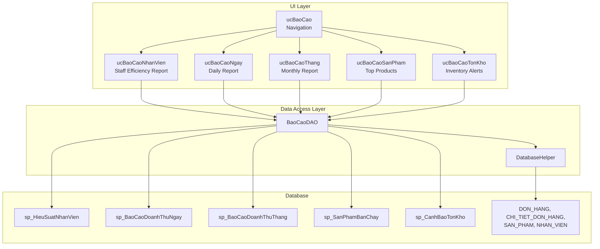
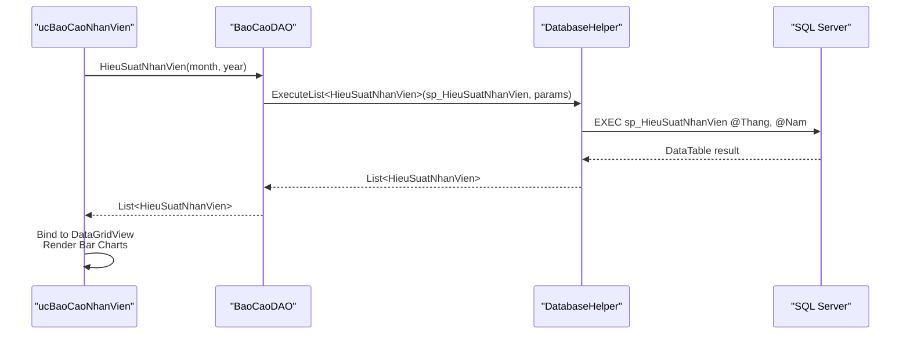
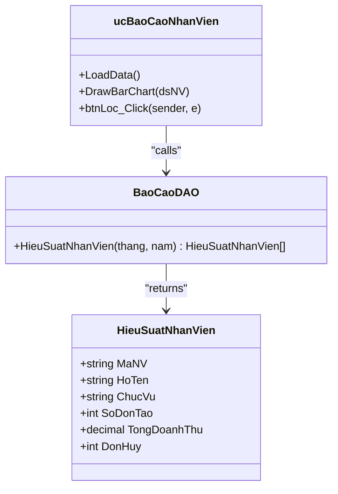
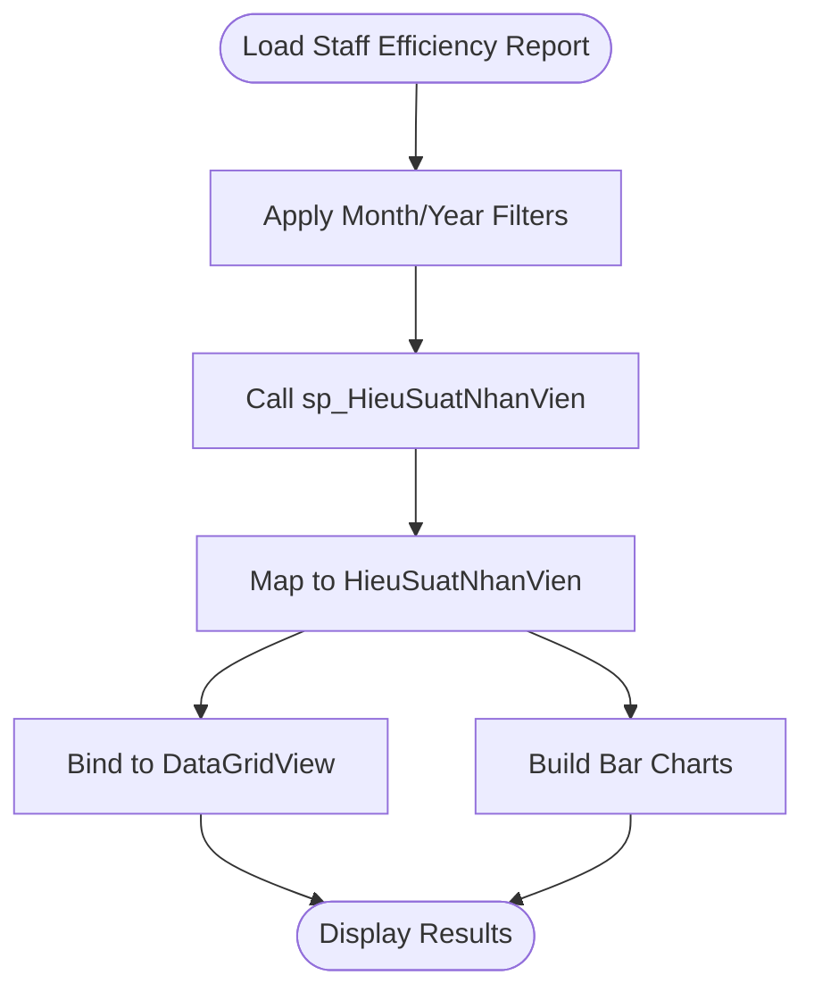
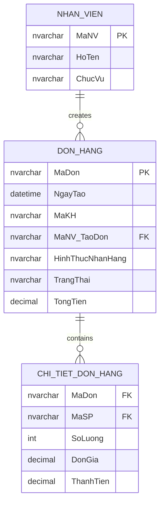
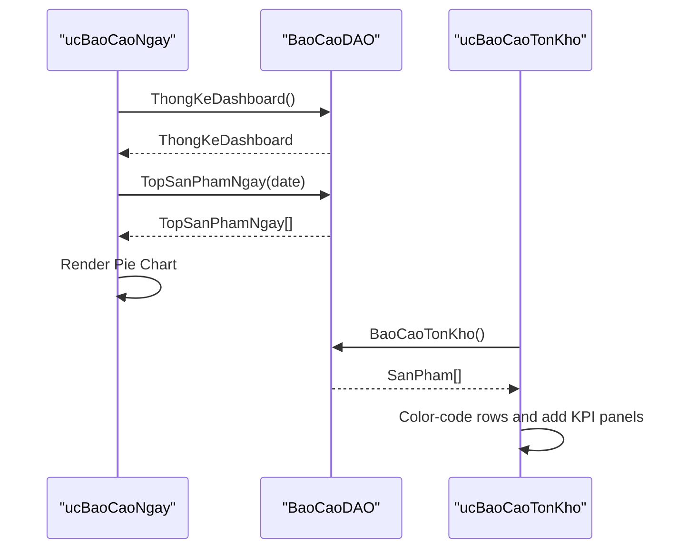
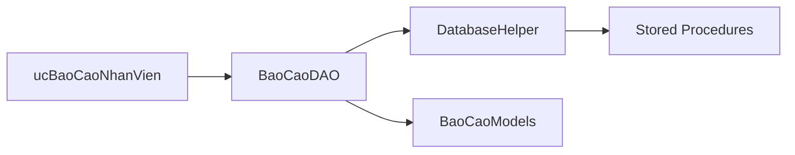

# Staff Efficiency Reports

<cite>
**Referenced Files in This Document**
- [ucBaoCaoNhanVien.cs](file://6_BaoCao/ucBaoCaoNhanVien.cs)
- [ucBaoCaoNhanVien.Designer.cs](file://6_BaoCao/ucBaoCaoNhanVien.Designer.cs)
- [ucBaoCao.cs](file://6_BaoCao/ucBaoCao.cs)
- [ucBaoCao.Designer.cs](file://6_BaoCao/ucBaoCao.Designer.cs)
- [BaoCaoDAO.cs](file://DataAccess/BaoCaoDAO.cs)
- [DatabaseHelper.cs](file://DataAccess/DatabaseHelper.cs)
- [BaoCaoModels.cs](file://Models/BaoCaoModels.cs)
- [FloriSys_Database.sql](file://FloriSys_Database.sql)
- [ucBaoCaoNgay.cs](file://6_BaoCao/ucBaoCaoNgay.cs)
- [ucBaoCaoNgay.Designer.cs](file://6_BaoCao/ucBaoCaoNgay.Designer.cs)
- [ucBaoCaoThang.cs](file://6_BaoCao/ucBaoCaoThang.cs)
- [ucBaoCaoSanPham.cs](file://6_BaoCao/ucBaoCaoSanPham.cs)
- [ucBaoCaoTonKho.cs](file://6_BaoCao/ucBaoCaoTonKho.cs)
</cite>

## Table of Contents
1. [Introduction](#introduction)
2. [Project Structure](#project-structure)
3. [Core Components](#core-components)
4. [Architecture Overview](#architecture-overview)
5. [Detailed Component Analysis](#detailed-component-analysis)
6. [Dependency Analysis](#dependency-analysis)
7. [Performance Considerations](#performance-considerations)
8. [Troubleshooting Guide](#troubleshooting-guide)
9. [Conclusion](#conclusion)
10. [Appendices](#appendices)

## Introduction
This document explains the Staff Efficiency Reports functionality within the FloriSys Reporting & Analytics Module. It focuses on employee performance metrics, sales productivity calculations, and service quality measurements derived from sales transactions, customer interactions, and operational activities. The reports cover:
- Individual employee performance ranking by order creation count and total revenue
- Sales productivity KPIs such as orders created, total revenue, and canceled orders
- Team performance analysis and role-based comparisons
- Integration points with sales data and dashboards
- Performance dashboard components, trend analysis, and coaching opportunities
- Guidance for performance improvement strategies, talent development planning, and workforce optimization

## Project Structure
The Staff Efficiency Reports feature is implemented as part of the reporting module with a user control-based UI and a DAO-layer that interacts with SQL Server stored procedures. The key components are:
- Reporting container and navigation: ucBaoCao and ucBaoCao.Designer
- Staff efficiency report: ucBaoCaoNhanVien and ucBaoCaoNhanVien.Designer
- Supporting report components: ucBaoCaoNgay, ucBaoCaoThang, ucBaoCaoSanPham, ucBaoCaoTonKho
- Data access layer: BaoCaoDAO and DatabaseHelper
- Data models: BaoCaoModels
- Database schema and stored procedures: FloriSys_Database.sql

**Diagram sources**
- [ucBaoCao.cs:14-55](file://6_BaoCao/ucBaoCao.cs#L14-L55)
- [ucBaoCaoNhanVien.cs:29-53](file://6_BaoCao/ucBaoCaoNhanVien.cs#L29-L53)
- [BaoCaoDAO.cs:37-44](file://DataAccess/BaoCaoDAO.cs#L37-L44)
- [FloriSys_Database.sql:512-531](file://FloriSys_Database.sql#L512-L531)

**Section sources**
- [ucBaoCao.Designer.cs:18-139](file://6_BaoCao/ucBaoCao.Designer.cs#L18-L139)
- [ucBaoCaoNhanVien.Designer.cs:18-174](file://6_BaoCao/ucBaoCaoNhanVien.Designer.cs#L18-L174)

## Core Components
- Staff Efficiency Report (ucBaoCaoNhanVien): Displays monthly employee performance, including order creation count, total revenue, and canceled orders. It renders a bar chart comparing revenue and order counts for top employees.
- Data Access (BaoCaoDAO): Provides methods to query stored procedures for staff efficiency, daily/monthly revenue, top products, inventory alerts, and dashboard statistics.
- Models (BaoCaoModels): Defines strongly typed data contracts for report results such as HieuSuatNhanVien, BaoCaoDoanhThu, TopSanPhamNgay, DoanhThuNgay, etc.
- Database Procedures: sp_HieuSuatNhanVien aggregates employee performance filtered by month/year and role (Cashier).

Key responsibilities:
- Aggregate sales transactions to compute employee productivity metrics
- Filter by time periods (day, month) for trend analysis
- Render charts and tables for performance visualization
- Provide KPIs for team and individual performance comparisons

**Section sources**
- [ucBaoCaoNhanVien.cs:18-114](file://6_BaoCao/ucBaoCaoNhanVien.cs#L18-L114)
- [BaoCaoDAO.cs:37-44](file://DataAccess/BaoCaoDAO.cs#L37-L44)
- [BaoCaoModels.cs:27-38](file://Models/BaoCaoModels.cs#L27-L38)
- [FloriSys_Database.sql:512-531](file://FloriSys_Database.sql#L512-L531)

## Architecture Overview
The Staff Efficiency Reports follow a layered architecture:
- UI Layer: Windows Forms user controls encapsulate presentation logic and chart rendering
- Business Logic: BaoCaoDAO exposes typed methods for report data retrieval
- Data Access: DatabaseHelper executes stored procedures and raw SQL, mapping results to models
- Database: SQL Server stores transactional data and exposes stored procedures for analytics

**Diagram sources**
- [ucBaoCaoNhanVien.cs:35-47](file://6_BaoCao/ucBaoCaoNhanVien.cs#L35-L47)
- [BaoCaoDAO.cs:37-44](file://DataAccess/BaoCaoDAO.cs#L37-L44)
- [DatabaseHelper.cs:19-23](file://DataAccess/DatabaseHelper.cs#L19-L23)
- [FloriSys_Database.sql:512-531](file://FloriSys_Database.sql#L512-L531)

## Detailed Component Analysis

### Staff Efficiency Report (ucBaoCaoNhanVien)
- Purpose: Monthly ranking of Cashiers by total revenue and order creation count, with cancellation metrics.
- Data source: BaoCaoDAO.HieuSuatNhanVien(month?, year?)
- UI components:
  - Month/Year filters (ComboBoxes)
  - Data grid view for employee rankings
  - Bar chart showing revenue vs order count for top employees
- Processing logic:
  - Loads default month/year on form load
  - Applies filters and binds results to grid
  - Renders two bar series: revenue and scaled order count
  - Formats currency and truncates long names for readability

**Diagram sources**
- [ucBaoCaoNhanVien.cs:29-114](file://6_BaoCao/ucBaoCaoNhanVien.cs#L29-L114)
- [BaoCaoModels.cs:30-38](file://Models/BaoCaoModels.cs#L30-L38)

**Section sources**
- [ucBaoCaoNhanVien.Designer.cs:18-174](file://6_BaoCao/ucBaoCaoNhanVien.Designer.cs#L18-L174)
- [ucBaoCaoNhanVien.cs:18-114](file://6_BaoCao/ucBaoCaoNhanVien.cs#L18-L114)
- [BaoCaoDAO.cs:37-44](file://DataAccess/BaoCaoDAO.cs#L37-L44)
- [BaoCaoModels.cs:30-38](file://Models/BaoCaoModels.cs#L30-L38)

### Data Aggregation and KPIs
- Employee productivity KPIs:
  - Orders created (SoDonTao)
  - Total revenue (TongDoanhThu)
  - Canceled orders (DonHuy)
- Role-based filtering: Stored procedure filters by role (Cashier)
- Time-based filtering: Optional month/year parameters
- Additional KPIs available via other DAO methods:
  - Daily revenue and order counts (DoanhThuNgay)
  - Monthly revenue totals (DoanhThuThang)
  - Top products by quantity sold (SanPhamBanChay)
  - Inventory alerts (BaoCaoTonKho)

**Diagram sources**
- [ucBaoCaoNhanVien.cs:29-53](file://6_BaoCao/ucBaoCaoNhanVien.cs#L29-L53)
- [FloriSys_Database.sql:512-531](file://FloriSys_Database.sql#L512-L531)

**Section sources**
- [BaoCaoDAO.cs:37-44](file://DataAccess/BaoCaoDAO.cs#L37-L44)
- [FloriSys_Database.sql:512-531](file://FloriSys_Database.sql#L512-L531)

### Integration with Sales Transactions and Operational Activities
- Revenue aggregation: Sum of order totals per cashier
- Order volume: Count of orders created per cashier
- Cancellation tracking: Count of canceled orders attributed to cashiers
- Operational context: Integration with DON_HANG and CHI_TIET_DON_HANG tables
- Role-based scope: Cashiers only, ensuring focus on front-line sales performance

**Diagram sources**
- [FloriSys_Database.sql:22-101](file://FloriSys_Database.sql#L22-L101)

**Section sources**
- [FloriSys_Database.sql:512-531](file://FloriSys_Database.sql#L512-L531)

### Performance Dashboard Components and Trend Analysis
- Daily dashboard KPIs: Today’s orders, revenue, pending deliveries, low stock items
- Monthly trend visualization: Column chart of daily revenue within a selected month
- Top products visualization: Pie chart of product revenue distribution
- Inventory alerts: Color-coded table for low stock and out-of-stock items

**Diagram sources**
- [ucBaoCaoNgay.cs:31-91](file://6_BaoCao/ucBaoCaoNgay.cs#L31-L91)
- [ucBaoCaoTonKho.cs:26-62](file://6_BaoCao/ucBaoCaoTonKho.cs#L26-L62)
- [BaoCaoDAO.cs:72-83](file://DataAccess/BaoCaoDAO.cs#L72-L83)
- [BaoCaoDAO.cs:46-49](file://DataAccess/BaoCaoDAO.cs#L46-L49)

**Section sources**
- [ucBaoCaoNgay.cs:18-97](file://6_BaoCao/ucBaoCaoNgay.cs#L18-L97)
- [ucBaoCaoThang.cs:23-75](file://6_BaoCao/ucBaoCaoThang.cs#L23-L75)
- [ucBaoCaoSanPham.cs:32-79](file://6_BaoCao/ucBaoCaoSanPham.cs#L32-L79)
- [ucBaoCaoTonKho.cs:22-62](file://6_BaoCao/ucBaoCaoTonKho.cs#L22-L62)

### Coaching Opportunities and Recognition Systems
- Ranking by revenue and order volume enables peer benchmarking
- Cancellation metrics highlight potential training or process improvement areas
- Monthly comparison helps identify trends and sustained performance
- Visual charts support quick identification of top performers and underperformers

[No sources needed since this section synthesizes insights from previously analyzed components]

## Dependency Analysis
- UI-to-DAO coupling: Minimal, with strong separation via typed models
- DAO-to-DB coupling: Through stored procedures and raw SQL, with centralized connection management
- Model mapping: Reflection-based mapping ensures loose coupling and easy maintenance
- External dependencies: Windows Forms, System.Data, System.Data.SqlClient, Chart Controls

**Diagram sources**
- [ucBaoCaoNhanVien.cs:35-47](file://6_BaoCao/ucBaoCaoNhanVien.cs#L35-L47)
- [BaoCaoDAO.cs:37-44](file://DataAccess/BaoCaoDAO.cs#L37-L44)
- [DatabaseHelper.cs:19-23](file://DataAccess/DatabaseHelper.cs#L19-L23)

**Section sources**
- [DatabaseHelper.cs:91-142](file://DataAccess/DatabaseHelper.cs#L91-L142)
- [BaoCaoModels.cs:8-131](file://Models/BaoCaoModels.cs#L8-L131)

## Performance Considerations
- Stored procedure optimization: Use indexed date columns and appropriate filters (month/year) to reduce scan costs
- Chart rendering: Limit series points to top-N employees/products to improve responsiveness
- Data binding: Prefer server-side filtering and paging for large datasets
- Connection pooling: DatabaseHelper reuses connections efficiently; ensure minimal connection churn
- Reflection mapping: Efficient for small to medium result sets; consider compiled expressions for very large datasets

[No sources needed since this section provides general guidance]

## Troubleshooting Guide
Common issues and resolutions:
- Empty or missing charts: Verify dataset is not empty before rendering; handle zero results gracefully
- Incorrect currency formatting: Ensure numeric columns are formatted before binding to grid
- Parameter passing: Confirm month/year parameters are passed as integers; handle nulls appropriately
- Connection errors: Check connection string in configuration; ensure SQL Server is reachable
- Permission issues: Verify stored procedure permissions for the application account

**Section sources**
- [ucBaoCaoNhanVien.cs:49-52](file://6_BaoCao/ucBaoCaoNhanVien.cs#L49-L52)
- [ucBaoCaoNgay.cs:93-96](file://6_BaoCao/ucBaoCaoNgay.cs#L93-L96)
- [DatabaseHelper.cs:91-97](file://DataAccess/DatabaseHelper.cs#L91-L97)

## Conclusion
The Staff Efficiency Reports module provides a focused, scalable solution for measuring and visualizing employee performance in the FloriSys ecosystem. By aggregating sales transactions and operational data, it delivers actionable insights for team performance analysis, individual recognition, and continuous improvement. The modular design supports future enhancements such as attendance integration, shift scheduling alignment, and commission calculations by extending the HieuSuatNhanVien model and stored procedures.

## Appendices

### Data Models Reference
- HieuSuatNhanVien: Employee ID, name, position, orders created, total revenue, canceled orders
- BaoCaoDoanhThu: Daily/Monthly order count, total revenue, completed revenue
- TopSanPhamNgay: Product name, quantity sold, revenue
- DoanhThuNgay: Date, day-in-month, revenue, order count
- ThongKeDashboard: Today’s orders, revenue, pending deliveries, low stock items, previous day metrics

**Section sources**
- [BaoCaoModels.cs:27-38](file://Models/BaoCaoModels.cs#L27-L38)
- [BaoCaoModels.cs:8-13](file://Models/BaoCaoModels.cs#L8-L13)
- [BaoCaoModels.cs:79-84](file://Models/BaoCaoModels.cs#L79-L84)
- [BaoCaoModels.cs:110-116](file://Models/BaoCaoModels.cs#L110-L116)
- [BaoCaoModels.cs:43-52](file://Models/BaoCaoModels.cs#L43-L52)

### Stored Procedures Reference
- sp_HieuSuatNhanVien: Aggregates Cashier performance by month/year
- sp_BaoCaoDoanhThuNgay: Daily revenue and order metrics
- sp_BaoCaoDoanhThuThang: Monthly revenue totals
- sp_SanPhamBanChay: Top products by quantity sold
- sp_CanhBaoTonKho: Inventory alert list

**Section sources**
- [FloriSys_Database.sql:512-531](file://FloriSys_Database.sql#L512-L531)
- [FloriSys_Database.sql:463-488](file://FloriSys_Database.sql#L463-L488)
- [FloriSys_Database.sql:491-510](file://FloriSys_Database.sql#L491-L510)
- [FloriSys_Database.sql:533-546](file://FloriSys_Database.sql#L533-L546)