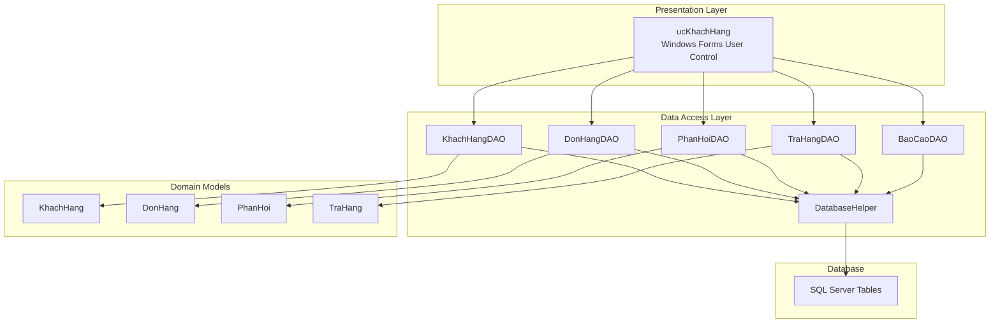
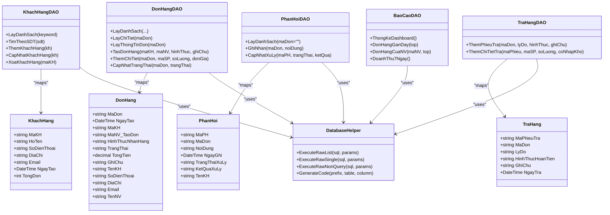
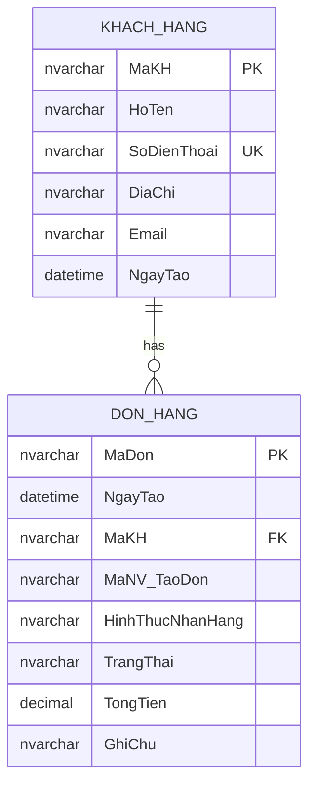
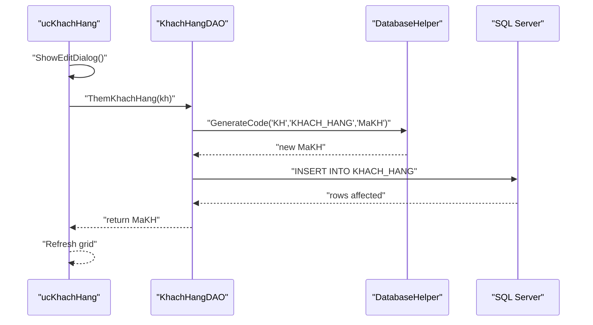
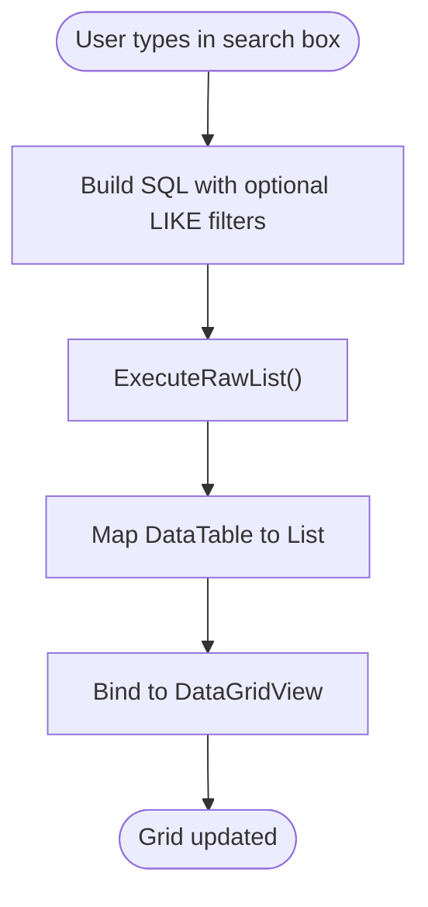
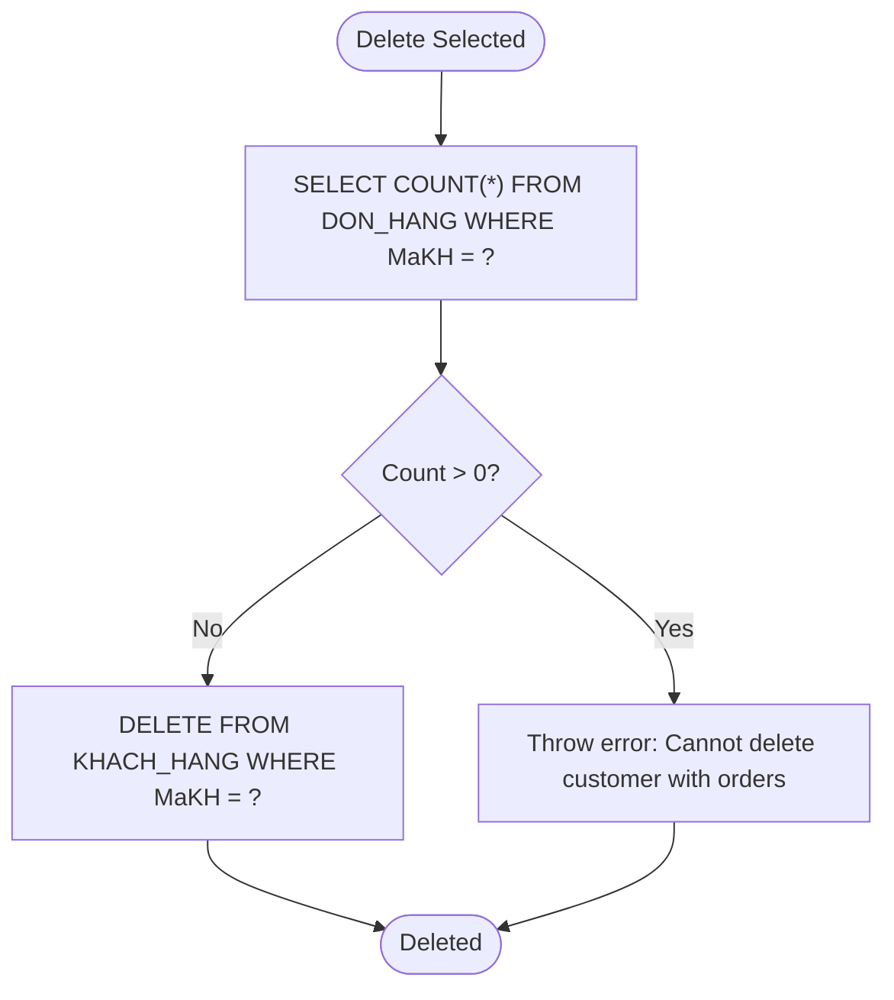
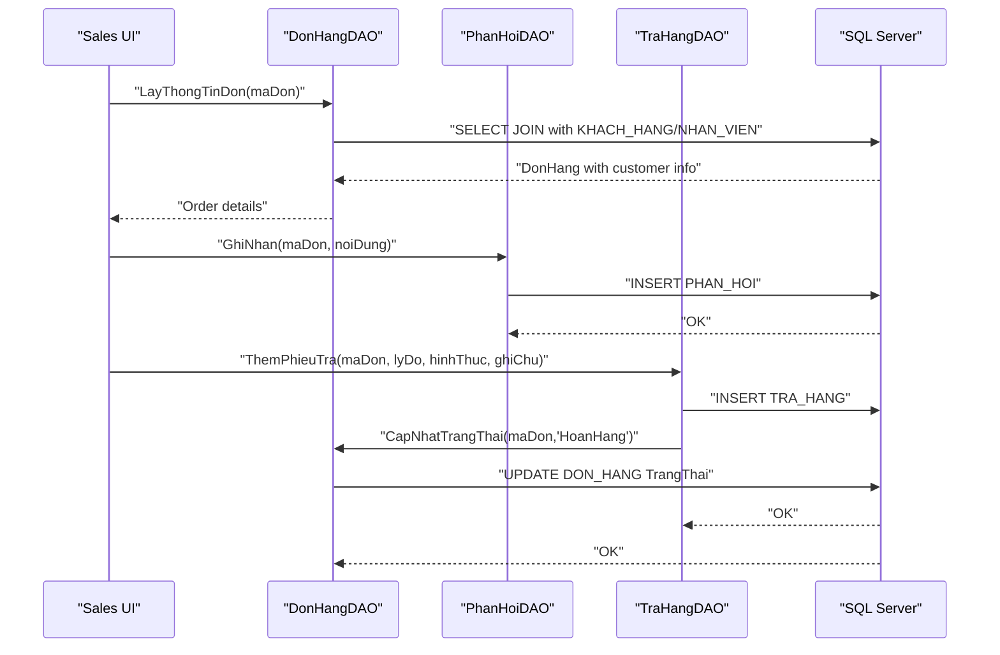
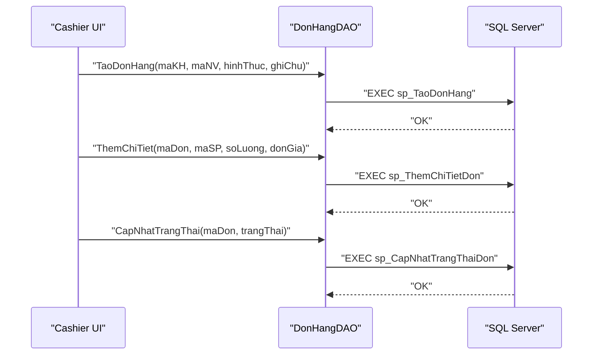
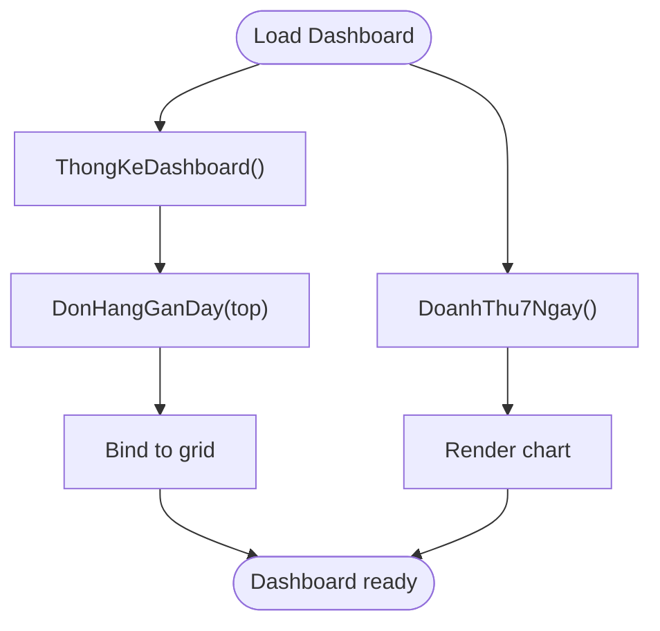
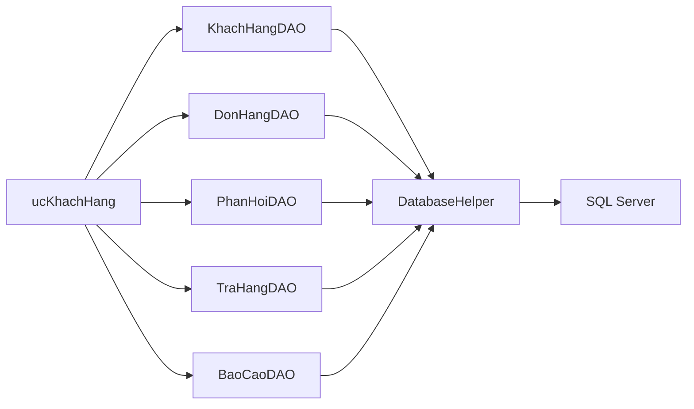

# Customer Management

<cite>
**Referenced Files in This Document**
- [KhachHang.cs](file://Models/KhachHang.cs)
- [KhachHangDAO.cs](file://DataAccess/KhachHangDAO.cs)
- [ucKhachHang.cs](file://7_DanhMuc/ucKhachHang.cs)
- [ucKhachHang.Designer.cs](file://7_DanhMuc/ucKhachHang.Designer.cs)
- [DatabaseHelper.cs](file://DataAccess/DatabaseHelper.cs)
- [DonHang.cs](file://Models/DonHang.cs)
- [DonHangDAO.cs](file://DataAccess/DonHangDAO.cs)
- [PhanHoi.cs](file://Models/PhanHoi.cs)
- [PhanHoiDAO.cs](file://DataAccess/PhanHoiDAO.cs)
- [TraHang.cs](file://Models/TraHang.cs)
- [TraHangDAO.cs](file://DataAccess/TraHangDAO.cs)
- [BaoCaoDAO.cs](file://DataAccess/BaoCaoDAO.cs)
- [ucDashboard.cs](file://2_QuanLy/ucDashboard.cs)
- [FloriSys_Database.sql](file://FloriSys_Database.sql)
</cite>

## Table of Contents
1. [Introduction](#introduction)
2. [Project Structure](#project-structure)
3. [Core Components](#core-components)
4. [Architecture Overview](#architecture-overview)
5. [Detailed Component Analysis](#detailed-component-analysis)
6. [Dependency Analysis](#dependency-analysis)
7. [Performance Considerations](#performance-considerations)
8. [Troubleshooting Guide](#troubleshooting-guide)
9. [Conclusion](#conclusion)
10. [Appendices](#appendices)

## Introduction
This document describes the customer management capabilities within the FloriSys Sales Management Module. It covers customer registration, profile updates, search, and deletion safeguards, along with the customer data model, integration with sales order processing, customer service workflows (complaint handling and returns), and reporting/analytics for purchase behavior and retention. It also outlines procedures for data import/export, duplicate detection, and data privacy considerations.

## Project Structure
Customer management spans three layers:
- Presentation: A Windows Forms user control for managing customers.
- Data Access: DAO classes encapsulate CRUD operations against the database.
- Domain Model: Strongly typed models represent domain entities.

**Diagram sources**
- [ucKhachHang.cs:10-237](file://7_DanhMuc/ucKhachHang.cs#L10-L237)
- [KhachHangDAO.cs:9-75](file://DataAccess/KhachHangDAO.cs#L9-L75)
- [DonHangDAO.cs:9-114](file://DataAccess/DonHangDAO.cs#L9-L114)
- [PhanHoiDAO.cs:7-51](file://DataAccess/PhanHoiDAO.cs#L7-L51)
- [TraHangDAO.cs:7-51](file://DataAccess/TraHangDAO.cs#L7-L51)
- [BaoCaoDAO.cs:9-167](file://DataAccess/BaoCaoDAO.cs#L9-L167)
- [DatabaseHelper.cs:10-212](file://DataAccess/DatabaseHelper.cs#L10-L212)
- [FloriSys_Database.sql:34-44](file://FloriSys_Database.sql#L34-L44)

**Section sources**
- [ucKhachHang.cs:10-237](file://7_DanhMuc/ucKhachHang.cs#L10-L237)
- [ucKhachHang.Designer.cs:18-156](file://7_DanhMuc/ucKhachHang.Designer.cs#L18-L156)
- [KhachHangDAO.cs:9-75](file://DataAccess/KhachHangDAO.cs#L9-L75)
- [DonHangDAO.cs:9-114](file://DataAccess/DonHangDAO.cs#L9-L114)
- [PhanHoiDAO.cs:7-51](file://DataAccess/PhanHoiDAO.cs#L7-L51)
- [TraHangDAO.cs:7-51](file://DataAccess/TraHangDAO.cs#L7-L51)
- [BaoCaoDAO.cs:9-167](file://DataAccess/BaoCaoDAO.cs#L9-L167)
- [DatabaseHelper.cs:10-212](file://DataAccess/DatabaseHelper.cs#L10-L212)
- [FloriSys_Database.sql:34-44](file://FloriSys_Database.sql#L34-L44)

## Core Components
- Customer entity: identity, personal info, contact details, creation date, and computed total orders.
- Customer DAO: search, lookup by phone, create, update, delete with referential integrity checks.
- Presentation control: grid display, inline edit dialog, search, context actions (edit/delete).
- Order integration: customer-to-orders relationship and computed order totals.
- Customer service: feedback and returns workflows integrated with orders.
- Reporting: dashboard and analytics around orders and customer activity.

**Section sources**
- [KhachHang.cs:5-16](file://Models/KhachHang.cs#L5-L16)
- [KhachHangDAO.cs:11-72](file://DataAccess/KhachHangDAO.cs#L11-L72)
- [ucKhachHang.cs:24-234](file://7_DanhMuc/ucKhachHang.cs#L24-L234)
- [DonHang.cs:6-51](file://Models/DonHang.cs#L6-L51)
- [DonHangDAO.cs:11-98](file://DataAccess/DonHangDAO.cs#L11-L98)
- [PhanHoi.cs:5-30](file://Models/PhanHoi.cs#L5-L30)
- [PhanHoiDAO.cs:9-48](file://DataAccess/PhanHoiDAO.cs#L9-L48)
- [TraHang.cs:6-31](file://Models/TraHang.cs#L6-L31)
- [TraHangDAO.cs:9-48](file://DataAccess/TraHangDAO.cs#L9-L48)
- [BaoCaoDAO.cs:72-128](file://DataAccess/BaoCaoDAO.cs#L72-L128)
- [ucDashboard.cs:18-138](file://2_QuanLy/ucDashboard.cs#L18-L138)

## Architecture Overview
The customer management subsystem follows a layered architecture:
- UI layer (Windows Forms) interacts with business logic via DAOs.
- DAOs use a generic database helper to execute raw SQL and stored procedures.
- Database schema defines normalized tables with constraints and triggers to maintain data integrity.

**Diagram sources**
- [KhachHang.cs:5-16](file://Models/KhachHang.cs#L5-L16)
- [DonHang.cs:6-51](file://Models/DonHang.cs#L6-L51)
- [PhanHoi.cs:5-30](file://Models/PhanHoi.cs#L5-L30)
- [TraHang.cs:6-31](file://Models/TraHang.cs#L6-L31)
- [KhachHangDAO.cs:9-75](file://DataAccess/KhachHangDAO.cs#L9-L75)
- [DonHangDAO.cs:9-114](file://DataAccess/DonHangDAO.cs#L9-L114)
- [PhanHoiDAO.cs:7-51](file://DataAccess/PhanHoiDAO.cs#L7-L51)
- [TraHangDAO.cs:7-51](file://DataAccess/TraHangDAO.cs#L7-L51)
- [DatabaseHelper.cs:10-212](file://DataAccess/DatabaseHelper.cs#L10-L212)
- [BaoCaoDAO.cs:9-167](file://DataAccess/BaoCaoDAO.cs#L9-L167)

## Detailed Component Analysis

### Customer Data Model
- Identity: unique customer ID.
- Personal info: full name.
- Contact: phone (unique), address, email.
- Audit: creation date.
- Computed: total orders (derived from joined orders count).

**Diagram sources**
- [FloriSys_Database.sql:34-44](file://FloriSys_Database.sql#L34-L44)
- [FloriSys_Database.sql:64-74](file://FloriSys_Database.sql#L64-L74)

**Section sources**
- [KhachHang.cs:5-16](file://Models/KhachHang.cs#L5-L16)
- [FloriSys_Database.sql:34-44](file://FloriSys_Database.sql#L34-L44)

### Customer Registration and Profile Updates
- Registration: generates a new customer ID, inserts personal and contact info.
- Profile update: updates name, phone, address, email.
- Inline edit dialog validates required fields and persists changes.

**Diagram sources**
- [ucKhachHang.cs:133-179](file://7_DanhMuc/ucKhachHang.cs#L133-L179)
- [KhachHangDAO.cs:32-46](file://DataAccess/KhachHangDAO.cs#L32-L46)
- [DatabaseHelper.cs:189-209](file://DataAccess/DatabaseHelper.cs#L189-L209)

**Section sources**
- [ucKhachHang.cs:133-179](file://7_DanhMuc/ucKhachHang.cs#L133-L179)
- [KhachHangDAO.cs:32-60](file://DataAccess/KhachHangDAO.cs#L32-L60)
- [DatabaseHelper.cs:189-209](file://DataAccess/DatabaseHelper.cs#L189-L209)

### Customer Search and Listing
- Keyword search across name, phone, and email.
- Grid displays customer info and computed total orders.
- Search triggers reload with filtered results.

**Diagram sources**
- [ucKhachHang.cs:24-58](file://7_DanhMuc/ucKhachHang.cs#L24-L58)
- [KhachHangDAO.cs:11-24](file://DataAccess/KhachHangDAO.cs#L11-L24)
- [DatabaseHelper.cs:28-32](file://DataAccess/DatabaseHelper.cs#L28-L32)

**Section sources**
- [ucKhachHang.cs:24-58](file://7_DanhMuc/ucKhachHang.cs#L24-L58)
- [KhachHangDAO.cs:11-24](file://DataAccess/KhachHangDAO.cs#L11-L24)
- [DatabaseHelper.cs:28-32](file://DataAccess/DatabaseHelper.cs#L28-L32)

### Customer Deletion and Referential Integrity
- Deletion is prevented if the customer has existing orders.
- If safe to delete, the record is removed.

**Diagram sources**
- [ucKhachHang.cs:213-234](file://7_DanhMuc/ucKhachHang.cs#L213-L234)
- [KhachHangDAO.cs:62-72](file://DataAccess/KhachHangDAO.cs#L62-L72)

**Section sources**
- [ucKhachHang.cs:213-234](file://7_DanhMuc/ucKhachHang.cs#L213-L234)
- [KhachHangDAO.cs:62-72](file://DataAccess/KhachHangDAO.cs#L62-L72)

### Customer Service Workflows
- Complaint handling: log feedback linked to an order; track processing status.
- Returns: create return ticket, capture items and inventory impact; update order status.

**Diagram sources**
- [DonHangDAO.cs:53-64](file://DataAccess/DonHangDAO.cs#L53-L64)
- [PhanHoiDAO.cs:27-37](file://DataAccess/PhanHoiDAO.cs#L27-L37)
- [TraHangDAO.cs:9-25](file://DataAccess/TraHangDAO.cs#L9-L25)
- [DonHangDAO.cs:91-98](file://DataAccess/DonHangDAO.cs#L91-L98)

**Section sources**
- [DonHangDAO.cs:53-64](file://DataAccess/DonHangDAO.cs#L53-L64)
- [PhanHoiDAO.cs:9-37](file://DataAccess/PhanHoiDAO.cs#L9-L37)
- [TraHangDAO.cs:9-25](file://DataAccess/TraHangDAO.cs#L9-L25)

### Integration with Sales Order Processing
- Orders reference customers; customer info is included in order queries.
- Order status transitions trigger inventory adjustments.
- Dashboard surfaces recent orders and customer-related metrics.

**Diagram sources**
- [DonHangDAO.cs:66-98](file://DataAccess/DonHangDAO.cs#L66-L98)
- [FloriSys_Database.sql:282-358](file://FloriSys_Database.sql#L282-L358)

**Section sources**
- [DonHangDAO.cs:11-98](file://DataAccess/DonHangDAO.cs#L11-L98)
- [FloriSys_Database.sql:282-358](file://FloriSys_Database.sql#L282-L358)
- [ucDashboard.cs:112-138](file://2_QuanLy/ucDashboard.cs#L112-L138)

### Customer Analytics and Retention
- Dashboard statistics include recent orders and shipping metrics.
- Reporting DAO provides aggregated insights for daily, weekly, monthly trends.
- Customer segment insights can be derived from order counts and spending patterns.

**Diagram sources**
- [ucDashboard.cs:18-138](file://2_QuanLy/ucDashboard.cs#L18-L138)
- [BaoCaoDAO.cs:72-155](file://DataAccess/BaoCaoDAO.cs#L72-L155)

**Section sources**
- [ucDashboard.cs:18-138](file://2_QuanLy/ucDashboard.cs#L18-L138)
- [BaoCaoDAO.cs:72-155](file://DataAccess/BaoCaoDAO.cs#L72-L155)

## Dependency Analysis
- ucKhachHang depends on KhachHangDAO for data operations and on Windows Forms for UI.
- DAOs depend on DatabaseHelper for SQL execution and code generation.
- Orders, feedback, and returns DAOs integrate with the customer domain via foreign keys.
- Reporting DAOs rely on stored procedures and ad-hoc queries to aggregate data.

**Diagram sources**
- [ucKhachHang.cs:10-237](file://7_DanhMuc/ucKhachHang.cs#L10-L237)
- [KhachHangDAO.cs:9-75](file://DataAccess/KhachHangDAO.cs#L9-L75)
- [DonHangDAO.cs:9-114](file://DataAccess/DonHangDAO.cs#L9-L114)
- [PhanHoiDAO.cs:7-51](file://DataAccess/PhanHoiDAO.cs#L7-L51)
- [TraHangDAO.cs:7-51](file://DataAccess/TraHangDAO.cs#L7-L51)
- [BaoCaoDAO.cs:9-167](file://DataAccess/BaoCaoDAO.cs#L9-L167)
- [DatabaseHelper.cs:10-212](file://DataAccess/DatabaseHelper.cs#L10-L212)

**Section sources**
- [ucKhachHang.cs:10-237](file://7_DanhMuc/ucKhachHang.cs#L10-L237)
- [KhachHangDAO.cs:9-75](file://DataAccess/KhachHangDAO.cs#L9-L75)
- [DonHangDAO.cs:9-114](file://DataAccess/DonHangDAO.cs#L9-L114)
- [PhanHoiDAO.cs:7-51](file://DataAccess/PhanHoiDAO.cs#L7-L51)
- [TraHangDAO.cs:7-51](file://DataAccess/TraHangDAO.cs#L7-L51)
- [BaoCaoDAO.cs:9-167](file://DataAccess/BaoCaoDAO.cs#L9-L167)
- [DatabaseHelper.cs:10-212](file://DataAccess/DatabaseHelper.cs#L10-L212)

## Performance Considerations
- Prefer indexed columns in search filters (phone number is unique and indexed).
- Use stored procedures for write-heavy operations to reduce round trips.
- Avoid loading unnecessary computed fields when not displayed.
- Batch UI refreshes after bulk operations to minimize flicker.

## Troubleshooting Guide
- Duplicate phone number: Registration/update requires a unique phone number; ensure uniqueness before saving.
- Deletion blocked: If deletion fails, the customer likely has orders; cancel or fulfill orders first.
- Search yields no results: Verify keyword matches name, phone, or email; check casing and special characters.
- Import/export: Use the database export/import facilities; ensure referential integrity when importing customer data.

**Section sources**
- [FloriSys_Database.sql](file://FloriSys_Database.sql#L39)
- [ucKhachHang.cs:133-179](file://7_DanhMuc/ucKhachHang.cs#L133-L179)
- [KhachHangDAO.cs:62-72](file://DataAccess/KhachHangDAO.cs#L62-L72)

## Conclusion
The customer management module provides robust CRUD operations, strong referential integrity, and seamless integration with sales order processing. It supports customer service workflows, offers actionable analytics, and maintains data quality through constraints and validations. Extending segmentation and targeted marketing features would involve deriving cohort and behavioral segments from order history and feedback data.

## Appendices

### Customer Data Model Fields
- Customer ID, Name, Phone (unique), Address, Email, Creation Date, Total Orders (computed).

**Section sources**
- [KhachHang.cs:5-16](file://Models/KhachHang.cs#L5-L16)
- [FloriSys_Database.sql:34-44](file://FloriSys_Database.sql#L34-L44)

### Customer Segmentation and Targeting
- Segment by frequency (orders per period), recency (last order), monetary value (total spent).
- Target campaigns using order categories and product preferences from order details.

**Section sources**
- [DonHangDAO.cs:11-42](file://DataAccess/DonHangDAO.cs#L11-L42)
- [DonHang.cs:6-26](file://Models/DonHang.cs#L6-L26)

### Customer Service Scenarios
- Complaint resolution: Log feedback against an order; update processing status.
- Returns processing: Create return ticket, adjust inventory if applicable, update order status.

**Section sources**
- [PhanHoiDAO.cs:9-48](file://DataAccess/PhanHoiDAO.cs#L9-L48)
- [TraHangDAO.cs:9-48](file://DataAccess/TraHangDAO.cs#L9-L48)

### Data Import/Export and Privacy
- Import/export via database tools; ensure GDPR-compliant handling of personal data.
- Enforce unique constraints (phone) to prevent duplicates during import.

**Section sources**
- [FloriSys_Database.sql](file://FloriSys_Database.sql#L39)