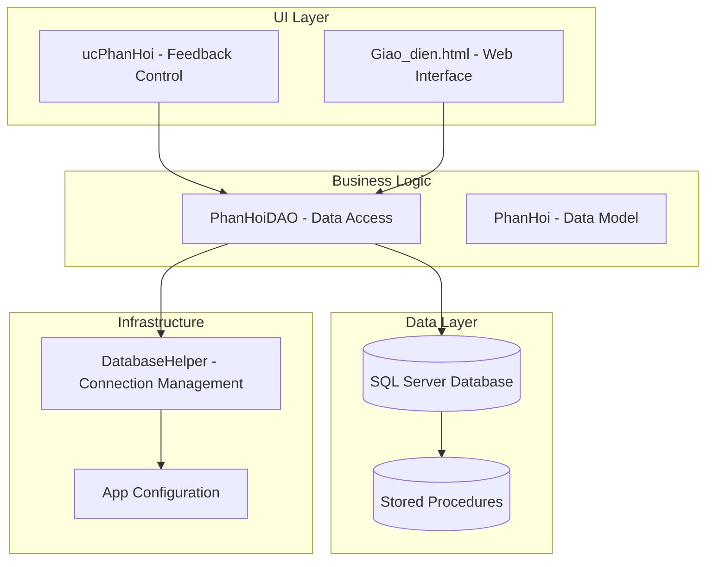
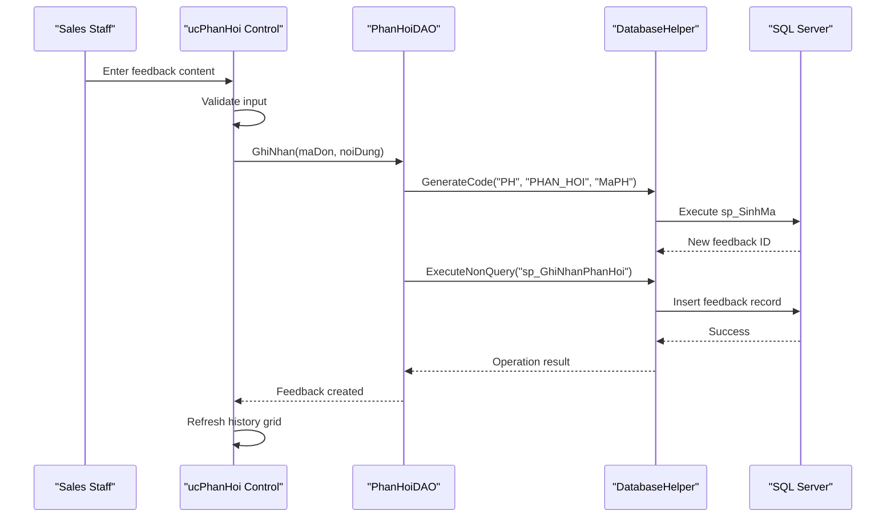
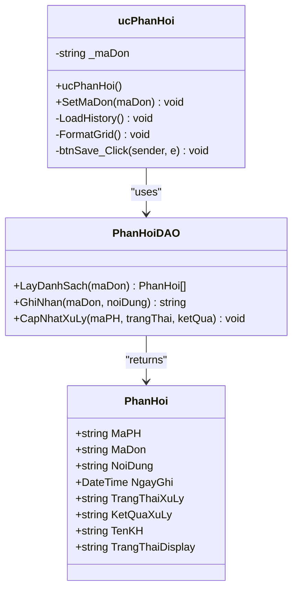
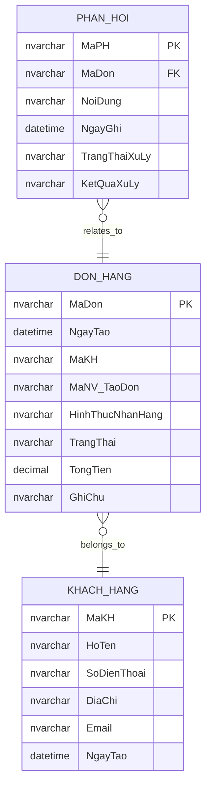
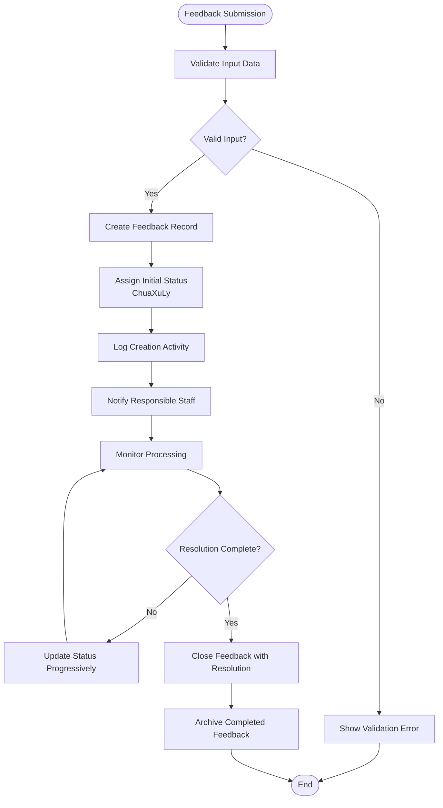
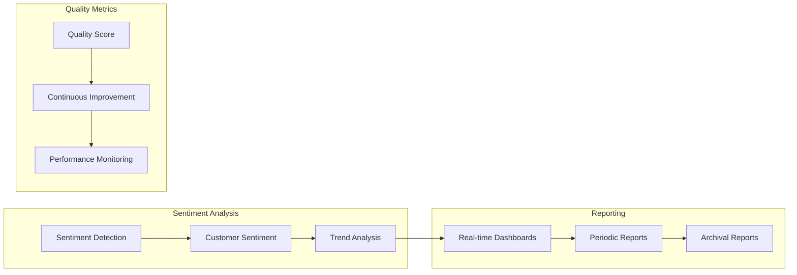
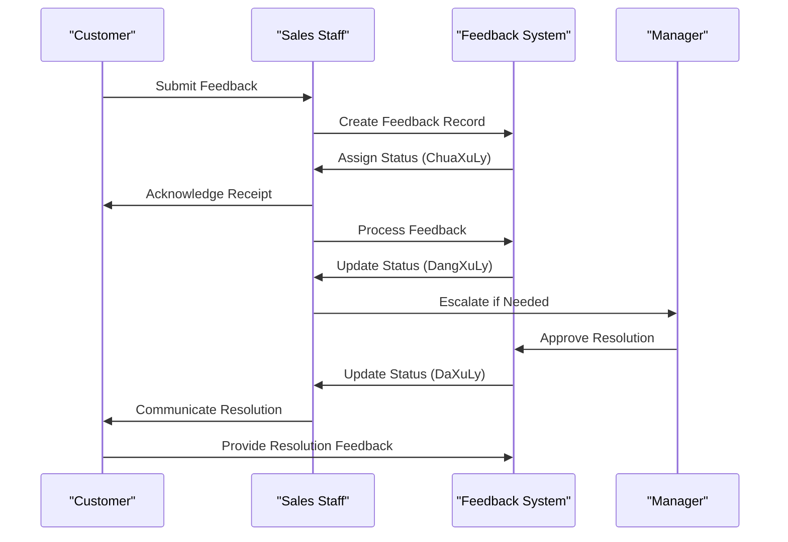
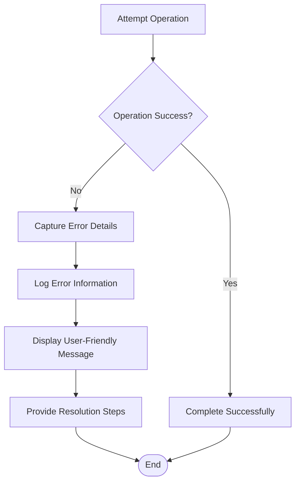

# Feedback Collection

<cite>
**Referenced Files in This Document**
- [ucPhanHoi.cs](file://3_BanHang/ucPhanHoi.cs)
- [ucPhanHoi.Designer.cs](file://3_BanHang/ucPhanHoi.Designer.cs)
- [PhanHoiDAO.cs](file://DataAccess/PhanHoiDAO.cs)
- [PhanHoi.cs](file://Models/PhanHoi.cs)
- [DatabaseHelper.cs](file://DataAccess/DatabaseHelper.cs)
- [FloriSys_Database.sql](file://FloriSys_Database.sql)
- [Giao_dien.html](file://Giao_dien.html)
</cite>

## Table of Contents
1. [Introduction](#introduction)
2. [Project Structure](#project-structure)
3. [Core Components](#core-components)
4. [Architecture Overview](#architecture-overview)
5. [Detailed Component Analysis](#detailed-component-analysis)
6. [Feedback Routing System](#feedback-routing-system)
7. [Integration with CRM and Quality Processes](#integration-with-crm-and-quality-processes)
8. [Feedback Analytics and Reporting](#feedback-analytics-and-reporting)
9. [Response Workflows and Escalation Procedures](#response-workflows-and-escalation-procedures)
10. [Quality Assurance Procedures](#quality-assurance-procedures)
11. [Troubleshooting Guide](#troubleshooting-guide)
12. [Conclusion](#conclusion)

## Introduction

The FloriSys Sales Management Module includes a comprehensive feedback collection system designed to capture, process, and manage customer feedback efficiently. This system enables sales staff to record customer concerns, track resolution progress, and integrate feedback into broader customer relationship management and quality improvement processes.

The feedback system supports multiple types of customer inquiries including product quality issues, delivery problems, order discrepancies, and general suggestions. It provides real-time tracking capabilities and integrates seamlessly with the existing order management infrastructure.

## Project Structure

The feedback collection system is organized across several key components within the FloriSys application architecture:

**Diagram sources**
- [ucPhanHoi.cs:1-84](file://3_BanHang/ucPhanHoi.cs#L1-L84)
- [PhanHoiDAO.cs:1-51](file://DataAccess/PhanHoiDAO.cs#L1-L51)
- [DatabaseHelper.cs:1-212](file://DataAccess/DatabaseHelper.cs#L1-L212)

**Section sources**
- [ucPhanHoi.cs:1-84](file://3_BanHang/ucPhanHoi.cs#L1-L84)
- [ucPhanHoi.Designer.cs:1-255](file://3_BanHang/ucPhanHoi.Designer.cs#L1-L255)
- [PhanHoiDAO.cs:1-51](file://DataAccess/PhanHoiDAO.cs#L1-L51)

## Core Components

### Feedback User Interface Component

The primary feedback interface is implemented as a Windows Forms UserControl named `ucPhanHoi`. This component provides a split-screen layout with feedback entry on the left and history tracking on the right.

**Key Features:**
- Real-time feedback submission with validation
- Order-specific feedback association
- Interactive grid for feedback history
- Status display with color-coded indicators
- Responsive design with modern UI elements

### Data Access Layer

The `PhanHoiDAO` class serves as the central data access component, providing methods for:
- Retrieving feedback history for specific orders
- Creating new feedback records
- Updating feedback processing status
- Managing feedback resolution outcomes

### Data Model

The `PhanHoi` model class defines the feedback entity structure with properties for:
- Unique feedback identifiers
- Order associations
- Content and timestamps
- Processing status tracking
- Customer information integration

**Section sources**
- [ucPhanHoi.cs:8-84](file://3_BanHang/ucPhanHoi.cs#L8-L84)
- [PhanHoiDAO.cs:7-50](file://DataAccess/PhanHoiDAO.cs#L7-L50)
- [PhanHoi.cs:5-31](file://Models/PhanHoi.cs#L5-L31)

## Architecture Overview

The feedback system follows a layered architecture pattern with clear separation of concerns:

**Diagram sources**
- [ucPhanHoi.cs:61-81](file://3_BanHang/ucPhanHoi.cs#L61-L81)
- [PhanHoiDAO.cs:27-37](file://DataAccess/PhanHoiDAO.cs#L27-L37)
- [DatabaseHelper.cs:189-209](file://DataAccess/DatabaseHelper.cs#L189-L209)

The architecture ensures:
- **Separation of Concerns**: UI logic separated from data access
- **Transaction Safety**: Database operations wrapped in stored procedures
- **Extensibility**: Easy addition of new feedback types and processing rules
- **Maintainability**: Clear data flow and error handling

## Detailed Component Analysis

### User Interface Component Analysis

The `ucPhanHoi` UserControl implements a sophisticated feedback interface with the following components:

**Diagram sources**
- [ucPhanHoi.cs:8-84](file://3_BanHang/ucPhanHoi.cs#L8-L84)
- [PhanHoiDAO.cs:7-50](file://DataAccess/PhanHoiDAO.cs#L7-L50)
- [PhanHoi.cs:5-31](file://Models/PhanHoi.cs#L5-L31)

### Database Schema and Stored Procedures

The feedback system relies on a well-structured database schema with dedicated tables and stored procedures:

**Diagram sources**
- [FloriSys_Database.sql:129-139](file://FloriSys_Database.sql#L129-L139)
- [FloriSys_Database.sql:64-74](file://FloriSys_Database.sql#L64-L74)
- [FloriSys_Database.sql:36-43](file://FloriSys_Database.sql#L36-L43)

**Section sources**
- [ucPhanHoi.Designer.cs:18-255](file://3_BanHang/ucPhanHoi.Designer.cs#L18-L255)
- [PhanHoiDAO.cs:9-48](file://DataAccess/PhanHoiDAO.cs#L9-L48)
- [FloriSys_Database.sql:129-139](file://FloriSys_Database.sql#L129-L139)

## Feedback Routing System

### Feedback Categorization and Classification

The current implementation supports basic feedback categorization through the web interface mockup, which includes predefined categories:

- **Product Quality Issues**: Problems with flower freshness, damage during transport
- **Delivery Problems**: Late deliveries, incorrect delivery addresses
- **Order Discrepancies**: Wrong items delivered, quantity issues
- **General Suggestions**: Store improvements, service enhancements

### Routing Logic Implementation

The feedback routing system operates through a structured workflow:

**Diagram sources**
- [ucPhanHoi.cs:61-81](file://3_BanHang/ucPhanHoi.cs#L61-L81)
- [PhanHoiDAO.cs:27-37](file://DataAccess/PhanHoiDAO.cs#L27-L37)

### Status Management System

The feedback system implements a three-tier status management:

| Status Code | Status Name | Description |
|-------------|-------------|-------------|
| `ChuaXuLy` | Chưa xử lý | New feedback received, awaiting assignment |
| `DangXuLy` | Đang xử lý | Active processing, investigation underway |
| `DaXuLy` | Đã xử lý | Resolution completed, feedback closed |

**Section sources**
- [PhanHoi.cs:17-29](file://Models/PhanHoi.cs#L17-L29)
- [FloriSys_Database.sql:135-137](file://FloriSys_Database.sql#L135-L137)

## Integration with CRM and Quality Processes

### Customer Relationship Management Integration

The feedback system integrates with the broader CRM infrastructure through:

- **Customer Association**: Direct linking to customer records via order relationships
- **Historical Tracking**: Comprehensive feedback history for each customer
- **Communication Channels**: Multi-channel feedback capture (in-store, online, phone)
- **Service History**: Complete service interaction timeline

### Quality Improvement Process Integration

Feedback feeds into quality improvement initiatives through:

- **Issue Trend Analysis**: Identifying recurring problems and patterns
- **Root Cause Analysis**: Linking feedback to operational processes
- **Performance Metrics**: Tracking customer satisfaction indicators
- **Continuous Improvement**: Regular review of feedback patterns

### Cross-Department Coordination

The system facilitates coordination across departments:

- **Sales Department**: Primary feedback intake and initial response
- **Customer Service**: Escalated issue resolution
- **Operations**: Process improvement based on feedback insights
- **Management**: Strategic decision-making using feedback analytics

**Section sources**
- [Giao_dien.html:508-528](file://Giao_dien.html#L508-L528)
- [FloriSys_Database.sql:64-74](file://FloriSys_Database.sql#L64-L74)

## Feedback Analytics and Reporting

### Current Analytics Capabilities

The system currently supports:

- **Feedback Volume Tracking**: Count of feedback submissions over time
- **Resolution Time Analysis**: Average time to resolve different feedback types
- **Customer Satisfaction Metrics**: Based on feedback resolution outcomes
- **Trend Identification**: Pattern recognition in feedback themes

### Proposed Advanced Analytics Features

Future enhancements could include:

### Data Collection and Storage

Feedback data is stored with comprehensive metadata:

- **Timestamp Information**: Precise recording of feedback creation and resolution
- **Staff Assignment**: Tracking of responsible personnel
- **Resolution Details**: Complete outcome documentation
- **Customer Impact**: Linkage to customer service history

**Section sources**
- [PhanHoiDAO.cs:9-25](file://DataAccess/PhanHoiDAO.cs#L9-L25)
- [DatabaseHelper.cs:189-209](file://DataAccess/DatabaseHelper.cs#L189-L209)

## Response Workflows and Escalation Procedures

### Standard Response Workflow

The feedback response process follows established protocols:

**Diagram sources**
- [ucPhanHoi.cs:61-81](file://3_BanHang/ucPhanHoi.cs#L61-L81)
- [PhanHoiDAO.cs:39-48](file://DataAccess/PhanHoiDAO.cs#L39-L48)

### Escalation Criteria

Escalation procedures apply when:

- **Complex Issues**: Require specialized expertise or approval authority
- **Repeat Offenders**: Customers with multiple unresolved issues
- **System-Wide Problems**: Feedback indicating broader operational issues
- **Legal/Regulatory Concerns**: Issues requiring legal review

### Response Templates

Standard response templates facilitate consistent communication:

- **Acknowledgment Templates**: Initial feedback receipt confirmation
- **Investigation Updates**: Progress reports during resolution
- **Resolution Communication**: Final outcome notification
- **Follow-up Surveys**: Post-resolution satisfaction assessment

**Section sources**
- [Giao_dien.html:514-524](file://Giao_dien.html#L514-L524)
- [PhanHoiDAO.cs:39-48](file://DataAccess/PhanHoiDAO.cs#L39-L48)

## Quality Assurance Procedures

### Data Integrity Controls

The system implements multiple quality assurance measures:

- **Input Validation**: Comprehensive validation of feedback content
- **Duplicate Detection**: Prevention of duplicate feedback entries
- **Audit Trails**: Complete tracking of all feedback modifications
- **Data Consistency**: Maintained relationships between feedback and orders

### Process Validation

Quality assurance includes:

- **Workflow Compliance**: Ensuring feedback follows established procedures
- **Response Time Monitoring**: Tracking adherence to response time standards
- **Resolution Quality**: Evaluating effectiveness of feedback resolutions
- **Staff Performance**: Monitoring individual and team feedback handling

### Continuous Improvement

The system supports ongoing quality enhancement through:

- **Feedback on Feedback**: Customer evaluation of feedback resolution process
- **Process Metrics**: Regular analysis of feedback handling effectiveness
- **Training Development**: Identification of training needs based on feedback patterns
- **System Enhancement**: Regular updates to feedback handling procedures

**Section sources**
- [DatabaseHelper.cs:104-172](file://DataAccess/DatabaseHelper.cs#L104-L172)
- [FloriSys_Database.sql:451-461](file://FloriSys_Database.sql#L451-L461)

## Troubleshooting Guide

### Common Issues and Solutions

**Feedback Not Saving**
- Verify database connectivity
- Check for network interruptions
- Confirm storage procedure availability
- Review input validation requirements

**Missing Feedback Records**
- Verify order ID association
- Check database permissions
- Review audit trail for deletion records
- Confirm proper loading of feedback history

**Status Update Failures**
- Validate status transition logic
- Check database constraint violations
- Review stored procedure execution
- Confirm proper parameter passing

### Error Handling Implementation

The system includes comprehensive error handling:

**Diagram sources**
- [ucPhanHoi.cs:41-44](file://3_BanHang/ucPhanHoi.cs#L41-L44)
- [ucPhanHoi.cs:77-80](file://3_BanHang/ucPhanHoi.cs#L77-L80)

### Performance Optimization

Key performance considerations:

- **Database Indexing**: Proper indexing on feedback-related tables
- **Query Optimization**: Efficient retrieval of feedback history
- **Connection Pooling**: Optimized database connection management
- **Memory Management**: Efficient handling of large feedback datasets

**Section sources**
- [ucPhanHoi.cs:34-45](file://3_BanHang/ucPhanHoi.cs#L34-L45)
- [PhanHoiDAO.cs:9-25](file://DataAccess/PhanHoiDAO.cs#L9-L25)

## Conclusion

The FloriSys feedback collection system provides a robust foundation for managing customer feedback within the sales management environment. The system successfully integrates feedback capture, processing, and resolution while maintaining strong connections to the broader CRM and quality improvement processes.

Key strengths of the current implementation include:

- **Modular Design**: Clean separation between UI, business logic, and data access layers
- **Scalable Architecture**: Foundation supports future expansion and enhancement
- **Process Integration**: Seamless connection to order management and customer service workflows
- **Quality Focus**: Built-in mechanisms for quality assurance and continuous improvement

Future development opportunities include advanced analytics capabilities, automated sentiment analysis, and enhanced reporting features. The current architecture provides an excellent foundation for these enhancements while maintaining system stability and performance.

The feedback system represents a significant step forward in customer service management, enabling FloriSys to better understand and address customer needs while supporting continuous business improvement initiatives.