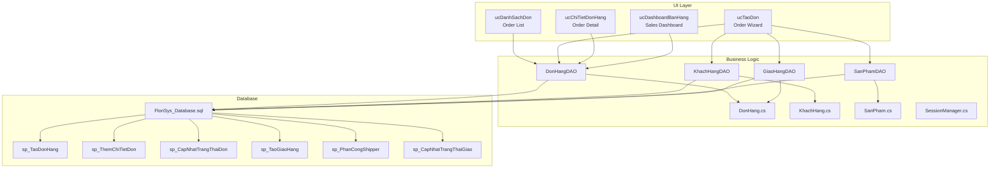
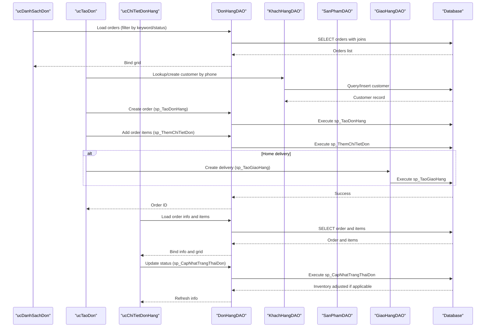
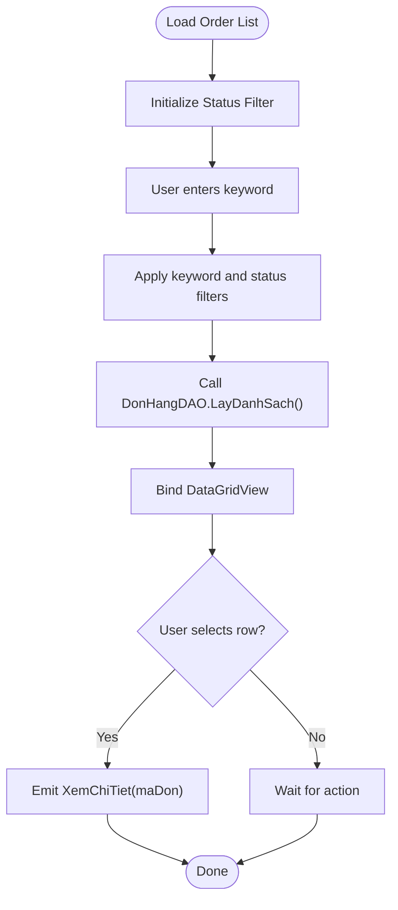
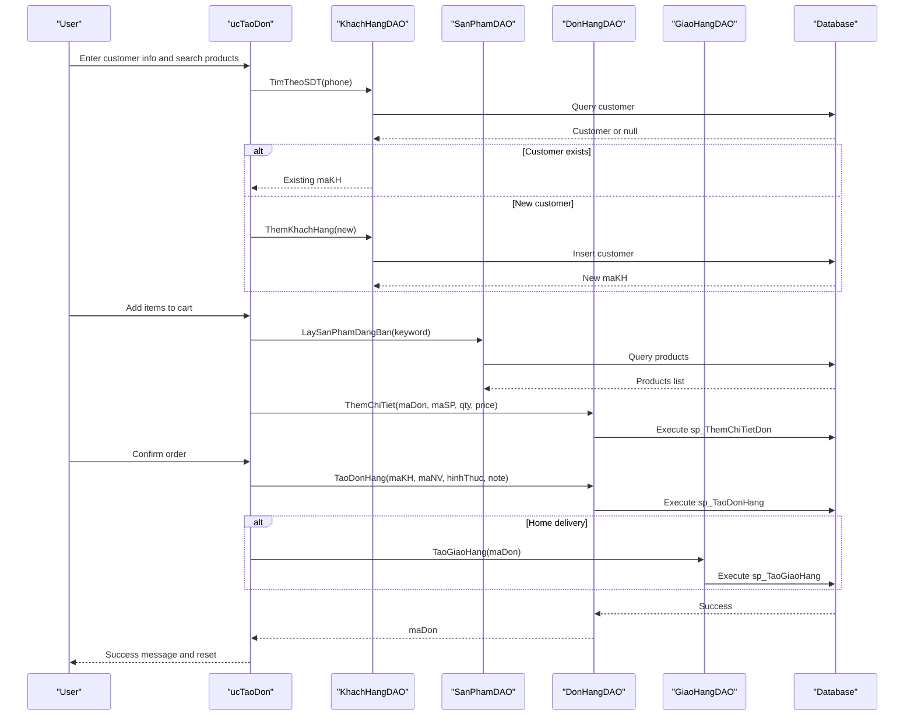
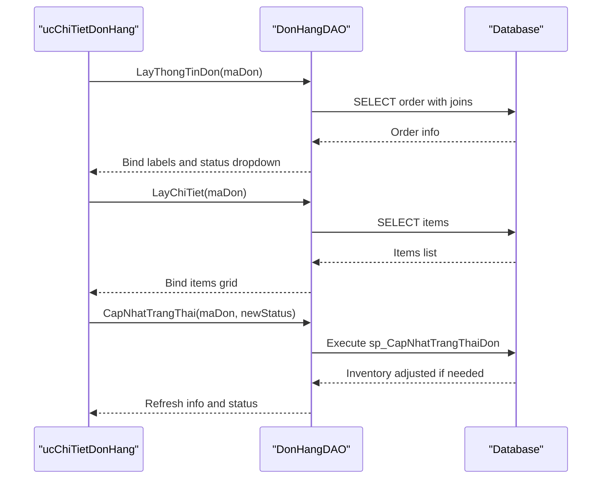
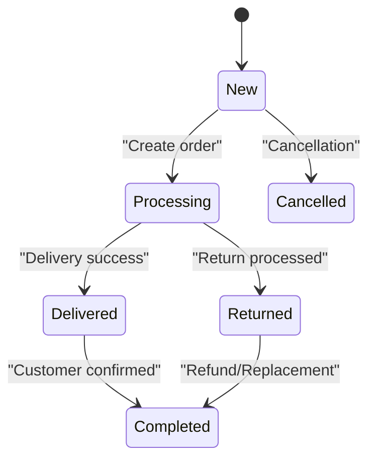
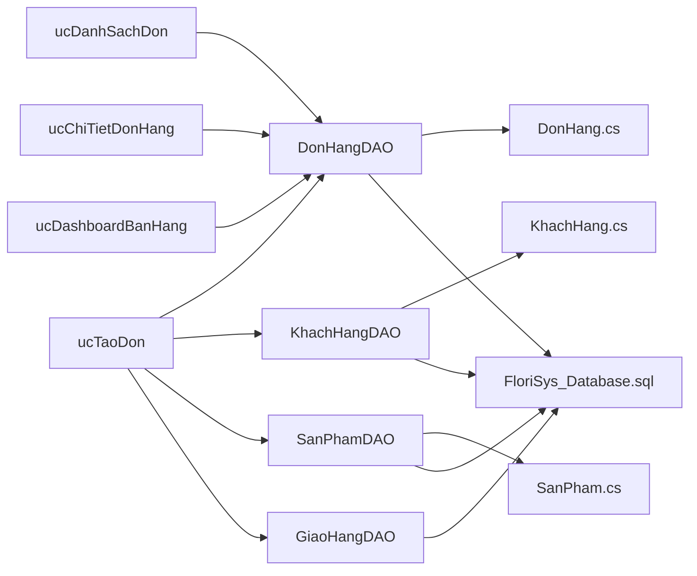

# Order Management

<cite>
**Referenced Files in This Document**
- [ucDanhSachDon.cs](file://3_BanHang/ucDanhSachDon.cs)
- [ucTaoDon.cs](file://3_BanHang/ucTaoDon.cs)
- [ucChiTietDonHang.cs](file://3_BanHang/ucChiTietDonHang.cs)
- [DonHangDAO.cs](file://DataAccess/DonHangDAO.cs)
- [KhachHangDAO.cs](file://DataAccess/KhachHangDAO.cs)
- [SanPhamDAO.cs](file://DataAccess/SanPhamDAO.cs)
- [GiaoHangDAO.cs](file://DataAccess/GiaoHangDAO.cs)
- [DonHang.cs](file://Models/DonHang.cs)
- [KhachHang.cs](file://Models/KhachHang.cs)
- [SanPham.cs](file://Models/SanPham.cs)
- [SessionManager.cs](file://Services/SessionManager.cs)
- [ucDashboardBanHang.cs](file://3_BanHang/ucDashboardBanHang.cs)
- [FloriSys_Database.sql](file://FloriSys_Database.sql)
- [fix_sp.sql](file://fix_sp.sql)
- [fix_sp2.sql](file://fix_sp2.sql)
</cite>

## Table of Contents
1. [Introduction](#introduction)
2. [Project Structure](#project-structure)
3. [Core Components](#core-components)
4. [Architecture Overview](#architecture-overview)
5. [Detailed Component Analysis](#detailed-component-analysis)
6. [Dependency Analysis](#dependency-analysis)
7. [Performance Considerations](#performance-considerations)
8. [Troubleshooting Guide](#troubleshooting-guide)
9. [Conclusion](#conclusion)
10. [Appendices](#appendices)

## Introduction
This document provides comprehensive order management documentation for the FloriSys Sales Management Module. It covers the complete order lifecycle from creation to completion, including processing, modification, cancellation, and status tracking. It also documents the user interface components for order list management, order creation wizard, and order detail views, along with business rules for order states, payment processing, and inventory allocation. Step-by-step workflows are included for creating new orders, modifying existing orders, and handling cancellations. Integration points with the customer database, product catalog, and shipping/goods-out systems are explained, alongside examples of typical order processing scenarios, common errors, and best practices.

## Project Structure
The order management module resides primarily under the Sales area (3_BanHang) and interacts with data access layer (DataAccess), models (Models), and services (Services). The database schema defines core entities and stored procedures that enforce business rules such as inventory allocation and state transitions.

**Diagram sources**
- [ucDanhSachDon.cs:1-114](file://3_BanHang/ucDanhSachDon.cs#L1-L114)
- [ucTaoDon.cs:1-162](file://3_BanHang/ucTaoDon.cs#L1-L162)
- [ucChiTietDonHang.cs:1-132](file://3_BanHang/ucChiTietDonHang.cs#L1-L132)
- [ucDashboardBanHang.cs:1-85](file://3_BanHang/ucDashboardBanHang.cs#L1-L85)
- [DonHangDAO.cs:1-114](file://DataAccess/DonHangDAO.cs#L1-L114)
- [KhachHangDAO.cs:1-75](file://DataAccess/KhachHangDAO.cs#L1-L75)
- [SanPhamDAO.cs:1-96](file://DataAccess/SanPhamDAO.cs#L1-L96)
- [GiaoHangDAO.cs:1-96](file://DataAccess/GiaoHangDAO.cs#L1-L96)
- [DonHang.cs:1-63](file://Models/DonHang.cs#L1-L63)
- [KhachHang.cs:1-18](file://Models/KhachHang.cs#L1-L18)
- [SanPham.cs:1-42](file://Models/SanPham.cs#L1-L42)
- [SessionManager.cs:1-62](file://Services/SessionManager.cs#L1-L62)
- [FloriSys_Database.sql:64-101](file://FloriSys_Database.sql#L64-L101)
- [fix_sp.sql:1-35](file://fix_sp.sql#L1-L35)
- [fix_sp2.sql:1-34](file://fix_sp2.sql#L1-L34)

**Section sources**
- [ucDanhSachDon.cs:1-114](file://3_BanHang/ucDanhSachDon.cs#L1-L114)
- [ucTaoDon.cs:1-162](file://3_BanHang/ucTaoDon.cs#L1-L162)
- [ucChiTietDonHang.cs:1-132](file://3_BanHang/ucChiTietDonHang.cs#L1-L132)
- [ucDashboardBanHang.cs:1-85](file://3_BanHang/ucDashboardBanHang.cs#L1-L85)
- [DonHangDAO.cs:1-114](file://DataAccess/DonHangDAO.cs#L1-L114)
- [KhachHangDAO.cs:1-75](file://DataAccess/KhachHangDAO.cs#L1-L75)
- [SanPhamDAO.cs:1-96](file://DataAccess/SanPhamDAO.cs#L1-L96)
- [GiaoHangDAO.cs:1-96](file://DataAccess/GiaoHangDAO.cs#L1-L96)
- [DonHang.cs:1-63](file://Models/DonHang.cs#L1-L63)
- [KhachHang.cs:1-18](file://Models/KhachHang.cs#L1-L18)
- [SanPham.cs:1-42](file://Models/SanPham.cs#L1-L42)
- [SessionManager.cs:1-62](file://Services/SessionManager.cs#L1-L62)
- [FloriSys_Database.sql:64-101](file://FloriSys_Database.sql#L64-L101)
- [fix_sp.sql:1-35](file://fix_sp.sql#L1-L35)
- [fix_sp2.sql:1-34](file://fix_sp2.sql#L1-L34)

## Core Components
- Order List Management (ucDanhSachDon): Loads, filters, and displays orders with search and status filtering. Emits events to view details and create new orders.
- Order Creation Wizard (ucTaoDon): Manages cart, validates stock availability, creates orders, and optionally generates delivery records for home-delivery orders.
- Order Detail View (ucChiTietDonHang): Displays order info, items, and allows updating order status.
- Data Access Layer: Centralized DAOs for orders, customers, products, and deliveries.
- Models: Strongly typed domain models for orders, customers, and products.
- Session Manager: Provides current user context for creating orders and dashboards.
- Database Schema and Stored Procedures: Enforce business rules for inventory allocation, order state transitions, and delivery synchronization.

**Section sources**
- [ucDanhSachDon.cs:1-114](file://3_BanHang/ucDanhSachDon.cs#L1-L114)
- [ucTaoDon.cs:1-162](file://3_BanHang/ucTaoDon.cs#L1-L162)
- [ucChiTietDonHang.cs:1-132](file://3_BanHang/ucChiTietDonHang.cs#L1-L132)
- [DonHangDAO.cs:1-114](file://DataAccess/DonHangDAO.cs#L1-L114)
- [KhachHangDAO.cs:1-75](file://DataAccess/KhachHangDAO.cs#L1-L75)
- [SanPhamDAO.cs:1-96](file://DataAccess/SanPhamDAO.cs#L1-L96)
- [GiaoHangDAO.cs:1-96](file://DataAccess/GiaoHangDAO.cs#L1-L96)
- [DonHang.cs:1-63](file://Models/DonHang.cs#L1-L63)
- [KhachHang.cs:1-18](file://Models/KhachHang.cs#L1-L18)
- [SanPham.cs:1-42](file://Models/SanPham.cs#L1-L42)
- [SessionManager.cs:1-62](file://Services/SessionManager.cs#L1-L62)

## Architecture Overview
The order management architecture follows a layered pattern:
- UI Layer: Windows Forms user controls for order list, creation, and detail views.
- Business Logic Layer: DAOs encapsulate data operations and call stored procedures.
- Domain Models: DTOs representing entities and computed display properties.
- Data Access: Uses a shared helper to execute raw SQL and stored procedures.
- Database: Enforces business rules via stored procedures and constraints.

**Diagram sources**
- [ucDanhSachDon.cs:28-45](file://3_BanHang/ucDanhSachDon.cs#L28-L45)
- [ucTaoDon.cs:102-152](file://3_BanHang/ucTaoDon.cs#L102-L152)
- [ucChiTietDonHang.cs:33-115](file://3_BanHang/ucChiTietDonHang.cs#L33-L115)
- [DonHangDAO.cs:11-42](file://DataAccess/DonHangDAO.cs#L11-L42)
- [KhachHangDAO.cs:26-46](file://DataAccess/KhachHangDAO.cs#L26-L46)
- [SanPhamDAO.cs:35-47](file://DataAccess/SanPhamDAO.cs#L35-L47)
- [GiaoHangDAO.cs:54-83](file://DataAccess/GiaoHangDAO.cs#L54-L83)
- [FloriSys_Database.sql:282-358](file://FloriSys_Database.sql#L282-L358)
- [fix_sp.sql:1-35](file://fix_sp.sql#L1-L35)
- [fix_sp2.sql:1-34](file://fix_sp2.sql#L1-L34)

## Detailed Component Analysis

### Order List Management (ucDanhSachDon)
- Purpose: Display orders with filtering by status and search by order ID or customer name. Supports quick navigation to order detail and creation of new orders.
- Key behaviors:
  - Populates status filter with predefined states.
  - Loads orders via DonHangDAO with optional keyword and status filters.
  - Formats grid columns for readability and sets selection mode.
  - Emits events for viewing details and creating new orders.

**Diagram sources**
- [ucDanhSachDon.cs:19-45](file://3_BanHang/ucDanhSachDon.cs#L19-L45)

**Section sources**
- [ucDanhSachDon.cs:1-114](file://3_BanHang/ucDanhSachDon.cs#L1-L114)
- [DonHangDAO.cs:11-42](file://DataAccess/DonHangDAO.cs#L11-L42)

### Order Creation Wizard (ucTaoDon)
- Purpose: Build an order with customer info, select products from the catalog, manage cart, and finalize the order.
- Key behaviors:
  - Product search and grid formatting.
  - Cart management (add/remove items) with stock checks.
  - Customer lookup or creation by phone number.
  - Order creation via stored procedure and item insertion.
  - Optional delivery creation for home-delivery orders.

**Diagram sources**
- [ucTaoDon.cs:38-152](file://3_BanHang/ucTaoDon.cs#L38-L152)
- [KhachHangDAO.cs:26-46](file://DataAccess/KhachHangDAO.cs#L26-L46)
- [SanPhamDAO.cs:35-47](file://DataAccess/SanPhamDAO.cs#L35-L47)
- [DonHangDAO.cs:66-89](file://DataAccess/DonHangDAO.cs#L66-L89)
- [GiaoHangDAO.cs:54-64](file://DataAccess/GiaoHangDAO.cs#L54-L64)
- [FloriSys_Database.sql:282-315](file://FloriSys_Database.sql#L282-L315)

**Section sources**
- [ucTaoDon.cs:1-162](file://3_BanHang/ucTaoDon.cs#L1-L162)
- [KhachHangDAO.cs:1-75](file://DataAccess/KhachHangDAO.cs#L1-L75)
- [SanPhamDAO.cs:1-96](file://DataAccess/SanPhamDAO.cs#L1-L96)
- [DonHangDAO.cs:1-114](file://DataAccess/DonHangDAO.cs#L1-L114)
- [GiaoHangDAO.cs:1-96](file://DataAccess/GiaoHangDAO.cs#L1-L96)

### Order Detail View (ucChiTietDonHang)
- Purpose: Show order details, items, and allow updating order status.
- Key behaviors:
  - Loads order header, items, and formats grids.
  - Provides a dropdown of valid statuses for updates.
  - Calls stored procedure to update order status and adjust inventory accordingly.

**Diagram sources**
- [ucChiTietDonHang.cs:25-115](file://3_BanHang/ucChiTietDonHang.cs#L25-L115)
- [DonHangDAO.cs:53-98](file://DataAccess/DonHangDAO.cs#L53-L98)
- [FloriSys_Database.sql:317-358](file://FloriSys_Database.sql#L317-L358)

**Section sources**
- [ucChiTietDonHang.cs:1-132](file://3_BanHang/ucChiTietDonHang.cs#L1-L132)
- [DonHangDAO.cs:1-114](file://DataAccess/DonHangDAO.cs#L1-L114)

### Business Rules and State Transitions
- Order states: New, Processing, Delivered, Completed, Cancelled, Returned.
- Inventory allocation:
  - Transitioning to Processing triggers stock deduction after validating availability.
  - Returning from Processing/Delivered restores stock.
  - Cancelling from New does not adjust stock.
- Delivery synchronization:
  - Delivery updates propagate order state changes to the parent order.

**Diagram sources**
- [DonHang.cs:27-42](file://Models/DonHang.cs#L27-L42)
- [FloriSys_Database.sql:64-74](file://FloriSys_Database.sql#L64-L74)
- [FloriSys_Database.sql:317-358](file://FloriSys_Database.sql#L317-L358)
- [fix_sp.sql:1-35](file://fix_sp.sql#L1-L35)
- [fix_sp2.sql:1-34](file://fix_sp2.sql#L1-L34)

**Section sources**
- [DonHang.cs:1-63](file://Models/DonHang.cs#L1-L63)
- [FloriSys_Database.sql:64-74](file://FloriSys_Database.sql#L64-L74)
- [FloriSys_Database.sql:317-358](file://FloriSys_Database.sql#L317-L358)
- [fix_sp.sql:1-35](file://fix_sp.sql#L1-L35)
- [fix_sp2.sql:1-34](file://fix_sp2.sql#L1-L34)

### Payment Processing and Inventory Allocation
- Payment processing is not modeled in the provided code; payments are handled externally and reflected in order totals.
- Inventory allocation:
  - Adding items enforces stock availability via stored procedure.
  - Transitioning to Processing deducts stock; Returning restores stock.

**Section sources**
- [SanPhamDAO.cs:35-47](file://DataAccess/SanPhamDAO.cs#L35-L47)
- [DonHangDAO.cs:80-89](file://DataAccess/DonHangDAO.cs#L80-L89)
- [FloriSys_Database.sql:296-315](file://FloriSys_Database.sql#L296-L315)
- [FloriSys_Database.sql:317-358](file://FloriSys_Database.sql#L317-L358)

### Integration with Customer Database, Product Catalog, and Delivery Systems
- Customer database: Lookup by phone number; creation of new customers.
- Product catalog: Active product listing with stock visibility; stock checks during order creation.
- Delivery system: Home-delivery orders automatically create delivery records; delivery updates synchronize order state.

**Section sources**
- [KhachHangDAO.cs:26-46](file://DataAccess/KhachHangDAO.cs#L26-L46)
- [SanPhamDAO.cs:35-47](file://DataAccess/SanPhamDAO.cs#L35-L47)
- [GiaoHangDAO.cs:54-83](file://DataAccess/GiaoHangDAO.cs#L54-L83)
- [ucTaoDon.cs:138-141](file://3_BanHang/ucTaoDon.cs#L138-L141)

## Dependency Analysis
- UI components depend on DAOs for data operations.
- DAOs depend on the database schema and stored procedures.
- Models encapsulate domain data and computed display properties.
- SessionManager supplies current user context for order creation and dashboards.

**Diagram sources**
- [ucDanhSachDon.cs:1-114](file://3_BanHang/ucDanhSachDon.cs#L1-L114)
- [ucTaoDon.cs:1-162](file://3_BanHang/ucTaoDon.cs#L1-L162)
- [ucChiTietDonHang.cs:1-132](file://3_BanHang/ucChiTietDonHang.cs#L1-L132)
- [ucDashboardBanHang.cs:1-85](file://3_BanHang/ucDashboardBanHang.cs#L1-L85)
- [DonHangDAO.cs:1-114](file://DataAccess/DonHangDAO.cs#L1-L114)
- [KhachHangDAO.cs:1-75](file://DataAccess/KhachHangDAO.cs#L1-L75)
- [SanPhamDAO.cs:1-96](file://DataAccess/SanPhamDAO.cs#L1-L96)
- [GiaoHangDAO.cs:1-96](file://DataAccess/GiaoHangDAO.cs#L1-L96)
- [DonHang.cs:1-63](file://Models/DonHang.cs#L1-L63)
- [KhachHang.cs:1-18](file://Models/KhachHang.cs#L1-L18)
- [SanPham.cs:1-42](file://Models/SanPham.cs#L1-L42)
- [FloriSys_Database.sql:64-101](file://FloriSys_Database.sql#L64-L101)

**Section sources**
- [ucDanhSachDon.cs:1-114](file://3_BanHang/ucDanhSachDon.cs#L1-L114)
- [ucTaoDon.cs:1-162](file://3_BanHang/ucTaoDon.cs#L1-L162)
- [ucChiTietDonHang.cs:1-132](file://3_BanHang/ucChiTietDonHang.cs#L1-L132)
- [ucDashboardBanHang.cs:1-85](file://3_BanHang/ucDashboardBanHang.cs#L1-L85)
- [DonHangDAO.cs:1-114](file://DataAccess/DonHangDAO.cs#L1-L114)
- [KhachHangDAO.cs:1-75](file://DataAccess/KhachHangDAO.cs#L1-L75)
- [SanPhamDAO.cs:1-96](file://DataAccess/SanPhamDAO.cs#L1-L96)
- [GiaoHangDAO.cs:1-96](file://DataAccess/GiaoHangDAO.cs#L1-L96)
- [DonHang.cs:1-63](file://Models/DonHang.cs#L1-L63)
- [KhachHang.cs:1-18](file://Models/KhachHang.cs#L1-L18)
- [SanPham.cs:1-42](file://Models/SanPham.cs#L1-L42)
- [FloriSys_Database.sql:64-101](file://FloriSys_Database.sql#L64-L101)

## Performance Considerations
- Prefer server-side filtering and sorting via DAO methods to reduce client-side overhead.
- Batch operations: Use bulk insert procedures for order items when extending functionality.
- Indexes: Ensure appropriate indexes on frequently filtered columns (order date, status, customer phone).
- UI responsiveness: Perform long-running operations asynchronously to keep the UI responsive.

## Troubleshooting Guide
- Common errors and resolutions:
  - Insufficient stock when adding items: Ensure product stock is sufficient before adding to cart; validate against product catalog.
  - Customer deletion blocked due to orders: Cannot delete customers who have placed orders; archive or merge records instead.
  - Order status update failures: Verify the target state is valid and that inventory adjustments are permitted.
  - Delivery synchronization issues: Confirm delivery updates trigger corresponding order state changes.

**Section sources**
- [SanPhamDAO.cs:35-47](file://DataAccess/SanPhamDAO.cs#L35-L47)
- [KhachHangDAO.cs:62-72](file://DataAccess/KhachHangDAO.cs#L62-L72)
- [DonHangDAO.cs:91-98](file://DataAccess/DonHangDAO.cs#L91-L98)
- [fix_sp.sql:1-35](file://fix_sp.sql#L1-L35)
- [fix_sp2.sql:1-34](file://fix_sp2.sql#L1-L34)

## Conclusion
The FloriSys Sales Management Module provides a robust foundation for order management with clear separation of concerns, enforced business rules at the database level, and intuitive UI components for sales staff. By following the documented workflows and best practices, teams can efficiently manage the order lifecycle, maintain accurate inventory, and provide reliable customer experiences.

## Appendices

### Step-by-Step Workflows

- Creating a new order:
  1. Open the order creation wizard.
  2. Search and select products; add to cart ensuring stock availability.
  3. Enter customer information; lookup by phone or create new customer.
  4. Choose pickup or home-delivery option.
  5. Confirm order; system creates order and items, and optionally a delivery record.
  6. Notify warehouse to prepare goods.

- Modifying an existing order:
  1. Navigate to order detail view.
  2. Update order status using the status dropdown.
  3. System adjusts inventory if transitioning to processing or handles returns appropriately.

- Handling order cancellations:
  1. From order detail, set status to cancelled.
  2. System ensures no inventory adjustment is applied for cancellations from new.

**Section sources**
- [ucTaoDon.cs:102-152](file://3_BanHang/ucTaoDon.cs#L102-L152)
- [ucChiTietDonHang.cs:101-115](file://3_BanHang/ucChiTietDonHang.cs#L101-L115)
- [DonHangDAO.cs:91-98](file://DataAccess/DonHangDAO.cs#L91-L98)
- [FloriSys_Database.sql:317-358](file://FloriSys_Database.sql#L317-L358)

### Order History Tracking and Search
- Order list supports filtering by status and keyword search on order ID or customer name.
- Dashboard shows recent orders for the logged-in salesperson.

**Section sources**
- [ucDanhSachDon.cs:28-45](file://3_BanHang/ucDanhSachDon.cs#L28-L45)
- [ucDashboardBanHang.cs:48-62](file://3_BanHang/ucDashboardBanHang.cs#L48-L62)

### Bulk Operations
- Bulk operations are not currently implemented in the provided code. Consider implementing batch creation or status updates via stored procedures and DAO extensions.

[No sources needed since this section provides general guidance]