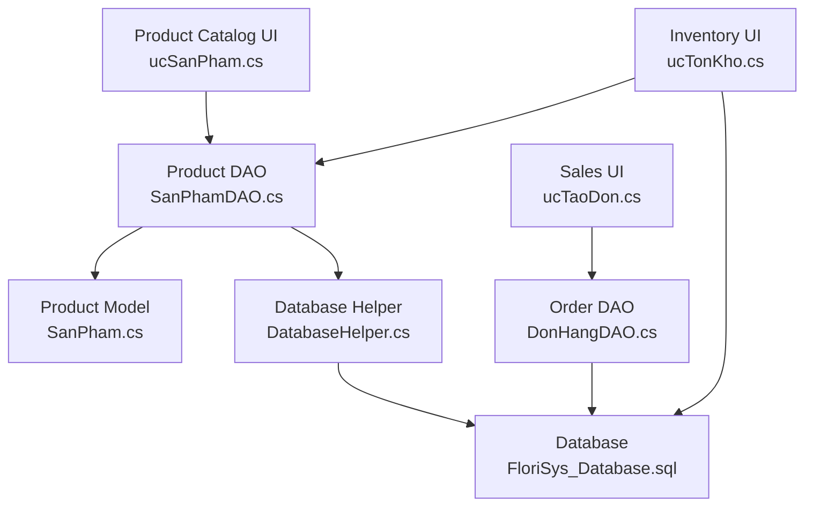
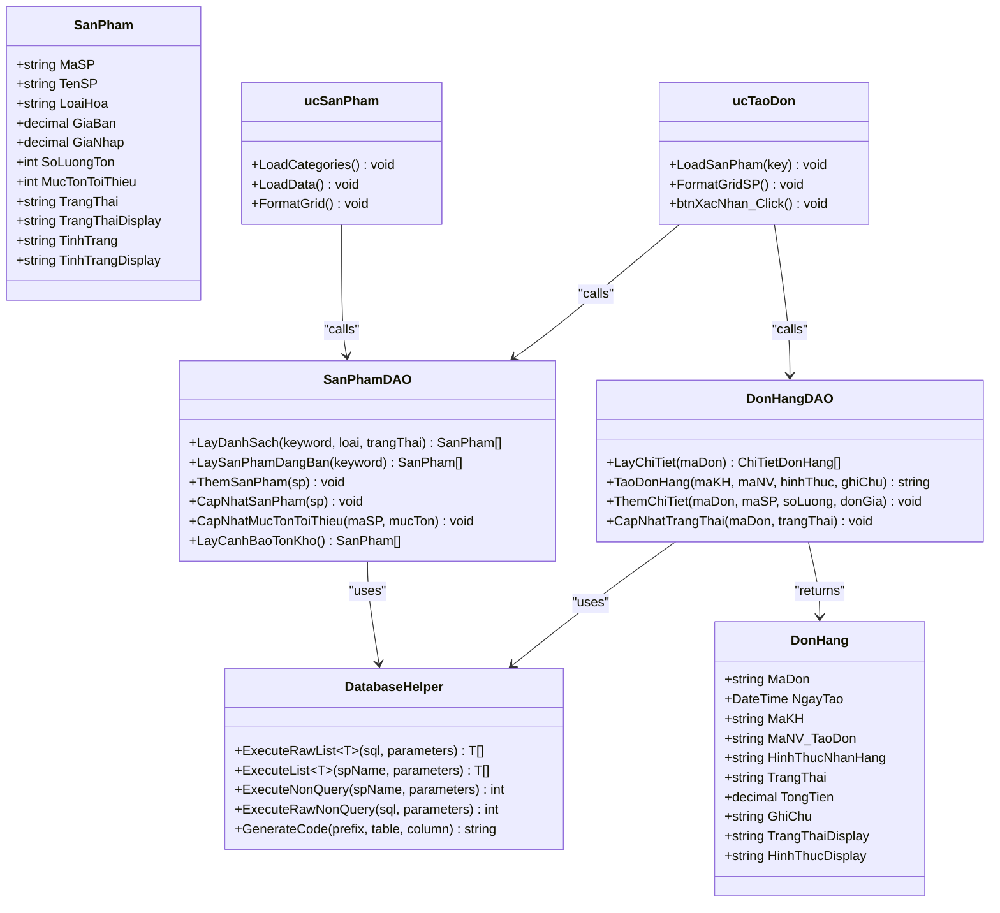
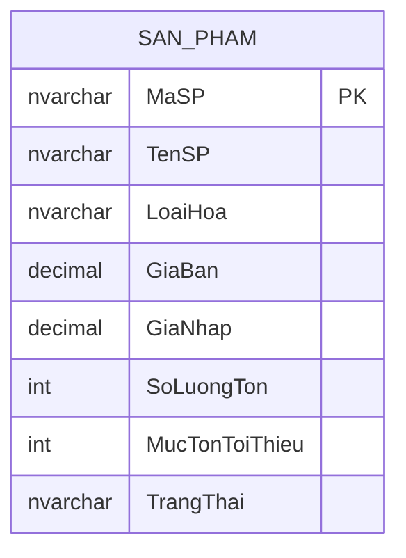
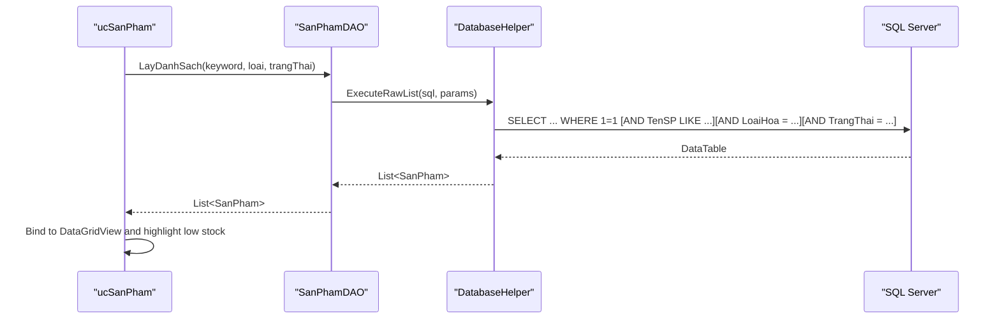
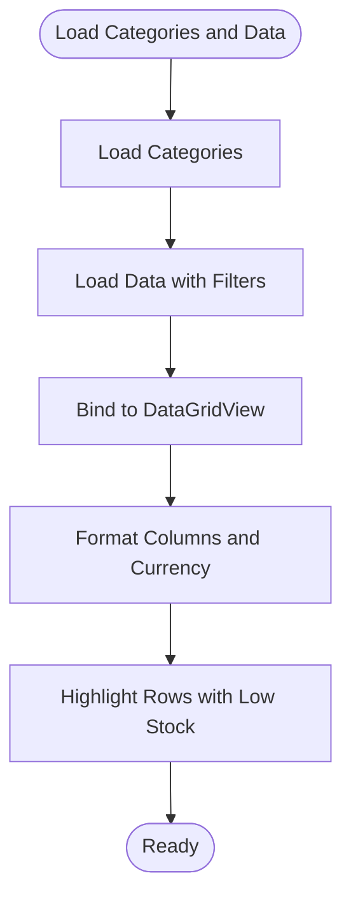
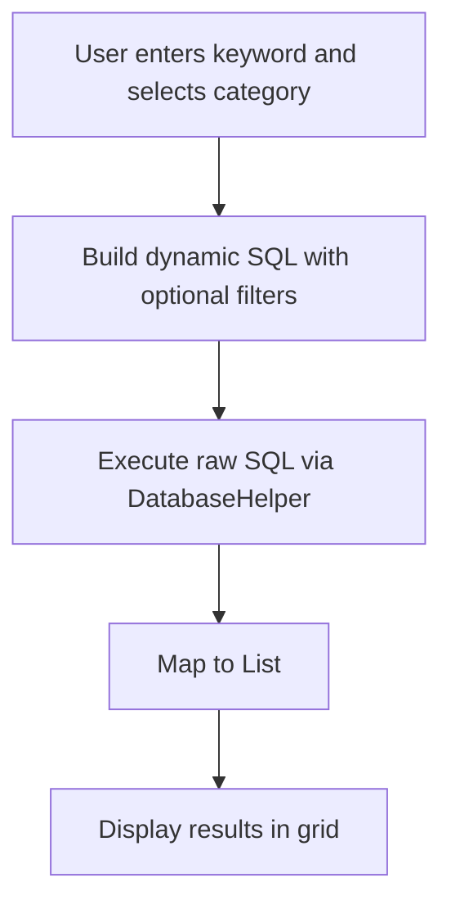
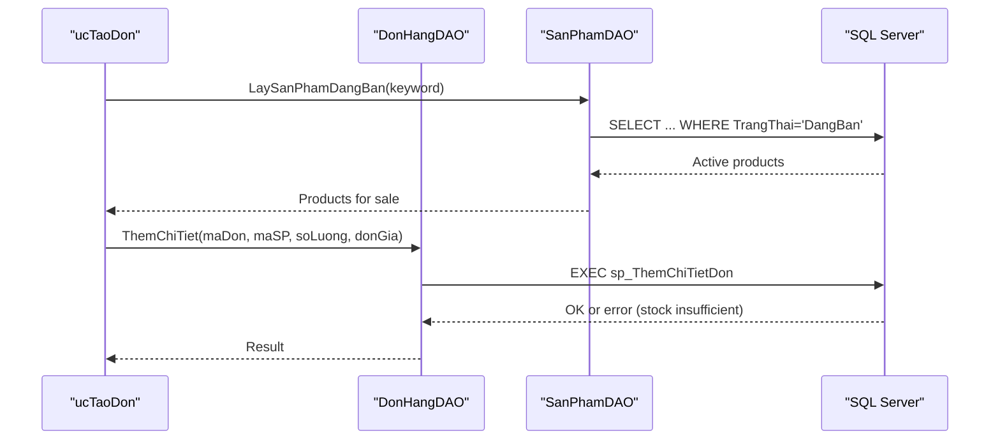
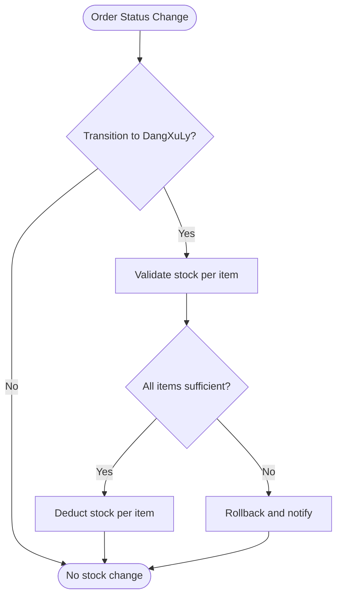
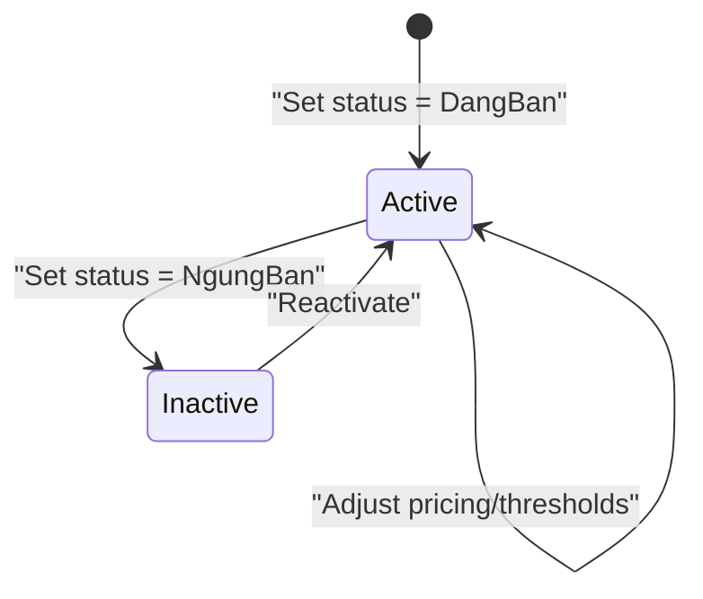
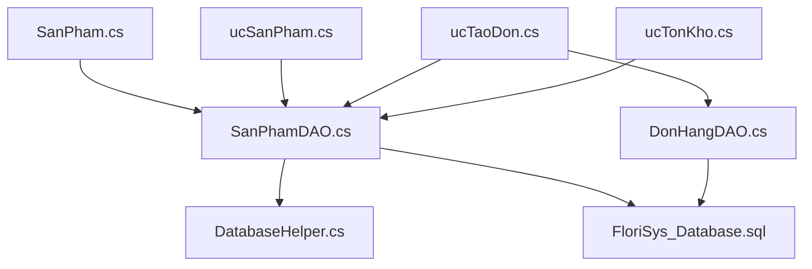

# Product Catalog Management

<cite>
**Referenced Files in This Document**
- [SanPham.cs](file://Models/SanPham.cs)
- [SanPhamDAO.cs](file://DataAccess/SanPhamDAO.cs)
- [DatabaseHelper.cs](file://DataAccess/DatabaseHelper.cs)
- [ucSanPham.cs](file://7_DanhMuc/ucSanPham.cs)
- [ucTaoDon.cs](file://3_BanHang/ucTaoDon.cs)
- [DonHangDAO.cs](file://DataAccess/DonHangDAO.cs)
- [DonHang.cs](file://Models/DonHang.cs)
- [ucTonKho.cs](file://4_KhoHang/ucTonKho.cs)
- [ucHangHu.Designer.cs](file://4_KhoHang/ucHangHu.Designer.cs)
- [FloriSys_Database.sql](file://FloriSys_Database.sql)
- [fix_sp.sql](file://fix_sp.sql)
- [fix_sp2.sql](file://fix_sp2.sql)
- [mock.sql](file://mock.sql)
</cite>

## Table of Contents
1. [Introduction](#introduction)
2. [Project Structure](#project-structure)
3. [Core Components](#core-components)
4. [Architecture Overview](#architecture-overview)
5. [Detailed Component Analysis](#detailed-component-analysis)
6. [Dependency Analysis](#dependency-analysis)
7. [Performance Considerations](#performance-considerations)
8. [Troubleshooting Guide](#troubleshooting-guide)
9. [Conclusion](#conclusion)
10. [Appendices](#appendices)

## Introduction
This document provides comprehensive product catalog management documentation for the FloriSys Sales Management Module. It covers product data modeling, database operations, search and filtering, integration with order processing and inventory, lifecycle management, and operational procedures such as import/export, barcode scanning, and image management. The goal is to enable both technical and non-technical users to understand how products are registered, priced, categorized, inventoried, searched, compared, and managed across the system.

## Project Structure
The product catalog module spans three primary areas:
- Data model layer: product entity definition
- Data access layer: product CRUD and queries
- Presentation layer: product listing, search, and integration with sales and inventory screens

**Diagram sources**
- [ucSanPham.cs:16-45](file://7_DanhMuc/ucSanPham.cs#L16-L45)
- [SanPhamDAO.cs:11-33](file://DataAccess/SanPhamDAO.cs#L11-L33)
- [SanPham.cs:5-40](file://Models/SanPham.cs#L5-L40)
- [DatabaseHelper.cs:104-142](file://DataAccess/DatabaseHelper.cs#L104-L142)
- [ucTaoDon.cs:38-47](file://3_BanHang/ucTaoDon.cs#L38-L47)
- [DonHangDAO.cs:44-51](file://DataAccess/DonHangDAO.cs#L44-L51)
- [ucTonKho.cs:13-36](file://4_KhoHang/ucTonKho.cs#L13-L36)
- [FloriSys_Database.sql:49-58](file://FloriSys_Database.sql#L49-L58)

**Section sources**
- [ucSanPham.cs:16-99](file://7_DanhMuc/ucSanPham.cs#L16-L99)
- [SanPhamDAO.cs:11-95](file://DataAccess/SanPhamDAO.cs#L11-L95)
- [SanPham.cs:5-40](file://Models/SanPham.cs#L5-L40)
- [DatabaseHelper.cs:104-142](file://DataAccess/DatabaseHelper.cs#L104-L142)
- [ucTaoDon.cs:38-85](file://3_BanHang/ucTaoDon.cs#L38-L85)
- [DonHangDAO.cs:44-51](file://DataAccess/DonHangDAO.cs#L44-L51)
- [ucTonKho.cs:13-36](file://4_KhoHang/ucTonKho.cs#L13-L36)
- [FloriSys_Database.sql:49-58](file://FloriSys_Database.sql#L49-L58)

## Core Components
- Product data model: encapsulates product identity, pricing, inventory thresholds, category, and status.
- Product DAO: provides product listing, search, creation, update, minimum stock threshold updates, and stock warning retrieval.
- Database helper: generic SQL/SP execution and mapping utilities.
- Product catalog UI: loads categories, filters by keyword and category, displays product grid with low stock highlighting.
- Order integration: sales screen lists only active products and validates stock during checkout.
- Inventory UI: displays current stock and minimum thresholds for active products.

**Section sources**
- [SanPham.cs:5-40](file://Models/SanPham.cs#L5-L40)
- [SanPhamDAO.cs:11-95](file://DataAccess/SanPhamDAO.cs#L11-L95)
- [DatabaseHelper.cs:16-89](file://DataAccess/DatabaseHelper.cs#L16-L89)
- [ucSanPham.cs:22-72](file://7_DanhMuc/ucSanPham.cs#L22-L72)
- [ucTaoDon.cs:38-85](file://3_BanHang/ucTaoDon.cs#L38-L85)
- [ucTonKho.cs:13-36](file://4_KhoHang/ucTonKho.cs#L13-L36)

## Architecture Overview
The product catalog follows a layered architecture:
- UI layer: Windows Forms user controls for product listing and sales/inventory integration
- Data access layer: DAO classes that call stored procedures and raw SQL via a database helper
- Data model layer: strongly typed models mapped from database results
- Database layer: SQL Server tables, triggers, and stored procedures

**Diagram sources**
- [SanPham.cs:5-40](file://Models/SanPham.cs#L5-L40)
- [SanPhamDAO.cs:11-95](file://DataAccess/SanPhamDAO.cs#L11-L95)
- [DatabaseHelper.cs:16-89](file://DataAccess/DatabaseHelper.cs#L16-L89)
- [ucSanPham.cs:16-99](file://7_DanhMuc/ucSanPham.cs#L16-L99)
- [ucTaoDon.cs:16-162](file://3_BanHang/ucTaoDon.cs#L16-L162)
- [DonHangDAO.cs:44-98](file://DataAccess/DonHangDAO.cs#L44-L98)
- [DonHang.cs:6-62](file://Models/DonHang.cs#L6-L62)

## Detailed Component Analysis

### Product Data Model
The product model defines the core attributes used across catalog, sales, and inventory:
- Identity: product code and name
- Category: flower type/category
- Pricing: selling price and cost price
- Inventory: current stock and minimum threshold
- Status: active/inactive flag
- Display helpers: localized status and stock condition labels

**Diagram sources**
- [FloriSys_Database.sql:49-58](file://FloriSys_Database.sql#L49-L58)

**Section sources**
- [SanPham.cs:5-40](file://Models/SanPham.cs#L5-L40)
- [FloriSys_Database.sql:49-58](file://FloriSys_Database.sql#L49-L58)

### Product DAO and Queries
The product DAO exposes:
- Search and filter by keyword, category, and status
- Listing of currently active products for sales
- Creation and update of product records
- Minimum stock threshold updates
- Stock warning retrieval via stored procedure

**Diagram sources**
- [ucSanPham.cs:31-45](file://7_DanhMuc/ucSanPham.cs#L31-L45)
- [SanPhamDAO.cs:11-33](file://DataAccess/SanPhamDAO.cs#L11-L33)
- [DatabaseHelper.cs:28-32](file://DataAccess/DatabaseHelper.cs#L28-L32)

**Section sources**
- [SanPhamDAO.cs:11-95](file://DataAccess/SanPhamDAO.cs#L11-L95)
- [DatabaseHelper.cs:28-32](file://DataAccess/DatabaseHelper.cs#L28-L32)

### Product Catalog UI
The product catalog screen:
- Loads predefined categories and applies “all types” option
- Filters products by keyword and category
- Displays product grid with formatted currency and low stock highlighting
- Provides placeholders for add/edit actions

**Diagram sources**
- [ucSanPham.cs:22-72](file://7_DanhMuc/ucSanPham.cs#L22-L72)

**Section sources**
- [ucSanPham.cs:22-72](file://7_DanhMuc/ucSanPham.cs#L22-L72)

### Product Search and Filtering
Search and filtering are implemented server-side:
- Keyword filter on product name
- Category filter on product category
- Status filter for active/inactive listings
- Specialized listing for active products in sales UI

**Diagram sources**
- [SanPhamDAO.cs:11-33](file://DataAccess/SanPhamDAO.cs#L11-L33)
- [DatabaseHelper.cs:124-142](file://DataAccess/DatabaseHelper.cs#L124-L142)

**Section sources**
- [SanPhamDAO.cs:11-33](file://DataAccess/SanPhamDAO.cs#L11-L33)
- [ucSanPham.cs:31-45](file://7_DanhMuc/ucSanPham.cs#L31-L45)

### Product Comparison Features
The current implementation does not expose a dedicated product comparison feature. To support comparison:
- Extend the product grid to allow selection of multiple rows
- Add a comparison panel to display selected product attributes side-by-side
- Integrate with the existing product model and DAO for data retrieval

[No sources needed since this section proposes enhancements not present in the current codebase]

### Bulk Product Operations
Bulk operations are not implemented in the current codebase. Recommended operations:
- Bulk import: CSV upload with validation against product schema
- Bulk update: change price, category, or thresholds in batch
- Bulk export: filtered product lists to CSV/XLSX
Implementation would leverage the existing DAO and database helper with transactional updates.

[No sources needed since this section proposes enhancements not present in the current codebase]

### Integration Between Product Catalog and Order Processing
Real-time inventory and price validation during order creation:
- Sales UI lists only active products
- Stock availability checked before adding items
- Price validation occurs at order creation time
- Order status transitions trigger inventory adjustments via stored procedures

**Diagram sources**
- [ucTaoDon.cs:38-85](file://3_BanHang/ucTaoDon.cs#L38-L85)
- [DonHangDAO.cs:80-89](file://DataAccess/DonHangDAO.cs#L80-L89)
- [SanPhamDAO.cs:35-47](file://DataAccess/SanPhamDAO.cs#L35-L47)

**Section sources**
- [ucTaoDon.cs:38-85](file://3_BanHang/ucTaoDon.cs#L38-L85)
- [DonHangDAO.cs:80-89](file://DataAccess/DonHangDAO.cs#L80-L89)
- [SanPhamDAO.cs:35-47](file://DataAccess/SanPhamDAO.cs#L35-L47)

### Real-Time Inventory Updates and Price Validation
- Inventory updates occur via triggers on purchase transactions
- Price validation is enforced by stored procedures during order detail insertion
- Order status transitions adjust inventory accordingly

**Diagram sources**
- [DonHangDAO.cs:91-98](file://DataAccess/DonHangDAO.cs#L91-L98)
- [DonHang.cs:6-62](file://Models/DonHang.cs#L6-L62)

**Section sources**
- [DonHangDAO.cs:91-98](file://DataAccess/DonHangDAO.cs#L91-L98)
- [DonHang.cs:6-62](file://Models/DonHang.cs#L6-L62)

### Product Lifecycle Management
Lifecycle stages supported:
- Launch: set status to active and configure category/pricing
- Discontinuation: set status to inactive
- Seasonal adjustments: update pricing and thresholds as needed

**Diagram sources**
- [SanPhamDAO.cs:64-78](file://DataAccess/SanPhamDAO.cs#L64-L78)
- [SanPham.cs:16-22](file://Models/SanPham.cs#L16-L22)

**Section sources**
- [SanPhamDAO.cs:64-78](file://DataAccess/SanPhamDAO.cs#L64-L78)
- [SanPham.cs:16-22](file://Models/SanPham.cs#L16-L22)

### Procedures for Product Data Import/Export
- Import: CSV upload with validation against product schema; insert via DAO
- Export: filtered product lists to CSV/XLSX using current grid data binding
- Barcode scanning: integrate scanner input into product search/filter fields
- Image management: extend product model and DAO to include image path; update UI to display images

[No sources needed since this section proposes enhancements not present in the current codebase]

### Examples of Product Management Workflows
- Register a new product: use DAO insert method with validated inputs
- Update pricing and thresholds: use DAO update method
- Activate/deactivate a product: update status field via DAO
- View stock warnings: call stock warning stored procedure via DAO

**Section sources**
- [SanPhamDAO.cs:49-78](file://DataAccess/SanPhamDAO.cs#L49-L78)
- [SanPhamDAO.cs:90-93](file://DataAccess/SanPhamDAO.cs#L90-L93)

### Integration with Inventory Management Systems
- Current integration: stock visibility and alerts via stored procedure
- Enhanced integration: synchronize stock thresholds and status with external systems
- Historical tracking: leverage existing triggers and stored procedures for audit trails

**Section sources**
- [SanPhamDAO.cs:90-93](file://DataAccess/SanPhamDAO.cs#L90-L93)
- [FloriSys_Database.sql:206-247](file://FloriSys_Database.sql#L206-L247)

## Dependency Analysis
The product catalog depends on:
- Database schema for product definitions and constraints
- Stored procedures for search, stock warnings, and code generation
- DAO and helper classes for data access and mapping
- UI components for presentation and user interaction

**Diagram sources**
- [SanPham.cs:5-40](file://Models/SanPham.cs#L5-L40)
- [SanPhamDAO.cs:11-95](file://DataAccess/SanPhamDAO.cs#L11-L95)
- [DatabaseHelper.cs:16-89](file://DataAccess/DatabaseHelper.cs#L16-L89)
- [ucSanPham.cs:16-99](file://7_DanhMuc/ucSanPham.cs#L16-L99)
- [ucTaoDon.cs:16-162](file://3_BanHang/ucTaoDon.cs#L16-L162)
- [DonHangDAO.cs:44-98](file://DataAccess/DonHangDAO.cs#L44-L98)
- [ucTonKho.cs:13-36](file://4_KhoHang/ucTonKho.cs#L13-L36)
- [FloriSys_Database.sql:49-58](file://FloriSys_Database.sql#L49-L58)

**Section sources**
- [SanPhamDAO.cs:11-95](file://DataAccess/SanPhamDAO.cs#L11-L95)
- [DatabaseHelper.cs:16-89](file://DataAccess/DatabaseHelper.cs#L16-L89)
- [ucSanPham.cs:16-99](file://7_DanhMuc/ucSanPham.cs#L16-L99)
- [ucTaoDon.cs:16-162](file://3_BanHang/ucTaoDon.cs#L16-L162)
- [DonHangDAO.cs:44-98](file://DataAccess/DonHangDAO.cs#L44-L98)
- [ucTonKho.cs:13-36](file://4_KhoHang/ucTonKho.cs#L13-L36)
- [FloriSys_Database.sql:49-58](file://FloriSys_Database.sql#L49-L58)

## Performance Considerations
- Use indexed columns for frequent filters (product name, category, status)
- Prefer stored procedures for complex queries to reduce round trips
- Batch updates for bulk operations to minimize transaction overhead
- Optimize grid rendering by limiting visible columns and applying formatting efficiently

[No sources needed since this section provides general guidance]

## Troubleshooting Guide
Common issues and resolutions:
- Stock insufficient during checkout: verify product stock and thresholds; adjust quantities
- Search returns unexpected results: confirm filter parameters and SQL conditions
- UI not reflecting updates: refresh data binding after DAO operations
- Inventory discrepancies: review triggers and stored procedures for stock adjustments

**Section sources**
- [ucTaoDon.cs:69-77](file://3_BanHang/ucTaoDon.cs#L69-L77)
- [SanPhamDAO.cs:11-33](file://DataAccess/SanPhamDAO.cs#L11-L33)
- [ucSanPham.cs:31-45](file://7_DanhMuc/ucSanPham.cs#L31-L45)
- [FloriSys_Database.sql:206-247](file://FloriSys_Database.sql#L206-L247)

## Conclusion
The FloriSys product catalog module provides a solid foundation for product registration, pricing, inventory linkage, and search/filtering. Its integration with order processing ensures real-time inventory updates and price validation. Extending the system with bulk operations, import/export, barcode scanning, and image management will further enhance operational efficiency and user experience.

## Appendices
- Stored procedures and triggers supporting product catalog and inventory workflows
- Sample data initialization for demonstration and testing

**Section sources**
- [FloriSys_Database.sql:250-563](file://FloriSys_Database.sql#L250-L563)
- [fix_sp.sql:2-35](file://fix_sp.sql#L2-L35)
- [fix_sp2.sql:2-34](file://fix_sp2.sql#L2-L34)
- [mock.sql:1-62](file://mock.sql#L1-L62)