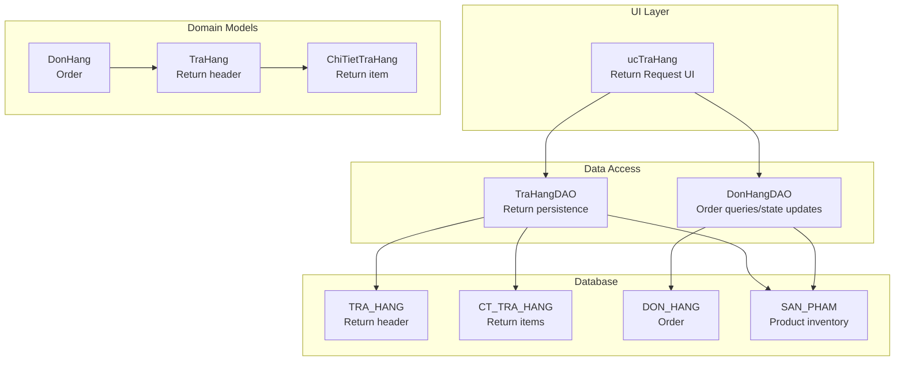
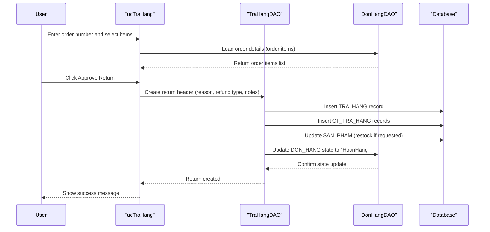
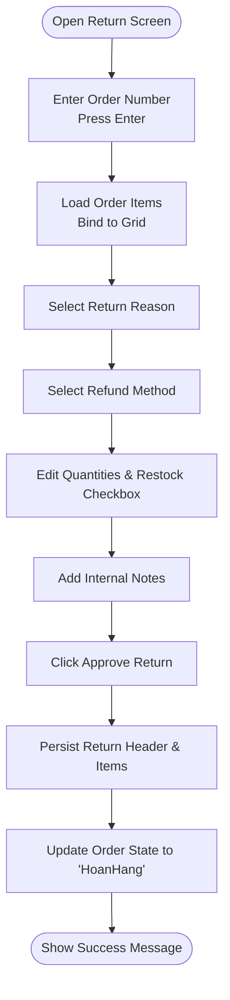
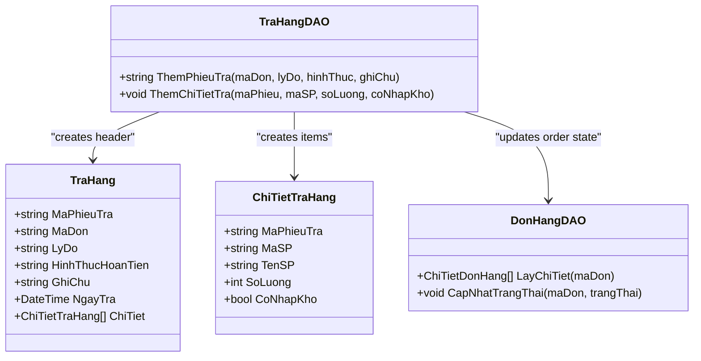
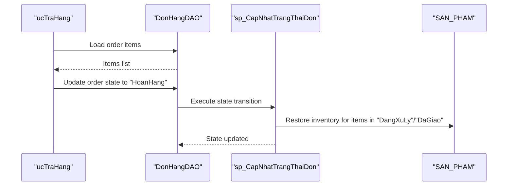
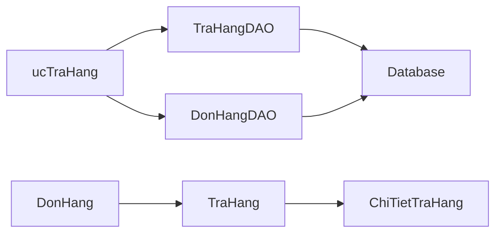

# Return Management

<cite>
**Referenced Files in This Document**
- [ucTraHang.cs](file://3_BanHang/ucTraHang.cs)
- [ucTraHang.Designer.cs](file://3_BanHang/ucTraHang.Designer.cs)
- [TraHangDAO.cs](file://DataAccess/TraHangDAO.cs)
- [DonHangDAO.cs](file://DataAccess/DonHangDAO.cs)
- [TraHang.cs](file://Models/TraHang.cs)
- [DonHang.cs](file://Models/DonHang.cs)
- [FloriSys_Database.sql](file://FloriSys_Database.sql)
- [Giao_dien.html](file://Giao_dien.html)
- [ucBaoCao.cs](file://6_BaoCao/ucBaoCao.cs)
- [BaoCaoDAO.cs](file://DataAccess/BaoCaoDAO.cs)
</cite>

## Table of Contents
1. [Introduction](#introduction)
2. [Project Structure](#project-structure)
3. [Core Components](#core-components)
4. [Architecture Overview](#architecture-overview)
5. [Detailed Component Analysis](#detailed-component-analysis)
6. [Dependency Analysis](#dependency-analysis)
7. [Performance Considerations](#performance-considerations)
8. [Troubleshooting Guide](#troubleshooting-guide)
9. [Conclusion](#conclusion)
10. [Appendices](#appendices)

## Introduction
This document describes the return management capabilities within the FloriSys Sales Management Module. It covers the end-to-end return workflow from initiation to resolution, including user interface components, business rules, inventory adjustments, and integration points with order history and reporting. It also outlines return policy enforcement, refund processing, analytics, reason codes, and customer satisfaction metrics derived from return data.

## Project Structure
Return-related functionality is implemented in the Sales module (3_BanHang) with supporting data access and model definitions. The database schema defines dedicated tables for return records and return details, along with stored procedures that coordinate order state transitions and inventory adjustments.

**Diagram sources**
- [ucTraHang.cs:10-129](file://3_BanHang/ucTraHang.cs#L10-L129)
- [TraHangDAO.cs:9-48](file://DataAccess/TraHangDAO.cs#L9-L48)
- [DonHangDAO.cs:44-98](file://DataAccess/DonHangDAO.cs#L44-L98)
- [TraHang.cs:6-40](file://Models/TraHang.cs#L6-L40)
- [DonHang.cs:6-51](file://Models/DonHang.cs#L6-L51)
- [FloriSys_Database.sql:182-202](file://FloriSys_Database.sql#L182-L202)

**Section sources**
- [ucTraHang.cs:10-129](file://3_BanHang/ucTraHang.cs#L10-L129)
- [ucTraHang.Designer.cs:18-274](file://3_BanHang/ucTraHang.Designer.cs#L18-L274)
- [TraHangDAO.cs:9-48](file://DataAccess/TraHangDAO.cs#L9-L48)
- [DonHangDAO.cs:44-98](file://DataAccess/DonHangDAO.cs#L44-L98)
- [TraHang.cs:6-40](file://Models/TraHang.cs#L6-L40)
- [DonHang.cs:6-51](file://Models/DonHang.cs#L6-L51)
- [FloriSys_Database.sql:182-202](file://FloriSys_Database.sql#L182-L202)

## Core Components
- Return Request UI (ucTraHang): Allows entering the originating order, selecting return reasons, specifying products to return, quantities, and whether to restock inventory. It also captures internal notes and refund method selection.
- Return Data Access (TraHangDAO): Creates return headers, inserts return items, and adjusts product inventory when items are restocked.
- Order Data Access (DonHangDAO): Loads order details for the selected order and updates order state to “HoanHang” upon return creation.
- Domain Models: TraHang and ChiTietTraHang represent return records and items; DonHang encapsulates order metadata and state.
- Database Schema: TRA_HANG and CT_TRA_HANG store return records and items; sp_CapNhatTrangThaiDon coordinates order state transitions and inventory adjustments.

**Section sources**
- [ucTraHang.cs:30-127](file://3_BanHang/ucTraHang.cs#L30-L127)
- [TraHangDAO.cs:9-48](file://DataAccess/TraHangDAO.cs#L9-L48)
- [DonHangDAO.cs:44-98](file://DataAccess/DonHangDAO.cs#L44-L98)
- [TraHang.cs:6-40](file://Models/TraHang.cs#L6-L40)
- [DonHang.cs:6-51](file://Models/DonHang.cs#L6-L51)
- [FloriSys_Database.sql:182-202](file://FloriSys_Database.sql#L182-L202)

## Architecture Overview
The return workflow integrates UI, data access, domain models, and database logic. The UI triggers a return creation process that persists return records, updates order state, and optionally increases inventory.

**Diagram sources**
- [ucTraHang.cs:44-127](file://3_BanHang/ucTraHang.cs#L44-L127)
- [TraHangDAO.cs:9-48](file://DataAccess/TraHangDAO.cs#L9-L48)
- [DonHangDAO.cs:91-98](file://DataAccess/DonHangDAO.cs#L91-L98)
- [FloriSys_Database.sql:317-357](file://FloriSys_Database.sql#L317-L357)

## Detailed Component Analysis

### Return Request UI (ucTraHang)
- Purpose: Facilitates return initiation by binding to an existing order, displaying order items, enabling selection of returnable items, quantity input, and restocking preference.
- Controls:
  - Order ID input with Enter-triggered loading.
  - Reason dropdown with predefined categories (e.g., flower wilted/broken, wrong item, late delivery during holidays, customer change of mind).
  - Refund method dropdown (full refund, partial refund, no refund).
  - Product grid with editable return quantities and a restock checkbox per item.
  - Internal notes field.
  - Approve button to finalize the return.
- Behavior:
  - On Enter in order ID, loads order items into a grid.
  - On approve, creates a return header and items, then shows a success message.

**Diagram sources**
- [ucTraHang.cs:21-127](file://3_BanHang/ucTraHang.cs#L21-L127)
- [ucTraHang.Designer.cs:18-274](file://3_BanHang/ucTraHang.Designer.cs#L18-L274)

**Section sources**
- [ucTraHang.cs:14-127](file://3_BanHang/ucTraHang.cs#L14-L127)
- [ucTraHang.Designer.cs:18-274](file://3_BanHang/ucTraHang.Designer.cs#L18-L274)

### Return Data Access (TraHangDAO)
- Responsibilities:
  - Generate return ID and insert a TRA_HANG record with reason, refund method, and notes.
  - Insert CT_TRA_HANG entries for each returned product with quantity and restock flag.
  - Adjust SAN_PHAM inventory upward when restock is requested.
  - Update DON_HANG state to “HoanHang” via DonHangDAO.
- Inventory Adjustment:
  - When CoNhapKho is true, increment product stock by returned quantity.

**Diagram sources**
- [TraHangDAO.cs:9-48](file://DataAccess/TraHangDAO.cs#L9-L48)
- [DonHangDAO.cs:44-98](file://DataAccess/DonHangDAO.cs#L44-L98)
- [TraHang.cs:6-40](file://Models/TraHang.cs#L6-L40)

**Section sources**
- [TraHangDAO.cs:9-48](file://DataAccess/TraHangDAO.cs#L9-L48)
- [DonHangDAO.cs:91-98](file://DataAccess/DonHangDAO.cs#L91-L98)
- [TraHang.cs:6-40](file://Models/TraHang.cs#L6-L40)

### Order Integration and State Transitions
- Order Details Loading: Retrieves order items for the given order ID to populate the return grid.
- State Transition: After a return is created, the order state moves to “HoanHang,” triggering inventory restoration for eligible items according to the stored procedure logic.

**Diagram sources**
- [DonHangDAO.cs:44-98](file://DataAccess/DonHangDAO.cs#L44-L98)
- [FloriSys_Database.sql:317-357](file://FloriSys_Database.sql#L317-L357)

**Section sources**
- [DonHangDAO.cs:44-98](file://DataAccess/DonHangDAO.cs#L44-L98)
- [FloriSys_Database.sql:317-357](file://FloriSys_Database.sql#L317-L357)

### Business Rules and Policy Enforcement
- Eligibility:
  - Returns apply to orders whose state supports reversal (e.g., “DangXuLy”, “DaGiao”). The stored procedure enforces inventory restoration only for these states.
- Reason Codes:
  - Predefined reasons include flower wilted/broken, wrong item delivered, late delivery during holidays, and customer change of mind.
- Refund Methods:
  - Options include full refund, partial refund, or no refund. These are persisted in TRA_HANG for audit and reporting.
- Inventory Handling:
  - Returned items can be restocked automatically if the restock flag is enabled for each item.

**Section sources**
- [ucTraHang.cs:30-42](file://3_BanHang/ucTraHang.cs#L30-L42)
- [TraHangDAO.cs:22-48](file://DataAccess/TraHangDAO.cs#L22-L48)
- [FloriSys_Database.sql:344-355](file://FloriSys_Database.sql#L344-L355)

### Refund Processing Workflow
- The UI collects refund method selection and notes. The DAO persists this information with the return record. The stored procedure manages order state transitions and inventory adjustments. Payment processing is not implemented in the current codebase; refunds are recorded in TRA_HANG for administrative tracking.

**Section sources**
- [ucTraHang.cs:97-127](file://3_BanHang/ucTraHang.cs#L97-L127)
- [TraHangDAO.cs:9-25](file://DataAccess/TraHangDAO.cs#L9-L25)
- [TraHang.cs:18-30](file://Models/TraHang.cs#L18-L30)

### Return Tracking and Visibility
- Return Records: Each return is uniquely identified by MaPhieuTra and linked to the originating order via MaDon.
- Item-Level Tracking: CT_TRA_HANG stores returned products, quantities, and restock decisions.
- Order Status: Orders in “HoanHang” reflect that a return has been initiated.

**Section sources**
- [FloriSys_Database.sql:182-202](file://FloriSys_Database.sql#L182-L202)
- [DonHang.cs:27-42](file://Models/DonHang.cs#L27-L42)

### Handling Damaged/Wrong Items and Customer Satisfaction Returns
- Damaged Items: Select “flower wilted/broken” as the reason; optionally restock if the item is eligible for reuse.
- Wrong Items: Select “wrong item delivered”; choose appropriate refund method.
- Customer Satisfaction Returns: Select “customer change of mind” and decide refund amount; restock if applicable.

**Section sources**
- [ucTraHang.cs:30-42](file://3_BanHang/ucTraHang.cs#L30-L42)
- [TraHangDAO.cs:27-48](file://DataAccess/TraHangDAO.cs#L27-L48)

### Return Shipping Label Generation
- Not implemented in the current codebase. The UI and DAO do not expose shipping label generation. If needed, integrate with a shipping provider API and persist label metadata in a new table or extend TRA_HANG.

**Section sources**
- [ucTraHang.cs:97-127](file://3_BanHang/ucTraHang.cs#L97-L127)
- [TraHangDAO.cs:9-48](file://DataAccess/TraHangDAO.cs#L9-L48)

### Return Processing Timeframes
- The code does not define SLAs for return processing. Timeframes can be introduced by adding timestamps (e.g., date accepted, processed, shipped) to TRA_HANG and enforcing policies in the UI or service layer.

**Section sources**
- [TraHang.cs:13-13](file://Models/TraHang.cs#L13-L13)

### Quality Assurance Procedures
- Data Validation:
  - Ensure order exists and is eligible for return before creating TRA_HANG.
  - Validate returned quantities do not exceed ordered quantities.
- Inventory Integrity:
  - Verify product stock updates occur only when restock is requested.
- Audit Trail:
  - Store reason, refund method, and notes for each return.

**Section sources**
- [TraHangDAO.cs:27-48](file://DataAccess/TraHangDAO.cs#L27-L48)
- [DonHangDAO.cs:44-51](file://DataAccess/DonHangDAO.cs#L44-L51)

## Dependency Analysis
- ucTraHang depends on DonHangDAO for order item loading and on TraHangDAO for persisting returns.
- TraHangDAO depends on DatabaseHelper for SQL execution and on DonHangDAO to update order state.
- Domain models (TraHang, ChiTietTraHang, DonHang) define the contract for return and order data.

**Diagram sources**
- [ucTraHang.cs:44-127](file://3_BanHang/ucTraHang.cs#L44-L127)
- [TraHangDAO.cs:9-48](file://DataAccess/TraHangDAO.cs#L9-L48)
- [DonHangDAO.cs:44-98](file://DataAccess/DonHangDAO.cs#L44-L98)
- [TraHang.cs:6-40](file://Models/TraHang.cs#L6-L40)
- [DonHang.cs:6-51](file://Models/DonHang.cs#L6-L51)

**Section sources**
- [ucTraHang.cs:44-127](file://3_BanHang/ucTraHang.cs#L44-L127)
- [TraHangDAO.cs:9-48](file://DataAccess/TraHangDAO.cs#L9-L48)
- [DonHangDAO.cs:44-98](file://DataAccess/DonHangDAO.cs#L44-L98)
- [TraHang.cs:6-40](file://Models/TraHang.cs#L6-L40)
- [DonHang.cs:6-51](file://Models/DonHang.cs#L6-L51)

## Performance Considerations
- Grid Rendering: Large order item lists can impact grid rendering performance; consider virtualization or pagination.
- Batch Inserts: Persisting multiple return items can be optimized by batching database calls.
- Stored Procedure Efficiency: The state transition and inventory restoration logic is centralized in sp_CapNhatTrangThaiDon; ensure indexes exist on DON_HANG and CHI_TIET_DON_HANG for optimal performance.

[No sources needed since this section provides general guidance]

## Troubleshooting Guide
- Order Not Found:
  - Ensure the entered order number exists and is eligible for return.
- Return Quantity Exceeds Ordered:
  - Validate item quantities against order details before submission.
- Inventory Not Restocked:
  - Confirm the restock checkbox is selected for each item.
- State Update Fails:
  - Check stored procedure execution and order state transitions.

**Section sources**
- [ucTraHang.cs:51-81](file://3_BanHang/ucTraHang.cs#L51-L81)
- [TraHangDAO.cs:27-48](file://DataAccess/TraHangDAO.cs#L27-L48)
- [DonHangDAO.cs:91-98](file://DataAccess/DonHangDAO.cs#L91-L98)

## Conclusion
The FloriSys return management module provides a streamlined workflow for initiating returns, selecting reasons and refund methods, and adjusting inventory. It integrates with order history and leverages stored procedures to maintain data consistency. Extending the system with shipping label generation, refund processing hooks, and SLAs would further enhance operational efficiency and customer satisfaction.

[No sources needed since this section summarizes without analyzing specific files]

## Appendices

### Return Analytics and Metrics
- Reporting:
  - Use BaoCaoDAO to query sales excluding returns and to compute top-performing products and staff performance.
- Return Tracking:
  - Track return counts and reasons via TRA_HANG and CT_TRA_HANG for trend analysis.
- UI Integration:
  - The reporting module (ucBaoCao) demonstrates how reports are loaded dynamically; similar patterns can be applied to return analytics screens.

**Section sources**
- [BaoCaoDAO.cs:11-164](file://DataAccess/BaoCaoDAO.cs#L11-L164)
- [ucBaoCao.cs:14-55](file://6_BaoCao/ucBaoCao.cs#L14-L55)
- [FloriSys_Database.sql:53-70](file://FloriSys_Database.sql#L53-L70)

### Example Scenarios
- Damaged Item Return:
  - Select reason “flower wilted/broken,” enter quantity, check restock if reusable, choose refund method, and submit.
- Wrong Item Return:
  - Select reason “wrong item delivered,” specify quantities, decide refund, and approve.
- Customer Satisfaction Return:
  - Select reason “customer change of mind,” choose partial/full/no refund, and approve.

**Section sources**
- [ucTraHang.cs:30-42](file://3_BanHang/ucTraHang.cs#L30-L42)
- [ucTraHang.cs:97-127](file://3_BanHang/ucTraHang.cs#L97-L127)