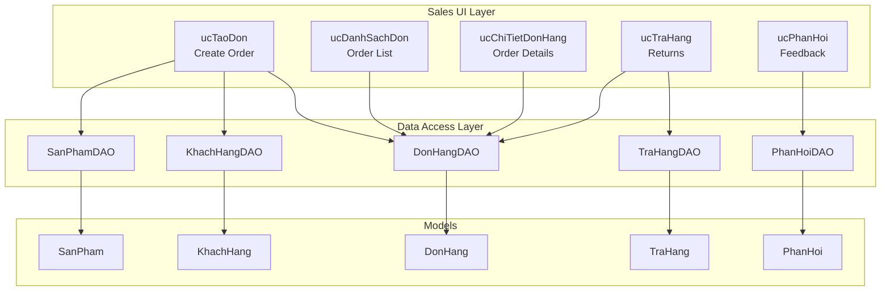
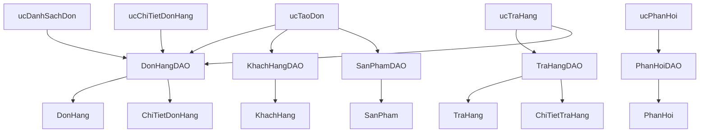
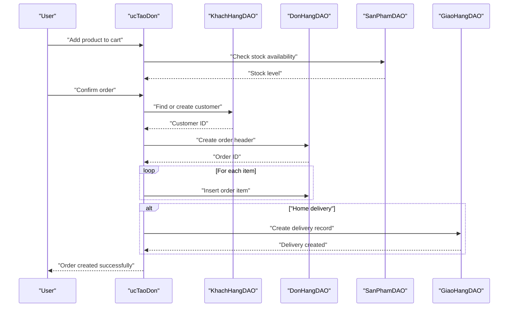
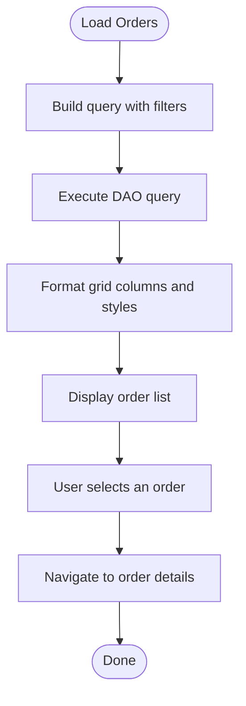
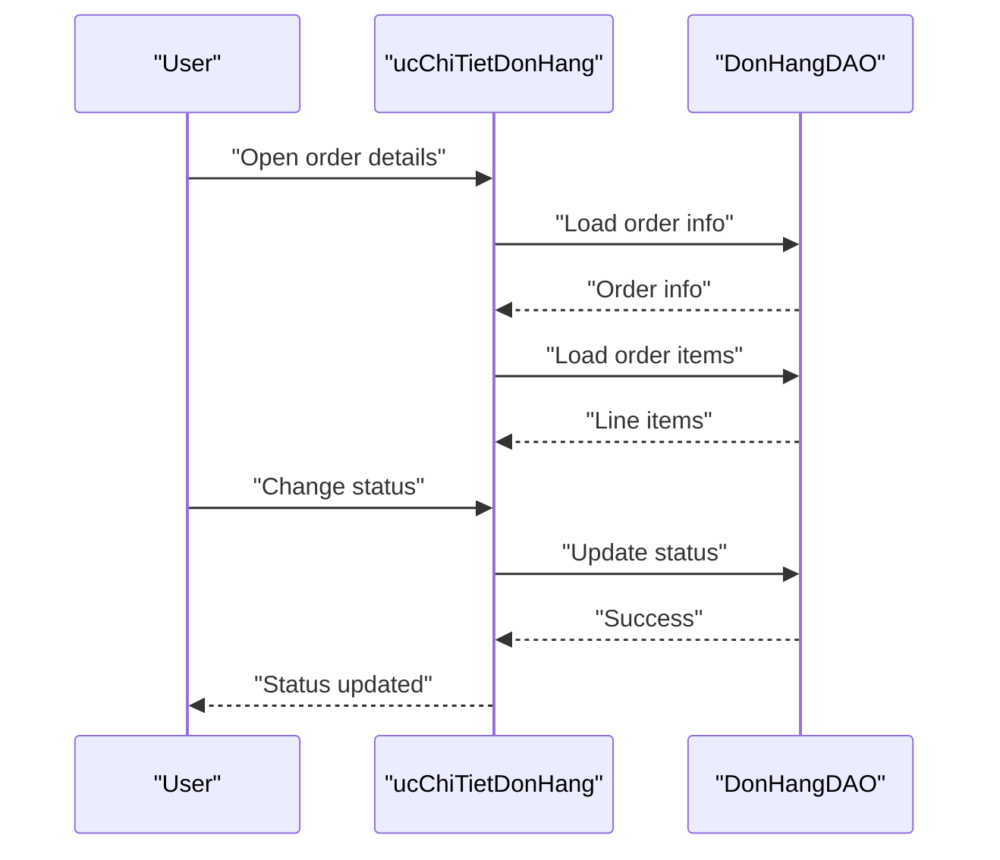
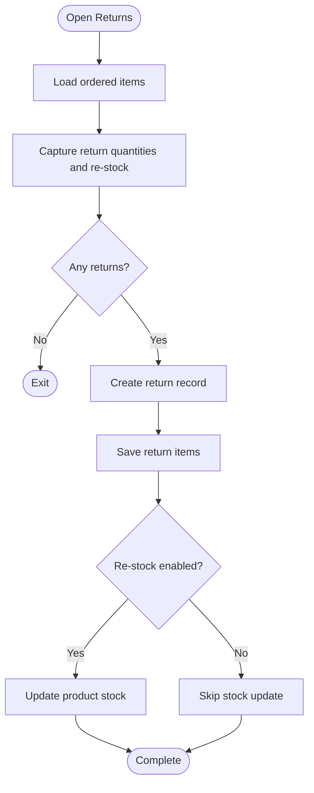
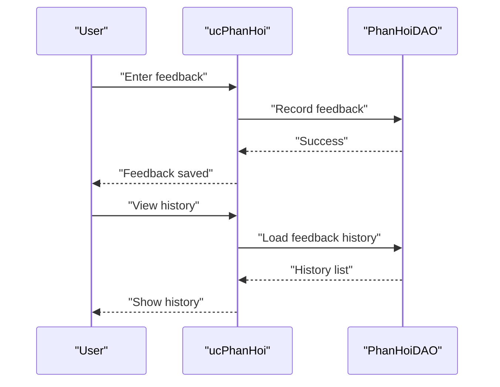
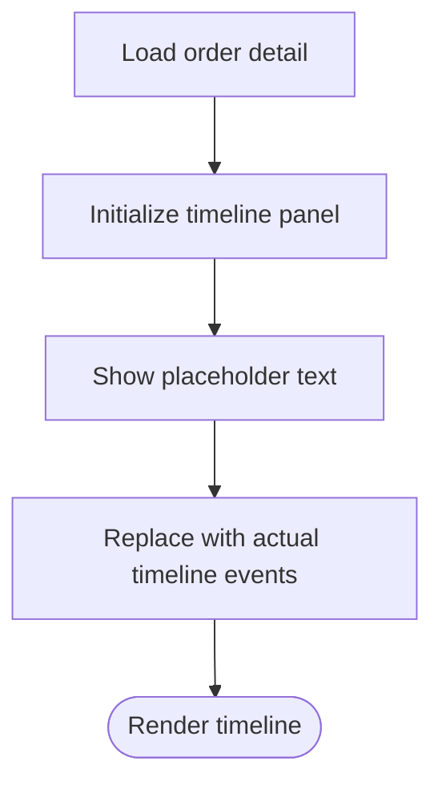
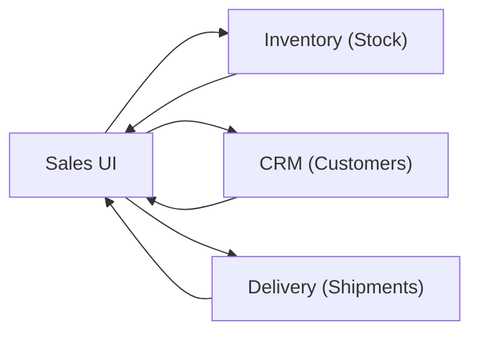
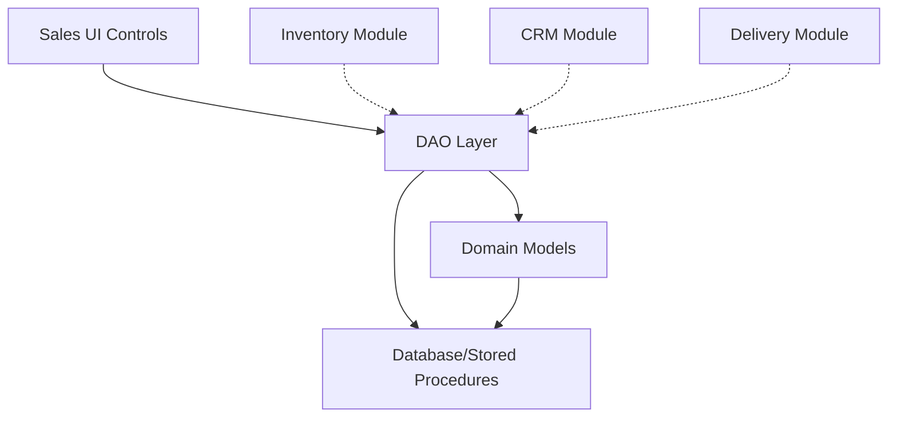

# Sales Management Module

<cite>
**Referenced Files in This Document**
- [ucTaoDon.cs](file://3_BanHang/ucTaoDon.cs)
- [ucDanhSachDon.cs](file://3_BanHang/ucDanhSachDon.cs)
- [ucChiTietDonHang.cs](file://3_BanHang/ucChiTietDonHang.cs)
- [ucTraHang.cs](file://3_BanHang/ucTraHang.cs)
- [ucPhanHoi.cs](file://3_BanHang/ucPhanHoi.cs)
- [DonHangDAO.cs](file://DataAccess/DonHangDAO.cs)
- [KhachHangDAO.cs](file://DataAccess/KhachHangDAO.cs)
- [SanPhamDAO.cs](file://DataAccess/SanPhamDAO.cs)
- [TraHangDAO.cs](file://DataAccess/TraHangDAO.cs)
- [PhanHoiDAO.cs](file://DataAccess/PhanHoiDAO.cs)
- [DonHang.cs](file://Models/DonHang.cs)
- [KhachHang.cs](file://Models/KhachHang.cs)
- [SanPham.cs](file://Models/SanPham.cs)
- [TraHang.cs](file://Models/TraHang.cs)
- [PhanHoi.cs](file://Models/PhanHoi.cs)
- [frmMain.cs](file://2_QuanLy/frmMain.cs)
- [ucDashboard.cs](file://2_QuanLy/ucDashboard.cs)
- [ucDashboardBanHang.cs](file://3_BanHang/ucDashboardBanHang.cs)
- [ucKhachHang.cs](file://7_DanhMuc/ucKhachHang.cs)
- [ucSanPham.cs](file://7_DanhMuc/ucSanPham.cs)
- [ucBaoCao.cs](file://6_BaoCao/ucBaoCao.cs)
- [ucBaoCaoNgay.cs](file://6_BaoCao/ucBaoCaoNgay.cs)
- [ucBaoCaoNhanVien.cs](file://6_BaoCao/ucBaoCaoNhanVien.cs)
- [ucBaoCaoSanPham.cs](file://6_BaoCao/ucBaoCaoSanPham.cs)
- [ucBaoCaoThang.cs](file://6_BaoCao/ucBaoCaoThang.cs)
- [ucBaoCaoTonKho.cs](file://6_BaoCao/ucBaoCaoTonKho.cs)
- [ucXuatKho.cs](file://4_KhoHang/ucXuatKho.cs)
- [ucNhapKho.cs](file://4_KhoHang/ucNhapKho.cs)
- [ucHangHu.cs](file://4_KhoHang/ucHangHu.cs)
- [ucCauHinhTonKho.cs](file://4_KhoHang/ucCauHinhTonKho.cs)
- [ucGiaoHang.cs](file://5_GiaoHang/ucGiaoHang.cs)
- [ucCapNhatGH.cs](file://5_GiaoHang/ucCapNhatGH.cs)
- [ucPhanCong.cs](file://5_GiaoHang/ucPhanCong.cs)
- [ucDashboardShipper.cs](file://5_GiaoHang/ucDashboardShipper.cs)
</cite>

## Table of Contents
1. [Introduction](#introduction)
2. [Project Structure](#project-structure)
3. [Core Components](#core-components)
4. [Architecture Overview](#architecture-overview)
5. [Detailed Component Analysis](#detailed-component-analysis)
6. [Dependency Analysis](#dependency-analysis)
7. [Performance Considerations](#performance-considerations)
8. [Troubleshooting Guide](#troubleshooting-guide)
9. [Conclusion](#conclusion)
10. [Appendices](#appendices)

## Introduction
This document provides comprehensive sales management documentation for the FloriSys Sales Management Module. It covers the end-to-end order lifecycle from creation to completion, including order processing, customer management, product catalog operations, return handling, and feedback collection. It also documents user interface components for order management, real-time order tracking, and status updates, along with integrations to inventory, CRM, and delivery workflows. Business rules for order modifications, cancellations, returns, and exchanges are outlined, alongside reporting capabilities for sales analytics, customer purchasing patterns, and revenue tracking. Operational procedures, troubleshooting steps, and best practices are included to improve sales team efficiency.

## Project Structure
The Sales Management Module resides primarily under the 3_BanHang folder and integrates with DataAccess, Models, and other functional areas (Inventory, Delivery, Reporting, CRM). The module exposes user controls for creating orders, listing orders, viewing order details, processing returns, and collecting feedback. These UI components communicate with DAOs that encapsulate database operations and stored procedures.

**Diagram sources**
- [ucTaoDon.cs:1-162](file://3_BanHang/ucTaoDon.cs#L1-L162)
- [ucDanhSachDon.cs:1-114](file://3_BanHang/ucDanhSachDon.cs#L1-L114)
- [ucChiTietDonHang.cs:1-132](file://3_BanHang/ucChiTietDonHang.cs#L1-L132)
- [ucTraHang.cs:1-130](file://3_BanHang/ucTraHang.cs#L1-L130)
- [ucPhanHoi.cs:1-84](file://3_BanHang/ucPhanHoi.cs#L1-L84)
- [DonHangDAO.cs:1-114](file://DataAccess/DonHangDAO.cs#L1-L114)
- [KhachHangDAO.cs:1-75](file://DataAccess/KhachHangDAO.cs#L1-L75)
- [SanPhamDAO.cs:1-96](file://DataAccess/SanPhamDAO.cs#L1-L96)
- [TraHangDAO.cs:1-51](file://DataAccess/TraHangDAO.cs#L1-L51)
- [PhanHoiDAO.cs:1-51](file://DataAccess/PhanHoiDAO.cs#L1-L51)
- [DonHang.cs:1-63](file://Models/DonHang.cs#L1-L63)
- [SanPham.cs:1-42](file://Models/SanPham.cs#L1-L42)
- [KhachHang.cs:1-18](file://Models/KhachHang.cs#L1-L18)
- [TraHang.cs:1-42](file://Models/TraHang.cs#L1-L42)
- [PhanHoi.cs:1-32](file://Models/PhanHoi.cs#L1-L32)

**Section sources**
- [ucTaoDon.cs:1-162](file://3_BanHang/ucTaoDon.cs#L1-L162)
- [ucDanhSachDon.cs:1-114](file://3_BanHang/ucDanhSachDon.cs#L1-L114)
- [ucChiTietDonHang.cs:1-132](file://3_BanHang/ucChiTietDonHang.cs#L1-L132)
- [ucTraHang.cs:1-130](file://3_BanHang/ucTraHang.cs#L1-L130)
- [ucPhanHoi.cs:1-84](file://3_BanHang/ucPhanHoi.cs#L1-L84)
- [DonHangDAO.cs:1-114](file://DataAccess/DonHangDAO.cs#L1-L114)
- [KhachHangDAO.cs:1-75](file://DataAccess/KhachHangDAO.cs#L1-L75)
- [SanPhamDAO.cs:1-96](file://DataAccess/SanPhamDAO.cs#L1-L96)
- [TraHangDAO.cs:1-51](file://DataAccess/TraHangDAO.cs#L1-L51)
- [PhanHoiDAO.cs:1-51](file://DataAccess/PhanHoiDAO.cs#L1-L51)
- [DonHang.cs:1-63](file://Models/DonHang.cs#L1-L63)
- [SanPham.cs:1-42](file://Models/SanPham.cs#L1-L42)
- [KhachHang.cs:1-18](file://Models/KhachHang.cs#L1-L18)
- [TraHang.cs:1-42](file://Models/TraHang.cs#L1-L42)
- [PhanHoi.cs:1-32](file://Models/PhanHoi.cs#L1-L32)

## Core Components
- Order Creation and Cart Management: The order creation control manages a shopping cart, validates stock availability, creates customers if needed, persists order headers and line items, and triggers delivery creation for home-delivery orders.
- Order Listing and Filtering: The order list control displays orders with filtering by status and search keywords, and supports navigation to order details.
- Order Details and Status Updates: The order detail control loads order info, line items, and allows updating order status via a dropdown bound to predefined states.
- Returns Processing: The returns control loads ordered products, captures return quantities and re-stock preferences, and records return transactions, optionally adjusting inventory.
- Feedback Collection: The feedback control enables capturing customer feedback per order and viewing historical feedback entries.
- Data Access Layer: DAOs encapsulate SQL queries and stored procedure calls for orders, customers, products, returns, and feedback.
- Models: Strongly typed models represent domain entities and computed display properties for UI rendering.

**Section sources**
- [ucTaoDon.cs:1-162](file://3_BanHang/ucTaoDon.cs#L1-L162)
- [ucDanhSachDon.cs:1-114](file://3_BanHang/ucDanhSachDon.cs#L1-L114)
- [ucChiTietDonHang.cs:1-132](file://3_BanHang/ucChiTietDonHang.cs#L1-L132)
- [ucTraHang.cs:1-130](file://3_BanHang/ucTraHang.cs#L1-L130)
- [ucPhanHoi.cs:1-84](file://3_BanHang/ucPhanHoi.cs#L1-L84)
- [DonHangDAO.cs:1-114](file://DataAccess/DonHangDAO.cs#L1-L114)
- [KhachHangDAO.cs:1-75](file://DataAccess/KhachHangDAO.cs#L1-L75)
- [SanPhamDAO.cs:1-96](file://DataAccess/SanPhamDAO.cs#L1-L96)
- [TraHangDAO.cs:1-51](file://DataAccess/TraHangDAO.cs#L1-L51)
- [PhanHoiDAO.cs:1-51](file://DataAccess/PhanHoiDAO.cs#L1-L51)
- [DonHang.cs:1-63](file://Models/DonHang.cs#L1-L63)
- [SanPham.cs:1-42](file://Models/SanPham.cs#L1-L42)
- [KhachHang.cs:1-18](file://Models/KhachHang.cs#L1-L18)
- [TraHang.cs:1-42](file://Models/TraHang.cs#L1-L42)
- [PhanHoi.cs:1-32](file://Models/PhanHoi.cs#L1-L32)

## Architecture Overview
The Sales Management Module follows a layered architecture:
- Presentation Layer: Windows Forms user controls for order creation, listing, details, returns, and feedback.
- Application/Data Access Layer: DAO classes that orchestrate database operations and stored procedures.
- Domain Models: Strongly typed models representing entities and computed UI-friendly properties.
- Integrations: Orders integrate with Inventory (stock adjustments), CRM (customer data), and Delivery (delivery creation/update).

**Diagram sources**
- [ucTaoDon.cs:1-162](file://3_BanHang/ucTaoDon.cs#L1-L162)
- [ucDanhSachDon.cs:1-114](file://3_BanHang/ucDanhSachDon.cs#L1-L114)
- [ucChiTietDonHang.cs:1-132](file://3_BanHang/ucChiTietDonHang.cs#L1-L132)
- [ucTraHang.cs:1-130](file://3_BanHang/ucTraHang.cs#L1-L130)
- [ucPhanHoi.cs:1-84](file://3_BanHang/ucPhanHoi.cs#L1-L84)
- [DonHangDAO.cs:1-114](file://DataAccess/DonHangDAO.cs#L1-L114)
- [KhachHangDAO.cs:1-75](file://DataAccess/KhachHangDAO.cs#L1-L75)
- [SanPhamDAO.cs:1-96](file://DataAccess/SanPhamDAO.cs#L1-L96)
- [TraHangDAO.cs:1-51](file://DataAccess/TraHangDAO.cs#L1-L51)
- [PhanHoiDAO.cs:1-51](file://DataAccess/PhanHoiDAO.cs#L1-L51)
- [DonHang.cs:1-63](file://Models/DonHang.cs#L1-L63)
- [SanPham.cs:1-42](file://Models/SanPham.cs#L1-L42)
- [KhachHang.cs:1-18](file://Models/KhachHang.cs#L1-L18)
- [TraHang.cs:1-42](file://Models/TraHang.cs#L1-L42)
- [PhanHoi.cs:1-32](file://Models/PhanHoi.cs#L1-L32)

## Detailed Component Analysis

### Order Creation Workflow
This component manages the cart, validates stock, creates customers, persists order header and items, and triggers delivery creation for home-delivery orders.

**Diagram sources**
- [ucTaoDon.cs:102-152](file://3_BanHang/ucTaoDon.cs#L102-L152)
- [KhachHangDAO.cs:26-46](file://DataAccess/KhachHangDAO.cs#L26-L46)
- [DonHangDAO.cs:66-78](file://DataAccess/DonHangDAO.cs#L66-L78)
- [SanPhamDAO.cs:35-47](file://DataAccess/SanPhamDAO.cs#L35-L47)
- [DonHangDAO.cs:80-89](file://DataAccess/DonHangDAO.cs#L80-L89)

**Section sources**
- [ucTaoDon.cs:1-162](file://3_BanHang/ucTaoDon.cs#L1-L162)
- [KhachHangDAO.cs:1-75](file://DataAccess/KhachHangDAO.cs#L1-L75)
- [DonHangDAO.cs:1-114](file://DataAccess/DonHangDAO.cs#L1-L114)
- [SanPhamDAO.cs:1-96](file://DataAccess/SanPhamDAO.cs#L1-L96)

### Order Listing and Filtering
The order list control supports filtering by status and keyword search, and navigates to order details.

**Diagram sources**
- [ucDanhSachDon.cs:19-45](file://3_BanHang/ucDanhSachDon.cs#L19-L45)
- [DonHangDAO.cs:11-42](file://DataAccess/DonHangDAO.cs#L11-L42)

**Section sources**
- [ucDanhSachDon.cs:1-114](file://3_BanHang/ucDanhSachDon.cs#L1-L114)
- [DonHangDAO.cs:1-114](file://DataAccess/DonHangDAO.cs#L1-L114)

### Order Details and Status Updates
The order detail control loads order info, items, and timeline, and allows updating status.

**Diagram sources**
- [ucChiTietDonHang.cs:25-115](file://3_BanHang/ucChiTietDonHang.cs#L25-L115)
- [DonHangDAO.cs:53-64](file://DataAccess/DonHangDAO.cs#L53-L64)
- [DonHangDAO.cs:44-51](file://DataAccess/DonHangDAO.cs#L44-L51)
- [DonHangDAO.cs:91-98](file://DataAccess/DonHangDAO.cs#L91-L98)

**Section sources**
- [ucChiTietDonHang.cs:1-132](file://3_BanHang/ucChiTietDonHang.cs#L1-L132)
- [DonHangDAO.cs:1-114](file://DataAccess/DonHangDAO.cs#L1-L114)
- [DonHang.cs:1-63](file://Models/DonHang.cs#L1-L63)

### Returns Processing
The returns control loads ordered items, captures return quantities and re-stock preferences, and records return transactions.

**Diagram sources**
- [ucTraHang.cs:44-127](file://3_BanHang/ucTraHang.cs#L44-L127)
- [TraHangDAO.cs:9-25](file://DataAccess/TraHangDAO.cs#L9-L25)
- [TraHangDAO.cs:27-48](file://DataAccess/TraHangDAO.cs#L27-L48)
- [DonHangDAO.cs:91-98](file://DataAccess/DonHangDAO.cs#L91-L98)

**Section sources**
- [ucTraHang.cs:1-130](file://3_BanHang/ucTraHang.cs#L1-L130)
- [TraHangDAO.cs:1-51](file://DataAccess/TraHangDAO.cs#L1-L51)
- [DonHangDAO.cs:1-114](file://DataAccess/DonHangDAO.cs#L1-L114)
- [TraHang.cs:1-42](file://Models/TraHang.cs#L1-L42)

### Feedback Collection
The feedback control enables capturing feedback per order and viewing history.

**Diagram sources**
- [ucPhanHoi.cs:26-81](file://3_BanHang/ucPhanHoi.cs#L26-L81)
- [PhanHoiDAO.cs:9-37](file://DataAccess/PhanHoiDAO.cs#L9-L37)
- [PhanHoiDAO.cs:39-48](file://DataAccess/PhanHoiDAO.cs#L39-L48)

**Section sources**
- [ucPhanHoi.cs:1-84](file://3_BanHang/ucPhanHoi.cs#L1-L84)
- [PhanHoiDAO.cs:1-51](file://DataAccess/PhanHoiDAO.cs#L1-L51)
- [PhanHoi.cs:1-32](file://Models/PhanHoi.cs#L1-L32)

### Real-Time Order Tracking and Timeline
The order detail screen currently shows a placeholder timeline. In a production system, this would be backed by a dedicated audit/log table and populated via DAO queries.

**Diagram sources**
- [ucChiTietDonHang.cs:89-99](file://3_BanHang/ucChiTietDonHang.cs#L89-L99)

**Section sources**
- [ucChiTietDonHang.cs:1-132](file://3_BanHang/ucChiTietDonHang.cs#L1-L132)

### Integration with Inventory, CRM, and Delivery
- Inventory: Stock checks during order creation and optional re-stock adjustments during returns.
- CRM: Customer lookup/create/update via customer DAO.
- Delivery: Home-delivery orders trigger delivery creation.

**Diagram sources**
- [ucTaoDon.cs:69-79](file://3_BanHang/ucTaoDon.cs#L69-L79)
- [ucTraHang.cs:115-116](file://3_BanHang/ucTraHang.cs#L115-L116)
- [KhachHangDAO.cs:32-46](file://DataAccess/KhachHangDAO.cs#L32-L46)
- [DonHangDAO.cs:66-78](file://DataAccess/DonHangDAO.cs#L66-L78)

**Section sources**
- [ucTaoDon.cs:1-162](file://3_BanHang/ucTaoDon.cs#L1-L162)
- [ucTraHang.cs:1-130](file://3_BanHang/ucTraHang.cs#L1-L130)
- [KhachHangDAO.cs:1-75](file://DataAccess/KhachHangDAO.cs#L1-L75)
- [DonHangDAO.cs:1-114](file://DataAccess/DonHangDAO.cs#L1-L114)

## Dependency Analysis
The Sales Management Module exhibits clear separation of concerns:
- UI components depend on DAOs for persistence and retrieval.
- DAOs depend on shared database helpers and stored procedures.
- Models encapsulate entity definitions and computed display properties.
- Cross-module dependencies exist for inventory, CRM, and delivery.

**Diagram sources**
- [ucTaoDon.cs:1-162](file://3_BanHang/ucTaoDon.cs#L1-L162)
- [ucDanhSachDon.cs:1-114](file://3_BanHang/ucDanhSachDon.cs#L1-L114)
- [ucChiTietDonHang.cs:1-132](file://3_BanHang/ucChiTietDonHang.cs#L1-L132)
- [ucTraHang.cs:1-130](file://3_BanHang/ucTraHang.cs#L1-L130)
- [ucPhanHoi.cs:1-84](file://3_BanHang/ucPhanHoi.cs#L1-L84)
- [DonHangDAO.cs:1-114](file://DataAccess/DonHangDAO.cs#L1-L114)
- [KhachHangDAO.cs:1-75](file://DataAccess/KhachHangDAO.cs#L1-L75)
- [SanPhamDAO.cs:1-96](file://DataAccess/SanPhamDAO.cs#L1-L96)
- [TraHangDAO.cs:1-51](file://DataAccess/TraHangDAO.cs#L1-L51)
- [PhanHoiDAO.cs:1-51](file://DataAccess/PhanHoiDAO.cs#L1-L51)

**Section sources**
- [DonHangDAO.cs:1-114](file://DataAccess/DonHangDAO.cs#L1-L114)
- [KhachHangDAO.cs:1-75](file://DataAccess/KhachHangDAO.cs#L1-L75)
- [SanPhamDAO.cs:1-96](file://DataAccess/SanPhamDAO.cs#L1-L96)
- [TraHangDAO.cs:1-51](file://DataAccess/TraHangDAO.cs#L1-L51)
- [PhanHoiDAO.cs:1-51](file://DataAccess/PhanHoiDAO.cs#L1-L51)

## Performance Considerations
- Use efficient filtering and pagination for order lists to avoid large result sets.
- Batch insert order items to minimize round-trips.
- Cache frequently accessed product and customer data where appropriate.
- Optimize grid rendering by setting read-only and selection modes appropriately.
- Avoid unnecessary conversions and formatting in tight loops.

[No sources needed since this section provides general guidance]

## Troubleshooting Guide
Common issues and resolutions:
- Order creation fails due to invalid customer info or empty cart: Ensure customer name and phone are provided and cart is not empty.
- Stock overflow when adding items: Verify stock levels before adding to cart.
- Return quantity exceeds purchased quantity: Validate return quantities against ordered amounts.
- Status update errors: Confirm the selected status is valid and accessible.
- Feedback save errors: Ensure feedback content is not empty.

Operational tips:
- Clear cart after successful order creation.
- Refresh order list after status updates.
- Validate return selections before submission.

**Section sources**
- [ucTaoDon.cs:104-107](file://3_BanHang/ucTaoDon.cs#L104-L107)
- [ucTaoDon.cs:69-76](file://3_BanHang/ucTaoDon.cs#L69-L76)
- [ucTraHang.cs:109-118](file://3_BanHang/ucTraHang.cs#L109-L118)
- [ucChiTietDonHang.cs:101-114](file://3_BanHang/ucChiTietDonHang.cs#L101-L114)
- [ucPhanHoi.cs:61-70](file://3_BanHang/ucPhanHoi.cs#L61-L70)

## Conclusion
The FloriSys Sales Management Module provides a robust foundation for managing the complete order lifecycle, integrating closely with inventory, CRM, and delivery workflows. Its modular design, clear UI components, and DAO-backed persistence enable scalable enhancements and reliable operations. By adhering to documented business rules and operational procedures, the sales team can efficiently manage orders, returns, and customer feedback while leveraging reporting capabilities for insights.

[No sources needed since this section summarizes without analyzing specific files]

## Appendices

### Business Rules Summary
- Order States: New, Processing, Shipped, Completed, Cancelled, Returned.
- Return Reasons: Flower wilted/damaged, wrong item delivered, late delivery during holidays, customer change of mind.
- Refund Methods: Full refund, partial refund, no refund.
- Re-stocking: Optional for returned items; increases inventory accordingly.
- Customer Management: Lookup by phone; prevent deletion if customer has orders.

**Section sources**
- [DonHang.cs:27-42](file://Models/DonHang.cs#L27-L42)
- [ucTraHang.cs:30-42](file://3_BanHang/ucTraHang.cs#L30-L42)
- [TraHangDAO.cs:22-25](file://DataAccess/TraHangDAO.cs#L22-L25)
- [KhachHangDAO.cs:62-72](file://DataAccess/KhachHangDAO.cs#L62-L72)

### Reporting Capabilities
- Sales Analytics: Daily, monthly, and overall sales reports.
- Employee Performance: Reports by sales representative.
- Product Performance: Reports by product category and bestsellers.
- Inventory Health: Stock alerts and reports.

**Section sources**
- [ucBaoCao.cs](file://6_BaoCao/ucBaoCao.cs)
- [ucBaoCaoNgay.cs](file://6_BaoCao/ucBaoCaoNgay.cs)
- [ucBaoCaoNhanVien.cs](file://6_BaoCao/ucBaoCaoNhanVien.cs)
- [ucBaoCaoSanPham.cs](file://6_BaoCao/ucBaoCaoSanPham.cs)
- [ucBaoCaoThang.cs](file://6_BaoCao/ucBaoCaoThang.cs)
- [ucBaoCaoTonKho.cs](file://6_BaoCao/ucBaoCaoTonKho.cs)

### Operational Procedures
- Creating an Order:
  - Search and add products to cart.
  - Enter customer details or select existing customer.
  - Confirm order; for home delivery, a delivery record is created.
- Managing Orders:
  - Filter and search orders; view details; update status.
- Handling Returns:
  - Enter order number; select returned items and re-stock preference; submit return.
- Collecting Feedback:
  - Enter order number; add feedback; review history.

**Section sources**
- [ucTaoDon.cs:102-152](file://3_BanHang/ucTaoDon.cs#L102-L152)
- [ucDanhSachDon.cs:68-94](file://3_BanHang/ucDanhSachDon.cs#L68-L94)
- [ucChiTietDonHang.cs:101-115](file://3_BanHang/ucChiTietDonHang.cs#L101-L115)
- [ucTraHang.cs:97-127](file://3_BanHang/ucTraHang.cs#L97-L127)
- [ucPhanHoi.cs:61-81](file://3_BanHang/ucPhanHoi.cs#L61-L81)

### Best Practices
- Validate inputs early to reduce backend errors.
- Keep UI grids optimized for large datasets.
- Use transactions for multi-step operations (order creation, inventory updates).
- Log and monitor exceptions for timely resolution.
- Train staff on standardized workflows for consistency.

[No sources needed since this section provides general guidance]