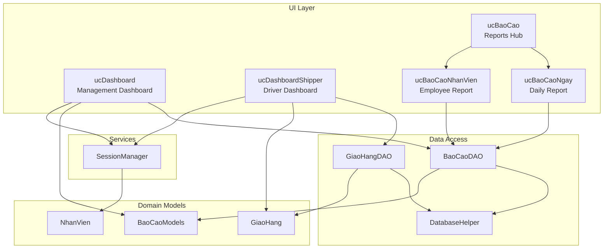
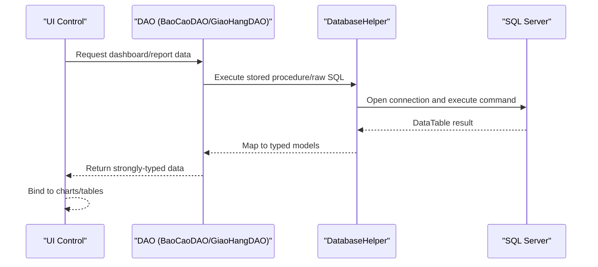
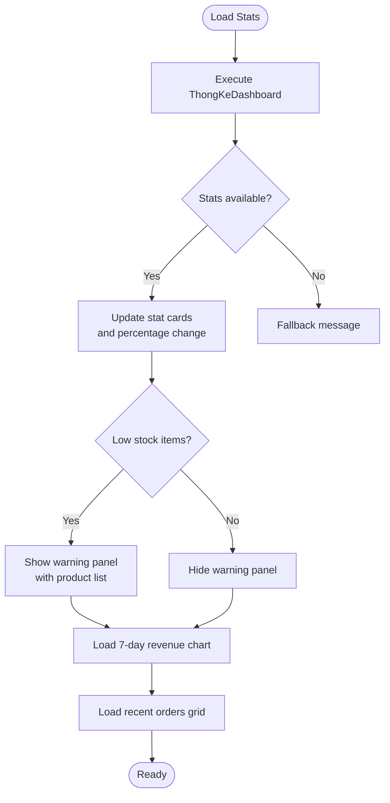
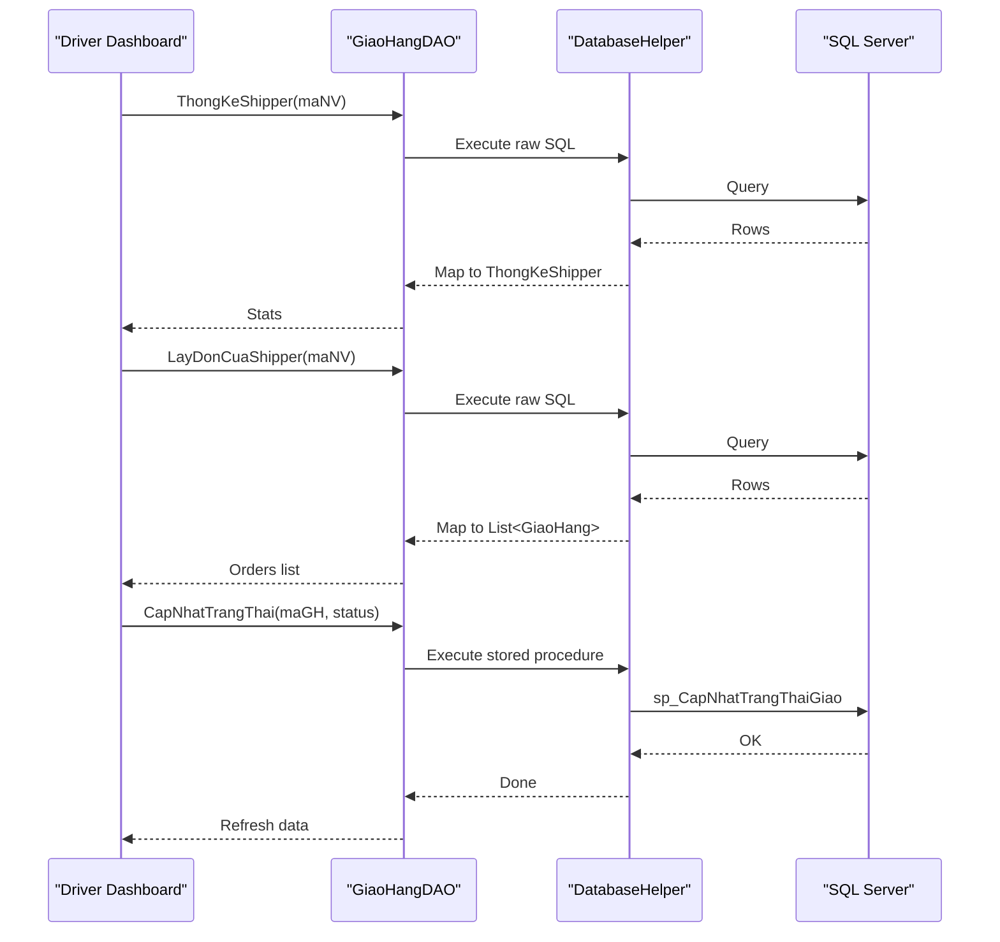
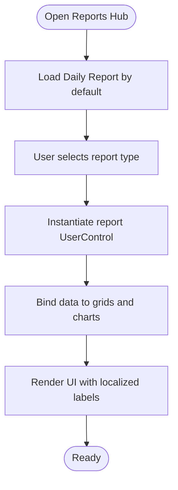
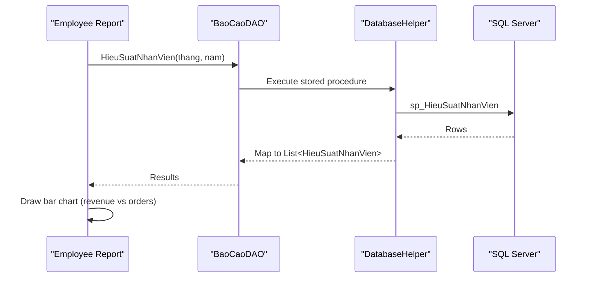
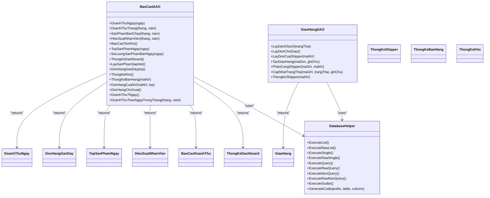
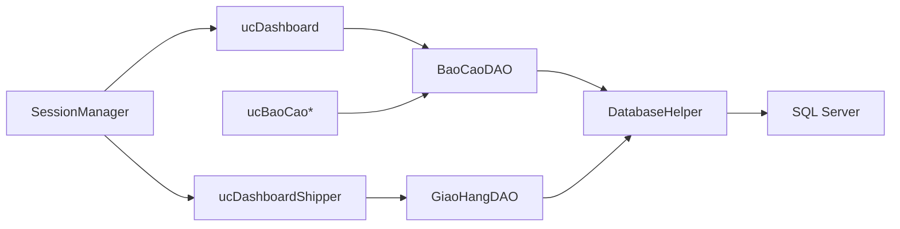

# Dashboard & Monitoring

<cite>
**Referenced Files in This Document**
- [ucDashboard.cs](file://2_QuanLy/ucDashboard.cs)
- [ucDashboardShipper.cs](file://5_GiaoHang/ucDashboardShipper.cs)
- [ucBaoCao.cs](file://6_BaoCao/ucBaoCao.cs)
- [ucBaoCaoNgay.cs](file://6_BaoCao/ucBaoCaoNgay.cs)
- [ucBaoCaoNhanVien.cs](file://6_BaoCao/ucBaoCaoNhanVien.cs)
- [GiaoHangDAO.cs](file://DataAccess/GiaoHangDAO.cs)
- [BaoCaoDAO.cs](file://DataAccess/BaoCaoDAO.cs)
- [DatabaseHelper.cs](file://DataAccess/DatabaseHelper.cs)
- [GiaoHang.cs](file://Models/GiaoHang.cs)
- [BaoCaoModels.cs](file://Models/BaoCaoModels.cs)
- [SessionManager.cs](file://Services/SessionManager.cs)
- [NhanVien.cs](file://Models/NhanVien.cs)
- [FloriSys_Database.sql](file://FloriSys_Database.sql)
</cite>

## Table of Contents
1. [Introduction](#introduction)
2. [Project Structure](#project-structure)
3. [Core Components](#core-components)
4. [Architecture Overview](#architecture-overview)
5. [Detailed Component Analysis](#detailed-component-analysis)
6. [Dependency Analysis](#dependency-analysis)
7. [Performance Considerations](#performance-considerations)
8. [Troubleshooting Guide](#troubleshooting-guide)
9. [Conclusion](#conclusion)
10. [Appendices](#appendices)

## Introduction
This document describes the shipping dashboard and monitoring system for the FloriSys application. It covers real-time performance metrics display, KPI dashboards, driver-specific dashboards, alerts and notifications, reporting capabilities, and integration points with external systems. The system is built with Windows Forms, a layered architecture, and integrates with SQL Server via stored procedures and a lightweight data access layer.

## Project Structure
The dashboard and monitoring features are implemented across several UI user controls, DAOs, models, and services. The primary areas are:
- Management dashboard (admin-level overview)
- Shipping dashboard (driver-level tracking)
- Reporting module (daily, monthly, employee performance)
- Data access layer (DAOs and helpers)
- Models for typed data transfer
- Session management for role-aware UI behavior



**Diagram sources**
- [ucDashboard.cs:1-226](file://2_QuanLy/ucDashboard.cs#L1-L226)
- [ucDashboardShipper.cs:1-162](file://5_GiaoHang/ucDashboardShipper.cs#L1-L162)
- [ucBaoCao.cs:1-58](file://6_BaoCao/ucBaoCao.cs#L1-L58)
- [ucBaoCaoNgay.cs:1-100](file://6_BaoCao/ucBaoCaoNgay.cs#L1-L100)
- [ucBaoCaoNhanVien.cs:1-122](file://6_BaoCao/ucBaoCaoNhanVien.cs#L1-L122)
- [GiaoHangDAO.cs:1-96](file://DataAccess/GiaoHangDAO.cs#L1-L96)
- [BaoCaoDAO.cs:1-167](file://DataAccess/BaoCaoDAO.cs#L1-L167)
- [DatabaseHelper.cs:1-212](file://DataAccess/DatabaseHelper.cs#L1-L212)
- [GiaoHang.cs:1-47](file://Models/GiaoHang.cs#L1-L47)
- [BaoCaoModels.cs:1-131](file://Models/BaoCaoModels.cs#L1-L131)
- [SessionManager.cs:1-62](file://Services/SessionManager.cs#L1-L62)
- [NhanVien.cs:1-40](file://Models/NhanVien.cs#L1-L40)

**Section sources**
- [ucDashboard.cs:18-28](file://2_QuanLy/ucDashboard.cs#L18-L28)
- [ucDashboardShipper.cs:19-29](file://5_GiaoHang/ucDashboardShipper.cs#L19-L29)
- [ucBaoCao.cs:14-18](file://6_BaoCao/ucBaoCao.cs#L14-L18)

## Core Components
- Management Dashboard: Displays daily order volume, revenue, active deliveries, and low-stock warnings with a 7-day revenue chart.
- Driver Dashboard: Shows driver’s daily orders, current delivery panel, and quick actions to update delivery status.
- Reporting Hub: Switches between daily, monthly, product, inventory, and employee reports.
- Data Access Layer: Provides typed queries and stored procedure wrappers for dashboards and reports.
- Models: Strongly-typed DTOs for dashboard stats, charts, and entity joins.
- Session Management: Role-aware session for admin/cashier/warehouse/shipper contexts.

**Section sources**
- [ucDashboard.cs:30-94](file://2_QuanLy/ucDashboard.cs#L30-L94)
- [ucDashboardShipper.cs:31-41](file://5_GiaoHang/ucDashboardShipper.cs#L31-L41)
- [ucBaoCao.cs:20-35](file://6_BaoCao/ucBaoCao.cs#L20-L35)
- [BaoCaoDAO.cs:72-83](file://DataAccess/BaoCaoDAO.cs#L72-L83)
- [GiaoHangDAO.cs:85-93](file://DataAccess/GiaoHangDAO.cs#L85-L93)

## Architecture Overview
The system follows a layered architecture:
- UI Layer: User controls render dashboards and reports.
- Business Logic: DAOs encapsulate data retrieval and updates.
- Data Access: DatabaseHelper executes stored procedures and raw SQL, mapping results to models.
- Domain Models: Typed DTOs for dashboard KPIs and entities.
- Services: SessionManager provides role-aware context.



**Diagram sources**
- [BaoCaoDAO.cs:11-17](file://DataAccess/BaoCaoDAO.cs#L11-L17)
- [DatabaseHelper.cs:104-122](file://DataAccess/DatabaseHelper.cs#L104-L122)
- [GiaoHangDAO.cs:10-28](file://DataAccess/GiaoHangDAO.cs#L10-L28)

## Detailed Component Analysis

### Management Dashboard
- Real-time metrics:
  - Today’s orders and revenue
  - Active deliveries and drivers on duty
  - Low-stock alerts with product details
- 7-day revenue chart using a column series.
- Recent orders grid with localized status labels and currency formatting.



**Diagram sources**
- [ucDashboard.cs:30-94](file://2_QuanLy/ucDashboard.cs#L30-L94)
- [ucDashboard.cs:176-222](file://2_QuanLy/ucDashboard.cs#L176-L222)
- [ucDashboard.cs:112-138](file://2_QuanLy/ucDashboard.cs#L112-L138)
- [BaoCaoDAO.cs:72-83](file://DataAccess/BaoCaoDAO.cs#L72-L83)

**Section sources**
- [ucDashboard.cs:30-94](file://2_QuanLy/ucDashboard.cs#L30-L94)
- [ucDashboard.cs:176-222](file://2_QuanLy/ucDashboard.cs#L176-L222)
- [ucDashboard.cs:112-138](file://2_QuanLy/ucDashboard.cs#L112-L138)
- [BaoCaoDAO.cs:72-83](file://DataAccess/BaoCaoDAO.cs#L72-L83)

### Driver Dashboard
- Driver-specific metrics:
  - Total orders today
  - Delivered, in-progress, and pending orders
- Current delivery panel highlights the active order with contact/address details.
- Quick actions to mark success, customer absent, or return.



**Diagram sources**
- [ucDashboardShipper.cs:31-41](file://5_GiaoHang/ucDashboardShipper.cs#L31-L41)
- [ucDashboardShipper.cs:43-63](file://5_GiaoHang/ucDashboardShipper.cs#L43-L63)
- [ucDashboardShipper.cs:65-111](file://5_GiaoHang/ucDashboardShipper.cs#L65-L111)
- [GiaoHangDAO.cs:85-93](file://DataAccess/GiaoHangDAO.cs#L85-L93)
- [GiaoHangDAO.cs:42-51](file://DataAccess/GiaoHangDAO.cs#L42-L51)
- [GiaoHangDAO.cs:75-83](file://DataAccess/GiaoHangDAO.cs#L75-L83)

**Section sources**
- [ucDashboardShipper.cs:31-41](file://5_GiaoHang/ucDashboardShipper.cs#L31-L41)
- [ucDashboardShipper.cs:43-63](file://5_GiaoHang/ucDashboardShipper.cs#L43-L63)
- [ucDashboardShipper.cs:65-111](file://5_GiaoHang/ucDashboardShipper.cs#L65-L111)
- [GiaoHangDAO.cs:85-93](file://DataAccess/GiaoHangDAO.cs#L85-L93)
- [GiaoHangDAO.cs:42-51](file://DataAccess/GiaoHangDAO.cs#L42-L51)
- [GiaoHangDAO.cs:75-83](file://DataAccess/GiaoHangDAO.cs#L75-L83)

### Reporting Hub and Daily Report
- Reports hub switches between daily, monthly, product, inventory, and employee reports.
- Daily report displays:
  - Today’s total orders and revenue
  - Quantity of products sold
  - Top products pie chart (3D) with exploded leader segment
  - Localized headers and currency formatting



**Diagram sources**
- [ucBaoCao.cs:14-35](file://6_BaoCao/ucBaoCao.cs#L14-L35)
- [ucBaoCaoNgay.cs:23-97](file://6_BaoCao/ucBaoCaoNgay.cs#L23-L97)

**Section sources**
- [ucBaoCao.cs:14-35](file://6_BaoCao/ucBaoCao.cs#L14-L35)
- [ucBaoCaoNgay.cs:23-97](file://6_BaoCao/ucBaoCaoNgay.cs#L23-L97)

### Employee Performance Report
- Monthly filters for year/month selection.
- Grid shows employee performance metrics (orders created, total revenue, cancellations).
- Bar chart compares revenue and scaled order counts for top employees.



**Diagram sources**
- [ucBaoCaoNhanVien.cs:29-53](file://6_BaoCao/ucBaoCaoNhanVien.cs#L29-L53)
- [ucBaoCaoNhanVien.cs:55-114](file://6_BaoCao/ucBaoCaoNhanVien.cs#L55-L114)
- [BaoCaoDAO.cs:37-44](file://DataAccess/BaoCaoDAO.cs#L37-L44)

**Section sources**
- [ucBaoCaoNhanVien.cs:29-53](file://6_BaoCao/ucBaoCaoNhanVien.cs#L29-L53)
- [ucBaoCaoNhanVien.cs:55-114](file://6_BaoCao/ucBaoCaoNhanVien.cs#L55-L114)
- [BaoCaoDAO.cs:37-44](file://DataAccess/BaoCaoDAO.cs#L37-L44)

### Data Access and Models
- DAOs encapsulate:
  - Dashboard statistics (management)
  - Driver statistics and order lists
  - Product sales and top products
  - Employee performance
  - Raw SQL queries and stored procedures
- DatabaseHelper provides:
  - Generic mapping from DataTable to strongly-typed lists
  - Connection management and command execution
  - Code generation for identifiers
- Models define:
  - Dashboard KPIs (ThongKeDashboard, ThongKeShipper, ThongKeBanHang, ThongKeKho)
  - Report DTOs (BaoCaoDoanhThu, HieuSuatNhanVien, TopSanPhamNgay, DonHangGanDay, DoanhThuNgay)
  - Entity joins (GiaoHang)



**Diagram sources**
- [BaoCaoDAO.cs:9-167](file://DataAccess/BaoCaoDAO.cs#L9-L167)
- [GiaoHangDAO.cs:8-96](file://DataAccess/GiaoHangDAO.cs#L8-L96)
- [DatabaseHelper.cs:10-212](file://DataAccess/DatabaseHelper.cs#L10-L212)
- [BaoCaoModels.cs:43-131](file://Models/BaoCaoModels.cs#L43-L131)
- [GiaoHang.cs:5-47](file://Models/GiaoHang.cs#L5-L47)

**Section sources**
- [BaoCaoDAO.cs:9-167](file://DataAccess/BaoCaoDAO.cs#L9-L167)
- [GiaoHangDAO.cs:8-96](file://DataAccess/GiaoHangDAO.cs#L8-L96)
- [DatabaseHelper.cs:10-212](file://DataAccess/DatabaseHelper.cs#L10-L212)
- [BaoCaoModels.cs:43-131](file://Models/BaoCaoModels.cs#L43-L131)
- [GiaoHang.cs:5-47](file://Models/GiaoHang.cs#L5-L47)

## Dependency Analysis
- UI depends on DAOs for data retrieval.
- DAOs depend on DatabaseHelper for SQL execution and mapping.
- Models are shared DTOs between DAOs and UI.
- SessionManager provides role-aware context for UI behavior.



**Diagram sources**
- [ucDashboard.cs:34](file://2_QuanLy/ucDashboard.cs#L34)
- [ucDashboardShipper.cs:33](file://5_GiaoHang/ucDashboardShipper.cs#L33)
- [BaoCaoDAO.cs:72-83](file://DataAccess/BaoCaoDAO.cs#L72-L83)
- [GiaoHangDAO.cs:85-93](file://DataAccess/GiaoHangDAO.cs#L85-L93)
- [DatabaseHelper.cs:99-122](file://DataAccess/DatabaseHelper.cs#L99-L122)
- [SessionManager.cs:12](file://Services/SessionManager.cs#L12)

**Section sources**
- [ucDashboard.cs:34](file://2_QuanLy/ucDashboard.cs#L34)
- [ucDashboardShipper.cs:33](file://5_GiaoHang/ucDashboardShipper.cs#L33)
- [BaoCaoDAO.cs:72-83](file://DataAccess/BaoCaoDAO.cs#L72-L83)
- [GiaoHangDAO.cs:85-93](file://DataAccess/GiaoHangDAO.cs#L85-L93)
- [DatabaseHelper.cs:99-122](file://DataAccess/DatabaseHelper.cs#L99-L122)
- [SessionManager.cs:12](file://Services/SessionManager.cs#L12)

## Performance Considerations
- Use of stored procedures reduces query parsing overhead and improves security.
- Generic mapping minimizes reflection cost by caching property info and reusing mapped rows.
- Charts are constructed dynamically; consider caching chart configurations and reusing chart instances to reduce UI refresh costs.
- Filtering by date ranges and TOP clauses limits result sets for timely rendering.
- Consider asynchronous loading for heavy reports to keep UI responsive.

[No sources needed since this section provides general guidance]

## Troubleshooting Guide
- Connection errors:
  - Verify connection string in configuration and network connectivity to SQL Server.
  - Check that the database exists and is accessible.
- Mapping failures:
  - Ensure column names match property names in models.
  - Validate nullable conversions and data types.
- Stored procedure errors:
  - Confirm stored procedures exist and are compatible with DAO calls.
  - Review parameter types and names.
- UI binding issues:
  - Ensure DataGridView columns are configured before binding.
  - Apply cell formatting after data binding completes.

**Section sources**
- [DatabaseHelper.cs:91-122](file://DataAccess/DatabaseHelper.cs#L91-L122)
- [DatabaseHelper.cs:57-89](file://DataAccess/DatabaseHelper.cs#L57-L89)
- [ucDashboard.cs:131-137](file://2_QuanLy/ucDashboard.cs#L131-L137)

## Conclusion
The shipping dashboard and monitoring system provides a comprehensive, role-aware solution for managing delivery operations. It offers real-time dashboards, driver-centric tracking, and robust reporting with charts and grids. The architecture cleanly separates UI, data access, and domain concerns, enabling maintainability and extensibility.

[No sources needed since this section summarizes without analyzing specific files]

## Appendices

### Database Schema Overview
The system relies on core tables for orders, deliveries, employees, customers, and inventory. Stored procedures support dashboard and reporting queries.

```mermaid
erDiagram
NHAN_VIEN {
nvarchar MaNV PK
nvarchar HoTen
nvarchar ChucVu
nvarchar SoDienThoai
nvarchar TaiKhoan UK
nvarchar MatKhau
nvarchar TrangThai
}
KHACH_HANG {
nvarchar MaKH PK
nvarchar HoTen
nvarchar SoDienThoai UK
nvarchar DiaChi
nvarchar Email
datetime NgayTao
}
SAN_PHAM {
nvarchar MaSP PK
nvarchar TenSP
nvarchar LoaiHoa
decimal GiaBan
decimal GiaNhap
int SoLuongTon
int MucTonToiThieu
nvarchar TrangThai
}
DON_HANG {
nvarchar MaDon PK
datetime NgayTao
nvarchar MaKH FK
nvarchar MaNV_TaoDon FK
nvarchar HinhThucNhanHang
nvarchar TrangThai
decimal TongTien
nvarchar GhiChu
}
CHI_TIET_DON_HANG {
nvarchar MaDon PK
nvarchar MaSP PK
int SoLuong
decimal DonGia
decimal ThanhTien
}
GIAO_HANG {
nvarchar MaGiaoHang PK
nvarchar MaDon FK
nvarchar MaNV_Shipper FK
datetime NgayGiao
nvarchar TrangThai
nvarchar GhiChuGiaoHang
}
PHIEU_NHAP_KHO {
nvarchar MaPhieu PK
datetime NgayNhap
nvarchar MaNV FK
nvarchar GhiChu
}
CT_NHAP_KHO {
nvarchar MaPhieu PK
nvarchar MaSP PK
int SoLuong
decimal GiaNhap
}
PHAN_HOI {
nvarchar MaPH PK
nvarchar MaDon FK
nvarchar NoiDung
datetime NgayGhi
nvarchar TrangThaiXuLy
nvarchar KetQuaXuLy
}
HANG_HU {
nvarchar MaPhieuHuy PK
nvarchar MaSP FK
int SoLuong
nvarchar LyDo
datetime NgayHuy
nvarchar GhiChu
}
CANH_BAO_TON_KHO {
nvarchar MaSP PK FK
int MucToiThieu
datetime NgayCapNhat
}
TRA_HANG {
nvarchar MaPhieuTra PK
nvarchar MaDon FK
nvarchar LyDo
nvarchar HinhThucHoanTien
nvarchar GhiChu
datetime NgayTra
}
CT_TRA_HANG {
nvarchar MaPhieuTra PK
nvarchar MaSP PK
int SoLuong
bit CoNhapKho
}
DON_HANG }|--|| CHI_TIET_DON_HANG : "contains"
KHACH_HANG }|--|| DON_HANG : "creates"
NHAN_VIEN }|--|| DON_HANG : "creates"
NHAN_VIEN }|--o| GIAO_HANG : "ships"
SAN_PHAM }|--|| CHI_TIET_DON_HANG : "included_in"
SAN_PHAM }|--|| CT_NHAP_KHO : "supplied_in"
SAN_PHAM }|--|| HANG_HU : "damaged"
SAN_PHAM }|--|| CANH_BAO_TON_KHO : "monitored_by"
DON_HANG }|--|| PHAN_HOI : "generates"
DON_HANG }|--|| TRA_HANG : "subject_of"
TRA_HANG }|--|| CT_TRA_HANG : "contains"
```

**Diagram sources**
- [FloriSys_Database.sql:22-202](file://FloriSys_Database.sql#L22-L202)

### Alert and Notification Mechanisms
- Low-stock alerts:
  - Management dashboard surfaces low-stock items and aggregates product names and quantities.
  - Use this to trigger warehouse replenishment workflows.
- Delivery status updates:
  - Driver dashboard allows updating delivery outcomes (success, customer absent, return).
  - These statuses feed into downstream analytics and performance metrics.

**Section sources**
- [ucDashboard.cs:67-87](file://2_QuanLy/ucDashboard.cs#L67-L87)
- [ucDashboardShipper.cs:113-135](file://5_GiaoHang/ucDashboardShipper.cs#L113-L135)

### Reporting Capabilities
- Daily report:
  - Today’s orders and revenue
  - Quantity of products sold
  - Top products pie chart
- Employee report:
  - Monthly filtering
  - Revenue and order counts comparison
- Inventory report:
  - Stock alerts and movement summaries
- Sales trends:
  - 7-day revenue and daily revenue by month via DAO methods

**Section sources**
- [ucBaoCaoNgay.cs:23-97](file://6_BaoCao/ucBaoCaoNgay.cs#L23-L97)
- [ucBaoCaoNhanVien.cs:29-53](file://6_BaoCao/ucBaoCaoNhanVien.cs#L29-L53)
- [BaoCaoDAO.cs:140-164](file://DataAccess/BaoCaoDAO.cs#L140-L164)

### Integration with External Systems
- Traffic data, weather conditions, and forecasting:
  - Not implemented in the current codebase.
  - Recommended integration points:
    - External APIs for traffic and weather
    - Forecasting service for delivery volumes
    - Hook into DAOs to enrich delivery routes and capacity planning
- Implementation guidance:
  - Add service clients for external APIs
  - Extend DAOs to incorporate external data into delivery planning
  - Update UI to visualize external influences on KPIs

[No sources needed since this section provides general guidance]

### Dashboard Customization and Thresholds
- Metric configuration:
  - Adjust thresholds for low-stock alerts (minimum stock levels) in product configuration.
  - Modify dashboard queries to include additional KPIs (e.g., on-time delivery rate).
- Performance thresholds:
  - Define acceptable ranges for delivery success and driver productivity.
  - Use these thresholds to drive alerts and optimization actions.
- UI customization:
  - Localize labels and formats in UI controls.
  - Allow role-specific visibility of metrics and actions.

[No sources needed since this section provides general guidance]