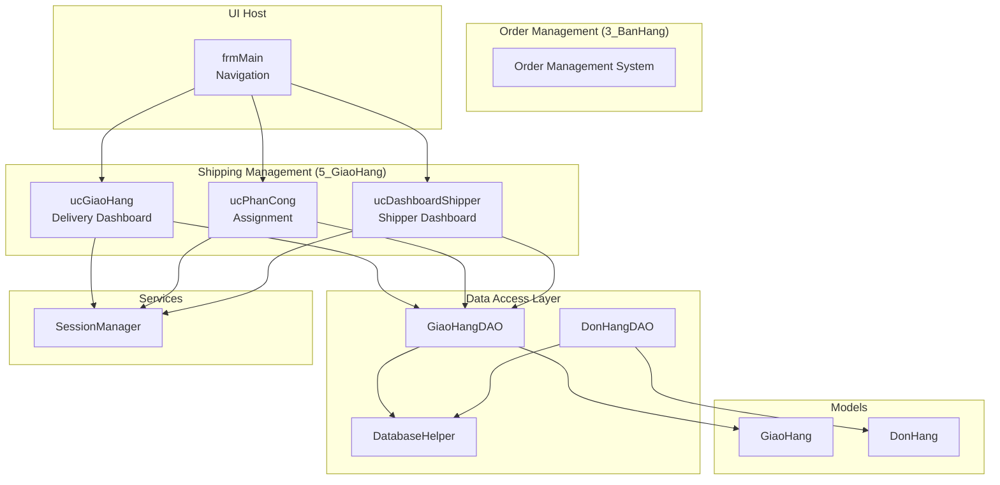
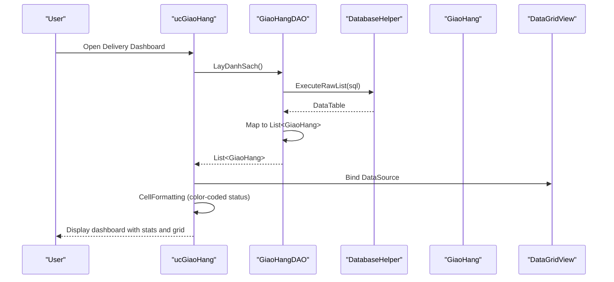
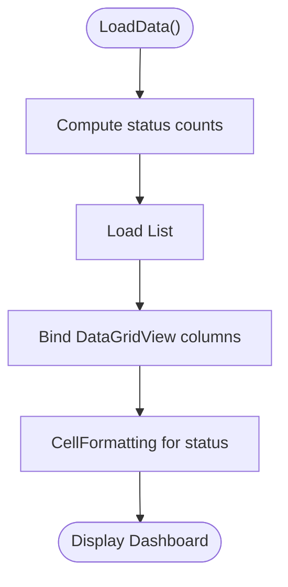
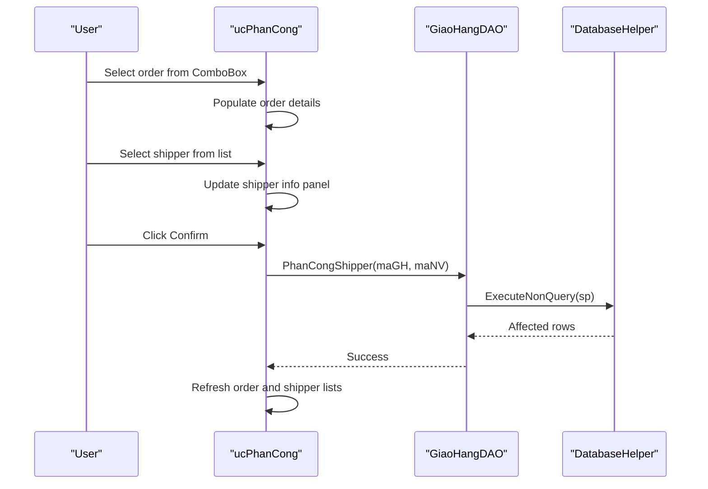
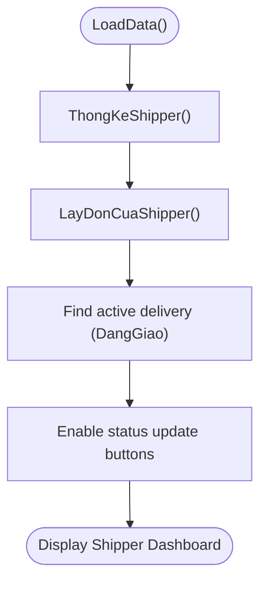
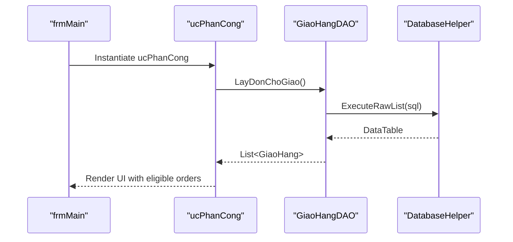
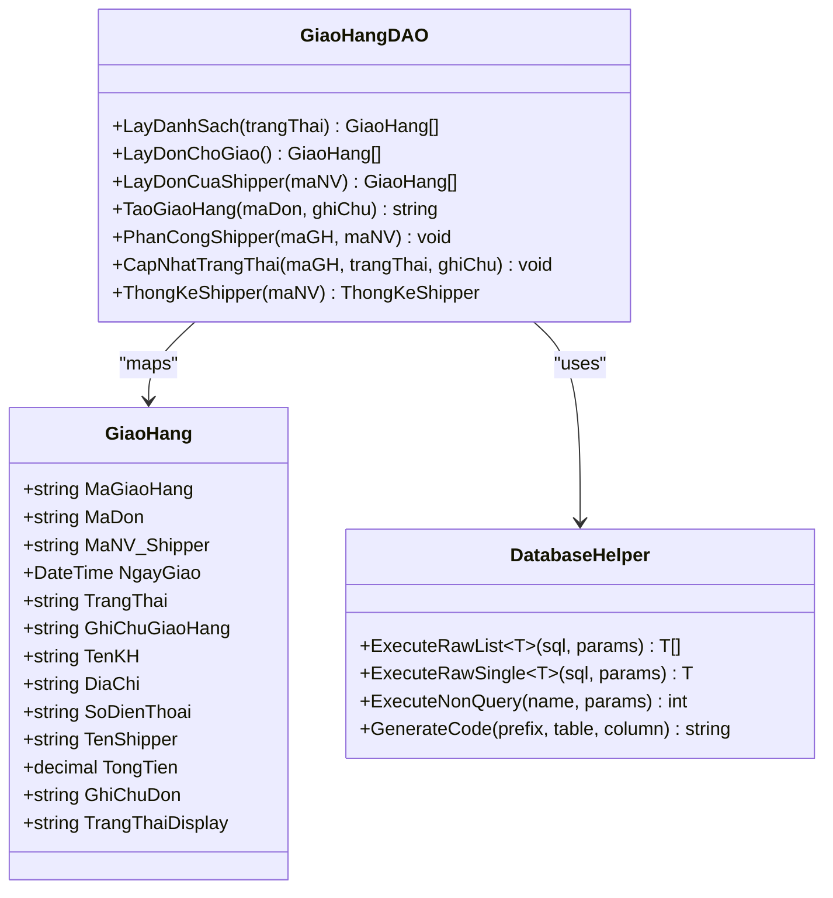
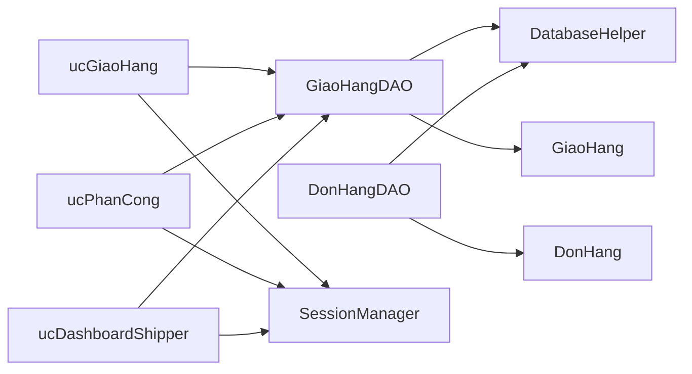

# Delivery Coordination

<cite>
**Referenced Files in This Document**
- [ucPhanCong.cs](file://5_GiaoHang/ucPhanCong.cs)
- [ucPhanCong.Designer.cs](file://5_GiaoHang/ucPhanCong.Designer.cs)
- [ucGiaoHang.cs](file://5_GiaoHang/ucGiaoHang.cs)
- [ucGiaoHang.Designer.cs](file://5_GiaoHang/ucGiaoHang.Designer.cs)
- [ucDashboardShipper.cs](file://5_GiaoHang/ucDashboardShipper.cs)
- [ucDashboardShipper.Designer.cs](file://5_GiaoHang/ucDashboardShipper.Designer.cs)
- [GiaoHangDAO.cs](file://DataAccess/GiaoHangDAO.cs)
- [DonHangDAO.cs](file://DataAccess/DonHangDAO.cs)
- [DatabaseHelper.cs](file://DataAccess/DatabaseHelper.cs)
- [GiaoHang.cs](file://Models/GiaoHang.cs)
- [DonHang.cs](file://Models/DonHang.cs)
- [SessionManager.cs](file://Services/SessionManager.cs)
- [frmMain.cs](file://2_QuanLy/frmMain.cs)
</cite>

## Table of Contents
1. [Introduction](#introduction)
2. [Project Structure](#project-structure)
3. [Core Components](#core-components)
4. [Architecture Overview](#architecture-overview)
5. [Detailed Component Analysis](#detailed-component-analysis)
6. [Dependency Analysis](#dependency-analysis)
7. [Performance Considerations](#performance-considerations)
8. [Troubleshooting Guide](#troubleshooting-guide)
9. [Conclusion](#conclusion)

## Introduction
This document describes the Delivery Coordination system within the Shipping Management Module. It covers the end-to-end workflow from order confirmation to delivery assignment, including order filtering by status, the delivery dashboard interface, integration with the order management system, data binding for delivery records, color-coded status system, and exception handling for data loading errors.

## Project Structure
The Delivery Coordination module is organized under the Shipping Management area (folder 5_GiaoHang) and integrates with the Order Management system (folder 3_BanHang). The UI components are implemented as UserControls, backed by DAO classes for data access and a shared SessionManager for role-based navigation.

**Diagram sources**
- [ucGiaoHang.cs:11-139](file://5_GiaoHang/ucGiaoHang.cs#L11-L139)
- [ucPhanCong.cs:11-215](file://5_GiaoHang/ucPhanCong.cs#L11-L215)
- [ucDashboardShipper.cs:9-162](file://5_GiaoHang/ucDashboardShipper.cs#L9-L162)
- [GiaoHangDAO.cs:8-96](file://DataAccess/GiaoHangDAO.cs#L8-L96)
- [DonHangDAO.cs:9-114](file://DataAccess/DonHangDAO.cs#L9-L114)
- [DatabaseHelper.cs:10-212](file://DataAccess/DatabaseHelper.cs#L10-L212)
- [GiaoHang.cs:5-47](file://Models/GiaoHang.cs#L5-L47)
- [DonHang.cs:6-63](file://Models/DonHang.cs#L6-L63)
- [SessionManager.cs:7-62](file://Services/SessionManager.cs#L7-L62)
- [frmMain.cs:14-139](file://2_QuanLy/frmMain.cs#L14-L139)

**Section sources**
- [ucGiaoHang.cs:11-139](file://5_GiaoHang/ucGiaoHang.cs#L11-L139)
- [ucPhanCong.cs:11-215](file://5_GiaoHang/ucPhanCong.cs#L11-L215)
- [ucDashboardShipper.cs:9-162](file://5_GiaoHang/ucDashboardShipper.cs#L9-L162)
- [GiaoHangDAO.cs:8-96](file://DataAccess/GiaoHangDAO.cs#L8-L96)
- [DonHangDAO.cs:9-114](file://DataAccess/DonHangDAO.cs#L9-L114)
- [DatabaseHelper.cs:10-212](file://DataAccess/DatabaseHelper.cs#L10-L212)
- [GiaoHang.cs:5-47](file://Models/GiaoHang.cs#L5-L47)
- [DonHang.cs:6-63](file://Models/DonHang.cs#L6-L63)
- [SessionManager.cs:7-62](file://Services/SessionManager.cs#L7-L62)
- [frmMain.cs:14-139](file://2_QuanLy/frmMain.cs#L14-L139)

## Core Components
- Delivery Dashboard (ucGiaoHang): Displays real-time delivery statistics, status distribution, and a grid of all deliveries today with color-coded status.
- Delivery Assignment (ucPhanCong): Filters eligible orders ready for shipping, lists available shippers, and allows assigning a shipper to a selected order.
- Shipper Dashboard (ucDashboardShipper): Shows KPI metrics for the logged-in shipper, lists their daily orders, highlights the current delivery, and provides actions to update status.
- Data Access Layer: GiaoHangDAO and DonHangDAO encapsulate queries and stored procedure calls; DatabaseHelper provides reflection-based mapping and connection management.
- Models: GiaoHang and DonHang define the data structures for delivery and order records.
- Session Management: SessionManager holds the current user context and exposes role-based properties.

**Section sources**
- [ucGiaoHang.cs:11-139](file://5_GiaoHang/ucGiaoHang.cs#L11-L139)
- [ucPhanCong.cs:11-215](file://5_GiaoHang/ucPhanCong.cs#L11-L215)
- [ucDashboardShipper.cs:9-162](file://5_GiaoHang/ucDashboardShipper.cs#L9-L162)
- [GiaoHangDAO.cs:8-96](file://DataAccess/GiaoHangDAO.cs#L8-L96)
- [DonHangDAO.cs:9-114](file://DataAccess/DonHangDAO.cs#L9-L114)
- [DatabaseHelper.cs:10-212](file://DataAccess/DatabaseHelper.cs#L10-L212)
- [GiaoHang.cs:5-47](file://Models/GiaoHang.cs#L5-L47)
- [DonHang.cs:6-63](file://Models/DonHang.cs#L6-L63)
- [SessionManager.cs:7-62](file://Services/SessionManager.cs#L7-L62)

## Architecture Overview
The system follows a layered architecture:
- Presentation Layer: UserControls render UI and handle user interactions.
- Business Logic Layer: DAO classes encapsulate data operations and mapping.
- Data Access Layer: DatabaseHelper manages connections, executes queries/stored procedures, and maps results to models.
- Model Layer: Strongly typed models represent domain entities.
- Service Layer: SessionManager provides user context and role checks.

**Diagram sources**
- [ucGiaoHang.cs:25-65](file://5_GiaoHang/ucGiaoHang.cs#L25-L65)
- [GiaoHangDAO.cs:10-28](file://DataAccess/GiaoHangDAO.cs#L10-L28)
- [DatabaseHelper.cs:28-52](file://DataAccess/DatabaseHelper.cs#L28-L52)
- [GiaoHang.cs:5-37](file://Models/GiaoHang.cs#L5-L37)

**Section sources**
- [ucGiaoHang.cs:25-65](file://5_GiaoHang/ucGiaoHang.cs#L25-L65)
- [GiaoHangDAO.cs:10-28](file://DataAccess/GiaoHangDAO.cs#L10-L28)
- [DatabaseHelper.cs:28-52](file://DataAccess/DatabaseHelper.cs#L28-L52)
- [GiaoHang.cs:5-37](file://Models/GiaoHang.cs#L5-L37)

## Detailed Component Analysis

### Delivery Dashboard (ucGiaoHang)
- Purpose: Real-time overview of deliveries today with KPI stats and a grid.
- Data Binding:
  - Loads a list of deliveries via GiaoHangDAO.LayDanhSach().
  - Binds columns for order ID, customer, address, scheduled time, shipper, status, and total amount.
  - Formats date/time and numeric columns for readability.
- Status Distribution:
  - Computes counts for ChoPhanCong, DangGiao, GiaoThanhCong, HoanHang, and GiaoLai.
  - Displays KPI cards for quick visibility.
- Color-Coded Status:
  - Uses CellFormatting to change text and font color based on status values.

**Diagram sources**
- [ucGiaoHang.cs:25-92](file://5_GiaoHang/ucGiaoHang.cs#L25-L92)
- [ucGiaoHang.Designer.cs:31-60](file://5_GiaoHang/ucGiaoHang.Designer.cs#L31-L60)

**Section sources**
- [ucGiaoHang.cs:25-92](file://5_GiaoHang/ucGiaoHang.cs#L25-L92)
- [ucGiaoHang.Designer.cs:31-60](file://5_GiaoHang/ucGiaoHang.Designer.cs#L31-L60)

### Delivery Assignment (ucPhanCong)
- Purpose: Assign a shipper to eligible orders ready for shipping.
- Order Filtering:
  - Loads orders with status ChoPhanCong via GiaoHangDAO.LayDonChoGiao().
  - Populates a ComboBox with eligible orders.
- Shipper Listing:
  - Queries available shippers with counts of current and completed deliveries for the day.
  - Displays availability status and selection feedback.
- Assignment Workflow:
  - Selecting an order populates customer, address, and note fields.
  - Selecting a shipper updates the shipper info panel and enables confirmation.
  - Confirmation triggers GiaoHangDAO.PhanCongShipper() and refreshes data.

**Diagram sources**
- [ucPhanCong.cs:42-212](file://5_GiaoHang/ucPhanCong.cs#L42-L212)
- [GiaoHangDAO.cs:66-73](file://DataAccess/GiaoHangDAO.cs#L66-L73)
- [DatabaseHelper.cs:144-157](file://DataAccess/DatabaseHelper.cs#L144-L157)

**Section sources**
- [ucPhanCong.cs:42-212](file://5_GiaoHang/ucPhanCong.cs#L42-L212)
- [GiaoHangDAO.cs:30-40](file://DataAccess/GiaoHangDAO.cs#L30-L40)
- [GiaoHangDAO.cs:66-73](file://DataAccess/GiaoHangDAO.cs#L66-L73)

### Shipper Dashboard (ucDashboardShipper)
- Purpose: Manage personal deliveries for the logged-in shipper.
- KPI Metrics:
  - Loads totals via GiaoHangDAO.ThongKeShipper() for today’s orders, delivered, in progress, and pending.
- Order List:
  - Shows all orders assigned to the current shipper for the day with formatted columns.
- Current Delivery:
  - Highlights the currently active delivery (status DangGiao) and allows updating status to success, customer absent, or return.
- Navigation:
  - Integrates with SessionManager to load the correct user context.

**Diagram sources**
- [ucDashboardShipper.cs:24-111](file://5_GiaoHang/ucDashboardShipper.cs#L24-L111)
- [GiaoHangDAO.cs:85-93](file://DataAccess/GiaoHangDAO.cs#L85-L93)

**Section sources**
- [ucDashboardShipper.cs:24-111](file://5_GiaoHang/ucDashboardShipper.cs#L24-L111)
- [GiaoHangDAO.cs:42-52](file://DataAccess/GiaoHangDAO.cs#L42-L52)
- [GiaoHangDAO.cs:85-93](file://DataAccess/GiaoHangDAO.cs#L85-L93)

### Integration with Order Management System
- Eligible Orders:
  - ucPhanCong loads orders with status ChoPhanCong from GiaoHangDAO.LayDonChoGiao(), which joins delivery, order, and customer data.
- Order Details:
  - DonHangDAO provides order information and details for integration scenarios (e.g., retrieving order items or customer contact info).
- Navigation:
  - frmMain routes users to ucPhanCong when selecting “Phân công” and to ucGiaoHang for “DanhSachGiao”.

**Diagram sources**
- [frmMain.cs:84-89](file://2_QuanLy/frmMain.cs#L84-L89)
- [ucPhanCong.cs:49-83](file://5_GiaoHang/ucPhanCong.cs#L49-L83)
- [GiaoHangDAO.cs:30-40](file://DataAccess/GiaoHangDAO.cs#L30-L40)

**Section sources**
- [ucPhanCong.cs:49-83](file://5_GiaoHang/ucPhanCong.cs#L49-L83)
- [GiaoHangDAO.cs:30-40](file://DataAccess/GiaoHangDAO.cs#L30-L40)
- [DonHangDAO.cs:11-42](file://DataAccess/DonHangDAO.cs#L11-L42)
- [frmMain.cs:84-89](file://2_QuanLy/frmMain.cs#L84-L89)

### Data Binding Process for Delivery Records
- Delivery Records:
  - ucGiaoHang binds List<GiaoHang> to DataGridView with mapped columns for order ID, customer, address, scheduled time, shipper, status, and total amount.
  - Uses cell formatting to display localized status text and apply color coding.
- Shipper Dashboard:
  - ucDashboardShipper binds List<GiaoHang> filtered by current shipper and hides internal identifiers.
- Customer Information Display:
  - GiaoHang model includes TenKH, DiaChi, SoDienThoai, and TenShipper for display.
- Scheduled Delivery Times:
  - NgayGiao is formatted for display in the grid.
- Assigned Shipper Details:
  - TenShipper is shown when available; otherwise displays a placeholder.

**Diagram sources**
- [GiaoHang.cs:5-37](file://Models/GiaoHang.cs#L5-L37)
- [GiaoHangDAO.cs:10-93](file://DataAccess/GiaoHangDAO.cs#L10-L93)
- [DatabaseHelper.cs:28-52](file://DataAccess/DatabaseHelper.cs#L28-L52)

**Section sources**
- [ucGiaoHang.cs:33-60](file://5_GiaoHang/ucGiaoHang.cs#L33-L60)
- [ucDashboardShipper.cs:43-63](file://5_GiaoHang/ucDashboardShipper.cs#L43-L63)
- [GiaoHang.cs:5-37](file://Models/GiaoHang.cs#L5-L37)
- [GiaoHangDAO.cs:10-52](file://DataAccess/GiaoHangDAO.cs#L10-L52)
- [DatabaseHelper.cs:28-52](file://DataAccess/DatabaseHelper.cs#L28-L52)

### Color-Coded Status System
- ucGiaoHang applies CellFormatting to the status column:
  - ChoPhanCong → blue text
  - DangGiao → orange text
  - GiaoThanhCong → green text
  - HoanHang → purple text
  - GiaoLai → orange text
- ucDashboardShipper uses distinct background colors for KPI panels:
  - Total delivered: green
  - In-progress: yellow
  - Pending: blue
  - Not yet assigned: red

**Section sources**
- [ucGiaoHang.cs:94-130](file://5_GiaoHang/ucGiaoHang.cs#L94-L130)
- [ucDashboardShipper.Designer.cs:110-242](file://5_GiaoHang/ucDashboardShipper.Designer.cs#L110-L242)

### Exception Handling for Data Loading Errors
- All major data-loading methods wrap operations in try-catch blocks and show user-friendly error messages.
- Examples:
  - ucGiaoHang.LoadData() catches exceptions during stats and grid loading.
  - ucPhanCong.LoadDonChoGiao() and LoadShipperList() catch exceptions during order and shipper loading.
  - ucDashboardShipper.LoadStats() and LoadList() catch exceptions during shipper metrics and order list loading.
- DatabaseHelper methods return empty results or throw exceptions that are handled by calling UI components.

**Section sources**
- [ucGiaoHang.cs:61-65](file://5_GiaoHang/ucGiaoHang.cs#L61-L65)
- [ucPhanCong.cs:79-83](file://5_GiaoHang/ucPhanCong.cs#L79-L83)
- [ucPhanCong.cs:143-147](file://5_GiaoHang/ucPhanCong.cs#L143-L147)
- [ucDashboardShipper.cs:33-41](file://5_GiaoHang/ucDashboardShipper.cs#L33-L41)
- [ucDashboardShipper.cs:43-63](file://5_GiaoHang/ucDashboardShipper.cs#L43-L63)

## Dependency Analysis
- UI Components depend on DAO classes for data retrieval and updates.
- DAO classes depend on DatabaseHelper for SQL execution and mapping.
- Models are used across DAO and UI layers for strong typing and data transfer.
- SessionManager is used by dashboards to personalize content and enforce role-based navigation.

**Diagram sources**
- [ucGiaoHang.cs:25-65](file://5_GiaoHang/ucGiaoHang.cs#L25-L65)
- [ucPhanCong.cs:49-83](file://5_GiaoHang/ucPhanCong.cs#L49-L83)
- [ucDashboardShipper.cs:24-41](file://5_GiaoHang/ucDashboardShipper.cs#L24-L41)
- [GiaoHangDAO.cs:10-93](file://DataAccess/GiaoHangDAO.cs#L10-L93)
- [DonHangDAO.cs:11-42](file://DataAccess/DonHangDAO.cs#L11-L42)
- [DatabaseHelper.cs:10-212](file://DataAccess/DatabaseHelper.cs#L10-L212)
- [GiaoHang.cs:5-37](file://Models/GiaoHang.cs#L5-L37)
- [DonHang.cs:6-63](file://Models/DonHang.cs#L6-L63)
- [SessionManager.cs:7-62](file://Services/SessionManager.cs#L7-L62)

**Section sources**
- [ucGiaoHang.cs:25-65](file://5_GiaoHang/ucGiaoHang.cs#L25-L65)
- [ucPhanCong.cs:49-83](file://5_GiaoHang/ucPhanCong.cs#L49-L83)
- [ucDashboardShipper.cs:24-41](file://5_GiaoHang/ucDashboardShipper.cs#L24-L41)
- [GiaoHangDAO.cs:10-93](file://DataAccess/GiaoHangDAO.cs#L10-L93)
- [DonHangDAO.cs:11-42](file://DataAccess/DonHangDAO.cs#L11-L42)
- [DatabaseHelper.cs:10-212](file://DataAccess/DatabaseHelper.cs#L10-L212)
- [GiaoHang.cs:5-37](file://Models/GiaoHang.cs#L5-L37)
- [DonHang.cs:6-63](file://Models/DonHang.cs#L6-L63)
- [SessionManager.cs:7-62](file://Services/SessionManager.cs#L7-L62)

## Performance Considerations
- Data Retrieval:
  - Use indexed columns in WHERE clauses (e.g., TrangThai, MaNV_Shipper, NgayGiao) to optimize queries.
  - Consider pagination for large datasets in the delivery grid.
- Mapping:
  - Reflection-based mapping in DatabaseHelper is convenient but can be slower than manual mapping for large result sets; keep DTOs minimal when possible.
- UI Responsiveness:
  - Perform data loading on background threads and marshal UI updates to the UI thread to prevent freezing.
- Formatting:
  - Apply cell formatting after data binding to avoid repeated conversions.

[No sources needed since this section provides general guidance]

## Troubleshooting Guide
- No eligible orders displayed in Assignment:
  - Verify orders exist with status ChoPhanCong in the database.
  - Check GiaoHangDAO.LayDonChoGiao() query and permissions.
- Shipper list empty:
  - Ensure employees with role “Shipper” are active and have records in GIAO_HANG.
  - Confirm GiaoHangDAO query filters by active status.
- Dashboard shows blank or incorrect status:
  - Validate TrangThai values in the database match expected values.
  - Confirm CellFormatting logic in ucGiaoHang.cs handles all status cases.
- Shipper KPI mismatch:
  - Review GiaoHangDAO.ThongKeShipper() query and date filtering logic.
- Exceptions during data load:
  - Wrap DAO calls with try-catch and log exceptions for diagnosis.
  - Verify connection string and stored procedure existence.

**Section sources**
- [ucPhanCong.cs:79-83](file://5_GiaoHang/ucPhanCong.cs#L79-L83)
- [ucPhanCong.cs:143-147](file://5_GiaoHang/ucPhanCong.cs#L143-L147)
- [ucGiaoHang.cs:61-65](file://5_GiaoHang/ucGiaoHang.cs#L61-L65)
- [ucDashboardShipper.cs:33-41](file://5_GiaoHang/ucDashboardShipper.cs#L33-L41)
- [GiaoHangDAO.cs:30-40](file://DataAccess/GiaoHangDAO.cs#L30-L40)
- [GiaoHangDAO.cs:85-93](file://DataAccess/GiaoHangDAO.cs#L85-L93)

## Conclusion
The Delivery Coordination system provides a robust, role-aware solution for managing deliveries. It integrates seamlessly with the Order Management system, offers real-time dashboards with color-coded statuses, and supports efficient assignment workflows. The modular design, clear separation of concerns, and consistent exception handling contribute to maintainability and reliability.