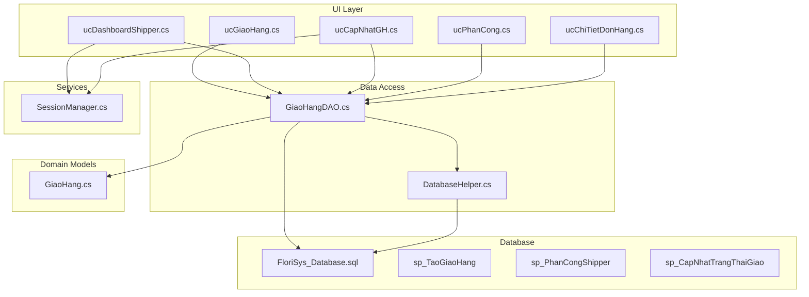
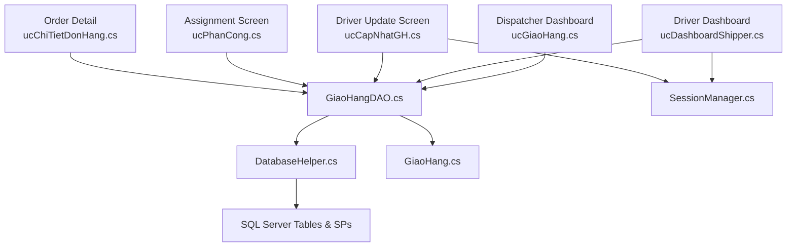
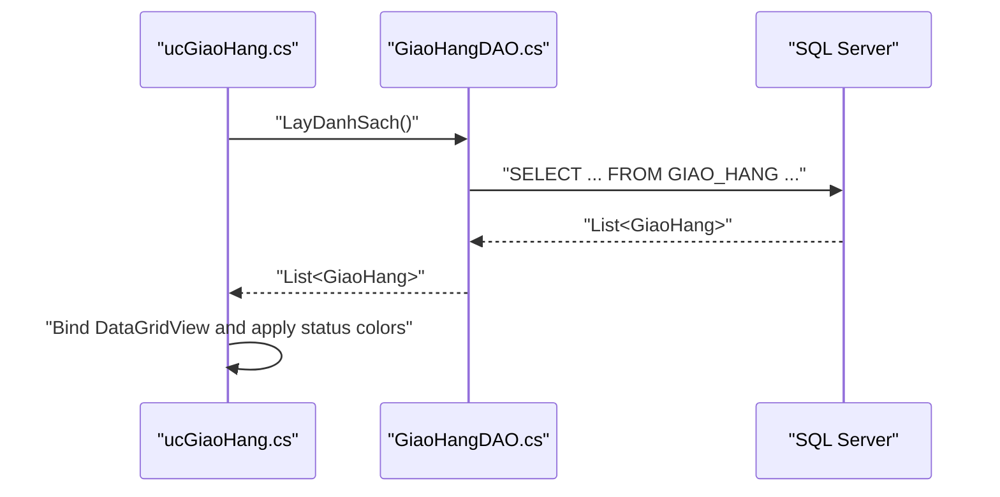
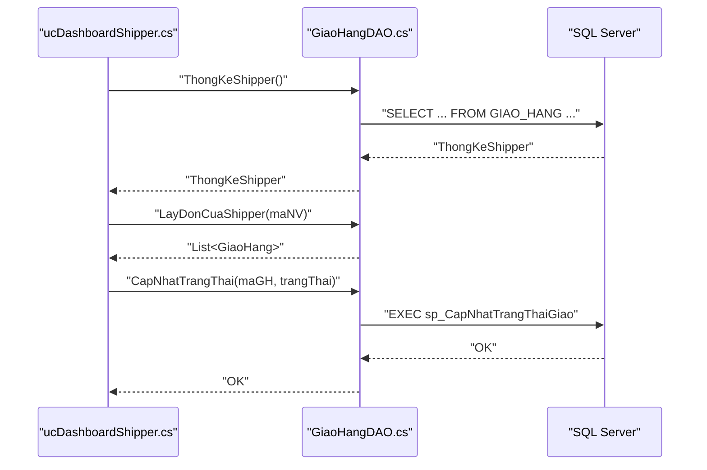
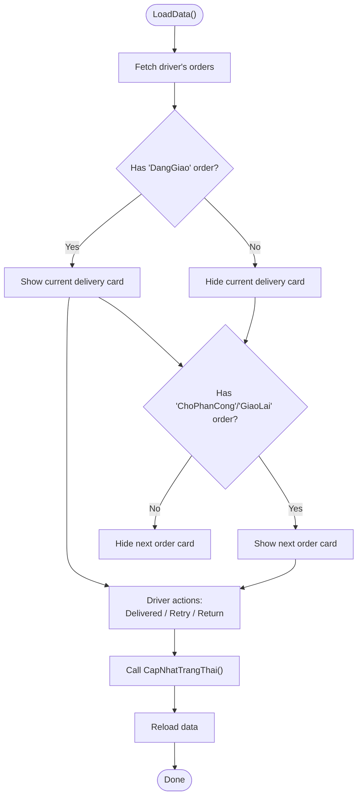
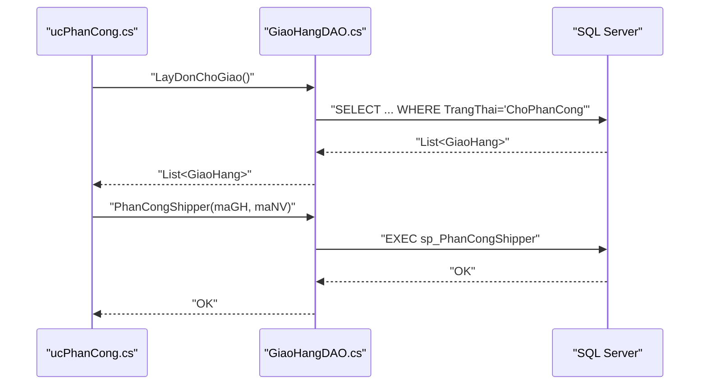
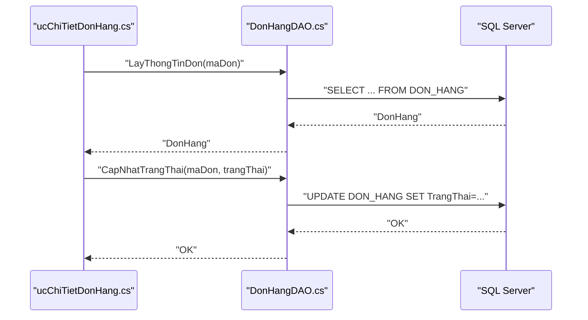
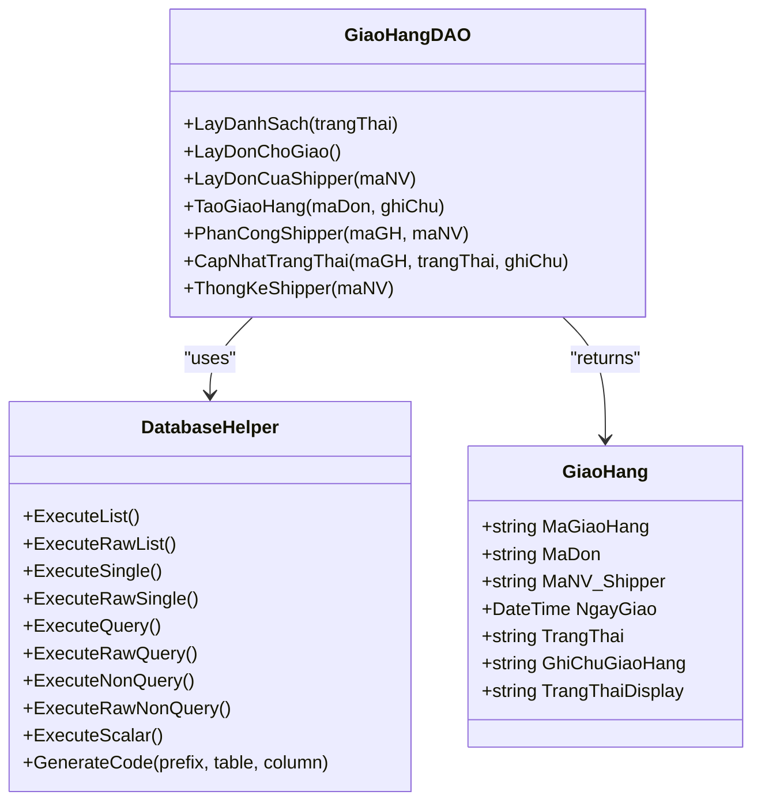
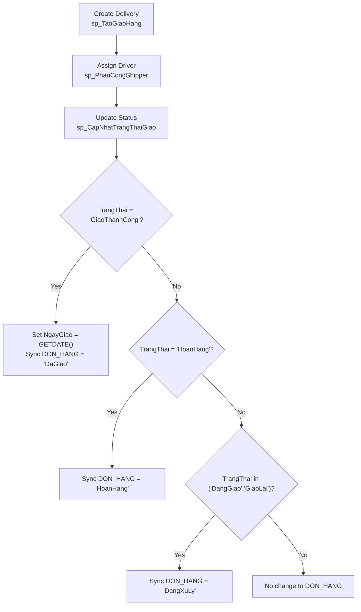
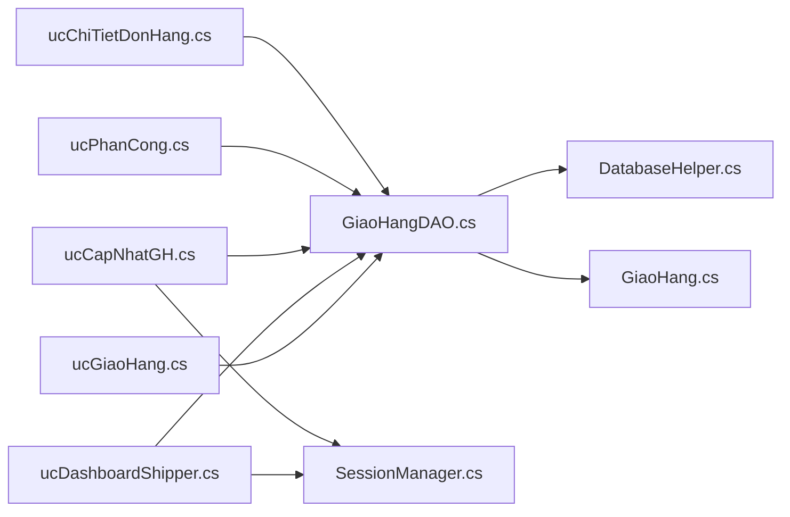

# Delivery Status Tracking

<cite>
**Referenced Files in This Document**
- [ucGiaoHang.cs](file://5_GiaoHang/ucGiaoHang.cs)
- [ucCapNhatGH.cs](file://5_GiaoHang/ucCapNhatGH.cs)
- [ucDashboardShipper.cs](file://5_GiaoHang/ucDashboardShipper.cs)
- [ucPhanCong.cs](file://5_GiaoHang/ucPhanCong.cs)
- [GiaoHangDAO.cs](file://DataAccess/GiaoHangDAO.cs)
- [DatabaseHelper.cs](file://DataAccess/DatabaseHelper.cs)
- [GiaoHang.cs](file://Models/GiaoHang.cs)
- [SessionManager.cs](file://Services/SessionManager.cs)
- [ucChiTietDonHang.cs](file://3_BanHang/ucChiTietDonHang.cs)
- [FloriSys_Database.sql](file://FloriSys_Database.sql)
- [fix_sp.sql](file://fix_sp.sql)
- [fix_sp2.sql](file://fix_sp2.sql)
</cite>

## Table of Contents
1. [Introduction](#introduction)
2. [Project Structure](#project-structure)
3. [Core Components](#core-components)
4. [Architecture Overview](#architecture-overview)
5. [Detailed Component Analysis](#detailed-component-analysis)
6. [Dependency Analysis](#dependency-analysis)
7. [Performance Considerations](#performance-considerations)
8. [Troubleshooting Guide](#troubleshooting-guide)
9. [Conclusion](#conclusion)

## Introduction
This document describes the delivery status tracking system within the Shipping Management Module. It covers real-time monitoring capabilities for delivery agents and administrators, status update mechanisms across delivery stages, integration points with backend systems, and customer-facing tracking features. It also documents the data synchronization behavior between central operations and field devices, offline handling considerations, and reconciliation processes. The goal is to provide a clear understanding of how delivery progress is captured, visualized, and propagated across the system.

## Project Structure
The delivery tracking module is organized around:
- UI components for dispatchers and delivery agents
- Data access layer for retrieving and updating delivery records
- Models representing delivery entities and statistics
- Stored procedures implementing business logic for delivery lifecycle
- Session management for role-aware UI behavior

**Diagram sources**
- [ucGiaoHang.cs:1-139](file://5_GiaoHang/ucGiaoHang.cs#L1-L139)
- [ucDashboardShipper.cs:1-162](file://5_GiaoHang/ucDashboardShipper.cs#L1-L162)
- [ucCapNhatGH.cs:1-184](file://5_GiaoHang/ucCapNhatGH.cs#L1-L184)
- [ucPhanCong.cs:1-215](file://5_GiaoHang/ucPhanCong.cs#L1-L215)
- [ucChiTietDonHang.cs:1-132](file://3_BanHang/ucChiTietDonHang.cs#L1-L132)
- [GiaoHangDAO.cs:1-96](file://DataAccess/GiaoHangDAO.cs#L1-L96)
- [DatabaseHelper.cs:1-212](file://DataAccess/DatabaseHelper.cs#L1-L212)
- [GiaoHang.cs:1-47](file://Models/GiaoHang.cs#L1-L47)
- [SessionManager.cs:1-62](file://Services/SessionManager.cs#L1-L62)
- [FloriSys_Database.sql:90-102](file://FloriSys_Database.sql#L90-L102)
- [FloriSys_Database.sql:413-449](file://FloriSys_Database.sql#L413-L449)

**Section sources**
- [ucGiaoHang.cs:1-139](file://5_GiaoHang/ucGiaoHang.cs#L1-L139)
- [ucDashboardShipper.cs:1-162](file://5_GiaoHang/ucDashboardShipper.cs#L1-L162)
- [ucCapNhatGH.cs:1-184](file://5_GiaoHang/ucCapNhatGH.cs#L1-L184)
- [ucPhanCong.cs:1-215](file://5_GiaoHang/ucPhanCong.cs#L1-L215)
- [ucChiTietDonHang.cs:1-132](file://3_BanHang/ucChiTietDonHang.cs#L1-L132)
- [GiaoHangDAO.cs:1-96](file://DataAccess/GiaoHangDAO.cs#L1-L96)
- [DatabaseHelper.cs:1-212](file://DataAccess/DatabaseHelper.cs#L1-L212)
- [GiaoHang.cs:1-47](file://Models/GiaoHang.cs#L1-L47)
- [SessionManager.cs:1-62](file://Services/SessionManager.cs#L1-L62)
- [FloriSys_Database.sql:90-102](file://FloriSys_Database.sql#L90-L102)
- [FloriSys_Database.sql:413-449](file://FloriSys_Database.sql#L413-L449)

## Core Components
- Delivery dashboard for dispatchers and supervisors to monitor overall delivery KPIs and orders.
- Driver dashboard for delivery agents to manage current deliveries and update statuses.
- Order assignment and distribution screen for assigning drivers to pending deliveries.
- Customer-facing order detail page with status timeline and update controls.
- Data access layer encapsulating queries and stored procedure calls.
- Domain model for delivery records and statistics.
- Session manager enabling role-aware UI behavior.

Key responsibilities:
- Real-time visibility of delivery statuses and KPIs
- Status transitions across “waiting assignment,” “in progress,” “delivered,” “returned,” and “retry”
- Centralized synchronization of delivery state to the master order record
- Role-based UI actions for dispatchers and drivers

**Section sources**
- [ucGiaoHang.cs:25-92](file://5_GiaoHang/ucGiaoHang.cs#L25-L92)
- [ucDashboardShipper.cs:24-111](file://5_GiaoHang/ucDashboardShipper.cs#L24-L111)
- [ucCapNhatGH.cs:31-92](file://5_GiaoHang/ucCapNhatGH.cs#L31-L92)
- [ucPhanCong.cs:49-147](file://5_GiaoHang/ucPhanCong.cs#L49-L147)
- [ucChiTietDonHang.cs:19-99](file://3_BanHang/ucChiTietDonHang.cs#L19-L99)
- [GiaoHangDAO.cs:10-93](file://DataAccess/GiaoHangDAO.cs#L10-L93)
- [GiaoHang.cs:22-36](file://Models/GiaoHang.cs#L22-L36)
- [SessionManager.cs:14-24](file://Services/SessionManager.cs#L14-L24)

## Architecture Overview
The system follows a layered architecture:
- Presentation layer: Windows Forms user controls for dispatcher, driver, and customer views
- Business logic: Data access objects invoking stored procedures
- Persistence: SQL Server tables and stored procedures
- Session management: Role-based access control for UI behavior

**Diagram sources**
- [ucGiaoHang.cs:11-18](file://5_GiaoHang/ucGiaoHang.cs#L11-L18)
- [ucDashboardShipper.cs:9-17](file://5_GiaoHang/ucDashboardShipper.cs#L9-L17)
- [ucCapNhatGH.cs:11-23](file://5_GiaoHang/ucCapNhatGH.cs#L11-L23)
- [ucPhanCong.cs:11-40](file://5_GiaoHang/ucPhanCong.cs#L11-L40)
- [ucChiTietDonHang.cs:9-17](file://3_BanHang/ucChiTietDonHang.cs#L9-L17)
- [GiaoHangDAO.cs:8-94](file://DataAccess/GiaoHangDAO.cs#L8-L94)
- [DatabaseHelper.cs:10-212](file://DataAccess/DatabaseHelper.cs#L10-L212)
- [GiaoHang.cs:5-47](file://Models/GiaoHang.cs#L5-L47)
- [SessionManager.cs:7-24](file://Services/SessionManager.cs#L7-L24)

## Detailed Component Analysis

### Dispatcher Dashboard (ucGiaoHang)
- Loads aggregated delivery statistics and displays a grid of all deliveries with color-coded status.
- Provides quick navigation to the assignment screen.

**Diagram sources**
- [ucGiaoHang.cs:25-65](file://5_GiaoHang/ucGiaoHang.cs#L25-L65)
- [GiaoHangDAO.cs:10-28](file://DataAccess/GiaoHangDAO.cs#L10-L28)

**Section sources**
- [ucGiaoHang.cs:25-130](file://5_GiaoHang/ucGiaoHang.cs#L25-L130)
- [GiaoHangDAO.cs:10-28](file://DataAccess/GiaoHangDAO.cs#L10-L28)

### Driver Dashboard (ucDashboardShipper)
- Shows daily KPIs for the logged-in driver and lists all assigned orders.
- Highlights the currently active delivery and allows immediate status updates.

**Diagram sources**
- [ucDashboardShipper.cs:31-111](file://5_GiaoHang/ucDashboardShipper.cs#L31-L111)
- [GiaoHangDAO.cs:85-93](file://DataAccess/GiaoHangDAO.cs#L85-L93)
- [GiaoHangDAO.cs:75-83](file://DataAccess/GiaoHangDAO.cs#L75-L83)
- [fix_sp2.sql:2-33](file://fix_sp2.sql#L2-L33)

**Section sources**
- [ucDashboardShipper.cs:31-160](file://5_GiaoHang/ucDashboardShipper.cs#L31-L160)
- [GiaoHangDAO.cs:85-93](file://DataAccess/GiaoHangDAO.cs#L85-L93)
- [fix_sp2.sql:2-33](file://fix_sp2.sql#L2-L33)

### Driver Update Screen (ucCapNhatGH)
- Presents the current in-progress order and the next pending order for the driver.
- Enables quick actions: mark as delivered, note a retry (customer not present), or mark as returned.

**Diagram sources**
- [ucCapNhatGH.cs:31-92](file://5_GiaoHang/ucCapNhatGH.cs#L31-L92)
- [ucCapNhatGH.cs:94-176](file://5_GiaoHang/ucCapNhatGH.cs#L94-L176)
- [GiaoHangDAO.cs:75-83](file://DataAccess/GiaoHangDAO.cs#L75-L83)

**Section sources**
- [ucCapNhatGH.cs:31-176](file://5_GiaoHang/ucCapNhatGH.cs#L31-L176)
- [GiaoHangDAO.cs:75-83](file://DataAccess/GiaoHangDAO.cs#L75-L83)

### Assignment Screen (ucPhanCong)
- Lists pending orders ready for assignment and available drivers.
- Allows assigning a driver to a selected order and updates status to “in progress.”

**Diagram sources**
- [ucPhanCong.cs:49-83](file://5_GiaoHang/ucPhanCong.cs#L49-L83)
- [ucPhanCong.cs:174-212](file://5_GiaoHang/ucPhanCong.cs#L174-L212)
- [GiaoHangDAO.cs:30-40](file://DataAccess/GiaoHangDAO.cs#L30-L40)
- [GiaoHangDAO.cs:66-73](file://DataAccess/GiaoHangDAO.cs#L66-L73)
- [FloriSys_Database.sql:425-434](file://FloriSys_Database.sql#L425-L434)

**Section sources**
- [ucPhanCong.cs:49-212](file://5_GiaoHang/ucPhanCong.cs#L49-L212)
- [GiaoHangDAO.cs:30-40](file://DataAccess/GiaoHangDAO.cs#L30-L40)
- [GiaoHangDAO.cs:66-73](file://DataAccess/GiaoHangDAO.cs#L66-L73)
- [FloriSys_Database.sql:425-434](file://FloriSys_Database.sql#L425-L434)

### Customer Order Detail (ucChiTietDonHang)
- Displays order information, items, and a placeholder timeline.
- Provides a dropdown to update order status and a button to save changes.

**Diagram sources**
- [ucChiTietDonHang.cs:33-56](file://3_BanHang/ucChiTietDonHang.cs#L33-L56)
- [ucChiTietDonHang.cs:101-115](file://3_BanHang/ucChiTietDonHang.cs#L101-L115)

**Section sources**
- [ucChiTietDonHang.cs:19-99](file://3_BanHang/ucChiTietDonHang.cs#L19-L99)
- [ucChiTietDonHang.cs:101-115](file://3_BanHang/ucChiTietDonHang.cs#L101-L115)

### Data Access and Models
- GiaoHangDAO encapsulates queries and stored procedure calls for delivery operations.
- DatabaseHelper provides generic mapping and database execution helpers.
- GiaoHang model exposes a display-friendly status property.

**Diagram sources**
- [GiaoHang.cs:5-47](file://Models/GiaoHang.cs#L5-L47)
- [GiaoHangDAO.cs:8-94](file://DataAccess/GiaoHangDAO.cs#L8-L94)
- [DatabaseHelper.cs:10-212](file://DataAccess/DatabaseHelper.cs#L10-L212)

**Section sources**
- [GiaoHangDAO.cs:10-93](file://DataAccess/GiaoHangDAO.cs#L10-L93)
- [DatabaseHelper.cs:16-89](file://DataAccess/DatabaseHelper.cs#L16-L89)
- [GiaoHang.cs:22-36](file://Models/GiaoHang.cs#L22-L36)

### Status Update Mechanisms
Supported delivery stages and transitions:
- Waiting assignment: “ChoPhanCong”
- In progress: “DangGiao”
- Delivered: “GiaoThanhCong” (updates NgayGiao and synchronizes DON_HANG)
- Returned: “HoanHang”
- Retry: “GiaoLai”

Stored procedures implement:
- Creating delivery records
- Assigning drivers and initializing delivery timestamps
- Updating delivery status and synchronizing order status

**Diagram sources**
- [FloriSys_Database.sql:413-423](file://FloriSys_Database.sql#L413-L423)
- [FloriSys_Database.sql:425-434](file://FloriSys_Database.sql#L425-L434)
- [FloriSys_Database.sql:437-448](file://FloriSys_Database.sql#L437-L448)
- [fix_sp2.sql:2-33](file://fix_sp2.sql#L2-L33)

**Section sources**
- [FloriSys_Database.sql:98-99](file://FloriSys_Database.sql#L98-L99)
- [FloriSys_Database.sql:413-448](file://FloriSys_Database.sql#L413-L448)
- [fix_sp2.sql:2-33](file://fix_sp2.sql#L2-L33)

### Integration with Backend Systems
- Centralized status synchronization: delivery status updates propagate to the master order record (DON_HANG).
- Timestamp capture: NgayGiao is set upon successful delivery.
- Role-aware UI: SessionManager enables driver-specific dashboards and actions.

**Section sources**
- [fix_sp2.sql:14-32](file://fix_sp2.sql#L14-L32)
- [SessionManager.cs:14-24](file://Services/SessionManager.cs#L14-L24)

### Customer-Facing Features
- Order detail page shows order information and a status timeline area.
- Administrators can update order status from the order detail view.

**Section sources**
- [ucChiTietDonHang.cs:33-99](file://3_BanHang/ucChiTietDonHang.cs#L33-L99)

### Data Synchronization and Offline Handling
Observed behavior:
- Status updates are executed via stored procedures and immediately reflected in the UI after reload.
- There is no explicit offline mode or local cache layer in the tracked code.

Recommendations:
- Implement local queueing and retry on network failure for field devices.
- Add conflict resolution and reconciliation process for concurrent updates.
- Consider incremental sync and last-modified timestamps.

**Section sources**
- [ucDashboardShipper.cs:113-135](file://5_GiaoHang/ucDashboardShipper.cs#L113-L135)
- [ucCapNhatGH.cs:94-155](file://5_GiaoHang/ucCapNhatGH.cs#L94-L155)
- [ucPhanCong.cs:174-212](file://5_GiaoHang/ucPhanCong.cs#L174-L212)

## Dependency Analysis

**Diagram sources**
- [ucGiaoHang.cs:6-7](file://5_GiaoHang/ucGiaoHang.cs#L6-L7)
- [ucDashboardShipper.cs:4-5](file://5_GiaoHang/ucDashboardShipper.cs#L4-L5)
- [ucCapNhatGH.cs:5-6](file://5_GiaoHang/ucCapNhatGH.cs#L5-L6)
- [ucPhanCong.cs:6-7](file://5_GiaoHang/ucPhanCong.cs#L6-L7)
- [ucChiTietDonHang.cs:4-5](file://3_BanHang/ucChiTietDonHang.cs#L4-L5)
- [GiaoHangDAO.cs:8-9](file://DataAccess/GiaoHangDAO.cs#L8-L9)
- [DatabaseHelper.cs:10-11](file://DataAccess/DatabaseHelper.cs#L10-L11)
- [GiaoHang.cs:5-6](file://Models/GiaoHang.cs#L5-L6)
- [SessionManager.cs:7-8](file://Services/SessionManager.cs#L7-L8)

**Section sources**
- [ucGiaoHang.cs:6-7](file://5_GiaoHang/ucGiaoHang.cs#L6-L7)
- [ucDashboardShipper.cs:4-5](file://5_GiaoHang/ucDashboardShipper.cs#L4-L5)
- [ucCapNhatGH.cs:5-6](file://5_GiaoHang/ucCapNhatGH.cs#L5-L6)
- [ucPhanCong.cs:6-7](file://5_GiaoHang/ucPhanCong.cs#L6-L7)
- [ucChiTietDonHang.cs:4-5](file://3_BanHang/ucChiTietDonHang.cs#L4-L5)
- [GiaoHangDAO.cs:8-9](file://DataAccess/GiaoHangDAO.cs#L8-L9)
- [DatabaseHelper.cs:10-11](file://DataAccess/DatabaseHelper.cs#L10-L11)
- [GiaoHang.cs:5-6](file://Models/GiaoHang.cs#L5-L6)
- [SessionManager.cs:7-8](file://Services/SessionManager.cs#L7-L8)

## Performance Considerations
- UI refreshes after each status update; consider debouncing frequent updates in high-volume scenarios.
- Grid rendering and cell formatting occur per load; optimize by limiting unnecessary rebinds.
- Stored procedures encapsulate database logic; ensure appropriate indexing on GIAO_HANG and DON_HANG for status queries.

## Troubleshooting Guide
Common issues and resolutions:
- Delayed status updates
  - Verify stored procedure execution and confirm NgayGiao is set on successful delivery.
  - Check DON_HANG synchronization for “Delivered,” “Returned,” and “Retry” transitions.
- Communication failures between field devices and central server
  - Implement retry logic and offline queueing for field operations.
  - Add reconciliation to resolve conflicts when connectivity is restored.
- UI not reflecting latest status
  - Ensure the UI reloads data after each update operation.
  - Confirm event handlers trigger LoadData() or equivalent refresh logic.
- Incorrect status colors or labels
  - Validate TrangThaiDisplay mapping and cell formatting logic.

**Section sources**
- [ucDashboardShipper.cs:113-135](file://5_GiaoHang/ucDashboardShipper.cs#L113-L135)
- [ucCapNhatGH.cs:94-155](file://5_GiaoHang/ucCapNhatGH.cs#L94-L155)
- [fix_sp2.sql:14-32](file://fix_sp2.sql#L14-L32)

## Conclusion
The delivery status tracking system provides a clear, role-based workflow for dispatchers and drivers, with centralized synchronization of delivery state to the master order record. While the current implementation focuses on immediate updates and UI refresh, extending support for offline operations and reconciliation would further improve resilience and accuracy in field environments.