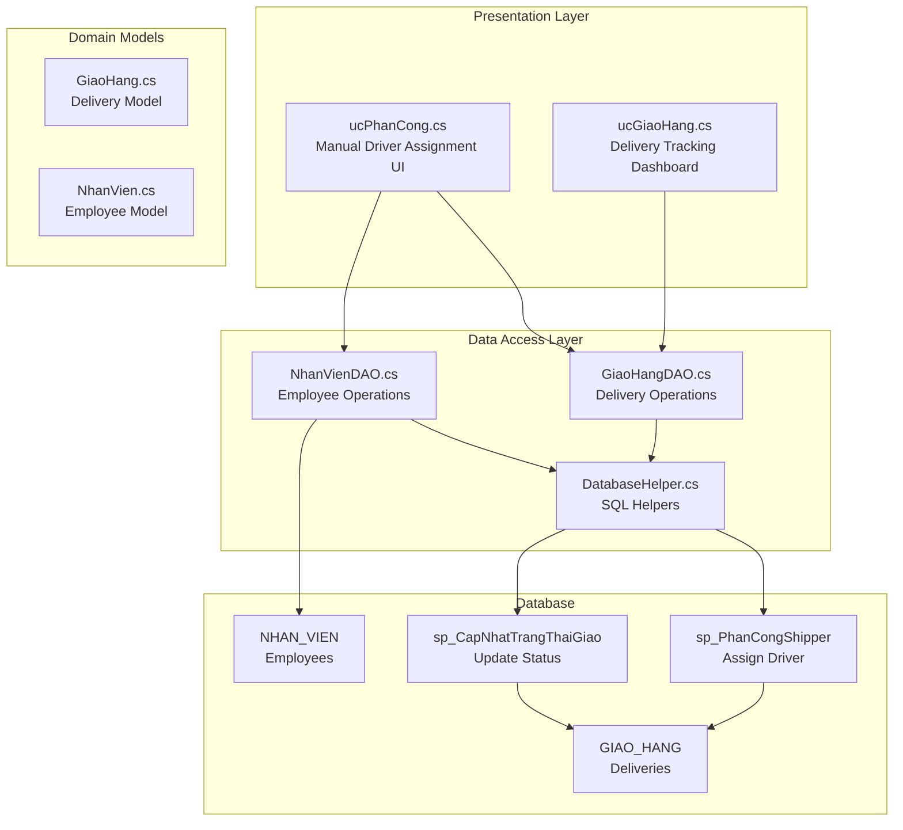
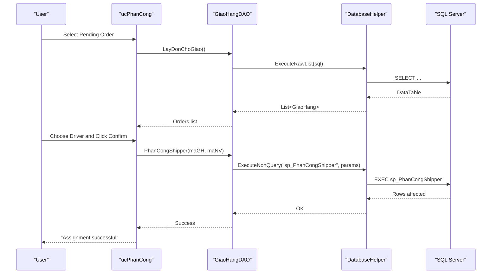
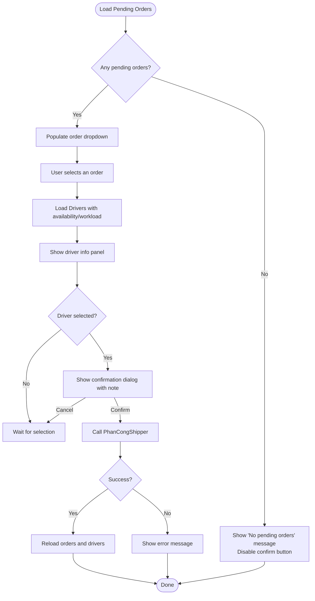
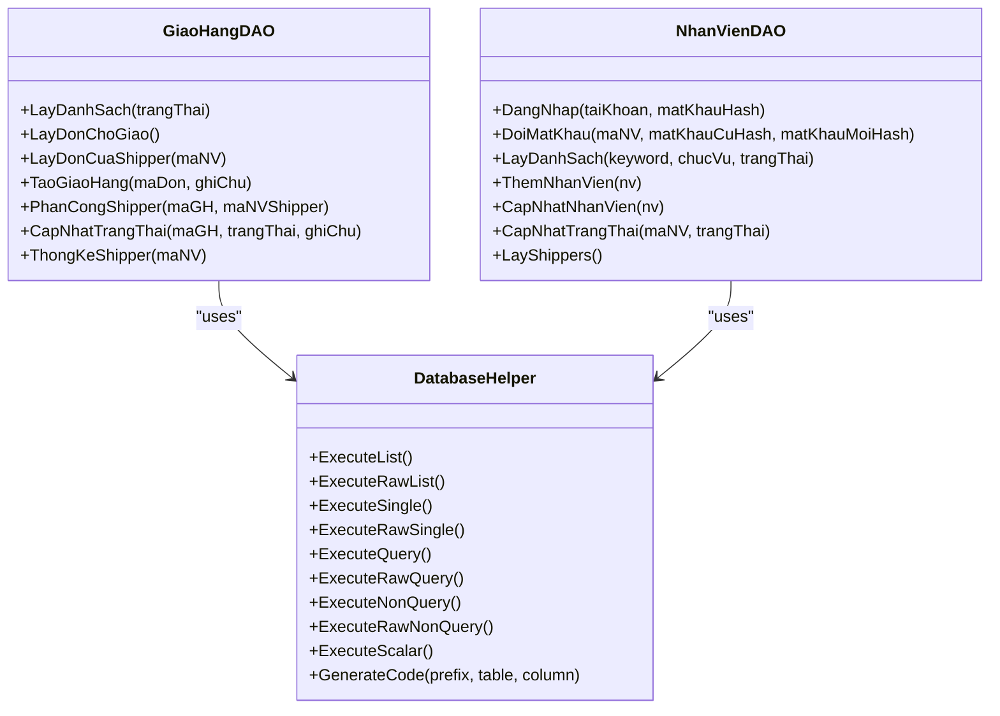
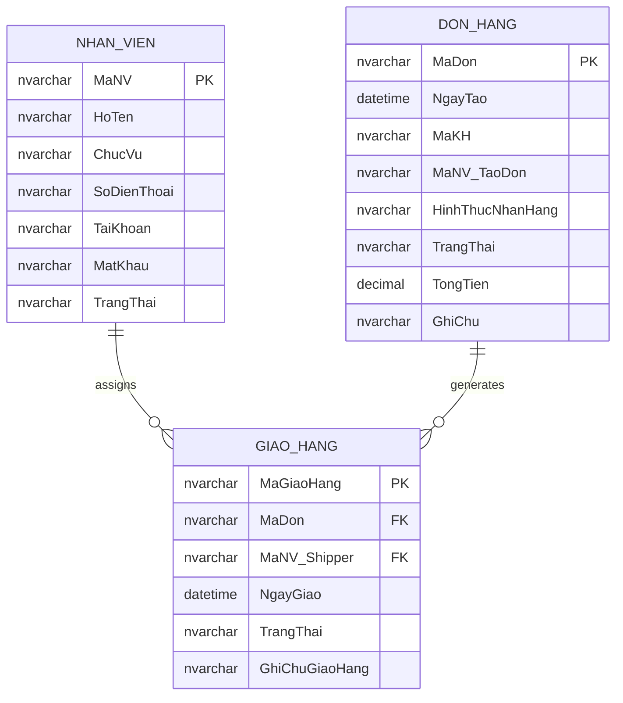
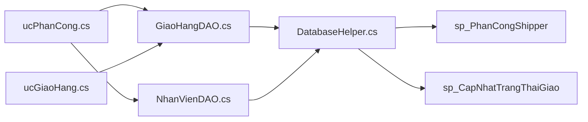

# Driver Assignment

<cite>
**Referenced Files in This Document**
- [ucPhanCong.cs](file://5_GiaoHang/ucPhanCong.cs)
- [ucPhanCong.Designer.cs](file://5_GiaoHang/ucPhanCong.Designer.cs)
- [ucGiaoHang.cs](file://5_GiaoHang/ucGiaoHang.cs)
- [ucGiaoHang.Designer.cs](file://5_GiaoHang/ucGiaoHang.Designer.cs)
- [GiaoHangDAO.cs](file://DataAccess/GiaoHangDAO.cs)
- [NhanVienDAO.cs](file://DataAccess/NhanVienDAO.cs)
- [DatabaseHelper.cs](file://DataAccess/DatabaseHelper.cs)
- [GiaoHang.cs](file://Models/GiaoHang.cs)
- [NhanVien.cs](file://Models/NhanVien.cs)
- [FloriSys_Database.sql](file://FloriSys_Database.sql)
</cite>

## Table of Contents
1. [Introduction](#introduction)
2. [Project Structure](#project-structure)
3. [Core Components](#core-components)
4. [Architecture Overview](#architecture-overview)
5. [Detailed Component Analysis](#detailed-component-analysis)
6. [Dependency Analysis](#dependency-analysis)
7. [Performance Considerations](#performance-considerations)
8. [Troubleshooting Guide](#troubleshooting-guide)
9. [Conclusion](#conclusion)

## Introduction
This document describes the driver assignment system within the Shipping Management Module. It explains the end-to-end driver allocation workflow, including order selection, driver availability checks, manual assignment, and confirmation. It documents the integration with the driver management system to retrieve active drivers and their current delivery assignments, assignment history tracking, driver performance metrics collection, and capacity management for optimal fleet utilization. It also covers the user interface components for driver selection, assignment validation, and real-time assignment updates, along with error handling strategies and operational procedures for schedule conflicts, special delivery requirements, and emergency reassignment.

## Project Structure
The driver assignment feature spans three layers:
- Presentation Layer: Windows Forms user controls for order listing, driver dashboard, and assignment confirmation.
- Data Access Layer: DAO classes and helpers for database interactions and stored procedure execution.
- Domain Models: Strongly typed models for orders, deliveries, and employees.

**Diagram sources**
- [ucPhanCong.cs:11-215](file://5_GiaoHang/ucPhanCong.cs#L11-L215)
- [ucGiaoHang.cs:11-139](file://5_GiaoHang/ucGiaoHang.cs#L11-L139)
- [GiaoHangDAO.cs:8-96](file://DataAccess/GiaoHangDAO.cs#L8-L96)
- [NhanVienDAO.cs:9-99](file://DataAccess/NhanVienDAO.cs#L9-L99)
- [DatabaseHelper.cs:10-212](file://DataAccess/DatabaseHelper.cs#L10-L212)
- [FloriSys_Database.sql:425-449](file://FloriSys_Database.sql#L425-L449)

**Section sources**
- [ucPhanCong.cs:11-215](file://5_GiaoHang/ucPhanCong.cs#L11-L215)
- [ucGiaoHang.cs:11-139](file://5_GiaoHang/ucGiaoHang.cs#L11-L139)
- [GiaoHangDAO.cs:8-96](file://DataAccess/GiaoHangDAO.cs#L8-L96)
- [NhanVienDAO.cs:9-99](file://DataAccess/NhanVienDAO.cs#L9-L99)
- [DatabaseHelper.cs:10-212](file://DataAccess/DatabaseHelper.cs#L10-L212)
- [FloriSys_Database.sql:425-449](file://FloriSys_Database.sql#L425-L449)

## Core Components
- Manual Driver Assignment UI (ucPhanCong): Loads pending orders, displays driver availability and workload, supports manual selection, and confirms assignment.
- Delivery Tracking Dashboard (ucGiaoHang): Shows all deliveries with status KPIs and color-coded rows.
- Data Access Layer (GiaoHangDAO, NhanVienDAO): Encapsulates queries and stored procedures for delivery and employee operations.
- Database Stored Procedures: sp_PhanCongShipper, sp_CapNhatTrangThaiGiao, sp_SinhMa, and others.
- Domain Models: GiaoHang and NhanVien define strongly-typed entities and computed display properties.

Key responsibilities:
- Order selection and validation
- Driver availability and workload checks
- Manual assignment and confirmation
- Real-time status updates and history tracking
- Integration with driver management for active drivers

**Section sources**
- [ucPhanCong.cs:42-212](file://5_GiaoHang/ucPhanCong.cs#L42-L212)
- [ucGiaoHang.cs:20-136](file://5_GiaoHang/ucGiaoHang.cs#L20-L136)
- [GiaoHangDAO.cs:10-96](file://DataAccess/GiaoHangDAO.cs#L10-L96)
- [NhanVienDAO.cs:31-99](file://DataAccess/NhanVienDAO.cs#L31-L99)
- [GiaoHang.cs:5-47](file://Models/GiaoHang.cs#L5-L47)
- [NhanVien.cs:5-40](file://Models/NhanVien.cs#L5-L40)

## Architecture Overview
The driver assignment architecture follows a layered pattern:
- UI triggers actions on user controls.
- DAO classes call DatabaseHelper for SQL execution.
- DatabaseHelper executes stored procedures or raw SQL.
- Stored procedures update the GIAO_HANG table and related entities.

**Diagram sources**
- [ucPhanCong.cs:42-212](file://5_GiaoHang/ucPhanCong.cs#L42-L212)
- [GiaoHangDAO.cs:30-73](file://DataAccess/GiaoHangDAO.cs#L30-L73)
- [DatabaseHelper.cs:104-157](file://DataAccess/DatabaseHelper.cs#L104-L157)
- [FloriSys_Database.sql:425-434](file://FloriSys_Database.sql#L425-L434)

## Detailed Component Analysis

### Manual Driver Assignment UI (ucPhanCong)
Responsibilities:
- Load pending orders ready for shipping.
- Display driver availability and workload (currently assigned, today delivered, status).
- Allow manual driver selection from a dropdown or grid.
- Capture optional notes for the driver.
- Confirm assignment with a dialog prompt.
- Refresh lists after successful assignment.

Driver availability and workload:
- The driver list is ordered by current workload (ascending).
- A derived status indicates “available” vs “busy.”
- Selected driver details are shown in a dedicated panel.

Assignment confirmation:
- Confirmation dialog includes order ID, driver name, and optional note.
- On confirmation, the system invokes the assignment stored procedure.

Real-time updates:
- After assignment, the UI reloads pending orders and driver list.

**Diagram sources**
- [ucPhanCong.cs:49-212](file://5_GiaoHang/ucPhanCong.cs#L49-L212)

**Section sources**
- [ucPhanCong.cs:42-212](file://5_GiaoHang/ucPhanCong.cs#L42-L212)
- [ucPhanCong.Designer.cs:29-521](file://5_GiaoHang/ucPhanCong.Designer.cs#L29-L521)

### Delivery Tracking Dashboard (ucGiaoHang)
Responsibilities:
- Load and display all deliveries with customer, address, requested time, assigned driver, and status.
- Compute and show KPIs: pending, in-progress, delivered today, returned.
- Color-code status cells for readability.
- Provide a quick navigation hint to the assignment screen.

Status mapping and formatting:
- Status values are mapped to localized labels and styled with distinct colors.
- Empty driver fields are displayed as a dash with muted color.

**Section sources**
- [ucGiaoHang.cs:20-136](file://5_GiaoHang/ucGiaoHang.cs#L20-L136)
- [ucGiaoHang.Designer.cs:29-428](file://5_GiaoHang/ucGiaoHang.Designer.cs#L29-L428)

### Data Access Layer (GiaoHangDAO, NhanVienDAO, DatabaseHelper)
GiaoHangDAO:
- Retrieves lists of deliveries, pending orders, and driver-specific assignments.
- Creates deliveries, assigns drivers, and updates statuses via stored procedures.

NhanVienDAO:
- Provides employee listing and role filtering (active shippers).
- Supports login, password change, and status updates.

DatabaseHelper:
- Generic mapping helpers for strong typing.
- Executes stored procedures and raw SQL, scalar queries, and code generation.

**Diagram sources**
- [GiaoHangDAO.cs:8-96](file://DataAccess/GiaoHangDAO.cs#L8-L96)
- [NhanVienDAO.cs:9-99](file://DataAccess/NhanVienDAO.cs#L9-L99)
- [DatabaseHelper.cs:10-212](file://DataAccess/DatabaseHelper.cs#L10-L212)

**Section sources**
- [GiaoHangDAO.cs:10-96](file://DataAccess/GiaoHangDAO.cs#L10-L96)
- [NhanVienDAO.cs:31-99](file://DataAccess/NhanVienDAO.cs#L31-L99)
- [DatabaseHelper.cs:16-212](file://DataAccess/DatabaseHelper.cs#L16-L212)

### Stored Procedures and Database Schema
Key stored procedures:
- sp_PhanCongShipper: Assigns a driver to a delivery and sets status to “in progress.”
- sp_CapNhatTrangThaiGiao: Updates delivery status and optional notes.
- sp_SinhMa: Generates new codes for entities.

Schema highlights:
- GIAO_HANG table stores delivery records, foreign keys to orders and employees, and status enumeration.
- NHAN_VIEN table stores employee roles and employment status.

**Diagram sources**
- [FloriSys_Database.sql:22-101](file://FloriSys_Database.sql#L22-L101)

**Section sources**
- [FloriSys_Database.sql:425-449](file://FloriSys_Database.sql#L425-L449)
- [FloriSys_Database.sql:93-101](file://FloriSys_Database.sql#L93-L101)

## Dependency Analysis
- ucPhanCong depends on GiaoHangDAO for pending orders and assignment, and on DatabaseHelper for driver list queries.
- ucGiaoHang depends on GiaoHangDAO for delivery listing and status KPIs.
- GiaoHangDAO and NhanVienDAO depend on DatabaseHelper for SQL operations.
- Stored procedures encapsulate business logic for assignment and status updates.

Potential circular dependencies: None observed among the analyzed components.

**Diagram sources**
- [ucPhanCong.cs:6-7](file://5_GiaoHang/ucPhanCong.cs#L6-L7)
- [ucGiaoHang.cs:6-7](file://5_GiaoHang/ucGiaoHang.cs#L6-L7)
- [GiaoHangDAO.cs:8-9](file://DataAccess/GiaoHangDAO.cs#L8-L9)
- [NhanVienDAO.cs:9-10](file://DataAccess/NhanVienDAO.cs#L9-L10)
- [DatabaseHelper.cs:10-11](file://DataAccess/DatabaseHelper.cs#L10-L11)
- [FloriSys_Database.sql:425-449](file://FloriSys_Database.sql#L425-L449)

**Section sources**
- [ucPhanCong.cs:6-7](file://5_GiaoHang/ucPhanCong.cs#L6-L7)
- [ucGiaoHang.cs:6-7](file://5_GiaoHang/ucGiaoHang.cs#L6-L7)
- [GiaoHangDAO.cs:8-9](file://DataAccess/GiaoHangDAO.cs#L8-L9)
- [NhanVienDAO.cs:9-10](file://DataAccess/NhanVienDAO.cs#L9-L10)
- [DatabaseHelper.cs:10-11](file://DataAccess/DatabaseHelper.cs#L10-L11)

## Performance Considerations
- UI responsiveness: Driver list and pending orders are loaded asynchronously on load events. Consider moving heavy queries off the UI thread if datasets grow.
- Sorting and filtering: The driver list is ordered by current workload; ensure appropriate indexing on GIAO_HANG for efficient aggregation.
- Batch operations: For bulk assignments, batch stored procedure calls can reduce round-trips.
- Caching: Frequently accessed driver availability could be cached per session to minimize repeated queries.

## Troubleshooting Guide
Common issues and resolutions:
- No pending orders available: The UI disables the confirm button and shows a message. Verify that orders exist with the expected status.
- Driver not selected: The UI prompts to select a driver before confirming. Ensure the driver dropdown has items populated.
- Assignment failure: Errors during assignment are caught and displayed. Verify stored procedure permissions and parameter values.
- Driver unavailable: The system does not enforce strict conflict checks; operators should rely on the displayed status (“available” vs “busy”) and manually avoid conflicts.

Operational procedures:
- Schedule conflicts: Operators should visually inspect the driver’s current workload and status before assigning.
- Special delivery requirements: Use the notes field to communicate special instructions to the driver.
- Emergency reassignment: Use the status update stored procedure to change a delivery’s status or route.

**Section sources**
- [ucPhanCong.cs:79-82](file://5_GiaoHang/ucPhanCong.cs#L79-L82)
- [ucPhanCong.cs:182-187](file://5_GiaoHang/ucPhanCong.cs#L182-L187)
- [ucPhanCong.cs:207-210](file://5_GiaoHang/ucPhanCong.cs#L207-L210)
- [ucGiaoHang.cs:132-136](file://5_GiaoHang/ucGiaoHang.cs#L132-L136)

## Conclusion
The driver assignment system integrates a straightforward UI with robust data access and stored procedures to manage delivery assignments. It emphasizes manual control, real-time visibility, and clear status reporting. While the current implementation focuses on manual assignment and basic availability indicators, future enhancements can incorporate geographic proximity, workload balancing algorithms, and automated conflict detection to further optimize fleet utilization and service quality.