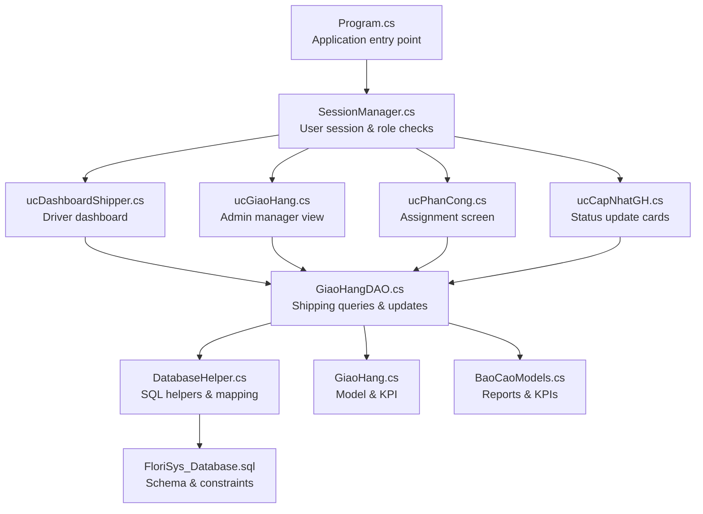
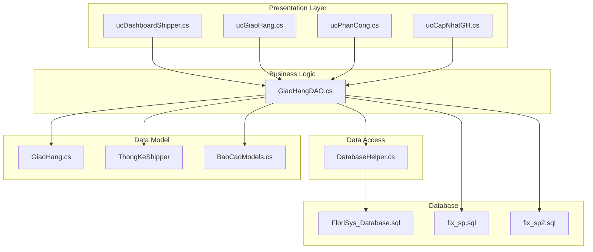
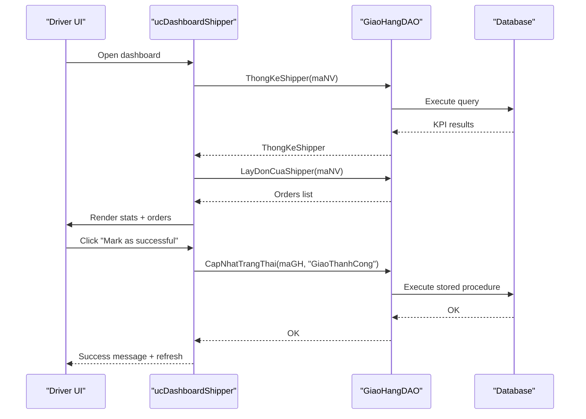
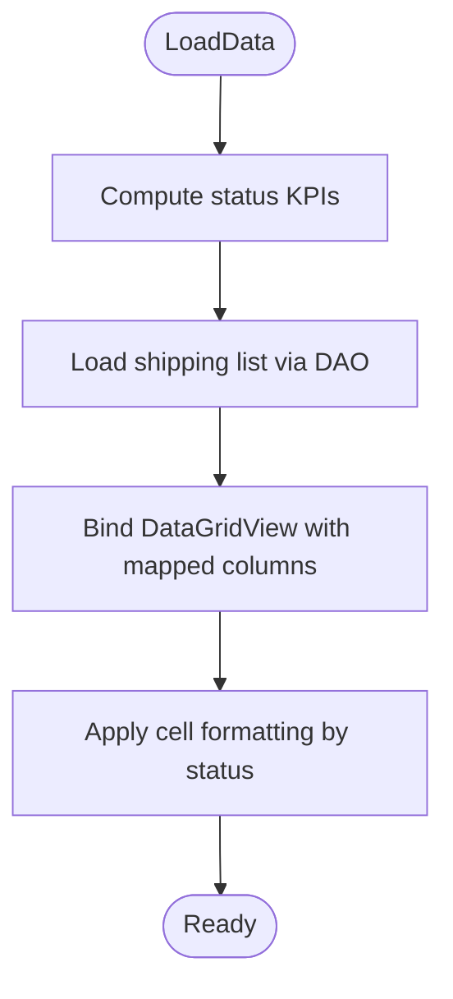
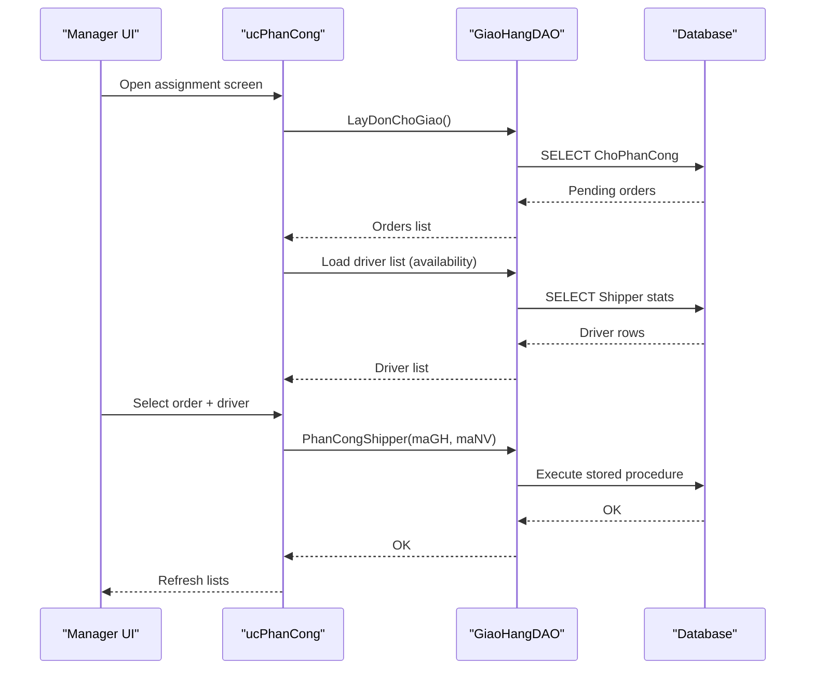
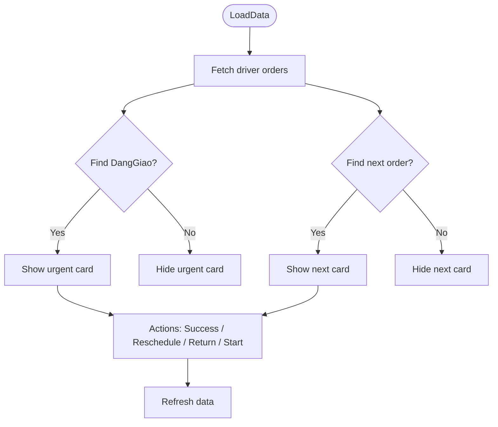
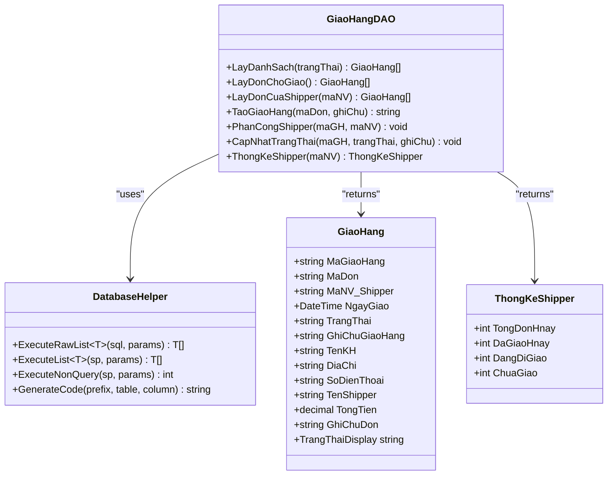
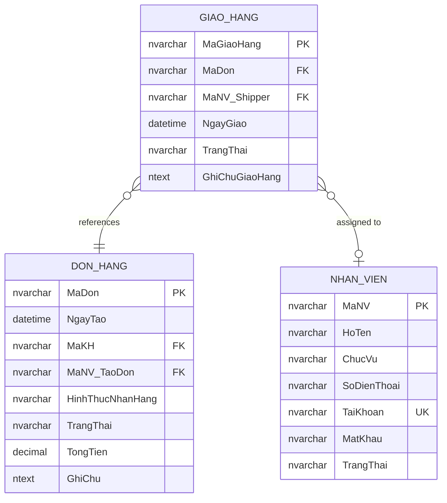
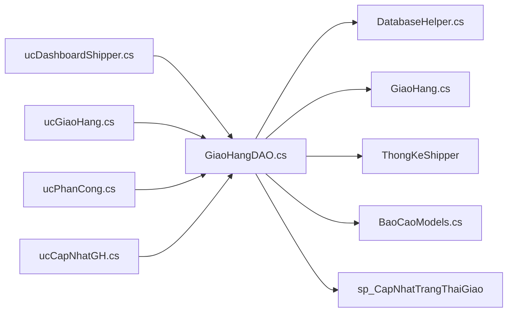
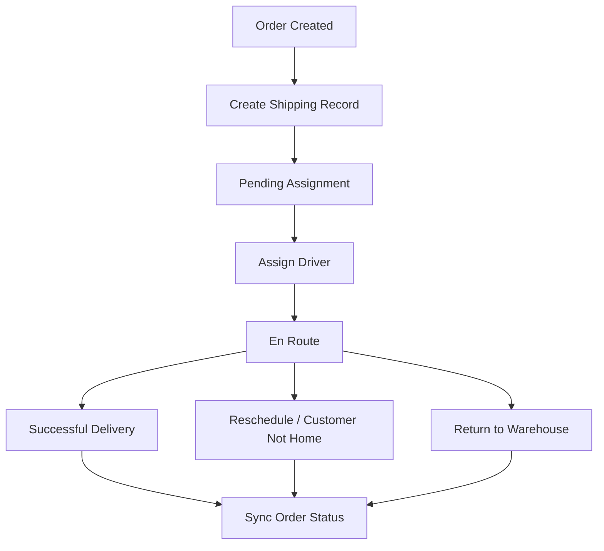

# Shipping Management Module

<cite>
**Referenced Files in This Document**
- [Program.cs](file://Program.cs)
- [SessionManager.cs](file://Services/SessionManager.cs)
- [ucGiaoHang.cs](file://5_GiaoHang/ucGiaoHang.cs)
- [ucPhanCong.cs](file://5_GiaoHang/ucPhanCong.cs)
- [ucCapNhatGH.cs](file://5_GiaoHang/ucCapNhatGH.cs)
- [ucDashboardShipper.cs](file://5_GiaoHang/ucDashboardShipper.cs)
- [GiaoHangDAO.cs](file://DataAccess/GiaoHangDAO.cs)
- [DatabaseHelper.cs](file://DataAccess/DatabaseHelper.cs)
- [GiaoHang.cs](file://Models/GiaoHang.cs)
- [BaoCaoModels.cs](file://Models/BaoCaoModels.cs)
- [FloriSys_Database.sql](file://FloriSys_Database.sql)
- [fix_sp.sql](file://fix_sp.sql)
- [fix_sp2.sql](file://fix_sp2.sql)
- [mock.sql](file://mock.sql)
</cite>

## Table of Contents
1. [Introduction](#introduction)
2. [Project Structure](#project-structure)
3. [Core Components](#core-components)
4. [Architecture Overview](#architecture-overview)
5. [Detailed Component Analysis](#detailed-component-analysis)
6. [Dependency Analysis](#dependency-analysis)
7. [Performance Considerations](#performance-considerations)
8. [Troubleshooting Guide](#troubleshooting-guide)
9. [Conclusion](#conclusion)
10. [Appendices](#appendices)

## Introduction
This document describes the Shipping Management Module within the FloriSys application. It covers the end-to-end delivery coordination workflow from order confirmation to delivery completion, including driver assignment, route optimization considerations, delivery scheduling, real-time tracking, status updates, and customer notifications. It also documents integrations with order management, inventory dispatch, and driver mobile applications, along with delivery performance metrics, driver productivity tracking, and cost analysis. Operational procedures for delivery exceptions, rescheduling, and customer service handling are included, alongside fleet management considerations, vehicle tracking, and delivery service optimization strategies.

## Project Structure
The shipping module is organized around a Windows Forms UI layer, a data access layer (DAO + DatabaseHelper), and strongly-typed models. The module integrates with the broader application via session management and the main application entry point.

**Diagram sources**
- [Program.cs:11-22](file://Program.cs#L11-L22)
- [SessionManager.cs:7-30](file://Services/SessionManager.cs#L7-L30)
- [ucDashboardShipper.cs:14-29](file://5_GiaoHang/ucDashboardShipper.cs#L14-L29)
- [ucGiaoHang.cs:20-65](file://5_GiaoHang/ucGiaoHang.cs#L20-L65)
- [ucPhanCong.cs:42-83](file://5_GiaoHang/ucPhanCong.cs#L42-L83)
- [ucCapNhatGH.cs:25-92](file://5_GiaoHang/ucCapNhatGH.cs#L25-L92)
- [GiaoHangDAO.cs:10-93](file://DataAccess/GiaoHangDAO.cs#L10-L93)
- [DatabaseHelper.cs:104-172](file://DataAccess/DatabaseHelper.cs#L104-L172)
- [GiaoHang.cs:5-46](file://Models/GiaoHang.cs#L5-L46)
- [BaoCaoModels.cs:39-52](file://Models/BaoCaoModels.cs#L39-L52)
- [FloriSys_Database.sql:93-101](file://FloriSys_Database.sql#L93-L101)

**Section sources**
- [Program.cs:11-22](file://Program.cs#L11-L22)
- [SessionManager.cs:7-30](file://Services/SessionManager.cs#L7-L30)

## Core Components
- Driver Dashboard (ucDashboardShipper): Displays daily statistics, current deliveries, and allows quick status updates (success, reschedule, return).
- Manager View (ucGiaoHang): Shows all shipping records with status KPIs and color-coded statuses.
- Assignment Screen (ucPhanCong): Lists pending orders and available drivers, enabling manual assignment with availability indicators.
- Status Update Cards (ucCapNhatGH): Presents the urgent current delivery and the next pending delivery with action buttons.
- Data Access (GiaoHangDAO): Centralized access to shipping data, including listing, assignment, and status updates.
- Database Layer (DatabaseHelper): Generic SQL execution, mapping, and code generation helpers.
- Models (GiaoHang, ThongKeShipper): Strongly typed entities for shipping records and driver KPIs.
- Reports & KPIs (BaoCaoModels): Supporting report models for dashboards and analytics.

**Section sources**
- [ucDashboardShipper.cs:24-111](file://5_GiaoHang/ucDashboardShipper.cs#L24-L111)
- [ucGiaoHang.cs:25-92](file://5_GiaoHang/ucGiaoHang.cs#L25-L92)
- [ucPhanCong.cs:49-147](file://5_GiaoHang/ucPhanCong.cs#L49-L147)
- [ucCapNhatGH.cs:31-92](file://5_GiaoHang/ucCapNhatGH.cs#L31-L92)
- [GiaoHangDAO.cs:10-93](file://DataAccess/GiaoHangDAO.cs#L10-L93)
- [DatabaseHelper.cs:19-52](file://DataAccess/DatabaseHelper.cs#L19-L52)
- [GiaoHang.cs:5-46](file://Models/GiaoHang.cs#L5-L46)
- [BaoCaoModels.cs:39-52](file://Models/BaoCaoModels.cs#L39-L52)

## Architecture Overview
The shipping module follows a layered architecture:
- Presentation Layer: Windows Forms user controls for admin, manager, and driver views.
- Business Logic: DAO methods encapsulate shipping operations.
- Data Access: DatabaseHelper provides generic SQL execution and object mapping.
- Data Model: Strongly typed models for shipping records and KPIs.
- Database: Relational schema with constraints and stored procedures for shipping operations.

**Diagram sources**
- [ucDashboardShipper.cs:14-29](file://5_GiaoHang/ucDashboardShipper.cs#L14-L29)
- [ucGiaoHang.cs:20-65](file://5_GiaoHang/ucGiaoHang.cs#L20-L65)
- [ucPhanCong.cs:42-83](file://5_GiaoHang/ucPhanCong.cs#L42-L83)
- [ucCapNhatGH.cs:25-92](file://5_GiaoHang/ucCapNhatGH.cs#L25-L92)
- [GiaoHangDAO.cs:10-93](file://DataAccess/GiaoHangDAO.cs#L10-L93)
- [DatabaseHelper.cs:104-172](file://DataAccess/DatabaseHelper.cs#L104-L172)
- [GiaoHang.cs:5-46](file://Models/GiaoHang.cs#L5-L46)
- [BaoCaoModels.cs:39-52](file://Models/BaoCaoModels.cs#L39-L52)
- [FloriSys_Database.sql:93-101](file://FloriSys_Database.sql#L93-L101)
- [fix_sp.sql:2-34](file://fix_sp.sql#L2-L34)
- [fix_sp2.sql:2-33](file://fix_sp2.sql#L2-L33)

## Detailed Component Analysis

### Driver Dashboard (ucDashboardShipper)
- Purpose: Provides the logged-in driver with daily KPIs, a list of assigned orders, and the currently active delivery.
- Key features:
  - Daily KPIs: total, delivered today, en route, pending.
  - Order list with status filtering and selection.
  - Quick actions: mark as successful, note customer not home, record return.
  - Current delivery highlighting and selection persistence.

**Diagram sources**
- [ucDashboardShipper.cs:31-41](file://5_GiaoHang/ucDashboardShipper.cs#L31-L41)
- [ucDashboardShipper.cs:43-63](file://5_GiaoHang/ucDashboardShipper.cs#L43-L63)
- [ucDashboardShipper.cs:65-111](file://5_GiaoHang/ucDashboardShipper.cs#L65-L111)
- [GiaoHangDAO.cs:85-93](file://DataAccess/GiaoHangDAO.cs#L85-L93)
- [GiaoHangDAO.cs:42-51](file://DataAccess/GiaoHangDAO.cs#L42-L51)
- [GiaoHangDAO.cs:75-83](file://DataAccess/GiaoHangDAO.cs#L75-L83)

**Section sources**
- [ucDashboardShipper.cs:24-111](file://5_GiaoHang/ucDashboardShipper.cs#L24-L111)
- [GiaoHangDAO.cs:30-51](file://DataAccess/GiaoHangDAO.cs#L30-L51)
- [GiaoHangDAO.cs:85-93](file://DataAccess/GiaoHangDAO.cs#L85-L93)

### Manager Shipping View (ucGiaoHang)
- Purpose: Admin/manager overview of all shipping records with status KPIs and color-coded statuses.
- Key features:
  - Loads shipping list with join fields (customer, address, phone, total amount).
  - Computes KPIs per status category.
  - Cell formatting for status readability.

**Diagram sources**
- [ucGiaoHang.cs:25-92](file://5_GiaoHang/ucGiaoHang.cs#L25-L92)
- [GiaoHangDAO.cs:10-28](file://DataAccess/GiaoHangDAO.cs#L10-L28)

**Section sources**
- [ucGiaoHang.cs:25-92](file://5_GiaoHang/ucGiaoHang.cs#L25-L92)
- [GiaoHangDAO.cs:10-28](file://DataAccess/GiaoHangDAO.cs#L10-L28)

### Driver Assignment (ucPhanCong)
- Purpose: Assigns available drivers to pending orders with availability awareness.
- Key features:
  - Loads pending orders (ChoPhanCong).
  - Queries driver availability and counts active deliveries.
  - Allows selecting a driver and confirming assignment.
  - Updates status and reloads lists.

**Diagram sources**
- [ucPhanCong.cs:49-83](file://5_GiaoHang/ucPhanCong.cs#L49-L83)
- [ucPhanCong.cs:100-147](file://5_GiaoHang/ucPhanCong.cs#L100-L147)
- [GiaoHangDAO.cs:30-39](file://DataAccess/GiaoHangDAO.cs#L30-L39)
- [GiaoHangDAO.cs:66-73](file://DataAccess/GiaoHangDAO.cs#L66-L73)

**Section sources**
- [ucPhanCong.cs:49-147](file://5_GiaoHang/ucPhanCong.cs#L49-L147)
- [GiaoHangDAO.cs:30-39](file://DataAccess/GiaoHangDAO.cs#L30-L39)
- [GiaoHangDAO.cs:66-73](file://DataAccess/GiaoHangDAO.cs#L66-L73)

### Status Update Cards (ucCapNhatGH)
- Purpose: Streamlined actions for the driver’s current and next delivery.
- Key features:
  - Identifies the first “DangGiao” order and the first “ChoPhanCong” or “GiaoLai” order.
  - Buttons to mark successful delivery, note customer not home (reschedule), record return, and start delivery.

**Diagram sources**
- [ucCapNhatGH.cs:31-92](file://5_GiaoHang/ucCapNhatGH.cs#L31-L92)
- [ucCapNhatGH.cs:94-176](file://5_GiaoHang/ucCapNhatGH.cs#L94-L176)
- [GiaoHangDAO.cs:42-51](file://DataAccess/GiaoHangDAO.cs#L42-L51)
- [GiaoHangDAO.cs:75-83](file://DataAccess/GiaoHangDAO.cs#L75-L83)

**Section sources**
- [ucCapNhatGH.cs:31-92](file://5_GiaoHang/ucCapNhatGH.cs#L31-L92)
- [ucCapNhatGH.cs:94-176](file://5_GiaoHang/ucCapNhatGH.cs#L94-L176)
- [GiaoHangDAO.cs:42-51](file://DataAccess/GiaoHangDAO.cs#L42-L51)
- [GiaoHangDAO.cs:75-83](file://DataAccess/GiaoHangDAO.cs#L75-L83)

### Data Access Layer (GiaoHangDAO)
- Responsibilities:
  - Listing shipping records with filters and joins.
  - Retrieving pending orders and orders assigned to a specific driver.
  - Creating shipping records and assigning drivers.
  - Updating delivery statuses and synchronizing parent order status.
  - Driver KPI aggregation.

**Diagram sources**
- [GiaoHangDAO.cs:8-94](file://DataAccess/GiaoHangDAO.cs#L8-L94)
- [DatabaseHelper.cs:19-52](file://DataAccess/DatabaseHelper.cs#L19-L52)
- [GiaoHang.cs:5-46](file://Models/GiaoHang.cs#L5-L46)
- [BaoCaoModels.cs:39-45](file://Models/BaoCaoModels.cs#L39-L45)

**Section sources**
- [GiaoHangDAO.cs:10-93](file://DataAccess/GiaoHangDAO.cs#L10-L93)
- [DatabaseHelper.cs:19-52](file://DataAccess/DatabaseHelper.cs#L19-L52)
- [GiaoHang.cs:5-46](file://Models/GiaoHang.cs#L5-L46)
- [BaoCaoModels.cs:39-45](file://Models/BaoCaoModels.cs#L39-L45)

### Database Schema and Stored Procedures
- Schema highlights:
  - GIAO_HANG table stores shipping records with foreign keys to DON_HANG and NHAN_VIEN.
  - Constraints enforce valid status values for shipping and orders.
- Stored procedures:
  - sp_CapNhatTrangThaiGiao updates shipping status and synchronizes DON_HANG status accordingly.
  - Historical scripts show earlier and revised versions of the procedure.

**Diagram sources**
- [FloriSys_Database.sql:93-101](file://FloriSys_Database.sql#L93-L101)
- [FloriSys_Database.sql:64-74](file://FloriSys_Database.sql#L64-L74)
- [FloriSys_Database.sql:22-30](file://FloriSys_Database.sql#L22-L30)

**Section sources**
- [FloriSys_Database.sql:93-101](file://FloriSys_Database.sql#L93-L101)
- [fix_sp.sql:2-34](file://fix_sp.sql#L2-L34)
- [fix_sp2.sql:2-33](file://fix_sp2.sql#L2-L33)

## Dependency Analysis
- UI components depend on GiaoHangDAO for data retrieval and mutations.
- GiaoHangDAO depends on DatabaseHelper for SQL execution and mapping.
- Models encapsulate data contracts for UI binding and reporting.
- Stored procedures centralize business logic for status synchronization.

**Diagram sources**
- [ucDashboardShipper.cs:14-29](file://5_GiaoHang/ucDashboardShipper.cs#L14-L29)
- [ucGiaoHang.cs:20-65](file://5_GiaoHang/ucGiaoHang.cs#L20-L65)
- [ucPhanCong.cs:42-83](file://5_GiaoHang/ucPhanCong.cs#L42-L83)
- [ucCapNhatGH.cs:25-92](file://5_GiaoHang/ucCapNhatGH.cs#L25-L92)
- [GiaoHangDAO.cs:10-93](file://DataAccess/GiaoHangDAO.cs#L10-L93)
- [DatabaseHelper.cs:104-172](file://DataAccess/DatabaseHelper.cs#L104-L172)
- [GiaoHang.cs:5-46](file://Models/GiaoHang.cs#L5-L46)
- [BaoCaoModels.cs:39-52](file://Models/BaoCaoModels.cs#L39-L52)
- [fix_sp.sql:2-34](file://fix_sp.sql#L2-L34)

**Section sources**
- [GiaoHangDAO.cs:10-93](file://DataAccess/GiaoHangDAO.cs#L10-L93)
- [DatabaseHelper.cs:104-172](file://DataAccess/DatabaseHelper.cs#L104-L172)

## Performance Considerations
- Data retrieval:
  - Use indexed columns in WHERE clauses (e.g., TrangThai, MaNV_Shipper, MaDon).
  - Prefer parameterized queries to avoid SQL injection and enable plan reuse.
- UI responsiveness:
  - Load data asynchronously to prevent UI freezes during large datasets.
  - Apply minimal formatting and avoid heavy conversions in CellFormatting events.
- Stored procedures:
  - Keep logic efficient; avoid unnecessary scans and ensure appropriate indexes exist.
- Reporting:
  - Aggregate KPIs server-side to reduce client-side computation overhead.

## Troubleshooting Guide
- Common issues and resolutions:
  - Empty driver list: Verify active drivers with valid roles and employment status.
  - Assignment failures: Confirm the selected order exists and is in ChoPhanCong.
  - Status update errors: Ensure the target order exists and the status transition is valid.
  - Stored procedure conflicts: Align database schema with the expected stored procedure definition.
- Logging and diagnostics:
  - Wrap DAO calls with try-catch blocks and surface user-friendly messages.
  - Log stack traces for support teams when necessary.

**Section sources**
- [ucPhanCong.cs:174-212](file://5_GiaoHang/ucPhanCong.cs#L174-L212)
- [ucCapNhatGH.cs:94-176](file://5_GiaoHang/ucCapNhatGH.cs#L94-L176)
- [ucDashboardShipper.cs:113-135](file://5_GiaoHang/ucDashboardShipper.cs#L113-L135)
- [GiaoHangDAO.cs:66-83](file://DataAccess/GiaoHangDAO.cs#L66-L83)

## Conclusion
The Shipping Management Module provides a robust foundation for managing deliveries, driver assignments, and status updates. Its modular design enables clear separation of concerns, while DAO and stored procedures centralize business logic. The module supports real-time visibility for drivers and managers, with built-in KPIs and status synchronization. Extending the module to include route optimization, real-time tracking, and customer notifications would further enhance operational efficiency and customer satisfaction.

## Appendices

### Delivery Coordination Workflow

**Diagram sources**
- [GiaoHangDAO.cs:54-64](file://DataAccess/GiaoHangDAO.cs#L54-L64)
- [GiaoHangDAO.cs:66-73](file://DataAccess/GiaoHangDAO.cs#L66-L73)
- [GiaoHangDAO.cs:75-83](file://DataAccess/GiaoHangDAO.cs#L75-L83)
- [fix_sp.sql:14-34](file://fix_sp.sql#L14-L34)
- [fix_sp2.sql:14-33](file://fix_sp2.sql#L14-L33)

### Driver Productivity Tracking
- Metrics:
  - Total orders today, delivered today, en route, pending.
  - Derived from driver-specific queries and KPI aggregation.
- Usage:
  - Driver dashboard computes and displays these metrics for quick insights.

**Section sources**
- [ucDashboardShipper.cs:31-41](file://5_GiaoHang/ucDashboardShipper.cs#L31-L41)
- [GiaoHangDAO.cs:85-93](file://DataAccess/GiaoHangDAO.cs#L85-L93)

### Delivery Cost Analysis
- Inputs:
  - Order totals and COD amounts for revenue tracking.
  - Driver KPIs for productivity-based cost allocation.
- Outputs:
  - Reports and dashboards for cost vs. revenue analysis.
- Implementation:
  - Extend reports and dashboards to incorporate driver costs and route efficiency.

[No sources needed since this section provides general guidance]

### Fleet Management and Vehicle Tracking
- Considerations:
  - Track driver availability and workload to balance routes.
  - Integrate GPS and mobile apps for real-time location and ETA.
  - Optimize routes using clustering and sequencing algorithms.
- Implementation:
  - Add vehicle records and location fields to the schema.
  - Develop mobile app APIs for live updates and notifications.

[No sources needed since this section provides general guidance]

### Operational Procedures
- Exceptions:
  - Customer not home: Mark reschedule and update status.
  - Return to warehouse: Initiate return process and update status.
- Rescheduling:
  - Allow drivers to propose new delivery windows.
- Customer Service:
  - Notify customers of status changes and reschedules.
  - Provide tracking links and contact information.

[No sources needed since this section provides general guidance]