# System Architecture

<cite>
**Referenced Files in This Document**
- [Program.cs](file://Program.cs)
- [FloriSys.csproj](file://FloriSys.csproj)
- [App.config](file://App.config)
- [ucThanhMenu.cs](file://Shared\ucThanhMenu.cs)
- [ucPhanQuyen.cs](file://Shared\ucPhanQuyen.cs)
- [SessionManager.cs](file://Services\SessionManager.cs)
- [frmDangNhap.cs](file://1_DangNhap\frmDangNhap.cs)
- [frmMain.cs](file://2_QuanLy\frmMain.cs)
- [ucDashboardBanHang.cs](file://3_BanHang\ucDashboardBanHang.cs)
- [DatabaseHelper.cs](file://DataAccess\DatabaseHelper.cs)
- [NhanVienDAO.cs](file://DataAccess\NhanVienDAO.cs)
- [BaoCaoDAO.cs](file://DataAccess\BaoCaoDAO.cs)
- [NhanVien.cs](file://Models\NhanVien.cs)
</cite>

## Table of Contents
1. [Introduction](#introduction)
2. [Project Structure](#project-structure)
3. [Core Components](#core-components)
4. [Architecture Overview](#architecture-overview)
5. [Detailed Component Analysis](#detailed-component-analysis)
6. [Dependency Analysis](#dependency-analysis)
7. [Performance Considerations](#performance-considerations)
8. [Troubleshooting Guide](#troubleshooting-guide)
9. [Conclusion](#conclusion)
10. [Appendices](#appendices)

## Introduction
This document describes the system architecture of FloriSys, a Windows Forms application implementing a layered design with clear separation between UI, business logic, and data access. It documents the Repository-like pattern via DAO classes, the Factory-like dynamic component loading in the main form, and the Observer-like event-driven communication between UI components. The document also outlines the modular UserControl architecture enabling easy extension and maintenance, and presents system context diagrams for major functional areas.

## Project Structure
FloriSys follows a feature-based directory structure with explicit separation of UI, services, data access, models, shared components, and configuration:
- UI Layer: Login form and multiple feature-specific UserControls under dedicated folders (e.g., 1_DangNhap, 2_QuanLy, 3_BanHang, 4_KhoHang, 5_GiaoHang, 6_BaoCao, 7_DanhMuc).
- Shared Layer: Reusable components such as navigation menu and permission matrix.
- Services Layer: Cross-cutting concerns like session management.
- Data Access Layer: DAO classes encapsulating database operations.
- Models Layer: Plain data models representing domain entities.
- Configuration: App.config for connection strings and startup settings.

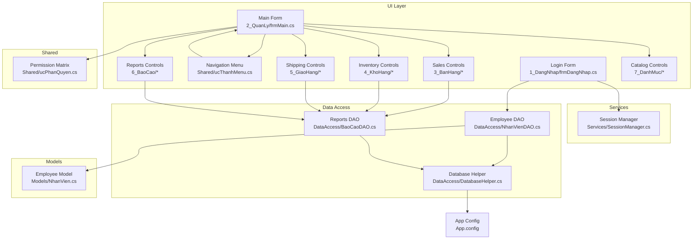

**Diagram sources**
- [Program.cs:11-22](file://Program.cs#L11-L22)
- [ucThanhMenu.cs:9-79](file://Shared\ucThanhMenu.cs#L9-L79)
- [frmMain.cs:34-122](file://2_QuanLy\frmMain.cs#L34-L122)
- [DatabaseHelper.cs:99-210](file://DataAccess\DatabaseHelper.cs#L99-L210)
- [NhanVienDAO.cs:11-99](file://DataAccess\NhanVienDAO.cs#L11-L99)
- [BaoCaoDAO.cs:11-167](file://DataAccess\BaoCaoDAO.cs#L11-L167)
- [NhanVien.cs:5-40](file://Models\NhanVien.cs#L5-L40)
- [App.config:3-8](file://App.config#L3-L8)

**Section sources**
- [FloriSys.csproj:53-379](file://FloriSys.csproj#L53-L379)
- [Program.cs:11-22](file://Program.cs#L11-L22)
- [App.config:3-8](file://App.config#L3-L8)

## Core Components
- Entry point initializes UI and starts the application lifecycle.
- Login form authenticates users and delegates to the main form upon success.
- Main form orchestrates navigation and dynamically loads feature-specific UserControls.
- Navigation menu emits events to drive navigation and enforces role-based visibility.
- Session manager centralizes current user state and computed display properties.
- DAO classes encapsulate database operations and map results to models.
- Database helper provides generic query execution and object mapping utilities.

**Section sources**
- [Program.cs:11-22](file://Program.cs#L11-L22)
- [frmDangNhap.cs:22-60](file://1_DangNhap\frmDangNhap.cs#L22-L60)
- [frmMain.cs:34-136](file://2_QuanLy\frmMain.cs#L34-L136)
- [ucThanhMenu.cs:9-145](file://Shared\ucThanhMenu.cs#L9-L145)
- [SessionManager.cs:7-60](file://Services\SessionManager.cs#L7-L60)
- [DatabaseHelper.cs:19-89](file://DataAccess\DatabaseHelper.cs#L19-L89)
- [NhanVienDAO.cs:11-29](file://DataAccess\NhanVienDAO.cs#L11-L29)
- [BaoCaoDAO.cs:11-118](file://DataAccess\BaoCaoDAO.cs#L11-L118)

## Architecture Overview
FloriSys employs a layered architecture:
- Presentation Layer: Windows Forms forms and UserControls handle UI rendering and user interactions.
- Business Logic Layer: Main form and shared controls coordinate navigation, permissions, and cross-module workflows.
- Data Access Layer: DAO classes abstract database operations; DatabaseHelper centralizes connection and mapping logic.
- Models: Plain data carriers used across layers.

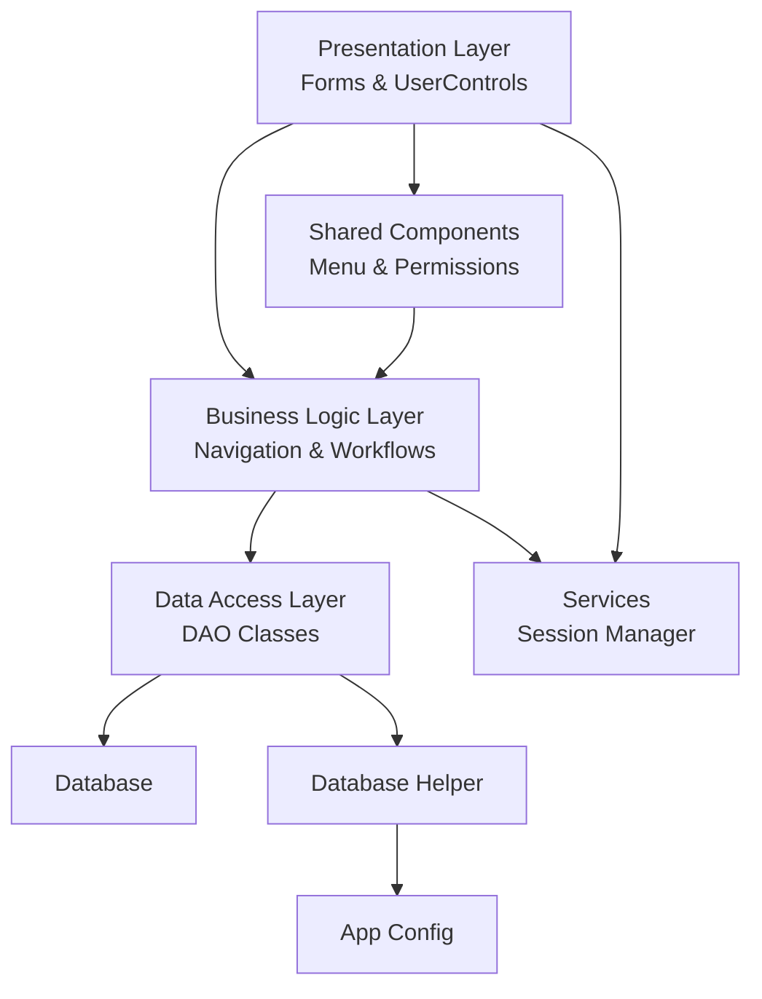

**Diagram sources**
- [ucThanhMenu.cs:9-145](file://Shared\ucThanhMenu.cs#L9-L145)
- [frmMain.cs:34-136](file://2_QuanLy\frmMain.cs#L34-L136)
- [DatabaseHelper.cs:99-210](file://DataAccess\DatabaseHelper.cs#L99-L210)
- [NhanVienDAO.cs:11-99](file://DataAccess\NhanVienDAO.cs#L11-L99)
- [BaoCaoDAO.cs:11-167](file://DataAccess\BaoCaoDAO.cs#L11-L167)
- [App.config:3-8](file://App.config#L3-L8)
- [SessionManager.cs:7-60](file://Services\SessionManager.cs#L7-L60)

## Detailed Component Analysis

### Authentication Flow
The authentication flow demonstrates MVC-like separation: the View (login form) captures credentials, the Controller (form logic) validates and invokes the Service (session manager), and the Model (employee DAO) retrieves and verifies user data.

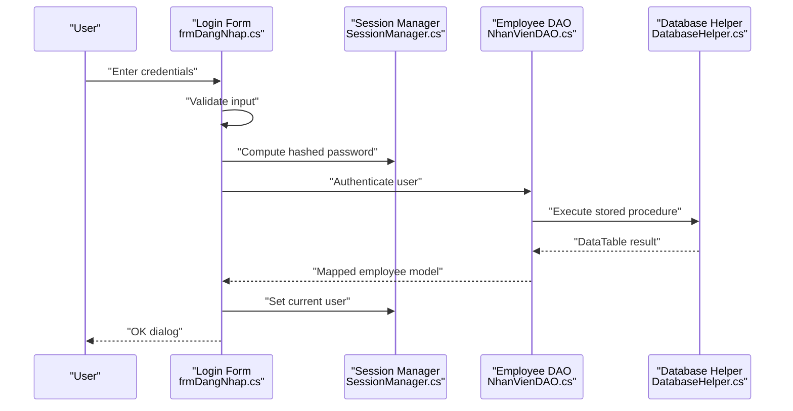

**Diagram sources**
- [frmDangNhap.cs:22-60](file://1_DangNhap\frmDangNhap.cs#L22-L60)
- [SessionManager.cs:31-41](file://Services\SessionManager.cs#L31-L41)
- [NhanVienDAO.cs:11-18](file://DataAccess\NhanVienDAO.cs#L11-L18)
- [DatabaseHelper.cs:104-122](file://DataAccess\DatabaseHelper.cs#L104-L122)

**Section sources**
- [frmDangNhap.cs:22-60](file://1_DangNhap\frmDangNhap.cs#L22-L60)
- [SessionManager.cs:12-29](file://Services\SessionManager.cs#L12-L29)
- [NhanVienDAO.cs:11-18](file://DataAccess\NhanVienDAO.cs#L11-L18)
- [DatabaseHelper.cs:104-122](file://DataAccess\DatabaseHelper.cs#L104-L122)

### Navigation and Dynamic Component Loading (Factory-like Pattern)
The main form acts as a factory/controller that dynamically instantiates and loads feature-specific UserControls based on menu selections and user roles. This decouples UI navigation from component creation and enables modular composition.

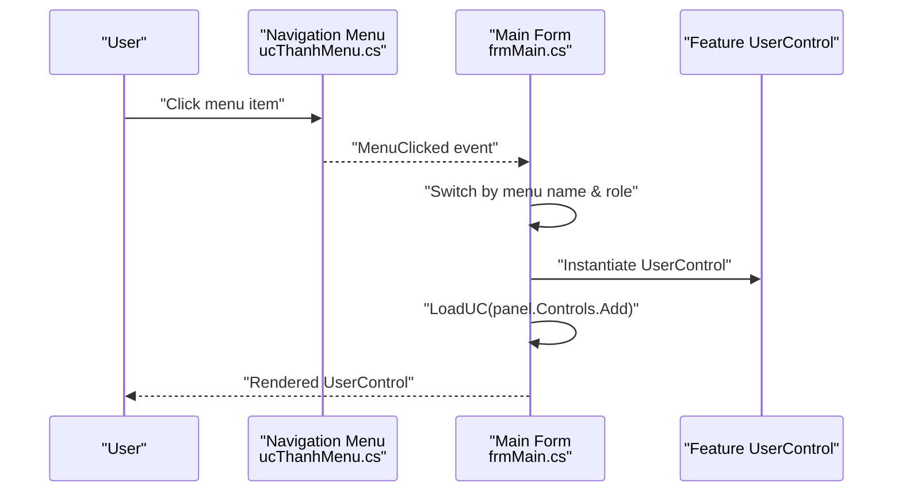

**Diagram sources**
- [ucThanhMenu.cs:9-79](file://Shared\ucThanhMenu.cs#L9-L79)
- [frmMain.cs:34-136](file://2_QuanLy\frmMain.cs#L34-L136)

**Section sources**
- [ucThanhMenu.cs:9-79](file://Shared\ucThanhMenu.cs#L9-L79)
- [frmMain.cs:34-136](file://2_QuanLy\frmMain.cs#L34-L136)

### Event-Driven Communication (Observer-like Pattern)
The navigation menu exposes an event that the main form subscribes to, enabling decoupled communication. Feature UserControls also emit events to signal state changes (e.g., creating a new order or viewing order details), promoting loose coupling and testability.

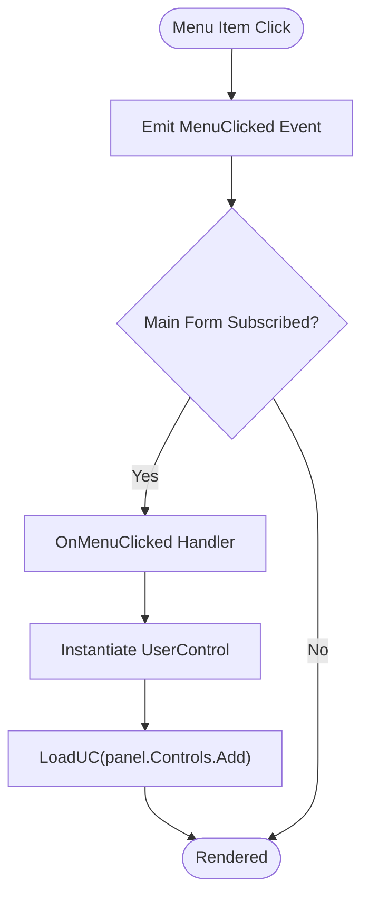

**Diagram sources**
- [ucThanhMenu.cs:9-79](file://Shared\ucThanhMenu.cs#L9-L79)
- [frmMain.cs:34-136](file://2_QuanLy\frmMain.cs#L34-L136)

**Section sources**
- [ucThanhMenu.cs:9-79](file://Shared\ucThanhMenu.cs#L9-L79)
- [frmMain.cs:34-136](file://2_QuanLy\frmMain.cs#L34-L136)

### Data Access Layer and Repository-like Pattern
DAO classes encapsulate database operations and map results to strongly-typed models. DatabaseHelper centralizes connection management and generic mapping utilities, supporting a Repository-like abstraction at the DAO level.

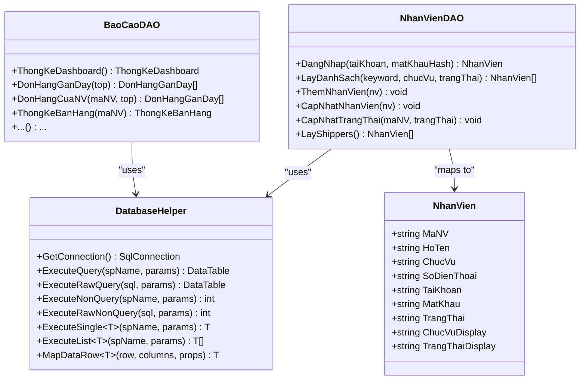

**Diagram sources**
- [DatabaseHelper.cs:19-210](file://DataAccess\DatabaseHelper.cs#L19-L210)
- [NhanVienDAO.cs:11-99](file://DataAccess\NhanVienDAO.cs#L11-L99)
- [BaoCaoDAO.cs:11-167](file://DataAccess\BaoCaoDAO.cs#L11-L167)
- [NhanVien.cs:5-40](file://Models\NhanVien.cs#L5-L40)

**Section sources**
- [DatabaseHelper.cs:19-89](file://DataAccess\DatabaseHelper.cs#L19-L89)
- [NhanVienDAO.cs:11-99](file://DataAccess\NhanVienDAO.cs#L11-L99)
- [BaoCaoDAO.cs:11-167](file://DataAccess\BaoCaoDAO.cs#L11-L167)
- [NhanVien.cs:5-40](file://Models\NhanVien.cs#L5-L40)

### Modular UserControl Architecture
Each functional area is implemented as a set of UserControls, enabling:
- Easy replacement of individual views.
- Role-based visibility and permissions enforced at runtime.
- Event-driven composition between components.

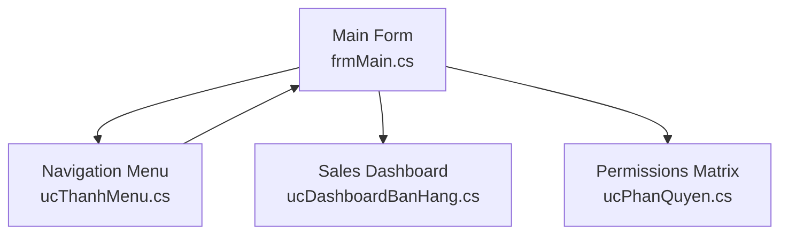

**Diagram sources**
- [frmMain.cs:34-136](file://2_QuanLy\frmMain.cs#L34-L136)
- [ucThanhMenu.cs:9-145](file://Shared\ucThanhMenu.cs#L9-L145)
- [ucDashboardBanHang.cs:13-84](file://3_BanHang\ucDashboardBanHang.cs#L13-L84)
- [ucPhanQuyen.cs:14-104](file://Shared\ucPhanQuyen.cs#L14-L104)

**Section sources**
- [ucDashboardBanHang.cs:13-84](file://3_BanHang\ucDashboardBanHang.cs#L13-L84)
- [ucPhanQuyen.cs:14-104](file://Shared\ucPhanQuyen.cs#L14-L104)

### System Context Diagrams
The following diagrams outline major components and their relationships across functional areas.

#### Authentication Context
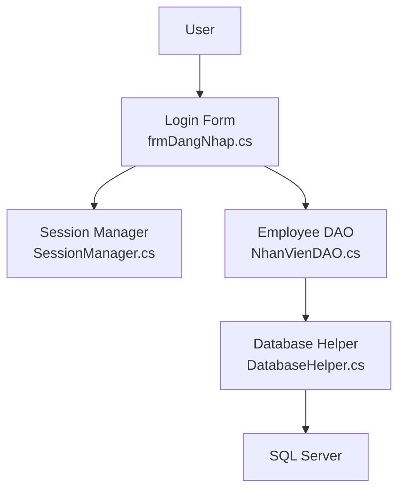

**Diagram sources**
- [frmDangNhap.cs:22-60](file://1_DangNhap\frmDangNhap.cs#L22-L60)
- [SessionManager.cs:12-29](file://Services\SessionManager.cs#L12-L29)
- [NhanVienDAO.cs:11-18](file://DataAccess\NhanVienDAO.cs#L11-L18)
- [DatabaseHelper.cs:99-122](file://DataAccess\DatabaseHelper.cs#L99-L122)

#### Sales Context
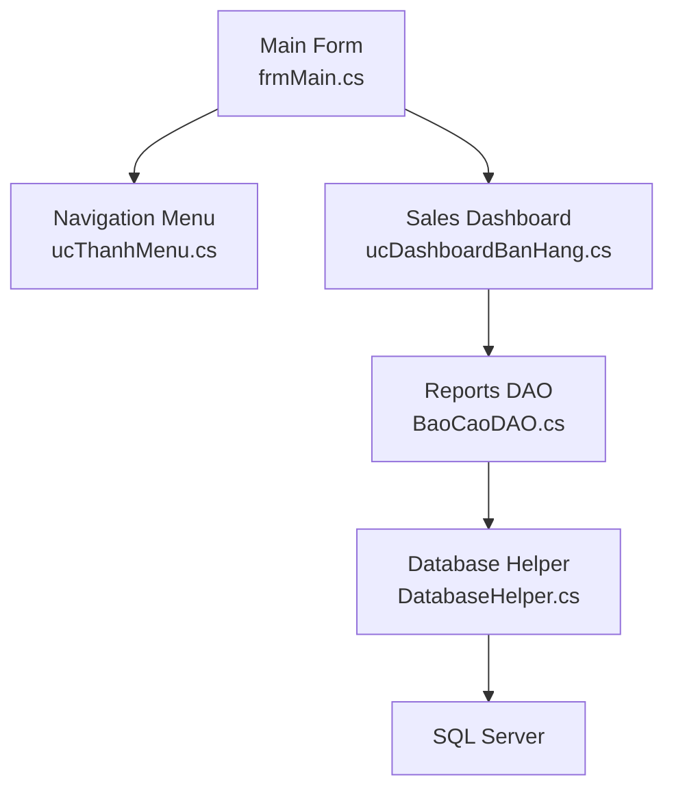

**Diagram sources**
- [ucDashboardBanHang.cs:13-84](file://3_BanHang\ucDashboardBanHang.cs#L13-L84)
- [BaoCaoDAO.cs:110-128](file://DataAccess\BaoCaoDAO.cs#L110-L128)
- [DatabaseHelper.cs:99-122](file://DataAccess\DatabaseHelper.cs#L99-L122)

#### Inventory Context
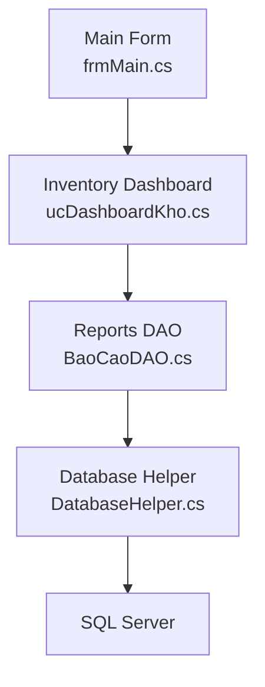

**Diagram sources**
- [BaoCaoDAO.cs:100-108](file://DataAccess\BaoCaoDAO.cs#L100-L108)
- [DatabaseHelper.cs:99-122](file://DataAccess\DatabaseHelper.cs#L99-L122)

#### Shipping Context
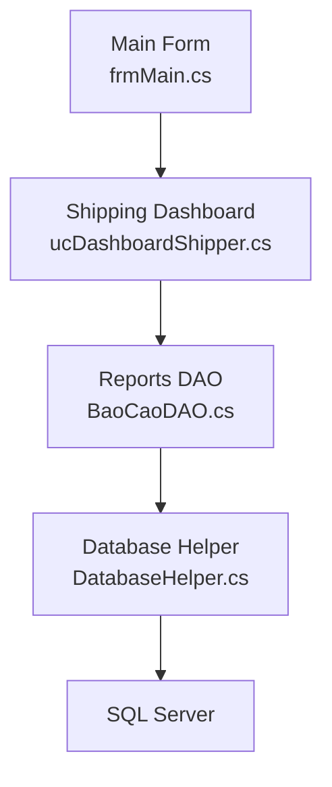

**Diagram sources**
- [BaoCaoDAO.cs:110-118](file://DataAccess\BaoCaoDAO.cs#L110-L118)
- [DatabaseHelper.cs:99-122](file://DataAccess\DatabaseHelper.cs#L99-L122)

#### Reporting Context
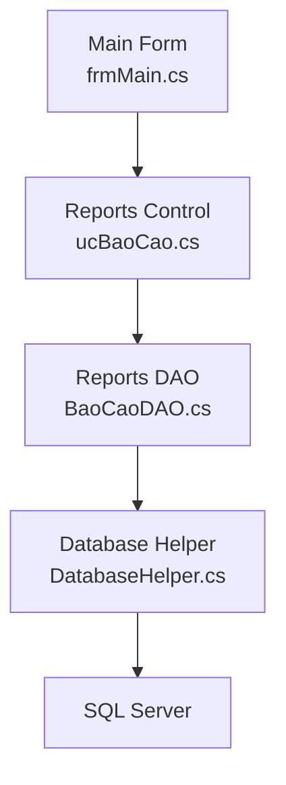

**Diagram sources**
- [BaoCaoDAO.cs:11-167](file://DataAccess\BaoCaoDAO.cs#L11-L167)
- [DatabaseHelper.cs:99-122](file://DataAccess\DatabaseHelper.cs#L99-L122)

#### Administration Context
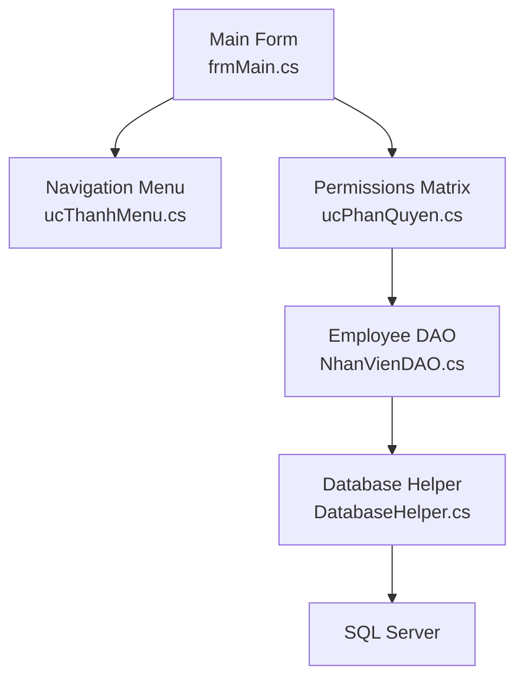

**Diagram sources**
- [ucPhanQuyen.cs:63-102](file://Shared\ucPhanQuyen.cs#L63-L102)
- [NhanVienDAO.cs:31-99](file://DataAccess\NhanVienDAO.cs#L31-L99)
- [DatabaseHelper.cs:99-122](file://DataAccess\DatabaseHelper.cs#L99-L122)

## Dependency Analysis
- UI depends on Services (session) and Shared components (navigation).
- Main form depends on feature-specific UserControls and Shared components.
- DAOs depend on DatabaseHelper and Models.
- DatabaseHelper depends on configuration and SQL client.

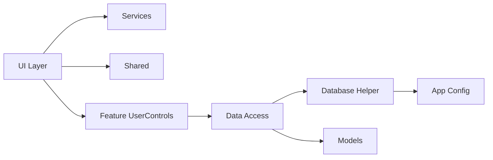

**Diagram sources**
- [FloriSys.csproj:53-379](file://FloriSys.csproj#L53-L379)
- [DatabaseHelper.cs:99-210](file://DataAccess\DatabaseHelper.cs#L99-L210)
- [App.config:3-8](file://App.config#L3-L8)

**Section sources**
- [FloriSys.csproj:53-379](file://FloriSys.csproj#L53-L379)
- [DatabaseHelper.cs:99-210](file://DataAccess\DatabaseHelper.cs#L99-L210)
- [App.config:3-8](file://App.config#L3-L8)

## Performance Considerations
- Centralized connection management reduces overhead and ensures consistent behavior.
- Generic mapping minimizes repetitive data binding code but may incur reflection costs; consider caching PropertyInfo for frequently mapped types.
- Stored procedures improve query plan reuse; ensure proper indexing and parameterization.
- Event-driven composition avoids tight coupling and supports asynchronous UI updates.

[No sources needed since this section provides general guidance]

## Troubleshooting Guide
- Authentication failures: Verify connection string and stored procedure parameters; check hashed password computation and DAO mapping.
- Navigation issues: Confirm event subscriptions and menu item names match switch cases.
- Data binding problems: Ensure column names align with model property names and types are compatible.
- Permission discrepancies: Validate role-based visibility logic and stored permission data.

**Section sources**
- [App.config:3-8](file://App.config#L3-L8)
- [ucThanhMenu.cs:109-145](file://Shared\ucThanhMenu.cs#L109-L145)
- [DatabaseHelper.cs:72-89](file://DataAccess\DatabaseHelper.cs#L72-L89)

## Conclusion
FloriSys applies a clean layered architecture with strong separation of concerns. The combination of event-driven navigation, DAO-based data access, and modular UserControls yields a maintainable and extensible system. Future enhancements can leverage the existing patterns to introduce new modules, refine mapping performance, and expand reporting capabilities.

[No sources needed since this section summarizes without analyzing specific files]

## Appendices
- Design Patterns Observed:
  - Repository-like pattern via DAO classes.
  - Factory-like dynamic component loading in the main form.
  - Observer-like event-driven communication between UI components.
  - MVC-like separation of concerns in the authentication flow.

- Architectural Decisions:
  - Feature-based folder structure for modularity.
  - Centralized configuration for database connectivity.
  - Strongly-typed models for data contracts.
  - Event-driven UI composition for flexibility.

- Technical Constraints:
  - Target framework v4.7.2.
  - SQL Server connectivity via SqlConnection.
  - Windows Forms UI framework.

[No sources needed since this section provides general guidance]