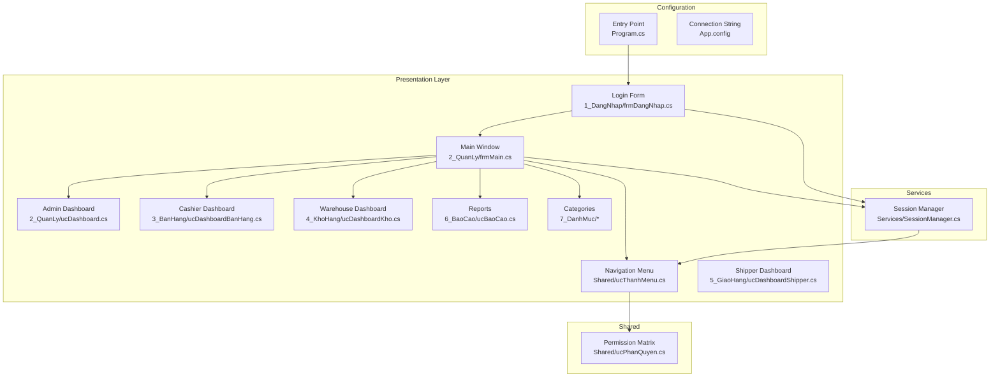
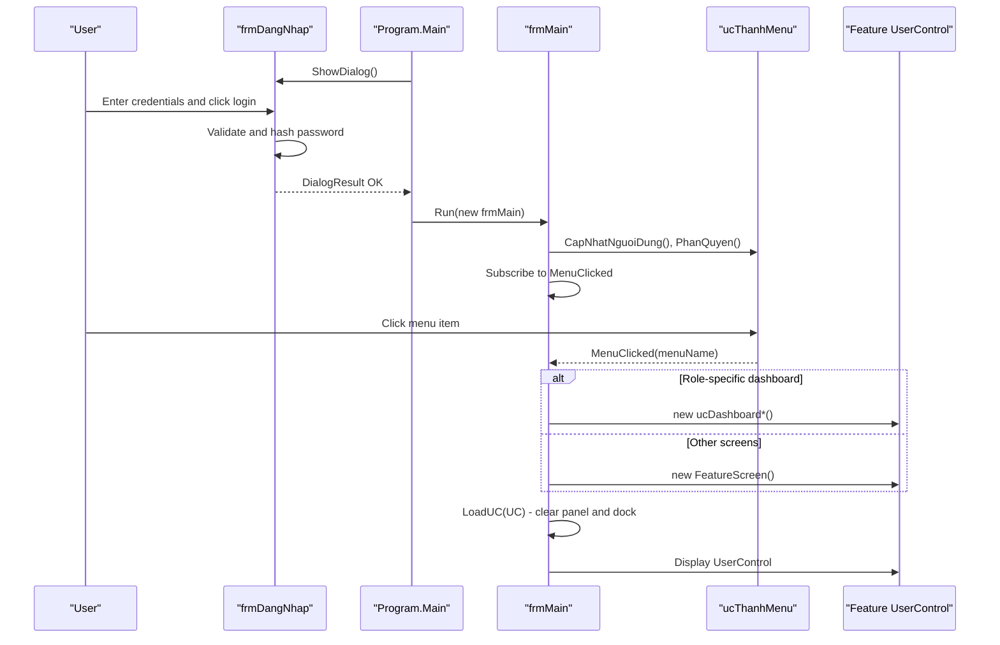
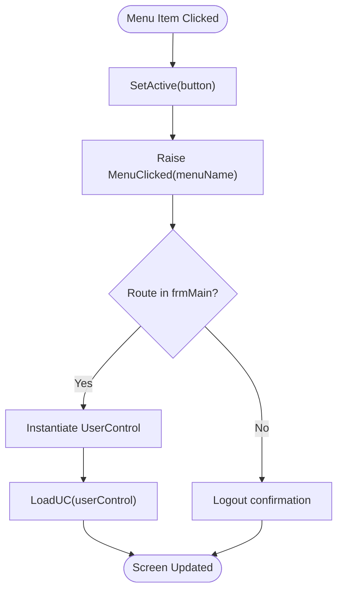
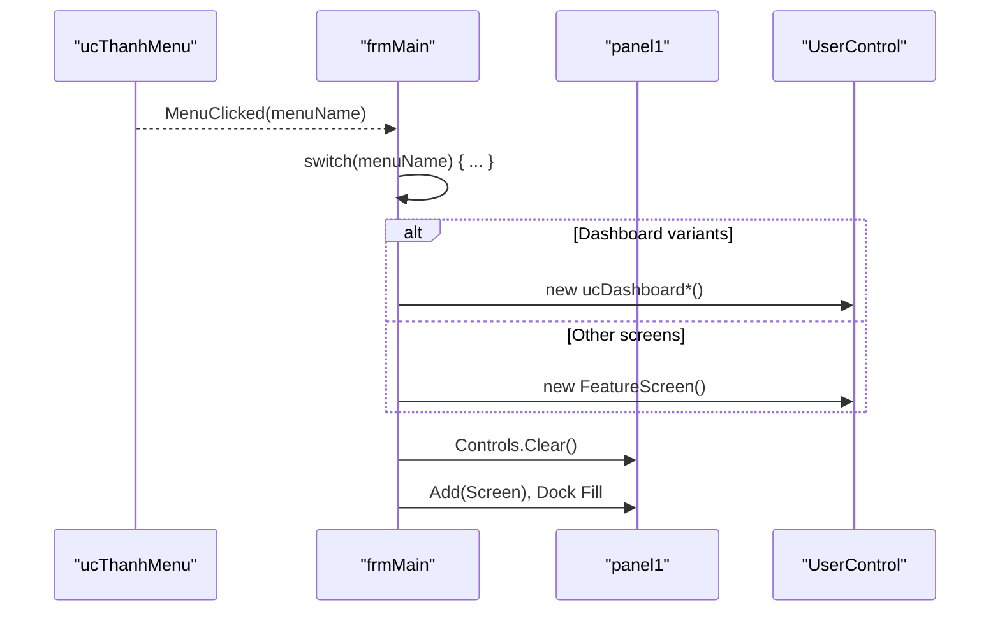
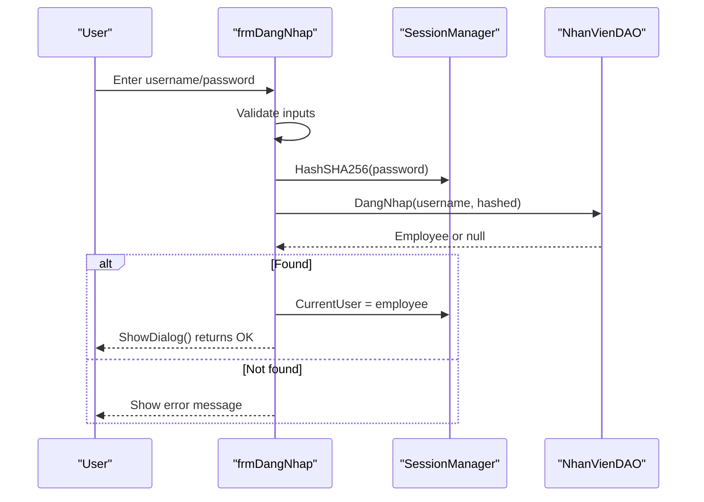
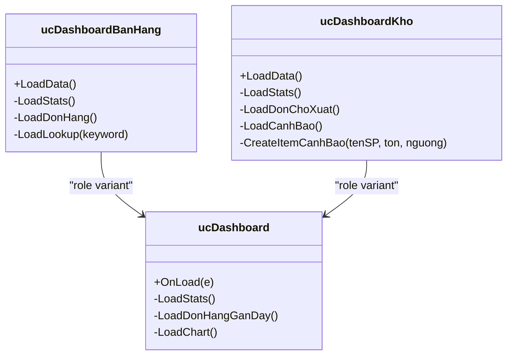
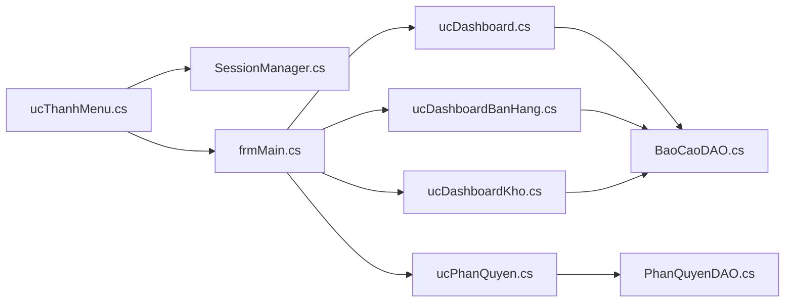

# UI Components & Shared Functionality

<cite>
**Referenced Files in This Document**
- [Program.cs](file://Program.cs)
- [App.config](file://App.config)
- [1_DangNhap/frmDangNhap.cs](file://1_DangNhap/frmDangNhap.cs)
- [1_DangNhap/ucDoiMatKhau.cs](file://1_DangNhap/ucDoiMatKhau.cs)
- [2_QuanLy/frmMain.cs](file://2_QuanLy/frmMain.cs)
- [2_QuanLy/ucDashboard.cs](file://2_QuanLy/ucDashboard.cs)
- [3_BanHang/ucDashboardBanHang.cs](file://3_BanHang/ucDashboardBanHang.cs)
- [3_BanHang/ucTaoDon.cs](file://3_BanHang/ucTaoDon.cs)
- [3_BanHang/ucChiTietDonHang.Designer.cs](file://3_BanHang/ucChiTietDonHang.Designer.cs)
- [4_KhoHang/ucDashboardKho.cs](file://4_KhoHang/ucDashboardKho.cs)
- [4_KhoHang/ucNhapKho.cs](file://4_KhoHang/ucNhapKho.cs)
- [5_GiaoHang/ucGiaoHang.cs](file://5_GiaoHang/ucGiaoHang.cs)
- [6_BaoCao/ucBaoCao.cs](file://6_BaoCao/ucBaoCao.cs)
- [7_DanhMuc/ucSanPham.cs](file://7_DanhMuc/ucSanPham.cs)
- [7_DanhMuc/ucKhachHang.cs](file://7_DanhMuc/ucKhachHang.cs)
- [Services/SessionManager.cs](file://Services/SessionManager.cs)
- [Shared/ucThanhMenu.cs](file://Shared/ucThanhMenu.cs)
- [Shared/ucPhanQuyen.cs](file://Shared/ucPhanQuyen.cs)
- [Properties/Resources.Designer.cs](file://Properties/Resources.Designer.cs)
</cite>

## Table of Contents
1. [Introduction](#introduction)
2. [Project Structure](#project-structure)
3. [Core Components](#core-components)
4. [Architecture Overview](#architecture-overview)
5. [Detailed Component Analysis](#detailed-component-analysis)
6. [Dependency Analysis](#dependency-analysis)
7. [Performance Considerations](#performance-considerations)
8. [Troubleshooting Guide](#troubleshooting-guide)
9. [Conclusion](#conclusion)
10. [Appendices](#appendices)

## Introduction
This document describes the UI architecture and shared functionality of FloriSys, focusing on the Windows Forms implementation. It explains the navigation system built around a shared menu control with role-based visibility, the composition pattern of UserControl-based screens, and event-driven communication between parent and child controls. It also documents the login form, main application window, dashboard variants, styling and theme considerations, and provides guidelines for building new UI components consistently.

## Project Structure
FloriSys follows a layered, feature-based organization:
- Presentation layer: Login form, main window, and feature-specific UserControls grouped under folders per functional domain (e.g., 3_BanHang, 4_KhoHang, 5_GiaoHang, 6_BaoCao, 7_DanhMuc).
- Shared layer: Reusable components such as the navigation menu and permission matrix.
- Services layer: Cross-cutting concerns like session management.
- Data Access and Models: DAOs and models used by UI components for data binding and operations.
- Configuration: Application entry point and connection string configuration.



**Diagram sources**
- [Program.cs:11-22](file://Program.cs#L11-L22)
- [1_DangNhap/frmDangNhap.cs:18-60](file://1_DangNhap/frmDangNhap.cs#L18-L60)
- [2_QuanLy/frmMain.cs:21-136](file://2_QuanLy/frmMain.cs#L21-L136)
- [Shared/ucThanhMenu.cs:48-155](file://Shared/ucThanhMenu.cs#L48-L155)
- [Services/SessionManager.cs:7-61](file://Services/SessionManager.cs#L7-L61)
- [App.config:3-5](file://App.config#L3-L5)

**Section sources**
- [Program.cs:11-22](file://Program.cs#L11-L22)
- [App.config:3-5](file://App.config#L3-L5)

## Core Components
- Navigation menu (ucThanhMenu): Provides role-based visibility, active state highlighting, and emits navigation events to the main window.
- Main window (frmMain): Hosts the menu and dynamically loads feature UserControls into a central panel. Handles role-specific dashboards and inter-control navigation.
- Session manager (SessionManager): Centralized state for the logged-in user, role flags, and hashing utilities.
- Feature dashboards: Role-specific dashboards for Admin, Cashier, Warehouse, and Shipper.
- Shared permission matrix (ucPhanQuyen): Displays and updates role permissions.
- Login form (frmDangNhap): Validates credentials and initializes session state.
- Additional reusable screens: Password change, order creation, warehouse receipt, delivery management, categories, and reports.

Key implementation patterns:
- Event-driven navigation: ucThanhMenu raises MenuClicked events; frmMain subscribes and loads appropriate UserControls.
- Dynamic UserControl loading: frmMain clears and docks new UserControl instances into a container panel.
- Role-based visibility: ucThanhMenu.PhanQuyen hides/shows menu groups based on role.
- Data binding and formatting: Dashboards and grids bind to DAO-provided collections and format values for readability.

**Section sources**
- [Shared/ucThanhMenu.cs:48-155](file://Shared/ucThanhMenu.cs#L48-L155)
- [2_QuanLy/frmMain.cs:21-136](file://2_QuanLy/frmMain.cs#L21-L136)
- [Services/SessionManager.cs:7-61](file://Services/SessionManager.cs#L7-L61)
- [2_QuanLy/ucDashboard.cs:18-224](file://2_QuanLy/ucDashboard.cs#L18-L224)
- [3_BanHang/ucDashboardBanHang.cs:18-83](file://3_BanHang/ucDashboardBanHang.cs#L18-L83)
- [4_KhoHang/ucDashboardKho.cs:17-106](file://4_KhoHang/ucDashboardKho.cs#L17-L106)
- [Shared/ucPhanQuyen.cs:19-103](file://Shared/ucPhanQuyen.cs#L19-L103)
- [1_DangNhap/frmDangNhap.cs:22-60](file://1_DangNhap/frmDangNhap.cs#L22-L60)

## Architecture Overview
The UI architecture centers on a single-form host (frmMain) that composes multiple UserControls. Navigation is decoupled from individual screens via events, enabling centralized routing and role-aware visibility.



**Diagram sources**
- [Program.cs:17-21](file://Program.cs#L17-L21)
- [1_DangNhap/frmDangNhap.cs:22-60](file://1_DangNhap/frmDangNhap.cs#L22-L60)
- [2_QuanLy/frmMain.cs:21-136](file://2_QuanLy/frmMain.cs#L21-L136)
- [Shared/ucThanhMenu.cs:48-155](file://Shared/ucThanhMenu.cs#L48-L155)

## Detailed Component Analysis

### Navigation System: ucThanhMenu
- Responsibilities:
  - Render header, user info panel, and scrollable menu area.
  - Wire click handlers to emit navigation events.
  - Track and highlight the active menu button.
  - Apply role-based visibility rules.
- Role-based visibility logic:
  - Admin: full visibility across all groups.
  - Cashier: orders, categories, reports (read-only).
  - Warehouse: stock-related screens.
  - Shipper: delivery screens.
- Active state management:
  - Resets previous active button styles and applies new styles to the clicked button.
- Events:
  - MenuClicked(string menuName) is raised for each navigation action except logout.



**Diagram sources**
- [Shared/ucThanhMenu.cs:75-93](file://Shared/ucThanhMenu.cs#L75-L93)
- [Shared/ucThanhMenu.cs:102-145](file://Shared/ucThanhMenu.cs#L102-L145)
- [2_QuanLy/frmMain.cs:34-122](file://2_QuanLy/frmMain.cs#L34-L122)

**Section sources**
- [Shared/ucThanhMenu.cs:18-46](file://Shared/ucThanhMenu.cs#L18-L46)
- [Shared/ucThanhMenu.cs:75-93](file://Shared/ucThanhMenu.cs#L75-L93)
- [Shared/ucThanhMenu.cs:102-145](file://Shared/ucThanhMenu.cs#L102-L145)

### Main Application Window: frmMain
- Responsibilities:
  - Initialize menu, apply user info and role visibility.
  - Subscribe to MenuClicked and route to appropriate UserControls.
  - Handle role-specific dashboards and logout.
  - Dynamically load UserControls into a panel container.
- Inter-screen communication:
  - Uses events like TaoDonMoi and XemChiTiet to navigate deeper into related screens.
- Container management:
  - Clears the panel and docks the new UserControl to fill the space.



**Diagram sources**
- [2_QuanLy/frmMain.cs:34-136](file://2_QuanLy/frmMain.cs#L34-L136)

**Section sources**
- [2_QuanLy/frmMain.cs:21-136](file://2_QuanLy/frmMain.cs#L21-L136)

### Login Form: frmDangNhap
- Responsibilities:
  - Validate presence of username/password.
  - Hash password using SHA-256.
  - Authenticate against data access layer and initialize session.
  - Show warnings or errors for invalid credentials or connectivity issues.
- Integration:
  - Uses SessionManager for hashing and storing current user.
  - Returns OK to indicate successful login to Program.Main.



**Diagram sources**
- [1_DangNhap/frmDangNhap.cs:22-60](file://1_DangNhap/frmDangNhap.cs#L22-L60)
- [Services/SessionManager.cs:31-41](file://Services/SessionManager.cs#L31-L41)

**Section sources**
- [1_DangNhap/frmDangNhap.cs:22-60](file://1_DangNhap/frmDangNhap.cs#L22-L60)
- [Services/SessionManager.cs:31-41](file://Services/SessionManager.cs#L31-L41)

### Dashboard Components
- Admin Dashboard (ucDashboard):
  - Loads statistics, recent orders, and a chart.
  - Formats grid cell values and colors based on status.
- Cashier Dashboard (ucDashboardBanHang):
  - Role-specific stats and lists for the cashier’s orders and product lookup.
- Warehouse Dashboard (ucDashboardKho):
  - Stock-related metrics, pending dispatches, and low-stock alerts with visual indicators.



**Diagram sources**
- [2_QuanLy/ucDashboard.cs:18-224](file://2_QuanLy/ucDashboard.cs#L18-L224)
- [3_BanHang/ucDashboardBanHang.cs:18-83](file://3_BanHang/ucDashboardBanHang.cs#L18-L83)
- [4_KhoHang/ucDashboardKho.cs:17-106](file://4_KhoHang/ucDashboardKho.cs#L17-L106)

**Section sources**
- [2_QuanLy/ucDashboard.cs:18-224](file://2_QuanLy/ucDashboard.cs#L18-L224)
- [3_BanHang/ucDashboardBanHang.cs:18-83](file://3_BanHang/ucDashboardBanHang.cs#L18-L83)
- [4_KhoHang/ucDashboardKho.cs:17-106](file://4_KhoHang/ucDashboardKho.cs#L17-L106)

### Order Management Screens
- Create Order (ucTaoDon):
  - Shopping cart DataTable, product lookup, customer creation, and order persistence.
  - Emits DonDaTao event after successful order creation.
- Order Details (ucChiTietDonHang):
  - Timeline and state transitions for an order.

```mermaid
sequenceDiagram
participant Cashier as "Cashier"
participant Create as "ucTaoDon"
participant Session as "SessionManager"
participant DAO as "DonHangDAO/KhachHangDAO/GiaoHangDAO"
Cashier->>Create : Select products, enter customer info
Create->>DAO : TimTheoSDT()/ThemKhachHang()
Create->>DAO : TaoDonHang(maKH, maNV, hinhThuc, ghiChu)
Create->>DAO : ThemChiTiet(maDon, ...)
alt Delivery
Create->>DAO : TaoGiaoHang(maDon)
end
Create-->>Cashier : Show success, clear cart
Create-->>Create : Raise DonDaTao
```

**Diagram sources**
- [3_BanHang/ucTaoDon.cs:102-151](file://3_BanHang/ucTaoDon.cs#L102-L151)
- [3_BanHang/ucChiTietDonHang.Designer.cs:344-370](file://3_BanHang/ucChiTietDonHang.Designer.cs#L344-L370)

**Section sources**
- [3_BanHang/ucTaoDon.cs:102-151](file://3_BanHang/ucTaoDon.cs#L102-L151)
- [3_BanHang/ucChiTietDonHang.Designer.cs:344-370](file://3_BanHang/ucChiTietDonHang.Designer.cs#L344-L370)

### Warehouse Screens
- Receipt (ucNhapKho):
  - Adds items to a DataTable and persists via PhieuNhapKhoDAO.

**Section sources**
- [4_KhoHang/ucNhapKho.cs:23-57](file://4_KhoHang/ucNhapKho.cs#L23-L57)

### Delivery Screens
- Delivery List (ucGiaoHang):
  - Displays delivery KPIs and status-colored rows.

**Section sources**
- [5_GiaoHang/ucGiaoHang.cs:25-137](file://5_GiaoHang/ucGiaoHang.cs#L25-L137)

### Reports and Categories
- Reports (ucBaoCao): Centralized reporting screen.
- Categories (ucSanPham, ucKhachHang): Master data screens.

**Section sources**
- [6_BaoCao/ucBaoCao.cs](file://6_BaoCao/ucBaoCao.cs)
- [7_DanhMuc/ucSanPham.cs](file://7_DanhMuc/ucSanPham.cs)
- [7_DanhMuc/ucKhachHang.cs](file://7_DanhMuc/ucKhachHang.cs)

### Shared Permission Matrix: ucPhanQuyen
- Responsibilities:
  - Renders role buttons and highlights selection.
  - Loads permission matrix for the selected role.
  - Updates permissions and saves via DAO.

**Section sources**
- [Shared/ucPhanQuyen.cs:19-103](file://Shared/ucPhanQuyen.cs#L19-L103)

### Password Change: ucDoiMatKhau
- Responsibilities:
  - Validates old/new/confirm passwords.
  - Hashes and updates password via DAO.
  - Shows feedback messages.

**Section sources**
- [1_DangNhap/ucDoiMatKhau.cs:16-62](file://1_DangNhap/ucDoiMatKhau.cs#L16-L62)

## Dependency Analysis
- ucThanhMenu depends on:
  - SessionManager for role flags and user display info.
  - DAOs indirectly via main window routing and feature screens.
- frmMain depends on:
  - ucThanhMenu for navigation events.
  - SessionManager for role checks and user info.
  - Feature UserControls for screen composition.
- Feature UserControls depend on:
  - DAOs for data retrieval and persistence.
  - SessionManager for contextual data (e.g., current user ID).
- ucPhanQuyen depends on:
  - PhanQuyenDAO for permission data.



**Diagram sources**
- [Shared/ucThanhMenu.cs:102-145](file://Shared/ucThanhMenu.cs#L102-L145)
- [2_QuanLy/frmMain.cs:34-122](file://2_QuanLy/frmMain.cs#L34-L122)
- [Services/SessionManager.cs:21-24](file://Services/SessionManager.cs#L21-L24)

**Section sources**
- [Shared/ucThanhMenu.cs:102-145](file://Shared/ucThanhMenu.cs#L102-L145)
- [2_QuanLy/frmMain.cs:34-122](file://2_QuanLy/frmMain.cs#L34-L122)
- [Services/SessionManager.cs:21-24](file://Services/SessionManager.cs#L21-L24)

## Performance Considerations
- Minimize UI refresh overhead:
  - Batch grid column header and format updates.
  - Avoid repeated chart recreation; clear and reuse where possible.
- Data operations:
  - Use paging or virtual mode for large grids if needed.
  - Debounce search/filter operations to reduce frequent queries.
- Memory:
  - Dispose of temporary controls and charts when switching screens.
- Rendering:
  - Prefer anchor/dock for responsive layouts; avoid excessive manual sizing.

## Troubleshooting Guide
- Login failures:
  - Verify database connectivity via App.config connection string.
  - Confirm password hashing and credential validation logic.
- Navigation issues:
  - Ensure MenuClicked subscribers are attached in frmMain_Load.
  - Confirm menu item names match switch cases.
- Role visibility problems:
  - Check ucThanhMenu.PhanQuyen conditions and role flags from SessionManager.
- Grid formatting errors:
  - Guard against DesignMode and missing columns.
- Chart rendering:
  - Ensure chart area and series are properly configured before adding points.

**Section sources**
- [App.config:3-5](file://App.config#L3-L5)
- [2_QuanLy/frmMain.cs:21-136](file://2_QuanLy/frmMain.cs#L21-L136)
- [Shared/ucThanhMenu.cs:102-145](file://Shared/ucThanhMenu.cs#L102-L145)
- [2_QuanLy/ucDashboard.cs:18-224](file://2_QuanLy/ucDashboard.cs#L18-L224)

## Conclusion
FloriSys employs a clean Windows Forms architecture with a shared navigation menu, centralized routing in the main window, and role-based visibility. Feature screens are composed as UserControls and communicate via events, enabling maintainable and extensible UI development. The design supports consistent styling through shared panels and colors, and provides a foundation for future enhancements such as localization and advanced accessibility features.

## Appendices

### Styling and Theme Management
- Consistent palette:
  - Primary accent color used in active menu items and highlights.
  - Neutral backgrounds and readable text colors for grids and cards.
- Typography:
  - Segoe UI for clarity across controls.
- Layout:
  - Dock and anchor for responsive resizing.
  - Auto-scroll margins for menus to ensure full visibility.

**Section sources**
- [Shared/ucThanhMenu.cs:18-46](file://Shared/ucThanhMenu.cs#L18-L46)
- [2_QuanLy/ucDashboard.cs:176-222](file://2_QuanLy/ucDashboard.cs#L176-L222)

### Accessibility Considerations
- Keyboard navigation:
  - Ensure TabOrder is logical and focus visuals are visible.
- Contrast:
  - Maintain sufficient contrast for text and status colors.
- Labels and tooltips:
  - Associate labels with inputs and provide meaningful tooltips for actions.

### Internationalization Support
- Resource management:
  - Use strongly-typed resources for localized strings.
- Date/time and number formats:
  - Apply culture-specific formatting for grids and charts.

**Section sources**
- [Properties/Resources.Designer.cs:41-69](file://Properties/Resources.Designer.cs#L41-L69)

### UI Testing Strategies
- Unit tests for data-bound logic:
  - Validate grid formatting and percentage calculations.
- Integration tests for navigation:
  - Simulate menu clicks and verify correct UserControl instantiation.
- Snapshot tests for dashboards:
  - Compare rendered chart and grid snapshots across sessions.

### Guidelines for Creating New UI Components
- Composition:
  - Derive from UserControl and expose events for parent communication.
- Naming:
  - Use descriptive prefixes (uc*) and feature-based folder placement.
- Data binding:
  - Bind to strongly-typed collections; handle DesignMode gracefully.
- Styling:
  - Reuse shared colors and fonts; avoid hardcoding styles.
- Responsiveness:
  - Use Dock/Anchor; test with various window sizes.
- Accessibility:
  - Provide accessible names and keyboard shortcuts where applicable.
- Localization:
  - Store labels and messages in resources; avoid hardcoded strings.