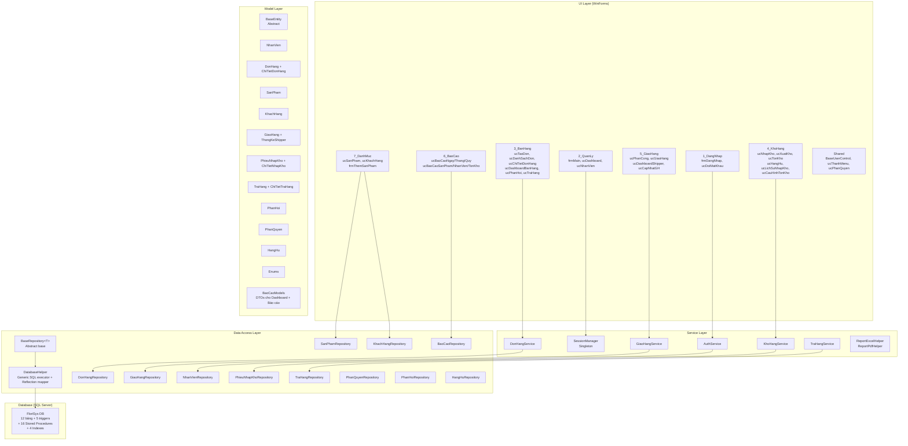

# 🔍 FloriSys – Tổng Review Toàn Diện Codebase

> **Hệ thống**: FloriSys – Quản Lý Cửa Hàng Hoa  
> **Nền tảng**: WinForms (.NET Framework) + SQL Server 2022  
> **Kiến trúc**: 3-Layer (UI → Service → Repository/DataAccess → DB)

---

## 📋 MỤC LỤC

1. [Tổng Quan Kiến Trúc](#1-tổng-quan-kiến-trúc)
2. [Hướng Dẫn Đọc Code](#2-hướng-dẫn-đọc-code)
3. [Đánh Giá Database](#3-đánh-giá-database)
4. [Phát Hiện Lỗi Logic](#4-phát-hiện-lỗi-logic)
5. [Đánh Giá Mô Hình OOP](#5-đánh-giá-mô-hình-oop)
6. [Kế Hoạch Sửa Lỗi (Nếu Được Duyệt)](#6-kế-hoạch-sửa-lỗi)

---

## 1. Tổng Quan Kiến Trúc



### Tóm tắt con số

| Thành phần | Số lượng |
|---|---|
| **Bảng DB** | 12 bảng + 1 bảng log (LICH_SU_DON_HANG) |
| **Stored Procedures** | 16 SP |
| **Triggers** | 5 triggers |
| **Models** | 13 files (12 entities + Enums) |
| **Repositories** | 13 files (1 base + 12 concrete) |
| **Services** | 8 files |
| **UI Forms/Controls** | ~35 files (.cs) |
| **Indexes** | 4 non-clustered |

---

## 2. Hướng Dẫn Đọc Code

### 🗺️ Lộ Trình Đọc Code (Thứ Tự Được Đề Xuất)

````carousel
### Bước 1: Database Schema (Nền tảng)

**Đọc file**: [FloriSys_Database.sql](file:///d:/Learning/C%23/BAI_TAP_LON/FloriSys/FloriSys_Database.sql)

Đây là **nền tảng** của toàn bộ hệ thống. Đọc lần lượt:
1. **Dòng 1–185**: 12 bảng chính – nắm cấu trúc dữ liệu
2. **Dòng 188–229**: Triggers – hiểu cơ chế tự động
3. **Dòng 232–564**: Stored Procedures – logic nghiệp vụ phía DB
4. **Dòng 568–751**: Dữ liệu mẫu + Phân quyền
5. **Dòng 797–889**: Bảng lịch sử + triggers log

<!-- slide -->

### Bước 2: Models (Mô hình dữ liệu C#)

**Đọc theo thứ tự**:
1. [BaseEntity.cs](file:///d:/Learning/C%23/BAI_TAP_LON/FloriSys/Models/BaseEntity.cs) – Lớp trừu tượng gốc
2. [Enums.cs](file:///d:/Learning/C%23/BAI_TAP_LON/FloriSys/Models/Enums.cs) – Các enum type-safe
3. [NhanVien.cs](file:///d:/Learning/C%23/BAI_TAP_LON/FloriSys/Models/NhanVien.cs) – Model nhân viên
4. [SanPham.cs](file:///d:/Learning/C%23/BAI_TAP_LON/FloriSys/Models/SanPham.cs) – Model sản phẩm
5. [KhachHang.cs](file:///d:/Learning/C%23/BAI_TAP_LON/FloriSys/Models/KhachHang.cs) – Model khách hàng
6. [DonHang.cs](file:///d:/Learning/C%23/BAI_TAP_LON/FloriSys/Models/DonHang.cs) – Model đơn hàng
7. Các models phụ: GiaoHang, TraHang, PhieuNhapKho, PhanHoi, PhanQuyen, HangHu
8. [BaoCaoModels.cs](file:///d:/Learning/C%23/BAI_TAP_LON/FloriSys/Models/BaoCaoModels.cs) – DTOs cho báo cáo

<!-- slide -->

### Bước 3: Data Access Layer

**Đọc theo thứ tự**:
1. [DatabaseHelper.cs](file:///d:/Learning/C%23/BAI_TAP_LON/FloriSys/DataAccess/DatabaseHelper.cs) – Generic SQL executor + Reflection ORM mapper
2. [BaseRepository.cs](file:///d:/Learning/C%23/BAI_TAP_LON/FloriSys/DataAccess/BaseRepository.cs) – Abstract base repository
3. [DonHangRepository.cs](file:///d:/Learning/C%23/BAI_TAP_LON/FloriSys/DataAccess/DonHangRepository.cs) – Xử lý đơn hàng (phức tạp nhất)
4. Các repositories khác theo module bạn quan tâm

**Chú ý**: `DatabaseHelper` sử dụng **Reflection** để tự động map `DataRow` → C# object. Đây là core pattern xuyên suốt.

<!-- slide -->

### Bước 4: Services Layer

**Đọc theo thứ tự**:
1. [SessionManager.cs](file:///d:/Learning/C%23/BAI_TAP_LON/FloriSys/Services/SessionManager.cs) – Singleton quản lý phiên đăng nhập
2. [AuthService.cs](file:///d:/Learning/C%23/BAI_TAP_LON/FloriSys/Services/AuthService.cs) – Xác thực & phân quyền
3. [DonHangService.cs](file:///d:/Learning/C%23/BAI_TAP_LON/FloriSys/Services/DonHangService.cs) – Nghiệp vụ đơn hàng
4. [GiaoHangService.cs](file:///d:/Learning/C%23/BAI_TAP_LON/FloriSys/Services/GiaoHangService.cs) – Nghiệp vụ giao hàng
5. [KhoHangService.cs](file:///d:/Learning/C%23/BAI_TAP_LON/FloriSys/Services/KhoHangService.cs) – Nghiệp vụ kho
6. [TraHangService.cs](file:///d:/Learning/C%23/BAI_TAP_LON/FloriSys/Services/TraHangService.cs) – Nghiệp vụ trả hàng

<!-- slide -->

### Bước 5: UI Layer (theo module)

**Entry point**: [Program.cs](file:///d:/Learning/C%23/BAI_TAP_LON/FloriSys/Program.cs) → frmDangNhap → frmMain

**Đọc UI theo luồng nghiệp vụ**:
1. **Đăng nhập**: `1_DangNhap/frmDangNhap.cs`
2. **Menu & Navigation**: `Shared/ucThanhMenu.cs` + `2_QuanLy/frmMain.cs`
3. **Dashboard Admin**: `2_QuanLy/ucDashboard.cs`
4. **Tạo đơn hàng**: `3_BanHang/ucTaoDon.cs` → `ucDanhSachDon.cs` → `ucChiTietDonHang.cs`
5. **Kho hàng**: `4_KhoHang/ucNhapKho.cs` → `ucXuatKho.cs` → `ucTonKho.cs`
6. **Giao hàng**: `5_GiaoHang/ucPhanCong.cs` → `ucGiaoHang.cs`
7. **Báo cáo**: `6_BaoCao/ucBaoCaoNgay.cs` → `ucBaoCaoThang.cs` → `ucBaoCaoQuy.cs`

**Lớp cha UI**: [BaseUserControl.cs](file:///d:/Learning/C%23/BAI_TAP_LON/FloriSys/Shared/BaseUserControl.cs) – Đọc để hiểu cấu trúc chung

````

### 🔑 Quy Ước Đặt Tên Xuyên Suốt

| Prefix | Ý nghĩa | Ví dụ |
|---|---|---|
| `frm` | Form (cửa sổ) | `frmDangNhap`, `frmMain` |
| `uc` | UserControl (panel chức năng) | `ucTaoDon`, `ucDashboard` |
| `NV` / `KH` / `SP` / `DH` / `GH` | Mã nhân viên / khách / sản phẩm / đơn / giao hàng | `NV000001`, `DH000001` |
| `_Repo` / `Repository` | Data Access class | `DonHangRepository` |
| `Service` | Business Logic class | `DonHangService` |
| `sp_` | Stored Procedure | `sp_TaoDonHang` |
| `trg_` | Trigger | `trg_TinhThanhTien` |

---

## 3. Đánh Giá Database

### ✅ Điểm Tốt

| Tiêu chí | Đánh giá |
|---|---|
| **Chuẩn hóa 3NF** | ✅ Tốt – Không có dư thừa dữ liệu nghiêm trọng |
| **Ràng buộc CHECK** | ✅ Đầy đủ – Tất cả trạng thái, giá, số lượng đều có CHECK |
| **Foreign Keys** | ✅ Đầy đủ – Mọi FK đều được khai báo |
| **Triggers** | ✅ Hợp lý – `trg_TinhThanhTien`, `trg_CapNhatTongTien`, `trg_NhapKho_TangTon` |
| **Indexes** | ✅ Có 4 indexes tối ưu hiệu suất |
| **Lịch sử đơn hàng** | ✅ Có bảng `LICH_SU_DON_HANG` + triggers log tự động |
| **Dữ liệu mẫu** | ✅ Phong phú – 8 NV, 8 SP, 4 KH, 24+ đơn gốc + 120 đơn mở rộng |

### ⚠️ Vấn Đề Cần Lưu Ý

> [!WARNING]
> #### BUG-DB-1: `sp_BaoCaoDoanhThuQuy` bao gồm đơn `HoanHang` trong doanh thu
> 
> **File**: [FloriSys_Database.sql:L1025](file:///d:/Learning/C%23/BAI_TAP_LON/FloriSys/FloriSys_Database.sql#L1025)
> 
> SP `sp_BaoCaoDoanhThuQuy` chỉ loại `Huy` nhưng **không loại `HoanHang`**:
> ```sql
> AND TrangThai NOT IN (N'Huy')  -- ← Thiếu N'HoanHang'!
> ```
> Trong khi `sp_DoanhThuTheoThangTrongQuy` lại loại cả `HoanHang`:
> ```sql
> AND dh.TrangThai NOT IN (N'Huy', N'HoanHang')  -- ← Đúng
> ```
> **Hệ quả**: Tổng doanh thu Quý bị tính cao hơn thực tế vì đếm cả đơn đã trả hàng.

> [!WARNING]
> #### BUG-DB-2: `sp_BaoCaoDoanhThuThang` cũng thiếu loại `HoanHang`
> 
> **File**: [FloriSys_Database.sql:L488](file:///d:/Learning/C%23/BAI_TAP_LON/FloriSys/FloriSys_Database.sql#L488)
> ```sql
> AND TrangThai NOT IN (N'Huy')  -- ← Thiếu N'HoanHang'!
> ```
> **Cùng vấn đề**: Báo cáo tháng bị phóng đại doanh thu.

> [!NOTE]
> #### DESIGN-DB-1: Bảng `SAN_PHAM` thiếu cột `DonViTinh` (đơn vị tính)
> 
> Trong thực tế cửa hàng hoa, sản phẩm có thể bán theo: bó, cành, giỏ, chậu... Hiện tại chỉ ghi mô tả vào `TenSP` (VD: "Hoa hồng đỏ (bó 10)"). Chuẩn hơn nên tách thành cột riêng. Tuy nhiên đây là **thiết kế chấp nhận được** cho bài tập lớn.

> [!NOTE]
> #### DESIGN-DB-2: Bảng `KHACH_HANG.SoDienThoai` có constraint `UNIQUE`
> 
> Đây là thiết kế đúng cho hệ thống nhỏ (tìm khách theo SĐT). Tuy nhiên, cần lưu ý trong thực tế: nhiều người dùng chung 1 SĐT, hoặc 1 người thay đổi SĐT.

> [!NOTE]
> #### DESIGN-DB-3: Thiếu cột `NguoiPhanCong` trong bảng `GIAO_HANG`
> 
> Hiện tại không ghi lại **ai** đã phân công shipper. Trong thực tế, cần truy vết accountability.

---

## 4. Phát Hiện Lỗi Logic

### 🔴 Lỗi Nghiêm Trọng (CRITICAL)

> [!CAUTION]
> #### BUG-1: Báo cáo Quý & Tháng tính doanh thu SAI – đếm cả đơn hoàn hàng
> 
> **Ảnh hưởng**: Doanh thu trong báo cáo quý và tháng bị phóng đại, gây sai lệch số liệu kinh doanh.
> 
> **Vị trí**:
> - `sp_BaoCaoDoanhThuQuy` (line 1025): `NOT IN (N'Huy')` → thiếu `N'HoanHang'`
> - `sp_BaoCaoDoanhThuThang` (line 488): `NOT IN (N'Huy')` → thiếu `N'HoanHang'`
> 
> **So sánh**: Các SP khác (`sp_DoanhThuTheoNgayTrongThang`, `sp_DoanhThuTheoThangTrongQuy`, `ThongKeDashboard`, `DoanhThu7Ngay`) đều đã loại `HoanHang` đúng cách.

### 🟡 Lỗi Logic Trung Bình (MEDIUM)

> [!WARNING]
> #### BUG-2: `KhachHangRepository.LayDanhSach` sử dụng `new` thay vì `override`
> 
> **File**: [KhachHangRepository.cs](file:///d:/Learning/C%23/BAI_TAP_LON/FloriSys/DataAccess/KhachHangRepository.cs)
> ```csharp
> public new List<KhachHang> LayDanhSach(string keyword = "")
> ```
> **Vấn đề**: Dùng `new` để ẩn method của base class thay vì `override`. Nếu gọi qua biến kiểu `BaseRepository<KhachHang>`, sẽ gọi nhầm method gốc (không có JOIN). Tuy nhiên, trong code hiện tại, biến luôn là kiểu `KhachHangRepository` nên **chưa gây bug thực tế**.

> [!WARNING]
> #### BUG-3: `trg_CapNhatTongTien` có thể tính sai ThanhTien khi DELETE
> 
> **File**: [FloriSys_Database.sql:L205-216](file:///d:/Learning/C%23/BAI_TAP_LON/FloriSys/FloriSys_Database.sql#L205-L216)
> 
> Trigger `trg_CapNhatTongTien` phụ thuộc vào `ThanhTien` đã được tính bởi `trg_TinhThanhTien`. Khi **DELETE** chi tiết đơn hàng, thứ tự thực hiện trigger có thể gây ra edge case nếu bảng `ThanhTien` chưa được update. Tuy nhiên, trong flow hiện tại **không có chức năng xóa chi tiết đơn hàng** nên chưa gây bug.

> [!WARNING]
> #### BUG-4: `DonHangService.CapNhatTrangThai` không kiểm tra trạng thái `HoanHang`
> 
> **File**: [DonHangService.cs](file:///d:/Learning/C%23/BAI_TAP_LON/FloriSys/Services/DonHangService.cs)
> ```csharp
> if (don.IsComplete || don.IsCancelled)
> {
>     error = "Không thể thay đổi...";
>     return false;
> }
> ```
> **Vấn đề**: Đơn có trạng thái `HoanHang` vẫn có thể bị thay đổi trạng thái. Nên thêm `don.TrangThai == "HoanHang"` vào điều kiện chặn.

> [!WARNING]
> #### BUG-5: Dữ liệu mẫu mở rộng (line 900-976) kích hoạt trigger `trg_NhapKho_TangTon` khi INSERT CT_NHAP_KHO
> 
> **File**: [FloriSys_Database.sql:L911-915](file:///d:/Learning/C%23/BAI_TAP_LON/FloriSys/FloriSys_Database.sql#L911-L915)
> 
> Phần dữ liệu mẫu mở rộng (PN000002, PN000003) **không tắt trigger** trước khi insert `CT_NHAP_KHO`, trong khi phần dữ liệu gốc (PN000001) đã cẩn thận tắt trigger (line 686). 
> **Hệ quả**: SoLuongTon bị tăng gấp đôi so với dự kiến khi chạy script lần đầu.

### 🟢 Vấn Đề Nhỏ (LOW)

> [!NOTE]
> #### NOTE-1: Enum `Enums.cs` được khai báo nhưng Models vẫn dùng `string` cho trạng thái
> 
> Các model (DonHang, NhanVien, SanPham...) vẫn khai báo `TrangThai` là `string`, so sánh bằng magic string (`"Moi"`, `"DangXuLy"`...). Mặc dù `Enums.cs` đã có enum tương ứng + extension methods `ToDbString()` / `ToTrangThaiDon()`, nhưng chúng **không được sử dụng** trong hầu hết code. Đây là **debt kỹ thuật** nhưng không phải bug.

> [!NOTE]
> #### NOTE-2: `sp_SinhMa` có nguy cơ race condition dưới concurrent access
> 
> SP `sp_SinhMa` dùng `MAX(CAST(...))` + 1 để sinh mã. Nếu 2 user tạo đơn cùng lúc, có thể sinh trùng mã. Tuy nhiên, WinForms app thường single-user nên **risk thấp**.

> [!NOTE]
> #### NOTE-3: `DatabaseHelper.MapDataRow` reflection mapper không cache PropertyInfo
> 
> Mỗi lần map list, `PropertyInfo[]` được tạo mới. Với dữ liệu nhỏ không ảnh hưởng, nhưng nếu mở rộng sẽ cần cache.

> [!NOTE]  
> #### NOTE-4: `sp_BaoCaoDoanhThuNgay` (line 472) loại `Huy` nhưng TongDon vẫn đếm cả `HoanHang`
> 
> Dòng COUNT(*) đếm tất cả đơn trừ `Huy`, nhưng `DoanhThuHoanThanh` chỉ tính đơn `HoanThanh`. Tổng đơn có thể bao gồm đơn chưa hoàn thành → TongDon misleading.

---

## 5. Đánh Giá Mô Hình OOP (4 Tính Chất)

### ✅ Tổng Đánh Giá: **TỐT** – Thể hiện rõ ràng 4 tính chất OOP

| Tính chất OOP | Đánh giá | Ví dụ tiêu biểu |
|---|---|---|
| **Tính đóng gói (Encapsulation)** | ⭐⭐⭐⭐ | `NhanVien.SoDienThoai` setter tự clean, `SanPham.GiaBan` setter throw nếu âm, `SessionManager` Singleton |
| **Tính kế thừa (Inheritance)** | ⭐⭐⭐⭐⭐ | `BaseEntity → NhanVien/SanPham/DonHang/...`, `BaseRepository<T> → DonHangRepository/...`, `BaseUserControl → các UC` |
| **Tính đa hình (Polymorphism)** | ⭐⭐⭐⭐ | `abstract DisplayText/Id/IsValid` override ở mỗi entity, `virtual LoadData/FormatGrid` ở UC, `virtual LayDanhSach/TaoMoi` ở Repository |
| **Tính trừu tượng (Abstraction)** | ⭐⭐⭐⭐ | `BaseEntity` abstract class, `BaseRepository<T>` abstract properties (`TableName/IdColumn/IdPrefix`), Service layer ẩn logic DB khỏi UI |

### Chi tiết thể hiện

#### Tính Đóng gói (Encapsulation)
```
Models:
  ├── NhanVien.HoTen setter → tự trim()
  ├── NhanVien.SoDienThoai setter → tự lọc chỉ giữ số
  ├── NhanVien.TaiKhoan setter → tự lowercase + trim
  ├── SanPham.GiaBan setter → throw nếu < 0
  ├── SanPham.SoLuongTon setter → throw nếu < 0
  ├── DonHang.CanCancel → đóng gói logic "có thể hủy?"
  └── SessionManager → Singleton, private constructor

Services:
  ├── AuthService.DangNhap → ẩn hash + validate + session setup
  ├── DonHangService.TaoDonHang → ẩn tìm/tạo KH + transaction
  └── DonHangRepository.TaoDonHangHoanChinh → full transaction atomic
```

#### Tính Kế thừa (Inheritance)
```
BaseEntity (abstract)
  ├── NhanVien
  ├── SanPham
  ├── KhachHang
  ├── DonHang
  ├── GiaoHang
  ├── PhieuNhapKho
  ├── TraHang
  ├── PhanHoi
  ├── PhanQuyen
  └── HangHu

BaseRepository<T> (abstract, generic)
  ├── DonHangRepository
  ├── SanPhamRepository
  ├── KhachHangRepository
  ├── GiaoHangRepository
  ├── NhanVienRepository
  ├── PhieuNhapKhoRepository
  ├── TraHangRepository
  ├── PhanHoiRepository
  ├── PhanQuyenRepository
  └── HangHuRepository

BaseUserControl : UserControl
  └── Tất cả ucXxx đều kế thừa
```

#### Tính Đa hình (Polymorphism)
```
BaseEntity:
  abstract DisplayText → NhanVien: HoTen, SanPham: TenSP, DonHang: MaDon...
  abstract Id          → NhanVien: MaNV, SanPham: MaSP, DonHang: MaDon...
  virtual IsValid      → mỗi entity có validation riêng

BaseRepository<T>:
  virtual LayDanhSach  → KhachHangRepository override thêm JOIN
  virtual TaoMoi       → dùng chung sp_SinhMa
  virtual LayTheoMa    → dùng chung SELECT * WHERE id = @Id

BaseUserControl:
  virtual LoadData     → mỗi UC override load data riêng
  virtual FormatGrid   → mỗi UC format grid riêng
```

#### Tính Trừu tượng (Abstraction)
```
BaseEntity:
  → abstract class, không thể new trực tiếp
  → ép lớp con phải implement DisplayText, Id

BaseRepository<T>:
  → abstract TableName, IdColumn, IdPrefix
  → mỗi repository phải tự khai báo metadata

Service Layer:
  → UI không cần biết DB/SP/SQL
  → Chỉ gọi: authService.DangNhap(user, pass)
```

---

## 6. Kế Hoạch Sửa Lỗi

> [!IMPORTANT]
> Phần dưới đây là **kế hoạch sửa lỗi** nếu bạn đồng ý. Tôi sẽ **không** sửa code cho đến khi bạn duyệt.

### Ưu tiên 1: Sửa BUG-1 – Doanh thu báo cáo Quý & Tháng sai

#### [MODIFY] [FloriSys_Database.sql](file:///d:/Learning/C%23/BAI_TAP_LON/FloriSys/FloriSys_Database.sql)

1. **Line 488** (`sp_BaoCaoDoanhThuThang`): Đổi `NOT IN (N'Huy')` → `NOT IN (N'Huy', N'HoanHang')`
2. **Line 1025** (`sp_BaoCaoDoanhThuQuy`): Đổi `NOT IN (N'Huy')` → `NOT IN (N'Huy', N'HoanHang')`

---

### Ưu tiên 2: Sửa BUG-4 – DonHangService thiếu kiểm tra HoanHang

#### [MODIFY] [DonHangService.cs](file:///d:/Learning/C%23/BAI_TAP_LON/FloriSys/Services/DonHangService.cs)

Thêm kiểm tra trạng thái `HoanHang`:
```diff
- if (don.IsComplete || don.IsCancelled)
+ if (don.IsComplete || don.IsCancelled || don.TrangThai == "HoanHang")
```

---

### Ưu tiên 3: Sửa BUG-5 – Dữ liệu mẫu mở rộng không tắt trigger

#### [MODIFY] [FloriSys_Database.sql](file:///d:/Learning/C%23/BAI_TAP_LON/FloriSys/FloriSys_Database.sql)

Thêm `DISABLE TRIGGER` trước block insert `CT_NHAP_KHO` ở phần mở rộng (line ~911) và `ENABLE TRIGGER` sau đó.

---

## Verification Plan

### Manual Verification
- Kiểm tra lại tất cả các SP có filter trạng thái đơn hàng → đảm bảo nhất quán `NOT IN (N'Huy', N'HoanHang')` cho mọi báo cáo doanh thu
- Kiểm tra tồn kho sau khi chạy script dữ liệu mẫu → xác nhận SoLuongTon chính xác

### Automated Tests
- Chạy lại toàn bộ script SQL trên DB trống → kiểm tra không lỗi
- Build project C# để verify không có compilation error
