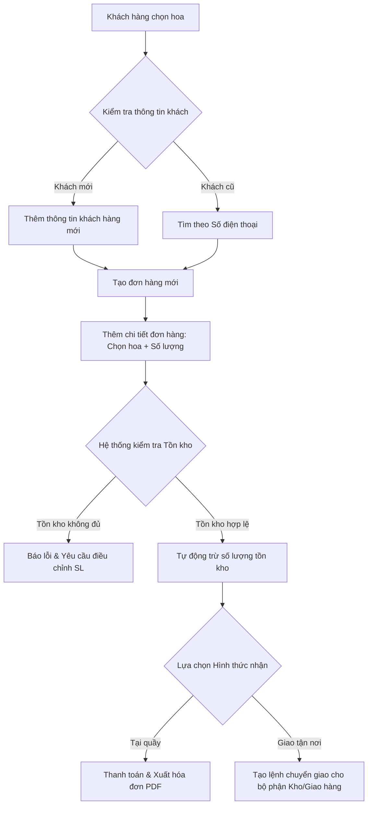
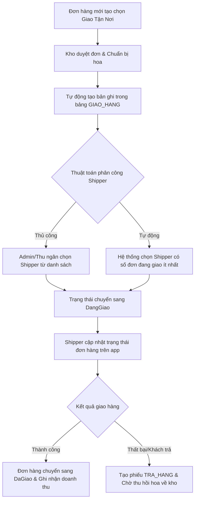

# BÁO CÁO CHI TIẾT QUY TRÌNH NGHIỆP VỤ HỆ THỐNG FLORISYS
**Dành cho Giảng viên phản biện & Hội đồng bảo vệ đồ án**

Tài liệu này mô tả chi tiết toàn bộ các quy trình nghiệp vụ (Business Workflows), luồng dữ liệu (Data Flows) và cơ chế xử lý nghiệp vụ tự động trong hệ thống quản lý cửa hàng hoa **FloriSys**.

---

## 📑 MỤC LỤC
1. [TỔNG QUAN KIẾN TRÚC & PHÂN VAI TRÒ (ROLES)](#1-tong-quan-kien-truc)
2. [NGHIỆP VỤ QUẢN LÝ BÁN HÀNG & IN HÓA ĐƠN](#2-nghiep-vu-ban-hang)
3. [NGHIỆP VỤ QUẢN LÝ KHO (NHẬP, XUẤT, CẢNH BÁO TỒN KHO & HỦY HÀNG HỎNG)](#3-nghiep-vu-kho-hang)
4. [NGHIỆP VỤ GIAO HÀNG & PHÂN CÔNG SHIPPER TỰ ĐỘNG](#4-nghiep-vu-giao-hang)
5. [NGHIỆP VỤ THỐNG KÊ, BIỂU ĐỒ & BÁO CÁO DOANH THU](#5-nghiep-vu-bao-cao)
6. [CƠ CHẾ PHÂN QUYỀN & BẢO MẬT HỆ THỐNG](#6-phan-quyen-bao-mat)

---

## 🏗️ 1. TỔNG QUAN KIẾN TRÚC & PHÂN VAI TRÒ (ROLES)

Hệ thống FloriSys được thiết kế theo mô hình phân quyền chức năng rõ ràng tương ứng với mô hình hoạt động thực tế của một cửa hàng hoa chuyên nghiệp:

* **Quản trị viên (Admin):** Toàn quyền kiểm soát hệ thống, quản lý nhân viên, cấu hình phân quyền và xem tất cả các báo cáo doanh thu tài chính chuyên sâu.
* **Thu ngân (Cashier):** Thực hiện bán hàng tại quầy, tiếp nhận đơn đặt hàng trực tuyến, tạo đơn hàng mới, quản lý thông tin khách hàng, ghi nhận phản hồi và tiếp nhận trả hàng.
* **Thủ kho (Warehouse):** Quản lý phiếu nhập kho từ nhà cung cấp, kiểm tra lượng tồn kho, thực hiện xuất kho cho đơn hàng mới và ghi nhận các sản phẩm bị hỏng/héo (hàng hư).
* **Nhân viên giao hàng (Shipper):** Xem danh sách các đơn hàng được phân công, cập nhật trạng thái vận chuyển (Đang giao, Giao thành công, Hoàn hàng).

---

## 🛍️ 2. NGHIỆP VỤ QUẢN LÝ BÁN HÀNG & IN HÓA ĐƠN

### A. Sơ đồ quy trình nghiệp vụ bán hàng (Mermaid Diagram)


### B. Cơ chế kiểm soát và ràng buộc dữ liệu tại C# & Database:
1. **Ràng buộc tồn kho tức thời (Transaction Safety):**
   * Khi Thu ngân thêm sản phẩm vào đơn hàng, hệ thống chạy Stored Procedure `sp_ThemChiTietDon`.
   * Thủ tục này sẽ kiểm tra ngay lập tức lượng tồn trong bảng `SAN_PHAM`. Nếu số lượng tồn nhỏ hơn số lượng khách mua, hệ thống sử dụng lệnh `RAISERROR` để đẩy ngược lỗi về ứng dụng C# và hủy giao dịch (Rollback), không cho phép tạo hóa đơn âm.
   * Nếu tồn kho đủ, hệ thống tự động chạy lệnh `UPDATE SAN_PHAM SET SoLuongTon = SoLuongTon - @SoLuong` để giữ hàng.
2. **Xuất hóa đơn PDF tự động:**
   * Sử dụng thư viện `iTextSharp` thiết kế mẫu hóa đơn khổ giấy K80 tiêu chuẩn.
   * Dữ liệu hóa đơn gồm: Mã đơn hàng (mã sinh tự động theo quy tắc `DH` + 6 số tăng dần), Ngày tạo, Tên khách hàng, Nhân viên lập đơn, Danh sách sản phẩm mua (Tên, Số lượng, Đơn giá, Thành tiền) và Tổng tiền phải thanh toán.

---

## 📦 3. NGHIỆP VỤ QUẢN LÝ KHO (NHẬP, XUẤT, CẢNH BÁO TỒN KHO & HỦY HÀNG HỎNG)

### A. Nghiệp vụ Nhập kho (Tăng số lượng tồn)
* **Quy trình:** Khi hoa tươi được chuyển từ vựa hoa về, Thủ kho tạo một phiếu nhập kho (`PHIEU_NHAP_KHO`). Với mỗi loại hoa được nhập, thông tin số lượng và giá nhập sẽ được ghi nhận vào bảng `CT_NHAP_KHO`.
* **Cơ chế tự động:** Hệ thống cài đặt một **Database Trigger** tên là `trg_NhapKho_TangTon`. Ngay sau khi một dòng chi tiết nhập kho được thêm vào, trigger này tự động cộng dồn số lượng nhập trực tiếp vào cột `SoLuongTon` của sản phẩm đó trong bảng `SAN_PHAM`.

### B. Nghiệp vụ Cảnh báo Tồn kho tối thiểu
Để tránh việc hết hoa đột xuất ảnh hưởng đến kinh doanh, mỗi sản phẩm hoa có một thuộc tính là `MucTonToiThieu`.
* **Cơ chế xử lý:** Hệ thống chạy thủ tục `sp_CanhBaoTonKho`. Thủ tục này phân loại tình trạng hàng hóa:
  * `SoLuongTon = 0` $\rightarrow$ Tình trạng: **Hết hàng** (Hiển thị màu Đỏ trên Grid).
  * `SoLuongTon <= MucTonToiThieu` $\rightarrow$ Tình trạng: **Sắp hết** (Hiển thị màu Vàng trên Grid).
  * `SoLuongTon > MucTonToiThieu` $\rightarrow$ Tình trạng: **Đủ hàng** (Hiển thị bình thường).
* **Giao diện:** Dashboard của Thủ kho hiển thị danh sách sản phẩm sắp hết hàng theo thời gian thực để họ kịp thời làm phiếu nhập.

### C. Nghiệp vụ Hủy hàng hư hỏng (Hoa héo/dập)
Do đặc thù ngành hoa tươi có tỷ lệ hao hụt cao, hệ thống thiết kế riêng quy trình ghi nhận hàng hỏng:
* **Quy trình:** Thủ kho chọn loại hoa bị hỏng, nhập số lượng và lý do hủy (héo, dập gãy).
* **Xử lý cơ sở dữ liệu:** Stored Procedure `sp_GhiNhanHangHu` thực thi:
  1. Kiểm tra số lượng hủy không được vượt quá số lượng đang tồn trong kho.
  2. Lưu lịch sử hủy vào bảng `HANG_HU`.
  3. Trừ trực tiếp số lượng hủy khỏi cột `SoLuongTon` của sản phẩm đó trong bảng `SAN_PHAM`.

---

## 🚚 4. NGHIỆP VỤ GIAO HÀNG & PHÂN CÔNG SHIPPER TỰ ĐỘNG

### A. Sơ đồ quy trình giao hàng (Mermaid Diagram)


### B. Thuật toán phân công Shipper tự động:
Để tối ưu hóa thời gian giao hàng và tránh quá tải cho shipper, FloriSys áp dụng truy vấn thông minh để tìm ra shipper tối ưu:
1. Hệ thống đếm số lượng đơn hàng có trạng thái `DangGiao` của từng nhân viên có chức vụ `Shipper`.
2. Lựa chọn nhân viên có số lượng đơn đang xử lý thấp nhất.
3. Tự động ghi nhận mã Shipper đó vào trường `MaNV_Shipper` của bảng `GIAO_HANG` và cập nhật trạng thái đơn hàng.

---

## 📈 5. NGHIỆP VỤ THỐNG KÊ, BIỂU ĐỒ & BÁO CÁO DOANH THU

Hệ thống cung cấp hệ thống báo cáo đa chiều giúp quản lý đưa ra quyết định kinh doanh chính xác:

1. **Báo cáo Doanh thu (Theo Ngày / Tháng / Quý):**
   * Sử dụng các Stored Procedure `sp_BaoCaoDoanhThuNgay`, `sp_BaoCaoDoanhThuThang` để tính tổng tiền của tất cả các đơn hàng không bị hủy (`TrangThai != 'Huy'`).
   * Hiển thị trực quan dưới dạng biểu đồ cột (Column Chart) sử dụng control `System.Windows.Forms.DataVisualization.Charting`.
2. **Thống kê Sản phẩm bán chạy (Top Sản phẩm):**
   * Sử dụng câu lệnh `SUM(ct.SoLuong)` và `SUM(ct.ThanhTien)` gom nhóm theo mã sản phẩm (`GROUP BY MaSP`).
   * Sắp xếp giảm dần (`ORDER BY TongDoanhThu DESC`) và lấy ra 10 sản phẩm hàng đầu (`TOP 10`) để hiển thị lên biểu đồ tròn (Pie Chart) biểu diễn thị phần doanh thu của từng sản phẩm.
3. **Đánh giá hiệu suất nhân viên bán hàng:**
   * Thống kê số lượng đơn hàng lập được, tổng doanh thu đem lại và số lượng đơn hàng bị hủy của từng Thu ngân để phục vụ tính lương thưởng KPI cuối tháng.

---

## 🔒 6. CƠ CHẾ PHÂN QUYỀN & BẢO MẬT HỆ THỐNG

### A. Phân quyền động dựa trên Cơ sở dữ liệu (Database-Driven Authorization)
Hệ thống không cố định (hard-code) quyền hạn trong mã nguồn C# mà quản lý động qua bảng `PHAN_QUYEN`:
* Bảng này lưu thông tin chi tiết: Với mỗi `VaiTro` (Chức vụ), họ có các quyền: `Xem` (CanRead), `Them` (CanCreate), `Sua` (CanUpdate), `Xoa` (CanDelete), `BaoCao` (CanReport) trên từng danh mục chức năng (Menu).
* Khi đăng nhập, quyền hạn được nạp lên bộ nhớ cache. Khi người dùng click vào một chức năng, hệ thống kiểm tra:
```csharp
if (!SessionManager.HasPermission("SanPham", "Sua"))
{
    MessageBox.Show("Bạn không có quyền chỉnh sửa thông tin sản phẩm!", "Từ chối truy cập");
    btnSua.Enabled = false; // Vô hiệu hóa nút bấm
}
```

### B. Bảo mật dữ liệu chống tấn công SQL Injection
* Toàn bộ các thao tác thêm, sửa, xóa dữ liệu trong hệ thống đều sử dụng **Truy vấn có tham số (Parameterized Queries)** thông qua lớp `SqlParameter` hoặc gọi qua **Stored Procedure**.
* Điều này đảm bảo các chuỗi dữ liệu đầu vào do người dùng nhập (như ký tự lạ, lệnh phá hoại SQL) sẽ chỉ được hệ thống coi là chuỗi văn bản thông thường, ngăn chặn hoàn toàn nguy cơ bị hacker chèn lệnh độc hại phá hủy cơ sở dữ liệu.
* Mật khẩu nhân viên được mã hóa một chiều bằng thuật toán **SHA-256** trước khi lưu trữ xuống cơ sở dữ liệu, đảm bảo ngay cả quản trị viên hệ thống cũng không thể đọc được mật khẩu gốc của nhân viên.
