# FloriSys - Flower Shop Management System

A Windows Forms desktop application for managing a flower shop, built with **C# (.NET Framework 4.7.2)** and **SQL Server**. The system covers the complete retail workflow: from point-of-sale and order management, through warehouse operations and delivery tracking, to business reporting.

---

## Table of Contents

- [Features](#features)
- [Technology Stack](#technology-stack)
- [System Architecture](#system-architecture)
- [Database Schema](#database-schema)
- [Role-Based Access Control](#role-based-access-control)
- [Project Structure](#project-structure)
- [Getting Started](#getting-started)
- [Key Business Flows](#key-business-flows)
- [Stored Procedures & Triggers](#stored-procedures--triggers)
- [Auto Code Generation](#auto-code-generation)
- [License](#license)

---

## Features

```mermaid
graph TD
    A[FloriSys] --> B[User Authentication]
    A --> C[Staff Management]
    A --> D[Sales Operations]
    A --> E[Inventory Management]
    A --> F[Delivery Management]
    A --> G[Reporting & Analytics]
    A --> H[Master Data Management]
    B --> B1[Login with SHA-256]
    B --> B2[Password Change]
    C --> C1[Staff Dashboard]
    C --> C2[Staff Profile Management]
    D --> D1[Sales Dashboard]
    D --> D2[Order Creation]
    D --> D3[Order List]
    D --> D4[Order Details]
    D --> D5[Customer Feedback]
    D --> D6[Returns Processing]
    E --> E1[Inventory Dashboard]
    E --> E2[Stock Level Configuration]
    E --> E3[Stock On Hand]
    E --> E4[Inventory Receipts]
    E --> E5[Inventory Dispatches]
    E --> E6[Damaged Goods Management]
    E --> E7[Inventory History]
    F --> F1[Delivery Dashboard]
    F --> F2[Delivery Assignment]
    F --> F3[Delivery Status Update]
    G --> G1[Daily Revenue Report]
    G --> G2[Monthly Revenue Report]
    G --> G3[Staff Performance Report]
    G --> G4[Product Sales Report]
    G --> E3[Inventory Report]
    H --> H1[Customer Management]
    H --> H2[Product Management]
```

### Feature Details

| Module | Feature | Description |
|--------|---------|-------------|
| **Authentication** | Login | SHA-256 hashed password verification via stored procedure |
| | Change Password | Validates old password before updating |
| **Sales** | Create Order | Cart-based order creation with real-time stock validation |
| | Order List | Filter by keyword, status, employee, date |
| | Order Details | View full order info including items, customer, and delivery |
| | Customer Feedback | Record and track customer complaints/feedback |
| | Returns Processing | Auto-fill from shipper returns list, process returns with optional stock re-entry |
| **Inventory** | Stock On Hand | View current inventory levels with stock alerts |
| | Inventory Receipts | Create purchase receipts with auto stock increment (trigger) |
| | Inventory Dispatches | Process orders for dispatch with auto stock decrement |
| | Damaged Goods | Record damaged/destroyed items with stock adjustment |
| | Stock Level Config | Set minimum stock thresholds per product |
| | Receipt History | View historical inventory receipt records |
| **Delivery** | Delivery Assignment | Assign shippers to delivery orders |
| | Delivery Status Update | Track delivery progress (waiting, delivering, delivered, returned) |
| **Reports** | Daily Revenue | Revenue summary by day with order counts |
| | Monthly Revenue | Revenue summary by month with daily chart breakdown |
| | Product Sales | Top 10 best-selling products by quantity and revenue |
| | Staff Performance | Employee order counts, revenue, and cancellation rates |
| | Inventory Report | Stock levels with shortage alerts |
| **Master Data** | Product Management | CRUD for products (flower types, accessories) |
| | Customer Management | CRUD for customers with phone-based lookup |
| **Admin** | Staff Management | CRUD for employees with role assignment |
| | Role Permissions | Configure CRUD + Export permissions per role per module |

---

## Technology Stack

| Component | Technology |
|-----------|-----------|
| **Language** | C# (.NET Framework 4.7.2) |
| **UI Framework** | Windows Forms (WinForms) |
| **Database** | SQL Server 2022 (Developer Edition) |
| **Data Access** | ADO.NET (SqlClient) + Custom Reflection ORM + Repository Pattern |
| **Charts** | System.Windows.Forms.DataVisualization |
| **Password Hashing** | SHA-256 (System.Security.Cryptography) |
| **Architecture** | 3-Layer (UI → Repository Layer → Database) |

---

## System Architecture

### 3-Layer Flow

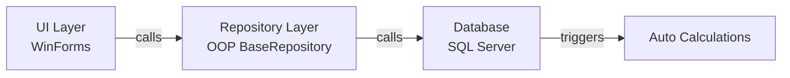

### How frmMain Works (SPA Pattern)

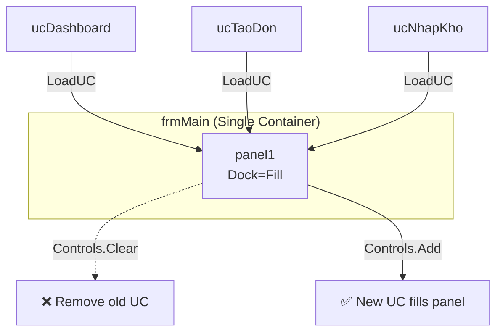

**The 3-line navigation engine:**
```csharp
panel1.Controls.Clear();
uc.Dock = DockStyle.Fill;
panel1.Controls.Add(uc);
```

### Reflection ORM Mapping

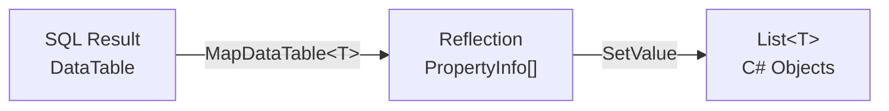

**Rule**: `Property Name` in C# **must equal** `Column Name` in SQL.

### Event Communication (Menu → frmMain → UC)

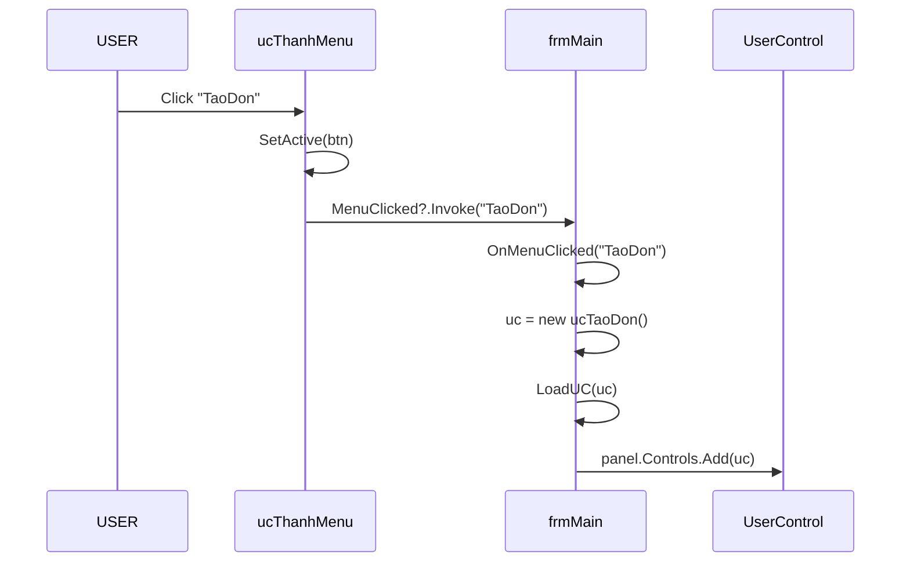

### Design Patterns Used

| Pattern | Where | Why |
|---------|-------|-----|
| **3-Layer** | UI → Repository → DB | Separation of concerns |
| **Repository (OOP)**| `BaseRepository<T>` | Code reuse, Inheritance, Polymorphism |
| **Transaction**| `*Repository.cs` | Atomic operations using `SqlTransaction` for data integrity |
| **Generic ORM** | `DatabaseHelper` | One generic method maps all Database results to C# Objects |
| **Singleton** | `SessionManager` | Global user state across the application |
| **Event-Driven** | `MenuClicked` | Decoupled navigation |
| **SPA WinForms** | `frmMain.Panel` | Swap pages smoothly without popping up multiple forms |

---

## Database Schema

### Entity Relationship Diagram

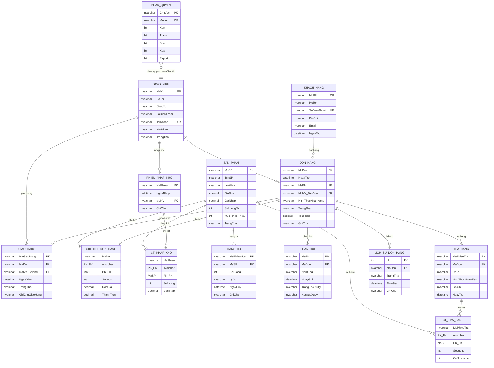

### Table Summary (14 tables)

| # | Table | Primary Key | Foreign Keys | Purpose |
|---|-------|------------|-------------|---------|
| 1 | NHAN_VIEN | MaNV | — | Employees (staff) |
| 2 | KHACH_HANG | MaKH | — | Customers |
| 3 | SAN_PHAM | MaSP | — | Products (flowers, accessories) |
| 4 | DON_HANG | MaDon | MaKH → KHACH_HANG, MaNV_TaoDon → NHAN_VIEN | Orders |
| 5 | CHI_TIET_DON_HANG | (MaDon, MaSP) | MaDon → DON_HANG, MaSP → SAN_PHAM | Order line items |
| 6 | GIAO_HANG | MaGiaoHang | MaDon → DON_HANG, MaNV_Shipper → NHAN_VIEN | Delivery tracking |
| 7 | PHIEU_NHAP_KHO | MaPhieu | MaNV → NHAN_VIEN | Inventory receipt headers |
| 8 | CT_NHAP_KHO | (MaPhieu, MaSP) | MaPhieu → PHIEU_NHAP_KHO, MaSP → SAN_PHAM | Inventory receipt line items |
| 9 | PHAN_HOI | MaPH | MaDon → DON_HANG | Customer feedback |
| 10 | LICH_SU_DON_HANG | Id | MaDon → DON_HANG | Order status history log |
| 11 | HANG_HU | MaPhieuHuy | MaSP → SAN_PHAM | Damaged/destroyed goods log |
| 12 | PHAN_QUYEN | (ChucVu, Module) | — | Role-based permissions |
| 13 | TRA_HANG | MaPhieuTra | MaDon → DON_HANG | Return headers |
| 14 | CT_TRA_HANG | (MaPhieuTra, MaSP) | MaPhieuTra → TRA_HANG, MaSP → SAN_PHAM | Return line items |

---

## Role-Based Access Control

The system supports 4 roles with granular permissions per module:

| Module | Admin | Cashier | Warehouse | Shipper |
|--------|-------|---------|-----------|---------|
| Dashboard | Full | View | View | View |
| DonHang (Orders) | Full | View/Add/Edit | — | — |
| KhoHang (Inventory) | Full | — | View/Add/Edit/Export | — |
| GiaoHang (Delivery) | Full | — | — | View/Edit |
| NhanVien (Staff) | Full | — | — | — |
| KhachHang (Customers) | Full | View/Add/Edit | — | — |
| SanPham (Products) | Full | View | View/Add/Edit | — |
| PhanQuyen (Permissions) | View/Add/Edit | — | — | — |
| BaoCao (Reports) | View/Export | — | — | — |
| TraHang (Returns) | View/Add/Edit | View/Add | — | — |
| PhanHoi (Feedback) | View/Add/Edit | View/Add | — | — |

Permissions are stored in the `PHAN_QUYEN` table with columns: `Xem` (View), `Them` (Add), `Sua` (Edit), `Xoa` (Delete), `Export`.

---

## Project Structure & Module Dependencies

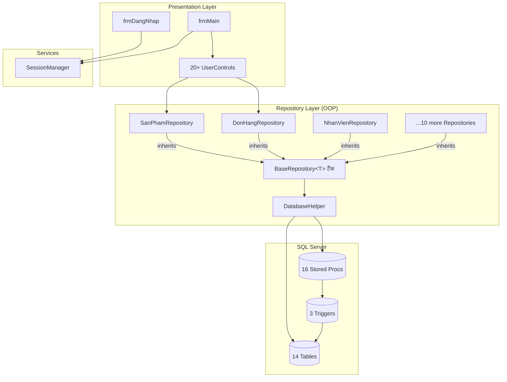

### File Organization by Namespace

| Folder | Contains | Count |
|--------|----------|-------|
| `1_DangNhap/` | Login Form + Change Password UC | 2 files |
| `2_QuanLy/` | Main Form + Dashboard + Staff UC | 3 files |
| `3_BanHang/` | Sales: Cart, Orders, Feedback, Returns | 6 files |
| `4_KhoHang/` | Inventory: Stock, Receipts, Damaged | 7 files |
| `5_GiaoHang/` | Delivery: Assignment, Tracking | 4 files |
| `6_BaoCao/` | Reports: Day, Month, Product, Staff | 6 files |
| `7_DanhMuc/` | Master Data: Products, Customers | 2 files |
| `DataAccess/` | BaseRepository, DatabaseHelper + 11 Repositories | 13 files |
| `Models/` | 11 Entity classes, BaseEntity, Enums, DTOs | 13 files |
| `Services/` | SessionManager | 1 file |
| `Shared/` | Navigation Menu + Permission UC | 2 files |

---

## Getting Started

### Prerequisites

- **Visual Studio 2019+** with .NET desktop development workload
- **SQL Server 2019+** (Developer or Express edition)
- **.NET Framework 4.7.2** (included in Windows 10+)

### Step 1: Create the Database

Open **SQL Server Management Studio (SSMS)** and execute the database script:

```sql
-- Run the full script
-- This will: CREATE DATABASE, CREATE TABLES, TRIGGERS, SPs, and sample data
```

Or from command line:
```bash
sqlcmd -S . -i FloriSys_Database.sql
```

### Step 2: Configure Connection String

Edit `App.config` if your SQL Server instance differs from the default:

```xml
<connectionStrings>
  <add name="FloriSys"
       connectionString="Server=.;Database=FloriSys;Integrated Security=True;TrustServerCertificate=True"
       providerName="System.Data.SqlClient" />
</connectionStrings>
```

Common configurations:
| Server | ConnectionString Server value |
|--------|------------------------------|
| Local default instance | `Server=.` |
| Named instance | `Server=.\SQLEXPRESS` |
| Remote server | `Server=192.168.1.100` |
| SQL Authentication | Add `User ID=sa;Password=yourpassword;` |

### Step 3: Build & Run

1. Open `FloriSys.slnx` in Visual Studio
2. Restore NuGet packages (if any)
3. Build the solution (Ctrl+Shift+B)
4. Run (F5)

### Default Login Accounts

All accounts use the password: **`123456**`

| Username | Role | Name |
|----------|------|------|
| `admin` | Admin | Nguyen Le Minh Vu |
| `thuhuong` | Cashier | Tran Thu Huong |
| `minhkho` | Warehouse | Le Minh Khoa |
| `shipper1` | Shipper | Nguyen Van Son |
| `xuanxuan` | Cashier (inactive) | Hoang Thi Xuan |

> Password is hashed with SHA-256 before being sent to the database. The hash of "123456" is `8d969eef6ecad3c29a3a629280e686cf0c3f5d5a86aff3ca12020c923adc6c92`.

---

## Key Business Flows

### Order Creation Flow (Transactional)

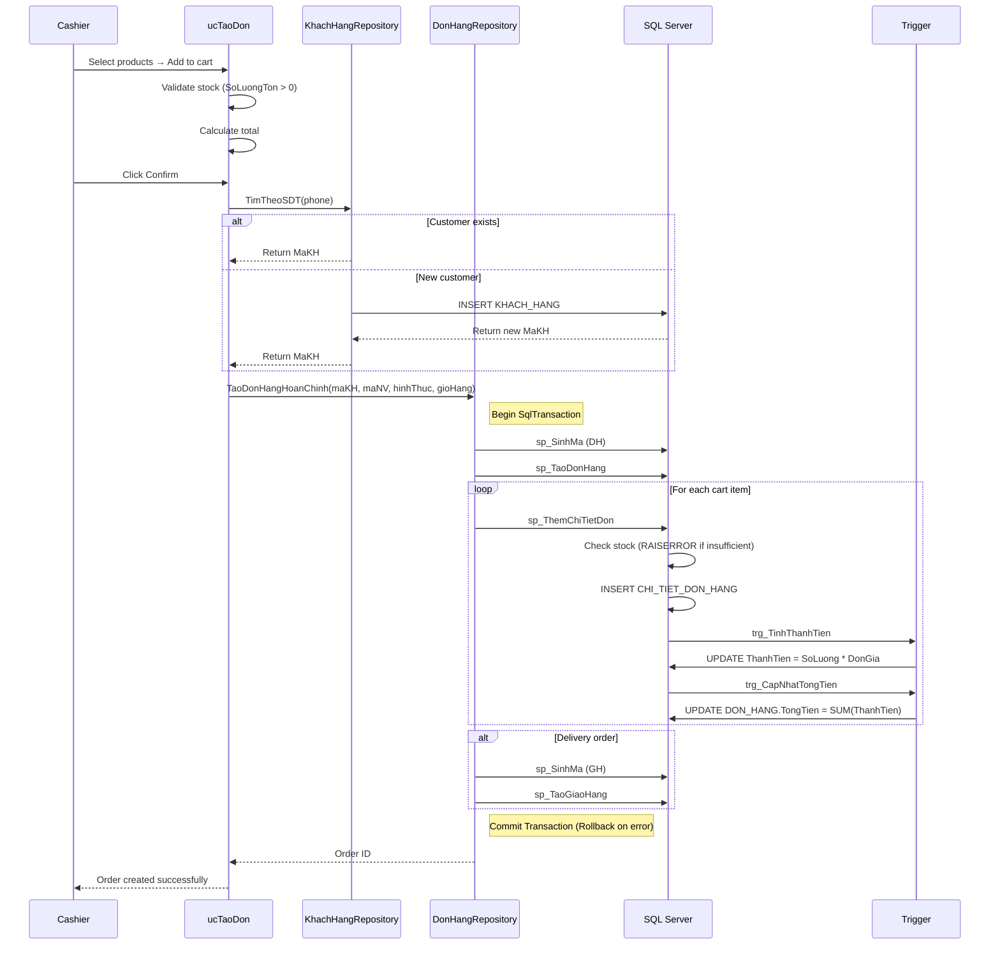

### Order Status State Machine

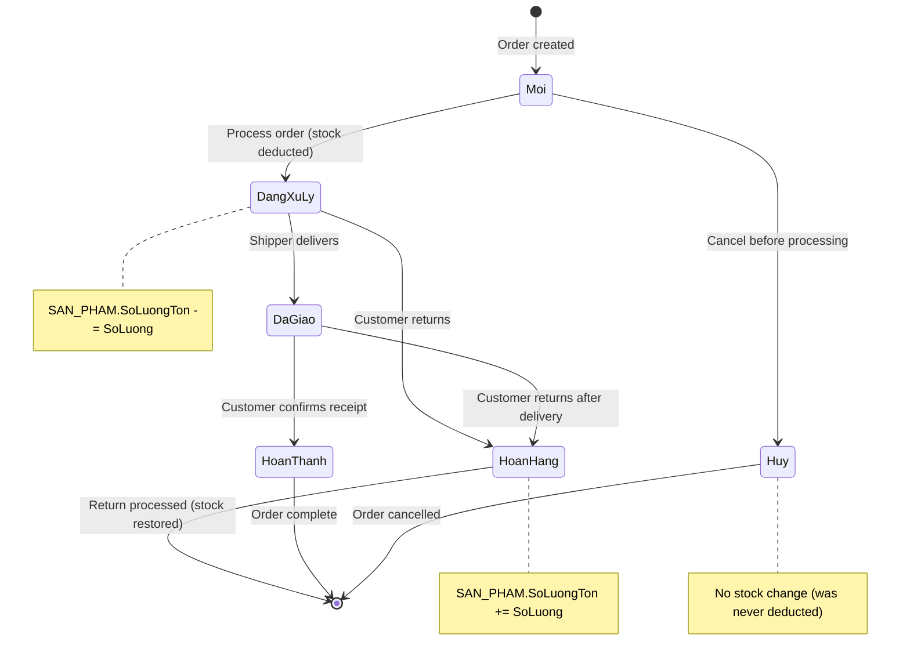

### Inventory Stock Flow

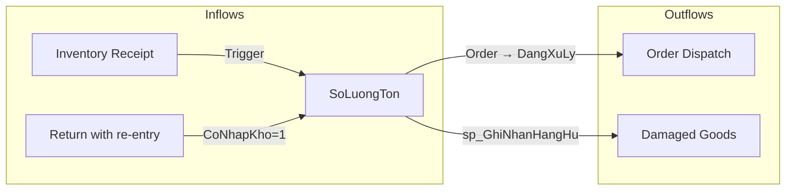

### The OOP Repository Architecture

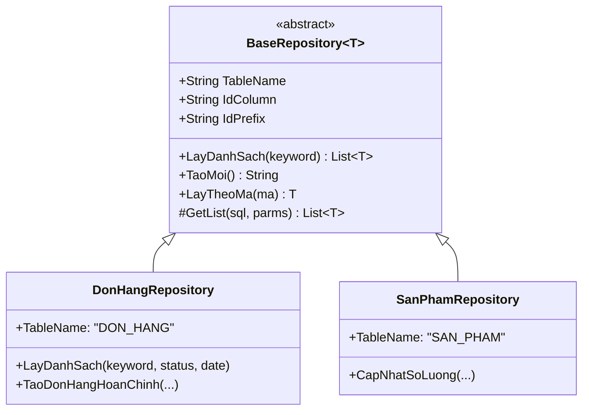

---

## Stored Procedures & Triggers

### Trigger Execution Flow

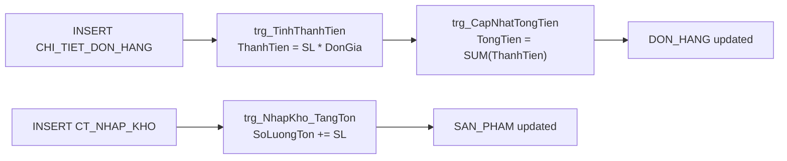

### Stored Procedures (19 total)

| Procedure | Purpose |
|-----------|---------|
| `sp_DangNhap` | Authenticate user |
| `sp_DoiMatKhau` | Change password |
| `sp_TaoDonHang` | Create order |
| `sp_ThemChiTietDon` | Add order line item |
| `sp_CapNhatTrangThaiDon` | Update order status + stock |
| `sp_TaoPhieuNhap` / `sp_ThemChiTietNhap` | Inventory receipt |
| `sp_GhiNhanHangHu` | Record damaged goods |
| `sp_TaoGiaoHang` / `sp_PhanCongShipper` / `sp_CapNhatTrangThaiGiao` | Delivery |
| `sp_GhiNhanPhanHoi` | Customer feedback |
| `sp_BaoCaoDoanhThuNgay` / `sp_BaoCaoDoanhThuThang` | Revenue reports |
| `sp_SanPhamBanChay` | Top 10 products |
| `sp_HieuSuatNhanVien` | Staff performance |
| `sp_CanhBaoTonKho` | Stock alerts |
| `sp_DoanhThuTheoNgayTrongThang` | Monthly chart data |
| `sp_SinhMa` | Auto-generate codes |

---

## Auto Code Generation

The system uses `sp_SinhMa` to generate unique codes for all entities:

| Entity | Prefix | Table | Column | Example |
|--------|--------|-------|--------|---------|
| Employee | `NV` | NHAN_VIEN | MaNV | NV000006 |
| Customer | `KH` | KHACH_HANG | MaKH | KH000005 |
| Product | `SP` | SAN_PHAM | MaSP | SP000009 |
| Order | `DH` | DON_HANG | MaDon | DH000006 |
| Receipt | `PN` | PHIEU_NHAP_KHO | MaPhieu | PN000002 |
| Delivery | `GH` | GIAO_HANG | MaGiaoHang | GH000004 |
| Feedback | `PH` | PHAN_HOI | MaPH | PH000002 |
| Return | `PT` | TRA_HANG | MaPhieuTra | PT000001 |
| Damaged | `HH` | HANG_HU | MaPhieuHuy | HH000001 |

**Algorithm**: `SELECT MAX(CAST(SUBSTRING(column, LEN(prefix)+1, 10) AS INT))` → increment by 1 → pad to 6 digits.

---

## License

This project is developed for educational purposes as part of a coursework assignment.
